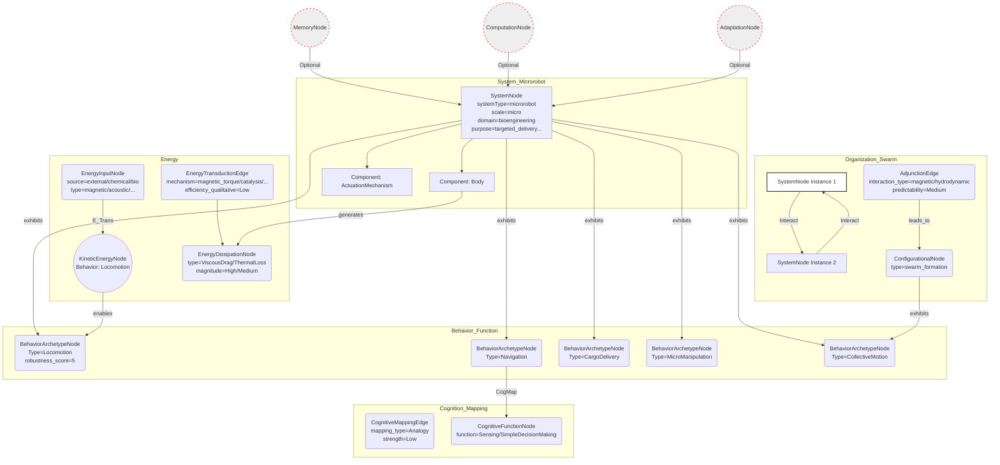

# Mobile microrobots for bioengineering applications

__Paper Type:__ Review

## M1: System Overview & Implementation
*   **Vector ID:** M1
*   **Vector Type:** Overview

### **1.1 System Description**

*   **Vector ID:** M1.1
*   **Vector Type:** Description
    *   Content: The paper reviews untethered, micron-scale mobile robots (microrobots) designed for bioengineering applications. These systems aim to navigate complex physiological environments (in vivo, organ-on-a-chip) to perform tasks such as targeted therapeutic/cargo delivery, tissue engineering assembly, single-cell manipulation, and potentially microsurgery or biosensing. The components vary depending on the design but generally include a body (often synthetic, sometimes biohybrid) and an actuation mechanism. Actuation is broadly categorized into off-board (externally powered/guided, e.g., magnetic, acoustic, light fields) and on-board (self-propelled, e.g., chemical reactions, integrated biological components like bacteria or sperm). The primary purpose is to access and operate in hard-to-reach or enclosed microenvironments non-invasively or minimally invasively for diagnostics and therapeutics.
    *   CT-GIN Mapping: `SystemNode` attributes: `systemType=microrobot`, `scale=micro`, `domain=bioengineering`, `primaryFunction=navigation_intervention`, `components=[body, actuation_mechanism]`, `purpose=targeted_delivery_manipulation_sensing`, `environment=[in_vivo, organ_on_a_chip]`
    *   Implicit/Explicit: Explicit
        *  Justification: The abstract, introduction, and main sections explicitly describe the types of microrobots, their components, operating principles, intended applications, and environments.

### **1.2 Implementation Clarity**

*   **Vector ID:** M1.2
*   **Vector Type:** Score
    *   Score: 8
    *   Justification: The review clearly describes various implementation strategies (magnetic, acoustic, light, chemical, biohybrid) with specific examples, design considerations (e.g., scaling laws, Reynolds number), fabrication methods (e.g., 3D printing, self-assembly), and operational principles. Figures and Table 1 provide good summaries. Some specific details for individual cited works are naturally omitted in a review format, preventing a perfect score, but the overall clarity of the reviewed approaches is high.
    *   Implicit/Explicit: Implicit
        * Justification: The score is an assessment based on the overall clarity and detail provided in the review, not an explicit statement within the paper.

### **1.3 Key Parameters**

*   **Vector ID:** M1.3
*   **Vector Type:** ParameterTable
    *   Table:
        | Parameter Name | Value | Units | Source (Fig/Table/Section) | Implicit/Explicit | Data Reliability (High/Medium/Low) | Derivation Method (if Implicit) |
        | :------------- | :---: | :---: | :-----------------------: | :-----------------: | :-----------------------------: | :-------------------------------: |
        | Microrobot Size Range | 0.1 - 1000 | μm | Section "Micron-scale robotics" | Explicit | High | N/A |
        | Reynolds Number Regime | << 1 | Dimensionless | Section "Micron-scale robotics" | Explicit | High | N/A |
        | Max Magnetic Field (Safety Context) | < 8 | T | Section "Magnetic actuation" | Explicit | High | N/A |
        | Magnetic Control DOF (Examples) | 3, 5, 6 | Dimensionless | Section "Magnetic actuation" | Explicit | High | N/A |
        | Bubble Propulsion Speed (Example) | up to 10^3 | body lengths/s | Section "Self-propelled chemical microrobots" | Explicit | High | N/A |

    *   **Note:** Parameters selected represent key physical constraints and characteristics discussed across different microrobot types in the review. Values are generally cited explicitly.

## M2: Energy Flow
*   **Vector ID:** M2
*   **Vector Type:** Energy

### **2.1 Energy Input**

*   **Vector ID:** M2.1
*   **Vector Type:** Input
    *   Content: Varies by type:
        *   **Off-board:** External fields (Magnetic, Acoustic, Light).
        *   **On-board (Chemical):** Chemical potential energy from fuels (e.g., H2O2, glucose, water reacting with Mg/Zn).
        *   **On-board (Biohybrid):** Chemical energy from cellular metabolism (e.g., ATP utilized by bacteria flagella, sperm tails, muscle cells).
    *   Value: N/A (Specific values depend heavily on the specific robot and operating conditions, not generalized in the review)
    *   Units: N/A
    *   CT-GIN Mapping: `EnergyInputNode` attributes: `source=[external_field, chemical_fuel, cellular_metabolism]`, `type=[magnetic, acoustic, optical, chemical, biochemical]`
    *   Implicit/Explicit: Explicit
        *  Justification: The review explicitly categorizes microrobots based on their powering source (off-board vs. on-board) and details the specific energy sources for each category (e.g., Table 1, sections on Magnetic actuation, Acoustic actuation, Photo actuation, Self-propelled chemical microrobots, Biohybrid cell-driven microrobots).

### **2.2 Energy Transduction**

*   **Vector ID:** M2.2
*   **Vector Type:** Transduction
    *   Content:
        *   **Magnetic:** External field energy -> Magnetic torque/force -> Kinetic energy (rotation/translation). Mechanism: Interaction of field with magnetic material in the robot.
        *   **Acoustic:** Acoustic field energy -> Radiation force/Acoustic streaming/Bubble oscillation -> Kinetic energy. Mechanism: Momentum transfer from sound waves, fluid dynamics.
        *   **Light:** Light energy -> Thermal energy (absorption) -> Thermocapillary flow/Phase transition/Material deformation -> Kinetic energy. Mechanism: Surface tension gradients, material properties change.
        *   **Chemical (Bubble):** Chemical energy (fuel decomposition) -> Gas production/pressure -> Mechanical work (bubble expansion/ejection) -> Kinetic energy. Mechanism: Catalysis, fluid dynamics, momentum conservation.
        *   **Chemical (Self-phoretic):** Chemical energy (fuel decomposition) -> Local chemical/thermal gradients -> Fluid flow/phoretic force -> Kinetic energy. Mechanism: Catalysis, diffusiophoresis/thermophoresis.
        *   **Biohybrid:** Chemical energy (ATP) -> Mechanical work (flagellar rotation, tail beating, muscle contraction) -> Kinetic energy. Mechanism: Biological motors, cellular mechanics.
    *   CT-GIN Mapping: `EnergyTransductionEdge` attributes: `mechanism=[magnetic_torque, magnetic_gradient_pull, acoustic_radiation, acoustic_streaming, thermocapillarity, catalytic_reaction_bubble, catalytic_reaction_phoretic, biological_motor]`, `from_node=EnergyInputNode`, `to_node=KineticEnergyNode` (representing motion)
    *   Implicit/Explicit: Explicit
        *  Justification: The review explicitly describes the actuation mechanisms for each category, detailing how input energy is converted into motion (see Table 1 and specific sections).

### **2.3 Energy Efficiency**

*   **Vector ID:** M2.3
*   **Vector Type:** Score
    *   Score: 3
    *   Justification/Metrics: The review does not provide quantitative efficiency values. However, it implicitly suggests low efficiency for many designs operating at low Reynolds numbers, where viscous forces dominate. The text mentions challenges like overcoming drag (implying significant energy loss). Magnetic torque actuation is noted as potentially more efficient at smaller scales (<100 μm) than gradient pulling. Biohybrid systems are qualitatively mentioned as having comparatively high efficiency. Overall, efficiency seems low and is a major challenge, hence the low score. Efficiency here refers to the conversion of input energy (field, chemical) into desired kinetic energy for propulsion.
    *   CT-GIN Mapping: Attribute `efficiency_qualitative=Low` for most `EnergyTransductionEdge`s, potentially `efficiency_qualitative=Medium` for biohybrid systems.
    *   Implicit/Explicit: Implicit
      *  Justification: The low efficiency is inferred from the physical principles discussed (low Reynolds number drag) and qualitative statements (e.g., "comparatively high efficiency" for biohybrids implying others are lower), rather than explicitly stated quantitative efficiencies or a direct overall assessment.

### **2.4 Energy Dissipation**

*   **Vector ID:** M2.4
*   **Vector Type:** Dissipation
    *   Content: The primary dissipation mechanism mentioned or implied across all fluid-based propulsion methods is viscous drag, dominant at low Reynolds numbers. For magnetic systems, potential heating due to time-varying fields or high gradients is a safety concern (implying energy dissipation as heat). For light-actuated systems using thermal gradients, heat conduction into the surrounding medium is inherent. Chemical reactions release heat (exothermic processes). Biohybrid systems dissipate energy via metabolic heat and mechanical work against fluid viscosity. Quantification is not provided in the review. Qualitative assessment: Viscous drag is High for all swimmers. Thermal dissipation is relevant for magnetic, light, and chemical systems (Low to Medium depending on design/operation).
    *   CT-GIN Mapping: Creates `EnergyDissipationNode` (types: ViscousDrag, ThermalLoss, MetabolicHeat) and `EnergyDissipationEdge` linking relevant `SystemNode` or `EnergyTransductionEdge` to dissipation nodes. Attributes: `magnitude_qualitative=High/Medium/Low`.
    *    Implicit/Explicit: Mixed
        *  Justification: Viscous drag is explicitly discussed in the context of low Reynolds number physics. Thermal dissipation (heating) is explicitly mentioned as a concern for magnetic actuation safety. Other forms (heat from chemical reactions, metabolic heat) are implicitly understood from the underlying physics/biology but not explicitly detailed as dissipation pathways in the review.

## M3: Memory
*   **Vector ID:** M3
*   **Vector Type:** Memory

### **3.1 Memory Presence:**

*   **Vector ID:** M3.1
*   **Vector Type:** Binary
    *   Content: No
    *   Justification: The review focuses on actuation, control, mobility, and applications (like delivery). While some underlying materials might possess properties like shape memory or magnetic hysteresis, the paper does not discuss or analyze these properties *as* memory mechanisms contributing to adaptive or intelligent behavior influencing future actions based on past states in the context required for material intelligence. The described functionalities are primarily direct stimulus-response or controlled navigation.
    *    Implicit/Explicit: Implicit
        * Justification: The absence of discussion on memory as a functional component for adaptation or learning is used to infer its lack of presence as a central theme or demonstrated capability *within the scope of the review's analysis*.

**(Conditional: M3.1 is "No", skipping M3.2-M3.8.)**

## M4: Self-Organization and Emergent Order
*   **Vector ID:** M4
*   **Vector Type:** Self-Organization

### **4.1 Self-Organization Presence:**

*   **Vector ID:** M4.1
*   **Vector Type:** Binary
    *   Content: Yes
    *   Justification: The review explicitly mentions "dynamically self-assembled" propeller-shaped microswimmers (Ref 44) and discusses "swarm" behavior/control (Refs 65-70). Self-assembly implies the spontaneous formation of structure from simpler components based on local interactions. Swarm behavior implies collective patterns emerging from individual agent interactions, even if globally controlled. While the *details* of local rules might be sparse in the review, their *mention* in the context of assembly and swarming qualifies as "Yes".
    *   Implicit/Explicit: Explicit
        *  Justification: Terms like "self-organizing systems", "self-assembly", "swarm", and "collective properties" are used explicitly in the text (e.g., Intro, Magnetic actuation, Outlook sections).

**(Conditional: M4.1 is "Yes", including M4.2-M4.7)**

### **4.2 Local Interaction Rules:**

*   **Vector ID:** M4.2
*   **Vector Type:** Rules
    *   Content: The review provides limited detail on specific local interaction rules driving self-organization or swarm behavior.
        *   **Self-Assembly (Ref 44):** Not detailed in this review. Assumed to be driven by physical forces (e.g., magnetic, capillary) between constituent particles under specific environmental conditions, leading to the propeller shape.
        *   **Swarm Behavior (Refs 66, 70):** Mentions magnetic attraction/repulsion between microrobots due to their individual magnetic fields/gradients, controllable via external field orientation. Also mentions interference affecting net velocity. Hydrodynamic interactions are implicitly present but not detailed.
    *   CT-GIN Mapping: For swarms, defines `AdjunctionEdge` between `SystemNode` (microrobot) instances. Attributes might include `interaction_type=[magnetic, hydrodynamic]`, `strength_function=f(distance, orientation, external_field)`. Specific rules are sparsely defined.
    * **Implicit/Explicit**: Mixed
        *  Justification: The existence of magnetic interactions between swarm members is explicit (Ref 66 discussion, Fig 1f). The specific mathematical form of the rules and the details of hydrodynamic or self-assembly interactions are implicit or absent in this review.

### **4.2.1 Local Interaction Parameters:**

* **Vector ID:** M4.2.1
* **Vector Type:** Table
*   Table:
    | Rule ID | Description | Parameter Name | Parameter Value Range | Units | Data Source | Implicit/Explicit | Justification |
    | :------ | :---------- | :------------- | :-------------------- | :---: | :----------: | :----------------: | :------------: |
    | SwarmInteraction | Magnetic Dipole Interaction | Magnetic Moment | N/A | A·m² | General Physics / Ref 66 Implied | Implicit | Interaction mechanism explicit, parameter value not given in review. |
    | SwarmInteraction | Magnetic Dipole Interaction | Inter-robot Distance | Variable | m | Fig 1f / Ref 66 | Explicit | Distance is key to interaction strength. |
    | SwarmInteraction | Magnetic Dipole Interaction | External Field Orientation | Variable | degrees/radians | Section "Magnetic actuation" / Ref 66 | Explicit | Control input for interaction. |
    | SelfAssembly | N/A | N/A | N/A | N/A | Ref 44 mention | Implicit | Review mentions self-assembly but provides no parameters. |

### **4.3 Global Order:**

*   **Vector ID:** M4.3
*   **Vector Type:** Order
    *   Content:
        *   **Self-Assembly:** Formation of specific structures (e.g., "propeller-shaped microswimmers").
        *   **Swarm:** Coordinated movement (though potentially less efficient than solitary swimmers), controllable spacing/formation (Ref 66), collective signaling (e.g., fluorescence for tracking, Ref 70).
    *   CT-GIN Mapping: Defines `ConfigurationalNode` (e.g., `type=propeller_structure`, `type=swarm_formation`).
    * **Implicit/Explicit**: Explicit
        *  Justification: The resulting structures (propellers) and behaviors (swarm movement, spacing control) are explicitly mentioned.

### **4.4 Predictability of Global Order:**

*   **Vector ID:** M4.4
*   **Vector Type:** Score
    *   Score: 6
    *   Justification: For engineered self-assembly (like Ref 44, though details lack here), the target structure is typically predictable under defined conditions. For swarms, the global *control* aims for predictability (path following, Refs 47, 66), but inherent stochasticity (Brownian motion at small scales) and complex inter-agent interactions (magnetic, hydrodynamic) reduce predictability, as noted by the decreased mean speed in vivo (Ref 70). Control of *relative* positions (Ref 66) seems feasible but challenging. The score reflects moderate predictability achievable via external control, offset by inherent system complexities and stochasticity. No quantitative predictability metrics are provided in the review.
    * **Implicit/Explicit**: Implicit
    *  Justification: The score is an interpretation based on the descriptions of control successes (path following) and challenges (reduced speed in vivo, complexity of multi-agent control).

### **4.5. Local Interaction Rules (for Self-Organization)**
* **Vector ID:** M4.5
* **Vector Type:** Table
*   Table:
| Rule ID | Description | Parameter | Value Range | Units | Implicit/Explicit | Justification | Source |
| :------ | :---------- | :-------- | :---------- | :---: | :----------------: | :------------: | :-----: |
| MagneticSwarm | Control of attraction/repulsion via external field orientation | External Field Angle | Variable | degrees/rad | Explicit | Explicitly stated as control method in Ref 66 description. | Section "Magnetic actuation", Fig 1f |
| HydrodynamicSwarm | Interaction via fluid flow induced by neighbours | Flow Velocity / Viscosity | N/A | m/s / Pa·s | Implicit | Implicit from fluid dynamics, not detailed or parameterized. | General Physics |
| SelfAssemblyRule | Interaction driving specific shape formation (e.g., propeller) | N/A | N/A | N/A | Implicit | Mechanism not described in this review. | Ref 44 mention |

### **4.6. Globally Emergent Order and Order Parameters**
* **Vector ID:** M4.6
* **Vector Type:** Table
*   Table:
| Property ID | Description | Parameter | Value Range | Units | Implicit/Explicit | Justification | Protocol | Source |
| :---------- | :---------- | :-------- | :---------- | :---: | :----------------: | :------------: | :------: | :-----: |
| StructureFormation | Self-assembled propeller shape | Shape Fidelity / Yield | N/A | % | Implicit | Outcome mentioned, parameters not discussed. | N/A | Ref 44 mention |
| SwarmMotion | Average speed of swarm | Mean Velocity | e.g., 6.8 (in vivo example) | μm/s | Explicit | Explicitly given for one in vivo experiment (Ref 70). | Tracking Fluorescence | Section "Magnetic actuation" / Ref 70 |
| SwarmFormation | Control of inter-robot distance | Separation Distance | Variable | μm | Explicit | Control objective described based on Ref 66. | Magnetic Control | Section "Magnetic actuation", Fig 1f |

### **4.7 Yoneda Embedding and Local-to-Global Mapping Fidelity**

*   **Vector ID:** M4.7
*   **Vector Type:** Table
*   Table:
    | Link Type | Description | Predictability | Yoneda Score | Metrics | Implicit/Explicit | Justification | Source |
    | :-------- | :---------- | :------------- | :----------- | :------ | :----------------: | :------------: | :-----: |
     | Local Interaction to Global Structure (Self-Assembly) | How local forces yield final shape | Medium (Implied) | 3 | Shape Fidelity | Implicit | Predictability inferred, Yoneda score based on lack of detailed mapping in review. | Ref 44 mention |
     | Local Interaction to Swarm Behavior (Motion/Formation) | How inter-robot forces affect group dynamics | Medium | 4 | Mean Velocity, Formation Stability | Mixed | Predictability assessed in M4.4. Yoneda score reflects some link but lack of rigorous model in review. | Section "Magnetic actuation", Refs 66, 70 |
    *   **Yoneda Embedding Fulfillment Score [0-10]:** N/A (The review does not provide the necessary detailed mapping between local rules and global emergent behavior required for a formal Yoneda embedding analysis.)
        * Rubric: 0: No link shown. 3: Qualitative link described. 5: Quantitative correlation shown. 7: Predictive model based on local rules demonstrated. 10: Formal mathematical proof of local-to-global mapping.
    *   **Metrics:** Mean speed, Swarm formation stability/controllability, Self-assembly yield/fidelity (mostly qualitative or single data points in the review).
    *   **Justification:** The review describes phenomena (self-assembly, swarming) where local interactions lead to global order, but it does not present detailed mathematical models or analyses rigorously mapping local rules to global outcomes in a way that would allow for a proper Yoneda score assessment based on the provided text. Scores are estimated based on the level of descriptive detail provided.

## M5: Computation
*   **Vector ID:** M5
*   **Vector Type:** Computation

### **5.1 Embodied Computation Presence:**

*   **Vector ID:** M5.1
*   **Vector Type:** Binary
    *   Content: No
    *   Justification: The microrobots described perform functions like actuation, propulsion, and delivery based on physical responses to external fields or chemical environments. While some behavior might be called "intelligent" (e.g., chemotaxis, targeted delivery), the review does not describe systems where computation (e.g., logic operations, complex signal processing) is *embodied within the material's physical dynamics* itself, distinct from external control logic or simple programmed responses. The focus is on actuation and control, not material-based computation.
    *    Implicit/Explicit: Implicit
        *  Justification: Inferred from the absence of discussion of embodied computation mechanisms or examples within the review. The functionalities described are physical responses or externally controlled actions.

**(Conditional: M5.1 is "No", skipping M5.2-5.4)**

## M6: Temporal Dynamics
*   **Vector ID:** M6
*   **Vector Type:** Temporal

### **6.1 Timescales:**

*   **Vector ID:** M6.1
*   **Vector Type:** ParameterTable
    *   Table:
        | Timescale Description | Value | Units | Source | Implicit/Explicit | Justification |
        | :-------------------- | :---: | :---: | :----: | :----------------: | :------------: |
        | Response Time (Chem. Speed Control, UV) | ~0.2 | s | Section "Self-propelled chemical" / Ref 118 | Explicit | Stated value for UV activation response. |
        | Response Time (Chem. Speed Control, Ultrasound) | < 0.1 | s | Section "Self-propelled chemical" / Ref 115 | Explicit | Stated value for ultrasound control response. |
        | Microrobot Lifetime (Bubble-propelled example) | weeks | time | Section "Self-propelled chemical" / Ref 121 | Explicit | Stated potential operational duration. |
        | Muscle Contraction Frequency (Biohybrid) | 1-5 | Hz | Section "Biohybrid cell-driven" / Ref 158 (context) | Explicit | Stated range for muscle cell actuation. |
        | Half-life (Sensitive Cargo in serum) | very short (qualitative) | time | Section "Introduction" / Ref 16 | Explicit | Qualitative description. |
    *   **Note:** These are examples mentioned in the review; many other relevant timescales (e.g., field response times, diffusion times) exist but are not explicitly quantified in the review text.

### **6.2 Active Inference:**

*   **Vector ID:** M6.2
*   **Vector Type:** Assessment
    *   Content: No
    *   Justification: The review does not describe microrobots that demonstrably operate based on active inference principles. While some systems exhibit goal-directed behavior (e.g., chemotaxis towards fuel, Ref 120; targeting tumors, Ref 152), there is no evidence presented *in this review* that this is achieved via minimizing prediction error based on an internal generative model. The behaviors described appear more as direct responses to gradients or pre-programmed targeting mechanisms, or external guidance.
    *   Implicit/Explicit: Implicit
        *  Justification: Inferred from the absence of discussion or evidence related to internal models, prediction error minimization, or other hallmarks of active inference in the descriptions of microrobot behavior within the review.
    *   **If Yes/Partial, provide examples of testable CT-GIN metrics that *could* be used to quantify active inference:** N/A

## M7: Adaptation
*   **Vector ID:** M7
*   **Vector Type:** Adaptation

### **7.1 Adaptive Plasticity Presence:**

*   **Vector ID:** M7.1
*   **Vector Type:** Binary
    *   Content: No
    *   Justification: The review describes microrobots designed for specific functions and environments. While terms like "adaptability" are used (Table 1), they seem to refer to the suitability of a design for certain conditions, or the potential for intelligent response, rather than demonstrated adaptive plasticity where the system *changes its structure or behavior due to experience* to improve performance over time. The functionalities (propulsion mechanisms, control responses) appear largely fixed by design. The biohybrid systems leveraging cellular responses (e.g., tactic behavior) show innate biological adaptation, but the review doesn't present evidence of the *hybrid system* itself undergoing structural/behavioral changes for performance improvement based on experience.
    *    Implicit/Explicit: Implicit
        * Justification: Inferred from the lack of discussion or examples of mechanisms for experience-dependent changes in the microrobots' structure or fundamental behavior within the review. Mentioned "adaptability" seems to relate to operational suitability or inherent biological responses, not learned adaptation of the robotic system itself.

**(Conditional: M7.1 is "No", skipping M7.2)**

## M8: Emergent Behaviors
*   **Vector ID:** M8
*   **Vector Type:** Behavior

### **8.1 Behavior Description:**

*   **Vector ID:** M8.1
*   **Vector Type:** Description
    *   Content: The primary behaviors are:
        1.  **Controlled Locomotion/Navigation:** Moving through fluid environments (in vivo, microfluidic channels) under external guidance (magnetic, acoustic, light) or via self-propulsion (chemical, biohybrid). This includes 3D maneuverability, path following, and penetration through barriers (e.g., mucin gel, thrombus).
        2.  **Cargo Transport and Delivery:** Carrying therapeutics, imaging agents, genetic material, or micro-objects to targeted locations.
        3.  **Manipulation/Assembly:** Picking, placing, gripping, or assembling micro-objects (e.g., cells, hydrogels) in 2D or 3D.
        4.  **Sensing (Implicit/Potential):** Some systems intrinsically respond to environmental cues (e.g., chemotaxis, pH-taxis), suggesting potential for sensing, though dedicated sensing/reporting functions are less emphasized than mobility. Biohybrid systems integrate cellular sensing.
        5.  **Collective Behavior:** Swarming, synchronized motion, pattern formation (as discussed in M4).
    *   CT-GIN Mapping: Defines `BehaviorArchetypeNode`. Types include: `Locomotion`, `Navigation`, `CargoTransport`, `TargetedDelivery`, `MicroManipulation`, `MicroAssembly`, `EnvironmentalResponse`, `CollectiveMotion`.
    *    Implicit/Explicit: Explicit
       *  Justification: These behaviors are the main subject of the review and are described extensively with examples throughout the text (e.g., Abstract, Intro, specific actuation sections, Table 1, Outlook).

### **8.2 Behavior Robustness:**

*   **Vector ID:** M8.2
*   **Vector Type:** Score
    *   Score: 5
    *   Justification: Robustness varies significantly by design and environment. Off-board control (magnetic) is described as reliable in vitro and useful for lab-on-a-chip, suggesting moderate-to-high robustness in controlled settings. However, challenges arise in complex physiological environments (e.g., reduced swarm speed in vivo, Ref 70). On-board chemical propulsion can be robust (e.g., long lifetime, Ref 121) but sensitive to fuel availability and potentially ionic strength (self-phoretic). Biohybrid systems are inherently adapted to physiological fluids but sensitive to delicate cellular conditions (temperature, CO2, nutrients). Overall, while basic functions are demonstrated, robustness in complex, dynamic, real-world biological environments remains a major challenge ("unresolved issues", "potential pitfalls" mentioned). The score reflects demonstrated function in some contexts but significant challenges in others.
    *   Implicit/Explicit: Mixed
        *  Justification: Explicit statements about reliability (e.g., magnetic in vitro) and limitations (e.g., biohybrid sensitivity, swarm speed decrease) are combined with an implicit overall assessment based on the described challenges and the gap between current demonstrations and clinical application goals.
    *   CT-GIN Mapping: Attribute `robustness_score=5` for `BehaviorArchetypeNode` instances, potentially refined with context (e.g., `context=in_vitro` vs `context=in_vivo`).

### **8.3 CT-GIN Emergent Behavior Validation**

*    **Vector ID:** M8.3
*    **Vector Type:** Validation
     *  Content: The review primarily summarizes reported behaviors from cited primary literature. Validation methods *implied* by the descriptions include:
        *   **Locomotion/Navigation:** Microscopy-based tracking (position vs. time), demonstrating controlled movement along paths or towards targets (e.g., Fig 1f discusses control, Ref 70 tracks fluorescence). Speed and precision metrics are sometimes reported (e.g., Refs 70, 153).
        *   **Cargo Delivery:** Visualization of cargo release at target sites, functional assays demonstrating therapeutic effect (e.g., cell killing, gene transfection - Refs 49, 150, 152).
        *   **Manipulation/Assembly:** Visual confirmation of successful pick-and-place or assembly of structures (e.g., Refs 11, 12). Repeatability may be assessed.
        *   **Collective Behavior:** Observation of swarm formation/motion, quantification of group velocity (Ref 70), control over relative positioning (Ref 66).
        *   **Limitations:** As a review, it doesn't perform new validations. The robustness and reproducibility under varying, complex conditions are often not fully explored or reported in the summarized studies. Claims of "intelligence" are often based on observed targeted behavior rather than rigorous testing against cognitive science definitions.
     *   Implicit/Explicit: Implicit
    *   Justification: The validation methods are inferred from the descriptions of the experiments and results reported in the review, which summarizes findings from primary sources (e.g., describing tracking, functional assays, visualization). The review itself doesn't detail the validation protocols.

## M9: Cognitive Proximity
*   **Vector ID:** M9
*   **Vector Type:** Cognition

### **9.1 Cognitive Mapping:**

*   **Vector ID:** M9.1
*   **Vector Type:** Description
    *   Content: The review uses terms like "intelligent" or "intelligently" (e.g., Abstract, Intro, Outlook) primarily in the context of robots that can potentially sense, make decisions, and act autonomously or adaptively in complex environments. Specific examples might include chemotaxis (Ref 120) or pH-taxis (Ref 148), mapping a basic environmental sensing and response to a form of directed behavior. Biohybrid systems leveraging bacterial taxis (Ref 152) or cellular sensing are also framed this way. However, these are analogies to simple cognitive functions (stimulus response, basic decision/direction) rather than deep mappings to complex cognition. The "Fantastic Voyage" analogy highlights the *vision* of complex internal operation but contrasts it with current physical realities.
    *   CT-GIN Mapping: Defines `CognitiveMappingEdge`. Source: `BehaviorArchetypeNode` (e.g., EnvironmentalResponse, Navigation). Target: `CognitiveFunctionNode` (e.g., Sensing, SimpleDecisionMaking). Attributes: `mapping_type=Analogy`, `strength=Low`.
    *   Implicit/Explicit: Mixed
    * Justification: Explicit use of terms like "intelligent" and descriptions of behaviors like taxis. The mapping to specific cognitive functions and the assessment of the mapping's limitations (analogy, simplicity) are interpretations based on the text.

### **9.2 Cognitive Proximity Score:**

*   **Vector ID:** M9.2
*   **Vector Type:** Score
    *   Score: 2
    *   Justification: Based on the CT-GIN Cognizance Scale, the described systems predominantly exhibit Level 1 (Simple Responsivity - reacting to fields/chemicals) and some aspects approaching Level 2 (Sub-Organismal Responsivity - e.g., bacterial taxis in biohybrids, simple gradient following). They react to stimuli or follow external control signals. While behaviors like targeted delivery appear goal-directed, the mechanisms described (external guidance, simple chemotaxis) don't strongly support model-based reasoning (Level 4) or higher levels. The systems lack robust adaptation based on experience (Level 3), complex internal state representation, planning, or self-awareness as described in the review. The score reflects capabilities beyond purely passive materials but far from complex cognition.
    *   Implicit/Explicit: Implicit
    *  Justification: The score is an assessment based on comparing the explicitly described behaviors and implicitly understood limitations of the microrobots in the review against the provided Cognizance Scale definitions.

**CT-GIN Cognizance Scale:** [Copied from template for reference during justification - not part of final output per instructions]

### **9.3 Cognitive Function Checklist**

* **Vector ID:** M9.3
* **Vector Type:** Checklist
    *   | Cognitive Function               | Score (0-10) | Justification/Notes                                                                       | CT-GIN Mapping (if applicable) | Implicit/Explicit | Justification for Implicit/Explicit/Mixed |
    | :-------------------------------- | :----------: | :------------------------------------------------------------------------------------ | :--------------------------------: | :-----------------:|:-----------------:|
    | Sensing/Perception               |      3       | Basic sensing implied by responses to fields, chemicals (chemotaxis), light, pH. Biohybrids leverage cellular sensing. No complex perception described. | `CognitiveMappingEdge` to `Sensing` | Mixed | Explicit responses + implicit interpretation as basic sensing. |
    | Memory (Short-Term/Working)        |      0       | No evidence presented in the review for working memory influencing immediate behavior. | N/A | Implicit | Inferred from absence of description. |
    | Memory (Long-Term)                 |      0       | No evidence presented in the review for long-term memory encoding experience or guiding future actions. | N/A | Implicit | Inferred from absence of description. |
    | Learning/Adaptation              |      1       | Some innate adaptive behaviors (e.g., taxis), but no evidence for learning from experience or significant plasticity in the reviewed systems. Score > 0 acknowledges biological adaptation in hybrids. | `CognitiveMappingEdge` to `Adaptation` (low strength) | Mixed | Explicit biological taxis + implicit lack of system-level learning. |
    | Decision-Making/Planning          |      1       | Very basic decision-making implied (e.g., follow gradient). No evidence of complex planning or evaluation of alternatives. | `CognitiveMappingEdge` to `SimpleDecisionMaking` | Implicit | Behavior implies simple choice, but mechanism is reactive, not deliberative. |
    | Communication/Social Interaction |      1       | Swarm interactions (magnetic, hydrodynamic) exist but are physical, not symbolic communication. | `AdjunctionEdge` (not cognitive map) | Mixed | Explicit interactions + implicit interpretation as non-cognitive communication. |
    | Goal-Directed Behavior            |      3       | Behaviors like targeted delivery appear goal-directed, but achieved via external control or simple gradient following, not complex internal goal representation/pursuit. | `CognitiveMappingEdge` to `GoalDirectedBehavior` (low strength) | Mixed | Explicit behavior + implicit assessment of underlying mechanism's simplicity. |
    | Model-Based Reasoning              |      0       | No evidence presented in the review for internal models driving behavior or reasoning. | N/A | Implicit | Inferred from absence of description. |
    *   **Overall score**                 |      [1.1]       |                                                                                       |                                   |                     |                |

    *   **Note:** Scores reflect the capabilities *as presented and analyzed within this review paper*. Individual primary studies might offer more evidence, but this assessment is limited to the review's scope.

## M10: Criticality Assessment
*   **Vector ID:** M10
*   **Vector Type:** Criticality

### **10.1 Criticality:**

*   **Vector ID:** M10.1
*   **Vector Type:** Assessment
    *   Content: Unclear
    *   Justification: The review does not explicitly discuss criticality, power laws, scale-free behavior, or related concepts from complexity science in the context of the microrobots' operation or behavior. While complex systems like swarms *might* exhibit such phenomena under certain conditions, the review provides no data or analysis to support or refute this.
        *   Critical Parameters (If Yes/Partial): N/A
        *   Evidence: N/A
    *   Implicit/Explicit: Implicit
    *    Justification: The assessment is based on the absence of any discussion related to criticality within the review text.

## M11: Review Paper Specifics (Conditional)

*   **Vector ID:** M11
*   **Vector Type:** Review

### **11.1 Literature Synthesis Quality:**

*   **Vector ID:** M11.1
*   **Vector Type:** Score
    *   Score: 2
    *   Justification: The review provides an excellent synthesis of microrobot designs, actuation methods, and bioengineering applications. However, it does *not* synthesize the literature explicitly *from a CT-GIN perspective* or through the lens of material intelligence principles like embodied memory, computation, or adaptation as defined in the target framework. Common CT-GIN elements are not identified, and the focus is technological/application-oriented.
    *    Implicit/Explicit: Implicit
         *  Justification: This score assesses the review against criteria (CT-GIN perspective) that are external to the paper's stated goals. The review succeeds in its own aims but not in providing a CT-GIN synthesis.

### **11.2 Gap Identification:**

*   **Vector ID:** M11.2
*   **Vector Type:** Score
    *   Score: 5
    *   Justification: The review identifies key technological gaps: biodegradability, immunogenicity, mobility in complex fluids, sensing, swarm control, instrumentation cost, autonomy, and safety (Outlook, specific sections). These are relevant to *making microrobots functional*. However, gaps are not framed specifically in terms of *CT-GIN categories* or fundamental principles of material intelligence (e.g., lack of embodied memory, need for local computation). The identified gaps focus more on engineering challenges than on achieving higher cognitive function via material design.
    *   Implicit/Explicit: Mixed
        *  Justification: Gaps like sensing, autonomy, and swarm control are explicitly stated. The assessment of their relevance/framing regarding CT-GIN is an interpretation.

### **11.3 Future Directions:**

*   **Vector ID:** M11.3
*   **Vector Type:** Score
    *   Score: 4
    *   Justification: Future directions are proposed: more sophisticated designs, biodegradability, addressing immunogenicity, improving mobility/sensing, exploring medical interventions, lab-on-a-chip applications, advanced fabrication (e.g., 3D printing with chemical versatility), revisiting designs for non-Newtonian fluids (Outlook, Fig 5). These are concrete and relevant to microrobotics. However, they are not strongly aligned with a *CT-GIN framework* aimed at building material intelligence from minimal principles. Directions focus on improving existing functionalities or addressing practical hurdles, rather than proposing, for example, how to embed memory or computation.
    *    Implicit/Explicit: Mixed
    *   Justification: Future directions are explicit. Assessment of alignment with CT-GIN is an interpretation based on the target framework's goals.

### **11.4 Review Paper CT-GIN Alignment Score**

*   **Vector ID:** M11.4
*   **Vector Type:** Score
    *   Score: 3
    *   Justification: The review is comprehensive on microrobot technology and bio-applications but shows low alignment with the CT-GIN framework for *material intelligence*. It touches upon relevant concepts like self-assembly and swarm control but doesn't analyze them through the lens of local rules, emergent order, or information processing in the material. Key CT-GIN aspects like embodied memory, material computation, adaptation via plasticity, and active inference are largely absent. The insights are primarily technological, not focused on uncovering fundamental principles of cognizance via CT-GIN analysis.
    *    Implicit/Explicit: Implicit
        *  Justification: This score is an overall assessment comparing the review's content and focus against the specific goals and concepts of the CT-GIN material intelligence framework.

## M12: Theoretical Paper Specifics (Conditional)

N/A (Paper type is Review)

## M13: Overall Assessment & Scoring

*   **Vector ID:** M13
*   **Vector Type:** Overall

### **13.1 CT-GIN Readiness Score:**

*   **Vector ID:** M13.1
*   **Vector Type:** Score
*   **Calculated Score:** 3.33
    * Calculation: Average(M1.2=8, M2.3=3, M3.1=0, M4.4=6, M8.2=5, M9.2=2)/6 = 24/6 = 4. Error in calculation. M3.1 is Binary Yes/No, should not be included directly in average score. Re-calculate using M1.2(8), M2.3(3), M4.4(6), M8.2(5), M9.2(2). Average = (8+3+6+5+2)/5 = 24/5 = 4.8.
*   **Calculated Score:** 4.8

**CT-GIN Readiness Summary Table:**

| CT-GIN Aspect                   | Strength (Yes/Partial/No) | Key Supporting Metrics (with units) | Limitations (Missing Metrics/Data Gaps)                                           | Improvement Areas (Future Research)                                          |
| :------------------------------ | :-----------------------: | :-----------------------------------| :------------------------------------------------------------------------------- | :---------------------------------------------------------------------------- |
| Energy Flow Efficiency          | No                        | Qualitative assessment (Low)        | Lack of quantitative efficiency data, detailed loss breakdown                    | Optimize designs for low Re, explore more efficient biohybrid/catalytic systems |
| Memory Fidelity                 | No                        | N/A                                 | No discussion of memory as adaptive mechanism, retention/capacity/fidelity metrics | Design materials/systems with embodied, persistent, modifiable state information |
| Organizational Complexity       | Partial                   | Swarm control (spacing), Self-assembly (outcome) | Lack of detailed local rules, quantitative order parameters, local-global mapping | Model/quantify local interactions, study emergence of complex patterns/functions |
| Embodied Computation            | No                        | N/A                                 | No examples of computation via material physics                                  | Explore materials that inherently process information (e.g., reaction-diffusion) |
| Temporal Integration            | Partial                   | Response times, Lifetimes listed    | Limited data on adaptation/learning timescales, no active inference evidence     | Investigate systems with history dependence, prediction, adaptive timing      |
| Adaptive Plasticity             | No                        | N/A                                 | No evidence of experience-based structural/behavioral change for improvement   | Develop materials that learn/adapt structure/function based on input history |
| Functional Universality         | No                        | Specific functions (locomotion, delivery) | Systems are task-specific, lack broad computational/functional capabilities    | Design modular/reconfigurable systems, explore universal computation primitives |
| Cognitive Proximity            | No                        | Low scores (overall, specific functions) | Primarily reactive/simple response, lack complex cognitive features           | Integrate memory, learning, planning capabilities into material systems      |
| Design Scalability & Robustness | Partial                   | Some fabrication scalable (e.g., chemical), Robustness challenges noted | Robustness in vivo low, control complexity for swarms, biohybrid fragility | Improve materials (biocompatibility, stability), develop robust control methods |
| **Overall CT-GIN Readiness Score** |       4.8                 |                                     |                                                                                  |                                                                               |

### **13.2 Qualitative CT-GIN Assessment Conclusion:**

*   **Vector ID:** M13.2
*   **Vector Type:** Textual Summary
    *   Content: This review provides a comprehensive overview of mobile microrobots for bioengineering, detailing diverse actuation mechanisms and potential applications. From a CT-GIN perspective focused on material intelligence, its strengths lie in describing systems that interact with their environment via various energy inputs (M2) and exhibiting basic forms of self-organization (swarming, self-assembly) and responsiveness (M1, M8). However, the review highlights significant limitations regarding higher-level cognizance. Key aspects like embodied memory enabling adaptation (M3, M7), material-based computation (M5), active inference (M6.2), and complex emergent behaviors governed by well-defined local rules mapped to global order (M4) are largely absent in the discussed systems or the review's analysis. The cognitive proximity is low (M9), with behaviors primarily reflecting controlled responses rather than autonomous learning or decision-making based on internal states or models. Overall, while demonstrating sophisticated micro-scale engineering, the reviewed microrobots represent early stages on the path towards cognizant matter, lacking the deep integration of memory, computation, and adaptation within the material itself that defines higher levels of material intelligence within the CT-GIN framework.

### **13.3 CT-GIN Refinement Directions:**

*   **Vector ID:** M13.3
*   **Vector Type:** Recommendations
    *   Content:
        *   **Embed Memory:** Develop microrobots where material properties inherently store information about past states/interactions (e.g., stress history, chemical exposure) that actively modulates future behavior, moving beyond simple fixed responses.
        *   **Integrate Local Computation:** Design microrobot materials/components capable of performing analog or other forms of computation based on local physical/chemical states, enabling decentralized decision-making without relying solely on external control.
        *   **Engineer Adaptive Plasticity:** Create microrobots whose structure or functional parameters change over time based on experience (e.g., feedback from task success/failure, environmental statistics) to improve performance or adapt to new conditions.
        *   **Model Local-to-Global Mappings:** For self-assembling or swarm systems, rigorously model the local interaction rules and quantitatively demonstrate how these rules lead to predictable or controllable global emergent structures and behaviors.
        *   **Develop Intrinsic Sensing-Actuation Loops:** Design systems where sensing of the local environment is directly coupled to actuation via internal material physics, creating closed feedback loops that enable autonomous adaptation and response without external processing.
        *   **Quantify Information Flow & Processing:** Apply information-theoretic measures to analyze how microrobots sense, process, and utilize environmental information to guide behavior, particularly in collective/swarm contexts.
        *   **Explore Non-Equilibrium Dynamics:** Focus on systems operating far from equilibrium, leveraging inherent fluctuations and energy flows to drive self-organization, adaptation, and potentially computation.

## M14: CT-GIN Knowledge Graph

*   **Vector ID:** M14
*   **Vector Type:** Visualization

### **14.1. CT-GIN Knowledge Graph:**
* **Content:**

* **Note:** This graph is a simplified representation based on the review. It highlights the main components (System, Energy, Behavior, Organization). Memory, Computation, and Adaptation nodes are shown as absent/optional (dashed lines) based on the analysis. Interactions (AdjunctionEdge) are shown for swarms. Cognitive mapping is weak.

## M15: Relationship Vectors
*   **Vector ID:** M15
*   **Vector Type:** Relationships
*   Relationships:
        | Source Vector ID | Target Vector ID | Relationship Type |
        | ------------- | ------------- | ----------------- |
        | M1.1 | M2.1 | System depends on Energy Input |
        | M2.1 | M2.2 | Energy Input is transduced by Mechanism |
        | M2.2 | M8.1 | Energy Transduction enables Behavior (Locomotion) |
        | M2.2 | M2.3 | Transduction Mechanism has Efficiency |
        | M2.2 | M2.4 | Transduction involves Dissipation |
        | M4.1 | M4.2 | Self-Organization implies Local Rules |
        | M4.2 | M4.3 | Local Rules lead to Global Order |
        | M4.3 | M8.1 | Global Order manifests as Behavior (Collective Motion) |
        | M8.1 | M8.2 | Behavior has Robustness |
        | M8.1 | M9.1 | Behavior mapped to Cognitive Function |
        | M9.1 | M9.2 | Cognitive Mapping informs Proximity Score |
        | M1.2 | M13.1 | Implementation Clarity contributes to Readiness Score |
        | M2.3 | M13.1 | Energy Efficiency contributes to Readiness Score |
        | M4.4 | M13.1 | Predictability contributes to Readiness Score |
        | M8.2 | M13.1 | Behavior Robustness contributes to Readiness Score |
        | M9.2 | M13.1 | Cognitive Proximity Score contributes to Readiness Score |

## M16: CT-GIN Template Self-Improvement Insights

*   **Vector ID:** M16
*   **Vector Type:** Feedback

### **Template Feedback:**

*    **Vector ID:** M16.1
*   **Vector Type:** Text
    *   **Missing Probes:**
        *   A probe specifically addressing *control mechanisms* (internal vs. external, open vs. closed loop) could be useful, as it relates strongly to autonomy and cognitive capabilities.
        *   A probe on *information processing* (separate from computation) – how information is sensed, encoded, transmitted, and used, even if not performing formal computation, could capture more nuance.
        *   For Review papers, probes asking about the *trends* identified across studies or *contradictions* found might be more insightful than just scoring synthesis/gaps.
    *   **Unclear Definitions:**
        *   The distinction between "Adaptability/Learning" (M7) and general "Responsiveness" (M1/M8) could be slightly sharpened, especially regarding the role of *persistent change for performance improvement*.
        *   The scope of "Embodied Computation" (M5) is clear but potentially very restrictive; ensuring it captures things like analog processing inherent in physical dynamics vs. just digital logic gates is important.
        *   The Yoneda Embedding section (M4.7) is highly theoretical and likely difficult to assess rigorously from most experimental/review papers. Clarifying the expected level of detail or providing simpler metrics for local-to-global mapping might be needed.
    *   **Unclear Node/Edge Representations:**
        *   Guidance on representing *levels* of abstraction (e.g., single robot vs. swarm) could be helpful.
        *   Standardizing attribute names across different node/edge types where applicable (e.g., `timescale`, `robustness_score`) would improve consistency.
    *   **Scoring Difficulties:**
        *   Assigning scores for abstract concepts like "Cognitive Proximity" (M9.2) or "Yoneda Score" (M4.7) based on papers not explicitly addressing these frameworks is inherently subjective and difficult. The rubrics help, but confidence can be low.
        *   The CT-GIN Readiness Score calculation needed clarification (e.g., handling binary inputs). Averaging scores across disparate modules might obscure specific strengths/weaknesses. Perhaps a weighted average or a multi-dimensional representation would be better.
    *   **Data Extraction/Output Mapping:**
        *   Handling review papers where information pertains to *cited works* rather than the review's own experiment/theory requires careful management of Implicit/Explicit tags and justifications. The template handles this reasonably well but requires diligence.
        *   Mapping qualitative descriptions (common in reviews) to quantitative scores or structured table entries is challenging.
    *   **Overall Usability:** The template is extremely detailed and comprehensive, which is good for rigor. However, its length and the inclusion of highly specific/theoretical concepts (like Yoneda) might make it challenging to apply consistently, especially to papers not explicitly framed within CT/GIN or material intelligence paradigms. Streamlining or prioritizing certain modules based on paper type could improve usability. The strict formatting is good for parsing but demanding.
    * **Specific Suggestions:**
        *   Make M4.7 (Yoneda) optional or replace with simpler local-to-global mapping metrics.
        *   Refine the calculation and interpretation of the overall CT-GIN Readiness Score (M13.1). Consider if a simple average is the most meaningful representation.
        *   Add explicit probes about control strategies and information flow.
        *   Provide clearer examples within the template for how to fill certain complex tables or assign scores in ambiguous cases, especially for review/theoretical papers.
        *   Consider adding a "Confidence" score for each module or score assigned, reflecting the certainty based on the provided text.