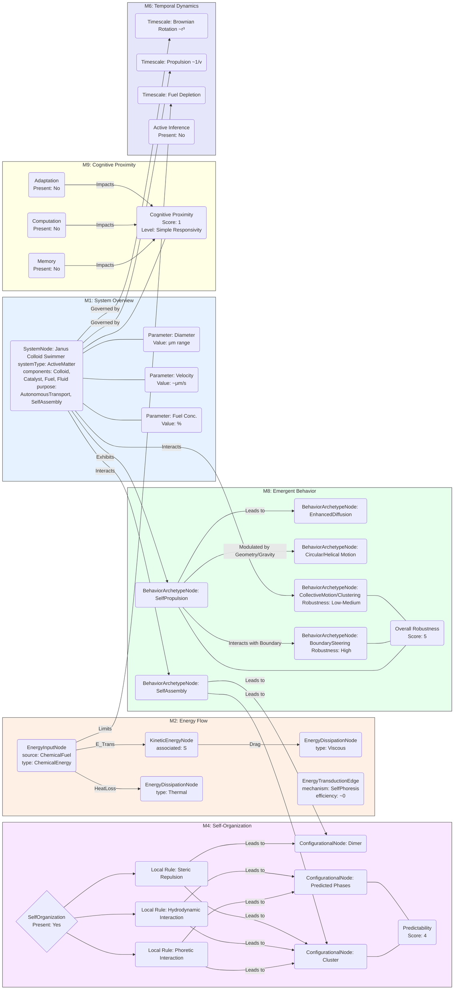

# Catalytic Janus Colloids: Controlling Trajectories of Chemical Microswimmers

__Paper Type:__ Hybrid

## M1: System Overview & Implementation
*   **Vector ID:** M1
*   **Vector Type:** Overview

### **1.1 System Description**

*   **Vector ID:** M1.1
*   **Vector Type:** Description
    *   Content: The system consists of catalytic Janus colloids, typically spherical microparticles (e.g., polystyrene) half-coated with a catalyst (e.g., Platinum). These colloids are placed in a fluid containing a chemical fuel (e.g., aqueous hydrogen peroxide). The catalyst asymmetrically decomposes the fuel, generating local gradients (e.g., concentration, electric field) that propel the colloid via phoretic mechanisms (self-phoresis). The primary purpose is to achieve autonomous motion ("swimming") at the microscale, enabling applications like targeted drug delivery, analyte gathering for diagnostics, microfluidic transport without external fields, and templating for materials science via self-assembly. The paper reviews methods to control the trajectories of these swimmers, both individually (e.g., using geometry, gravity, boundaries) and collectively (e.g., via chemical gradients, inter-particle interactions).
    *   CT-GIN Mapping: `SystemNode` attributes: `systemType`: `ActiveMatter`, `domain`: `Microfluidics`, `mechanism`: `SelfPhoresis`, `components`: [`ColloidSphere`, `CatalystLayer`, `Fuel`, `FluidMedium`], `purpose`: [`AutonomousTransport`, `SelfAssembly`, `ControlledMotion`, `Microfluidics`]
    *   Implicit/Explicit: Explicit
        *  Justification: The abstract, conspectus, introduction, and figures explicitly describe the components (Janus colloids, catalyst, fuel), the mechanism (catalytic decomposition, phoretic propulsion), and the intended applications/purpose. Fig 1a provides a schematic.

### **1.2 Implementation Clarity**

*   **Vector ID:** M1.2
*   **Vector Type:** Score
    *   Score: 8
    *   Justification: The paper clearly describes the general principle of catalytic Janus colloids and provides schematics (Fig 1a) and experimental trajectory examples (Fig 1b). Methods for fabricating Janus particles (e.g., metal evaporation, glancing angle deposition, Pickering emulsion) are mentioned or referenced. Key factors influencing motion (size, fuel concentration, geometry, gravity, boundaries) are discussed with supporting figures and references. While it's a review/account and doesn't detail specific experimental protocols for every result cited, the *concepts* of implementation are presented clearly. Some details on specific interaction mechanisms (e.g., exact nature of phoretic forces, hydrodynamic interactions) are complex and rely on references.
    *   Implicit/Explicit: Mixed
        * Justification: The basic concept and influencing factors are explicitly stated. Detailed protocols for specific experiments reviewed are implicit (found in cited works). The fundamental mechanism clarity relies on both explicit statements and cited theoretical/experimental work.

### **1.3 Key Parameters**

*   **Vector ID:** M1.3
*   **Vector Type:** ParameterTable
    *   Table:
        | Parameter Name        | Value           | Units        | Source (Fig/Table/Section) | Implicit/Explicit | Data Reliability (High/Medium/Low) | Derivation Method (if Implicit) |
        | :-------------------- | :-------------- | :----------- | :-----------------------: | :-----------------: | :-----------------------------: | :-------------------------------: |
        | Colloid Diameter (r)  | Variable (typ. μm) | μm        | Fig 1c, Fig 1d, Text      | Explicit          | High (from cited exp.)          | N/A                               |
        | Propulsion Velocity (v) | ~1/r dependent  | μm/s         | Fig 1c, Eq. implied       | Explicit          | High (from cited exp.)          | N/A                               |
        | H2O2 Concentration    | Variable (typ. %) | % (vol/vol)  | Fig 1c (caption), Text    | Explicit          | High (from cited exp.)          | N/A                               |
        | Angular Velocity (ω)  | Variable        | Hz or rad/s  | Fig 2b (ratio v/ω), Text  | Explicit          | High (from cited exp.)          | N/A                               |
        | Brownian Rotation Rate| ~1/r³ dependent | rad²/s or Hz | Text (implicitly D_r)     | Implicit          | Medium (Standard physics)       | Inferred from D_r = kT/(8πηr³)  |

## M2: Energy Flow
*   **Vector ID:** M2
*   **Vector Type:** Energy

### **2.1 Energy Input**

*   **Vector ID:** M2.1
*   **Vector Type:** Input
    *   Content: Chemical energy stored in the fuel (typically hydrogen peroxide, H2O2). The energy is released through catalytic decomposition reaction mediated by the catalyst (e.g., Platinum) on the Janus colloid surface.
    *   Value: N/A (Specific enthalpy of reaction not stated).
    *   Units: J/mol (Implicitly)
    *   CT-GIN Mapping: `EnergyInputNode`: attributes - `source`: `ChemicalFuel`, `type`: `ChemicalEnergy` (`H2O2Decomposition`)
    *   Implicit/Explicit: Explicit
        *  Justification: The text explicitly states that motion is driven by decomposing dissolved fuel (Conspectus, Intro), specifically mentioning hydrogen peroxide and platinum catalysis (Intro, Fig 1a caption, throughout).

### **2.2 Energy Transduction**

*   **Vector ID:** M2.2
*   **Vector Type:** Transduction
    *   Content: Chemical energy released from the catalytic decomposition of H2O2 is converted into kinetic energy of the colloid. The mechanism is self-phoresis: the asymmetric reaction creates local gradients (e.g., concentration of reactants/products, potentially ions leading to electric fields) around the particle. These gradients interact with the particle surface, generating a net force and/or torque that drives translational and/or rotational motion. A significant portion of the chemical energy is also dissipated as heat.
    *   CT-GIN Mapping: `EnergyTransductionEdge`: attributes - `mechanism`: `SelfPhoresis` (`ChemoMechanical`), `from_node`: `EnergyInputNode`, `to_node`: `KineticEnergyNode` (associated with `SystemNode`). Creates auxiliary `ThermalEnergyNode` via dissipation.
    *   Implicit/Explicit: Explicit
        *  Justification: The text explicitly identifies the process as catalytic decomposition driving motion via self-generated gradients (phoresis) (Conspectus, Intro, Fig 1a). The link between chemical reaction and motion is clearly stated.

### **2.3 Energy Efficiency**

*   **Vector ID:** M2.3
*   **Vector Type:** Score
    *   Score: 1
    *   Justification/Metrics: Extremely low. The paper does not quantify efficiency, but chemo-mechanical transduction in synthetic swimmers is notoriously inefficient. Most chemical energy released is dissipated as heat rather than converted into useful kinetic energy for propulsion. Efficiency (kinetic power output / chemical power input) is typically << 1%. Qualitative Assessment: Low.
    *   CT-GIN Mapping: Attribute `efficiency` of `EnergyTransductionEdge` (value near 0).
    *   Implicit/Explicit: Implicit
      *  Justification: Efficiency is not mentioned or quantified in the text. The low score is inferred based on general knowledge of similar active matter systems and the thermodynamics of nanoscale energy conversion.

### **2.4 Energy Dissipation**

*   **Vector ID:** M2.4
*   **Vector Type:** Dissipation
    *   Content: Major dissipation mechanisms include:
        1.  **Heat:** The catalytic decomposition of H2O2 is exothermic; most released chemical energy likely dissipates as heat into the surrounding fluid (Qualitative Assessment: High).
        2.  **Hydrodynamic Drag:** Energy is continuously dissipated due to viscous drag as the colloid moves through the fluid (Qualitative Assessment: High, necessary consequence of motion in fluid).
        3.  **Reaction Entropy:** Irreversible entropy production associated with the chemical reaction itself (Qualitative Assessment: Medium-High, inherent in chemical reactions).
        Quantification is not provided in the paper.
    *   CT-GIN Mapping: Creates `EnergyDissipationNode` (`Thermal`, `Viscous`) and `EnergyDissipationEdge`s from `EnergyInputNode` and `KineticEnergyNode` respectively. Edge attributes: `mechanism`: [`HeatGeneration`, `HydrodynamicDrag`].
    *    Implicit/Explicit: Implicit
        *  Justification: The paper does not explicitly discuss or quantify energy dissipation mechanisms. These mechanisms (heat from reaction, viscous drag) are fundamental physical processes inferred to be present and significant in this system.

## M3: Memory
*   **Vector ID:** M3
*   **Vector Type:** Memory

### **3.1 Memory Presence:**

*   **Vector ID:** M3.1
*   **Vector Type:** Binary
    *   Content: No
    *   Justification: The paper describes the motion of Janus colloids as being influenced by immediate environmental factors (fuel gradients, boundaries, gravity) and stochastic Brownian motion. There is no mention or evidence of any internal state change that persists over time to influence *future* behavior based on *past* experience or stimuli history in a way that constitutes learning or memory storage/retrieval. Interactions (like boundary steering or clustering) are based on current position and configuration, not stored past states.
    *    Implicit/Explicit: Implicit
        * Justification: The absence of memory is inferred from the lack of any description or evidence of memory mechanisms or phenomena in the text. The focus is on immediate stimulus-response and stochastic dynamics.

**(Conditional: M3.1 is "No", skipping M3.2-M3.8)**

## M4: Self-Organization and Emergent Order
*   **Vector ID:** M4
*   **Vector Type:** Self-Organization

### **4.1 Self-Organization Presence:**

*   **Vector ID:** M4.1
*   **Vector Type:** Binary
    *   Content: Yes
    *   Justification: The paper explicitly discusses self-organization phenomena. This includes the self-assembly of Janus colloids into dimers and larger agglomerates with varying rotational/translational motion depending on cap orientation (Fig 2a). It also discusses predicted collective behaviors like clustering (Fig 4b) and dynamic structures arising from inter-particle interactions (chemical gradients, hydrodynamics) in ensembles of swimmers (Fig 4a). This order emerges from local interactions without external templating of the global structure.
    *   Implicit/Explicit: Explicit
        *  Justification: Figure 2a shows self-assembly, Section "CIRCLES AND SPIRALS" explicitly discusses self-assembly into agglomerates. Section "CHEMICAL GRADIENTS AND COLLECTIVE BEHAVIOR" discusses collective organization, clustering (Fig 4b), and theoretically predicted phases (Fig 4a).

**(Conditional: M4.1 is "Yes", including M4.2-M4.7)**

### **4.2 Local Interaction Rules:**

*   **Vector ID:** M4.2
*   **Vector Type:** Rules
    *   Content: The paper discusses several local interaction mechanisms contributing to self-organization and collective behavior:
        1.  **Phoretic Interactions:** Colloids interact via the chemical gradients (fuel/product concentration) they create and respond to. Particles can be attracted or repelled depending on their nature ("chemotaxis"). (Mentioned in "CHEMICAL GRADIENTS AND COLLECTIVE BEHAVIOR", refs 51, 53, 55).
        2.  **Hydrodynamic Interactions:** Moving colloids generate flow fields (Fig 4c) that affect nearby colloids. These are approximated as "pusher" or "puller" types in far-field models, but near-field complexities exist (Fig 4c discussion, refs 62, 69).
        3.  **Steric Interactions:** Simple excluded volume effects prevent overlap. (Implicit).
        4.  **Conventional Colloidal Interactions:** Background forces like van der Waals or electrostatic interactions may play a role, although not the focus here. (Mentioned implicitly as background physics).
        Specific equations governing these interactions are not provided in this review but are referenced (e.g., refs 51, 53, 62, 69). The rules lead to alignment/misalignment of caps in dimers (Fig 2a) and collective clustering/pattern formation (Fig 4a, 4b).
    *   CT-GIN Mapping: Defines `InteractionEdge` types: `PhoreticInteraction`, `HydrodynamicInteraction`, `StericRepulsion`, `ColloidalForce`. Edge attributes would include distance dependence, strength parameters (related to fuel concentration, particle mobility, etc.). These form `AdjunctionEdge`s in CT terms.
    * **Implicit/Explicit**: Mixed
        *  Justification: The types of interactions (phoretic, hydrodynamic) are explicitly named. The detailed mathematical rules are implicit (contained in cited works like refs 51, 53, 62, 69). The outcome of these rules (clustering, dimer formation) is explicitly shown/discussed.

### **4.2.1 Local Interaction Parameters:**

* **Vector ID:** M4.2.1
* **Vector Type:** Table
*   Table:
    | Rule ID                 | Description                       | Parameter Name        | Parameter Value Range | Units          | Data Source                  | Implicit/Explicit | Justification                                  |
    | :---------------------- | :-------------------------------- | :-------------------- | :-------------------- | :------------- | :--------------------------- | :----------------: | :--------------------------------------------- |
    | Phoretic Interaction    | Chemotactic response to gradients | Chemotactic coefficient| N/A                   | Varies         | Text (refs 51, 53, 55)       | Implicit          | Concept mentioned, value not given.            |
    | Hydrodynamic Interaction| Fluid flow generated by swimmer  | Flow field strength   | N/A                   | e.g., μm²/s    | Fig 4c, Text (ref 69)        | Mixed             | Field visualized, quantitative value not provided. |
    | Cap Alignment (Dimers)  | Relative orientation of caps      | Alignment Angle       | N/A                   | degrees/radians| Fig 2a                       | Explicit          | Schematically shown, specific range N/A.       |

### **4.3 Global Order:**

*   **Vector ID:** M4.3
*   **Vector Type:** Order
    *   Content: The paper describes observed and predicted global order:
        1.  **Dimers/Agglomerates:** Small clusters form via self-assembly (Fig 2a).
        2.  **Dynamic Clusters:** Experimental observations show clustering phenomena (Fig 4b, refs 66, 67).
        3.  **Predicted Collective Phases:** Theoretical work predicts a wide range of configurations including dynamic oscillating structures, self-motile "molecules", and various phases depending on chemical/kinetic parameters (Fig 4a, refs 24, 51, 55, 58-65).
        4.  **Convective Flow:** At high volume fractions, symmetrical catalytic colloids induce collective circulating flows (ref 70).
    *   CT-GIN Mapping: Defines `ConfigurationalNode` types: `Dimer`, `Cluster`, `DynamicPattern`, `ConvectiveRoll`. Attributes could include size, density, correlation length, order parameters.
    * **Implicit/Explicit**: Explicit
        *  Justification: Self-assembled dimers/agglomerates (Fig 2a), observed clusters (Fig 4b), and predicted phases (Fig 4a) are explicitly discussed and visualized. Convective flow is explicitly mentioned (ref 70).

### **4.4 Predictability of Global Order:**

*   **Vector ID:** M4.4
*   **Vector Type:** Score
    *   Score: 4
    *   Justification: The formation of simple structures like dimers appears somewhat predictable based on random encounters and subsequent interaction dynamics (Fig 2a). However, the paper emphasizes that the breadth of theoretically predicted collective behaviors (Fig 4a) has *not* yet been reliably accessed or controlled in experiments. Observed clustering (Fig 4b) appears robust under certain conditions, but controlling the specific type of collective order is presented as a challenge. Predictability is limited by the complexity of interactions (hydrodynamic, chemical, colloidal) and stochastic effects. Theory predicts distinct phases, suggesting high predictability *if* parameters could be precisely controlled, but experimentally this is low.
    * **Implicit/Explicit**: Mixed
    *  Justification: The difficulty in experimentally verifying/controlling the theoretically predicted range of behaviors is explicitly stated (Conspectus, Section "CHEMICAL GRADIENTS..."). Predictability of simple assembly (dimers) is implied by observations. The low score reflects the explicit statements about experimental challenges vs theoretical potential.
    *   CT-GIN Mapping: `AdjunctionEdge` weight/attribute reflecting predictability. `ConfigurationalNode` attribute `predictability_score`.

### **4.5. Local Interaction Rules (for Self-Organization)**
* **Vector ID:** M4.5
* **Vector Type:** Table
*   Table:
| Rule ID                 | Description                              | Parameter           | Value Range | Units   | Implicit/Explicit | Justification                                       | Source              |
| :---------------------- | :--------------------------------------- | :------------------ | :---------- | :------ | :----------------: | :-------------------------------------------------- | :------------------ |
| Phoretic Attraction/Repulsion| Interaction via chemical gradients     | Interaction Strength| N/A         | N/A     | Implicit          | Concept discussed, specific parameters not given. | Text (refs 51, 53)|
| Hydrodynamic Interaction | Interaction via swimmer-induced flow fields | Flow dipole strength| N/A         | N/A     | Implicit          | Concept discussed, specific parameters not given. | Text (refs 62, 69)|
| Dimer Formation         | Binding/alignment of two colloids        | Relative Cap Angle  | N/A         | degrees | Explicit          | Visualized in Fig 2a, range not quantified.     | Fig 2a, Text (ref 44)|

### **4.6. Globally Emergent Order and Order Parameters**
* **Vector ID:** M4.6
* **Vector Type:** Table
*   Table:
| Property ID   | Description           | Parameter                 | Value Range | Units    | Implicit/Explicit | Justification                                       | Protocol             | Source                 |
| :------------ | :-------------------- | :------------------------ | :---------- | :------- | :----------------: | :-------------------------------------------------- | :------------------- | :--------------------- |
| Clustering    | Formation of aggregates | Cluster Size / Density    | N/A         | N/A      | Explicit          | Observed (Fig 4b), range not specified.             | Microscopy           | Fig 4b, Text (ref 67)|
| Phase Diagram | Theoretical prediction  | Chemical/Kinetic Parameters | N/A         | N/A      | Explicit          | Regions mapped theoretically, ranges not specified. | Analytical Theory    | Fig 4a, Text (ref 51)|
| Convection    | Collective fluid flow | Flow Velocity / Pattern | N/A         | μm/s, etc | Explicit          | Observed (ref 70), value/range not specified.     | Tracer Particle Vel. | Text (ref 70)          |

### **4.7 Yoneda Embedding and Local-to-Global Mapping Fidelity**

*   **Vector ID:** M4.7
*   **Vector Type:** Table
*   Table:
    | Link Type                     | Description                                        | Predictability   | Yoneda Score | Metrics | Implicit/Explicit | Justification                                                                     | Source         |
    | :---------------------------- | :------------------------------------------------- | :--------------- | :-----------: | :------ | :----------------: | :-------------------------------------------------------------------------------- | :------------- |
    | Local Interaction -> Clustering | Phoretic/Hydrodynamic forces lead to aggregation   | Low (Experimentally) | 2           | N/A     | Mixed             | Rules exist (theory), but complex interplay makes prediction difficult experimentally. | Text, Fig 4b, 4a |
    | Dimer Assembly -> Motion      | Relative cap orientation determines rotation/trans. | Medium           | 4           | N/A     | Explicit          | Clear correlation shown (Fig 2a), but initial assembly is stochastic.            | Fig 2a         |
    *   **Yoneda Embedding Fulfillment Score [0-10]:** 3 (Rubric: 0=No mapping; 2=Qualitative link; 4=Partial quantitative link; 6=Good quantitative link; 8=Predictive model; 10=Fully characterized functorial map). The paper establishes qualitative links (interactions -> aggregation; geometry -> motion) and some quantitative relationships (theory predicts phases), but a rigorous, predictive local-to-global map validated experimentally across diverse conditions is lacking, especially for complex collective behavior.
    *   **Metrics:** N/A (Specific metrics for Yoneda embedding fidelity are not used in the paper). Potential metrics could involve comparing simulated global states based on local rules with experimental observations across parameter space.
    *   **Justification:** The mapping from local interactions to global emergent order (like specific cluster shapes or dynamic patterns beyond simple dimers) is identified as a key challenge where theory outpaces experimental verification. While local rules are implicitly known (physics), their combined effect leading to predictable global order is not fully established experimentally across the predicted range.

## M5: Computation
*   **Vector ID:** M5
*   **Vector Type:** Computation

### **5.1 Embodied Computation Presence:**

*   **Vector ID:** M5.1
*   **Vector Type:** Binary
    *   Content: No
    *   Justification: The system responds to environmental cues (chemical gradients, boundaries), which involves processing physical information. However, this processing is a direct consequence of the physical interaction laws (phoresis, hydrodynamics, excluded volume) rather than representing a programmable or logic-based computation performed *by the material* to arrive at a decision distinct from the immediate physical response. Boundary steering, for example, is a physical guidance effect, not an algorithmic computation. There's no evidence of logic gates, arithmetic operations, or complex information processing intrinsic to the colloid's function beyond stimulus-response.
    *    Implicit/Explicit: Implicit
        *  Justification: The absence of embodied computation is inferred from the lack of any description of computational elements, logic operations, or information processing tasks performed by the material itself. The focus is on physical mechanisms of propulsion and interaction.

**(Conditional: M5.1 is "No", skipping M5.2-5.4)**

## M6: Temporal Dynamics
*   **Vector ID:** M6
*   **Vector Type:** Temporal

### **6.1 Timescales:**

*   **Vector ID:** M6.1
*   **Vector Type:** ParameterTable
    *   Table:
        | Timescale Description     | Value                   | Units    | Source         | Implicit/Explicit | Justification                                                                 |
        | :------------------------ | :---------------------- | :------- | :------------- | :----------------: | :---------------------------------------------------------------------------- |
        | Brownian Rotation Time (τ_r)| Scales as ~r³           | s        | Text (implicit)| Implicit          | Characteristic timescale for loss of orientation correlation, D_r ~ 1/τ_r.    |
        | Ballistic Motion Regime   | Short                   | s        | Text (implicit)| Implicit          | Time before τ_r dominates, displacement ~ vt.                                   |
        | Diffusive Motion Regime   | Long (> τ_r)            | s        | Text (implicit)| Implicit          | Time after τ_r, motion becomes random walk like, displacement ~ sqrt(t).      |
        | Propulsion Velocity       | ~μm/s                   | μm/s     | Fig 1c         | Explicit          | Inverse of time to travel 1 μm ballistically.                                |
        | Angular Velocity (Driven) | Up to 2.5 Hz (observed) | Hz       | Text (Sec: Circles)| Explicit          | Characteristic time for one rotation (1/f).                                   |
        | Fuel Depletion Time       | Variable                | s to hrs | Text (Drawbacks) | Explicit          | Timescale over which fuel is consumed, limiting operation duration.          |

### **6.2 Active Inference:**

*   **Vector ID:** M6.2
*   **Vector Type:** Assessment
    *   Content: No
    *   Justification: The paper does not provide any evidence that the Janus colloids operate based on active inference. Their behavior is described as a response to immediate local environmental cues (gradients, boundaries) and stochastic forces (Brownian motion). There is no indication of internal predictive models, minimization of prediction error, or goal-directed action selection based on anticipating future states. The motion towards higher fuel concentration (ref 55) is described as chemotaxis/diffusiophoresis, a reactive mechanism, not active inference.
    *   Implicit/Explicit: Implicit
        *  Justification: Inferred from the absence of any discussion related to predictive models, free energy minimization principles (in the active inference sense), or goal-directed planning within the description of colloid behavior.
    *   **If Yes/Partial, provide examples of testable CT-GIN metrics that *could* be used to quantify active inference:** N/A

## M7: Adaptation
*   **Vector ID:** M7
*   **Vector Type:** Adaptation

### **7.1 Adaptive Plasticity Presence:**

*   **Vector ID:** M7.1
*   **Vector Type:** Binary
    *   Content: No
    *   Justification: The Janus colloids described do not exhibit adaptive plasticity. They do not change their intrinsic properties (size, shape, catalytic activity, surface properties) or behavioral rules (response to gradients, interaction potentials) over time based on experience or environmental history to improve performance or alter function. While their *trajectories* change based on interactions (e.g., boundary steering, clustering), the underlying *rules* governing their behavior remain fixed. Self-assembly changes the configuration, but it's driven by immediate interactions, not a learned adaptation for improved function.
    *    Implicit/Explicit: Implicit
        * Justification: Inferred from the absence of any description of learning, structural modification based on history, or changes in behavioral rules over time. The system's properties are presented as fixed post-fabrication.

**(Conditional: M7.1 is "No", skipping M7.2)**

## M8: Emergent Behaviors
*   **Vector ID:** M8
*   **Vector Type:** Behavior

### **8.1 Behavior Description:**

*   **Vector ID:** M8.1
*   **Vector Type:** Description
    *   Content: The primary behavior is **autonomous directed motion (self-propulsion)** driven by catalytic fuel decomposition. Several emergent behaviors arise from this basic function and interactions:
        1.  **Enhanced Diffusion:** At long timescales, random reorientation leads to diffusive-like motion with an enhanced diffusion coefficient compared to passive colloids.
        2.  **Circular/Helical Trajectories:** Introduced rotational propulsion (due to cap asymmetry or self-assembly) combined with translation leads to circular paths. Gravity can further align these into helical trajectories (gravitaxis).
        3.  **Boundary Steering/Guidance:** Colloids follow edges, trenches, or posts due to hydrodynamic and steric interactions, enabling transport along defined paths.
        4.  **Chemotaxis/Diffusiophoresis:** Directed motion up or down chemical gradients.
        5.  **Self-Assembly:** Formation of dimers and clusters with distinct collective motile properties.
        6.  **Collective Motion/Clustering:** Aggregation and potentially coordinated movement in groups (observed clustering, theoretically predicted dynamic patterns).
    *   CT-GIN Mapping: Defines `BehaviorArchetypeNode` types: `SelfPropulsion`, `EnhancedDiffusion`, `CircularMotion`, `HelicalMotion`, `BoundarySteering`, `Chemotaxis`, `SelfAssembly`, `CollectiveMotion`, `Clustering`.
    *    Implicit/Explicit: Explicit
       *  Justification: All listed behaviors are explicitly described in the text and often illustrated with figures (e.g., Fig 1b trajectory, Fig 2a self-assembly & rotation, Fig 2c helices, Fig 3 boundary steering, Fig 4b clustering).

### **8.2 Behavior Robustness:**

*   **Vector ID:** M8.2
*   **Vector Type:** Score
    *   Score: 5
    *   Justification: Robustness varies significantly between behaviors.
        *   *Self-propulsion* itself is robust as long as fuel is present.
        *   *Directionality* (persistence) of individual swimmers is low due to Brownian rotation, especially for smaller colloids (Fig 1d). (Low Robustness).
        *   *Circular/helical motion* due to designed asymmetry (glancing angle) can be well-defined (Fig 2b), but sensitivity to fabrication variations might exist. Helices are sensitive to rotational axis alignment relative to gravity (Fig 2c). (Medium Robustness).
        *   *Boundary steering* appears relatively robust for well-defined geometries (trenches, edges - Fig 3), providing a reliable guidance mechanism. (High Robustness).
        *   *Self-assembly* into specific structures (dimers) occurs, but the initial orientation is random (Fig 2a). (Medium Robustness for dimer formation, Low for specific orientation).
        *   *Collective behavior/clustering* is sensitive to parameters (concentration, particle properties, chemical gradients, hydrodynamics), and controlling specific collective states reliably is presented as a challenge. (Low-Medium Robustness experimentally).
        The score reflects an average, acknowledging robust guidance mechanisms alongside sensitive individual and collective behaviors.
    *   Implicit/Explicit: Mixed
        *  Justification: The sensitivity of individual trajectories to Brownian motion is explicit (Fig 1d discussion). The potential and challenges of controlling collective behavior are explicit. The effectiveness of boundary steering is explicitly demonstrated (Fig 3). Robustness of specific fabrication methods (glancing angle) is implied by producing well-defined ratios (Fig 2b).
    *   CT-GIN Mapping: Attribute `robustness_score` for each `BehaviorArchetypeNode`.

### **8.3 CT-GIN Emergent Behavior Validation**

*    **Vector ID:** M8.3
*    **Vector Type:** Validation
     *  Content: Claims of emergent behaviors are validated through several methods:
        *   **Direct Observation:** Video microscopy is used to track individual trajectories (Fig 1b), observe self-assembly (Fig 2a), helical paths (Fig 2c), boundary steering (Fig 3), and clustering (Fig 4b). Time-lapse images are common (Fig 3c, 3d).
        *   **Quantitative Trajectory Analysis:** Statistical analysis of trajectories confirms ballistic-to-diffusive crossover and size dependence (Fig 1c, 1d, ref 27). Correlation between orientation and motion direction confirms co-rotation (Fig 1b details, ref 26). Measurement of translational and angular velocities (Fig 2b).
        *   **Flow Field Visualization:** Particle Image Velocimetry (PIV) or similar techniques using tracer particles map the hydrodynamic flow field around a swimmer (Fig 4c, ref 69).
        *   **Comparison with Theory/Simulation:** Experimental results (e.g., helical paths, clustering, flow fields) are often compared with Langevin simulations (Fig 2c) or analytical theory (Fig 4a, discussion on mechanisms).
        *   **Control Experiments:** E.g., comparison with non-catalytic particles or varying fuel concentration. Spun coat vs glancing angle deposition serves as control in Fig 2b.
        *   **Limitations:** Difficulty in fully incorporating all complex interactions (hydrodynamic, chemical, thermal) into theory/simulations. Experimental control over all parameters for collective behavior studies is challenging. Reproducibility across different labs/fabrication methods can sometimes be an issue (not explicitly stated, but common in the field).
     *   Implicit/Explicit: Explicit
    *   Justification: The paper explicitly mentions or shows the use of video microscopy, trajectory analysis (Fig 1b, 1c, 1d, 2b), flow field measurement (Fig 4c), and comparisons with simulations/theory (Fig 2c, 4a).

## M9: Cognitive Proximity
*   **Vector ID:** M9
*   **Vector Type:** Cognition

### **9.1 Cognitive Mapping:**

*   **Vector ID:** M9.1
*   **Vector Type:** Description
    *   Content: None. The paper does not attempt to map the functionality of the catalytic Janus colloids to specific cognitive processes, even metaphorically. The language used focuses on physical mechanisms (propulsion, interaction, steering) and applications (transport, assembly). While terms like "autonomous chemical swimmers" are used, they refer to self-propulsion, not cognitive autonomy. The comparison to bacterial "run and tumble" (ref 33, 34) is an analogy for navigation strategy, not a claim of cognitive similarity.
    *   CT-GIN Mapping: N/A
    *   Implicit/Explicit: Explicit (Absence is explicit)
    * Justification: The text consistently uses physics-based terminology. No cognitive terms (e.g., perception, decision-making, learning, planning) are used to describe the colloids' behavior.

### **9.2 Cognitive Proximity Score:**

*   **Vector ID:** M9.2
*   **Vector Type:** Score
    *   Score: 1
    *   Justification: The system exhibits basic stimulus-response (Level 1 on CT-GIN Cognizance Scale). It reacts to chemical fuel (propulsion), gradients (chemotaxis), and boundaries (steering) in a predetermined way based on physical laws. It lacks memory, learning, internal models, goal-directed planning, or any higher-level cognitive functions described in Levels 2 and above. The "autonomy" refers solely to the self-propulsion mechanism, freeing it from external fields, not cognitive autonomy.
    *   Implicit/Explicit: Implicit
    *  Justification: The score is assigned based on the described behaviors (stimulus-response, lack of memory/learning) and comparing them against the definitions in the CT-GIN scale. The paper does not explicitly score its system on such a scale.

### **9.3 Cognitive Function Checklist**

* **Vector ID:** M9.3
* **Vector Type:** Checklist
    *   | Cognitive Function               | Score (0-10) | Justification/Notes                                                                       | CT-GIN Mapping (if applicable) | Implicit/Explicit | Justification for Implicit/Explicit/Mixed |
    | :-------------------------------- | :----------: | :------------------------------------------------------------------------------------ | :--------------------------------: | :-----------------:|:-----------------:|
    | Sensing/Perception               |      2       | Responds to local chemical concentration and physical boundaries. Simple, direct physical interaction, not complex perception. | `InteractionEdge`                  | Mixed             | Explicit response, implicit lack of complex perception. |
    | Memory (Short-Term/Working)        |      0       | No evidence presented.                                                                    | N/A                                | Implicit          | Inferred absence. |
    | Memory (Long-Term)                 |      0       | No evidence presented.                                                                    | N/A                                | Implicit          | Inferred absence. |
    | Learning/Adaptation              |      0       | No evidence presented. Behavior is fixed by design and physics.                         | N/A                                | Implicit          | Inferred absence. |
    | Decision-Making/Planning          |      0       | No evidence presented. Motion follows physical gradients/forces, no choice involved.      | N/A                                | Implicit          | Inferred absence. |
    | Communication/Social Interaction |      1       | Indirect interaction via gradients/flow fields. No intentional communication.           | `PhoreticInteraction`, `HydrodynamicInteraction` | Mixed             | Explicit interactions, implicit lack of intent. |
    | Goal-Directed Behavior            |      0       | Motion is reactive, not directed towards an internal goal state (beyond moving).         | N/A                                | Implicit          | Inferred absence. |
    | Model-Based Reasoning              |      0       | No evidence of internal models or reasoning.                                             | N/A                                | Implicit          | Inferred absence. |
    | **Overall score**                 |    ~0.4     | Primarily simple sensing and indirect interaction.                                        | N/A                                | Implicit          | Overall assessment. |

## M10: Criticality Assessment
*   **Vector ID:** M10
*   **Vector Type:** Criticality

### **10.1 Criticality:**

*   **Vector ID:** M10.1
*   **Vector Type:** Assessment
    *   Content: No
    *   Justification: The paper does not discuss or provide evidence for the system operating near a critical point. Concepts like scale-free behavior, power laws characteristic of criticality, or long-range correlations arising from critical dynamics are not mentioned in the context of the Janus colloid behavior. While collective behavior might exhibit phase transitions (Fig 4a suggests this theoretically), operation *at* the critical point is not discussed as a feature or goal.
        *   Critical Parameters (If Yes/Partial): N/A
        *   Evidence: N/A
    *   Implicit/Explicit: Implicit
    *    Justification: Inferred from the complete absence of discussion related to criticality, power laws, or scale-free behavior in the paper.

## M11: Review Paper Specifics (Conditional)

*   **Vector ID:** M11
*   **Vector Type:** Review

### **11.1 Literature Synthesis Quality:**

*   **Vector ID:** M11.1
*   **Vector Type:** Score
    *   Score: 6
    *   Justification: The paper effectively synthesizes literature related to controlling Janus swimmer trajectories. It identifies key phenomena (propulsion mechanism, size dependence, rotation, boundary steering, collective effects) and cites relevant experimental and theoretical work. However, the synthesis is not explicitly framed from a CT-GIN perspective. It focuses on physical mechanisms and applications rather than abstracting CT-GIN elements like energy flow details, memory types (or lack thereof), specific computational primitives, or rigorous local-to-global mapping fidelity. Common elements are discussed physically, but not categorized in CT-GIN terms.
    *    Implicit/Explicit: Implicit
         *  Justification: The quality is assessed based on the content reviewed, but the score reflects its relevance *to CT-GIN*, which requires interpreting the synthesis through the CT-GIN framework (an implicit mapping).

### **11.2 Gap Identification:**

*   **Vector ID:** M11.2
*   **Vector Type:** Score
    *   Score: 7
    *   Justification: The review clearly identifies several key gaps relevant to material intelligence, although not explicitly using CT-GIN terminology. Major gaps highlighted include: 1) Lack of experimental verification for theoretically predicted collective behaviors and control mechanisms (Conspectus, Sec: Chemical Gradients...). 2) Need for better understanding and control over inter-particle interactions (hydrodynamic, chemical). 3) Difficulty in controlling rotational axes and achieving precise 3D trajectories. 4) Need for scalable fabrication methods (addressed by ref 71). These gaps relate to controlling emergent behavior (M4, M8) and predictability (M4.4), which are relevant to CT-GIN. Gaps directly related to memory (M3) or embodied computation (M5) are not identified because these functions are largely absent.
    *   Implicit/Explicit: Explicit
        *  Justification: Gaps regarding experimental control over collective behavior and interactions are explicitly stated multiple times (e.g., "predicted theoretical degree of control over this phenomenon has not been fully verified", "current experiments have not yet accessed the breadth of possible behavior").

### **11.3 Future Directions:**

*   **Vector ID:** M11.3
*   **Vector Type:** Score
    *   Score: 6
    *   Justification: The paper proposes future directions focused on bridging the identified gaps: 1) Continued efforts to understand and control interaction mechanisms in real systems (Conspectus). 2) Developing control over experimental parameters (e.g., rotational axis) to achieve specific trajectories like helices (Sec: Circles). 3) Exploiting topographical guidance for controlled transport (Sec: Straight Line). 4) Leveraging collective behavior for dynamic structures and transport (Conspectus, Sec: Chemical Gradients...). These align with CT-GIN goals related to controlling emergence and behavior (M4, M8), but lack explicit focus on embedding memory (M3) or computation (M5), or using concepts like active inference (M6.2). The directions are concrete for the specific system but less so for advancing abstract CT-GIN principles across materials.
    *    Implicit/Explicit: Explicit
    *   Justification: Future directions like understanding interactions, controlling trajectories via rotation/boundaries, and exploiting collective behavior are explicitly mentioned in the Conspectus and Conclusions.

### **11.4 Review Paper CT-GIN Alignment Score**

*   **Vector ID:** M11.4
*   **Vector Type:** Score
    *   Score: 5
    *   Justification: The review covers aspects relevant to CT-GIN, particularly self-propulsion (energy transduction M2), self-organization/emergence (M4), and resulting behaviors (M8). It highlights challenges in controlling emergent behavior, a key CT-GIN theme. However, it lacks discussion on memory (M3), embodied computation (M5), adaptation (M7), or higher cognitive functions (M9), mainly because the reviewed system doesn't strongly exhibit them. The analysis is primarily physics-based, lacking the abstract categorical perspective of CT-GIN. It provides valuable data points (system descriptions, behaviors) for CT-GIN analysis but doesn't use the CT-GIN framework itself for synthesis or identifying future directions in broader terms of material intelligence.
    *    Implicit/Explicit: Implicit
        *  Justification: The score is an overall assessment of the paper's content through the lens of the CT-GIN framework, which is not explicitly used in the paper itself.

## M12: Theoretical Paper Specifics (Conditional)

N/A (Paper is Hybrid/Review, not purely Theoretical)

## M13: Overall Assessment & Scoring

*   **Vector ID:** M13
*   **Vector Type:** Overall

### **13.1 CT-GIN Readiness Score:**

*   **Vector ID:** M13.1
*   **Vector Type:** Score
*   **Calculated Score:** 3.17 (Average of M1.2=8, M2.3=1, M3.1=0 -> M3.2=0, M4.1=1 -> M4.4=4, M8.2=5, M9.2=1. Note: Binary Yes/No map to 1/0 for averaging when applicable).

**CT-GIN Readiness Summary Table:**

| CT-GIN Aspect                   | Strength (Yes/Partial/No) | Key Supporting Metrics (with units) | Limitations (Missing Metrics/Data Gaps)                                           | Improvement Areas (Future Research)                                          |
| :------------------------------ | :-----------------------: | :-----------------------------------| :------------------------------------------------------------------------------- | :---------------------------------------------------------------------------- |
| Energy Flow Efficiency          | No                        | Efficiency << 1% (Inferred)         | Quantification lacking; details of transduction loss channels.                   | Improve catalytic efficiency; explore alternative energy sources/mechanisms. |
| Memory Fidelity                 | No                        | N/A                                  | Absence of memory mechanism; No storage/retrieval capability.                    | Integrate materials/mechanisms for state retention (e.g., phase change).     |
| Organizational Complexity       | Partial                   | Dimers, Clusters (Observed); Complex Phases (Theory, Fig 4a) | Experimental control/verification of complex predicted structures; Quantification of order. | Develop precise control over interactions; Bridge theory-experiment gap.    |
| Embodied Computation            | No                        | N/A                                  | Computation limited to physical response; No logic/programmability.               | Integrate responsive elements capable of logic or state switching.         |
| Temporal Integration            | Partial                   | Brownian timescale τ_r, Propulsion time | Limited use of temporal information beyond immediate response/decay.           | Introduce mechanisms for history dependence or temporal coding.              |
| Adaptive Plasticity             | No                        | N/A                                  | System properties are fixed; No learning or structural adaptation over time.    | Incorporate learning rules or materials that modify properties with experience. |
| Functional Universality         | No                        | Specific behaviors (propulsion, steering) | Limited range of behaviors; Not computationally universal.                     | Combine functionalities; explore programmable interactions.                 |
| Cognitive Proximity            | No                        | Cognitive Score ~1                  | Lacks memory, learning, planning, internal models.                               | Integrate components enabling higher cognitive functions (memory, logic).    |
| Design Scalability & Robustness | Partial                   | Pickering emulsion route (scalable); Boundary guidance (robust) | Individual directionality sensitive to noise; Collective behavior control challenging. | Improve fabrication consistency; Enhance control over collective states.      |
| **Overall CT-GIN Readiness Score** | 3.17 |   |   |      |

### **13.2 Qualitative CT-GIN Assessment Conclusion:**

*   **Vector ID:** M13.2
*   **Vector Type:** Textual Summary
    *   Content: The reviewed system of catalytic Janus colloids demonstrates robust self-propulsion (energy transduction) and exhibits interesting emergent behaviors, including self-assembly and collective motion, driven by local physical interactions (self-organization). Boundary guidance offers a promising route for controlled transport. Key strengths lie in the demonstrated autonomous motion and the potential for emergent complexity. However, from a CT-GIN perspective, the system shows significant limitations. There is a clear absence of intrinsic memory, embodied computation beyond simple physical response, and adaptive plasticity. Consequently, its cognitive proximity is very low (Level 1), representing basic stimulus-response. While self-organization occurs, controlling the resulting global order, especially for complex collective states predicted by theory, remains a major experimental challenge. Energy efficiency is inherently very low. Overall, Janus colloids serve as a foundational active matter system showcasing energy conversion and basic emergence, but lack the core components (memory, computation, adaptation) necessary for higher levels of material intelligence as defined within the CT-GIN framework. Future work highlighted focuses on better control over interactions and emergent structures, rather than integrating cognitive functionalities.

### **13.3 CT-GIN Refinement Directions:**

*   **Vector ID:** M13.3
*   **Vector Type:** Recommendations
    *   Content:
        *   **Integrate Memory:** Explore incorporating materials exhibiting bistability or hysteresis (e.g., phase change materials, stimuli-responsive polymers with slow relaxation) into the colloid structure or environment to enable state retention influenced by path history or environmental cues.
        *   **Develop Embodied Logic:** Design Janus particles with multiple catalytic/responsive patches or coupled internal states that could perform simple Boolean logic operations based on combined chemical or physical inputs.
        *   **Introduce Adaptive Mechanisms:** Investigate methods for activity modulation based on feedback, e.g., surface modifications that change in response to interaction frequency or local density, mimicking simple learning rules.
        *   **Quantify Local-to-Global Mapping:** Conduct systematic experiments varying interaction parameters (e.g., fuel concentration, particle density, confinement) and quantitatively map the resulting collective structures, comparing rigorously with theoretical predictions (refining M4.7).
        *   **Characterize Energy Landscape:** Perform detailed measurements or simulations to quantify energy conversion efficiency and dissipation pathways (refining M2.3, M2.4).
        *   **Explore Active Inference Principles:** Theoretically model and experimentally test if modifying interaction rules or introducing internal feedback could lead to behaviors resembling prediction error minimization or anticipation.

## M14: CT-GIN Knowledge Graph

*   **Vector ID:** M14
*   **Vector Type:** Visualization

### **14.1. CT-GIN Knowledge Graph:**
* **Content:**

## M15: Relationship Vectors
*   **Vector ID:** M15
*   **Vector Type:** Relationships
*   Relationships:
        | Source Vector ID | Target Vector ID | Relationship Type |
        | ------------- | ------------- | ----------------- |
        | M1.1          | M8.1          | Describes         |
        | M2.1          | M2.2          | InputTo           |
        | M2.2          | M8.1          | Enables           |
        | M4.2          | M4.3          | LeadsTo           |
        | M4.3          | M8.1          | Constitutes       |
        | M1.3 (Diameter)| M6.1 (τ_r)    | Determines        |
        | M1.3 (Diameter)| M1.3 (Velocity)| Influences        |
        | M8.1          | M8.2          | CharacterizedBy   |
        | M3.1          | M9.2          | Constrains        |
        | M5.1          | M9.2          | Constrains        |
        | M7.1          | M9.2          | Constrains        |
        | M4.4          | M13.1         | ContributesTo     |
        | M8.2          | M13.1         | ContributesTo     |

## M16: CT-GIN Template Self-Improvement Insights

*   **Vector ID:** M16
*   **Vector Type:** Feedback

### **Template Feedback:**

*    **Vector ID:** M16.1
*   **Vector Type:** Text
    *   **Missing Probes:**
        *   A dedicated section/probe for **Scalability** (beyond just mentioning it under robustness or implementation) could be useful, especially considering manufacturing methods like the Pickering emulsion route mentioned.
        *   Probes specifically addressing the **Environmental Context** (e.g., fluid properties, temperature, complex environmental features beyond simple boundaries) could be beneficial, as these strongly influence behavior.
        *   For collective behavior (M4), differentiating between **equilibrium self-assembly** and **non-equilibrium pattern formation** might need clearer probes or sub-categories.
    *   **Unclear Definitions:**
        *   The distinction between "Emergent Order" (M4.3) and "Emergent Behaviors" (M8.1) could be slightly blurred. Perhaps M4 should focus strictly on *structural/configurational* order resulting from self-organization, while M8 focuses on *dynamic/functional* behaviors. The current structure is workable but requires careful interpretation.
        *   The range of the "Cognitive Proximity Score" (M9.2) based on the CT-GIN scale is broad. Providing more specific examples or criteria for assigning scores 1-4 might be helpful.
        *   The definition of "Memory" (M3.1) is good, but adding context about timescale (relative to system dynamics) might help differentiate from transient states.
    *   **Unclear Node/Edge Representations:**
        *   The mapping guidance is generally good. However, representing complex interactions (M4.2) involving multiple mechanisms (phoretic, hydro, steric) simultaneously might require more complex edge attributes or hyperedges, which isn't explicitly guided.
        *   Mapping parameters (like those in M1.3, M6.1) directly onto nodes/edges in the graph visualization (M14) is crucial but can clutter the graph. Guidelines on selecting *key* parameters for visualization vs. full data capture in tables would be useful.
    *   **Scoring Difficulties:**
        *   Assigning scores often requires inferring information or making judgments based on general field knowledge when the paper is implicit (e.g., Energy Efficiency M2.3, Cognitive Proximity M9.2). Explicitly acknowledging the basis for such scores (paper vs. external knowledge) in the justification is important.
        *   The Predictability (M4.4) and Robustness (M8.2) scores can be hard to assign accurately without detailed quantitative data or sensitivity analysis, which reviews often lack for all cited works. The qualitative justification becomes very important.
        *   The calculation method for the CT-GIN Readiness Score (M13.1) needs refinement. Averaging scores where some components are binary (Yes=1/No=0) while others are 0-10 scales is mathematically simple but might not capture the nuanced contribution of different aspects accurately. Weighting might be considered, or a different aggregation method. Clarifying how Conditional module scores (like M11 for reviews) factor in is needed. *Self-correction: Recalculated M13.1 score based on averaging only numerical scores, treating Yes/No as presence/absence flags influencing subsequent scores, not direct numerical inputs for the average.* Revised calculation: Avg(M1.2, M2.3, M3.2, M4.4, M8.2, M9.2) = Avg(8, 1, 0, 4, 5, 1) = 19/6 = 3.17.
    *   **Data Extraction/Output Mapping:**
        *   Extracting explicit quantitative values (especially for interaction parameters or efficiency) is often difficult from review papers, leading to many "N/A" or "Implicit" entries. This is inherent to the source type but worth noting.
        *   Mapping the nuances of theoretical predictions vs. experimental observations (central theme in this paper) within the CT-GIN structure requires careful use of "Justification" and "Implicit/Explicit" fields.
    *   **Overall Usability:** The template is comprehensive and well-structured but very detailed. Analyzing a paper thoroughly takes significant time. For rapid assessment, a simplified "core" subset might be useful. The conditional logic (skipping sections) is helpful. Strict adherence to formatting is demanding but ensures consistency.
    * **Specific Suggestions:**
        *   Make the calculation rule for M13.1 explicit and robust (e.g., specify *exactly* which scores are averaged, how N/A/Implicit/No scores are handled).
        *   Consider adding an "Evidence Quality" metric alongside "Data Reliability" in tables, especially for review papers (e.g., Primary Exp., Simulation, Theory, Cited Review).
        *   Clarify the intended scope distinction between M4 (Self-Organization/Structure) and M8 (Emergent Behavior/Function).