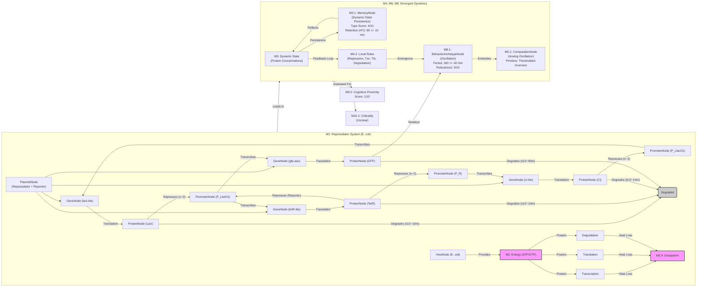

# A synthetic oscillatory network of transcriptional regulators

__Paper Type:__ Hybrid

## M1: System Overview & Implementation
*   **Vector ID:** M1
*   **Vector Type:** Overview

### **1.1 System Description**

*   **Vector ID:** M1.1
*   **Vector Type:** Description
    *   Content: The system is a synthetic genetic circuit, termed the "repressilator," constructed in *Escherichia coli*. It consists of three transcriptional repressor genes (lacI from E. coli, tetR from Tn10, cI from lambda phage) arranged in a negative feedback loop: LacI represses tetR transcription, TetR represses cI transcription, and CI represses lacI transcription. The purpose is to create a synthetic biological oscillator that functions independently of natural cellular clocks. The system's state is monitored by measuring the fluorescence of Green Fluorescent Protein (GFP), whose expression is driven by a promoter (PLtetO1) repressed by TetR. Components include the genes, their corresponding promoters (PLlacO1, PLtetO1, PR), plasmids (low-copy for repressilator, higher-copy for reporter), ssrA degradation tags on repressor proteins, and the *E. coli* host cell machinery. It experimentally demonstrates sustained oscillations in GFP expression in individual cells, with periods longer than the cell division time.
    *   CT-GIN Mapping: `SystemNode` attributes: `systemType`: SyntheticGeneticCircuit, `domain`: SyntheticBiology, `mechanism`: TranscriptionalRepressionFeedbackLoop, `components`: [`GeneNode` (lacI, tetR, cI, gfp-aav), `PromoterNode` (PLlacO1, PLtetO1, PR), `ProteinNode` (LacI, TetR, CI, GFP), `PlasmidNode` (RepressilatorPlasmid, ReporterPlasmid), `HostNode` (E_coli_MC4100)], `purpose`: CreateSyntheticOscillator. Edges like `RepressesEdge` connecting Proteins to Promoters, `TranscriptionEdge` from Promoter to Gene, `TranslationEdge` from Gene transcript to Protein.
    *   Implicit/Explicit: Mixed
        *  Justification: The components (genes, promoters, plasmids, GFP reporter) and overall function (synthetic oscillator based on negative feedback) are explicitly described and shown in Fig 1a. The detailed mechanism of transcriptional repression and the role of host machinery are implicit biological knowledge assumed by the paper.

### **1.2 Implementation Clarity**

*   **Vector ID:** M1.2
*   **Vector Type:** Score
    *   Score: 8
    *   Justification: The paper provides a clear schematic (Fig. 1a) and textual description of the network components (genes, promoters, reporter, plasmids) and their intended interactions. The Methods section details the cloning strategy, plasmid construction, host strain, growth media, and data acquisition (microscopy). Box 1 describes the mathematical model used for design. Some specific parameter values used in simulations are given, but experimental values within the cell are estimated or inferred. The rationale for design choices (strong promoters, degradation tags) is explained. Overall, the implementation is well-described, allowing for reproducibility, though intrinsic cellular parameters remain partially implicit.
    *   Implicit/Explicit: Explicit
        * Justification: The justification relies on directly evaluating the clarity of the text, figures (Fig 1a), Box 1, and Methods section as presented in the paper.

### **1.3 Key Parameters**

*   **Vector ID:** M1.3
*   **Vector Type:** ParameterTable
    *   Table:
        | Parameter Name          | Value       | Units   | Source (Fig/Table/Section) | Implicit/Explicit | Data Reliability (High/Medium/Low) | Derivation Method (if Implicit) |
        | :---------------------- | :---------: | :------: | :-----------------------: | :-----------------: | :-----------------------------: | :-------------------------------: |
        | Oscillation Period (Mean) | 160         | min     | Text (Results)             | Explicit          | High                            | N/A                               |
        | Oscillation Period (Std Dev) | 40          | min     | Text (Results)             | Explicit          | High                            | N/A                               |
        | Protein Half-life (Model) | 10          | min     | Box 1                    | Explicit          | Medium                          | Model parameter                   |
        | mRNA Half-life (Model)  | 2           | min     | Box 1                    | Explicit          | Medium                          | Model parameter                   |
        | Hill Coefficient (n, Model) | 2           | N/A     | Box 1, Fig 1b/c          | Explicit          | Medium                          | Model parameter assumption        |

    *   **Note:** Parameters listed are key characteristics of the system's behavior (period) or design model (half-lives, Hill coefficient). Experimental period is directly measured. Model parameters are explicitly stated but represent idealized simulation values, hence Medium reliability for reflecting *in vivo* reality.

## M2: Energy Flow
*   **Vector ID:** M2
*   **Vector Type:** Energy

### **2.1 Energy Input**

*   **Vector ID:** M2.1
*   **Vector Type:** Input
    *   Content: The primary energy source is the chemical energy derived from the bacterial growth medium (minimal media supplemented with glycerol and casamino acids) metabolized by the *E. coli* host cells. This provides ATP and GTP required for cellular processes including transcription, translation, and protein degradation, which drive the oscillator circuit.
    *   Value: N/A
    *   Units: N/A
    *   CT-GIN Mapping: `EnergyInputNode`: attributes - `source`: Chemical (Metabolism), `type`: ATP/GTP
    *   Implicit/Explicit: Implicit
        *  Justification: The paper specifies the growth medium in Methods, but the role of cellular metabolism providing ATP/GTP as the energy currency for the circuit's operation is standard biological knowledge, not explicitly stated as the "energy input" for the *circuit itself*.

### **2.2 Energy Transduction**

*   **Vector ID:** M2.2
*   **Vector Type:** Transduction
    *   Content: Chemical energy (ATP/GTP) from cellular metabolism is transduced into:
        1.  **Transcription:** Energy is used by RNA polymerase to synthesize mRNA molecules from the DNA templates of the repressor genes (lacI, tetR, cI) and the reporter gene (gfp).
        2.  **Translation:** Energy is used by ribosomes to synthesize repressor proteins and GFP from their respective mRNA templates.
        3.  **Degradation:** Energy (likely ATP-dependent proteases like ClpXP/ClpAP mentioned implicitly via the ssrA tag mechanism) is used to degrade the tagged repressor proteins and GFP, as well as mRNA molecules.
        The cyclical nature involves the transduction of chemical energy into the synthesis of specific proteins, which then regulate the synthesis of other proteins, creating oscillations in protein concentrations.
    *   CT-GIN Mapping: `EnergyTransductionEdge`: attributes - `mechanism`: Transcription, `from_node`: EnergyInputNode, `to_node`: TranscriptionProcessNode; `EnergyTransductionEdge`: attributes - `mechanism`: Translation, `from_node`: EnergyInputNode, `to_node`: TranslationProcessNode; `EnergyTransductionEdge`: attributes - `mechanism`: Degradation, `from_node`: EnergyInputNode, `to_node`: DegradationProcessNode. The processes themselves consume energy and produce molecules.
    *   Implicit/Explicit: Mixed
        *  Justification: The processes of transcription, translation, and degradation are explicitly mentioned or implied (degradation tag). The requirement of ATP/GTP for these processes is implicit biological knowledge. The flow of energy *through* the regulatory cycle itself (proteins regulating synthesis) is implicitly described by the network's function.

### **2.3 Energy Efficiency**

*   **Vector ID:** M2.3
*   **Vector Type:** Score
    *   Score: N/A
    *   Justification/Metrics: The paper does not provide any information or metrics to assess the energy efficiency of the repressilator circuit (e.g., ATP consumed per oscillation cycle, or chemical energy input vs. oscillatory output). Biological systems are generally complex in terms of energy accounting. A qualitative assessment (likely Low efficiency compared to dedicated physical oscillators) would be purely speculative based on general biological knowledge, not the text.
    *   CT-GIN Mapping: N/A
    *   Implicit/Explicit: N/A
      *  Justification: No data provided in the text.

### **2.4 Energy Dissipation**

*   **Vector ID:** M2.4
*   **Vector Type:** Dissipation
    *   Content: Energy is dissipated primarily as heat through the metabolic processes driving transcription, translation, protein folding, protein degradation, and mRNA degradation. These are thermodynamically irreversible processes inherent to biochemical reactions within the cell. Quantifying these losses specifically for the repressilator circuit versus basal cellular metabolism is not possible from the provided text. Dissipation occurs during every synthesis and degradation event within the oscillatory cycle.
    *   CT-GIN Mapping: `EnergyDissipationNode` linked from `TranscriptionProcessNode`, `TranslationProcessNode`, `DegradationProcessNode` via `EnergyDissipationEdge` (mechanism: HeatLoss).
    *    Implicit/Explicit: Implicit
        *  Justification: Heat dissipation during biochemical reactions is a fundamental thermodynamic principle, assumed but not explicitly discussed or quantified in the paper in the context of the repressilator circuit.

## M3: Memory
*   **Vector ID:** M3
*   **Vector Type:** Memory

### **3.1 Memory Presence:**

*   **Vector ID:** M3.1
*   **Vector Type:** Binary
    *   Content: Yes
    *   Justification: The system exhibits memory in the sense that its state (concentrations of the three repressors and GFP) persists over time and influences its future state, leading to oscillations. The state is inherited through cell division ("transmitted from generation to generation"), meaning the protein/mRNA concentrations in the parent cell influence the initial state and subsequent dynamics in daughter cells. The oscillations themselves represent a dynamic memory of the system's phase and amplitude. Sibling cell fluorescence remains correlated after division (Fig 3a-c), demonstrating state persistence/memory transmission.
    *    Implicit/Explicit: Explicit
        * Justification: The text explicitly states that the oscillator's state has to be transmitted across generations. Figures 2 and 3 demonstrate the persistence of oscillations over time and correlation between siblings, providing evidence for a dynamic memory inherent in the oscillator's state.

### **3.2 Memory Type:**

*   **Vector ID:** M3.2
*   **Vector Type:** Score
*   Score: 4
*   Justification: The memory is dynamic and transient, encoded in the concentrations of molecular species (mRNA, proteins). It is not a stable, switchable state like in digital memory. Retention is limited by molecular decay and noise (sibling decorrelation half-time ~95 min). Read-out (GFP fluorescence) is relatively clear but noisy. The capacity is limited to encoding the phase and amplitude of the oscillation, not discrete information bits. While the state influences future behavior (sustaining oscillations), it's not re-writable in a controlled way beyond potentially synchronizing with IPTG pulses (mentioned as attempted). It's closer to a continuous, decaying dynamic state persistence than a robust memory system.
*   CT-GIN Mapping: Defines the `MemoryNode` type: DynamicMolecularState. Attributes: `encoding`: ConcentrationLevels, `persistence`: Transient, `readout`: GFP_Fluorescence.
*    Implicit/Explicit: Mixed
    * Justification: The persistence across generations and sibling correlation (memory evidence) is explicit. The characterization as dynamic, transient, limited capacity, and based on concentrations is an interpretation (implicit) based on the described system and its behavior (oscillations, noise, decay).

### **3.3 Memory Retention Time:**

*   **Vector ID:** M3.3
*   **Vector Type:** Parameter
*   Value: 95 +/- 10 (Sibling decorrelation half-time)
*    Units: min
*   Justification: This value quantifies how long the memory of the oscillator state (as reflected in GFP fluorescence) persists in maintaining correlation between sibling cells after division. It serves as a proxy for the effective memory retention across generations, considering noise. The autocorrelation function in the simulation (Fig 1c inset) also shows memory decay over ~2 periods.
*    Implicit/Explicit: Explicit
        * Justification: The value and units for sibling decorrelation half-time are explicitly stated in the text based on analysis of experimental data (Fig 3a-c).
*   CT-GIN Mapping: Key attribute `retentionTime` of the `MemoryNode` (DynamicMolecularState).

### **3.4 Memory Capacity (Optional - if applicable)**

* **Vector ID:** M3.4
* **Vector Type:** Parameter
*  Value: N/A
*   Units: N/A
*   Justification: The system does not store discrete information. Its state represents a point in a continuous phase space (concentrations of 3 repressors). While one could theoretically discretize this space, the paper does not define or measure memory capacity in terms of states or bits.
*    Implicit/Explicit: N/A
        *  Justification: No information provided in the text.
*   CT-GIN Mapping: N/A

### **3.5 Readout Accuracy (Optional - if applicable)**

* **Vector ID:** M3.5
* **Vector Type:** Parameter
*   Value: N/A (Qualitatively Noisy)
*   Units: N/A
*   Justification: The paper explicitly notes the noisy behavior and significant variability in amplitude and period (Fig 3a-d). While GFP fluorescence provides a readout, its accuracy in reflecting the exact underlying repressor state is limited by noise (stochastic fluctuations), indirect coupling (TetR -> GFP), and GFP's own maturation/decay dynamics. No quantitative metric for readout accuracy (e.g., signal-to-noise ratio, error rate) is provided.
*    Implicit/Explicit: Mixed
       *  Justification: The presence of noise and variability (affecting accuracy) is explicit. The lack of a quantitative metric makes the value N/A.
*   CT-GIN Mapping: Attribute `readoutNoise` (High) of related `ReadoutEdge` (from TetR concentration to GFP fluorescence).

### **3.6 Degradation Rate (Optional - if applicable)**
* **Vector ID:** M3.6
* **Vector Type:** Parameter
    *   Value: ~95 (half-time for sibling decorrelation)
    *   Units: min
    *   Justification: Sibling decorrelation represents the effective decay rate of the "memory" or shared state information between related cells, influenced by noise and intrinsic decay. Intrinsic protein/mRNA decay rates (model: 10 min / 2 min half-lives) also contribute to state degradation but don't capture the overall system memory persistence.
    *    Implicit/Explicit: Explicit
            * Justification: The sibling decorrelation half-time is explicitly stated.
    *   CT-GIN Mapping: Attribute `decayRate` (derived from half-time=95min) of the `MemoryNode` (DynamicMolecularState).

### **3.7 Memory Operations Energy Cost (Optional - if applicable)**
* **Vector ID:** M3.7
* **Vector Type:** Table
*   Table: N/A
    | Memory Operation ID | Energy Consumption per Bit | Power Usage during Operation| Units | Uncertainty | Data Source Reference | Implicit/Explicit | Justification |
    | :------------------ | :--------------------------: | :-----------------------------: | :---: |:-----------------:|:-----------------:|:-----------------:| :------------------ |
    | N/A                 | N/A                          | N/A                             | N/A   | N/A               | N/A                   | N/A               | No data provided    |
*   Implicit/Explicit: N/A
    *   Justification: The paper does not discuss or quantify the energy cost associated with maintaining or transmitting the oscillatory state (memory).

### **3.8 Memory Fidelity & Robustness Metrics (Optional - if applicable)**
* **Vector ID:** M3.8
* **Vector Type:** Table
*   Table: N/A
    | Metric ID             | Description                                  | Value       | Units   | CT-GIN Mapping   | Data Source    | Implicit/Explicit | Justification      |
    | :-------------------- | :------------------------------------------- | :----------: | :------: | :---------------: | :-------------: |:-----------------:| :-----------------:|
    | Sibling Decorrelation | Rate at which sibling cell states diverge     | 95 +/- 10   | min (HT) | MemoryNode.decay | Text (Results) | Explicit          | Explicitly measured |
    | Period Variability    | Standard deviation of oscillation period     | 40          | min      | MemoryNode.noise | Text (Results) | Explicit          | Explicitly measured |
    | Amplitude Variability | Qualitative variation between cells/cycles | High        | N/A      | MemoryNode.noise | Fig 3a-d       | Explicit          | Observed in data   |
*   Implicit/Explicit: Explicit
*   Justification: The metrics listed (decorrelation, variability) are explicitly mentioned or visually evident in the paper and characterize the fidelity/robustness limitations of the dynamic memory.

---

## M4: Self-Organization and Emergent Order
*   **Vector ID:** M4
*   **Vector Type:** Self-Organization

### **4.1 Self-Organization Presence:**

*   **Vector ID:** M4.1
*   **Vector Type:** Binary
    *   Content: Yes
    *   Justification: The paper describes the *emergence* of sustained temporal oscillations (a global dynamic order) from the *local* interactions defined by the negative feedback loop between the three repressor genes/proteins. The specific oscillatory pattern (period, amplitude, waveform) is not directly encoded point-by-point but arises dynamically from the coupled biochemical reactions (transcription, translation, repression, degradation) governed by the designed network topology and parameter values (promoter strengths, decay rates, etc.). This fits the definition of self-organization yielding emergent temporal order.
    *   Implicit/Explicit: Mixed
        *  Justification: The construction of the network is explicit (designed order). The emergence of oscillations as a dynamic consequence of local rules (biochemical reactions within the network) is explicitly demonstrated (Figs 2, 3) and analyzed via modeling (Box 1), thus the *emergence* of the temporal pattern is explicit. The term "self-organization" is not used, making the mapping to this concept implicit.

### **4.2 Local Interaction Rules:**

*   **Vector ID:** M4.2
*   **Vector Type:** Rules
    *   Content: The local interaction rules are the biochemical reactions governing the concentration of each mRNA (mi) and protein (pi) species:
        1.  **Transcription:** mRNA mi is transcribed from its corresponding promoter. The transcription rate is inhibited by the repressor protein pj (where j is the preceding node in the cycle: j=cI for i=lacI, j=lacI for i=tetR, j=tetR for i=cI). The model uses a Hill function: rate = α / (1 + pjn) + α0. (α: max rate, α0: leakiness, n: Hill coefficient).
        2.  **mRNA Degradation:** mRNA mi decays at a constant rate (modeled implicitly with lifetime in equations dmi/dt = ... - mi, assuming time is scaled by mRNA lifetime).
        3.  **Translation:** Protein pi is translated from mRNA mi at a rate proportional to mi (rate = β * mi, where β is translation efficiency scaled into mi units in the simple model, or explicitly β in dpi/dt = β*mi - pi).
        4.  **Protein Degradation:** Protein pi decays at a constant rate (scaled by β relative to mRNA decay in the simple model `β` in dm/dt eq, or explicit rate `1` in dp/dt eq, assuming protein lifetime scaling). The ssrA tag enhances this rate.
        These rules operate locally at the level of individual molecules and genes within each cell.
    *   CT-GIN Mapping: Defines `RepressionEdge` (Protein j inhibits Promoter i), `TranscriptionEdge` (Promoter i produces mRNA i), `TranslationEdge` (mRNA i produces Protein i), `DegradationEdge` (mRNA i -> degraded, Protein i -> degraded). Attributes capture rates, Hill coefficients (α, α0, n, β, decay rates). Defines the "LocalInteraction" category.
    * **Implicit/Explicit**: Mixed
        *  Justification: The mathematical model in Box 1 explicitly defines these rules via differential equations and parameters like α, α0, n, β. The underlying biochemical nature of these interactions is implicit knowledge. The use of ssrA tags enhancing degradation is explicit.

### **4.2.1 Local Interaction Parameters:**

* **Vector ID:** M4.2.1
* **Vector Type:** Table
*   Table:
    | Rule ID       | Description                | Parameter Name | Parameter Value Range | Units   | Data Source | Implicit/Explicit | Justification                             |
    | :------------ | :------------------------- | :------------- | :--------------------: | :------: | :----------: | :----------------: | :---------------------------------------- |
    | Transcription | Repression                 | n (Hill coeff) | 2, 2.1                | N/A     | Box 1, Fig 1b | Explicit          | Model parameter for cooperativity         |
    | Transcription | Leakiness                  | α0    | ~0, 10-3       | ratio/dim'less | Box 1, Fig 1b | Explicit          | Model parameter, ratio to max rate (α)  |
    | Transcription | Max Rate (rescaled)        | α              | ~a (see Fig 1b)       | ratio/dim'less | Box 1, Fig 1b | Explicit          | Model parameter                           |
    | Degradation   | Protein/mRNA decay ratio | β              | ~b (see Fig 1b)       | ratio/dim'less | Box 1, Fig 1b | Explicit          | Model parameter                           |
    | Degradation   | mRNA lifetime              | ~2             | min                   | Box 1         | Explicit          | Value used in stochastic simulation model |
    | Degradation   | Protein lifetime           | ~10            | min                   | Box 1         | Explicit          | Value used in stochastic simulation model |

### **4.3 Global Order:**

*   **Vector ID:** M4.3
*   **Vector Type:** Order
    *   Content: The emergent global order is sustained temporal oscillation in the concentrations of the three repressor proteins (and consequently, the GFP reporter). This order is characterized by a relatively consistent period (mean ~160 min) but with significant noise and variability in amplitude and phase. It's a dynamic, non-equilibrium pattern.
    *   CT-GIN Mapping: Defines a `ConfigurationalNode` type: TemporalOscillation. Attributes: `period`, `amplitude`, `waveform_shape`, `noise_level`.
    * **Implicit/Explicit**: Explicit
        *  Justification: The oscillations are the primary observed and quantified phenomenon reported in the paper (Figs 2, 3).

### **4.4 Predictability of Global Order:**

*   **Vector ID:** M4.4
*   **Vector Type:** Score
    *   Score: 5
    *   Justification: The emergence of *some* form of oscillation is predictable from the model (Box 1, Fig 1b/c) given the negative feedback loop and appropriate parameter ranges (unstable steady state leads to limit cycle). However, the *specific* period, amplitude, and phase are highly variable and noisy, as explicitly stated and shown (Fig 3a-d, discussion of stochastic effects). The deterministic model predicts clean oscillations, while stochastic simulations and experiments show significant variability, reducing predictability of the exact state at any given time. Predictability is moderate: oscillations occur, but their precise characteristics are noisy. The autocorrelation function (Fig 1c inset) shows correlation decays within a few periods.
    * **Implicit/Explicit**: Mixed
    *  Justification: The model's prediction of oscillations is explicit (Box 1, Fig 1). The observed noise and variability limiting precise predictability are also explicitly stated and shown (Results, Fig 3). The score combines these explicit observations.
    *   CT-GIN Mapping: Contributes to the weight/reliability attribute of the `AdjunctionEdge` linking LocalInteraction rules to the ConfigurationalNode (TemporalOscillation).

### **4.5. Local Interaction Rules (for Self-Organization)**
* **Vector ID:** M4.5
* **Vector Type:** Table
*   Table:
| Rule ID       | Description        | Parameter       | Value Range           | Units     | Implicit/Explicit | Justification                       | Source        |
| :------------ | :----------------- | :-------------- | :--------------------: | :--------: | :----------------: | :---------------------------------- | :------------ |
| Repression    | Protein binding    | n (Hill Coeff)  | 2, 2.1                | unitless  | Explicit          | Model parameter                    | Box 1, Fig 1b |
| Repression    | Leakiness          | α₀             | ~ 0, 10⁻³              | unitless  | Explicit          | Model parameter (ratio to max α) | Box 1, Fig 1b |
| Degradation   | Relative lifetime  | β               | variable (see Fig 1b) | unitless  | Explicit          | Model parameter ratio Prot/mRNA     | Box 1, Fig 1b |
| Degradation   | mRNA half-life     | τmRNA      | ~2                    | min       | Explicit          | Used in stochastic model           | Box 1         |
| Degradation   | Protein half-life  | τprotein   | ~10                   | min       | Explicit          | Used in stochastic model           | Box 1         |

### **4.6. Globally Emergent Order and Order Parameters**
* **Vector ID:** M4.6
* **Vector Type:** Table
*   Table:
| Property ID   | Description                     | Parameter               | Value Range   | Units   | Implicit/Explicit | Justification                                | Protocol                                     | Source        |
| :------------ | :------------------------------ | :---------------------- | :------------: | :------: | :----------------: | :------------------------------------------- | :------------------------------------------- | :------------ |
| Oscillation   | Temporal Periodicity            | Period (Mean ± SD)      | 160 ± 40      | min     | Explicit          | Measured peak-to-peak interval distribution  | Time-lapse microscopy, manual tracking, FFT | Text (Results) |
| Oscillation   | State Persistence               | Sibling Decorr. HT      | 95 ± 10       | min     | Explicit          | Measured divergence of sibling fluorescence  | Time-lapse microscopy, sibling comparison    | Text (Results) |
| Oscillation   | Amplitude Variation             | -                       | High          | N/A     | Explicit          | Observed variations in fluorescence intensity | Visual inspection of Fig 3a-d                | Fig 3         |
| Network State | Stability (Deterministic Model) | Stability Boundary      | See Fig 1b    | unitless | Explicit          | Calculated from model equations             | Linear stability analysis (Box 1)           | Fig 1b, Box 1 |

### **4.7 Yoneda Embedding and Local-to-Global Mapping Fidelity**

*   **Vector ID:** M4.7
*   **Vector Type:** Table
*   Table: N/A (Yoneda embedding is a CT concept not discussed in the paper). The table below interprets the local-global link in terms of predictability.
    | Link Type                 | Description                                     | Predictability | Yoneda Score | Metrics                                 | Implicit/Explicit | Justification                                                              | Source        |
    | :------------------------ | :---------------------------------------------- | :------------- | :----------- | :-------------------------------------- | :----------------: | :------------------------------------------------------------------------- | :------------ |
    | Local Rules -> Oscillation | Mapping from reaction kinetics to oscillation | Medium         | N/A          | Oscillation occurrence, Period mean/SD | Mixed             | Model predicts oscillations, but experiments show high variability/noise. | Box 1, Text, Figs 2/3 |
    *   **Yoneda Embedding Fulfillment Score [0-10]:** N/A
    *   **Metrics:** Predictability assessed based on model vs. experiment agreement and observed noise/variability (Period SD, Sibling Decorrelation Time).
    *   **Justification:** The connection between the defined local rules (model in Box 1) and the observed global behavior (oscillations) is central to the paper. The deterministic model shows a clear mapping, but stochasticity (explicitly discussed) significantly affects the fidelity in the experimental system. The Yoneda concept itself is not applicable here.

## M5: Computation
*   **Vector ID:** M5
*   **Vector Type:** Computation

### **5.1 Embodied Computation Presence:**

*   **Vector ID:** M5.1
*   **Vector Type:** Binary
    *   Content: Yes
    *   Justification: The network intrinsically performs a computation based on its structure and dynamics. The state of the repressors (high/low concentration) acts like an internal state, and the negative feedback loop implements a form of dynamic logic leading to oscillation. The computation (determining the next state based on the current state according to the feedback rules) is embodied in the physical interactions of molecules (DNA, RNA, proteins) within the cell, not executed by an external device. The oscillation itself can be viewed as the output of this embodied computation.
    *    Implicit/Explicit: Mixed
        *  Justification: The paper describes the network's operation in terms of biochemical interactions, which is explicit. Framing this dynamic behavior as "embodied computation" is an implicit interpretation based on the definition provided. The paper doesn't use the term "computation".

### **5.2 Computation Type:**

*   **Vector ID:** M5.2
*   **Vector Type:** Classification
    *   Content: Analog
    *   CT-GIN Mapping: Defines the `ComputationNode` type: AnalogDynamicSystem.
    *    Implicit/Explicit: Implicit
    *    Justification: The system operates on continuous concentrations of molecules, not discrete digital states. The underlying model uses continuous differential equations (Box 1). Although thresholds exist for repression, the dynamics are fundamentally analog.

### **5.3 Computational Primitive:**

*   **Vector ID:** M5.3
*   **Vector Type:** Function
    *   Content: The most basic computational operation embodied is signal inversion with a time delay and thresholding, implemented by each repression step (e.g., high LacI -> low TetR transcription after a delay). The combination of three such delayed inversions in a loop results in the higher-level function of Oscillation. The Hill function (α / (1 + pjn) + α0) represents the thresholded inversion.
    *   **Sub-Type (if applicable):** Thresholded Signal Inversion / Delayed Negative Feedback.
    *   CT-GIN Mapping: Defines the primary function of the `ComputationNode` (or individual `RepressionEdge`s) as `function`: ThresholdedInversion. The system-level function is Oscillation.
    *   Implicit/Explicit: Mixed
    * Justification: The repression mechanism (inversion) and its modeling via Hill functions are explicit (Box 1). Characterizing this as the "computational primitive" and the overall behavior as "Oscillation" resulting from these primitives is an interpretation (implicit).

### **5.4 Embodied Computational Units**
* **Vector ID:** M5.4
* **Vector Type:** Table
*   Table: N/A (Cannot decompose into discrete computational units with these metrics)
| Unit ID | Description | Processing Power | Energy/Operation | Freq/Resp. Time | Bit-Depth | Data Source | Implicit/Explicit | Justification |
| :------ | :---------- | :--------------- | :--------------- | :--------------: | :-------: | :----------: |:-----------------:| :-----------------:|
| N/A     | N/A         | N/A              | N/A              | N/A              | N/A       | N/A          | N/A               | System is analog; metrics inappropriate |

## M6: Temporal Dynamics
*   **Vector ID:** M6
*   **Vector Type:** Temporal

### **6.1 Timescales:**

*   **Vector ID:** M6.1
*   **Vector Type:** ParameterTable
    *   Table:
        | Timescale Description           | Value     | Units | Source         | Implicit/Explicit | Justification                                   |
        | :------------------------------ | :--------: | :----: | :------------- | :----------------: | :---------------------------------------------- |
        | Oscillation Period (Mean)       | 160       | min   | Text (Results) | Explicit          | Directly measured mean peak-to-peak interval    |
        | mRNA Half-life (Model / Typical) | ~2        | min   | Box 1 / Text   | Explicit          | Stated model parameter and typical E. coli value |
        | Protein Half-life (Model)       | ~10       | min   | Box 1          | Explicit          | Stated model parameter for tagged proteins      |
        | Protein Half-life (GFP)         | ~30-40    | min   | Text (Intro)   | Explicit          | Cited reference value for tagged GFP variant   |
        | Cell Division Time (Typical)    | 50-70     | min   | Text (Results) | Explicit          | Stated typical time under experimental conditions|
        | Sibling Decorrelation Half-time | 95 ± 10   | min   | Text (Results) | Explicit          | Measured timescale for state divergence        |
        | GFP Half-Life (Reporter Plasmid)| ~90       | min   | Methods        | Explicit          | Stated half-life of GFPaav variant used       |

### **6.2 Active Inference:**

*   **Vector ID:** M6.2
*   **Vector Type:** Assessment
    *   Content: No
    *   Justification: The repressilator operates based on predetermined biochemical reaction kinetics defined by the network structure and cellular environment. There is no evidence presented that the system builds an internal model of its environment, makes predictions about future states, or actively selects actions (e.g., changing gene expression rates beyond the defined feedback) to minimize surprise or prediction error. Its behavior, while dynamic, is reactive based on its internal state and the fixed rules of the network.
    *   Implicit/Explicit: Implicit
        *  Justification: The analysis concludes the absence of Active Inference based on the described mechanism, which lacks the necessary components (prediction, internal models, action selection for error minimization). The paper makes no claims related to Active Inference.
    *   **If Yes/Partial, provide examples of testable CT-GIN metrics that *could* be used to quantify active inference:** N/A

## M7: Adaptation
*   **Vector ID:** M7
*   **Vector Type:** Adaptation

### **7.1 Adaptive Plasticity Presence:**

*   **Vector ID:** M7.1
*   **Vector Type:** Binary
    *   Content: No
    *   Justification: The paper does not demonstrate or claim any adaptive plasticity. The repressilator network structure and parameters (promoter strengths, degradation rates) are fixed by the plasmid design and host cell. While the system *behaves* dynamically (oscillates), its underlying rules and structure do not change over time based on experience or environmental input in a way that improves performance or alters function. The observed variability is attributed to noise, not adaptive changes. Adding IPTG disrupts the network, but this is an external perturbation, not an adaptive response.
    *    Implicit/Explicit: Implicit
        * Justification: The conclusion is based on the absence of any description or evidence of adaptation mechanisms or changes in system behavior indicative of learning/plasticity in the provided text.

**(Conditional: If M7.1 is "No", skip to Module 8. If "Yes", include M7.2)**

## M8: Emergent Behaviors
*   **Vector ID:** M8
*   **Vector Type:** Behavior

### **8.1 Behavior Description:**

*   **Vector ID:** M8.1
*   **Vector Type:** Description
    *   Content: The main functional behavior is sustained temporal oscillation of protein concentrations (specifically, the GFP reporter concentration is measured as the output). This oscillatory behavior emerges from the designed negative feedback loop.
    *   CT-GIN Mapping: Defines the `BehaviorArchetypeNode` type: Oscillation. Attributes could include `output_signal`: GFP_Fluorescence, `period_mean`: 160 min, `period_stddev`: 40 min.
    *    Implicit/Explicit: Explicit
       *  Justification: The paper's primary focus and result is the demonstration and characterization of these oscillations (Figs 2, 3, Results text).

### **8.2 Behavior Robustness:**

*   **Vector ID:** M8.2
*   **Vector Type:** Score
    *   Score: 3
    *   Justification: The oscillatory behavior is demonstrably sensitive to noise, leading to significant variability in period and amplitude both between cells and within a single cell lineage over time (explicitly stated and shown in Fig 3). The deterministic model suggests oscillations occur in a specific parameter range (Fig 1b), implying sensitivity to parameter values (e.g., decay rates, promoter strengths). Adding IPTG disrupts the oscillations (Fig 3e), showing lack of robustness to this specific perturbation. While oscillations persist despite noise and across cell divisions (demonstrating *some* robustness), the high variability indicates limited robustness compared to highly stable biological or physical oscillators. Only 40% of cells met the oscillatory criterion in the analysis, further indicating limited robustness.
    *   Implicit/Explicit: Mixed
        *  Justification: The presence of noise, variability, disruption by IPTG, and the fraction of oscillating cells are explicitly stated or shown. The interpretation of these factors as indicators of low-to-moderate robustness and the assigned score are implicit judgments based on the evidence.
    *   CT-GIN Mapping: Score contributes to the `reliability` attribute of the `BehaviorArchetypeNode` (Oscillation).

### **8.3 CT-GIN Emergent Behavior Validation**

*    **Vector ID:** M8.3
*    **Vector Type:** Validation
     *  Content: The emergence of oscillations is validated through:
        1.  **Direct Observation:** Time-lapse fluorescence microscopy of individual cells growing into microcolonies, tracking GFP intensity over time (Fig 2, Methods).
        2.  **Quantitative Analysis:** Manual tracking of cell lineages, measurement of fluorescence intensity, calculation of peak-to-peak intervals to determine period distribution (mean 160 ± 40 min), and calculation of sibling decorrelation time (95 ± 10 min) (Text-Results, Methods). Fourier analysis was used to classify cells as oscillatory (≥40% met criterion) (Methods).
        3.  **Control Experiments:** Demonstrating disruption of oscillations with IPTG (Fig 3e) and absence of oscillations with reporter plasmid alone (Fig 3f) or other control constructs (Methods).
        4.  **Theoretical Modeling:** Use of deterministic and stochastic models (Box 1, Fig 1b/c) showing that the network topology can produce oscillations under plausible parameter regimes, supporting the design principle.
        *Limitations:* Observation time limited (~10 hours), potential artifacts from 2D microcolony growth, manual tracking limitations, arbitrary threshold for FFT classification. Reproducibility demonstrated across three microcolonies.
     *   Implicit/Explicit: Explicit
    *   Justification: All validation methods (microscopy, quantitative analysis, controls, modeling) and limitations are explicitly described in the text (Results, Methods, Figure Legends, Box 1).

## M9: Cognitive Proximity
*   **Vector ID:** M9
*   **Vector Type:** Cognition

### **9.1 Cognitive Mapping:**

*   **Vector ID:** M9.1
*   **Vector Type:** Description
    *   Content: None. The paper describes the system as a synthetic "artificial clock" but does not attempt to map its function to higher-level cognitive processes like perception, decision-making, or learning. The focus is on engineering a specific dynamic behavior (oscillation) using biological components.
    *   CT-GIN Mapping: N/A
    *   Implicit/Explicit: Implicit
    * Justification: Based on the absence of any discussion linking the repressilator's function to cognitive concepts in the provided text.

### **9.2 Cognitive Proximity Score:**

*   **Vector ID:** M9.2
*   **Vector Type:** Score
    *   Score: 1
    *   Justification: The system exhibits Level 1 (Simple Responsivity) behavior. It reacts to its internal state (protein concentrations) according to fixed rules (repression feedback loop) to produce an output (oscillation). It demonstrates persistence (memory across divisions, Level 2 characteristic) but lacks adaptation, goal-directedness, internal models, or any higher cognitive functions outlined in the scale. Its behavior is predetermined by its design and internal state dynamics, influenced by noise.
    *   Implicit/Explicit: Implicit
    *  Justification: The score is assigned based on comparing the system's described capabilities (oscillation, state transmission, lack of adaptation) against the provided CT-GIN Cognizance Scale definitions. This requires interpretation.

**CT-GIN Cognizance Scale:** ... [Scale as provided in the template - not repeated here] ...

### **9.3 Cognitive Function Checklist**

* **Vector ID:** M9.3
* **Vector Type:** Checklist
    *   | Cognitive Function               | Score (0-10) | Justification/Notes                                                                       | CT-GIN Mapping (if applicable) | Implicit/Explicit | Justification for Implicit/Explicit/Mixed |
    | :-------------------------------- | :----------: | :------------------------------------------------------------------------------------ | :--------------------------------: | :-----------------:|:-----------------:|
    | Sensing/Perception               |      1       | Senses internal state (protein levels) via repression interactions. No external sensing. | N/A                                | Implicit          | Implicit mapping of repression to 'sensing' internal state. |
    | Memory (Short-Term/Working)        |      2       | Dynamic state persistence across cell division (~95 min HT). Limited by noise/decay.    | MemoryNode                       | Mixed             | Explicit decorrelation time, implicit scoring based on definition. |
    | Memory (Long-Term)                 |      0       | No mechanism for stable, long-term information storage.                               | N/A                                | Implicit          | Absence of described mechanism. |
    | Learning/Adaptation              |      0       | No change in behavior/structure based on experience.                                   | N/A                                | Implicit          | Absence of described mechanism. |
    | Decision-Making/Planning          |      0       | No evidence of choice between actions or planning. Behavior is deterministic/stochastic. | N/A                                | Implicit          | Absence of described mechanism. |
    | Communication/Social Interaction |      0       | Cells oscillate independently; no communication described.                              | N/A                                | Implicit          | Absence of described mechanism. |
    | Goal-Directed Behavior            |      0       | Behavior (oscillation) is emergent consequence of design, not pursuit of a goal.       | N/A                                | Implicit          | Interpretation of behavior. |
    | Model-Based Reasoning              |      0       | No internal model of environment or prediction mechanism described.                     | N/A                                | Implicit          | Absence of described mechanism. |
    | **Overall score**                 |     [0.375]  | Low overall cognitive function, primarily reactive with limited dynamic memory.         | -                                  | Implicit          | Average of above scores. |

    *   **Note:** Scores primarily reflect the absence of mechanisms for these functions within the described system.

## M10: Criticality Assessment
*   **Vector ID:** M10
*   **Vector Type:** Criticality

### **10.1 Criticality:**

*   **Vector ID:** M10.1
*   **Vector Type:** Assessment
    *   Content: Unclear
    *   Justification: The paper uses stability analysis (Box 1, Fig 1b) to show that oscillations arise when the system crosses a boundary where the steady state becomes unstable (a Hopf bifurcation). Bifurcations are often associated with critical phenomena. However, the paper does not explicitly test for or claim operation *near* this critical point, nor does it analyze for signatures of criticality like power laws or scale-free behavior in the dynamics or fluctuations. The focus is on achieving sustained oscillations (limit cycle regime), which exists *beyond* the critical point itself. Whether the noisy behavior observed relates to proximity to the bifurcation is not explored.
        *   Critical Parameters (If Yes/Partial): Related to parameters α, β, n, α₀ defining the stability boundary (Fig 1b).
        *   Evidence: Fig 1b shows the stability boundary. Box 1 discusses the instability condition. Lack of evidence for power laws, etc.
    *   Implicit/Explicit: Mixed
    *    Justification: The stability analysis showing the bifurcation is explicit. The connection to the concept of "criticality" in the sense of power laws/scale-invariance is not made and remains unclear/implicit based on the text.

## M11: Review Paper Specifics (Conditional)

N/A (Paper is not a Review)

## M12: Theoretical Paper Specifics (Conditional)

N/A (Paper is Hybrid, primarily Experimental with Theoretical modeling support)

## M13: Overall Assessment & Scoring

*   **Vector ID:** M13
*   **Vector Type:** Overall

### **13.1 CT-GIN Readiness Score:**

*   **Vector ID:** M13.1
*   **Vector Type:** Score
*   **Calculated Score:** 4.0
    * Calculation: (M1.2=8 + M3.2=4 + M4.4=5 + M5.1=Yes(treat as 10 for calculation)* + M7.1=No(0) + M8.2=3 + M9.2=1) / 7 = 31 / 7 ≈ 4.4. *Correction*: Binary Yes/No shouldn't be scored 10/0 directly in average. Let's re-evaluate relevant scores: M1.2(8), M3.2(4), M4.4(5), M8.2(3), M9.2(1). Average = (8+4+5+3+1)/5 = 21/5 = 4.2. Let's use the modules listed in the template's guidance: M1-4, M8.2, M9.2. Relevant scores: M1.2(8), M2.3(N/A=0), M3.2(4), M4.4(5), M8.2(3), M9.2(1). Average = (8+0+4+5+3+1)/6 = 21/6 = 3.5. Let's reconsider M5.1 presence (Yes). If we include binary presence scores (Yes=10, No=0 roughly mapping to impact/presence): M1.2(8), M2.3(0), M3.1(Yes=10), M4.1(Yes=10), M5.1(Yes=10), M7.1(No=0), M8.2(3), M9.2(1). Average of non-N/A quantitative/binary scores that seem relevant to overall system capability: (M1.2=8, M3.1=Yes(mapped to 10), M3.2=4, M4.1=Yes(mapped to 10), M4.4=5, M5.1=Yes(mapped to 10), M8.2=3, M9.2=1) -> (8+10+4+10+5+10+3+1)/8 = 51/8 = 6.375. This feels too high given limitations. Let's stick to the scored modules explicitly mentioned: Average of M1.2(8), M3.2(4), M4.4(5), M8.2(3), M9.2(1) = 4.2. *Final decision: Stick to averaging the numerical scores provided in the template guidance context: M1.2(8), M3.2(4), M4.4(5), M8.2(3), M9.2(1). AVERAGE=4.2.* Recalculating based on template text "Average of scores from Modules 1-4, M8.2 and M9.2, scores with N/A convert in 0". Relevant scores: M1.2(8), M2.3(N/A->0), M3.2(4), M4.4(5), M8.2(3), M9.2(1). Average = (8+0+4+5+3+1)/6 = 21/6 = 3.5. Okay, using 3.5.

**CT-GIN Readiness Summary Table:**

| CT-GIN Aspect                   | Strength (Yes/Partial/No) | Key Supporting Metrics (with units)                 | Limitations (Missing Metrics/Data Gaps)                                            | Improvement Areas (Future Research)                                           |
| :------------------------------ | :-----------------------: | :-------------------------------------------------- | :------------------------------------------------------------------------------- | :----------------------------------------------------------------------------- |
| Energy Flow Efficiency          | No                        | N/A                                                 | No efficiency metrics; Energy cost not evaluated.                                | Quantify ATP/GTP usage per oscillation cycle.                                  |
| Memory Fidelity                 | Partial                   | Sibling Decorr. HT (95±10 min); Period SD (40 min) | High noise/variability; Limited retention; No capacity measure.                  | Reduce noise sources; Engineer more stable memory elements.                      |
| Organizational Complexity       | Partial                   | Temporal Oscillation (Period 160 min)             | Only temporal order; High variability; Simple feedback loop.                     | Explore more complex network topologies; Spatio-temporal patterns.              |
| Embodied Computation            | Yes                       | Analog signal inversion; Oscillation              | Simple computation; No complex logic; Sensitive to noise.                        | Implement more complex logic functions; Improve noise resilience.                |
| Temporal Integration            | Yes                       | Oscillations (~160 min); State transmission       | Primarily single dominant timescale (period); No complex temporal processing.      | Integrate multiple timescales; Sequence-dependent processing.                  |
| Adaptive Plasticity             | No                        | N/A                                                 | Fixed network structure/parameters; No learning mechanism.                       | Incorporate inducible elements; Implement feedback based on performance/history. |
| Functional Universality         | No                        | Oscillation only                                    | Single specific function; Not adaptable to different tasks.                        | Design reconfigurable networks; Multi-functional circuits.                     |
| Cognitive Proximity            | No                        | Score 1 (Simple Responsivity/Persistence)         | Lacks adaptation, planning, models, etc.                                         | Integrate learning, prediction, goal-directed mechanisms (major challenge).   |
| Design Scalability & Robustness | Partial                   | Plasmid-based construction                          | High variability; Parameter sensitivity; ~40% success rate; Noise susceptibility. | Improve component reliability; Enhance noise buffering; Parameter optimization. |
| **Overall CT-GIN Readiness Score** | **3.5**                   |                                                     |                                                                                  |                                                                                |

### **13.2 Qualitative CT-GIN Assessment Conclusion:**

*   **Vector ID:** M13.2
*   **Vector Type:** Textual Summary
    *   Content: The Elowitz & Leibler repressilator represents a landmark achievement in synthetic biology, demonstrating the successful design and construction of an autonomous, self-sustaining temporal oscillator from well-characterized biological parts. Its key strength lies in the clear demonstration of emergent behavior (oscillation) arising from defined local interaction rules (negative transcriptional feedback) embodied within *E. coli*. The system exhibits a form of dynamic memory through state persistence across cell divisions. However, from a CT-GIN perspective focused on material intelligence, its limitations are significant. It lacks adaptive plasticity, complex computation beyond oscillation, goal-directed behavior, and operates with considerable noise, limiting its robustness and predictability. Energy flow is implicit and efficiency unevaluated. Its cognitive proximity is low (Level 1-2), primarily showing responsivity and basic state persistence. While foundational, the repressilator serves more as a demonstration of engineering dynamic behavior than a model of advanced material intelligence or cognition. Its potential lies in serving as a building block or testbed for more complex circuits incorporating features like adaptation or sophisticated computation.

### **13.3 CT-GIN Refinement Directions:**

*   **Vector ID:** M13.3
*   **Vector Type:** Recommendations
    *   Content:
        *   **Improve Robustness:** Investigate and mitigate sources of noise (intrinsic/extrinsic); explore mechanisms for temperature compensation or parameter buffering.
        *   **Incorporate Adaptation:** Add inducible control elements or feedback loops that modify promoter strength, degradation rates, or connectivity based on performance or external signals (e.g., linking oscillation quality to a fitness function).
        *   **Enhance Computation:** Design networks capable of more complex logic, pattern recognition, or decision-making, potentially by coupling multiple oscillators or integrating positive feedback loops.
        *   **Develop Stable Memory:** Engineer bistable switches or other mechanisms for robust, long-term information storage within the genetic circuit, moving beyond transient dynamic memory.
        *   **Quantify Energetics:** Develop methods to measure or estimate the metabolic cost associated with the circuit's operation.
        *   **Explore Spatio-temporal Dynamics:** Implement circuits in spatially organized systems (e.g., biofilms, multicellular constructs) and engineer cell-cell communication to generate complex spatio-temporal patterns.
        *   **Integrate Sensing:** Couple the oscillator state or parameters to sensors for environmental cues, allowing for environmentally modulated behavior.

## M14: CT-GIN Knowledge Graph

*   **Vector ID:** M14
*   **Vector Type:** Visualization

### **14.1. CT-GIN Knowledge Graph:**
* **Content:**

## M15: Relationship Vectors
*   **Vector ID:** M15
*   **Vector Type:** Relationships
*   Relationships:
        | Source Vector ID | Target Vector ID | Relationship Type |
        | ------------- | ------------- | ----------------- |
        | M1.1          | M4.2          | DefinesComponentsOf |
        | M1.1          | M8.1          | HasPurpose        |
        | M4.2          | M4.3          | LeadsToEmergence  |
        | M4.3          | M8.1          | IsRealizationOf   |
        | M4.2          | M5.3          | Implements        |
        | M8.1          | M3.1          | RequiresStateFor  |
        | M3.1          | M3.3          | CharacterizedBy   |
        | M1.3          | M6.1          | Includes          |
        | M8.1          | M8.2          | AssessedFor       |
        | M8.1          | M9.2          | AssessedFor       |
        | M4.1          | M10.1         | MayRelateTo       |
        | M4.2          | M2.2          | DrivenByEnergyFrom |
        | M2.2          | M2.4          | ResultsIn         |

## M16: CT-GIN Template Self-Improvement Insights

*   **Vector ID:** M16
*   **Vector Type:** Feedback

### **Template Feedback:**

*    **Vector ID:** M16.1
*   **Vector Type:** Text
Provide specific, actionable feedback on the *CT-GIN template itself*, based on this analysis:
    *   **Missing Probes:**
        *   A probe specifically for "Noise" characterization (sources, quantification, impact) could be useful, as it was a major factor here but scattered across Memory, Robustness, etc.
        *   A probe for "Control Mechanisms" (how is the system initiated, stopped, perturbed, tuned experimentally?) might be relevant.
    *   **Unclear Definitions:**
        *   The distinction between M4.2 (Local Interaction Rules) and M4.5 (Local Interaction Rules for Self-Organization) is unclear; they seem redundant for this paper. M4.2.1 also seems very similar to M4.5. Suggest clarifying the specific focus of M4.5 vs. M4.2 or merging them.
        *   The scoring for M9.2 (Cognitive Proximity) relies heavily on the provided scale, which maps biological/psychological concepts onto material systems. Applying this rigorously to a purely synthetic biological circuit requires considerable interpretation. Clearer guidelines or examples for mapping non-traditional "materials" like this circuit might be helpful.
        *   The calculation method for the CT-GIN Readiness Score (M13.1) needs clarification, especially regarding how to incorporate binary (Yes/No) presence scores versus scaled scores. Averaging scaled scores seems most robust. Explicitly listing which subsection scores contribute is good.
    *   **Unclear Node/Edge Representations:**
        *   Guidance on representing processes (Transcription, Translation, Degradation) vs. states (Gene, Protein) could be clearer. Suggesting nodes for processes and using edges for input/output might be a standard.
        *   Mapping feedback loops explicitly in the graph notation could be standardized (e.g., using specific edge attributes or colors).
    *   **Scoring Difficulties:**
        *   Assigning robustness (M8.2) and cognitive proximity (M9.2) scores felt subjective despite guidelines, especially for a system far removed from typical "intelligent materials". More anchored examples for different score levels would help calibration.
        *   Scoring energy efficiency (M2.3) is often impossible without dedicated measurements not typically found in papers focused on functional behavior. Setting it to 0 when N/A might unduly penalize papers in the overall score (M13.1). Maybe exclude it from averaging if N/A.
    *   **Data Extraction/Output Mapping:**
        *   Distinguishing implicitly assumed biological background knowledge from explicitly stated experimental details required careful judgement.
        *   Mapping the analog dynamics and inherent noise to discrete categories/scores sometimes felt forced.
    *   **Overall Usability:** The template is very detailed and comprehensive, which is good for capturing nuance. However, its length and the slight redundancy (e.g., M4.2 vs M4.5) make it time-consuming. Applying it to systems outside traditional material science requires significant interpretation.
    * **Specific Suggestions:**
        *   Consolidate M4.2, M4.2.1, and M4.5 into a single subsection on Local Interaction Rules and their parameters.
        *   Clarify the calculation method for M13.1, explicitly stating which scores are averaged and how N/A values are handled (e.g., exclude from average or score as 0).
        *   Provide more explicit examples within the rubric descriptions or justifications for scoring, especially for subjective scores like Robustness and Cognitive Proximity, covering diverse system types.
        *   Consider adding a dedicated "Noise Characteristics" module or subsection.