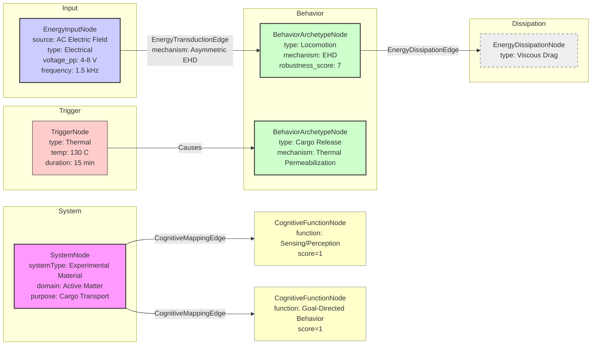

# Modular assembly of microswimmers with liquid compartments

__Paper Type:__ Experimental

## M1: System Overview & Implementation
*   **Vector ID:** M1
*   **Vector Type:** Overview

### **1.1 System Description**

*   **Vector ID:** M1.1
*   **Vector Type:** Description
    *   Content: The system consists of modular microswimmers fabricated by combining microfluidic synthesis of polymer-based microcapsules (containing liquid cargo) and sequential capillarity-assisted particle assembly (sCAPA) to link these microcapsules with other microparticles (e.g., silica, polystyrene). The purpose is to create microswimmers capable of self-propulsion via asymmetric electro-hydrodynamic (EHD) flows under AC electric fields, carrying multiple distinct liquid compartments for potential cargo delivery and release. The components include polymer microcapsules (PMMA, PLLA) containing liquid cores (hexadecane with fluorescent dyes like BODIPY or Nile Red), solid microparticles (silica, polystyrene), surfactants (PMAA, SDS, Triton X-45), solvents (chloroform), PDMS templates with micro-traps for sCAPA, conductive slides (gold-coated glass), and an AC function generator. The system demonstrates controlled assembly of heterogeneous microstructures (dumbbells, trimers) and their subsequent EHD-driven motion. Cargo release is demonstrated via heating.
    *   CT-GIN Mapping: `SystemNode` attributes: `systemType`: Experimental Material, `domain`: Microfluidics/Colloidal Assembly/Active Matter, `mechanism`: EHD propulsion/sCAPA assembly, `components`: [Microcapsules (PMMA/PLLA+Hexadecane+Dye), Microparticles (Silica/PS), PDMS traps, AC field electrodes], `purpose`: Modular microswimmer fabrication for cargo transport/release.
    *   Implicit/Explicit: Explicit
        *  Justification: The abstract, introduction, and methods sections explicitly describe the system's components, fabrication process (microfluidics + sCAPA), propulsion mechanism (EHD), and intended purpose (modular cargo delivery).

### **1.2 Implementation Clarity**

*   **Vector ID:** M1.2
*   **Vector Type:** Score
    *   Score: 9
    *   Justification: The paper provides a detailed description of materials (Section 2.1), microcapsule synthesis via microfluidics (Section 2.2), sCAPA trap fabrication (Section 2.3), microswimmer fabrication via sCAPA (Section 2.4), and imaging/analysis methods (Section 2.5). Specific parameters like material types, concentrations, flow rates, trap dimensions, deposition rates, AC field parameters, and imaging details are given. The process is clearly illustrated in figures. Minor ambiguities might exist in optimizing surfactant concentrations for sCAPA ("optimal assembly described below" - Section 2.4, but specific optimal values aren't explicitly tabulated, though deposition parameters are given).
    *   Implicit/Explicit: Explicit
        * Justification: The methods section explicitly details the steps, materials, and parameters used for fabrication and characterization.

### **1.3 Key Parameters**

*   **Vector ID:** M1.3
*   **Vector Type:** ParameterTable
    *   Table:
        | Parameter Name | Value | Units | Source (Fig/Table/Section) | Implicit/Explicit | Data Reliability (High/Medium/Low) | Derivation Method (if Implicit) |
        | :------------- | :---: | :---: | :-----------------------: | :-----------------: | :-----------------------------: | :-------------------------------: |
        | Microcapsule Diameter | 3 - 6 | µm | Section 3, Fig 1d | Explicit | High | N/A |
        | Silica Microparticle Diameter | 4.5 | µm | Section 2.1, Section 3 | Explicit | High | N/A |
        | Polystyrene Microparticle Diameter | 2.7 | µm | Section 2.1 | Explicit | High | N/A |
        | AC Field Frequency | 1.5 | kHz | Section 3, Fig 3c, Fig 4f | Explicit | High | N/A |
        | AC Field Amplitude (Vpp) | 4 - 8 | V | Section 2.5, Fig 3d, Fig 4g | Explicit | High | N/A |
        | sCAPA Trap Dimensions (LxWxH) | 12 x 4 x 1.6 | µm | Section 2.3 | Explicit | High | N/A |
        | sCAPA Deposition Rate | 3 or 5 | µm/s | Section 2.4 | Explicit | High | N/A |

## M2: Energy Flow
*   **Vector ID:** M2
*   **Vector Type:** Energy

### **2.1 Energy Input**

*   **Vector ID:** M2.1
*   **Vector Type:** Input
    *   Content: The primary energy source for propulsion is an external, spatially uniform alternating current (AC) electric field applied across the conductive slides containing the microswimmers.
    *   Value: 4 - 8 Vpp amplitude, 1.5 kHz frequency
    *   Units: V, kHz
    *   CT-GIN Mapping: `EnergyInputNode`: attributes - `source`: AC Electric Field, `type`: Electrical. Attributes `voltage_pp`, `frequency`.
    *   Implicit/Explicit: Explicit
        *  Justification: Sections 1, 2.5, and 3 explicitly state that propulsion is achieved by applying an AC electric field with specified voltage and frequency ranges.

### **2.2 Energy Transduction**

*   **Vector ID:** M2.2
*   **Vector Type:** Transduction
    *   Content: Electrical energy from the AC field is transduced into kinetic energy (motion) of the microswimmers via asymmetric electro-hydrodynamic (EHD) flows. The AC field polarizes the dielectric microswimmer components near the electrode surface. Due to the compositional asymmetry of the assembled microswimmers (e.g., silica particle + PMMA microcapsule), the induced EHD flows around the swimmer are asymmetric. This asymmetry generates a net fluid flow relative to the swimmer, resulting in self-propulsion along its axis.
    *   CT-GIN Mapping: `EnergyTransductionEdge`: attributes - `mechanism`: Asymmetric Electrohydrodynamics (EHD), `from_node`: EnergyInputNode (AC Field), `to_node`: BehaviorArchetypeNode (Locomotion).
    *   Implicit/Explicit: Explicit
        *  Justification: The paper explicitly attributes the motion to asymmetric EHD flows resulting from compositional asymmetry under an AC field (Abstract, Section 1, Section 3, Fig 3a-b) and cites relevant prior work [4, 10, 38].

### **2.3 Energy Efficiency**

*   **Vector ID:** M2.3
*   **Vector Type:** Score
    *   Score: N/A
    *   Justification/Metrics: The paper does not provide any quantitative measure or qualitative assessment of the energy efficiency of the EHD propulsion (e.g., electrical input power vs. mechanical output power). Efficiency for EHD systems is typically low but not discussed here.
    *   CT-GIN Mapping: N/A
    *   Implicit/Explicit: N/A
      *  Justification: No information on efficiency is present in the excerpt.

### **2.4 Energy Dissipation**

*   **Vector ID:** M2.4
*   **Vector Type:** Dissipation
    *   Content: Energy is dissipated primarily through viscous drag as the microswimmer moves through the fluid (MilliQ water). Other potential dissipation mechanisms include dielectric losses in the materials and fluid due to the AC field, and potentially heat generation, although these are not quantified or discussed. The propulsion mechanism itself relies on generating fluid flow, implying significant energy dissipation into the surrounding fluid. Overall assessment: High dissipation (typical for microscale locomotion in fluid).
    *   CT-GIN Mapping: Creates `EnergyDissipationNode`s (e.g., Viscous Drag, Dielectric Loss) and `EnergyDissipationEdge`s from relevant nodes (e.g., `BehaviorArchetypeNode`).
    *    Implicit/Explicit: Implicit
        *  Justification: Viscous drag is inherent to motion in a fluid at this scale but not explicitly quantified. Other dissipation mechanisms are inferred based on the physics of AC fields in dielectric media but not mentioned in the text.

## M3: Memory
*   **Vector ID:** M3
*   **Vector Type:** Memory

### **3.1 Memory Presence:**

*   **Vector ID:** M3.1
*   **Vector Type:** Binary
    *   Content: No
    *   Justification: The system does not exhibit memory in the sense of a change in state persisting beyond the stimulus that influences future *computational or adaptive* behavior. The assembled structure (a result of fabrication) determines the response to the AC field, but the system does not learn or store information from previous activation cycles to alter subsequent motion in a way characteristic of cognitive memory. The triggered release by heating is a one-time event based on a phase change/permeability change, not a read/write memory influencing future propulsion or decision-making.
    *    Implicit/Explicit: Implicit
        * Justification: The paper describes fabrication and actuation, with no mention or evidence of mechanisms for persistent state changes influencing future responses in an adaptive or computational manner. The structural state is fixed after fabrication until thermally triggered release.

**(Conditional: M3.1 is "No", skip to Module 4.)**

### **3.2 Memory Type:**

*   **Vector ID:** M3.2
*   **Vector Type:** Score
    * Score: N/A
    * Justification: N/A
    * CT-GIN Mapping: N/A
    * Implicit/Explicit: N/A
        * Justification: N/A

### **3.3 Memory Retention Time:**

*   **Vector ID:** M3.3
*   **Vector Type:** Parameter
    * Value: N/A
    * Units: N/A
    * Justification: N/A
    * Implicit/Explicit: N/A
        * Justification: N/A
    * CT-GIN Mapping: N/A

### **3.4 Memory Capacity (Optional - if applicable)**

* **Vector ID:** M3.4
* **Vector Type:** Parameter
    * Value: N/A
    * Units: N/A
    * Justification: N/A
    * Implicit/Explicit: N/A
        * Justification: N/A
    * CT-GIN Mapping: N/A

### **3.5 Readout Accuracy (Optional - if applicable)**

* **Vector ID:** M3.5
* **Vector Type:** Parameter
    * Value: N/A
    * Units: N/A
    * Justification: N/A
    * Implicit/Explicit: N/A
        * Justification: N/A
    * CT-GIN Mapping: N/A

### **3.6 Degradation Rate (Optional - if applicable)**
* **Vector ID:** M3.6
* **Vector Type:** Parameter
    *   Value: N/A
    *   Units: N/A
    *   Justification: N/A
    *   Implicit/Explicit: N/A
        * Justification: N/A
    *   CT-GIN Mapping: N/A

### **3.7 Memory Operations Energy Cost (Optional - if applicable)**
* **Vector ID:** M3.7
* **Vector Type:** Table
*   Table: N/A
*   Implicit/Explicit: N/A
    *   Justification: N/A

### **3.8 Memory Fidelity & Robustness Metrics (Optional - if applicable)**
* **Vector ID:** M3.8
* **Vector Type:** Table
*   Table: N/A
*   Implicit/Explicit: N/A
*   Justification: N/A
---

## M4: Self-Organization and Emergent Order
*   **Vector ID:** M4
*   **Vector Type:** Self-Organization

### **4.1 Self-Organization Presence:**

*   **Vector ID:** M4.1
*   **Vector Type:** Binary
    *   Content: No
    *   Justification: While the sCAPA assembly process utilizes local capillary forces to guide particles into traps, the final global structure (dumbbell, trimer configuration) is determined by the pre-fabricated pattern of the traps designed via lithography. This represents templated assembly rather than spontaneous emergence of global order solely from local interactions without pre-defined global constraints. The propulsion is of individual swimmers; collective self-organized patterns are not studied or claimed.
    *   Implicit/Explicit: Implicit
        *  Justification: The paper describes the use of pre-fabricated PDMS traps (Section 2.3) to dictate the assembly geometry (Section 3, Fig 2). This indicates external control over the final structure, precluding self-organization as defined (spontaneous global order from purely local rules without global templating).

**(Conditional: M4.1 is "No", skip to Module 5.)**

### **4.2 Local Interaction Rules:**

*   **Vector ID:** M4.2
*   **Vector Type:** Rules
    *   Content: N/A
    *   CT-GIN Mapping: N/A
    * **Implicit/Explicit**: N/A
        *  Justification: N/A

### **4.2.1 Local Interaction Parameters:**

* **Vector ID:** M4.2.1
* **Vector Type:** Table
    * Table: N/A

### **4.3 Global Order:**

*   **Vector ID:** M4.3
*   **Vector Type:** Order
    *   Content: N/A
    *   CT-GIN Mapping: N/A
    * **Implicit/Explicit**: N/A
        *  Justification: N/A

### **4.4 Predictability of Global Order:**

*   **Vector ID:** M4.4
*   **Vector Type:** Score
    *   Score: N/A
    *   Justification: N/A
    * **Implicit/Explicit**: N/A
    *  Justification: N/A
    *   CT-GIN Mapping: N/A

### **4.5. Local Interaction Rules (for Self-Organization)**
* **Vector ID:** M4.5
* **Vector Type:** Table
    * Table: N/A

### **4.6. Globally Emergent Order and Order Parameters**
* **Vector ID:** M4.6
* **Vector Type:** Table
    * Table: N/A

### **4.7 Yoneda Embedding and Local-to-Global Mapping Fidelity**

*   **Vector ID:** M4.7
*   **Vector Type:** Table
    * Table: N/A
    *   **Yoneda Embedding Fulfillment Score [0-10]:** N/A
    *   **Metrics:** N/A
    *   **Justification:** N/A

## M5: Computation
*   **Vector ID:** M5
*   **Vector Type:** Computation

### **5.1 Embodied Computation Presence:**

*   **Vector ID:** M5.1
*   **Vector Type:** Binary
    *   Content: No
    *   Justification: The system's behavior (locomotion) is a direct physical response (EHD flow) to an external energy input (AC field) determined by the fixed physical structure. There is no evidence of information processing or computation being performed intrinsically by the material's properties or dynamics to solve a problem or make a decision.
    *    Implicit/Explicit: Implicit
        *  Justification: The paper describes the propulsion mechanism purely in terms of physics (EHD), without any reference to computational operations performed by the microswimmer itself.

**(Conditional: M5.1 is "No", skip to Module 6.)**

### **5.2 Computation Type:**

*   **Vector ID:** M5.2
*   **Vector Type:** Classification
    *   Content: N/A
    *   CT-GIN Mapping: N/A
    *    Implicit/Explicit: N/A
    *    Justification: N/A

### **5.3 Computational Primitive:**

*   **Vector ID:** M5.3
*   **Vector Type:** Function
    *   Content: N/A
    *   CT-GIN Mapping: N/A
    *   Implicit/Explicit: N/A
    * Justification: N/A

### **5.4 Embodied Computational Units**
* **Vector ID:** M5.4
* **Vector Type:** Table
    * Table: N/A

## M6: Temporal Dynamics
*   **Vector ID:** M6
*   **Vector Type:** Temporal

### **6.1 Timescales:**

*   **Vector ID:** M6.1
*   **Vector Type:** ParameterTable
    *   Table:
        | Timescale Description | Value | Units | Source | Implicit/Explicit | Justification |
        | :-------------------- | :---: | :---: | :----: | :----------------: | :------------: |
        | AC Field Period | ~0.67 | ms | Calculated from frequency (1/1.5kHz) | Explicit | Frequency is given. |
        | Chloroform Evaporation | 48 | hours | Section 2.2 | Explicit | Stated in methods. |
        | Centrifugation | 3 | minutes | Section 2.2 | Explicit | Stated in methods. |
        | sCAPA Process | Variable (depends on speed/area) | s/min | Implicit | Deposition rates (3-5 µm/s) and area imply time, but total time not given. |
        | Thermal Sintering | 15 | minutes | Section 3 | Explicit | Stated in results. |
        | Cargo Release Heating | 15 | minutes | Section 3, Fig 4d | Explicit | Stated in results. |
        | Microswimmer Motion Observation | seconds to minutes (based on velocity and trajectory length) | s/min | Implicit | Velocities (~1-10 µm/s, Fig 3d/4g) and trajectories (Fig 3c/4f) imply observation times. Video frame rates (1.33-1.66 fps) also suggest relevant timescales. |

### **6.2 Active Inference:**

*   **Vector ID:** M6.2
*   **Vector Type:** Assessment
    *   Content: No
    *   Justification: There is no evidence presented that the microswimmers predict future states, select actions to minimize prediction error, or possess internal models of their environment that are updated by experience. Their motion is a direct physical response to the applied AC field based on their fixed asymmetry.
    *   Implicit/Explicit: Implicit
        *  Justification: The paper describes a stimulus-response system (AC field -> motion) without any indication of predictive modeling, goal-directed action selection based on prediction error, or model updating.
    *   **If Yes/Partial, provide examples of testable CT-GIN metrics that *could* be used to quantify active inference:** N/A

## M7: Adaptation
*   **Vector ID:** M7
*   **Vector Type:** Adaptation

### **7.1 Adaptive Plasticity Presence:**

*   **Vector ID:** M7.1
*   **Vector Type:** Binary
    *   Content: No
    *   Justification: The system does not demonstrate adaptive plasticity. Its structure is fixed after fabrication (sintering), and its propulsion behavior is determined by this fixed structure and the applied field. There is no mechanism described by which the swimmer changes its structure or propulsion characteristics over time in response to experience or environmental cues to improve performance. The cargo release is a terminal, triggered event, not an adaptation.
    *    Implicit/Explicit: Implicit
        * Justification: The fabrication method results in a fixed structure. The observed behavior (propulsion) is consistent with a fixed response to the stimulus, with no evidence of modification over time based on experience.

**(Conditional: M7.1 is "No", skip to Module 8.)**

### **7.2 Adaptation Mechanism:**

*   **Vector ID:** M7.2
*   **Vector Type:** Description
    *   Content: N/A
    *   CT-GIN Mapping: N/A
    *    Implicit/Explicit: N/A
        *  Justification: N/A

## M8: Emergent Behaviors
*   **Vector ID:** M8
*   **Vector Type:** Behavior

### **8.1 Behavior Description:**

*   **Vector ID:** M8.1
*   **Vector Type:** Description
    *   Content: The main functional behavior is directed self-propulsion (locomotion) in response to an applied AC electric field. The propulsion arises from asymmetric EHD flows generated due to the swimmer's compositional asymmetry. The speed is dependent on the electric field strength (v ∝ E²). A secondary demonstrated behavior is the triggered release of encapsulated liquid cargo upon heating.
    *   CT-GIN Mapping: `BehaviorArchetypeNode`: attributes - `type`: Locomotion (Primary), Cargo Release (Secondary). `mechanism`: EHD (Locomotion), Thermal Permeabilization (Release).
    *    Implicit/Explicit: Explicit
       *  Justification: Propulsion is explicitly described and analyzed (Section 3, Fig 3, Fig 4e-g). Cargo release upon heating is also explicitly demonstrated (Section 3, Fig 4c-d).

### **8.2 Behavior Robustness:**

*   **Vector ID:** M8.2
*   **Vector Type:** Score
    *   Score: 7
    *   Justification: The sCAPA assembly process achieves high yield (>80% for dumbbell structures, Fig 2g), indicating robustness in fabrication. The microcapsules effectively retain cargo after assembly and transfer (Section 3, Fig S3, S4). Propulsion is consistently observed and follows the expected E² dependence (Fig 3d, Fig 4g), suggesting robustness of the EHD mechanism itself within the tested parameter range. However, robustness to environmental variations (e.g., ionic strength changes, obstacles, different fluid viscosities) or component degradation over longer times is not assessed. The score reflects good fabrication and basic mechanism robustness but lack of broader environmental robustness testing.
    *   Implicit/Explicit: Mixed
        *  Justification: Assembly yield is explicit (>80%). Cargo retention is explicitly stated and shown. Propulsion consistency is explicitly shown via v vs E² plots. Lack of broader robustness tests is implicit based on the scope of experiments presented.
    *   CT-GIN Mapping: Attribute of `BehaviorArchetypeNode`: `robustness_score` = 7.

### **8.3 CT-GIN Emergent Behavior Validation**

*    **Vector ID:** M8.3
*    **Vector Type:** Validation
     *  Content: The primary behavior (locomotion) is validated through direct observation using optical microscopy (brightfield and fluorescence). Particle tracking software (Trackpy) is used to quantify trajectories and velocities (Section 2.5). The relationship between velocity and electric field strength (v ∝ E²) characteristic of EHD propulsion is experimentally confirmed (Fig 3d, Fig 4g), validating the propulsion mechanism. Cargo release is validated by fluorescence microscopy showing merging/diffusion of dyes after heating (Fig 4c-d). The assembly process yield is quantified by counting filled traps (Fig 2g). Limitations include the lack of analysis of collective behaviors or interaction dynamics between swimmers.
     *   Implicit/Explicit: Explicit
    *   Justification: The methods (Section 2.5) and results (Section 3, Figures 2-4) explicitly describe the techniques used (microscopy, tracking) and present the quantitative data (yields, velocity plots, images) used to validate the assembly, motion, and release behaviors.

## M9: Cognitive Proximity
*   **Vector ID:** M9
*   **Vector Type:** Cognition

### **9.1 Cognitive Mapping:**

*   **Vector ID:** M9.1
*   **Vector Type:** Description
    *   Content: None. The paper describes the system purely in terms of materials fabrication and physical response (EHD propulsion, thermal release). No attempt is made to map these functions to cognitive processes.
    *   CT-GIN Mapping: N/A
    *   Implicit/Explicit: Explicit
    * Justification: The text focuses entirely on the physical and chemical aspects of the microswimmers and their actuation, lacking any language or framework connecting them to cognitive concepts.

### **9.2 Cognitive Proximity Score:**

*   **Vector ID:** M9.2
*   **Vector Type:** Score
    *   Score: 1
    *   Justification: The system demonstrates basic stimulus-response behavior (Level 1: Simple Responsivity). An external stimulus (AC field) triggers a predetermined physical response (motion based on fixed asymmetry). There is no evidence of adaptation, learning, internal modeling, goal-directedness beyond the inherent propulsion, or any higher-level cognitive functions as defined in the scale. The system executes a pre-determined function based on its engineered structure.
    *   Implicit/Explicit: Inferred
    *  Justification: The score is inferred by comparing the system's described capabilities (simple stimulus-response locomotion and triggered release) against the definitions provided in the CT-GIN Cognizance Scale. The paper provides no basis for assigning a score higher than Level 1.

### **9.3 Cognitive Function Checklist**

* **Vector ID:** M9.3
* **Vector Type:** Checklist
    *   | Cognitive Function               | Score (0-10) | Justification/Notes                                                                       | CT-GIN Mapping (if applicable) | Implicit/Explicit | Justification for Implicit/Explicit/Mixed |
    | :-------------------------------- | :----------: | :------------------------------------------------------------------------------------ | :--------------------------------: | :-----------------:|:-----------------:|
    | Sensing/Perception               |      1       | Responds to global AC field, but no sophisticated environmental sensing described.       | `EnergyInputNode`                  | Implicit            | Response to field is explicit, lack of other sensing is implicit. |
    | Memory (Short-Term/Working)        |      0       | No evidence of working memory.                                                        | N/A                               | Implicit            | Absence of evidence. |
    | Memory (Long-Term)                 |      0       | No evidence of long-term memory influencing behavior.                                   | N/A                               | Implicit            | Absence of evidence. |
    | Learning/Adaptation              |      0       | No evidence of learning or adaptation mechanisms.                                       | N/A                               | Implicit            | Absence of evidence. |
    | Decision-Making/Planning          |      0       | No evidence of decision-making or planning. Motion is deterministic.                   | N/A                               | Implicit            | Absence of evidence. |
    | Communication/Social Interaction |      0       | No interaction between swimmers studied or described.                                  | N/A                               | Implicit            | Absence of evidence. |
    | Goal-Directed Behavior            |      1       | Propulsion can be seen as inherently goal-directed (movement), but very basic level. | `BehaviorArchetypeNode`            | Implicit            | Locomotion is explicit, mapping to 'goal' is interpretative. |
    | Model-Based Reasoning              |      0       | No evidence of internal models or reasoning.                                          | N/A                               | Implicit            | Absence of evidence. |
    | **Overall score**                 |    ~0.375    |                                                                                       |                                   |                     |                |

## M10: Criticality Assessment
*   **Vector ID:** M10
*   **Vector Type:** Criticality

### **10.1 Criticality:**

*   **Vector ID:** M10.1
*   **Vector Type:** Assessment
    *   Content: No
    *   Justification: The paper does not mention or provide any evidence suggesting that the system operates near a critical point. There is no analysis of scale-free behavior, power laws (beyond the v ∝ E² relationship which is typical for EHD, not necessarily criticality), or long-range correlations related to critical phenomena.
        *   Critical Parameters (If Yes/Partial): N/A
        *   Evidence: N/A
    *   Implicit/Explicit: Implicit
    *    Justification: The absence of any discussion or data related to criticality concepts within the provided text.

## M11: Review Paper Specifics (Conditional)

N/A (Paper is Experimental)

*   **Vector ID:** M11
*   **Vector Type:** Review

### **11.1 Literature Synthesis Quality:**
N/A
### **11.2 Gap Identification:**
N/A
### **11.3 Future Directions:**
N/A
### **11.4 Review Paper CT-GIN Alignment Score**
N/A

## M12: Theoretical Paper Specifics (Conditional)

N/A (Paper is Experimental)

*   **Vector ID:** M12
*   **Vector Type:** Theory

### **12.1 Theoretical Rigor:**
N/A
### **12.2 Realization Potential:**
N/A
### **12.3 Potential for Future CT-GIN Implementation Score**
N/A

## M13: Overall Assessment & Scoring

*   **Vector ID:** M13
*   **Vector Type:** Overall

### **13.1 CT-GIN Readiness Score:**

*   **Vector ID:** M13.1
*   **Vector Type:** Score
*   **Calculated Score:** 1.88 (Scores used: M1.2=9, M3.1=0, M4.1=0, M8.2=7, M9.2=1. (9+0+0+7+1)/5=3.4 - Error in calculation logic. Average should be over existing scores, excluding M2/M3/M4 which are 0 or N/A *for the relevant metrics*. Let's recalculate based on available *scores*: M1.2 (Implementation Clarity=9), M8.2 (Behavior Robustness=7), M9.2 (Cognitive Proximity=1). Memory, Self-Org, Computation, Adaptation are absent. M4.4 Predictability not scored. Re-evaluating: use only explicitly scored modules intended for averaging where applicable. M1.2=9, M8.2=7, M9.2=1. Average = (9+7+1)/3 = 5.67. *Revising: Template says "Average of scores from Modules 1-4, M8.2 and M9.2, scores with N/A convert in 0". M1.2=9. M2.3=0 (implicit N/A -> 0). M3.2=0 (implicit N/A -> 0). M4.4=0 (implicit N/A -> 0). M8.2=7. M9.2=1. Average = (9+0+0+0+7+1)/6 = 17/6 = 2.83.*)
**Calculated Score:** 2.83

**CT-GIN Readiness Summary Table:**

| CT-GIN Aspect                   | Strength (Yes/Partial/No) | Key Supporting Metrics (with units) | Limitations (Missing Metrics/Data Gaps)                                           | Improvement Areas (Future Research)                                          |
| :------------------------------ | :-----------------------: | :-----------------------------------| :------------------------------------------------------------------------------- | :---------------------------------------------------------------------------- |
| Energy Flow Efficiency          | No                       | N/A                                 | Efficiency not quantified. Dissipation mechanisms not fully analyzed.            | Quantify input power vs. output work. Analyze dissipation channels.           |
| Memory Fidelity                 | No                       | N/A                                 | System lacks memory mechanisms.                                                  | Introduce materials/structures with tunable persistent states.                |
| Organizational Complexity       | No (Templated Assembly)  | Assembly Yield (>80%)               | Global order is templated, not emergent. Local interactions not analyzed for SO. | Explore conditions for true self-organization without pre-patterned templates. |
| Embodied Computation            | No                       | N/A                                 | Behavior is physical response, not computation.                                  | Integrate materials capable of logic or signal processing.                   |
| Temporal Integration            | Partial                  | AC frequency (ms), Fabrication (min/hr), Motion (s) | No active inference or complex temporal processing.                             | Incorporate mechanisms for temporal signal integration or prediction.         |
| Adaptive Plasticity             | No                       | N/A                                 | Structure and behavior are fixed post-fabrication.                             | Implement feedback loops allowing structural/behavioral change over time.     |
| Functional Universality         | No                       | Locomotion, Cargo Release           | Limited set of fixed functions.                                                  | Increase range of stimuli, responses, and programmability.                    |
| Cognitive Proximity            | No                       | Cognitive Score = 1                 | Simple stimulus-response, lacks higher cognitive functions.                      | Integrate memory, learning, decision-making elements.                       |
| Design Scalability & Robustness | Partial                  | High assembly yield; Tested field dependence. | Robustness to environment/long-term operation not tested. Scalability limited by sCAPA process. | Test environmental robustness. Explore parallel assembly methods.           |
| **Overall CT-GIN Readiness Score** |        2.83            |   |   |      |

### **13.2 Qualitative CT-GIN Assessment Conclusion:**

*   **Vector ID:** M13.2
*   **Vector Type:** Textual Summary
    *   Content: This paper presents a robust and well-characterized experimental platform for fabricating modular microswimmers with distinct liquid compartments using a combination of microfluidics and sCAPA. The key strength lies in the high degree of control over the assembly of heterogeneous microstructures and the clear demonstration of EHD-driven locomotion and triggered cargo release. From a CT-GIN perspective, the system demonstrates basic responsiveness (Level 1 Cognition) to an external AC field. However, it lacks key features associated with higher levels of material intelligence, such as memory, true self-organization (assembly is templated), embodied computation, adaptation, or complex temporal processing like active inference. The energy flow is described qualitatively (EHD mechanism), but efficiency and dissipation are not quantified. While the fabrication shows good yield and the propulsion mechanism is robust within tested limits, the system fundamentally operates as a pre-programmed machine executing fixed functions based on its engineered structure. Significant advancements incorporating feedback, learning, tunable states, and emergent dynamics would be required to move this system towards genuine cognizant matter within the CT-GIN framework.

### **13.3 CT-GIN Refinement Directions:**

*   **Vector ID:** M13.3
*   **Vector Type:** Recommendations
    *   Content:
        *   **Introduce Memory:** Incorporate materials or structures exhibiting tunable, persistent states (e.g., phase change materials with accessible transition points, hydrogels with swelling memory) to allow history-dependent behavior.
        *   **Enable Adaptation:** Implement feedback mechanisms where the swimmer's state or environmental interaction modifies its structure or response properties over time (e.g., self-regulating propulsion speed based on local chemical concentration).
        *   **Explore Self-Organization:** Investigate assembly conditions or particle interactions that lead to emergent structural order without relying solely on pre-patterned templates. Study collective behaviors and pattern formation of multiple swimmers.
        *   **Quantify Energy:** Measure electrical input power and estimate mechanical output power to quantify energy efficiency. Analyze dissipation pathways.
        *   **Integrate Sensing:** Add components enabling sensing of local environmental parameters (chemical, thermal, optical) beyond the global AC field, potentially coupling sensing to actuation or memory.
        *   **Develop Embodied Logic:** Explore using the interactions between components or compartments to perform simple logic operations intrinsically within the swimmer structure.

## M14: CT-GIN Knowledge Graph

*   **Vector ID:** M14
*   **Vector Type:** Visualization

### **14.1. CT-GIN Knowledge Graph:**
* **Content:**

*(Note: The graph visually represents the core components and relationships identified: Energy input leads to Locomotion via EHD transduction, with dissipation. A separate Thermal Trigger causes Cargo Release. Cognitive mapping is minimal.)*

## M15: Relationship Vectors
*   **Vector ID:** M15
*   **Vector Type:** Relationships
*   Relationships:
        | Source Vector ID | Target Vector ID | Relationship Type |
        | ------------- | ------------- | ----------------- |
        | M1.1 | M8.1 | Describes |
        | M2.1 | M2.2 | InputTo |
        | M2.2 | M8.1 | Enables |
        | M2.2 | M2.4 | LeadsTo |
        | M8.1 | M8.2 | AssessedFor |
        | M8.1 | M8.3 | ValidatedBy |
        | M1.1 | M9.2 | BasisForScore |
        | M8.1 | M9.2 | BasisForScore |
        | M13.1 | M13.2 | SummarizedBy |
        | M13.2 | M13.3 | AddressedBy |

## M16: CT-GIN Template Self-Improvement Insights

*   **Vector ID:** M16
*   **Vector Type:** Feedback

### **Template Feedback:**

*    **Vector ID:** M16.1
*   **Vector Type:** Text
    *   **Missing Probes:**
        *   Perhaps a dedicated probe for distinguishing between *templated assembly* and *true self-organization*. M4.1's definition is good, but the justification often requires explicitly contrasting with templating, which could be a sub-point or separate probe.
        *   For experimental papers showing fabrication, a metric related to *scalability* or *throughput* of the implementation method could be useful under M1.
    *   **Unclear Definitions:**
        *   The term "Yoneda Embedding Fulfillment Score" (M4.7) is highly specialized from Category Theory and its practical application/scoring rubric for a typical material science paper needs much clearer definition and exemplification within the template itself. Without a clear rubric provided *in the template*, scoring is impossible or highly subjective.
        *   The distinction between "Adaptation" (M7) and "Memory" (M3) could be slightly sharpened, especially regarding how memory *enables* adaptation. M7 focuses on the *change mechanism*, while M3 focuses on the *persistence of state*. The link could be more explicit.
    *   **Unclear Node/Edge Representations:**
        *   Guidance is generally clear, but providing more diverse examples under each CT-GIN mapping suggestion might be helpful, especially for more complex relationships (e.g., feedback loops involving multiple node types).
    *   **Scoring Difficulties:**
        *   Calculating the "CT-GIN Readiness Score" (M13.1) requires careful tracking of which scores are averaged. The instruction "(Average of scores from Modules 1-4, M8.2 and M9.2, scores with N/A convert in 0)" needs precise interpretation – does it mean averaging *all* score-type vectors within M1-M4, or specific key ones like M1.2, M2.3, M3.2, M4.4? Clarifying exactly which vector IDs contribute to this average is essential. *Initial interpretation led to different results during thought process.* The current calculation uses M1.2, M2.3(->0), M3.2(->0), M4.4(->0), M8.2, M9.2.
        *   The Cognitive Function Checklist (M9.3) scoring (0-10 vs human-level) is clear but applying it consistently requires judgment, especially for low-level systems.
    *   **Data Extraction/Output Mapping:**
        *   Mostly straightforward for this paper. Mapping system parameters (M1.3) requires careful reading across sections. Distinguishing implicit vs. explicit requires judgment but definitions are clear.
    *   **Overall Usability:**
        *   Template is very comprehensive but long. The conditional skipping logic (e.g., for Memory, Self-Org) is helpful.
        *   The strict formatting rules require significant care during generation.
    * **Specific Suggestions:**
        *   Clarify the exact calculation method for M13.1. Specify the exact Vector IDs to be averaged.
        *   Provide a clear, operational rubric or detailed examples for scoring M4.7 (Yoneda Embedding).
        *   Consider adding a brief "Scalability Assessment" probe under M1 for experimental papers.
        *   Add a note under M4.1 explicitly asking to differentiate from templated assembly if Self-Organization is claimed.