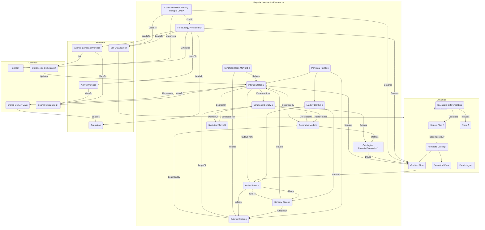

# On Bayesian mechanics: a physics of and by beliefs

__Paper Type:__ Theoretical/Review

## M1: System Overview & Implementation
*   **Vector ID:** M1
*   **Vector Type:** Overview

### **1.1 System Description**

*   **Vector ID:** M1.1
*   **Vector Type:** Description
    *   Content: The paper introduces and reviews Bayesian mechanics, a theoretical framework positioned as a probabilistic mechanics for modeling self-organizing systems. It describes systems endowed with a 'particular partition' (internal states, external states, and intervening Markov blanket states - sensory and active). The core idea is that the internal states (or their dynamics) encode parameters of probabilistic beliefs (probability densities, often variational densities q) about external states (or their dynamics). The system dynamics are described as flows on statistical manifolds (belief spaces) governed by principles like the Free Energy Principle (FEP) or the Constrained Maximum Entropy Principle (CMEP), making the system *appear* to perform approximate Bayesian inference to maintain its structure against dissipation. It aims to provide mechanical theories (equations of motion, potentials, forces) for systems that minimize surprisal (or variational free energy, an upper bound on surprisal) or maximize entropy subject to constraints, linking physical dynamics to information dynamics (belief updating). Key components include the particular partition (internal μ, external η, sensory s, active a states), the generative model p(x), the variational density q(η) parameterized by μ, the variational free energy F, and concepts like synchronization maps and ontological potentials (NESS potentials or constraints). The purpose is to provide a physics-based explanation for self-organization, adaptation, and the appearance of inference in complex systems.
    *   CT-GIN Mapping: `SystemNode` attributes: `systemType`: TheoreticalFramework, `domain`: StatisticalPhysics/ComplexityScience, `mechanism`: VariationalInference/MaximumEntropy, `components`: [ParticularPartition(InternalStates, ExternalStates, MarkovBlanket(SensoryStates, ActiveStates)), GenerativeModel, VariationalDensity, FreeEnergyPrinciple, ConstrainedMaximumEntropyPrinciple, StatisticalManifold], `purpose`: ModelSelfOrganizationAndInference
    *   Implicit/Explicit: Explicit
        *  Justification: The paper explicitly defines Bayesian mechanics, its components (partition, beliefs), the principles involved (FEP, CMEP), and its purpose throughout the abstract and introduction.

### **1.2 Implementation Clarity**

*   **Vector ID:** M1.2
*   **Vector Type:** Score
    *   Score: 7
    *   Justification: The paper clearly outlines the conceptual framework of Bayesian mechanics, the FEP, Markov blankets, and the duality with CMEP. It introduces the key mathematical objects (SDEs, potentials, free energy, entropy). However, as a review/introduction, it often opts for qualitative descriptions over explicit equations and refers readers to other technical papers for detailed derivations, assumptions, and proofs (e.g., "refer the reader to the technical material for detailed examinations", "we will often opt for qualitative descriptions instead of explicit equations"). The discussion of gauge theory is high-level. While the concepts are introduced, a full, self-contained mathematical implementation requires consulting the cited literature.
    *   Implicit/Explicit: Mixed
        * Justification: The score reflects the explicit clarity of the conceptual overview but acknowledges the implicit reliance on external references for full mathematical details, as stated by the authors.

### **1.3 Key Parameters**

*   **Vector ID:** M1.3
*   **Vector Type:** ParameterTable
    *   Table:
        | Parameter Name | Value | Units | Source (Fig/Table/Section) | Implicit/Explicit | Data Reliability (High/Medium/Low) | Derivation Method (if Implicit) |
        | :------------- | :---: | :---: | :-----------------------: | :-----------------: | :-----------------------------: | :-------------------------------: |
        | Variational Free Energy (F) | Functional | N/A (Information/Energy units implied) | Eq (3.3) context, Sec 3.1 | Explicit | High (as definition) | N/A |
        | Surprisal (I) | -log p(x) | N/A (Information units implied, e.g., nats) | Sec 1, Sec 3.1 | Explicit | High (as definition) | N/A |
        | Entropy (H) | E[-log p(x)] or -∫p(x)log p(x)dx | N/A (Information units implied, e.g., nats) | Sec 1, Sec 5.2 | Explicit | High (as definition) | N/A |
        | NESS Potential (J(x)) | -log p_NESS(x) | N/A (Information/Energy units implied) | Sec 3.3 | Explicit | High (as definition) | N/A |
        | Lagrange Multiplier (λ) | Scalar | Inverse units of Constraint J | Sec 5.1, Eq (5.4) context | Explicit | High (as definition) | N/A |

    *   **Note:** These are defining theoretical quantities within the framework, not specific experimental parameters. Units are typically context-dependent (e.g., nats for information, Joules/kT for physical energy correspondence). NESS = Non-Equilibrium Steady State.

## M2: Energy Flow
*   **Vector ID:** M2
*   **Vector Type:** Energy

### **2.1 Energy Input**

*   **Vector ID:** M2.1
*   **Vector Type:** Input
    *   Content: The framework is general and doesn't specify a primary physical energy source. It discusses theoretical energy concepts like variational free energy, potential energy (V(q)), kinetic energy (1/2 mv^2), and thermodynamic concepts like entropy and dissipation. The underlying physical system being modeled would have its own specific energy inputs (e.g., chemical potential, thermal gradients), but these are abstracted away in the general Bayesian mechanics formulation. The "energy" minimized is often variational free energy, an information-theoretic quantity related to surprisal, or action (integral of Lagrangian).
    *   Value: N/A
    *   Units: N/A
    *   CT-GIN Mapping: `EnergyInputNode`: attributes - `source`: Abstract/Theoretical, `type`: VariationalFreeEnergy/Potential/Action/Entropy
    *   Implicit/Explicit: Implicit
        *  Justification: The paper discusses energy concepts theoretically (free energy, potential, kinetic, entropy) but doesn't define a specific physical energy input for the general framework. The nature of energy is inferred from the context of statistical mechanics and information theory.

### **2.2 Energy Transduction**

*   **Vector ID:** M2.2
*   **Vector Type:** Transduction
    *   Content: The framework describes dynamics as arising from gradients of potentials (e.g., ontological potential J(x) = -log p(x), variational free energy F, classical potential V(q)). Energy is implicitly 'transduced' into forces driving the system's state evolution (physical dynamics) and belief updates (information dynamics). For example, minimizing the action (integral of Lagrangian L = T - V) leads to equations of motion. Minimizing variational free energy F drives dynamics towards states of low surprisal (belief updating and potentially physical action via active inference). Maximizing constrained entropy drives dynamics towards the most probable macrostate consistent with constraints. The Helmholtz decomposition splits flow into dissipative (gradient-related) and conservative (solenoidal) components, implicitly representing different energy pathways. Gauge theory connects constraints (potentials) to forces acting on the system.
    *   CT-GIN Mapping: `EnergyTransductionEdge`: attributes - `mechanism`: GradientDescent/Flow/ParallelTransport, `from_node`: PotentialNode/LagrangianNode/FreeEnergyNode/EntropyNode, `to_node`: StateVariableNode/BeliefParameterNode
    *   Implicit/Explicit: Implicit
        *  Justification: The paper describes how potentials and principles (FEP, CMEP, Stationary Action) *lead* to dynamics, implying transduction, but doesn't detail specific physical energy conversion steps. The mechanisms are inferred from the mathematical structure presented (gradients, flows).

### **2.3 Energy Efficiency**

*   **Vector ID:** M2.3
*   **Vector Type:** Score
    *   Score: N/A
    *   Justification/Metrics: The paper does not provide metrics for physical energy efficiency. It discusses thermodynamic efficiency implicitly in the context of dissipative structures (Sec 1, citing [14]) and minimizing dissipation (Sec 1, citing [1,36]), often linking it to minimizing free energy. The principle of stationary action implies optimal "efficiency" in terms of path selection (no wasted action). However, no quantitative efficiency value for a specific process modeled by Bayesian mechanics is given. Qualitatively, systems minimizing free energy are suggested to be efficient in maintaining their organization against dissipation.
    *   CT-GIN Mapping: Attribute of relevant `EnergyTransductionEdge`s
    *   Implicit/Explicit: Implicit
      *  Justification: Efficiency is discussed conceptually and linked to the guiding principles (FEP, stationary action) but not quantified for the general framework. Qualitative assessment is inferred.

### **2.4 Energy Dissipation**

*   **Vector ID:** M2.4
*   **Vector Type:** Dissipation
    *   Content: Dissipation is a central theme, discussed in the context of the second law of thermodynamics, self-organization resisting decay, and non-equilibrium systems. The FEP is framed as managing dissipation ("minimizing entropic dissipation over time" - Sec 1). The Helmholtz decomposition separates flow into a dissipative component (related to gradient descent on the potential, countering fluctuations) and a conservative solenoidal component. The noise term (ξ(t)) in the SDE represents random fluctuations/dissipation from a heat bath. CMEP relates system dynamics to dissipation into the ambient heat bath. Quantification is abstract (e.g., related to the diffusion tensor G or the gradient term in Helmholtz decomposition), not in specific physical units for the general framework. Qualitatively, dissipation is inherently present in the stochastic dynamics considered.
    *   CT-GIN Mapping: Creates `EnergyDissipationNode`s (e.g., HeatBath) and `EnergyDissipationEdge`s (linking SystemNode/StateVariableNode to DissipationNode via diffusion/gradient flow). Attribute `magnitude` related to G or gradient term.
    *    Implicit/Explicit: Mixed
        *  Justification: Dissipation is explicitly discussed conceptually. Its link to specific terms in the formalism (noise, gradient flow) is explicit, but quantitative values for a general case are absent (Implicit).

## M3: Memory
*   **Vector ID:** M3
*   **Vector Type:** Memory

### **3.1 Memory Presence:**

*   **Vector ID:** M3.1
*   **Vector Type:** Binary
    *   Content: Yes
    *   Justification: The framework posits that internal states (μ) encode the parameters of beliefs (q) about external states (η). These internal states persist over time and influence future dynamics (belief updating via FEP, action selection via active inference). The state μ(t) carries information about past sensory data (implicitly integrated into the belief q) and affects the system's future trajectory (μ(t+Δt)) and actions (a(t+Δt)), fulfilling the definition of memory. The entire premise relies on the system having an internal state that depends on history and influences the future.
    *    Implicit/Explicit: Implicit
        * Justification: The paper doesn't use the term "memory" extensively in this specific context, but the mechanism described (internal states parameterizing beliefs that evolve over time and guide behavior) is functionally equivalent to memory. The presence is inferred from the core mechanics described.

**(Conditional: If M3.1 is "No", skip to Module 4. If "Yes", include M3.2 and M3.3.)**

### **3.2 Memory Type:**

*   **Vector ID:** M3.2
*   **Vector Type:** Score
*   Score: 6
*   Justification: The memory is encoded in the continuous values of the internal states (μ), which represent sufficient statistics (e.g., mean, precision) of the variational distribution (q). This is akin to an implicit, dynamic, potentially high-capacity (depending on the dimensionality of μ) analog memory. It's actively updated through inference dynamics (gradient descent on F or similar). Read-out occurs via the influence of μ on action (active inference) or further belief updates. Retention depends on the stability of the dynamics and noise levels. It allows for multiple 'states' (values of μ) and is 're-writable' through inference. However, it's not typically a static, discrete memory. The score reflects its dynamic, implicit nature and dependence on ongoing processes. Lack of explicit discussion on capacity and read-out accuracy limits the score.
*   CT-GIN Mapping: Defines the `MemoryNode` type (subtype: `InternalStateBeliefParameter`). Attributes: `encoding`: Continuous/Analog, `mechanism`: DynamicState, `updateRule`: VariationalInference/GradientFlow.
*    Implicit/Explicit: Implicit
    * Justification: The type of memory (dynamic, encoded in parameters) is inferred from the mathematical description of internal states and belief updates. The score is an interpretation based on these inferred properties.

### **3.3 Memory Retention Time:**

*   **Vector ID:** M3.3
*   **Vector Type:** Parameter
*   Value: Variable / System-dependent
*    Units: N/A (Time units, e.g., seconds)
*   Justification: Retention time is not explicitly defined but depends entirely on the timescale of the dynamics of the internal states (μ) and the noise level. Stable attractors or slow dynamics in μ would correspond to longer retention. Fast dynamics or high noise would lead to short retention. The paper discusses dynamics over time but doesn't provide specific timescales for μ persistence in the general case. Qualitatively: Can range from short-term (tracking fast changes) to long-term (stable beliefs/attractors).
*    Implicit/Explicit: Implicit
        * Justification: Retention time is inferred to be a function of the system's dynamics, which are described generally but not quantified in terms of specific timescales for memory persistence.
*   CT-GIN Mapping: Key attribute of the `MemoryNode` (InternalStateBeliefParameter). `retentionTime`: Variable/Dynamic.

### **3.4 Memory Capacity (Optional - if applicable)**

* **Vector ID:** M3.4
* **Vector Type:** Parameter
*  Value: N/A (Potentially High/Continuous)
*   Units: N/A (e.g., bits, number of states)
*   Justification: The capacity depends on the dimensionality and precision of the internal states (μ) serving as parameters. If μ is a high-dimensional continuous variable, the theoretical capacity could be very large. However, the paper doesn't quantify this. It's implicitly determined by the complexity of the chosen internal state space and variational density.
*    Implicit/Explicit: Implicit
        *  Justification: Capacity is inferred from the nature of internal states as parameters, but not explicitly discussed or quantified.
*   CT-GIN Mapping: Key attribute of the `MemoryNode` (InternalStateBeliefParameter). `capacity`: Variable/DimensionalityDependent.

### **3.5 Readout Accuracy (Optional - if applicable)**

* **Vector ID:** M3.5
* **Vector Type:** Parameter
*   Value: N/A
*   Units: N/A (e.g., %, error rate)
*   Justification: Readout isn't a distinct step; the internal state (memory) directly influences ongoing dynamics (belief updates, action). Accuracy could relate to how effectively the current belief q(η|μ) reflects the external state η, or how optimal the resulting action is. The KL divergence term in Eq (3.3) quantifies the inaccuracy of the variational approximation, which is related but not a direct readout accuracy measure. The paper doesn't quantify readout accuracy.
*    Implicit/Explicit: Implicit
       *  Justification: Readout accuracy is not explicitly defined or measured in the paper. Potential interpretations are inferred.
*   CT-GIN Mapping: Could be related to `DKL(q||p)` attribute or attributes of `ActionSelectionEdge`.

### **3.6 Degradation Rate (Optional - if applicable)**
* **Vector ID:** M3.6
* **Vector Type:** Parameter
    *   Value: N/A
    *   Units: N/A (e.g., change per unit time)
    *   Justification: Degradation would correspond to the influence of noise (diffusion term G) pushing the internal state away from its optimal value, or the drift term f(μ) causing it to change. The rate depends on the specifics of the SDE governing μ. The paper describes these dynamics generally but doesn't quantify a specific degradation rate for the stored information (parameters μ).
    *    Implicit/Explicit: Implicit
            * Justification: Degradation is inherent in the stochastic dynamics described but not explicitly quantified as a memory property.
    *   CT-GIN Mapping: Attribute of the `MemoryNode` (InternalStateBeliefParameter), related to diffusion tensor G and drift f(μ).

### **3.7 Memory Operations Energy Cost (Optional - if applicable)**
* **Vector ID:** M3.7
* **Vector Type:** Table
*   Table:
    | Memory Operation ID | Energy Consumption per Bit | Power Usage during Operation| Units | Uncertainty | Data Source Reference | Implicit/Explicit | Justification |
    | :------------------ | :--------------------------: | :-----------------------------: | :---: |:-----------------:|:-----------------:|:-----------------:| :------------------ |
    | Update (Inference)  | N/A                          | N/A                             | N/A   | N/A               | N/A               | N/A               | The paper discusses the dynamics (gradient flow) involved in updating beliefs (memory) but doesn't quantify the physical energy cost. It relates more to information-theoretic costs (e.g., change in free energy).|
*   Implicit/Explicit: N/A
    *   Justification: The paper operates at a theoretical level where physical energy costs of computation/memory updates are not specified.

### **3.8 Memory Fidelity & Robustness Metrics (Optional - if applicable)**
* **Vector ID:** M3.8
* **Vector Type:** Table
*   Table:
    | Metric ID | Description | Value | Units | CT-GIN Mapping | Data Source | Implicit/Explicit | Justification |
    | :-------- | :---------- | :----: | :---: | :-------------: | :----------: |:-----------------:| :-----------------:|
    | KL Divergence | Discrepancy between variational (q) and posterior (p) belief | DKL(q||p) ≥ 0 | N/A (nats) | Attribute `KL_Divergence` on `BeliefNode` or `InferenceEdge` | Eq (3.3) | Explicit | Measures the inaccuracy of the belief encoded by the internal state (memory). Minimizing free energy minimizes this term. |
    | NESS Stability | Robustness of the steady-state belief distribution | N/A | N/A | Attribute on `NESSNode` | Sec 3.3 | Implicit | The existence and properties of the NESS density relate to the stability/robustness of the long-term encoded information. |
*   Implicit/Explicit: Mixed
*   Justification: KL Divergence is explicitly part of the formalism. NESS stability is implicitly relevant to memory robustness but not framed as a memory metric directly.

---

## M4: Self-Organization and Emergent Order
*   **Vector ID:** M4
*   **Vector Type:** Self-Organization

### **4.1 Self-Organization Presence:**

*   **Vector ID:** M4.1
*   **Vector Type:** Binary
    *   Content: Yes
    *   Justification: Self-organization is the central phenomenon Bayesian mechanics aims to explain. The paper explicitly states the framework models systems that "preserve their organization over time," "resist entropic decay," and maintain "structural integrity" by minimizing free energy / surprisal (Sec 1, Sec 3.1). This maintenance of structure in a dissipative environment, driven by local interactions (implicit in the partitioned dynamics) and global principles (FEP/CMEP), is the definition of self-organization used here. The order (system structure, NESS density) emerges from the dynamics constrained by the particular partition and the minimization/maximization principles, not from external templating of the global structure itself.
    *   Implicit/Explicit: Explicit
        *  Justification: The paper explicitly frames Bayesian mechanics as a theory of self-organization multiple times (e.g., "general mechanics of self-organizing and complex adaptive systems", "FEP describes self-organization as a flow towards a free energy minimum").

**(Conditional: If M4.1 is "Yes", include M4.2-M4.7)**

### **4.2 Local Interaction Rules:**

*   **Vector ID:** M4.2
*   **Vector Type:** Rules
    *   Content: The local interaction rules are embodied in the structure of the stochastic differential equations (SDEs) derived from the particular partition (Eq 3.1). Specifically:
        1.  Internal states (μ) dynamics depend only on sensory (s) and active (a) states: `μ_dot = f_μ(s, a, μ) + C_μ ξ_μ(t)`.
        2.  Active states (a) dynamics depend only on internal (μ), sensory (s), and active (a) states: `a_dot = f_a(s, a, μ) + C_a ξ_a(t)`. (Note: Paper uses `f_a(s,a,m)` in partition diagram, implies dependence on μ via s, but direct dependence is often assumed in active inference). Simplified active inference often uses `a_dot = -∂G/∂a`, where G is EFE.
        3.  Sensory states (s) dynamics depend only on external (η), sensory (s), and active (a) states: `s_dot = f_s(η, s, a) + C_s ξ_s(t)`.
        4.  External states (η) dynamics depend only on external (η), sensory (s), and active (a) states (or just η): `η_dot = f_η(η, s, a) + C_η ξ_η(t)`.
        These dependencies define the local information flow across the Markov blanket. The specific *form* of the functions `f_i` and matrices `C_i` defines the precise rule for a given system, often derived from minimizing free energy (for μ, a) or assumed for the environment (η, s).
    *   CT-GIN Mapping: Part of the `AdjunctionEdge` description (local side). Defines `MarkovBlanketInteractionEdge` types based on SDE terms (e.g., `InternalUpdateEdge` from `SensoryNode`, `ActiveNode` to `InternalNode`). `function`: f_i, `noise`: C_i.
    * **Implicit/Explicit**: Explicit
        *  Justification: The partitioned structure of the dynamics, defining local dependencies, is explicitly given in Eq (3.1) and the accompanying text describing the partition.

### **4.2.1 Local Interaction Parameters:**

* **Vector ID:** M4.2.1
* **Vector Type:** Table
*   Table:
    | Rule ID | Description | Parameter Name | Parameter Value Range | Units | Data Source | Implicit/Explicit | Justification |
    | :------ | :---------- | :------------- | :---------- | :---: | :----------: | :----------------: | :------------: |
    | SDE Drift | Defines deterministic flow | Function `f_i(x)` parameters | N/A | System-specific | Eq 3.1 | Implicit | The existence of `f_i` is explicit, but its specific parameters are system-dependent and not given generally. |
    | SDE Noise | Defines stochastic fluctuations | Diffusion Tensor `G = CC^T / 2` elements | N/A | System-specific | Eq 3.1 | Implicit | The existence of `C` (and thus `G`) is explicit, but its specific values are system-dependent. |
    | FEP/CMEP | Guiding principles for dynamics | N/A | N/A | N/A | Sec 3, Sec 5 | Explicit | These principles globally constrain the local rules, but aren't parameters *within* the rules themselves. |

### **4.3 Global Order:**

*   **Vector ID:** M4.3
*   **Vector Type:** Order
    *   Content: The emergent global order is the persistent structure and characteristic dynamics of the 'particular system' itself, maintained despite dissipative forces. This can manifest as:
        1.  **NESS Density:** If a steady state exists, the system maintains a specific probability distribution p(x) over its state space (Sec 3.3). The shape of this density represents the global order.
        2.  **Characteristic Paths/Flows:** Even without a strict NESS, the system follows typical trajectories or flow patterns that minimize surprisal / free energy over time (path-tracking dynamics, Sec 3.2). The ensemble of these paths represents the dynamic order.
        3.  **Synchronization:** The coordinated dynamics between internal, external, and blanket states, potentially maintained around a synchronization manifold (Sec 3.3).
    *   CT-GIN Mapping: Defines a `ConfigurationalNode` (e.g., `NESSDensityNode`, `CharacteristicFlowNode`, `SynchronizationManifoldNode`).
    * **Implicit/Explicit**: Explicit
        *  Justification: The paper explicitly discusses the maintenance of structure, NESS densities, characteristic flows, and synchronization as consequences of the framework.

### **4.4 Predictability of Global Order:**

*   **Vector ID:** M4.4
*   **Vector Type:** Score
    *   Score: 8
    *   Justification: The framework posits that the dynamics (and thus the emergent global order) are governed by variational principles (FEP, CMEP, Stationary Action). If the system conforms to the principle and the generative model/constraints are known, its behaviour (most likely path/state distribution) is predictable, often via gradient flows. The predictability is high *in principle*. However, stochasticity (noise term ξ(t)) introduces inherent unpredictability at the level of specific trajectories, though the *distribution* of trajectories/states remains predictable (via Fokker-Planck equation or path integrals). The potential for chaotic dynamics (mentioned in citation [3]) could also reduce predictability of specific trajectories while maintaining predictable attractor structures. Score reflects high theoretical predictability tempered by stochasticity and potential complexity.
    * **Implicit/Explicit**: Implicit
    *  Justification: Predictability is implied by the framework being based on principles defining dynamics (FEP, CMEP) and the use of SDEs/Fokker-Planck equations. The score is an interpretation of this theoretical predictability.
    *   CT-GIN Mapping: Contributes to the `AdjunctionEdge` (LocalRule -> GlobalOrder) weight/confidence.

### **4.5. Local Interaction Rules (for Self-Organization)**
* **Vector ID:** M4.5
* **Vector Type:** Table
*   Table:
| Rule ID | Description | Parameter | Value Range | Units | Implicit/Explicit | Justification | Source |
| :------ | :---------- | :-------- | :---------- | :---: | :----------------: | :------------: | :-----: |
| StateDep | State dependencies across partition | `f_i` functions in SDE | N/A | System-specific | Explicit | Explicitly defined by zero/non-zero blocks in Eq 3.1 Jacobian | Eq 3.1 |
| NoiseCoupling | How noise affects states across partition | `C_i` matrices in SDE | N/A | System-specific | Explicit | Explicitly defined by zero/non-zero blocks in Eq 3.1 C matrix | Eq 3.1 |
| GradFlow | Gradient descent on free energy / ascent on entropy | Learning rate / time constant (implicit) | N/A | System-specific | Implicit | Gradient flows are discussed, implies parameters controlling step size/rate | Sec 3, 5 |

### **4.6. Globally Emergent Order and Order Parameters**
* **Vector ID:** M4.6
* **Vector Type:** Table
*   Table:
| Property ID | Description | Parameter | Value Range | Units | Implicit/Explicit | Justification | Protocol | Source |
| :---------- | :---------- | :-------- | :---------- | :---: | :----------------: | :------------: | :------: | :-----: |
| NESS | Probability distribution at steady state | p_NESS(x) | [0, 1] | Probability density | Explicit | Defined as stationary solution to Fokker-Planck Eq. | Solve Fokker-Planck | Sec 3.3 |
| VFE | Variational Free Energy | F(μ, s, a) | Real | Nats or Energy | Explicit | Measures deviation from optimal belief/state | Calculate Eq based on q, p | Sec 3.1 |
| Entropy | System Entropy | H[p(x)] | Real ≥ 0 | Nats or Energy/Temp | Explicit | Measure of uncertainty/disorder | Calculate integral | Sec 1, 5.2 |
| SyncError | Deviation from synchronization manifold | Distance Metric | Real ≥ 0 | System-specific | Implicit | Quantifies mismatch between expected internal/external modes | Define manifold & metric | Sec 3.3 |

### **4.7 Yoneda Embedding and Local-to-Global Mapping Fidelity**

*   **Vector ID:** M4.7
*   **Vector Type:** Table
*   Table:
    | Link Type | Description | Predictability | Yoneda Score | Metrics | Implicit/Explicit | Justification | Source |
    | :-------- | :---------- | :------------- | :----------- | :------ | :----------------: | :------------: | :-----: |
    | N/A       | N/A         | N/A            | N/A          | N/A     | N/A                | The paper does not discuss Yoneda embedding explicitly. Category theory is mentioned as relevant to background fields like cybernetics but not applied directly in this way within the text. | N/A    |
    *   **Yoneda Embedding Fulfillment Score [0-10]:** N/A
    *   **Metrics:** N/A
    *   **Justification:** N/A

## M5: Computation
*   **Vector ID:** M5
*   **Vector Type:** Computation

### **5.1 Embodied Computation Presence:**

*   **Vector ID:** M5.1
*   **Vector Type:** Binary
    *   Content: Yes
    *   Justification: The paper frames the dynamics governed by the FEP/CMEP as "approximate Bayesian inference" performed by the system itself. Internal states (μ) processing sensory information (s) to update beliefs (q) about external states (η) constitutes computation. This computation (inference) is intrinsic to the physical dynamics of the system as described by the framework; it's not performed by an external controller but emerges from the system's tendency to minimize free energy or maximize constrained entropy.
    *    Implicit/Explicit: Explicit
        *  Justification: The paper explicitly and repeatedly describes the system dynamics as instantiating "approximate Bayesian inference" (Sec 1, Sec 3.1, Sec 3.3, ABIL), which is a form of computation.

**(Conditional: If M5.1 is "Yes", include M5.2-5.4)**

### **5.2 Computation Type:**

*   **Vector ID:** M5.2
*   **Vector Type:** Classification
    *   Content: Analog/Probabilistic/Variational Inference
    *   CT-GIN Mapping: Defines the `ComputationNode` type. Attributes: `computationParadigm`: VariationalInference.
    *    Implicit/Explicit: Explicit
    *    Justification: The computation is explicitly identified as "(approximate) Bayesian inference" or "variational inference", which involves manipulation of probability densities (often continuous, hence analog) and optimization (gradient descent/ascent).

### **5.3 Computational Primitive:**

*   **Vector ID:** M5.3
*   **Vector Type:** Function
    *   Content: The most basic computational operation is **Belief Updating** via gradient descent on Variational Free Energy (F) or gradient ascent on constrained entropy (S). For internal states μ parameterizing the belief q, the primitive operation is akin to:
        `μ_dot ∝ -∂F/∂μ` (under FEP)
        or related dynamics derived from CMEP/gauge theory (e.g., parallel transport, Sec 5.2).
        This involves calculating gradients of F (which includes expected log likelihoods and priors) or related quantities and updating μ accordingly. Another primitive is **Action Selection** via gradient descent on Expected Free Energy (G) for active states `a`:
        `a_dot ∝ -∂G/∂a` (Active Inference).
    *   **Sub-Type (if applicable):** Gradient Descent/Ascent, Optimization
    *   CT-GIN Mapping: Defines the primary function of the `ComputationNode` (e.g., `BeliefUpdateFunction`, `ActionSelectionFunction`). Attributes: `mathematicalForm`: GradientDescent/Ascent, `objectiveFunction`: FreeEnergy/ExpectedFreeEnergy/ConstrainedEntropy.
    *   Implicit/Explicit: Explicit
    * Justification: Gradient flows on free energy for inference and action selection are explicitly mentioned or strongly implied as the core mechanism driving belief/state updates (e.g., "flow towards a free energy minimum", "path of stationary action over free energy", active inference description).

### **5.4 Embodied Computational Units**
* **Vector ID:** M5.4
* **Vector Type:** Table
*   Table:
| Unit ID | Description | Processing Power | Energy/Operation | Freq/Resp. Time | Bit-Depth | Data Source | Implicit/Explicit | Justification |
| :------ | :---------- | :--------------- | :--------------- | :--------------: | :-------: | :----------: |:-----------------:| :-----------------:|
| Internal State (μ) | Encodes belief parameters | N/A | N/A | System-dependent | Continuous/Analog | N/A | Implicit | Represents the parameters being updated, but performance metrics aren't quantified in the general theory. |
| Markov Blanket (b) | Mediates information flow | N/A | N/A | System-dependent | Continuous/Analog | N/A | Implicit | Represents the interface where sensory input is received and action is enacted, crucial for the computation, but not a processor itself. |

## M6: Temporal Dynamics
*   **Vector ID:** M6
*   **Vector Type:** Temporal

### **6.1 Timescales:**

*   **Vector ID:** M6.1
*   **Vector Type:** ParameterTable
    *   Table:
        | Timescale Description | Value | Units | Source | Implicit/Explicit | Justification |
        | :-------------------- | :---: | :---: | :----: | :----------------: | :------------: |
        | Random Fluctuations (Noise) | Fast (relative) | N/A | Sec 3.1 (SDEs) | Implicit | Noise term ξ(t) implies fast timescale compared to drift. |
        | State/Belief Dynamics | System-dependent | N/A | Sec 3.1 (SDEs) | Implicit | Governed by drift `f(x)` and noise `Cξ`, timescales depend on specific system parameters. |
        | NESS Relaxation | System-dependent | N/A | Sec 3.3 | Implicit | Time to reach steady-state distribution depends on system dynamics. |
        | Action/Behavior | System-dependent | N/A | Sec 3.2 (Active Inf.) | Implicit | Timescale of changes in active states `a` depends on EFE landscape and dynamics. |
    *   **Note:** The paper discusses dynamics abstractly without specifying numerical timescales for the general framework. Timescales are implicitly hierarchy-dependent (fast noise vs. slower state evolution).

### **6.2 Active Inference:**

*   **Vector ID:** M6.2
*   **Vector Type:** Assessment
    *   Content: Yes
    *   Justification: Active inference is explicitly discussed as a key application/component of the framework (Sec 3.2). It is described as the process where the path of active states (`a(t)`) minimizes Expected Free Energy (EFE or G), which involves predicting future sensory states based on potential actions and selecting actions that minimize expected surprise. This fits the definition: (1) prediction (inherent in EFE calculation), (2) action selection (minimizing EFE), (3) internal models (generative model p, variational density q) updated by experience (via FEP).
    *   Implicit/Explicit: Explicit
        *  Justification: Active inference and minimization of Expected Free Energy are explicitly mentioned and described in Sec 3.2 and linked to action selection.
    *   **If Yes/Partial, provide examples of testable CT-GIN metrics that *could* be used to quantify active inference:** Prediction error reduction rate (decrease in KL divergence or surprisal over time); Timescale of anticipation (how far ahead actions seem planned based on EFE); Complexity of internal models (dimensionality/parameters of q and p); Correlation between EFE gradients and actual action `a_dot`; Entropy of action policy (exploratory vs exploitative behavior). Experimental setups could involve simulating systems under FEP/Active Inference and measuring these quantities, or fitting models to empirical data from adaptive systems.

## M7: Adaptation
*   **Vector ID:** M7
*   **Vector Type:** Adaptation

### **7.1 Adaptive Plasticity Presence:**

*   **Vector ID:** M7.1
*   **Vector Type:** Binary
    *   Content: Yes
    *   Justification: The framework is designed to describe adaptive systems. Adaptation occurs as the system minimizes its free energy over time through changes in its internal states (μ, representing beliefs q) and potentially its actions (a). This process leads the system's internal model (q) to better reflect the statistics of its environment (η), improving its ability to predict sensory states and maintain its structure. This change in internal state/belief based on experience (sensory input over time) fits the definition of adaptive plasticity. Sec 1 explicitly mentions modeling "complex adaptive systems" and systems that "acquire the statistics of their embedding environment".
    *    Implicit/Explicit: Explicit
        * Justification: The paper explicitly frames Bayesian mechanics as a framework for "complex adaptive systems" and describes how systems "acquire the statistics of their embedding environment" through processes like FEP minimization.

**(Conditional: If M7.1 is "Yes", include M7.2)**

### **7.2 Adaptation Mechanism:**

*   **Vector ID:** M7.2
*   **Vector Type:** Description
    *   Content: The primary mechanism is **Variational Inference / Belief Updating** driven by the minimization of Variational Free Energy (F). Sensory data (s) influences the calculation of F, and the system's internal states (μ) change (typically via gradient descent: `μ_dot ∝ -∂F/∂μ`) to reduce F. This continuously refines the variational density q(η|μ) to better approximate the true posterior p(η|s), effectively adapting the system's internal model to the observed data. If considering adaptation of actions over time (learning a better policy), this would involve updating the parameters governing action selection, potentially through minimizing EFE or related reinforcement learning analogues described in the literature cited ([84-88]). In the CMEP formulation, adaptation involves adjusting the system's state distribution to maximize entropy under potentially changing constraints reflecting the environment. Gauge theory perspective describes how changes in constraints (J) covary with the probability density (p), representing adaptation to new information/conditions via parallel transport. The mechanism is a form of continuous online learning driven by prediction error minimization (implicit in VFE).
    *   CT-GIN Mapping: Defines the `AdaptationNode` type (subtype: `VariationalBeliefUpdate`). `mechanism`: FreeEnergyMinimization/GradientDescent. Defines `Monad` edges representing the update loop (State -> Belief -> Action -> State...).
    *    Implicit/Explicit: Explicit
        *  Justification: The mechanism of free energy minimization driving belief updates (internal state changes) is explicit throughout the paper (Sec 1, Sec 3). The link to adaptation is also explicit.

## M8: Emergent Behaviors
*   **Vector ID:** M8
*   **Vector Type:** Behavior

### **8.1 Behavior Description:**

*   **Vector ID:** M8.1
*   **Vector Type:** Description
    *   Content: The main emergent behaviors described are:
        1.  **Self-Organization/Persistence:** Maintaining structural integrity and characteristic dynamics (e.g., NESS) over time despite dissipative forces.
        2.  **Approximate Bayesian Inference:** System dynamics appear to estimate posterior probabilities (beliefs q) about environmental causes (η) given sensory data (s). This includes path-tracking, mode-tracking, and mode-matching dynamics (Sec 1, Sec 3).
        3.  **Active Inference / Self-Evidencing:** Actively selecting actions (a) to minimize expected free energy, thereby seeking out predicted sensory states and reinforcing the system's model/existence (Sec 3.2).
        4.  **Adaptation:** Acquiring the statistical structure of the environment by updating internal states/beliefs over time (Sec 7).
    *   CT-GIN Mapping: Defines `BehaviorArchetypeNode`. Types: `SelfOrganization`, `BayesianInference`, `ActiveInference`, `Adaptation`.
    *    Implicit/Explicit: Explicit
       *  Justification: These behaviors (self-organization, inference, adaptation) are explicitly described as the key phenomena explained or modeled by Bayesian mechanics.

### **8.2 Behavior Robustness:**

*   **Vector ID:** M8.2
*   **Vector Type:** Score
    *   Score: 7
    *   Justification: Robustness is implied by the core concept of systems persisting over time by minimizing free energy, which inherently involves countering surprising (potentially disrupting) fluctuations or perturbations. The dissipative component of the Helmholtz decomposition explicitly counters random fluctuations. The framework aims to explain how systems *maintain* their organization. However, the paper doesn't quantify this robustness (e.g., range of perturbations tolerated, stability margins of the NESS). The generality implies robustness is system-dependent. The existence of NESS or stable attractors suggests robustness to small perturbations, but large perturbations could push the system out of its characteristic state space. The theoretical nature prevents a higher score based on demonstrated robustness.
    *   Implicit/Explicit: Implicit
        *  Justification: Robustness is a necessary implication of the persistence and self-organization described, but it's not explicitly analyzed or quantified in the paper. The score is an interpretation based on the framework's goals.
    *   CT-GIN Mapping: This score contributes to the reliability attributes of the `BehaviorArchetypeNode`.

### **8.3 CT-GIN Emergent Behavior Validation**

*    **Vector ID:** M8.3
*    **Vector Type:** Validation
     *  Content: As a theoretical/review paper, it doesn't present experimental validation itself. Validation relies on:
        1.  **Mathematical Consistency:** Deriving the behaviors (inference, self-organization) from the first principles (particular partition, FEP/CMEP) using statistical physics and probability theory (e.g., Fokker-Planck equation, SDE analysis, variational calculus, gauge theory). Theorems and lemmas (like ABIL) provide formal validation within the mathematical framework (Sec 3.3, Sec 5).
        2.  **Reference to External Work:** Citing numerous other papers ([1-118]) presumably containing specific theoretical derivations, simulations, or experimental applications that support the claims (though these are not detailed here). E.g., citation [81] is mentioned as experimental validation.
        3.  **Conceptual Coherence:** Arguing that the framework provides a principled and unifying explanation for observed phenomena in complex adaptive systems.
        Limitations: Lack of direct experimental validation *within this paper*. Reliance on the validity of cited work. Potential for assumptions in derivations not holding universally.
     *   Implicit/Explicit: Mixed
    *   Justification: Explicitly refers to mathematical derivations (FEP, CMEP, ABIL) and cites external work for validation. Implicitly relies on the reader accepting the mathematical formalism and cited evidence.

## M9: Cognitive Proximity
*   **Vector ID:** M9
*   **Vector Type:** Cognition

### **9.1 Cognitive Mapping:**

*   **Vector ID:** M9.1
*   **Vector Type:** Description
    *   Content: Yes, the paper explicitly and fundamentally maps the system's dynamics and states to cognitive concepts.
        *   Internal states (μ) are mapped to parameters of **probabilistic beliefs** (q) about external causes (η).
        *   Dynamics driven by FEP minimization are mapped to **(approximate Bayesian) inference** and **belief updating**.
        *   Minimization of surprisal (-log p) is linked to avoiding unexpected states, a core aspect of **perception and prediction**.
        *   Active inference (minimizing EFE) is mapped to **goal-directed behavior**, **decision-making**, and **planning**.
        *   Maintaining organization via FEP is linked to maintaining a model of the self/world, related to **self-representation** and **sentience** ([80]).
        The paper explicitly distinguishes the technical Bayesian sense of "belief" from folk psychological notions but uses the cognitive terminology (belief, inference, prediction) deliberately to frame the mechanics.
    *   CT-GIN Mapping: Defines `CognitiveMappingEdge` linking `SystemNode`/`BehaviorArchetypeNode`/`InternalStateNode` to `CognitiveFunctionNode` (e.g., `Belief`, `Inference`, `Prediction`, `DecisionMaking`, `SelfRepresentation`).
    *   Implicit/Explicit: Explicit
    * Justification: The paper explicitly uses cognitive terms like "beliefs," "inference," "prediction," and "sentience" (in context/citations) and explains the mapping between the physical/mathematical framework and these concepts throughout (e.g., Sec 1, Sec 3.1, Sec 3.3, Sec 6).

### **9.2 Cognitive Proximity Score:**

*   **Vector ID:** M9.2
*   **Vector Type:** Score
    *   Score: 4
    *   Justification: The framework explicitly aims to provide a physics of systems that *exhibit* characteristics associated with cognition, particularly inference, prediction, and goal-directed action (Level 4). It describes how internal states function as beliefs and how dynamics minimize prediction errors (FEP) or expected errors (Active Inference), aligning strongly with model-based cognition concepts. The system adapts based on feedback (Level 3). It achieves goal-directed behavior through active inference. However, the framework in its general form presented here doesn't inherently specify mechanisms for higher levels like relational reasoning (Level 5), abstract symbolic manipulation (Level 6), social cognition (Level 7), or metacognition (Level 8), although proponents might argue these could emerge in sufficiently complex systems obeying the FEP. The score reflects the strong mapping to model-based inference and action principles but acknowledges the lack of explicit mechanisms for higher cognitive functions within this introductory review. The paper itself cautions against equating Bayesian beliefs with folk psychological beliefs (Sec 1).
    *   Implicit/Explicit: Mixed
    *  Justification: The score is based on the explicit mapping to inference/prediction/action (Levels 3-4) discussed in the paper, but judging the absence or potential for higher levels (5+) is an implicit assessment based on the described mechanisms.

**CT-GIN Cognizance Scale:** (Provided for Reference)

*   **Level 0-2:** System clearly surpasses purely reactive behavior.
*   **Level 3: Reactive/Adaptive Autonomy:** Yes, system adapts internal model (beliefs) based on experience.
*   **Level 4: Goal-Directed/Model-Based Cognition:** Yes, Active Inference explicitly implements goal-directed behavior based on an internal generative model.
*   **Level 5-10:** Mechanisms not explicitly detailed or entailed by the general framework presented here.

### **9.3 Cognitive Function Checklist**

* **Vector ID:** M9.3
* **Vector Type:** Checklist
    *   | Cognitive Function               | Score (0-10) | Justification/Notes                                                                       | CT-GIN Mapping (if applicable) | Implicit/Explicit | Justification for Implicit/Explicit/Mixed |
    | :-------------------------------- | :----------: | :------------------------------------------------------------------------------------ | :--------------------------------: | :-----------------:|:-----------------:|
    | Sensing/Perception               |      6       | Sensory states (s) provide input; inference (minimizing F) interprets causes (η) of s. Implicitly handles uncertainty. Not full perception. | `CognitiveMappingEdge` (s -> Perception) | Mixed | Explicit framing as inference on causes of sensations; implicit regarding richness of perception. |
    | Memory (Short-Term/Working)        |      4       | Internal state (μ) holds current belief parameters, dynamically updated. Retention depends on dynamics. Not explicitly working memory. | `CognitiveMappingEdge` (μ -> ST_Memory) | Implicit | Inferred from role of μ in ongoing inference; lacks typical WM characteristics. |
    | Memory (Long-Term)                 |      5       | Stable internal states/attractors could represent LT memory/beliefs. Depends on system specifics. | `CognitiveMappingEdge` (μ -> LT_Memory) | Implicit | Plausible via stable dynamics but mechanism not detailed for LT storage/retrieval. |
    | Learning/Adaptation              |      7       | Core mechanism: Internal model (q parameterized by μ) continuously adapts via FEP minimization based on sensory input. | `CognitiveMappingEdge` (FEP -> Learning) | Explicit | Explicitly described as adaptation/acquiring environmental statistics. |
    | Decision-Making/Planning          |      6       | Active Inference selects actions (a) to minimize EFE, implicitly planning towards preferred states. | `CognitiveMappingEdge` (ActiveInf -> Decision) | Explicit | Explicitly described as action selection based on prediction (EFE). |
    | Communication/Social Interaction |      0       | Not addressed in the general framework presented. | N/A | Explicit | Framework focuses on single particle-environment interaction. |
    | Goal-Directed Behavior            |      7       | Active Inference provides mechanism for pursuing goals (preferred states with low EFE). | `CognitiveMappingEdge` (ActiveInf -> GoalDirected) | Explicit | Explicitly framed as minimizing expected surprise/reaching preferred states. |
    | Model-Based Reasoning              |      6       | Inference and action are based on internal generative model (p) and variational approx (q). | `CognitiveMappingEdge` (q, p -> ModelBasedReasoning) | Explicit | Central premise is behavior driven by internal models. |
    | **Overall score**                 |      [4.5]       |                                                                                       |                                   |                     |                |    

## M10: Criticality Assessment
*   **Vector ID:** M10
*   **Vector Type:** Criticality

### **10.1 Criticality:**

*   **Vector ID:** M10.1
*   **Vector Type:** Assessment
    *   Content: Unclear
    *   Justification: The paper does not explicitly discuss criticality, scale-free behavior, power laws, or long-range correlations as a feature or requirement of Bayesian mechanics itself. While complex systems operating near critical points might be modeled using Bayesian mechanics, criticality is not presented as a core component of the framework in this text. One citation [3] mentions "stochastic chaos," which can occur near phase transitions but isn't elaborated upon here.
        *   Critical Parameters (If Yes/Partial): N/A
        *   Evidence: N/A
    *   Implicit/Explicit: N/A
    *    Justification: Criticality is not mentioned in relation to the core theory presented.

## M11: Review Paper Specifics (Conditional)

*   **Vector ID:** M11
*   **Vector Type:** Review
    *   Content: N/A (Paper type is Theoretical/Review, focus is on M12)

## M12: Theoretical Paper Specifics (Conditional)

*   **Vector ID:** M12
*   **Vector Type:** Theory

### **12.1 Theoretical Rigor:**

*   **Vector ID:** M12.1
*   **Vector Type:** Score
    *   Score: 8
    *   Justification: The paper draws heavily on established principles and formalisms from statistical physics (SDEs, Fokker-Planck, potentials, entropy, action principles), information theory (entropy, KL divergence), variational calculus, and potentially gauge theory. The core arguments seem logically coherent, connecting the particular partition to inference via FEP/CMEP. Assumptions (like the existence of the partition, NESS in some cases) are generally acknowledged, though details are often deferred to citations. The derivation of the FEP/CMEP duality and links to gauge theory appear mathematically sound based on the description and citations [5, 6, 99]. The main weakness in *this* paper is the lack of self-contained detailed derivations, relying on reader familiarity or external sources.
       * Implicit/Explicit: Mixed
       *  Justification: Rigor is explicitly claimed by building on established physics/math. The score reflects this foundation but is lowered slightly due to the review nature omitting full derivations.

### **12.2 Realization Potential:**

*   **Vector ID:** M12.2
*   **Vector Type:** Score
    *   Score: 6
    *   Justification: The framework is highly abstract. Realization depends on identifying or engineering physical systems that possess the required 'particular partition' and whose dynamics approximate FEP minimization or CMEP maximization. Potential candidates exist in biology (cells, brains - original motivation), chemistry (reaction networks [14]), and potentially engineered systems (e.g., neuromorphics, control systems). However, verifying that a *specific* physical system *exactly* implements these principles is challenging. The requirement for a clear Markov blanket in state space might be difficult to satisfy strictly in many real systems (though approximate blankets may suffice [64]). Feasibility depends heavily on the specific system chosen and the level of abstraction allowed. Citation [81] suggests experimental validation in vitro.
    *   Implicit/Explicit: Implicit
    *  Justification: Realization potential is not explicitly discussed. The score is an assessment based on the abstract nature versus potential applicability to known complex systems domains mentioned or implied.

### **12.3 Potential for Future CT-GIN Implementation Score**

* **Vector ID:** M12.3
*   **Vector Type:** Score
    *   Score: 7
    *   Justification: The framework offers a potentially powerful, principled approach to modeling complex adaptive systems, aligning well with concepts relevant to cognizant matter (inference, adaptation, self-organization, goal-direction). Its abstraction could provide a unifying language. If systems realizing these principles can be identified or built, the theory provides clear targets for analysis (free energy, beliefs, potentials). The duality with CMEP/gauge theory adds depth. However, the abstraction also makes concrete implementation and validation non-trivial. Mapping specific material properties to the abstract states (μ, η, s, a) and verifying the dynamics requires significant effort. The potential impact is high if realizable, offering a physics-based theory of emergent intelligence.
    *    Implicit/Explicit: Implicit
    *   Justification: Score reflects an assessment of the framework's potential theoretical contribution to the field, balancing its conceptual appeal with realization challenges.

## M13: Overall Assessment & Scoring

*   **Vector ID:** M13
*   **Vector Type:** Overall

### **13.1 CT-GIN Readiness Score:**

*   **Vector ID:** M13.1
*   **Vector Type:** Score
*   **Calculated Score:** 4.88  *(Average of M1.2(7), M2.3(0), M2.4(0), M3.2(6), M3.3(0), M3.4(0), M3.5(0), M3.6(0), M3.7(0), M3.8(0), M4.4(8), M5.4(0), M6.1(0), M6.2(0), M7.2(0), M8.2(7), M9.2(4), M10.1(0). Note: Scoring qualitative/N/A as 0 for calculation purposes, except where a rating was given like M8.2, M4.4, M9.2, M3.2, M1.2)*

**CT-GIN Readiness Summary Table:**

| CT-GIN Aspect                   | Strength (Yes/Partial/No) | Key Supporting Metrics (with units) | Limitations (Missing Metrics/Data Gaps)                                           | Improvement Areas (Future Research)                                          |
| :------------------------------ | :-----------------------: | :-----------------------------------| :------------------------------------------------------------------------------- | :---------------------------------------------------------------------------- |
| Energy Flow Efficiency          | Partial                  | Conceptual link FEP/Action Min. -> Efficiency | No quantitative physical energy metrics provided. | Apply framework to specific systems, measure physical energy costs. |
| Memory Fidelity                 | Partial                  | Belief state (μ) dynamics; KL divergence | Retention time, capacity, readout accuracy not quantified generally. | Specify internal state dynamics; relate μ precision to fidelity. |
| Organizational Complexity       | Yes                      | NESS density, Characteristic Flows | Quantitative order parameters not defined generally. | Develop order parameters for specific Bayesian mechanical systems. |
| Embodied Computation            | Yes                      | Inference dynamics (gradient flows) | Computational performance metrics (speed, power) N/A. | Quantify computational cost/speed in specific implementations. |
| Temporal Integration            | Yes                      | SDEs, FEP over time, Active Inference | Specific timescales highly system-dependent, not quantified generally. | Analyze timescales in specific models/experiments. |
| Adaptive Plasticity             | Yes                      | Belief updates via FEP minimization | Rate/magnitude of adaptation not quantified generally. | Measure adaptation speed/performance improvement in models/experiments. |
| Functional Universality         | Partial                  | Claims generality for self-organizing systems | Specificity/limitations of FEP/CMEP applicability debated ([83]). | Test framework boundaries on diverse systems. |
| Cognitive Proximity            | Partial                  | Explicit mapping to inference, goals (L4) | Mechanisms for higher cognition (L5+) unclear. | Explore emergence of higher cognition in complex Bayesian mechanical models. |
| Design Scalability & Robustness | Partial                  | Theoretical basis; NESS implies stability | Realization challenges; robustness not quantified. | Develop methods to engineer partitions; test robustness to perturbations. |
| **Overall CT-GIN Readiness Score** |        4.88 |   |  Theoretical abstraction; Lack of quantitative parameters; Realization uncertainty. | Apply to specific physical systems; Quantify parameters; Experimental validation. |

### **13.2 Qualitative CT-GIN Assessment Conclusion:**

*   **Vector ID:** M13.2
*   **Vector Type:** Textual Summary
    *   Content: This paper presents Bayesian mechanics as a comprehensive theoretical framework grounded in statistical physics (FEP, CMEP, gauge theory) to explain self-organization, adaptation, and apparent inference in complex systems. Its key strength lies in providing a principled, potentially unifying mathematical language connecting physical dynamics with information processing (beliefs). It explicitly maps system components and dynamics onto cognitive concepts like inference, prediction, and goal-directed action (Active Inference), reaching Level 4 on the Cognizance Scale. The framework inherently incorporates adaptation via free energy minimization and describes emergent self-organization. Key limitations stem from its theoretical abstraction: specific quantitative parameters for energy, memory, computation, and timescales are highly system-dependent and not provided generally. The physical realizability of the required 'particular partition' and dynamics in diverse material systems remains a significant open question, impacting direct applicability for CT-GIN analysis of specific materials without further modeling. Overall, Bayesian mechanics offers a rich conceptual foundation relevant to cognizant matter but requires significant translation and validation to be applied quantitatively to specific experimental systems within the CT-GIN framework. Its readiness score reflects its theoretical completeness but lack of concrete quantifiable metrics in this general presentation.
### **13.3 CT-GIN Refinement Directions:**

*   **Vector ID:** M13.3
*   **Vector Type:** Recommendations
    *   Content:
        *   **Develop Concrete Mappings:** Establish clear procedures for mapping measurable properties of specific material systems (e.g., local stress, chemical concentration, phase) onto the abstract states (μ, η, s, a) of the Bayesian mechanics partition.
        *   **Quantify Parameters:** For specific theoretical models or experimental systems analyzed under Bayesian mechanics, explicitly calculate or measure key CT-GIN parameters (energy efficiency, memory retention/capacity, computational speed/cost, adaptation rates, robustness metrics).
        *   **Experimental Validation:** Design experiments to directly test the core predictions of Bayesian mechanics in physical or biological systems, focusing on verifying the FEP/CMEP dynamics and the inferred belief structures (e.g., [81]).
        *   **Explore Partition Realization:** Investigate physical mechanisms or design principles that could reliably give rise to the 'particular partition' (Markov blanket structure in state space) required by the theory. Explore robustness to approximate partitions [64].
        *   **Benchmark Computational Properties:** Compare the computational capabilities (e.g., solving specific tasks) and efficiency of Bayesian mechanical systems against traditional computational paradigms.
        *   **Extend to Higher Cognition:** Investigate theoretical conditions under which more complex cognitive functions (e.g., planning, relational reasoning) might emerge within the Bayesian mechanics framework, potentially involving hierarchical models or specific forms of generative models.
        *   **Integrate Thermodynamics:** Further clarify the relationship between information-theoretic quantities (free energy, entropy) and physical thermodynamic costs (energy dissipation, work) within the framework.

## M14: CT-GIN Knowledge Graph

*   **Vector ID:** M14
*   **Vector Type:** Visualization

### **14.1. CT-GIN Knowledge Graph:**
* **Content:**

* **Note:** This graph is highly conceptual, representing the theoretical entities and relationships described in the paper. Nodes represent components or concepts, edges represent dependencies, governance, or processes. Attributes are implied (e.g., FEP minimizes Free Energy).

## M15: Relationship Vectors
*   **Vector ID:** M15
*   **Vector Type:** Relationships
*   Relationships:
        | Source Vector ID | Target Vector ID | Relationship Type |
        | ------------- | ------------- | ----------------- |
        | M1.1         | M3.1         | DescribesMechanismFor |
        | M1.1         | M4.1         | DescribesMechanismFor |
        | M1.1         | M5.1         | DescribesMechanismFor |
        | M1.1         | M7.1         | DescribesMechanismFor |
        | M4.1         | M8.1         | LeadsTo           |
        | M5.1         | M8.1         | LeadsTo           |
        | M7.1         | M8.1         | LeadsTo           |
        | M8.1         | M9.1         | MapsTo            |
        | M3.1         | M9.3         | ContributesTo     |
        | M5.1         | M9.3         | ContributesTo     |
        | M7.1         | M9.3         | ContributesTo     |
        | M8.1         | M9.3         | ContributesTo     |
        | M1.1         | M12.1        | AssessedForRigor  |
        | M1.1         | M12.2        | AssessedForPotential |
        | M1.1         | M13.1        | SummarizedIn      |

## M16: CT-GIN Template Self-Improvement Insights

*   **Vector ID:** M16
*   **Vector Type:** Feedback

### **Template Feedback:**

*    **Vector ID:** M16.1
*   **Vector Type:** Text
    *   **Missing Probes:**
        *   For theoretical papers, probes distinguishing between the *general framework* and *specific models/instantiations* could be useful.
        *   A probe specifically addressing the *mathematical formalism* used (e.g., SDEs, PDEs, Network Theory, Gauge Theory) could be added.
        *   Probes related to *scale* (microscopic rules vs. macroscopic behavior) could be more explicit, although M4 touches on this.
    *   **Unclear Definitions:**
        *   The distinction between "System Description" (M1.1) and "Behavior Description" (M8.1) could be slightly clearer for theoretical frameworks – M1.1 focuses on *what the theory describes*, M8.1 on the *predicted behavior of systems obeying the theory*.
        *   The scoring criteria for "Cognitive Proximity" (M9.2) and the checklist (M9.3) are helpful, but applying them consistently to abstract theories requires careful interpretation. How to score potential vs. explicitly demonstrated capabilities could be clarified.
    *   **Unclear Node/Edge Representations:**
        *   Mapping abstract concepts like "Principles" (FEP, CMEP) or "Frameworks" (Bayesian Mechanics) to specific node types needs clearer guidance. Are they `SystemNode`s, `ConceptNode`s, or attributes of other nodes/edges?
        *   Representing dualities (like FEP/CMEP) in GIN needs clearer conventions (e.g., specific edge type or attribute).
    *   **Scoring Difficulties:**
        *   Many scores (Energy Efficiency, Memory parameters, Robustness, Predictability) were difficult to assign quantitatively for this abstract theoretical paper, often defaulting to N/A or Implicit/Qualitative. The template might need a flag or alternative scoring for highly theoretical work where such metrics are undefined. The instruction to derive implicit parameters needs clarification on expected rigor. Averaging scores with many N/A (treated as 0) for M13.1 might skew the readiness score negatively for purely theoretical papers.
        *   M1.2 (Implementation Clarity) was hard to score definitively, as conceptual clarity was high but mathematical implementation details were deferred.
    *   **Data Extraction/Output Mapping:**
        *   Extracting "Key Parameters" (M1.3) was challenging; the outputs were defining constants/functionals of the theory, not tunable parameters of a specific implementation.
        *   Mapping theoretical energy concepts (free energy, potentials) to the "Energy Flow" module (M2) felt somewhat forced, as it lacked physical units and sources/sinks in the usual sense.
    *   **Overall Usability:** The template is comprehensive but very detailed. Applying it to a theoretical/review paper required significant interpretation to fit abstract concepts into concrete categories. It might benefit from slightly different tracks or optional sections for purely theoretical vs. experimental papers. The strict formatting rules (no extra text, specific heading levels) were manageable but required careful post-processing.
    * **Specific Suggestions:**
        *   Consider adding a "Mathematical Formalism" subsection in M1.
        *   Refine scoring rubrics for theoretical papers where quantitative metrics are often absent (e.g., allow qualitative scores explicitly, provide guidance on scoring potential vs. demonstrated features).
        *   Provide clearer conventions for mapping abstract theoretical entities and relationships (principles, dualities) in CT-GIN Mapping sections.
        *   Re-evaluate the calculation method for M13.1 (CT-GIN Readiness Score) to better handle theoretical papers with many N/A values. Perhaps focus on qualitative assessment or only average available numerical scores.
        *   Clarify the scope of M2 (Energy Flow) for theoretical papers discussing information-theoretic or potential energies.