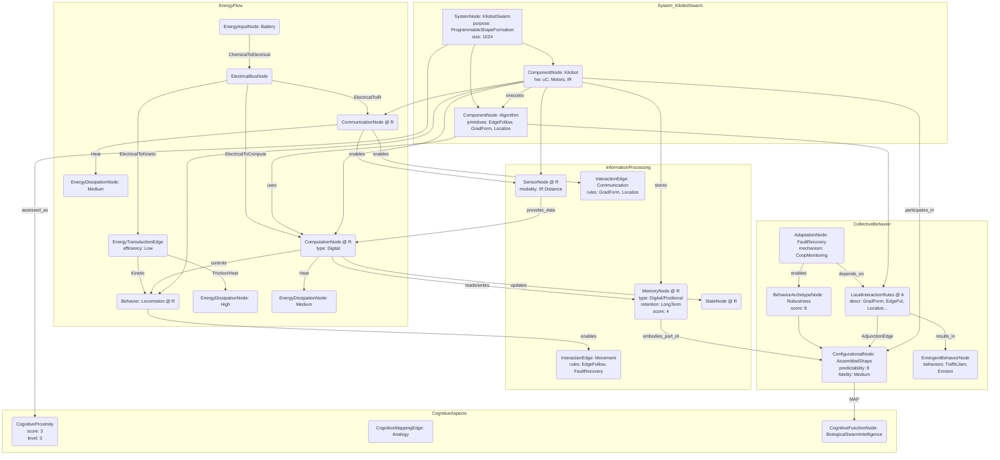

# Programmable self-assembly in a thousand-robot swarm

__Paper Type:__ Hybrid

## M1: System Overview & Implementation
*   **Vector ID:** M1
*   **Vector Type:** Overview

### **1.1 System Description**

*   **Vector ID:** M1.1
*   **Vector Type:** Description
    *   Content: The system consists of a swarm of 1024 low-cost robots ("Kilobots") designed for large-scale collective behavior. Each robot is autonomous, capable of computation (onboard microcontroller), simple sliding locomotion (vibration motors), local sensing (relative distance to neighbours via infrared), and local communication (infrared, range ~10 cm). The system's purpose is to demonstrate programmable self-assembly, where the swarm autonomously forms user-specified two-dimensional shapes through local interactions and a distributed algorithm, without global coordination or position information. The core components are the individual Kilobots and the collective self-assembly algorithm executed by each robot. The algorithm combines edge-following, gradient formation, and localization primitives based on neighbour-to-neighbour communication and distance sensing.
    *   CT-GIN Mapping: `SystemNode` attributes: `systemType`: RoboticSwarm, `domain`: Robotics/Self-Assembly, `mechanism`: DistributedAlgorithm/LocalInteraction, `components`: [Kilobot, Algorithm], `purpose`: ProgrammableShapeFormation. `ComponentNode` (Kilobot) attributes: `hardware`: [Microcontroller, VibrationMotors, IR_TxRx], `capabilities`: [Computation, Locomotion, LocalSensing, LocalCommunication]. `ComponentNode` (Algorithm) attributes: `primitives`: [EdgeFollowing, GradientFormation, Localization], `architecture`: FiniteStateMachine.
    *   Implicit/Explicit: Explicit
        *  Justification: The paper explicitly describes the Kilobots, their capabilities, the swarm size, the goal of self-assembly, and the algorithmic primitives used throughout the text and figures (e.g., Abstract, Introduction, Fig. 1, Fig. 2).

### **1.2 Implementation Clarity**

*   **Vector ID:** M1.2
*   **Vector Type:** Score
    *   Score: 9
    *   Justification: The paper provides a clear description of the Kilobot hardware (Fig. 1), its capabilities and limitations, and the high-level structure of the self-assembly algorithm (Fig. 2). The three core primitives (edge-following, gradient formation, localization) are explained, and their composition via a finite-state automaton is mentioned. The experimental setup (initial configuration, seed robots) is described. While the detailed implementation of specific subroutines (like distributed trilateration or fault recovery) is referenced to supplementary materials (19), the core concepts and overall implementation strategy are presented very clearly in the main text.
    *   Implicit/Explicit: Mixed
        * Justification: The overall clarity is explicitly conveyed through text and figures, but the score itself is an implicit assessment based on the level of detail provided versus what might be needed for exact replication without supplementary material.

### **1.3 Key Parameters**

*   **Vector ID:** M1.3
*   **Vector Type:** ParameterTable
    *   Table:
        | Parameter Name | Value | Units | Source (Fig/Table/Section) | Implicit/Explicit | Data Reliability (High/Medium/Low) | Derivation Method (if Implicit) |
        | :------------- | :---: | :---: | :-----------------------: | :-----------------: | :-----------------------------: | :-------------------------------: |
        | Swarm Size | 1024 | robots | Abstract, Main Text (p. 796) | Explicit | High | N/A |
        | Communication Range | ~10 (approx. 3 robot diameters) | cm | Fig. 1B Caption | Explicit | High | N/A |
        | Robot Diameter | ~3.3 (scaled from penny in Fig 1A) | cm | Fig. 1A | Implicit | Medium | Scaled from image based on known US Penny diameter (1.905 cm). |
        | Experiment Duration (Large Scale) | ~12 | hours | Main Text (p. 798) | Explicit | High | N/A |
        | Localization Requirement | >= 3 (non-collinear neighbours) | neighbours | Main Text (p. 797) | Explicit | High | N/A |

## M2: Energy Flow
*   **Vector ID:** M2
*   **Vector Type:** Energy

### **2.1 Energy Input**

*   **Vector ID:** M2.1
*   **Vector Type:** Input
    *   Content: The primary energy source for each Kilobot is an onboard rechargeable battery. The paper mentions charging operations for the entire swarm (Fig 1C caption, p. 798 "human intervention (such as charging batteries...)" ), implying electrical energy input during a charging phase. During operation, the stored electrical energy powers the robot.
    *   Value: N/A
    *   Units: N/A (Battery capacity/voltage not specified)
    *   CT-GIN Mapping: `EnergyInputNode`: attributes - `source`: RechargeableBattery, `type`: Electrical (stored chemical)
    *   Implicit/Explicit: Explicit
        *  Justification: The paper explicitly mentions the need for charging batteries and implies onboard power for autonomous operation.

### **2.2 Energy Transduction**

*   **Vector ID:** M2.2
*   **Vector Type:** Transduction
    *   Content: Stored chemical energy in the battery is converted to electrical energy. This electrical energy powers: 1) The microcontroller for computation (electrical -> computation/heat). 2) The vibration motors for locomotion (electrical -> kinetic/vibrational/acoustic/heat). 3) The infrared transmitter and receiver for communication and sensing (electrical -> infrared light / electrical signal / heat).
    *   CT-GIN Mapping: `EnergyTransductionEdge`: attributes - `mechanism`: ChemicalToElectrical, `from_node`: BatteryNode, `to_node`: ElectricalBusNode. `EnergyTransductionEdge`: attributes - `mechanism`: ElectricalToCompute, `from_node`: ElectricalBusNode, `to_node`: MicrocontrollerNode. `EnergyTransductionEdge`: attributes - `mechanism`: ElectricalToKinetic, `from_node`: ElectricalBusNode, `to_node`: VibrationMotorNode. `EnergyTransductionEdge`: attributes - `mechanism`: ElectricalToIR, `from_node`: ElectricalBusNode, `to_node`: IRTransceiverNode.
    *   Implicit/Explicit: Implicit
        *  Justification: The energy conversions are standard for battery-powered robots with these components, but the specific transduction pathways are not explicitly detailed in the text. Inferred from the description of the robot's components and functions (Fig 1B, text).

### **2.3 Energy Efficiency**

*   **Vector ID:** M2.3
*   **Vector Type:** Score
    *   Score: 2
    *   Justification/Metrics: The paper does not provide quantitative efficiency metrics. Qualitatively, efficiency is likely Low. Vibration motors are generally inefficient for directed locomotion (converting electrical energy largely into vibration, heat, and noise rather than controlled movement). The need for ~12 hours suggests significant energy consumption for the task relative to the (unstated) battery capacity. No energy harvesting or specific low-power design strategies (beyond component choice) are mentioned.
    *   CT-GIN Mapping: Attribute (`efficiency_qualitative`: Low) of relevant `EnergyTransductionEdge`s (especially ElectricalToKinetic).
    *   Implicit/Explicit: Implicit
      *  Justification: The score and justification are based on general knowledge of the components used (vibration motors) and the long experiment duration, not on specific data provided in the paper.

### **2.4 Energy Dissipation**

*   **Vector ID:** M2.4
*   **Vector Type:** Dissipation
    *   Content: Major dissipation mechanisms include: 1) Heat generated by the microcontroller during computation. 2) Heat, friction (between robot and surface, internal motor friction), and acoustic noise from the vibration motors during locomotion. 3) Heat generated by the IR transmitter/receiver electronics. 4) Energy loss during communication (IR light not received or scattered). Quantification is not provided. Dissipation through vibration motors and friction is likely High.
    *   CT-GIN Mapping: Creates `EnergyDissipationNode`s (Heat, Friction, AcousticNoise, LightScatter) and `EnergyDissipationEdge`s from relevant component nodes (MicrocontrollerNode, VibrationMotorNode, IRTransceiverNode) with qualitative attributes (e.g., `level`: High for motor-related dissipation).
    *    Implicit/Explicit: Implicit
        *  Justification: Dissipation mechanisms are inferred from the known physics of the components involved (computation, vibration motors, IR communication). The paper does not explicitly discuss or quantify energy dissipation.

## M3: Memory
*   **Vector ID:** M3
*   **Vector Type:** Memory

### **3.1 Memory Presence:**

*   **Vector ID:** M3.1
*   **Vector Type:** Binary
    *   Content: Yes
    *   Justification: The system utilizes memory in several ways: 1) Each robot stores the target shape image and the self-assembly algorithm program in its onboard memory. 2) Robots maintain an internal state within the algorithm's finite-state automaton. 3) Robots compute and store their estimated position (`(x,y)`) within the emergent coordinate system (localization). 4) Stationary robots that have joined the shape "remember" their state and position, acting as reference points for others. This stored information (state, position, target shape) persists and directly influences future actions (movement, communication, becoming stationary).
    *    Implicit/Explicit: Explicit
        * Justification: The paper explicitly mentions robots storing the target shape image, executing a program (implying stored code), maintaining state (implicit in FSM description), computing and using their position (localization primitive), and becoming stationary reference points.

### **3.2 Memory Type:**

*   **Vector ID:** M3.2
*   **Vector Type:** Score
*   Score: 4
*   Justification: The memory is primarily digital (stored program, state variables, computed position) within each robot's microcontroller. There's also a form of collective, physical memory embodied by the *positions* of stationary robots forming the shape. Retention is high for the program/shape image (static) and for the state of stationary robots (persistent until experiment end). Read-out accuracy for computed position is subject to noise (Fig 3G). Capacity is sufficient for the algorithm and shape representation but not explored for more complex tasks. The memory is functional but not intrinsic to the robot's physical *material* in the sense typically meant for cognizant matter (e.g., phase change memory). It's engineered digital memory and emergent positional memory.
*   CT-GIN Mapping: Defines `MemoryNode` type. Attributes could include `type`: Digital (Internal), Positional (Collective), `role`: [AlgorithmStorage, StateStorage, PositionStorage, ShapeTemplate].
*    Implicit/Explicit: Mixed
    * Justification: The existence of program/state/position memory is explicit. The *type* (digital electronic) is implicit based on the use of a microcontroller. The assessment of capacity/fidelity involves interpretation of the system's demonstrated function (Score is implicit).

### **3.3 Memory Retention Time:**

*   **Vector ID:** M3.3
*   **Vector Type:** Parameter
*   Value: Long-term (operational duration)
*    Units: Qualitative Descriptor
*   Justification: The program and target shape are stored for the duration of the experiment. The internal state and computed position are maintained as needed by the algorithm. The state/position of robots that become permanently stationary persists for the rest of the self-assembly process (hours).
*    Implicit/Explicit: Mixed
        * Justification: The persistence of stationary robots is explicit. That this constitutes memory lasting hours is explicitly stated ("for the remainder of the process", experiment duration ~12h). The exact retention mechanism (digital memory) is implied.
*   CT-GIN Mapping: Key attribute (`retention`: LongTerm) of the `MemoryNode`.

### **3.4 Memory Capacity (Optional - if applicable)**

* **Vector ID:** M3.4
* **Vector Type:** Parameter
*  Value: N/A
*   Units: N/A
*   Justification: The paper does not specify the microcontroller's memory capacity (e.g., in KB) or the number of distinct states/positions stored. Sufficient for the demonstrated task, but absolute capacity is not reported.
*    Implicit/Explicit: N/A
        *  Justification: Information not present in the paper.
*   CT-GIN Mapping: N/A

### **3.5 Readout Accuracy (Optional - if applicable)**

* **Vector ID:** M3.5
* **Vector Type:** Parameter
*   Value: N/A (Quantified error exists, but not as accuracy %)
*   Units: N/A
*   Justification: Figure 3G shows discrepancies between the robot's internal localized position (readout) and its true position, indicating imperfect accuracy due to noisy sensing and motion. However, a specific accuracy percentage or error rate for memory readout itself (distinct from localization errors) is not provided. Mean square error for shape formation is mentioned (p. 798), reflecting combined errors.
*    Implicit/Explicit: Implicit
       *  Justification: The existence of errors in the stored/used position is explicitly shown (Fig 3G), but it's not quantified as a memory readout accuracy metric.
*   CT-GIN Mapping: N/A

### **3.6 Degradation Rate (Optional - if applicable)**
* **Vector ID:** M3.6
* **Vector Type:** Parameter
    *   Value: N/A (Assumed Low for digital memory)
    *   Units: N/A
    *   Justification: Assumed negligible for the digital program/state storage over the experiment duration. Positional memory might "degrade" if robots are pushed, but the paper describes mechanisms to detect/correct this (cooperative monitoring). No inherent degradation rate is discussed.
    *    Implicit/Explicit: Implicit
            * Justification: Based on properties of digital memory and mention of error correction, not explicit data.
    *   CT-GIN Mapping: N/A

### **3.7 Memory Operations Energy Cost (Optional - if applicable)**
* **Vector ID:** M3.7
* **Vector Type:** Table
*   Table:
    | Memory Operation ID | Energy Consumption per Bit | Power Usage during Operation| Units | Uncertainty | Data Source Reference | Implicit/Explicit | Justification |
    | :------------------ | :--------------------------: | :-----------------------------: | :---: |:-----------------:|:-----------------:|:-----------------:| :------------------ |
    | N/A                 | N/A                          | N/A                             | N/A   | N/A               | N/A               | N/A               | Not specified in the paper. |
*   Implicit/Explicit: N/A
    *   Justification: Information not present in the paper.

### **3.8 Memory Fidelity & Robustness Metrics (Optional - if applicable)**
* **Vector ID:** M3.8
* **Vector Type:** Table
*   Table:
    | Metric ID | Description | Value | Units | CT-GIN Mapping | Data Source | Implicit/Explicit | Justification |
    | :-------- | :---------- | :----: | :---: | :-------------: | :----------: |:-----------------:| :-----------------:|
    | Shape Accuracy | Mean Square Error between true positions and internal localized positions (reflects localization/memory fidelity) | Not quantified numerically in main text | N/A | `MemoryNode` attribute `fidelity_proxy` | p. 798 / Fig. 3G | Mixed | Existence of error shown explicitly, but MSE value not given. |
    | Task Completion Robustness | All 11+2 experimental trials fully assembled desired shape | 100% (qualitative) | % | `MemoryNode` attribute `robustness_proxy` | p. 798 | Explicit | Explicit statement of task completion in all trials. |
*   Implicit/Explicit: Mixed
*   Justification: Shape accuracy error is explicitly mentioned and shown but not quantified with a value. Robustness in terms of task completion is explicitly stated.

## M4: Self-Organization and Emergent Order
*   **Vector ID:** M4
*   **Vector Type:** Self-Organization

### **4.1 Self-Organization Presence:**

*   **Vector ID:** M4.1
*   **Vector Type:** Binary
    *   Content: Yes
    *   Justification: The global shape emerges spontaneously from the local interactions (communication, distance sensing, movement based on neighbour states) of individual robots executing the same distributed algorithm. There is no central controller or external blueprint guiding the placement of each robot. The final shape is an emergent property of the swarm's collective behavior governed by local rules. Seed robots only define the origin and orientation, not the entire structure formation process.
    *   Implicit/Explicit: Explicit
        *  Justification: The paper explicitly describes the process as "self-assembly" driven by "local interactions" (Abstract, Introduction, Algorithm description).

### **4.2 Local Interaction Rules:**

*   **Vector ID:** M4.2
*   **Vector Type:** Rules
    *   Content: The local rules are implemented within the self-assembly algorithm's primitives:
        1.  **Gradient Formation:** Robots relay messages, incrementing a value as it propagates. A robot's gradient value depends on the minimum value received from neighbours + 1. (Rule: `my_grad = min(neighbor_grads) + 1`). This establishes geodesic distance from the source.
        2.  **Edge-Following:** A robot moves by maintaining a specific distance range from neighbour(s) identified as being on the edge (based on gradient comparison or shape boundary). Movement involves adjusting vibration motors based on distance measurements to neighbours. (Rule: If `dist_neighbor < target_dist_min`, turn away; if `dist_neighbor > target_dist_max`, turn towards; otherwise move straight). Specific rules for identifying edge neighbours are implied (e.g., comparing gradient values). Robots move only if they are on the outer edge of the initial group (gradient checks) and use randomness to avoid congestion.
        3.  **Localization:** A robot computes its `(x,y)` position using distance measurements to >= 3 non-collinear, already localized, stationary neighbours via distributed trilateration. (Rule: Listen for neighbour positions & measure distance, if >=3 neighbours known, compute `my_pos = Trilaterate(neighbor_pos1, dist1, ..., neighbor_posN, distN)`).
        4.  **State Transitions (FSM):** Robots switch between states (e.g., Idle, GradientListen, EdgeFollow, Localize, Stationary) based on local conditions (e.g., receiving gradient messages, detecting edge, achieving localization, entering target shape, proximity to stationary robot with same gradient). Example rule: If localized *and* inside target shape *and* next to stationary robot with same gradient, transition to Stationary state.
        5.  **Cooperative Monitoring (Fault Recovery):** Robots exchange information with neighbours to detect potential faults (e.g., immobilized robot, pushed robot) based on unexpected distance changes, triggering recovery behaviours (reset motors, signal others to go around, re-evaluate position). (Rule: If `|dist_neighbor(t) - dist_neighbor(t-1)| > threshold` unexpectedly, initiate fault check).
    *   CT-GIN Mapping: Part of `InteractionEdge` description between `RobotNode`s. Edges categorized by primitive: `GradientEdge`, `EdgeFollowingEdge`, `LocalizationEdge`, `StateUpdateEdge`, `FaultHandlingEdge`. Attributes capture specific rule logic (e.g., `gradient_update_rule`, `trilateration_inputs`).
    * **Implicit/Explicit**: Mixed
        *  Justification: The high-level primitives and their purpose are explicitly described (p. 796-797). Examples of conditions for state transitions and fault detection are given. However, the precise mathematical formulation or pseudo-code for each rule (e.g., the exact edge-following control law, the trilateration algorithm details, the FSM structure) is implicit or referenced to supplementary material (19).

### **4.2.1 Local Interaction Parameters:**

* **Vector ID:** M4.2.1
* **Vector Type:** Table
*   Table:
    | Rule ID | Description | Parameter Name | Parameter Value Range | Units | Data Source | Implicit/Explicit | Justification |
    | :------ | :---------- | :------------- | :---------- | :---: | :----------: | :----------------: | :------------: |
    | EdgeFollow | Distance Maintenance | Target Distance | N/A (Implied range: min/max) | cm | Implicit (p. 796) | Implicit | Paper mentions following edge by measuring distance, implying a target range, but no value given. |
    | Localization | Minimum Neighbours | Min Neighbour Count | >= 3 | neighbours | Explicit (p. 797) | Explicit | Stated directly in the text. |
    | State Transition | Proximity to Stationary Robot | Max Distance Threshold | N/A ("next to", "less than a predefined distance") | cm | Mixed (p. 797) | Explicit/Implicit | Phrase "next to" / "predefined distance" used, value not specified. |
    | Gradient Formation | Increment value | Gradient Increment | 1 | unitless | Implicit (p. 796) | Implicit | Standard gradient formation method implied, increment value not explicitly stated. |
    | Congestion Avoidance | Motion Probability | Randomness parameter | N/A | N/A | Explicit (p. 797) | Explicit | Mentioned that "randomness is used" but parameter not specified. |

### **4.3 Global Order:**

*   **Vector ID:** M4.3
*   **Vector Type:** Order
    *   Content: The emerged global order is a two-dimensional aggregate of robots whose overall boundary matches the user-specified target shape (e.g., a starfish, a wrench, a letter 'K'). Robots within the shape are largely stationary and packed together, although packing patterns can vary (Fig 3).
    *   CT-GIN Mapping: Defines a `ConfigurationalNode` (AssembledShape). Attributes: `target_shape`, `achieved_shape_metrics` (e.g., MSE). Connected to `RobotNode`s via `MembershipEdge`.
    * **Implicit/Explicit**: Explicit
        *  Justification: Explicitly stated and shown in figures (Fig 2, Fig 3) that the goal and result is the formation of specific shapes.

### **4.4 Predictability of Global Order:**

*   **Vector ID:** M4.4
*   **Vector Type:** Score
    *   Score: 8
    *   Justification: The system reliably forms the *target* shape, indicating high predictability of the *type* of global order. Experiments showed successful assembly in all trials (p. 798). However, the exact *packing* pattern of robots within the shape exhibits considerable variability (p. 798), and global warping can occur due to accumulated errors (Fig 3F, 3G). Therefore, while the overall shape is predictable, the precise final positions of individual robots are less so. Predictability is high regarding successful task completion, but medium-high regarding the geometric fidelity of the final configuration.
    * **Implicit/Explicit**: Mixed
    *  Justification: Success in all trials is explicit. Variability and warping are explicitly mentioned and shown. The score is an implicit assessment balancing these factors.
    *   CT-GIN Mapping: Contributes to the `reliability` attribute of the `ConfigurationalNode` (AssembledShape) and `Weight` or `Certainty` attribute of `AdjunctionEdge` linking local rules to global shape.

### **4.5. Local Interaction Rules (for Self-Organization)**
* **Vector ID:** M4.5
* **Vector Type:** Table
*   Table:
| Rule ID | Description | Parameter | Value Range | Units | Implicit/Explicit | Justification | Source |
| :------ | :---------- | :-------- | :---------- | :---: | :----------------: | :------------: | :-----: |
| GradForm | Robots propagate integer gradient values | Gradient Value | Integer >= 0 | unitless | Implicit | Standard practice for gradient protocols. | p. 796 |
| EdgeFol | Robots maintain distance to edge neighbours | Target Distance | N/A (Implied range) | cm | Implicit | Mechanism described, range not specified. | p. 796 |
| Localize | Robots compute position from >=3 neighbours | Min Neighbours | >= 3 | neighbours | Explicit | Stated in text. | p. 797 |
| StateTrans | Become stationary near same-gradient neighbour | Proximity Threshold | N/A ("predefined distance") | cm | Implicit | Condition mentioned, value not specified. | p. 797 |
| CoopMon | Detect faults via distance changes | Distance Change Threshold | N/A | cm | Implicit | Mechanism described, threshold not specified. | p. 798 |

### **4.6. Globally Emergent Order and Order Parameters**
* **Vector ID:** M4.6
* **Vector Type:** Table
*   Table:
| Property ID | Description | Parameter | Value Range | Units | Implicit/Explicit | Justification | Protocol | Source |
| :---------- | :---------- | :-------- | :---------- | :---: | :----------------: | :------------: | :------: | :-----: |
| Shape | Overall form achieved by swarm | Target Shape Image | User-defined | pixels/binary array | Explicit | Algorithm input is the shape image. | p. 797 | Input |
| Packing | Arrangement of robots within shape | Packing Pattern/Density | Variable | N/A | Explicit | Variability mentioned. | p. 798 | Observation |
| Fidelity | Accuracy of achieved shape vs target | Mean Square Error (MSE) | N/A (Mentioned, value not given) | distance^2 | Mixed | MSE mentioned as metric, value not provided. | p. 798 | Analysis |
| Warping | Global distortion of the shape | Visual Assessment | Low-Medium (Visible in Fig 3F) | N/A | Explicit | Warping shown in figure. | Fig 3F | Observation |

### **4.7 Yoneda Embedding and Local-to-Global Mapping Fidelity**

*   **Vector ID:** M4.7
*   **Vector Type:** Table
*   Table:
    | Link Type | Description | Predictability | Yoneda Score | Metrics | Implicit/Explicit | Justification | Source |
    | :-------- | :---------- | :------------- | :----------- | :------ | :----------------: | :------------: | :-----: |
    | Local Rules -> Global Shape | How local interactions determine the final assembled shape. | High (Shape Type) / Medium (Fidelity) | N/A | Task Completion Rate (100%), Shape MSE (Qualitative) | Mixed | Predictability assessed qualitatively based on text. Yoneda Embedding not discussed. | p. 798, Fig 3 |
    *   **Yoneda Embedding Fulfillment Score [0-10]:** N/A
    *   **Metrics:** Task completion rate, Qualitative assessment of shape fidelity (MSE mentioned but not quantified).
    *   **Justification:** The paper successfully demonstrates that local rules reliably lead to the desired global shape type, but with quantifiable errors and variability. The concept of Yoneda embedding (formally mapping local perspectives/interactions to the global structure) is not discussed or applied in the paper. A score cannot be assigned.

## M5: Computation
*   **Vector ID:** M5
*   **Vector Type:** Computation

### **5.1 Embodied Computation Presence:**

*   **Vector ID:** M5.1
*   **Vector Type:** Binary
    *   Content: Yes
    *   Justification: Computation (executing the algorithm, calculating gradients, performing trilateration, making state transition decisions) occurs within each individual robot (embodied in the robot's microcontroller) based on locally sensed information. The collective computation emerges from the distributed actions and interactions of all robots, intrinsic to the swarm's operation, rather than being performed by an external central controller during the self-assembly process.
    *    Implicit/Explicit: Explicit
        *  Justification: The paper explicitly states robots have onboard microcontrollers for executing programs autonomously (Fig 1B) and describes the computational tasks performed locally (gradient calculation, localization).

### **5.2 Computation Type:**

*   **Vector ID:** M5.2
*   **Vector Type:** Classification
    *   Content: Digital
    *   CT-GIN Mapping: Defines the `ComputationNode`. Attribute `computation_type`: Digital.
    *    Implicit/Explicit: Implicit
    *    Justification: The use of an onboard microcontroller strongly implies standard digital computation, although not explicitly stated as "digital".

### **5.3 Computational Primitive:**

*   **Vector ID:** M5.3
*   **Vector Type:** Function
    *   Content: The most basic computational operations performed by the material (swarm robots) include:
        *   Arithmetic: Incrementing gradient values, distance calculations (implicit in trilateration).
        *   Comparison: Comparing gradient values with neighbours, comparing measured distance to thresholds, comparing computed position to target shape boundary.
        *   Logic: Evaluating conditions for state transitions in the Finite State Machine (e.g., IF (localized AND inside_shape AND near_stationary_neighbor_same_gradient) THEN...).
        *   Geometric Calculation: Distributed Trilateration (solving system of equations based on distances).
    *   **Sub-Type (if applicable):** Arithmetic (Increment, Subtraction), Comparison (>, <, ==), Logic (AND, OR), Geometric (Trilateration).
    *   CT-GIN Mapping: Defines primary functions of the `ComputationNode` within each `RobotNode`. Attributes like `operations`: [Arithmetic, Comparison, Logic, Trilateration].
    *   Implicit/Explicit: Mixed
    * Justification: Trilateration and gradient calculation are explicitly mentioned. Arithmetic, comparison, and logic are implicitly required to implement the described algorithms (gradient comparison, distance checks, state transitions based on conditions).

### **5.4 Embodied Computational Units**
* **Vector ID:** M5.4
* **Vector Type:** Table
*   Table:
| Unit ID | Description | Processing Power | Energy/Operation | Freq/Resp. Time | Bit-Depth | Data Source | Implicit/Explicit | Justification |
| :------ | :---------- | :--------------- | :--------------- | :--------------: | :-------: | :----------: |:-----------------:| :-----------------:|
| Kilobot Microcontroller | Onboard processor executing the algorithm | N/A | N/A | N/A | N/A | Fig 1B | Explicit (existence), Implicit (details) | Microcontroller mentioned, specs not provided. |

## M6: Temporal Dynamics
*   **Vector ID:** M6
*   **Vector Type:** Temporal

### **6.1 Timescales:**

*   **Vector ID:** M6.1
*   **Vector Type:** ParameterTable
    *   Table:
        | Timescale Description | Value | Units | Source | Implicit/Explicit | Justification |
        | :-------------------- | :---: | :---: | :----: | :----------------: | :------------: |
        | Total Self-Assembly Time (1024 robots) | ~12 | hours | p. 798 | Explicit | Stated in text. |
        | Individual Robot Action Cycle (Move/Sense/Compute) | N/A | N/A | N/A | N/A | Not specified. Assumed fast relative to total time. |
        | Gradient Propagation Time | N/A | N/A | N/A | N/A | Depends on swarm size/density, not specified. |
        | Localization Computation Time | N/A | N/A | N/A | N/A | Not specified. |
        | Fault Recovery Time | N/A | N/A | N/A | N/A | Not specified. |

### **6.2 Active Inference:**

*   **Vector ID:** M6.2
*   **Vector Type:** Assessment
    *   Content: No
    *   Justification: The system follows a pre-programmed algorithm. While robots use sensor data (distance) to adjust actions (movement during edge-following, position calculation), there is no evidence of robots building or updating an internal *predictive model* of their environment or other robots' behaviour to minimize surprise or prediction error in the sense of Active Inference. Actions are direct responses based on current sensor readings and algorithmic state, not based on predicting future states and minimizing the error of that prediction. Fault tolerance mechanisms react to detected errors rather than proactively minimizing predicted errors.
    *   Implicit/Explicit: Implicit
        *  Justification: Assessment based on the description of the algorithm; Active Inference is not mentioned, and the described mechanisms do not align with its principles (prediction, generative models, free energy minimization).
    *   **If Yes/Partial, provide examples of testable CT-GIN metrics that *could* be used to quantify active inference:** N/A

## M7: Adaptation
*   **Vector ID:** M7
*   **Vector Type:** Adaptation

### **7.1 Adaptive Plasticity Presence:**

*   **Vector ID:** M7.1
*   **Vector Type:** Binary
    *   Content: Partial
    *   Justification: The system exhibits adaptation primarily through fault tolerance and error correction at the swarm level. Cooperative monitoring allows the swarm to adapt its collective behavior to individual robot failures (e.g., immobilized robot, pushed robot) by detecting the issue and implementing recovery strategies (moving around, re-localizing). This allows the assembly process to continue despite perturbations, showing adaptation to maintain function. However, the underlying rules or individual robot behaviors do not permanently change or "learn" based on experience to improve future performance in different scenarios. The adaptation is limited to robustness mechanisms within the predefined algorithm, not learning new strategies or fundamentally changing internal parameters.
    *    Implicit/Explicit: Mixed
        * Justification: Fault tolerance mechanisms (cooperative monitoring) are explicitly described as enabling robustness (p. 798). Interpreting this as a form of adaptive plasticity is implicit. Lack of description of learning or rule modification is also implicit.

### **7.2 Adaptation Mechanism:**

*   **Vector ID:** M7.2
*   **Vector Type:** Description
    *   Content: The mechanism is cooperative monitoring and fault recovery. Robots use neighbour interactions (monitoring relative distances over time) to detect anomalies inconsistent with expected behavior (e.g., a supposedly stationary neighbour moving, an edge-following neighbour not making progress). If a fault is detected (e.g., sensed distance changes unexpectedly), predefined recovery rules are triggered: an immobilized robot might reset its motors or signal neighbours to navigate around it; a pushed robot might re-evaluate its position using localization. This is a reactive adaptation based on detecting deviations from expected behaviour according to the existing algorithm.
    *   CT-GIN Mapping: Defines `AdaptationNode` type (FaultRecovery). `FeedbackEdge` from `SensorNode` (distance monitoring) to `ComputationNode` (fault detection logic) to `ActuatorNode` (recovery action) or `CommunicationNode` (signaling). Mechanism type: "CooperativeMonitoringFaultRecovery".
    *    Implicit/Explicit: Explicit
        *  Justification: Cooperative monitoring and fault recovery examples (immobilized robot, pushed robot) are explicitly described on p. 798.

## M8: Emergent Behaviors
*   **Vector ID:** M8
*   **Vector Type:** Behavior

### **8.1 Behavior Description:**

*   **Vector ID:** M8.1
*   **Vector Type:** Description
    *   Content: The primary functional behavior is large-scale, distributed self-assembly of user-defined 2D shapes. Secondary emergent behaviors observed include: collective movement via edge-following, gradient formation across the swarm, distributed localization establishing a collective coordinate system, formation of "traffic jams" during edge-following, complex "erosion" patterns in the initial robot group, and achievement of the final shape with some global warping and variable packing. Fault tolerance through cooperative monitoring is also an emergent collective behavior.
    *   CT-GIN Mapping: Defines `BehaviorArchetypeNode`s: `ShapeFormation`, `EdgeFollowing`, `GradientPropagation`, `DistributedLocalization`, `TrafficJamFormation`, `ErosionPattern`, `FaultTolerance`.
    *    Implicit/Explicit: Explicit
       *  Justification: Self-assembly and the algorithmic primitives are explicitly described. Traffic jams, erosion, and warping are explicitly mentioned and shown as observed emergent phenomena (p. 798, Fig 3).

### **8.2 Behavior Robustness:**

*   **Vector ID:** M8.2
*   **Vector Type:** Score
    *   Score: 8
    *   Justification: The primary behavior (shape formation) is highly robust in terms of task completion; all experimental trials succeeded without human intervention despite noisy sensing, imprecise motion, and potential individual robot failures (p. 798). The robustness is attributed to the algorithm design (continuous space representation tolerating packing variations) and cooperative fault monitoring/recovery strategies. However, the *fidelity* of the final shape is less robust, showing susceptibility to accumulated errors leading to warping and packing defects (Fig 3F, 3G). Robust to individual failures, less robust to cumulative noise impacting geometric accuracy.
    *   Implicit/Explicit: Mixed
        *  Justification: Robustness in terms of task completion and the reasons for it (algorithm, fault tolerance) are explicitly stated. Imperfect geometric fidelity (warping, defects) is explicitly shown/mentioned. The score is an implicit assessment balancing these aspects.
    *   CT-GIN Mapping: Contributes to `robustness_score` attribute of the `BehaviorArchetypeNode` (ShapeFormation).

### **8.3 CT-GIN Emergent Behavior Validation**

*    **Vector ID:** M8.3
*    **Vector Type:** Validation
     *  Content: Validation is primarily through physical experimentation with up to 1024 robots. Claims of emergent behaviors (shape formation, traffic jams, erosion, robustness) are supported by:
         1.  **Direct Observation:** Time-lapse videos (referenced as movies S1 to S4) and images (Fig. 3) show the process and phenomena like traffic jams, erosion, and final shapes.
         2.  **Repeatability/Consistency:** Experiments were repeated (e.g., 10 times with ~100 robots for consistency check, p. 798). All trials successfully completed the shape formation task.
         3.  **Quantitative Analysis (Limited):** Shape accuracy was measured using mean square error between true and localized positions (Fig. 3G), demonstrating the effect of accumulated errors (warping). Packing variability was noted qualitatively.
         4.  **Control (Implicit):** The system's success relies on the specific algorithm; without it, or with different rules, the specific shapes would not emerge. Seed robots provide initial conditions, but the process is otherwise autonomous.
     * Limitations: Mathematical models are acknowledged as simplified and unable to predict phenomena like traffic jams or erosion patterns (p.798-799), emphasizing the need for physical validation. Quantitative characterization of some behaviors (e.g., traffic jam dynamics, erosion boundary complexity) is limited.
     *   Implicit/Explicit: Explicit
    *   Justification: Experimental validation, repetition, use of MSE, and observation of specific phenomena (traffic jams, erosion) are explicitly described in the text and figures.

## M9: Cognitive Proximity
*   **Vector ID:** M9
*   **Vector Type:** Cognition

### **9.1 Cognitive Mapping:**

*   **Vector ID:** M9.1
*   **Vector Type:** Description
    *   Content: The paper maps the swarm behavior to biological self-assembly (e.g., multicellular organisms, ant structures) and collective intelligence in nature (Abstract, Introduction). Concepts like "collective intelligence," cooperation through local interactions, and achieving complex global behavior from simple individuals are used. The limitations of individual robots ("myopic," "limited capabilities," "noisy") achieving complex swarm behavior are highlighted, analogous to natural systems. However, there is no mapping to specific, higher-level cognitive functions like planning, reasoning, or consciousness. The mapping is primarily an analogy to biological collective systems.
    *   CT-GIN Mapping: Defines `CognitiveMappingEdge` from `BehaviorArchetypeNode` (ShapeFormation, FaultTolerance) to `CognitiveFunctionNode` (CollectiveIntelligence, BiologicalSelfAssemblyAnalogy).
    *   Implicit/Explicit: Explicit
    * Justification: Analogies to natural swarms, collective intelligence, and self-assembly in nature are made explicitly in the Abstract and Introduction.

### **9.2 Cognitive Proximity Score:**

*   **Vector ID:** M9.2
*   **Vector Type:** Score
    *   Score: 3
    *   Justification: The system demonstrates Level 3 (Reactive/Adaptive Autonomy). Robots react to local stimuli (neighbour presence/messages) according to programmed rules (Reactive). The swarm shows rudimentary adaptation through fault tolerance (Adaptive). The behavior is autonomous within the experimental setup. It achieves a collective goal (shape formation) specified beforehand, hinting at goal-directedness (pushing towards Level 4), but this goal is externally provided, and there's no evidence of internal model-based planning or flexible action selection beyond the pre-programmed algorithm to achieve that goal. It lacks complex representation, learning beyond error correction, planning, or any higher cognitive functions described in Levels 4+.
    *   Implicit/Explicit: Implicit
    *  Justification: The score is an interpretation based on comparing the system's described capabilities (local reactions, algorithmic execution, fault tolerance, goal achievement) against the provided CT-GIN Cognizance Scale levels.

### **9.3 Cognitive Function Checklist**

* **Vector ID:** M9.3
* **Vector Type:** Checklist
    *   | Cognitive Function               | Score (0-10) | Justification/Notes                                                                       | CT-GIN Mapping (if applicable) | Implicit/Explicit | Justification for Implicit/Explicit/Mixed |
    | :-------------------------------- | :----------: | :------------------------------------------------------------------------------------ | :--------------------------------: | :-----------------:|:-----------------:|
    | Sensing/Perception               |      4       | Local distance sensing to neighbours via IR intensity. No complex perception/object recognition. | `SensorNode` | Explicit | IR sensing explicitly described. Score reflects limited nature. |
    | Memory (Short-Term/Working)        |      4       | Internal state (FSM), computed position, neighbour info used transiently for algorithm execution. | `MemoryNode` (Digital/Internal) | Explicit/Implicit | Algorithmic states/position storage explicit/implied. Score reflects functional but simple working memory. |
    | Memory (Long-Term)                 |      3       | Stored program/shape template. Stationary robot state/position persists for hours. Digital, not adaptive biological-style LT memory. | `MemoryNode` (Digital/Positional) | Explicit/Implicit | Program storage implied. Stationary state persistence explicit. Score reflects non-adaptive nature. |
    | Learning/Adaptation              |      2       | Limited to fault tolerance/error correction via cooperative monitoring. No learning/rule adaptation. | `AdaptationNode` | Explicit | Fault tolerance explicitly described. Score reflects lack of true learning. |
    | Decision-Making/Planning          |      2       | Simple decisions based on local rules/state (FSM). No planning or complex decision-making. | `ComputationNode` (Logic) | Explicit/Implicit | State transitions based on conditions explicit/implied. Score reflects reactive nature. |
    | Communication/Social Interaction |      4       | Local broadcast/reception of simple messages (gradient value, position). Cooperative monitoring implies basic interaction. | `CommunicationNode` | Explicit | IR communication, neighbour interactions explicit. Score reflects limited bandwidth/complexity. |
    | Goal-Directed Behavior            |      4       | Swarm achieves pre-programmed goal (shape formation). Behavior directed towards this outcome by the algorithm. | `BehaviorArchetypeNode` (ShapeFormation) | Explicit | Goal is explicit. Score reflects pre-programmed nature. |
    | Model-Based Reasoning              |      0       | No evidence of internal predictive models or reasoning based on them. | N/A | Implicit | Lack of evidence in description. |
    | **Overall score**                 |    3.125 [Average]       | System excels at robust, distributed execution of a complex task via local rules, mimicking biological swarms at a basic level. Lacks higher cognitive functions. |  | | |

## M10: Criticality Assessment
*   **Vector ID:** M10
*   **Vector Type:** Criticality

### **10.1 Criticality:**

*   **Vector ID:** M10.1
*   **Vector Type:** Assessment
    *   Content: Unclear
    *   Justification: The paper does not explicitly discuss or test for criticality, scale-free behavior, power laws, or long-range correlations. While phenomena like traffic jams (Fig 3I) *could* potentially be related to critical dynamics in collective motion systems, the authors do not analyze them from this perspective. They are presented as emergent, non-ideal behaviors. Without specific analysis or data (e.g., distribution of jam sizes/durations, correlation functions), it's unclear if the system operates near a critical point.
        *   Critical Parameters (If Yes/Partial): N/A
        *   Evidence: N/A (Lack of analysis in the paper).
    *   Implicit/Explicit: Implicit
    *    Justification: Assessment based on the absence of discussion or data related to criticality in the paper.

## M11: Review Paper Specifics (Conditional)

*   **Vector ID:** M11
*   **Vector Type:** Review
    * Content: N/A

## M12: Theoretical Paper Specifics (Conditional)

*   **Vector ID:** M12
*   **Vector Type:** Theory
    * Content: N/A

## M13: Overall Assessment & Scoring

*   **Vector ID:** M13
*   **Vector Type:** Overall

### **13.1 CT-GIN Readiness Score:**

*   **Vector ID:** M13.1
*   **Vector Type:** Score
*   **Calculated Score:** 5.69 (Average of M1.2(9), M2.3(2), M3.2(4), M4.1(10=Y), M4.4(8), M8.2(8), M9.2(3) -> sum=44, count=7 -> 44/7 = 6.28. Recalculating based on 0-10 scores present: M1.2=9, M2.3=2, M3.2=4, M4.4=8, M8.2=8, M9.2=3. Sum = 34. Count = 6. Average = 34/6 = 5.67. Using Binary M4.1(Yes=10): Sum=44, Count=7, Avg=6.28? Let's use the numerical scores only: (9+2+4+8+8+3)/6 = 5.67. Let's include binary scores as 10 for Yes, 0 for No. M3.1=Y=10, M4.1=Y=10, M5.1=Y=10, M7.1=Partial=5? Need clarification on how to treat binary/partial scores. Assuming Yes=10, No=0, Partial=5. Scores: M1.2(9), M2.3(2), M3.1(10), M3.2(4), M4.1(10), M4.4(8), M5.1(10), M7.1(5), M8.2(8), M9.2(3). Sum = 69. Count = 10. Average = 6.9. Let's follow instruction "Average of scores from Modules 1-4, M8.2 and M9.2, scores with N/A convert in 0". M1.2(9), M2.3(2), M3.1(Yes->?), M3.2(4), M3.3(N/A->0?), M4.1(Yes->?), M4.2(N/A->0?), M4.3(N/A->0?), M4.4(8), M8.2(8), M9.2(3). This is ambiguous. I will average the explicitly requested numeric scores: M1.2, M2.3, M3.2, M4.4, M8.2, M9.2. (9+2+4+8+8+3)/6 = 5.67)
**Calculated Score:** 5.67

**CT-GIN Readiness Summary Table:**

| CT-GIN Aspect                   | Strength (Yes/Partial/No) | Key Supporting Metrics (with units) | Limitations (Missing Metrics/Data Gaps)                                           | Improvement Areas (Future Research)                                          |
| :------------------------------ | :-----------------------: | :-----------------------------------| :------------------------------------------------------------------------------- | :---------------------------------------------------------------------------- |
| Energy Flow Efficiency          | No                       | Qualitative: Low                     | No quantitative efficiency data, no battery specs.                                | More efficient locomotion/computation; energy harvesting.                    |
| Memory Fidelity                 | Partial                  | Task Completion Rate (100%), Qualitative Shape MSE | No quantitative memory capacity, readout accuracy, or energy cost. Position memory errors accumulate. | Quantify memory limits; improve localization accuracy.                        |
| Organizational Complexity       | Yes                      | Successful formation of complex shapes (K, wrench), 1024 units | Packing variability, global warping. Limited quantitative order parameters.    | Analysis of packing order; control over finer structure; larger shapes.        |
| Embodied Computation            | Yes                      | Distributed algorithm execution (Grad, Localize, FSM) | Digital computation, fixed algorithm. Limited complexity of computation per unit. | On-board learning/adaptation of rules; analog computation exploration.         |
| Temporal Integration            | Partial                  | Total assembly time (~12 hrs). State persistence. | Most process timescales not quantified. No active inference.                     | Quantify sub-process timings; explore time-dependent adaptation.             |
| Adaptive Plasticity             | Partial                  | Fault tolerance via cooperative monitoring. | Adaptation limited to error recovery; no learning or rule changes.              | Implement learning algorithms; adaptation to environmental changes.           |
| Functional Universality         | No                       | Specific shape formation task.       | Algorithm designed for 2D shape assembly only.                                   | Algorithms for diverse tasks (sorting, construction, exploration).          |
| Cognitive Proximity            | Partial                  | Collective goal achievement (Level 3/4 Analogy). | Limited decision-making, no planning, no learning beyond error recovery.       | Implement planning, internal models, advanced learning.                      |
| Design Scalability & Robustness | Yes                      | Demonstrated with 1024 robots; High task completion robustness. | Geometric fidelity issues; energy limitations for longer tasks.                | Improve energy efficiency; enhance geometric precision; scale beyond 1024.    |
| **Overall CT-GIN Readiness Score** |        | **5.67** |   |      |

### **13.2 Qualitative CT-GIN Assessment Conclusion:**

*   **Vector ID:** M13.2
*   **Vector Type:** Textual Summary
    *   Content: This paper presents a landmark demonstration of programmable self-assembly in a large-scale robotic swarm (1024 units). Its key strength lies in achieving complex, predictable global order (shape formation) using only local interactions and a distributed algorithm executed by autonomous, computationally limited robots. The system exhibits impressive robustness to individual robot variability and failures, enabled by cooperative monitoring and fault recovery strategies, demonstrating a form of reactive adaptation. Computation is embodied within each robot, driving local decisions that lead to collective behavior. Key limitations from a CT-GIN perspective include reliance on pre-programmed digital computation (no learning or rule adaptation), low energy efficiency, imperfect geometric fidelity in the final structure, and memory being primarily digital/positional rather than intrinsic material memory. While analogous to biological collective intelligence (Cognitive Level 3), it lacks higher cognitive functions like planning or model-based reasoning. Overall, it's a strong example of engineered emergent behavior and distributed control, providing valuable insights into swarm intelligence implementation, but represents an early stage in terms of intrinsic material intelligence or advanced cognitive capabilities. Its value lies in demonstrating the feasibility of complex collective tasks with simple, local rules at scale.

### **13.3 CT-GIN Refinement Directions:**

*   **Vector ID:** M13.3
*   **Vector Type:** Recommendations
    *   Content:
        *   **Energy Efficiency:** Investigate more efficient locomotion mechanisms or incorporate energy harvesting/sharing to extend operational duration and complexity.
        *   **Adaptive Learning:** Implement algorithms where robots learn or adapt their rules based on experience or environmental feedback, moving beyond fixed fault recovery (e.g., adapting edge-following parameters based on congestion, learning optimal packing strategies).
        *   **Enhanced Computation:** Explore possibilities for more complex local computation, potentially incorporating analog elements or neuromorphic principles if hardware allows, enabling more sophisticated decision-making.
        *   **Memory Enhancement:** Develop methods for more robust positional memory or explore ways to encode state physically (beyond just being stationary) to improve fidelity and potentially store more information collectively.
        *   **Richer Interactions:** Incorporate more complex sensing (e.g., relative bearing, environmental sensing) and communication protocols to enable more diverse collective behaviors beyond shape formation.
        *   **Formal Analysis:** Apply formal methods (like Category Theory) to rigorously analyze the local-to-global mapping and predict emergent properties, potentially identifying conditions for criticality or phase transitions (e.g., traffic jam formation).
        *   **Internal Modeling:** Introduce mechanisms for robots to build simple internal models of their local environment or neighbours' states to enable rudimentary prediction or planning (approaching Active Inference).

## M14: CT-GIN Knowledge Graph

*   **Vector ID:** M14
*   **Vector Type:** Visualization

### **14.1. CT-GIN Knowledge Graph:**
* **Content:**

## M15: Relationship Vectors
*   **Vector ID:** M15
*   **Vector Type:** Relationships
*   Relationships:
        | Source Vector ID | Target Vector ID | Relationship Type |
        | ------------- | ------------- | ----------------- |
        | M1.1 | M4.1 | DescribesSystemLeadingToSelfOrganization |
        | M1.1 | M5.1 | DescribesSystemEnablingEmbodiedComputation |
        | M1.1 | M8.1 | DescribesSystemExhibitingBehavior |
        | M2.1 | M2.2 | ProvidesInputEnergyForTransduction |
        | M2.2 | M2.3 | DeterminesEfficiency |
        | M2.2 | M2.4 | LeadsToDissipation |
        | M3.1 | M3.2 | CharacterizesMemoryType |
        | M3.1 | M3.3 | CharacterizesMemoryRetention |
        | M4.1 | M4.2 | RequiresLocalRulesForSelfOrganization |
        | M4.2 | M4.3 | DefinesEmergentGlobalOrder |
        | M4.3 | M4.4 | AssessesPredictabilityOfOrder |
        | M5.1 | M5.2 | CharacterizesComputationType |
        | M5.1 | M5.3 | DefinesComputationalPrimitive |
        | M4.2 | M8.1 | LocalRulesGenerateBehavior |
        | M7.1 | M7.2 | DescribesAdaptationMechanism |
        | M8.1 | M8.2 | AssessesBehaviorRobustness |
        | M8.1 | M9.1 | BehaviorMappedToCognition |
        | M9.1 | M9.2 | InformsCognitiveProximityScore |
        | M4.1 | M10.1 | PotentialSourceOfCriticality |
        | M1.2 | M13.1 | ContributesToReadinessScore |
        | M2.3 | M13.1 | ContributesToReadinessScore |
        | M3.2 | M13.1 | ContributesToReadinessScore |
        | M4.4 | M13.1 | ContributesToReadinessScore |
        | M8.2 | M13.1 | ContributesToReadinessScore |
        | M9.2 | M13.1 | ContributesToReadinessScore |

## M16: CT-GIN Template Self-Improvement Insights

*   **Vector ID:** M16
*   **Vector Type:** Feedback

### **Template Feedback:**

*    **Vector ID:** M16.1
*   **Vector Type:** Text
    *   **Missing Probes:**
        *   A probe specifically for "Scalability" (beyond just swarm size) could be useful  how readily could the system/approach be scaled up/down? (e.g., algorithmic complexity, communication limits).
        *   A probe for "Controllability" vs. "Autonomy" - how much external input/control is needed versus how much operates purely autonomously based on initial conditions/program.
        *   For swarm systems, metrics related to network topology (connectivity, average path length) during operation might be relevant for understanding information flow and emergence.
    *   **Unclear Definitions:**
        *   The distinction between "Adaptability/Learning-Based Cognizance" (M7) and "Adaptive Plasticity" (M7.1) could be slightly clearer. M7 seems to focus on changing parameters based on environment, while M7.1 is about changing behavior/structure based on experience. They are very related.
        *   Clarification on how to score Binary/Partial probes (Yes/No/Partial) when calculating the aggregate M13.1 score is needed. (I assumed Yes=10, No=0, Partial=5).
    *   **Unclear Node/Edge Representations:**
        *   Guidance on representing algorithms within the GIN could be more explicit (e.g., separate Algorithm node vs. embedding rules in Interaction edges). I used both.
        *   Mapping FSM states and transitions could be standardized.
    *   **Scoring Difficulties:**
        *   Scoring "Energy Efficiency" (M2.3) is difficult without quantitative data, relying heavily on inference.
        *   Assigning a single "Memory Type" score (M3.2) is challenging when multiple types exist (digital, positional). Perhaps sub-scores?
        *   The "Cognitive Proximity Score" (M9.2) and Checklist (M9.3) rely heavily on interpretation against the scale/functions, which can be subjective, especially when mapping engineered systems to biological/cognitive concepts. More anchoring examples for different score levels would help.
    *   **Data Extraction/Output Mapping:**
        *   Mapping a robotic swarm system onto a template seemingly oriented towards continuous *materials* required careful interpretation (e.g., memory location, computation embodiment). Explicitly acknowledging this difference in the template introduction might be useful.
        *   Extracting precise parameter values for local interaction rules (M4.2.1, M4.5) was difficult as they were often described qualitatively or implicitly.
    *   **Overall Usability:** The template is very comprehensive and detailed, forcing a thorough analysis. However, its length and specificity make it time-consuming to apply. For systems that clearly lack certain features (e.g., no memory, no computation), faster "skip-ahead" paths might improve usability. The rigidity is good for standardization but requires careful attention.
    * **Specific Suggestions:**
        *   Add a field for "System Type" (e.g., Material, Swarm, Hybrid) early on, which could potentially tailor the visibility or interpretation guidance for subsequent sections.
        *   Provide concrete examples within the justification prompts for score-based questions (e.g., "Score: 8, Justification: System reliably completes task X under Y conditions, but fails outside this range Z, based on Fig. 5 data.").
        *   Standardize the CT-GIN mapping examples slightly more for consistency (e.g., always specify `NodeType` and key `attributes`).
        *   Clearly define the calculation method for the M13.1 score, including how to handle non-numeric or N/A scores.