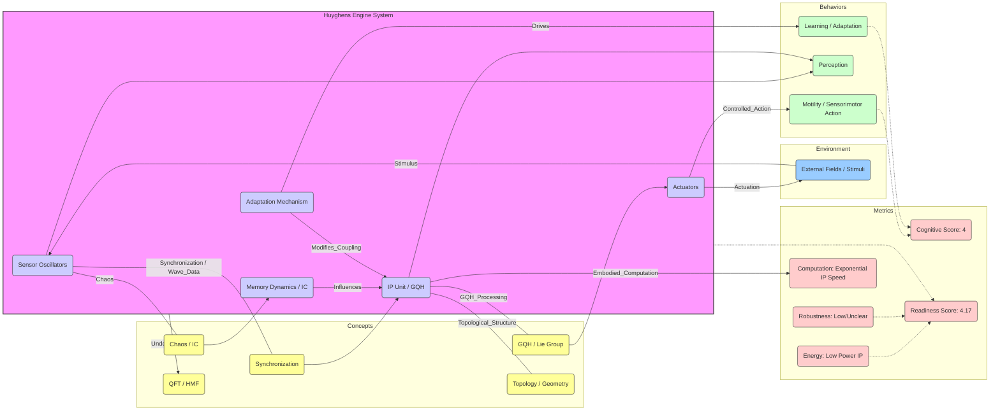

# Nano/Macro-Integrated Neuromorphic Sensorimotor Automata—A Bioinspired Nanoscale Field-Theoretic Approach to Motility

__Paper Type:__ Theoretical/Computational

## M1: System Overview & Implementation
*   **Vector ID:** M1
*   **Vector Type:** Overview

### **1.1 System Description**

*   **Vector ID:** M1.1
*   **Vector Type:** Description
    *   Content: The system described is a theoretical concept called the "Huyghens Engine" (HE), proposed as a universal information processing (IP) engine for designing bioinspired sensorimotor automata capable of autonomous motility (walking, swimming, flying). It operates based on Huygens' principles of wave propagation and coupled oscillator synchronization. Components include: synchronizing sensors to transduce environmental stimuli (e.g., fluid flow) into wave patterns, an IP unit utilizing Generalized Quantum Holography (GQH) based on Lie group geometry (specifically Heisenberg group G) for processing these patterns via phase conjugation, and actuators (e.g., wings, fins) whose shape and dynamics are adjusted based on the processed information to interact with the environment. The purpose is to achieve holistic, bioinspired sensorimotor behavior by resonantly coupling internal nano-fields with external fields (aerodynamic, hydrodynamic, gravitational), potentially via Heisenberg's molecular field, moving beyond purely logical AI approaches.
    *   CT-GIN Mapping: `SystemNode` attributes: `systemType: Theoretical_Framework`, `domain: Robotics/Material_Intelligence`, `mechanism: Wave_Dynamics/Synchronization/GQH/Field_Theory`, `components: Coupled_Oscillators, Sensors, IP_Unit(GQH), Actuators, Environmental_Fields, Heisenberg_Field`, `purpose: Bioinspired_Autonomous_Motility`
    *   Implicit/Explicit: Explicit
        *  Justification: The paper explicitly defines the Huyghens Engine, its principles, components (sensors, IP unit, GQH, actuators), mechanism (synchronization, phase conjugation, resonant coupling), and purpose (bioinspired automata, motility) primarily in Sections 1, 2, and 4.

### **1.2 Implementation Clarity**

*   **Vector ID:** M1.2
*   **Vector Type:** Score
    *   Score: 3
    *   Justification: The paper clearly describes the *conceptual* framework of the Huyghens Engine, referencing mathematical tools like Lie groups, GQH, and QFT. However, it lacks concrete details for physical realization. Descriptions of how sensors synchronize, how GQH is physically implemented at the nanoscale, how phase conjugation translates to actuation, and how the Heisenberg molecular field is leveraged remain abstract and metaphorical. While equations for oscillator dynamics are provided, their specific parameters and implementation in a physical nanostructure are not specified. The link between the theoretical constructs (Lie groups, QFT) and a buildable device is tenuous.
    *   Implicit/Explicit: Mixed
        * Justification: The conceptual description and mathematical references are explicit. The lack of concrete implementation details makes the feasibility and specific design implicitly unclear. The score reflects this gap between concept and practical implementation description.

### **1.3 Key Parameters**

*   **Vector ID:** M1.3
*   **Vector Type:** ParameterTable
    *   Table:
        | Parameter Name | Value | Units | Source (Fig/Table/Section) | Implicit/Explicit | Data Reliability (High/Medium/Low) | Derivation Method (if Implicit) |
        | :------------- | :---: | :---: | :-----------------------: | :-----------------: | :-----------------------------: | :-------------------------------: |
        | Forcing parameter (`ε`) | N/A (Affects phase dynamics) | Dimensionless | Eq. (1), Section 4 | Explicit | Low | N/A |
        | Coupling parameter (`ε`) | N/A (Affects synchronization) | Varies (Depends on `p_k`) | Eq. (2), Section 4 | Explicit | Low | N/A |
        | Oscillator natural frequency (`ω_k`) | N/A | rad/s (or Hz) | Eq. (3), Section 4 | Explicit | Low | N/A |
        | Molecular Mass (`M`) | N/A | kg | Section 5 (Lagrangian) | Explicit | Low | N/A |
        | Inter-molecular Potential (`V(x-y)`) | N/A | J | Section 5 (Lagrangian) | Explicit | Low | N/A |

    *   **Note:** These parameters are fundamental to the theoretical models (oscillator dynamics, QFT) proposed but are not given specific values for a concrete implementation. Reliability is Low as they are part of a theoretical model, not measured or specified values for a device.

## M2: Energy Flow
*   **Vector ID:** M2
*   **Vector Type:** Energy

### **2.1 Energy Input**

*   **Vector ID:** M2.1
*   **Vector Type:** Input
    *   Content: The primary energy input considered is the energy from the environment impinging on the automaton, such as aerodynamic/hydrodynamic flows or gravitational fields, which act as stimuli driving the system's sensors (oscillators). The paper also implicitly requires energy to sustain oscillations and perform information processing, although it emphasizes minimizing this internal consumption.
    *   Value: N/A
    *   Units: N/A (Depends on environmental field, e.g., J, Pa)
    *   CT-GIN Mapping: `EnergyInputNode`: attributes - `source: Environmental_Fields (Fluid_Flow, Gravity)`, `type: Mechanical/Potential`
    *   Implicit/Explicit: Mixed
        *  Justification: Environmental stimuli (fluid flow) driving the system are explicitly mentioned (Section 4). The need for internal energy to sustain oscillations/computation is implicit but suggested by the discussion of low power consumption.

### **2.2 Energy Transduction**

*   **Vector ID:** M2.2
*   **Vector Type:** Transduction
    *   Content: Energy flows from the external environment (e.g., kinetic energy of fluid) to mechanical oscillations in sensors. Synchronization processes aggregate this energy/information into coherent wave patterns. This information is processed via GQH (potentially involving transformations between energy levels/states). Phase conjugation maps the processed information to control signals for actuators (e.g., wings/fins), converting internal state energy/information back into mechanical work on the environment (motility). The QFT section suggests transduction mechanisms involving molecular potential energy landscapes.
    *   CT-GIN Mapping: `EnergyTransductionEdge`: attributes - `mechanism: Sensor_Transduction, Synchronization, GQH_Processing, Phase_Conjugation, Actuation`, `from_node: EnergyInputNode(Env)`, `to_node: SensorNode -> IPNode(GQH) -> ActuatorNode -> EnergyOutputNode(Env)`
    *   Implicit/Explicit: Mixed
        *  Justification: The concept of transduction from environment to sensors, IP, and actuation is explicitly laid out (Sections 2, 4). The specific physical mechanisms, especially involving GQH and QFT, are described conceptually (explicit) but lack detailed physical process descriptions (implicit).

### **2.3 Energy Efficiency**

*   **Vector ID:** M2.3
*   **Vector Type:** Score
    *   Score: 6
    *   Justification/Metrics: The paper explicitly states that phase gating in GQH allows for "very low power consumption per bit of information," suggesting high efficiency for the *information processing* stage. However, the overall efficiency of the entire sensor-IP-actuator loop involving chaotic dynamics, synchronization, and mechanical actuation against environmental forces (like drag) is not quantified and likely involves significant losses (e.g., through dissipative chaos mentioned). The score reflects potentially high IP efficiency but unknown and possibly lower overall system efficiency. Qualitative assessment: High (IP), Medium/Low (Overall).
    *   CT-GIN Mapping: Attribute `efficiency` of relevant `EnergyTransductionEdge`s (especially for GQH/IP).
    *   Implicit/Explicit: Mixed
      *  Justification: High efficiency of IP via phase gating is explicitly stated (Section 4). Overall system efficiency is not discussed and can only be implicitly inferred as potentially lower due to actuation and chaotic processes mentioned.

### **2.4 Energy Dissipation**

*   **Vector ID:** M2.4
*   **Vector Type:** Dissipation
    *   Content: The paper explicitly mentions dissipation: 1) "irreversible nanochaotic processes" used to build codes via Information Compression (IC) (Section 4, point 1). 2) "dissipative nanochaos" in the context of synchronization in the transient regime (Section 4). Standard physical dissipation mechanisms like friction/viscosity during actuation (swimming/flying) and potential heat loss during computation/oscillation are implicitly present but not discussed. Quantification is absent. Qualitative assessment: High (during chaotic code generation), Present but Unquantified (Actuation, other processes).
    *   CT-GIN Mapping: Creates `EnergyDissipationNode`s and `EnergyDissipationEdge`s connected to `SensorNode`, `IPNode`, `ActuatorNode`. Attributes: `mechanism: Nanochaos, Friction/Viscosity (implied)`.
    *    Implicit/Explicit: Mixed
        *  Justification: Dissipation via nanochaos is explicitly mentioned (Section 4). Other standard dissipation mechanisms associated with physical motion and processing are implicit. Quantification is absent.

## M3: Memory
*   **Vector ID:** M3
*   **Vector Type:** Memory

### **3.1 Memory Presence:**

*   **Vector ID:** M3.1
*   **Vector Type:** Binary
    *   Content: Yes
    *   Justification: The paper describes "Information compression (IC)" occurring in chaotic dynamics, leading to the formation of "minimal length algorithms" that reconstitute environmental patterns (Section 2, Def. IC; Section 4, point 1). This stored algorithm influences future behavior (pattern reconstitution). It also mentions "Logical Depth (LD)" related to this reconstruction. Furthermore, "adaptive resonant coupling" and "plasticity" driven by GQH (Section 4) imply changes in the system based on past interactions, which constitutes a form of memory influencing future responses.
    *    Implicit/Explicit: Explicit
        * Justification: Concepts like IC, minimal length algorithms, LD, adaptation, and plasticity are explicitly defined or discussed in relation to system state and history (Sections 2, 4).

**(Conditional: M3.1 is "Yes", proceed with M3.2-M3.8 where applicable.)**

### **3.2 Memory Type:**

*   **Vector ID:** M3.2
*   **Vector Type:** Score
*   Score: 3
*   Justification: The memory described seems to be encoded within the dynamical state of the system (e.g., the structure of attractors generated by chaotic dynamics for IC) or the configuration of resonant couplings (adaptive plasticity). It's not a simple static state memory. It appears dynamic and related to the system's structure/interactions. However, the details of encoding, stability (retention), capacity, and readout are highly underspecified. It doesn't map well to conventional memory types. The score reflects the presence of a memory concept linked to dynamics and adaptation, but its lack of clear characterization prevents a higher score.
*   CT-GIN Mapping: Defines the `MemoryNode` type. Attributes could include `encoding: Dynamical_State/Resonant_Coupling`, `mechanism: Information_Compression/Adaptive_Plasticity`.
*    Implicit/Explicit: Mixed
    * Justification: The *concepts* of IC and adaptive plasticity as memory mechanisms are explicit. The *properties* of this memory (retention, capacity, readout fidelity, stability) are largely implicit or absent, making the 'type' difficult to classify clearly based on the provided scale.

### **3.3 Memory Retention Time:**

*   **Vector ID:** M3.3
*   **Vector Type:** Parameter
*   Value: N/A
*    Units: N/A (Qualitative Descriptor: Depends on dynamical stability / persistence of adaptation)
*   Justification: The paper does not specify the retention time of the memory encoded via IC (minimal algorithms) or adaptive resonant coupling. It would implicitly depend on the stability of the underlying chaotic dynamics or the persistence of the adapted system configuration.
*    Implicit/Explicit: Implicit
        * Justification: Retention time is not explicitly mentioned or quantified. It can only be inferred to be dependent on the stability of the proposed mechanisms.
*   CT-GIN Mapping: Key attribute `retentionTime` of the `MemoryNode`.

### **3.4 Memory Capacity (Optional - if applicable)**

* **Vector ID:** M3.4
* **Vector Type:** Parameter
*  Value: N/A
*   Units: N/A (potentially bits for IC, or number of distinct adaptive states)
*   Justification: The paper does not quantify the memory capacity (e.g., how much information can be compressed or how many distinct adaptive states are possible).
*    Implicit/Explicit: Implicit
        *  Justification: Capacity is not discussed.
*   CT-GIN Mapping: Key attribute `capacity` of the `MemoryNode`.

### **3.5 Readout Accuracy (Optional - if applicable)**

* **Vector ID:** M3.5
* **Vector Type:** Parameter
*   Value: N/A
*   Units: N/A
*   Justification: The paper does not discuss the accuracy or fidelity of accessing or utilizing the stored information (reconstituting the pattern from the minimal algorithm or applying the adapted state). GQH is described as leading to an image "coincident with the original object," implying high fidelity for that specific process, but not for the overall memory readout.
*    Implicit/Explicit: Implicit
       *  Justification: Readout accuracy for the memory aspect is not discussed.
*   CT-GIN Mapping: Attribute `readoutAccuracy` of `MemoryNode` or related `ReadoutEdge`.

### **3.6 Degradation Rate (Optional - if applicable)**
* **Vector ID:** M3.6
* **Vector Type:** Parameter
    *   Value: N/A
    *   Units: N/A
    *   Justification: Memory degradation or decay is not discussed. For dynamically stored memory, degradation would relate to dynamical instability or perturbations.
    *    Implicit/Explicit: Implicit
            * Justification: Degradation is not mentioned.
    *   CT-GIN Mapping: Attribute `degradationRate` of the `MemoryNode`.

### **3.7 Memory Operations Energy Cost (Optional - if applicable)**
* **Vector ID:** M3.7
* **Vector Type:** Table
*   Table:
    | Memory Operation ID | Energy Consumption per Bit | Power Usage during Operation| Units | Uncertainty | Data Source Reference | Implicit/Explicit | Justification |
    | :------------------ | :--------------------------: | :-----------------------------: | :---: |:-----------------:|:-----------------:|:-----------------:| :------------------ |
    | Write (IC)          | N/A                          | N/A                             | N/A   | N/A         | N/A               | Implicit          | Not discussed       |
    | Write (Adaptation)  | N/A                          | N/A                             | N/A   | N/A         | N/A               | Implicit          | Not discussed       |
    | Read (Reconstruct)  | N/A                          | N/A                             | N/A   | N/A         | N/A               | Implicit          | Not discussed       |
    | Read (Apply State)  | N/A                          | N/A                             | N/A   | N/A         | N/A               | Implicit          | Not discussed       |
*   Implicit/Explicit: Implicit
    *   Justification: The energy costs associated with specific memory operations (writing via IC or adaptation, reading/reconstruction) are not detailed or quantified in the paper.

### **3.8 Memory Fidelity & Robustness Metrics (Optional - if applicable)**
* **Vector ID:** M3.8
* **Vector Type:** Table
*   Table:
    | Metric ID | Description | Value | Units | CT-GIN Mapping | Data Source | Implicit/Explicit | Justification |
    | :-------- | :---------- | :----: | :---: | :-------------: | :----------: |:-----------------:| :-----------------:|
    | N/A       | N/A         | N/A    | N/A   | N/A             | N/A          | Implicit          | No specific metrics discussed |
*   Implicit/Explicit: Implicit
*   Justification: The paper does not provide specific metrics to quantify memory fidelity or robustness.

---

## M4: Self-Organization and Emergent Order
*   **Vector ID:** M4
*   **Vector Type:** Self-Organization

### **4.1 Self-Organization Presence:**

*   **Vector ID:** M4.1
*   **Vector Type:** Binary
    *   Content: Yes
    *   Justification: The paper explicitly defines a "Self-organizing automaton (SOA)" as capable of developing dynamic spatial structures from far-from-equilibrium conditions (Section 2). It discusses the synchronization of coupled oscillators as a key mechanism, leading to collective properties and coherent states (Section 4). GQH read-out is described as supplying "self-organization plasticity" to the neural net (Section 4). These phenomena represent the emergence of global order (synchronization, coherent patterns, adaptive network structure) from local interactions (oscillator coupling, resonant adaptation).
    *   Implicit/Explicit: Explicit
        *  Justification: SOA, synchronization leading to collective properties, and self-organization plasticity are explicitly mentioned and described as outcomes of the proposed mechanisms (Sections 2, 4).

**(Conditional: M4.1 is "Yes", include M4.2-M4.7)**

### **4.2 Local Interaction Rules:**

*   **Vector ID:** M4.2
*   **Vector Type:** Rules
    *   Content: 1. **Oscillator Dynamics:** Individual oscillators `x_k` follow dynamics described by `f(x_k)`. 2. **External Forcing:** Oscillators are forced by external periodic signals `εp(x,t)` (Eq. 1). 3. **Mutual Coupling:** Oscillators interact mutually, e.g., `dx_1/dt = f_1(x_1) + εp_1(x_1, x_2, t)` (Eq. 2). 4. **Phase Coupling (Lattice):** Phase dynamics in a lattice are governed by nearest-neighbor interactions `dφ_k/dt = ω_k + εq(φ_{k-1}-φ_k) + εq(φ_{k+1}-φ_k)` (Eq. 3). 5. **Resonant Coupling:** Interaction between internal and external fields occurs via adaptive resonant coupling in GQH (Section 4). 6. **Molecular Interactions (QFT):** At the nanoscale, interactions are governed by the inter-molecular potential `V(x-y)` in the Heisenberg Molecular Field Lagrangian (Section 5).
    *   CT-GIN Mapping: Defines `LocalInteractionRuleNode`. Edges connecting `ComponentNode`s (Oscillators, Molecules) defined by these rules (`CouplingEdge`, `ForcingEdge`, `PotentialEdge`). Attributes capture equation form or potential type. Part of `AdjunctionEdge` description.
    * **Implicit/Explicit**: Explicit
        *  Justification: Equations (1), (2), (3) explicitly define interaction rules for oscillators. Resonant coupling is explicitly stated as the mechanism in GQH. The QFT Lagrangian explicitly defines molecular interactions via `V(x-y)`.

### **4.2.1 Local Interaction Parameters:**

* **Vector ID:** M4.2.1
* **Vector Type:** Table
*   Table:
    | Rule ID | Description | Parameter Name | Parameter Value Range | Units | Data Source | Implicit/Explicit | Justification |
    | :------ | :---------- | :------------- | :---------- | :---: | :----------: | :----------------: | :------------: |
    | Eq. 1   | External Forcing | `ε` (forcing strength) | N/A | Dimensionless | Section 4 | Explicit | Parameter stated but value/range not given |
    | Eq. 2   | Mutual Coupling | `ε` (coupling strength) | N/A | Varies | Section 4 | Explicit | Parameter stated but value/range not given |
    | Eq. 3   | Phase Coupling (Lattice) | `ε` (coupling strength) | N/A | Varies | Section 4 | Explicit | Parameter stated but value/range not given |
    | Eq. 3   | Phase Coupling (Lattice) | `q` (coupling function form) | N/A | N/A | Section 4 | Explicit | Function form mentioned but not specified |
    | Sec 5   | Molecular Interaction | `V(x-y)` (potential function form) | N/A | J | Section 5 | Explicit | Potential mentioned but form not specified |
    | Sec 4   | Resonant Coupling | Resonance Condition | N/A | N/A | Section 4 | Explicit | Concept mentioned but specific condition/parameters N/A |

### **4.3 Global Order:**

*   **Vector ID:** M4.3
*   **Vector Type:** Order
    *   Content: The global order emerging from local interactions includes: 1) **Synchronized States:** Perfect synchronization, phase locking, or clustering in coupled oscillator systems (Section 4). 2) **Coherent Flows/Waves:** Spatially extended patterns like plane waves in continuous systems or synchronized coherent oscillations representing sensory data (Section 4). 3) **Neural Images:** Patterns formed via GQH representing perception/action information (Section 4). 4) **Adaptive Structures:** Self-organized plasticity in the "neural net" connections via GQH (Section 4). 5) **Potentially structured matter fields** at the nanoscale via QFT interactions (Section 5).
    *   CT-GIN Mapping: Defines `ConfigurationalNode` types like `SynchronizedState`, `CoherentWave`, `NeuralImagePattern`, `AdaptiveNetworkStructure`.
    * **Implicit/Explicit**: Explicit
        *  Justification: Synchronized states, coherent oscillations/flows, plane waves, and neural images are explicitly mentioned as outcomes of the described processes (Section 4). Self-organization plasticity is also explicitly stated.

### **4.4 Predictability of Global Order:**

*   **Vector ID:** M4.4
*   **Vector Type:** Score
    *   Score: 5
    *   Justification: The predictability is mixed. Synchronization processes can lead to highly predictable, stable states (e.g., fully synchronized state, plane waves mentioned in Section 4). However, the paper also heavily involves chaotic dynamics (Sections 2, 4) which are inherently unpredictable long-term, though possibly predictable short-term or statistically. The GQH process aims to deterministically map between Lie algebra and group (exp/log maps), suggesting predictability in the IP stage, but it operates on potentially complex inputs. The overall system predictability is thus likely partial.
    * **Implicit/Explicit**: Mixed
    *  Justification: The transition to stable synchronized states (predictable) and the presence of chaos (unpredictable) are explicitly mentioned (Section 4). The deterministic nature of the exp/log map in GQH is explicit (Section 4). The overall predictability is an implicit consequence of combining these elements.
    *   CT-GIN Mapping: Contributes to `AdjunctionEdge` weight linking local rules (`LocalInteractionRuleNode`) to global states (`ConfigurationalNode`).

### **4.5. Local Interaction Rules (for Self-Organization)**
* **Vector ID:** M4.5
* **Vector Type:** Table
*   Table:
| Rule ID | Description | Parameter | Value Range | Units | Implicit/Explicit | Justification | Source |
| :------ | :---------- | :-------- | :---------- | :---: | :----------------: | :------------: | :-----: |
| Eq. 1   | External Forcing | `ε` | N/A | Dimensionless | Explicit | Stated parameter, range N/A | Sec 4 |
| Eq. 2   | Mutual Coupling | `ε` | N/A | Varies | Explicit | Stated parameter, range N/A | Sec 4 |
| Eq. 3   | Phase Coupling | `ε` | N/A | Varies | Explicit | Stated parameter, range N/A | Sec 4 |
| Sec 5   | Molecular Potential | `V(x-y)` | N/A | J | Explicit | Potential mentioned, form N/A | Sec 5 |
| Sec 4   | Resonant Coupling | Freq./Phase Match | N/A | N/A | Explicit | Concept mentioned, parameters N/A | Sec 4 |

### **4.6. Globally Emergent Order and Order Parameters**
* **Vector ID:** M4.6
* **Vector Type:** Table
*   Table:
| Property ID | Description | Parameter | Value Range | Units | Implicit/Explicit | Justification | Protocol | Source |
| :---------- | :---------- | :-------- | :---------- | :---: | :----------------: | :------------: | :------: | :-----: |
| SyncState | Degree of synchronization | Kuramoto Order Param. (e.g.) | 0 to 1 | Dimensionless | Implicit | Standard measure for sync, not explicitly used in paper | N/A | General Sync. Lit. |
| Coherence | Spatiotemporal coherence | Correlation Length/Time | m / s | Implicit | Standard measures, not explicitly used | N/A | Physics |
| PatternForm | Complexity of neural image/pattern | Fractal Dimension (e.g.) | N/A | Dimensionless | Implicit | Measure for complex patterns, not explicitly used | N/A | Physics / Comp Sci |
| Adaptation | Network Structure Metric | Avg. Path Length / Clustering Coeff. | N/A | N/A | Implicit | Measures for network topology, changes imply adaptation, not used | N/A | Network Science |

### **4.7 Yoneda Embedding and Local-to-Global Mapping Fidelity**

*   **Vector ID:** M4.7
*   **Vector Type:** Table
*   Table:
    | Link Type | Description | Predictability | Yoneda Score | Metrics | Implicit/Explicit | Justification | Source |
    | :-------- | :---------- | :------------- | :----------- | :------ | :----------------: | :------------: | :-----: |
    | Local Rules -> Global Order | Mapping from oscillator coupling/forcing to synchronized states/patterns | Medium (Score 5, see M4.4) | 2 | Mixed predictability; Conceptual link via topology/geometry suggests potential but undeveloped mapping. | Implicit | Yoneda not mentioned; Score based on inference from topological/geometric language used. | N/A |
    *   **Yoneda Embedding Fulfillment Score [0-10]:** 2. (Rubric: 0=No mention of relevant concepts; 2=Mentions related mathematical structures like topology/geometry/fibre bundles but no explicit Yoneda application; 5=Uses categorical language suggesting local-global consistency; 8=Explicitly attempts Yoneda mapping; 10=Rigorous proof of Yoneda embedding properties). The paper uses Lie groups, geometry, topology, fibre bundles, gauge potentials (Section 4), which are structures often studied using category theory, hinting at potential connections relevant to Yoneda (local behavior determining global properties). However, the embedding itself is not discussed or utilized.
    *   **Metrics:** N/A (No specific metrics used in the paper to assess this mapping fidelity). Potential metrics could involve comparing simulations based on local rules with observed global order, or information-theoretic measures of mutual information between local interactions and global state.
    *   **Justification:** The paper uses advanced mathematical concepts (Lie groups, topology) that are foundational to category theory, but it doesn't explicitly invoke category theory or the Yoneda lemma to describe the local-to-global relationship. The score reflects the presence of related mathematical language but the absence of a direct application or analysis using Yoneda concepts.

## M5: Computation
*   **Vector ID:** M5
*   **Vector Type:** Computation

### **5.1 Embodied Computation Presence:**

*   **Vector ID:** M5.1
*   **Vector Type:** Binary
    *   Content: Yes
    *   Justification: The paper explicitly presents the Huyghens Engine as an "information processing (IP) engine" (Section 1, Section 2). The processing (synchronization, GQH, phase conjugation, IC) is described as occurring intrinsically within the system's dynamics and structure (wave motion, coupled oscillators, fields), not via an external controller. It discusses overcoming NP-complete problems through GQH's exponential processing speed (Section 4), explicitly framing the system's internal dynamics as computation.
    *    Implicit/Explicit: Explicit
        *  Justification: The terms "information processing (IP)", "IP engine", "computing gadgetry", description of GQH as encoding/decoding and overcoming computational complexity (NP-complete, LD) are all explicitly stated (Sections 1, 2, 4, 5).

**(Conditional: M5.1 is "Yes", include M5.2-5.4)**

### **5.2 Computation Type:**

*   **Vector ID:** M5.2
*   **Vector Type:** Classification
    *   Content: Hybrid (Analog/Neuromorphic/Wave-based/Geometric)
    *   Justification: The computation involves continuous dynamics (oscillators, waves - Analog/Wave-based), references "neural images" and network plasticity (Neuromorphic), and explicitly uses geometric/topological structures (Lie groups, GQH - Geometric). Phase gating is mentioned, distinct from standard power gates. It's not purely digital.
    *   CT-GIN Mapping: Defines the `ComputationNode` type. Attribute `computationStyle: Hybrid(Analog/Neuromorphic/Wave/Geometric)`.
    *    Implicit/Explicit: Mixed
    *    Justification: Aspects like wave motion, phase gating, neural images, and geometric encoding (GQH, Lie groups) are explicit. The classification as "Hybrid" is an interpretation based on combining these explicit elements.

### **5.3 Computational Primitive:**

*   **Vector ID:** M5.3
*   **Vector Type:** Function
    *   Content: Several primitives are involved: 1. **Synchronization Detection/Phase Comparison:** Implicit in oscillator coupling and GQH. 2. **Resonant Coupling Identification:** Core mechanism for perception-action link. 3. **Phase Conjugation:** Used in GQH to map perception to action. 4. **Geometric Mapping (exp/log):** GQH performs encoding/decoding between Lie algebra and Lie group `exp: Lie(G) -> G`, `log: G -> Lie(G)`. 5. **Information Compression (via Chaos):** Generation of minimal length algorithms from dynamics. 6. **Potential Calculation:** Implicit in QFT description (interaction term).
    *   **Sub-Type (if applicable):** Geometric Mapping: exp/log on Heisenberg Group; Phase Manipulation: Conjugation.
    *   CT-GIN Mapping: Defines the primary function attribute of the `ComputationNode`. Could involve multiple linked `ComputationNode`s for different primitives. E.g., `function: GeometricMapping (LieGroup)`, `function: PhaseConjugation`, `function: InformationCompression (Chaos)`.
    *   Implicit/Explicit: Mixed
    * Justification: Phase conjugation, GQH involving exp/log maps, and Information Compression are explicit (Sections 2, 4). Synchronization detection and resonance identification are implicitly required by the mechanisms described. Potential calculation is explicit in the QFT Lagrangian (Section 5).

### **5.4 Embodied Computational Units**
* **Vector ID:** M5.4
* **Vector Type:** Table
*   Table:
| Unit ID | Description | Processing Power | Energy/Operation | Freq/Resp. Time | Bit-Depth | Data Source | Implicit/Explicit | Justification |
| :------ | :---------- | :--------------- | :--------------- | :--------------: | :-------: | :----------: |:-----------------:| :-----------------:|
| Oscillator | Basic dynamic element | N/A | N/A | `ω_k` (natural freq) | Analog | Sec 4 (Eqs) | Explicit (Existence), Implicit (Metrics) | Metrics N/A |
| GQH Unit | Geometric IP Core | "Exponential" speed (NP overcome) | "Very low" per bit (phase gating) | N/A | Geometric/Continuous | Sec 4 | Explicit (Qualitative claims), Implicit (Quant.) | Metrics N/A/Qualitative |
| IC Unit | Chaotic dynamics | N/A | N/A (Dissipative) | N/A | N/A (Algorithmic complexity) | Sec 4 | Explicit (Concept), Implicit (Metrics) | Metrics N/A |
| Molecule (QFT) | Fundamental field unit | N/A | N/A | N/A | Quantum State | Sec 5 | Explicit (Existence), Implicit (Metrics) | Metrics N/A |

## M6: Temporal Dynamics
*   **Vector ID:** M6
*   **Vector Type:** Temporal

### **6.1 Timescales:**

*   **Vector ID:** M6.1
*   **Vector Type:** ParameterTable
    *   Table:
        | Timescale Description | Value | Units | Source | Implicit/Explicit | Justification |
        | :-------------------- | :---: | :---: | :----: | :----------------: | :------------: |
        | Oscillator Period | N/A | s | Section 4 | Implicit | Inverse of frequency `ω_k`, value N/A |
        | Synchronization Time | N/A | s | Section 4 | Implicit | Time to reach synchronized state, depends on coupling/noise, N/A |
        | Chaotic Dynamics Timescale | N/A | s | Section 4 | Implicit | Characteristic timescale of chaotic evolution (e.g., Lyapunov time), N/A |
        | GQH Processing Time | "Exponentially" fast | N/A | Section 4 | Explicit (Qualitative) | Claimed fast processing, actual time N/A |
        | Adaptation/Learning Time | N/A | s | Section 4 | Implicit | Time required for adaptive changes to occur/stabilize, N/A |
        | Molecular Interaction Time (QFT) | N/A | s | Section 5 | Implicit | Timescale of molecular field dynamics, N/A |
    *   **Note:** The paper discusses dynamic processes but provides no quantitative values for these timescales.

### **6.2 Active Inference:**

*   **Vector ID:** M6.2
*   **Vector Type:** Assessment
    *   Content: Partial
    *   Justification: The HE model explicitly describes a perception-action loop where the system interacts with the environment (perception via sensors/synchronization) and modifies its state/action (actuator shape/dynamics) to achieve a goal (motility, matching internal "image object" to external "original object" via phase conjugation). This process inherently involves reducing the discrepancy between the internal representation and the external reality, a core concept in active inference (minimizing prediction error or free energy). The system's adaptation ("adaptive resonant coupling", "plasticity", "learning") based on these interactions further aligns with active inference principles (model updating). However, the paper doesn't explicitly use the term "active inference" or provide a formal model based on its mathematics (e.g., variational free energy). Lacks explicit mention of prediction or surprise minimization, but the mechanism implies it.
    *   Implicit/Explicit: Implicit
        *  Justification: The mechanism described (resonant coupling, phase conjugation to match environment, adaptation) strongly implies an active inference-like process, but the framework and terminology are not explicitly used. The link is inferred.
    *   **If Yes/Partial, provide examples of testable CT-GIN metrics that *could* be used to quantify active inference:**
        *   **Prediction Error Metric:** Quantify the mismatch between the sensory input (environmental state) and the system's internal representation or generated action (e.g., using correlation, mutual information, or a defined error function related to GQH). Track its reduction over time during adaptation. [`MetricNode` attribute: `PredictionErrorReductionRate`]
        *   **Adaptation Timescale:** Measure the time required for the system to adapt its resonant couplings or actuator dynamics in response to environmental changes. [`TemporalNode` attribute: `AdaptationTimescale`]
        *   **Model Complexity:** If the internal GQH representation or the oscillator network structure can be quantified (e.g., using topological measures, information content), track its evolution during learning/adaptation. [`ComplexityNode` attribute: `ModelComplexity`]
        *   **Goal Achievement Rate:** Quantify the success rate or efficiency of motility (e.g., speed, stability) as a measure of how well the system achieves its implicit goal. [`BehaviorNode` attribute: `GoalAchievementRate`]

## M7: Adaptation
*   **Vector ID:** M7
*   **Vector Type:** Adaptation

### **7.1 Adaptive Plasticity Presence:**

*   **Vector ID:** M7.1
*   **Vector Type:** Binary
    *   Content: Yes
    *   Justification: The paper explicitly discusses adaptation. It mentions "adaptive resonant coupling" as the mechanism for read-out in GQH, which supplies "self-organization plasticity" to the neural net (Section 4). It also mentions the need for redundancy or degeneracy in the gauge potential formulation to fit the needs for "adaptation and learning of the active actuator automaton" (Section 4). This indicates persistent changes in the system's structure or behavior based on interactions.
    *    Implicit/Explicit: Explicit
        * Justification: Terms like "adaptive resonant coupling", "self-organization plasticity", "adaptation and learning" are explicitly used to describe the system's capabilities (Section 4).

**(Conditional: M7.1 is "Yes", include M7.2)**

### **7.2 Adaptation Mechanism:**

*   **Vector ID:** M7.2
*   **Vector Type:** Description
    *   Content: The primary mechanism described is "adaptive resonant coupling" within the GQH framework. This implies that the system adjusts its internal parameters or connections (e.g., oscillator frequencies, coupling strengths, 'neural net' connections represented topologically) to achieve or maintain resonance with relevant environmental signals. This adaptation provides "plasticity". The paper also links adaptation and learning needs to the redundancy/degeneracy available in a gauge potential description of the system's 'connections' (fibre bundle topology), suggesting changes in these connections as the mechanism. The specific rules or algorithms governing this adaptation (e.g., how resonance mismatch drives changes) are not detailed.
    *   CT-GIN Mapping: Defines the `AdaptationNode` type and `Monad` edges (representing self-modification). `mechanism: AdaptiveResonantCoupling/GaugePotentialAdjustment`.
    *    Implicit/Explicit: Mixed
        *  Justification: "Adaptive resonant coupling" and the link to "plasticity" and "gauge potential redundancy" are explicit (Section 4). The specific rules or algorithms driving these changes are implicit or absent.

## M8: Emergent Behaviors
*   **Vector ID:** M8
*   **Vector Type:** Behavior

### **8.1 Behavior Description:**

*   **Vector ID:** M8.1
*   **Vector Type:** Description
    *   Content: The main functional behavior targeted is autonomous sensorimotor activity, specifically **motility** (walking, swimming, flying) in macro/microrobots. This is achieved through a holistic perception-action loop where the automaton senses environmental fields (aerodynamic, hydrodynamic), processes this information via HE/GQH, and actuates (e.g., adjusts wing/fin shape/motion) to interact appropriately with the environment. Examples discussed include interpretations of insect flight aerodynamics (unsteady state mechanisms like delayed stall, rotational circulation, wake capture) and aquatic locomotion via shape changes driven by motoneuron activity images. The behavior is fundamentally about coherent, adaptive interaction with environmental fields.
    *   CT-GIN Mapping: Defines `BehaviorArchetypeNode`. `type: Motility (Flying/Swimming/Walking)`, involves sub-behaviors like `Sensing`, `InformationProcessing`, `Actuation`, `EnvironmentalCoupling`.
    *    Implicit/Explicit: Explicit
       *  Justification: The goal of achieving autonomous, self-propelled robots exhibiting motility (walking, swimming, flying) is explicitly stated in the Abstract and Introduction. Sections 3 and 4 elaborate on this sensorimotor behavior and link it to interpretations of specific biological examples (insect flight, aquatic locomotion).

### **8.2 Behavior Robustness:**

*   **Vector ID:** M8.2
*   **Vector Type:** Score
    *   Score: 3
    *   Justification: The paper does not explicitly discuss or quantify the robustness of the proposed sensorimotor behavior. Synchronization, a core mechanism, can be robust to noise to some extent, potentially conferring robustness. The mention of gauge potential redundancy for adaptation might also imply robustness against variations. However, the reliance on potentially sensitive chaotic dynamics (for IC) and complex resonant couplings could make the system fragile. Given the lack of analysis or evidence regarding robustness against noise, parameter variations, or perturbations, the score is low, reflecting high uncertainty in this theoretical proposal.
    *   Implicit/Explicit: Implicit
        *  Justification: Robustness is not discussed. The score is based on general knowledge about the potential fragility/robustness of the involved mechanisms (synchronization vs. chaos) and the overall theoretical nature of the proposal.
    *   CT-GIN Mapping: Score contributes to `reliability` attribute of the `BehaviorArchetypeNode(Motility)`.

### **8.3 CT-GIN Emergent Behavior Validation**

*    **Vector ID:** M8.3
*    **Vector Type:** Validation
     *  Content: The paper does *not* present experimental validation of the proposed HE mechanism generating motility. Instead, it *interprets* existing experimental findings on insect flight (Ellington et al. 1996, Dickinson et al. 1999) and aquatic locomotion (Daniel 1995) *through the lens* of the HE concept (Section 4). It argues that phenomena like unsteady aerodynamics (delayed stall, rotational circulation, wake capture) are consistent with HE principles (e.g., involving BI, extralogical processes, holistic structure-function). This serves as plausibility arguments, not direct validation of the HE model itself producing these behaviors. No control experiments or quantitative comparisons between HE predictions and experimental data are provided.
     *   Implicit/Explicit: Mixed
    *   Justification: The citation and discussion of experimental results are explicit (Section 4). The claim that these results *validate* the HE model is implicit and interpretative, lacking rigorous demonstration within the paper.

## M9: Cognitive Proximity
*   **Vector ID:** M9
*   **Vector Type:** Cognition

### **9.1 Cognitive Mapping:**

*   **Vector ID:** M9.1
*   **Vector Type:** Description
    *   Content: Yes, the paper explicitly maps its concepts to cognitive processes. It discusses "images of perception/action," "perception" resulting from IP of sensory data, the link between "perception and action," "cognitive automaton (CA)" capable of self-description, and contrasts its approach with AI by invoking "biological intelligence (BI)" involving extralogical processes and information compression (Sections 1, 2, 4, 5). The HE model is presented as a way to achieve "deeper metaphors of biosystem sensorimotor behaviour" (Abstract, Section 1). The GQH process is linked to forming "neural images" (Section 4). Motility itself is framed as "holistic perception-in-action" (Section 5).
    *   CT-GIN Mapping: Defines `CognitiveMappingEdge` linking `BehaviorArchetypeNode(Motility)`, `IPNode(GQH)`, `MemoryNode(IC)` to `CognitiveFunctionNode`s like `Perception`, `Action`, `SensorimotorControl`, `Learning`, `Representation(NeuralImage)`.
    *   Implicit/Explicit: Explicit
    * Justification: The paper overtly uses cognitive terminology and explicitly frames the HE processes (sensing, IP, action, adaptation) as analogous or foundational to biological perception, action, and intelligence (Sections 1, 2, 4, 5).

### **9.2 Cognitive Proximity Score:**

*   **Vector ID:** M9.2
*   **Vector Type:** Score
    *   Score: 4
    *   Justification: The paper clearly describes Level 1 (Responsivity) and Level 2 (Sub-Organismal Responsivity) through basic stimulus processing and adaptive coupling/plasticity. It strongly aims for Level 3 (Reactive/Adaptive Autonomy) with its focus on autonomous motility and adaptation. Arguments for Level 4 (Goal-Directed/Model-Based) can be made: motility is goal-directed, and the GQH/HE framework processing environmental information to generate action implies an internal representation or model (the "image object" matching the "original object"). However, the nature of this model and the planning capabilities are abstract and lack the detail typical of established Level 4 systems. The use of "neural images" and "cognitive automaton" points towards higher aspirations, but the described mechanisms primarily support adaptive sensorimotor control rather than complex reasoning or symbolic manipulation. The score reflects strong alignment with adaptive autonomy and suggestive elements of model-based control, while acknowledging the theoretical and abstract nature of the claims.
    *   Implicit/Explicit: Mixed
    *  Justification: The claims related to perception, action, adaptation, and autonomy are explicit. Assessing the *level* of cognition achieved requires interpretation against the scale, making the score assignment reliant on implicit judgment of how well the described mechanisms fulfill the criteria for each level.

**CT-GIN Cognizance Scale:** Used as guide for scoring.

### **9.3 Cognitive Function Checklist**

* **Vector ID:** M9.3
* **Vector Type:** Checklist
    *   | Cognitive Function               | Score (0-10) | Justification/Notes                                                                       | CT-GIN Mapping (if applicable) | Implicit/Explicit | Justification for Implicit/Explicit/Mixed |
    | :-------------------------------- | :----------: | :------------------------------------------------------------------------------------ | :--------------------------------: | :-----------------:|:-----------------:|
    | Sensing/Perception               |      7       | Central theme; transduction of env. stimuli via sensors and sync. into "perception images" (GQH). Mechanism detailed conceptually. | `CognitiveMappingEdge` (SensorNode -> Perception) | Explicit | Explicitly described as perception. |
    | Memory (Short-Term/Working)        |      2       | Not explicitly discussed. IC might relate, but duration/capacity unclear.             | `CognitiveMappingEdge` (MemoryNode -> Memory_ST) | Implicit | Memory presence argued (M3.1), but type/duration unclear. |
    | Memory (Long-Term)                 |      3       | Adaptive plasticity/resonant coupling suggests LT changes, but retention/stability unclear. | `CognitiveMappingEdge` (MemoryNode -> Memory_LT) | Mixed | Adaptation explicitly linked to plasticity, LT aspect inferred. |
    | Learning/Adaptation              |      6       | Explicitly mentioned via adaptive resonant coupling, plasticity, gauge potential redundancy. Mechanism conceptual. | `CognitiveMappingEdge` (AdaptationNode -> Learning) | Explicit | Explicitly discussed as adaptation/learning. |
    | Decision-Making/Planning          |      3       | Implicit in action selection for motility (actuator control), but no explicit planning mechanism described. | `CognitiveMappingEdge` (BehaviorNode -> DecisionMaking) | Implicit | Inferred from goal-directed action generation. |
    | Communication/Social Interaction |      0       | N/A - System described is a single automaton interacting with the environment.         | N/A | Explicit (Absence) | Not mentioned. |
    | Goal-Directed Behavior            |      7       | Yes, autonomous motility (flying, swimming) is the explicit goal. Mechanism links perception to goal-achieving action. | `CognitiveMappingEdge` (BehaviorNode -> GoalDirected) | Explicit | Explicitly described as goal (motility). |
    | Model-Based Reasoning              |      4       | GQH creating "image object" matching environment ("original object") suggests internal model. Phase conjugation acts on this. Reasoning aspect weak. | `CognitiveMappingEdge` (IPNode(GQH) -> ModelBasedReasoning) | Mixed | Internal representation explicit, reasoning aspect inferred/weak. |
    | **Overall score**                 |      4.0       | Average of above scores. Reflects strong sensorimotor focus with adaptation, weaker memory/planning. | N/A | Calculated | Based on individual scores. |    

## M10: Criticality Assessment
*   **Vector ID:** M10
*   **Vector Type:** Criticality

### **10.1 Criticality:**

*   **Vector ID:** M10.1
*   **Vector Type:** Assessment
    *   Content: Unclear
    *   Justification: The paper discusses chaos ("nanochaotic processes," "dissipative nanochaos," "transition to chaos") primarily in the context of information compression and synchronization dynamics (Section 4). While operation near a phase transition (e.g., synchronization transition) or edge-of-chaos is sometimes linked to optimal information processing or complexity (often associated with criticality), the paper does not explicitly make this connection or claim that the system operates *at* a critical point. No evidence like power laws or scale-free behavior is presented.
        *   Critical Parameters (If Yes/Partial): N/A
        *   Evidence: Mentions "transition to chaos" (Section 4, Eq. 1 description) and "transition to fully synchronized state" (Section 4, Eq. 3 description), indicating phase transitions exist, but doesn't analyze behavior *at* the transition point.
    *   Implicit/Explicit: Implicit
    *    Justification: Chaos and phase transitions are mentioned explicitly, but the concept of criticality or operation near a critical point is not discussed. Any link is inferential based on broader literature, not the paper itself.

## M11: Review Paper Specifics (Conditional)

*   **Vector ID:** M11
*   **Vector Type:** Review
N/A (Paper type is Theoretical/Computational)

## M12: Theoretical Paper Specifics (Conditional)

*   **Vector ID:** M12
*   **Vector Type:** Theory

### **12.1 Theoretical Rigor:**

*   **Vector ID:** M12.1
*   **Vector Type:** Score
    *   Score: 6
    *   Justification: The paper draws on established and rigorous mathematical/physical frameworks (coupled oscillators, synchronization theory, Lie groups/algebras, GQH formalism based on Heisenberg group, basics of QFT). Key equations for oscillator dynamics and the QFT Lagrangian are presented. Assumptions (e.g., applicability of HE, GQH, HMF) are implicitly made. However, the synthesis is highly conceptual, and the connections between the different frameworks (e.g., how oscillator synchronization relates quantitatively to GQH on Lie groups, or how the classical HE maps to the QFT description) are not fully developed or rigorously derived. Claims like overcoming NP-completeness via GQH are stated but not proven within the paper.
       * Implicit/Explicit: Mixed
       *  Justification: The use of established formalisms is explicit. The rigor of their synthesis and the validation of claims made based on this synthesis are implicit or lacking.

### **12.2 Realization Potential:**

*   **Vector ID:** M12.2
*   **Vector Type:** Score
    *   Score: 2
    *   Justification: The paper mentions realization using nanotechnology ("nanohardware/wetware," "nanostructured hierarchical cognitive system," "neuron-mimicking 3D nanotransistors"). However, the proposed mechanisms (GQH based on Heisenberg group implemented physically, controlled nanochaos for IC, adaptive resonant coupling at nanoscale, harnessing Heisenberg molecular field) are extremely abstract and far from current experimental capabilities. No plausible material systems or fabrication pathways are suggested. The potential relies on significant future breakthroughs in controlling nanoscale dynamics and fields in a highly specific manner.
    *   Implicit/Explicit: Mixed
    *  Justification: Mention of nanotech realization is explicit (Section 1, 5). The lack of plausible pathways makes the low feasibility an implicit assessment based on current technology.

### **12.3 Potential for Future CT-GIN Implementation Score**

* **Vector ID:** M12.3
*   **Vector Type:** Score
    *   Score: 8
    *   Justification: Despite the low immediate realization potential, the theoretical framework is ambitious and attempts a unified, physics-based description of sensorimotor intelligence, integrating dynamics, information processing, geometry/topology, and potentially quantum effects. It explicitly uses concepts (Lie groups, topology, gauge potentials) that align well with category-theoretic thinking. If realized, such a system would represent a significant step towards complex cognizant matter, offering rich possibilities for analysis within the CT-GIN framework due to its hierarchical structure, emphasis on structure-function unity, and complex dynamics. It provides a conceptual blueprint, stimulating research directions even if the specific proposal isn't feasible as described.
    *    Implicit/Explicit: Implicit
    *   Justification: The score assesses the *potential impact* and *alignment with CT-GIN principles* if the theory could be implemented, which is an inferential judgment based on the concepts presented.

## M13: Overall Assessment & Scoring

*   **Vector ID:** M13
*   **Vector Type:** Overall

### **13.1 CT-GIN Readiness Score:**

*   **Vector ID:** M13.1
*   **Vector Type:** Score
*   **Calculated Score:** 4.17 (Average of M1.2(3), M2.3(6), M3.2(3), M4.4(5), M8.2(3), M9.2(4) = 24/6)

**CT-GIN Readiness Summary Table:**

| CT-GIN Aspect                   | Strength (Yes/Partial/No) | Key Supporting Metrics (with units) | Limitations (Missing Metrics/Data Gaps)                                           | Improvement Areas (Future Research)                                          |
| :------------------------------ | :-----------------------: | :-----------------------------------| :------------------------------------------------------------------------------- | :---------------------------------------------------------------------------- |
| Energy Flow Efficiency          | Partial                   | IP "very low" power/bit (Qual.)      | Overall efficiency N/A, Dissipation mechanism (chaos) unquantified                | Quantify energy budget, efficiency of transduction/actuation.                 |
| Memory Fidelity                 | Partial                   | IC, Plasticity concepts (Qual.)      | Retention, Capacity, Readout Accuracy, Stability N/A                              | Characterize memory properties (dynamics, stability), define readout process. |
| Organizational Complexity       | Yes                       | Synchronization, GQH, Topology (Qual.) | Order parameters N/A, Local-global mapping fidelity unclear                     | Quantify emergent order, analyze local-global mapping rigor.                 |
| Embodied Computation            | Yes                       | GQH, Phase Gating, IC (Qual.)       | Primitives abstract, speed/energy unquantified, computational power unclear        | Specify computational primitives, quantify resources (speed, energy).        |
| Temporal Integration            | Partial                   | Dynamic concepts (Osc., Sync., Chaos) | Timescales N/A, Active Inference link implicit                                   | Quantify system timescales, formalize Active Inference aspects.               |
| Adaptive Plasticity             | Yes                       | Adaptive Resonant Coupling (Qual.)   | Mechanism rules N/A, Speed/limits of adaptation unknown                         | Detail adaptation rules/algorithms, quantify adaptation dynamics.           |
| Functional Universality         | Partial                   | Aims for motility (specific)         | Generality beyond sensorimotor loop unclear                                       | Explore applicability to other tasks, assess computational universality.      |
| Cognitive Proximity            | Partial                   | Explicit mapping to Perception/Action/Learning | Higher cognitive functions absent/weak, mapping metaphorical                  | Strengthen links to specific cognitive functions, test predictions.         |
| Design Scalability & Robustness | No                        | Nanoscale ambition (Qual.)           | Realization unclear, Robustness unaddressed, Scalability unaddressed              | Propose concrete materials/fabrication, analyze robustness & scalability.     |
| **Overall CT-GIN Readiness Score** | **4.17** |  | Theoretical, Lacks Quantification & Realization Details | Provide quantitative models, simulations, propose feasible experiments. |

### **13.2 Qualitative CT-GIN Assessment Conclusion:**

*   **Vector ID:** M13.2
*   **Vector Type:** Textual Summary
    *   Content: This paper presents a highly ambitious theoretical framework (Huyghens Engine) aiming to unify physics (waves, synchronization, chaos, QFT, topology) for bioinspired sensorimotor automata. Its key strengths lie in its holistic vision, integrating perception, information processing (via GQH), and action within a single dynamic system, and explicitly incorporating concepts like adaptation, self-organization, and embodied computation using advanced mathematical language (Lie groups, topology) potentially amenable to CT-GIN analysis. However, its primary limitation is the profound gap between the abstract theory and concrete realization. Key mechanisms like GQH implementation, chaotic information compression, and QFT coupling remain speculative and lack quantification or plausible physical instantiation. Metrics for energy, memory, computation, adaptation, and robustness are largely absent or qualitative. While conceptually rich and potentially inspiring for CT-GIN approaches due to its focus on structure-function unity and complex dynamics, the framework currently lacks the grounding in quantifiable physics or experimental validation needed for direct, rigorous CT-GIN modeling. Its current status is a provocative theoretical proposal with low CT-GIN readiness but high *potential* if its concepts could be operationalized and validated.

### **13.3 CT-GIN Refinement Directions:**

*   **Vector ID:** M13.3
*   **Vector Type:** Recommendations
    *   Content:
        *   **Operationalize GQH:** Develop a concrete physical model (even computational) of how GQH based on the Heisenberg group could be implemented using coupled oscillators or fields, defining the mapping inputs/outputs quantitatively.
        *   **Quantify Information Compression:** Provide quantitative analysis or simulations demonstrating information compression via the proposed chaotic dynamics, including capacity, fidelity, and energy cost.
        *   **Develop Concrete Oscillator Model:** Specify parameters (frequencies, coupling strengths, forcing terms) for the oscillator network relevant to a specific task (e.g., fluid sensing) and simulate synchronization/pattern formation.
        *   **Propose Material System:** Suggest a candidate material system (e.g., specific LCs, coupled MEMS, molecular systems) where the proposed oscillator coupling and GQH-like geometric processing might be approximated or realized, even partially.
        *   **Simulate Sensorimotor Loop:** Create a computational model integrating the sensing (oscillator response to flow), processing (simplified GQH/phase mapping), and actuation (feedback to simulated environment) to test the closed-loop dynamics and adaptation.
        *   **Analyze Robustness:** Investigate the theoretical robustness of the proposed synchronization and GQH mechanisms to noise and parameter variations through simulation or analysis.
        *   **Formalize Adaptation Rules:** Define explicit mathematical rules for how adaptive resonant coupling modifies system parameters based on experience or error signals.
        *   **Clarify QFT Link:** Provide a clearer, more quantitative link between the classical HE oscillator model and the proposed underlying Heisenberg Molecular Field description.

## M14: CT-GIN Knowledge Graph

*   **Vector ID:** M14
*   **Vector Type:** Visualization

### **14.1. CT-GIN Knowledge Graph:**
* **Content:**

*(Note: This Mermaid graph provides a schematic representation. Node attributes and edge labels reflect key concepts and relationships identified in the analysis. Dashed lines indicate scoring or assessment links rather than direct physical/informational flow.)*

## M15: Relationship Vectors
*   **Vector ID:** M15
*   **Vector Type:** Relationships
*   Relationships:
        | Source Vector ID | Target Vector ID | Relationship Type |
        | ------------- | ------------- | ----------------- |
        | M1.1          | M8.1          | Describes_Behavior |
        | M1.1          | M5.1          | Implements_Computation |
        | M2.2          | M2.3          | Impacts_Efficiency |
        | M2.2          | M2.4          | Involves_Dissipation |
        | M3.1          | M3.2          | Determines_Memory_Type |
        | M3.1          | M9.3          | Enables_Cognitive_Function (Memory) |
        | M4.1          | M4.2          | Driven_By_Local_Rules |
        | M4.2          | M4.3          | Leads_To_Global_Order |
        | M4.1          | M9.3          | Enables_Cognitive_Function (Self-Org/Emergence related) |
        | M5.1          | M5.2          | Determines_Computation_Type |
        | M5.1          | M9.3          | Enables_Cognitive_Function (Computation related) |
        | M6.1          | M6.2          | Influences_Active_Inference |
        | M7.1          | M7.2          | Defines_Adaptation_Mechanism |
        | M7.1          | M9.3          | Enables_Cognitive_Function (Learning/Adaptation) |
        | M8.1          | M9.1          | Maps_To_Cognitive_Process |
        | M9.2          | M13.1         | Contributes_To_Readiness_Score |
        | M12.1         | M12.2         | Influences_Realization_Potential |
        | M12.2         | M13.1         | Impacts_Readiness (Implicitly) |

## M16: CT-GIN Template Self-Improvement Insights

*   **Vector ID:** M16
*   **Vector Type:** Feedback

### **Template Feedback:**

*    **Vector ID:** M16.1
*   **Vector Type:** Text
    *   **Missing Probes:**
        *   A probe specifically asking about the *novelty* or *originality* of the proposed mechanism/theory could be useful.
        *   A section dedicated to *scalability* challenges and claims could be added, especially relevant for nanotech proposals.
        *   For theoretical papers, perhaps a probe on *testable predictions* derived from the theory.
    *   **Unclear Definitions:**
        *   The distinction between "Emergent Behavior" (M8) and "Global Order" (M4.3) could be slightly clearer; M8 seems focused on overall function, while M4 is about structure/pattern. This is mostly workable.
        *   The "Yoneda Embedding" probe (M4.7) is highly specialized. Its inclusion requires significant CT expertise from the analyser and might be frequently N/A or poorly answered for papers not explicitly using CT. Consider making it optional or providing more guidance/simpler related concepts (e.g., local-global consistency metrics).
    *   **Unclear Node/Edge Representations:**
        *   Guidance is generally good, but mapping highly abstract theoretical concepts (like GQH, Lie groups, gauge potentials) sometimes feels forced or requires significant interpretation to fit existing node/edge types. Perhaps allow for defining new, paper-specific node/edge types more easily, or provide examples for such abstract concepts.
    *   **Scoring Difficulties:**
        *   Scoring theoretical papers on aspects like "Implementation Clarity" (M1.2), "Energy Efficiency" (M2.3), "Robustness" (M8.2) is difficult due to lack of data. The justification becomes crucial. Perhaps the scale definitions could explicitly mention how to handle purely theoretical claims (e.g., score based on conceptual completeness vs. physical grounding).
        *   The "Cognitive Proximity Score" (M9.2) and Checklist (M9.3) rely heavily on interpretation, especially for metaphorical cognitive language. The scale is helpful, but boundary cases are common. Emphasizing justification is key.
        *   The Yoneda Score (M4.7) is difficult to apply without explicit CT usage in the paper.
    *   **Data Extraction/Output Mapping:**
        *   Extracting quantitative data from purely theoretical papers is often impossible, leading to many "N/A" or qualitative answers. This is inherent to the source material.
        *   Ensuring strict adherence to "No extraneous text" requires careful editing, especially when justifications necessarily involve interpretation.
    *   **Overall Usability:** The template is extremely detailed and comprehensive, which is its strength for capturing specific information. However, this also makes it lengthy and demanding to complete accurately, especially regarding CT-GIN specific probes (M4.7) which may require specialist knowledge. The strict formatting is challenging but necessary for automated parsing.
    * **Specific Suggestions:**
        *   Make M4.7 (Yoneda) optional or rephrase to focus on broader local-to-global consistency principles if CT isn't explicit.
        *   Add explicit guidance notes within scoring justifications on how to treat purely theoretical/conceptual claims vs. experimentally validated ones.
        *   Consider adding a top-level "Paper Novelty" score/assessment.
        *   Reinforce that CT-GIN mappings are about structuring information *from the paper*, even if the paper itself doesn't use CT-GIN terminology.