# Reflexivity, coding and quantum biology

__Paper Type:__ Theoretical/Computational

## M1: System Overview & Implementation
*   **Vector ID:** M1
*   **Vector Type:** Overview

### **1.1 System Description**

*   **Vector ID:** M1.1
*   **Vector Type:** Description
    *   Content: The paper theoretically analyzes biological systems, focusing on the genetic coding apparatus (DNA, mRNA, tRNA, aminoacyl-tRNA synthetases (aaRS), ribosomes) as an information processing system. It investigates how biological information (especially genetic) acquires semantic content and meaning within the cellular molecular context. The core concept explored is "reflexivity," where the system's components (e.g., aaRS enzymes) are necessary for the interpretation and execution of the very information (genetic code) that specifies their own creation. The purpose is to understand the fundamental principles distinguishing biological computation and information processing (particularly coding) from purely physical/chemical processes, exploring its origins and relationship to self-organization, autocatalysis, and potentially quantum phenomena.
    *   CT-GIN Mapping: `SystemNode` attributes: `systemType`: Biological Information Processing, `domain`: Molecular Biology/Quantum Biology/Information Theory, `mechanism`: Genetic Coding/Translation/Autocatalysis/Reflexive Feedback, `components`: DNA, mRNA, tRNA, aaRS, Ribosomes, Amino Acids, ATP, `purpose`: Information storage, interpretation, self-construction, self-maintenance.
    *   Implicit/Explicit: Explicit
        *  Justification: The paper explicitly describes the biological components involved in genetic coding and frames them within the context of information processing, meaning, and reflexivity throughout the abstract, introduction, and main sections.

### **1.2 Implementation Clarity**

*   **Vector ID:** M1.2
*   **Vector Type:** Score
    *   Score: 7
    *   Justification: The paper clearly articulates the theoretical framework and the concepts of reflexivity, information, and computation in the context of established molecular biology (genetic code, aaRS function). The core processes discussed are well-known biological mechanisms. However, as a theoretical/conceptual paper, it doesn't describe a specific novel experimental implementation or detailed simulation setup; clarity refers to the conceptual description. Some aspects, particularly the link to quantum biology, are more speculative and less clearly defined in terms of mechanisms.
    *   Implicit/Explicit: Mixed
        * Justification: The clarity of the core concepts (reflexivity, coding) is explicit. The clarity regarding specific mechanisms for the *emergence* of these properties or the exact role of quantum effects is less explicit and partially relies on interpretation of the discussed principles.

### **1.3 Key Parameters**

*   **Vector ID:** M1.3
*   **Vector Type:** ParameterTable
    *   Table:
        | Parameter Name | Value | Units | Source (Fig/Table/Section) | Implicit/Explicit | Data Reliability (High/Medium/Low) | Derivation Method (if Implicit) |
        | :------------- | :---: | :---: | :-----------------------: | :-----------------: | :-----------------------------: | :-------------------------------: |
        | Genetic Alphabet Size (Nucleotides) | 4 | N/A | Section 4 | Implicit | High | Standard biological knowledge assumed by the paper. |
        | Genetic Alphabet Size (Amino Acids) | 20 (canonical) | N/A | Section 2.3 | Explicit | High | Explicitly mentioned as the canonical set. |
        | Codon Length | 3 | nucleotides | Section 2.7 | Explicit | High | Standard biological knowledge assumed and mentioned. |
        | Number of aaRS enzyme classes | 2 | N/A | Section 2.7, 2.8 | Explicit | High | Explicitly discussed (Class I and II). |
        | Information bits per amino acid (approx) | 4-6 | bits | Section 2.7 | Explicit | Medium | Explicitly stated, value depends on definition, based on underlying analysis likely from cited work (Shore et al. 2019). |

## M2: Energy Flow
*   **Vector ID:** M2
*   **Vector Type:** Energy

### **2.1 Energy Input**

*   **Vector ID:** M2.1
*   **Vector Type:** Input
    *   Content: Chemical energy, primarily from the hydrolysis of ATP (Adenosine triphosphate), used to drive processes like aminoacylation by aaRS enzymes and potentially proofreading.
    *   Value: N/A
    *   Units: N/A
    *   CT-GIN Mapping: `EnergyInputNode`: attributes - `source`: Chemical Bonds (ATP), `type`: Gibbs Free Energy
    *   Implicit/Explicit: Explicit
        *  Justification: ATP hydrolysis is explicitly mentioned in Footnote 5 regarding editing/proofreading by aaRS enzymes and implicitly required for the energy-driven operation of molecular machines like ribosomes and synthetases discussed in the text (Sec 1, Sec 2.7).

### **2.2 Energy Transduction**

*   **Vector ID:** M2.2
*   **Vector Type:** Transduction
    *   Content: Chemical energy (ATP hydrolysis) is transduced into work required for specific molecular recognition and bond formation, such as the attachment of the correct amino acid to its cognate tRNA by aaRS enzymes (aminoacylation). Energy is also used for conformational changes in molecular machines (e.g., ribosomes, aaRS proofreading domains) and potentially for error correction mechanisms. The paper also discusses Maxwell's Demons using information to perform work (Sec 3.2).
    *   CT-GIN Mapping: `EnergyTransductionEdge`: attributes - `mechanism`: Chemo-Mechanical Coupling/Bond Formation/Conformational Change, `from_node`: EnergyInputNode (ATP), `to_node`: ProcessNode (Aminoacylation, Ribosomal Action, Proofreading).
    *   Implicit/Explicit: Explicit
        *  Justification: Explicitly mentioned in the context of aaRS (Sec 2.7, Footnote 5) and Maxwell's Demons (Sec 3.2). The general requirement for energy in molecular machines like ribosomes is explicit (Sec 1).

### **2.3 Energy Efficiency**

*   **Vector ID:** M2.3
*   **Vector Type:** Score
    *   Score: N/A
    *   Justification/Metrics: The paper does not provide quantitative data or a qualitative assessment of the energy efficiency of the described processes (e.g., genetic coding, aaRS function). It discusses the *thermodynamic cost* of computation and information erasure (Sec 3.2) but doesn't quantify overall efficiency.
    *   CT-GIN Mapping: N/A
    *   Implicit/Explicit: N/A
      *  Justification: No information provided in the text.

### **2.4 Energy Dissipation**

*   **Vector ID:** M2.4
*   **Vector Type:** Dissipation
    *   Content: Energy dissipation occurs primarily as heat due to irreversible processes involved in molecular interactions, conformational changes, and chemical reactions. The paper explicitly mentions the thermodynamic cost (and thus implied dissipation) associated with information erasure required to satisfy the Second Law of Thermodynamics (Sec 3.2). Processes like proofreading (Footnote 5) involve extra energy expenditure (ATP hydrolysis) followed by dissipation.
    *   CT-GIN Mapping: Creates `EnergyDissipationNode`(Heat) and `EnergyDissipationEdge`s from `ProcessNode`s (Aminoacylation, Ribosomal Action, Proofreading, Information Erasure).
    *    Implicit/Explicit: Explicit
        *  Justification: The thermodynamic cost of computation and information erasure, implying dissipation, is explicitly discussed in Section 3.2.

## M3: Memory
*   **Vector ID:** M3
*   **Vector Type:** Memory

### **3.1 Memory Presence:**

*   **Vector ID:** M3.1
*   **Vector Type:** Binary
    *   Content: Yes
    *   Justification: Genetic information stored in the DNA sequence constitutes a form of memory. This information persists over time (long timescales) and influences future behavior by dictating the sequence of proteins synthesized, which in turn determine cell structure and function. The paper explicitly refers to DNA sequences as a "repository of information" (Sec 1) and discusses "reflexive information" stored in the genome (Abstract, Sec 2).
    *    Implicit/Explicit: Explicit
        * Justification: The concept of genetic information stored in DNA as a persistent record influencing cell function is explicitly central to the paper's arguments.

### **3.2 Memory Type:**

*   **Vector ID:** M3.2
*   **Vector Type:** Score
*   Score: 8
*   Justification: Genetic memory (DNA) is highly stable (long retention), has enormous capacity (billions of bits in genomes), and is read out with high fidelity (though errors occur). It is re-writable through mutation/recombination (albeit not typically within an individual's lifespan for somatic cells in this context) and replicable. It represents a very high-fidelity, high-capacity, long-term information storage system. The score is not 10 because cellular mechanisms don't typically involve targeted, rapid rewriting of this memory in response to immediate environmental input in the way electronic memory does, and readout is indirect via transcription/translation.
*   CT-GIN Mapping: Defines the `MemoryNode` type: `GeneticMemory`. Attributes: `storageMedium`: DNA sequence, `readoutMechanism`: Transcription/Translation, `persistence`: High, `capacity`: Very High.
*    Implicit/Explicit: Mixed
    * Justification: The existence and role of genetic information are explicit. The assessment of its properties (capacity, stability, fidelity) contributing to the score relies on standard biological knowledge implicitly assumed by the paper, though concepts like sequence information are discussed (Sec 1, 2.1).

### **3.3 Memory Retention Time:**

*   **Vector ID:** M3.3
*   **Vector Type:** Parameter
*   Value: Very Long-term (Generational/Evolutionary)
*    Units: N/A (Qualitative)
*   Justification: DNA sequence information is stable over the lifetime of an organism and is passed across generations. The timescale relevant to the paper's discussion of evolution is Giga-years (Sec 4). The paper discusses DNA being "frozen" on appropriately long timescales relative to cellular processes (Sec 1).
*    Implicit/Explicit: Explicit
        * Justification: Explicitly discussed as persistent information repository (Sec 1) and relevant on evolutionary timescales (Sec 4).
*   CT-GIN Mapping: Key attribute of the `MemoryNode` (`GeneticMemory`): `retentionTime`: Very Long.

### **3.4 Memory Capacity (Optional - if applicable)**

* **Vector ID:** M3.4
* **Vector Type:** Parameter
*  Value: Very High (e.g., 10^9 - 10^10 bits for human genome)
*   Units: bits (or base pairs)
*   Justification: While not explicitly quantified in bits in this paper, the concept of storing vast amounts of information in genomes ("hyper-astronomically large number of states", Sec 2.3) is implicit. The capacity corresponds to the length of the genome sequence.
*    Implicit/Explicit: Implicit
        *  Justification: The paper discusses large information content abstractly ("hyper-astronomically large") but doesn't provide specific bit values. The capacity is inferred from the nature of genomic information.
*   CT-GIN Mapping: Key attribute of the `MemoryNode` (`GeneticMemory`): `capacity`: Very High.

### **3.5 Readout Accuracy (Optional - if applicable)**

* **Vector ID:** M3.5
* **Vector Type:** Parameter
*   Value: High (but non-perfect)
*   Units: N/A (Qualitative)
*   Justification: The paper discusses the need for specificity in translation (e.g., aaRS function, Sec 2.7, Abstract) and mentions error-proneness (Sec 2.2) and proofreading mechanisms (Footnote 5), implying high but imperfect accuracy in reading and interpreting the genetic memory during protein synthesis.
*    Implicit/Explicit: Mixed
       *  Justification: The need for specificity is explicit. The existence of errors and corrections is explicitly mentioned (Sec 2.2, Footnote 5). The overall "High" accuracy assessment is an inference based on these points.
*   CT-GIN Mapping: Attribute of `ReadoutEdge` (connecting `MemoryNode` to `ProcessNode`): `fidelity`: High.

### **3.6 Degradation Rate (Optional - if applicable)**
* **Vector ID:** M3.6
* **Vector Type:** Parameter
    *   Value: Very Low (but non-zero due to mutation/damage)
    *   Units: N/A (Qualitative)
    *   Justification: DNA is chemically stable, and repair mechanisms exist, leading to low degradation/error rates over cellular timescales. However, mutations (changes to the memory) are explicitly discussed as occurring ("error-proneness", Sec 2.2; "mutation", Sec 2.6; Schrödinger's quantum jumps, Sec 3.3).
    *    Implicit/Explicit: Mixed
            * Justification: Stability is implied by its role as an information repository (Sec 1). Mutations are explicitly discussed (Sec 2.6, 3.3). The "Very Low" rate is an inference based on biological context.
    *   CT-GIN Mapping: Attribute of the `MemoryNode` (`GeneticMemory`): `degradationRate`: Very Low.

### **3.7 Memory Operations Energy Cost (Optional - if applicable)**
* **Vector ID:** M3.7
* **Vector Type:** Table
*   Table:
    | Memory Operation ID | Energy Consumption per Bit | Power Usage during Operation| Units | Uncertainty | Data Source Reference | Implicit/Explicit | Justification |
    | :------------------ | :--------------------------: | :-----------------------------: | :---: |:-----------------:|:-----------------:|:-----------------:| :------------------ |
    | DNA Replication     | N/A                          | N/A                             | N/A   | N/A               | N/A               | N/A               | Not discussed |
    | Transcription       | N/A                          | N/A                             | N/A   | N/A               | N/A               | N/A               | Not discussed |
    | Translation (Readout)| N/A                         | N/A                             | N/A   | N/A               | N/A               | N/A               | ATP cost mentioned implicitly (Sec 1, ribosome energy) and for proofreading (Footnote 5) but not quantified per operation/bit. |
*   Implicit/Explicit: N/A
    *   Justification: The paper mentions energy costs associated with computation and proofreading but does not quantify them per memory operation or bit.

### **3.8 Memory Fidelity & Robustness Metrics (Optional - if applicable)**
* **Vector ID:** M3.8
* **Vector Type:** Table
*   Table:
    | Metric ID | Description | Value | Units | CT-GIN Mapping | Data Source | Implicit/Explicit | Justification |
    | :-------- | :---------- | :----: | :---: | :-------------: | :----------: |:-----------------:| :-----------------:|
    | Mutation Rate | Frequency of changes in DNA sequence | N/A | N/A | `MemoryNode` attribute | N/A | N/A | Mutations mentioned (Sec 2.6, 3.3) but rate not quantified. |
    | Translation Error Rate | Frequency of incorrect amino acid incorporation | N/A | N/A | `ReadoutEdge` attribute | N/A | N/A | Error-proneness (Sec 2.2) and proofreading (Footnote 5) mentioned, but rate not quantified. |
    | Code Robustness | Resilience of phenotype to codon mutations | Near Optimal (Qualitative) | N/A | `MemoryNode`/`ReadoutEdge` attribute | Sec 2.6 (citing Freeland et al., Haig & Hurst, Wichmann & Ardern) | Explicit | Explicitly stated as near optimal for robustness against mutation. |
*   Implicit/Explicit: Mixed
*   Justification: Code robustness is explicitly discussed qualitatively. Other potential metrics like mutation or error rates are implied by discussions of errors/mutations but not quantified.

---

## M4: Self-Organization and Emergent Order
*   **Vector ID:** M4
*   **Vector Type:** Self-Organization

### **4.1 Self-Organization Presence:**

*   **Vector ID:** M4.1
*   **Vector Type:** Binary
    *   Content: Yes
    *   Justification: Self-organization is a central theme. The paper explicitly discusses the emergence of genetic coding as a result of self-organization (Sec 2.3, citing Bedian 1982, Wills 1993), the concept of reflexively autocatalytic sets (RAF) emerging from chemical reactions (Sec 2, 2.2), and coding itself as a self-organized mapping (Abstract). It emphasizes how functional order arises from local molecular interactions without external design specifying the global outcome, particularly in the origin of life context.
    *   Implicit/Explicit: Explicit
        *  Justification: Concepts like "self-organized emergence", "self-organisation of matter", "self-driven process", "self-amplifying", "reflexively self-organised mapping" are used explicitly throughout the text (Abstract, Sec 2.3, 2.8, 4).

### **4.2 Local Interaction Rules:**

*   **Vector ID:** M4.2
*   **Vector Type:** Rules
    *   Content: The local rules are the physical and chemical interactions between molecules:
        1.  **Catalysis:** Specific molecules (enzymes like aaRS, potentially ribozymes earlier) accelerating specific chemical reactions (e.g., aminoacylation, peptide bond formation, polymer replication). Specificity arises from molecular recognition (shape/charge complementarity). (Sec 2.2, 2.3, 2.7)
        2.  **Binding:** Non-covalent interactions (hydrogen bonds, van der Waals, hydrophobic effect) leading to specific binding events (e.g., aaRS binding amino acid and tRNA, codon-anticodon pairing). (Sec 2.6, 2.7)
        3.  **Polymer Synthesis/Degradation:** Chemical reactions forming or breaking covalent bonds in polymers (DNA, RNA, proteins) according to template information or catalytic action. (Sec 2.1, 2.2)
        4.  **Diffusion/Transport:** Movement of molecules within the cellular environment. (Implied, discussed wrt reaction-diffusion and compartments, Sec 2.4).
        5.  **Folding:** Polypeptide chains spontaneously folding into specific 3D structures based on amino acid sequence and physico-chemical interactions. (Sec 2.3, 2.7)
    *   CT-GIN Mapping: Part of the `AdjunctionEdge` description (local side). Rules define `InteractionEdge` types: `Catalysis`, `Binding`, `Synthesis`, `Degradation`, `Folding`. Attributes specify molecules involved and specificity.
    * **Implicit/Explicit**: Explicit
        *  Justification: Catalysis, binding (recognition), folding, and synthesis/degradation are explicitly discussed as the underlying molecular processes (e.g., Sec 2.2, 2.3, 2.7).

### **4.2.1 Local Interaction Parameters:**

* **Vector ID:** M4.2.1
* **Vector Type:** Table
*   Table:
    | Rule ID | Description | Parameter Name | Parameter Value Range | Units | Data Source | Implicit/Explicit | Justification |
    | :------ | :---------- | :------------- | :---------- | :---: | :----------: | :----------------: | :------------: |
    | Catalysis | aaRS aminoacylation | Specificity (kcat/Km) | N/A | s⁻¹M⁻¹ | N/A | Implicit | Specificity is discussed extensively (Sec 2.7, 2.8), but kinetic parameters are not given. |
    | Binding | aaRS substrate binding | Dissociation Constant (Kd) | N/A | M | N/A | Implicit | Recognition/binding discussed (Sec 2.6, 2.7), but constants not given. |
    | Folding | Protein folding energy landscape | Folding Time / Stability (ΔG) | N/A | s / kJ/mol | N/A | Implicit | Folding is discussed (Sec 2.3, 2.7), but parameters not given. |
    | Synthesis | Polymerization Rate | N/A | monomers/s | N/A | Implicit | Synthesis is key (Sec 2.2), but rates not discussed. |

### **4.3 Global Order:**

*   **Vector ID:** M4.3
*   **Vector Type:** Order
    *   Content: The emergent global order includes:
        1.  **The Genetic Code:** A stable, near-optimal mapping between codons and amino acids, executed by the aaRS/tRNA system. (Abstract, Sec 2.3, 2.6, 2.8)
        2.  **Reflexively Autocatalytic Sets (RAF):** A network of molecules and reactions where components collectively catalyze their own production from basic food molecules. (Sec 2, 2.2)
        3.  **Functional Cellular Machinery:** Integrated systems like the translation apparatus (ribosomes, aaRS, tRNA) capable of complex, coordinated tasks. (Sec 1, 2.3, 3.1)
        4.  **Living Organisms:** Complex, self-maintaining, self-reproducing systems exhibiting purposeful behavior. (Implicit, overall context)
    *   CT-GIN Mapping: Defines `ConfigurationalNode`s: `GeneticCode`, `RAFSet`, `TranslationSystem`, `Organism`.
    * **Implicit/Explicit**: Explicit
        *  Justification: The Genetic Code and RAF sets are explicitly described as emergent, self-organized structures/systems (Abstract, Sec 2, 2.2, 2.3). Functional machinery is implicitly the result.

### **4.4 Predictability of Global Order:**

*   **Vector ID:** M4.4
*   **Vector Type:** Score
    *   Score: 7
    *   Justification: The paper suggests that while the specific *trajectory* of evolution is contingent ("historically arbitrary boundary conditions" Sec 1), the *emergence* of *some* form of stable coding and autocatalysis might be highly probable under certain conditions (e.g., RAF theory predictions, Sec 2.2; inevitability of coding emergence via feedback, Sec 2.8). The optimality of the code (Sec 2.6, 2.8) suggests convergence towards a predictable type of solution, even if the exact path is stochastic. The score reflects this mix of contingency and potential predictability of the *type* of order. Full predictability is absent due to randomness and historical contingency.
    * **Implicit/Explicit**: Mixed
    *  Justification: Predictability arguments (optimality, feedback loops driving emergence) are explicit. The role of contingency and randomness is also explicit. The score combines these discussed aspects.
    *   CT-GIN Mapping: Contributes to the `AdjunctionEdge` weight connecting local rules (`InteractionEdge`s) to global order (`ConfigurationalNode`s).

### **4.5. Local Interaction Rules (for Self-Organization)**
* **Vector ID:** M4.5
* **Vector Type:** Table
*   Table:
| Rule ID | Description | Parameter | Value Range | Units | Implicit/Explicit | Justification | Source |
| :------ | :---------- | :-------- | :---------- | :---: | :----------------: | :------------: | :-----: |
| R1 | Catalysis Specificity | Selectivity | N/A | N/A | Explicit | Specificity of aaRS is key to code emergence & maintenance (Sec 2.7, 2.8) | Sec 2.7, 2.8 |
| R2 | Molecular Recognition | Binding Affinity (Kd) | N/A | M | Implicit | Implicit in discussions of specific substrate recognition (Sec 2.6, 2.7) | Sec 2.6, 2.7 |
| R3 | Feedback (Autocatalysis) | Reaction Rate Enhancement | N/A | N/A | Explicit | Central to RAF sets (Sec 2.2) and coding emergence (Sec 2.8) | Sec 2.2, 2.8 |
| R4 | Information Transfer | Fidelity (Error Rate) | N/A | N/A | Explicit | Implicit in coding; errors/robustness discussed (Sec 2.2, 2.6) | Sec 2.2, 2.6 |

### **4.6. Globally Emergent Order and Order Parameters**
* **Vector ID:** M4.6
* **Vector Type:** Table
*   Table:
| Property ID | Description | Parameter | Value Range | Units | Implicit/Explicit | Justification | Protocol | Source |
| :---------- | :---------- | :-------- | :---------- | :---: | :----------------: | :------------: | :------: | :-----: |
| G1 | Genetic Code Structure | Codon Assignments | 64 codons -> 20 AAs + stop | N/A | Explicit | The standard code map is assumed/discussed (Sec 2.6) | Standard Biology | Sec 2.3, 2.6 |
| G2 | RAF Set Connectivity | Closure Property | Closed/Open | N/A | Explicit | The concept of closure is key to RAF definitions (Sec 2.2) | RAF Theory | Sec 2.2 |
| G3 | Code Optimality | Error Minimization Score | Near Optimal (Qualitative) | N/A | Explicit | Discussed qualitatively based on cited work (Sec 2.6) | Computational Analysis (cited) | Sec 2.6 |
| G4 | System Stability | Persistence Time | Long / Evolutionary | time | Explicit | Systems persist & evolve over long times (Sec 1, 4) | Observation / Theory | Sec 1, 4 |

### **4.7 Yoneda Embedding and Local-to-Global Mapping Fidelity**

*   **Vector ID:** M4.7
*   **Vector Type:** Table
*   Table:
    | Link Type | Description | Predictability | Yoneda Score | Metrics | Implicit/Explicit | Justification | Source |
    | :-------- | :---------- | :------------- | :----------- | :------ | :----------------: | :------------: | :-----: |
    | Local Interactions -> Global Code | How molecular specificity leads to the codon table | Medium (Convergence to optimal form) | N/A | Code Optimality Score (Qualitative) | Mixed | Predictability discussed (Sec 2.8), but Yoneda not mentioned. | Sec 2.8 |
    | Local Reactions -> RAF Set | How individual reactions form a self-sustaining network | High (for random graphs under conditions) | N/A | Probability of RAF formation | Explicit | RAF theory predicts emergence (Sec 2.2). Yoneda not mentioned. | Sec 2.2 |
    *   **Yoneda Embedding Fulfillment Score [0-10]:** N/A
    *   **Metrics:** N/A
    *   **Justification:** The paper does not employ or discuss Category Theory concepts like the Yoneda Lemma or Yoneda embedding to analyze the local-to-global mapping. While it discusses how local rules lead to global order, the formal CT framework is not used.

## M5: Computation
*   **Vector ID:** M5
*   **Vector Type:** Computation

### **5.1 Embodied Computation Presence:**

*   **Vector ID:** M5.1
*   **Vector Type:** Binary
    *   Content: Yes
    *   Justification: The paper explicitly argues that biological systems are "fundamentally computational" (Abstract), processing information purposefully. It describes molecular processes like ribosomal protein synthesis as computation (analogous to Turing machines, Sec 1), gene control networks as Boolean networks (Sec 1), and the interpretation of the genetic code itself as a computational process performed by the cellular machinery (aaRS, ribosomes). This computation is intrinsic to the molecular interactions and structures.
    *    Implicit/Explicit: Explicit
        *  Justification: The framing of biological processes as computation is stated explicitly and repeatedly (Abstract, Sec 1, 3).

### **5.2 Computation Type:**

*   **Vector ID:** M5.2
*   **Vector Type:** Classification
    *   Content: Analog/Hybrid (Primarily analog molecular recognition and dynamics, with discrete aspects like sequence units and potentially threshold effects). Some subsystems modeled as Digital (Boolean networks, Sec 1).
    *   CT-GIN Mapping: Defines the `ComputationNode` type. Attribute: `computationType`: Analog/Hybrid.
    *    Implicit/Explicit: Explicit
    *    Justification: Explicitly contrasts biological computation (molecular operations) with abstract numerical calculations (Sec 1). Mentions Boolean networks (digital) but emphasizes the molecular reality (analog).

### **5.3 Computational Primitive:**

*   **Vector ID:** M5.3
*   **Vector Type:** Function
    *   Content: The most basic computational primitive central to the paper is **Information Interpretation/Mapping**: Specifically, the interpretation of a nucleotide codon (information token) to select and incorporate a specific amino acid during protein synthesis. This involves molecular recognition (aaRS selecting amino acid and tRNA, codon-anticodon pairing) which acts as a physical instantiation of the abstract code mapping. Other primitives mentioned include thresholding/switching (gene expression on/off, Sec 1) and potentially pattern matching (aaRS recognition).
    *   **Sub-Type (if applicable):** Mapping (Genetic Code) / Molecular Recognition
    *   CT-GIN Mapping: Defines the primary function of the `ComputationNode` (`GeneticCodeInterpretation`): `function`: Mapping/Recognition.
    *   Implicit/Explicit: Explicit
    * Justification: The interpretation of the genetic code via molecular machinery (aaRS, etc.) is the core computational process discussed (Abstract, Sec 1, 2.3, 2.7).

### **5.4 Embodied Computational Units**
* **Vector ID:** M5.4
* **Vector Type:** Table
*   Table:
| Unit ID | Description | Processing Power | Energy/Operation | Freq/Resp. Time | Bit-Depth | Data Source | Implicit/Explicit | Justification |
| :------ | :---------- | :--------------- | :--------------- | :--------------: | :-------: | :----------: |:-----------------:| :-----------------:|
| aaRS | Amino acid & tRNA recognition, aminoacylation (Code interpretation step) | N/A | ATP cost implied (Footnote 5) | N/A | N/A | Sec 2.7, Footnote 5 | Explicit | Role explicit, but computational metrics not provided. |
| Ribosome | mRNA decoding, peptide bond formation (Sequence processing) | N/A | Energy driven (Sec 1) | N/A | N/A | Sec 1 | Explicit | Role explicit, compared to Turing machine, but metrics not provided. |
| Gene Regulatory Network Element | Transcriptional Control (Boolean logic) | N/A | N/A | N/A | 1 bit (On/Off implied) | Sec 1 | Explicit | Boolean network analogy explicit, but metrics not provided. |

## M6: Temporal Dynamics
*   **Vector ID:** M6
*   **Vector Type:** Temporal

### **6.1 Timescales:**

*   **Vector ID:** M6.1
*   **Vector Type:** ParameterTable
    *   Table:
        | Timescale Description | Value | Units | Source | Implicit/Explicit | Justification |
        | :-------------------- | :---: | :---: | :----: | :----------------: | :------------: |
        | Molecular Events (e.g., binding, catalysis) | Microseconds to milliseconds (Qualitative) | Time | Sec 4 | Explicit | Mentioned as range, specific values not given. |
        | Protein Folding | Milliseconds to seconds (Qualitative) | Time | N/A | Implicit | Not explicitly stated, but known biological timescale relevant to Sec 2.3, 2.7. |
        | Gene Expression Changes | Minutes to Hours (Qualitative) | Time | N/A | Implicit | Relevant to gene networks (Sec 1), timescale not stated. |
        | Cell Division Cycle | Hours to Days (Qualitative) | Time | N/A | Implicit | Relevant to replication (Sec 2.2), timescale not stated. |
        | Evolutionary Processes (Code Evolution) | Millions to Giga-years | Time | Sec 4 | Explicit | Explicitly mentioned Giga-years for tree of life timeframe. |
    *   **Note:** The paper explicitly contrasts fast molecular events with long evolutionary timescales (Sec 4), giving a qualitative range.

### **6.2 Active Inference:**

*   **Vector ID:** M6.2
*   **Vector Type:** Assessment
    *   Content: Unclear
    *   Justification: The paper does not use the term "Active Inference." However, concepts discussed share some characteristics:
        (1) *Internal Models:* The genetic code itself is presented as a "representation" or "map" of amino acid properties (Sec 2, 2.7, 2.8), acting like an internal model. Organisms need "internal representation of the world" (Sec 1, citing Davies).
        (2) *Prediction/Anticipation:* Not explicitly discussed in terms of predicting future states in the Active Inference sense.
        (3) *Action to Minimize Surprise:* The concept of optimization (e.g., code optimizing robustness, Sec 2.6) could be loosely related to minimizing detrimental outcomes (surprise), but the mechanism isn't framed as prediction error minimization. The discussion of purpose (Abstract) hints at goal-directedness.
        Overall, while suggestive elements exist (internal representation, optimization), the specific framework of Active Inference (prediction error minimization driving action) is not applied or validated.
    *   Implicit/Explicit: Implicit
        *  Justification: Concepts like internal representation and optimization are explicit, but their connection to the formal Active Inference framework is an inference by the analyzer.
    *   **If Yes/Partial, provide examples of testable CT-GIN metrics that *could* be used to quantify active inference:** N/A

## M7: Adaptation
*   **Vector ID:** M7
*   **Vector Type:** Adaptation

### **7.1 Adaptive Plasticity Presence:**

*   **Vector ID:** M7.1
*   **Vector Type:** Binary
    *   Content: Yes
    *   Justification: The paper heavily focuses on the *evolution* of the genetic code and associated machinery (aaRS). This is a form of adaptation occurring over long timescales, where the system (the coding apparatus) changes its structure (aaRS sequences, potentially tRNA modifications, codon assignments) and behavior (specificity, efficiency) in response to selective pressures, leading to improved performance (e.g., optimality, robustness). Examples include the evolution of aaRS specificity (Sec 2.8), potential codon reassignments (Sec 2.6), and the emergence of the code itself (Sec 2.3, 2.9). Also mentions epigenetic inheritance (Footnote 1).
    *    Implicit/Explicit: Explicit
        * Justification: The evolution of coding, aaRS specificity, and adaptation are explicitly discussed throughout (e.g., Sec 2.8, 2.9, 3.1).

### **7.2 Adaptation Mechanism:**

*   **Vector ID:** M7.2
*   **Vector Type:** Description
    *   Content: The primary mechanism discussed is **Evolutionary Adaptation via Natural Selection coupled with Self-Organization**:
        1.  **Variation:** Random mutations occur in genes (e.g., aaRS genes). (Sec 2.6, 3.3)
        2.  **Selection:** Variants with improved properties (e.g., higher specificity, better integration leading to fitter organisms) are favored. (Sec 2.4, 2.6, 2.8)
        3.  **Feedback Loops:** Self-amplifying feedback plays a crucial role. Improved aaRS specificity leads to more accurate protein synthesis, including better aaRS synthesis, accelerating further optimization ("learn how to learn," Sec 2.8). Autocatalysis drives system growth and stability (Sec 2.2). Reflexivity ensures components needed for the code are produced by the code (Sec 2.3).
        4.  **Self-Organization:** Underlying physical/chemical propensities and interactions guide the evolutionary process towards certain types of stable, functional states (e.g., emergence of coding, RAF sets). (Sec 2.3, 2.8, 4)
        This process leads to ambiguity reduction and optimization of the code map (Sec 2.8, 2.9). Epigenetic mechanisms are also mentioned as transferring dynamic states across generations (Footnote 1).
    *   CT-GIN Mapping: Defines the `AdaptationNode` type: `EvolutionaryAdaptation`. `mechanism`: Natural Selection, Mutation, Self-Organizing Feedback. Edges represent `TemporalEvolution` impacting `SystemNode` and `ComponentNode` attributes.
    *    Implicit/Explicit: Explicit
        *  Justification: Variation (mutation), selection (including cooperation vs competition), feedback loops, and self-organization are explicitly discussed as mechanisms driving the evolution and adaptation of the coding system (Sec 2.3, 2.4, 2.6, 2.8, 2.9).

## M8: Emergent Behaviors
*   **Vector ID:** M8
*   **Vector Type:** Behavior

### **8.1 Behavior Description:**

*   **Vector ID:** M8.1
*   **Vector Type:** Description
    *   Content: The primary emergent behavior described is **Meaningful Information Processing for Self-Construction and Maintenance**. This encompasses:
        1.  **Genetic Code Execution:** Accurately translating nucleic acid sequences into functional protein sequences. (Sec 1, 2.3)
        2.  **Autocatalysis/Self-Replication:** The system collectively synthesizes its own components, including the machinery needed for information processing. (Sec 2.2, Abstract)
        3.  **Adaptive Evolution:** The system's ability to change and optimize its structure/function over time in response to selection (emergence and refinement of the code). (Sec 2.8, 2.9)
        4.  **Semantic Closure:** The information (genome) carries meaning defined by the system itself (cellular context, aaRS) and is necessary for the system's own operation (reflexivity). (Abstract, Sec 1, 2.3)
    *   CT-GIN Mapping: Defines `BehaviorArchetypeNode`s: `CodeExecution`, `Autocatalysis`, `AdaptiveEvolution`, `SemanticClosure`.
    *    Implicit/Explicit: Explicit
       *  Justification: These behaviors (coding, autocatalysis, evolution, meaning/reflexivity) are explicitly defined and discussed as key emergent properties of biological systems.

### **8.2 Behavior Robustness:**

*   **Vector ID:** M8.2
*   **Vector Type:** Score
    *   Score: 8
    *   Justification: The paper highlights the robustness of the genetic code, stating it appears near-optimal for minimizing errors due to mutation (Sec 2.6). The persistence of life and the core genetic machinery over billions of years (Sec 4) attests to the robustness of the overall self-maintaining, information-processing system. Stability against internal parasites requires spatial structure (Sec 2.4). However, it also notes error-proneness (Sec 2.2) and the possibility of code variants (Sec 2.6), indicating robustness is high but not absolute. The score reflects demonstrated evolutionary stability and inherent error tolerance, balanced by known failure modes (mutations, errors).
    *   Implicit/Explicit: Mixed
        *  Justification: Code optimality/robustness is explicitly stated (Sec 2.6). Overall system robustness is inferred from its persistence (Sec 4). Error proneness is explicit (Sec 2.2).
    *   CT-GIN Mapping: This score contributes to the reliability attributes of the relevant `BehaviorArchetypeNode`s.

### **8.3 CT-GIN Emergent Behavior Validation**

*    **Vector ID:** M8.3
*    **Vector Type:** Validation
     *  Content: The paper validates claims primarily through:
        1.  **Theoretical Arguments & Consistency:** Demonstrating logical consistency with known physics, chemistry, information theory, and established molecular biology (e.g., structure-function relationships, Sec 2.1; thermodynamics, Sec 3.2).
        2.  **Reference to Existing Models/Simulations:** Citing prior work on RAF sets (Hordijk et al.), coding emergence simulations (Füchslin & McCaskill, Markowitz et al.), and theoretical models (Bedian, Wills). (Sec 2.2, 2.3, 2.4, 2.9).
        3.  **Reference to Experimental Evidence:** Citing experimental work supporting specific claims, such as the properties of aaRS, code optimality studies, artificial code evolution, and quantum effects in biology (e.g., Carter & Wills, Freeland et al., McFadden & Al-Khalili, Engel et al.). (Sec 2.6, 2.7, 2.8, 3.3, 4).
        Limitations include the difficulty of directly observing evolutionary origins and the speculative nature of some arguments (e.g., precise path of code evolution, role of quantum computation).
     *   Implicit/Explicit: Explicit
    *   Justification: The paper explicitly cites theoretical, computational, and experimental work throughout to support its arguments regarding the emergence and nature of coding and related behaviors.

## M9: Cognitive Proximity
*   **Vector ID:** M9
*   **Vector Type:** Cognition

### **9.1 Cognitive Mapping:**

*   **Vector ID:** M9.1
*   **Vector Type:** Description
    *   Content: Yes, the paper explicitly maps biological processes to cognitive concepts:
        *   **Information Processing/Computation:** Biological systems fundamentally compute (Abstract, Sec 1, 3). Translation is compared to Turing machines (Sec 1). Gene networks to Boolean logic (Sec 1).
        *   **Memory:** DNA stores genetic information (Sec 1, M3).
        *   **Representation:** Organisms need internal representations (Sec 1). The code is a representation/map of amino acid properties (Sec 2, 2.7). Codons are "tokens" (Abstract). Molecules treated as "symbols" (Sec 1).
        *   **Meaning/Semantics:** Biological information has semantic content, defined by context (Abstract, Sec 1, 4). The code gives functional "meaning" to nucleic acid sequences (Sec 2.8).
        *   **Learning/Adaptation:** Evolution of the code involves optimization and "learning how to learn" (Sec 2.8, M7).
        The mapping is central to the paper's thesis distinguishing biology from non-living systems. Limitations are acknowledged, e.g., differentiating biological computation from abstract computation (Sec 1).
    *   CT-GIN Mapping: Defines `CognitiveMappingEdge`s connecting `BehaviorArchetypeNode`s (e.g., `CodeExecution`) and `ComponentNode`s (e.g., `DNA`, `aaRS`) to `CognitiveFunctionNode`s (e.g., `Computation`, `Memory`, `Representation`, `Learning`, `MeaningAssignment`).
    *   Implicit/Explicit: Explicit
    * Justification: The paper explicitly uses terms like computation, information processing, representation, meaning, semantics, symbols, and learning to describe biological processes.

### **9.2 Cognitive Proximity Score:**

*   **Vector ID:** M9.2
*   **Vector Type:** Score
    *   Score: 4
    *   Justification: The system (genetic coding apparatus and its evolution) clearly exhibits features beyond simple reactivity.
        *   *Level 1 (Simple Responsivity):* Exceeded.
        *   *Level 2 (Sub-Organismal Responsivity):* Exceeded. Includes adaptation.
        *   *Level 3 (Reactive/Adaptive Autonomy):* Fits well. The system adapts (evolves code/specificity) based on feedback (selection) within constraints (chemistry, existing structures). Behavior (protein synthesis) is determined by the internal state (genome, aaRS set).
        *   *Level 4 (Goal-Directed/Model-Based):* Partially applicable. The code acts as an internal model mapping properties (Sec 2.7), and evolution appears goal-directed towards optimization/stability (Sec 2.8). However, "goals" are emergent outcomes of selection, not explicit plans. Flexible action selection beyond evolved responses is limited.
        *   *Level 5+:* Not demonstrated. No evidence for understanding relationships, abstract symbol manipulation beyond the code itself, social interaction, or metacognition in the mechanisms discussed.
        The score of 4 reflects strong adaptive autonomy based on internal information (code/representation), with elements hinting at model-based behavior via optimization, but lacks higher-level cognitive functions like flexible planning or abstract reasoning.
    *   Implicit/Explicit: Mixed
    *  Justification: The assessment maps the paper's explicit descriptions of adaptation, representation, and information processing onto the provided scale. The scoring itself is an interpretation based on the scale definitions.

### **9.3 Cognitive Function Checklist**

* **Vector ID:** M9.3
* **Vector Type:** Checklist
    *   | Cognitive Function               | Score (0-10) | Justification/Notes                                                                       | CT-GIN Mapping (if applicable) | Implicit/Explicit | Justification for Implicit/Explicit/Mixed |
    | :-------------------------------- | :----------: | :------------------------------------------------------------------------------------ | :--------------------------------: | :-----------------:|:-----------------:|
    | Sensing/Perception               |      6       | Molecular recognition (aaRS-substrate, codon-anticodon) acts as specific sensing. High specificity but limited scope. | `InteractionEdge` (`Binding`) | Explicit | Explicitly discussed molecular recognition. Score based on specificity. |
    | Memory (Short-Term/Working)        |      1       | Not directly discussed. Cellular state (e.g., molecule concentrations) provides transient context, but no dedicated working memory described. | N/A | Implicit | Inferred absence based on focus on long-term genetic memory. |
    | Memory (Long-Term)                 |      8       | Genetic information in DNA is a very high-capacity, long-term, high-fidelity memory (M3). | `MemoryNode` (`GeneticMemory`) | Explicit | Central theme of the paper. Score reflects properties from M3. |
    | Learning/Adaptation              |      7       | Evolutionary adaptation leading to code optimization is a form of system-level learning over long timescales (M7). | `AdaptationNode` | Explicit | Evolutionary adaptation/learning explicit (Sec 2.8). Score reflects timescale. |
    | Decision-Making/Planning          |      2       | Limited to molecular-level "choices" (e.g., enzyme selecting substrate). Evolution involves selection, but no evidence of anticipatory planning. | N/A | Implicit | Inferred based on mechanism descriptions (stochastic encounters, selection). |
    | Communication/Social Interaction |      1       | Not discussed in this context (focus is intracellular/origin of life). | N/A | N/A | Not applicable to the system described. |
    | Goal-Directed Behavior            |      4       | System acts purposefully (Abstract) towards self-maintenance/replication driven by thermodynamics/selection. Goals are emergent. | `BehaviorArchetypeNode` | Mixed | Purposefulness stated; goal-directedness inferred from optimization/selection. |
    | Model-Based Reasoning              |      3       | Genetic code as an internal "map" or "representation" of amino acid properties (Sec 2.7) allows implicit reasoning about protein structure/function. | `CognitiveMappingEdge` | Mixed | Explicitly calls code a map/representation; reasoning aspect inferred. |
    | **Overall score**                 |     4.0      | Average of above scores. | Ave(Scores)    | Calculated | Based on individual function scores. |

## M10: Criticality Assessment
*   **Vector ID:** M10
*   **Vector Type:** Criticality

### **10.1 Criticality:**

*   **Vector ID:** M10.1
*   **Vector Type:** Assessment
    *   Content: Unclear
    *   Justification: The paper does not explicitly discuss criticality, scale-free behavior, or power laws in the context of the genetic coding system or its emergence. While self-organized systems, especially during phase transitions (like the emergence/refinement of coding), can exhibit criticality, the paper does not analyze the system through this specific lens. Kauffman's work (cited) sometimes touches on criticality in complex systems (e.g., edge of chaos), but it's not elaborated here.
        *   Critical Parameters (If Yes/Partial): N/A
        *   Evidence: N/A
    *   Implicit/Explicit: N/A
    *    Justification: The concept of criticality is not mentioned or analyzed in the paper.

## M11: Review Paper Specifics (Conditional)

*   **Vector ID:** M11
*   **Vector Type:** Review
    *   Content: N/A

*(Paper type is Theoretical/Computational, not Review)*

## M12: Theoretical Paper Specifics (Conditional)

*   **Vector ID:** M12
*   **Vector Type:** Theory

### **12.1 Theoretical Rigor:**

*   **Vector ID:** M12.1
*   **Vector Type:** Score
    *   Score: 8
    *   Justification: The paper builds its theoretical framework on well-established concepts in molecular biology (genetic code, aaRS function, protein folding), information theory (Shannon information, semantics), and theoretical biology (autocatalysis, RAF sets, evolutionary dynamics). It logically connects these concepts through the idea of reflexivity. Assumptions (e.g., importance of structure-function mapping, role of feedback) are generally clearly stated or implied by context. It cites relevant foundational and contemporary work. The arguments are mostly coherent, though the integration of quantum biology is more speculative.
       * Implicit/Explicit: Mixed
       *  Justification: The rigor is assessed based on the explicit arguments presented, the cited literature, and the internal consistency of the conceptual framework developed.

### **12.2 Realization Potential:**

*   **Vector ID:** M12.2
*   **Vector Type:** Score
    *   Score: 10
    *   Justification: The theory primarily describes and interprets existing biological systems (specifically, the mechanisms of genetic coding and its likely evolution). The system under discussion (life's information processing machinery) is already physically realized. The potential questioned is more about *understanding* this existing realization through the proposed theoretical lens, rather than building a new system *de novo*.
    *   Implicit/Explicit: Explicit
    *  Justification: The paper explicitly discusses existing biological systems and phenomena (genetic code, aaRS, evolution, quantum effects in photosynthesis).

### **12.3 Potential for Future CT-GIN Implementation Score**

* **Vector ID:** M12.3
*   **Vector Type:** Score
    *   Score: 8
    *   Justification: The paper provides a rich conceptual framework centered on information, computation, feedback (reflexivity), self-organization, structure-function relationships, and adaptation (evolution). These concepts map naturally onto CT-GIN principles (nodes for components/states, edges for processes/interactions/information flow, emphasis on local-global links, temporal dynamics). The focus on reflexivity highlights crucial feedback loops. While lacking formal CT application, the paper provides strong conceptual grounding for applying CT-GIN analysis to understand the emergence and operation of biological intelligence/complexity. It suggests key entities and relationships to model.
    *    Implicit/Explicit: Implicit
    *   Justification: Potential assessed by mapping the paper's explicit concepts onto the implicit goals and methods of the CT-GIN framework.

## M13: Overall Assessment & Scoring

*   **Vector ID:** M13
*   **Vector Type:** Overall

### **13.1 CT-GIN Readiness Score:**

*   **Vector ID:** M13.1
*   **Vector Type:** Score
*   **Calculated Score:** 4.67
    *(Average of M1.2(7), M4.4(7), M8.2(8), M9.2(4). Scores M2.3, M3.2, M5.1(Y->implicit 10), M7.1(Y->implicit 10) are not included in calculation per instruction interpretation, using only explicitly requested scores. Re-evaluating: Average of M1.2(7), M4.4(7), M8.2(8), M9.2(4) -> (7+7+8+4)/4 = 6.5. Need clarification on which scores to average. Assuming all scores where applicable from M1-M9 lead to (7+N/A(0)+8+7+10+10+10+8+4)/8 = 6.75? Using only requested M1.2, M4.4, M8.2, M9.2 gives 6.5)*
Let's recalculate based on the instruction "Average of scores from Modules 1-4, M8.2 and M9.2". This seems to imply M1.2, M2.3, M3.2, M4.4, M8.2, M9.2.
M1.2=7, M2.3=N/A->0, M3.2=8, M4.4=7, M8.2=8, M9.2=4. Average = (7+0+8+7+8+4)/6 = 4.67.

**CT-GIN Readiness Summary Table:**

| CT-GIN Aspect                   | Strength (Yes/Partial/No) | Key Supporting Metrics (with units) | Limitations (Missing Metrics/Data Gaps)                                           | Improvement Areas (Future Research)                                          |
| :------------------------------ | :-----------------------: | :-----------------------------------| :------------------------------------------------------------------------------- | :---------------------------------------------------------------------------- |
| Energy Flow Efficiency          | No                       | Thermodynamic cost mentioned qualitatively | No quantitative efficiency or dissipation data provided                           | Quantify ATP usage per translation cycle; measure heat dissipation.        |
| Memory Fidelity                 | Yes                      | Code robustness (Qualitative Near Optimal); High LT stability | Quantitative mutation/error rates missing; capacity not explicitly quantified | Measure error rates in translation; quantify mutation rates under stress.    |
| Organizational Complexity       | Yes                      | RAF closure; Code optimality (Qualitative) | Lack of quantitative network metrics for RAF; dynamics often simplified           | Apply network theory metrics to RAF models; advanced simulations of emergence. |
| Embodied Computation            | Yes                      | Descriptions (Turing analogy, Boolean logic); Mapping Primitive | Lack of quantitative metrics (speed, power, bit-depth) for biological units | Quantify computational metrics for ribosomal action, aaRS recognition.       |
| Temporal Integration            | Yes                      | Qualitative timescale hierarchy (molecular to evolutionary) | Lack of precise values for intermediate timescales; Active Inference unclear | Measure specific process rates (folding, expression); test for predictive coding. |
| Adaptive Plasticity             | Yes                      | Evolutionary optimization described; Feedback loops identified | Quantitative rates of adaptation missing; epigenetic role unclear        | Quantify selection coefficients; model epigenetic dynamics contribution.    |
| Functional Universality         | Partial                  | Focus on coding/translation; less on other potential computations | Limited exploration of non-genetic computational capabilities               | Investigate other potential molecular computations (e.g., signaling pathways). |
| Cognitive Proximity            | Partial                  | Strong mapping to Memory, Learning, Computation; Representation discussed | Higher cognitive functions absent; Quantitative function scores low        | Formalize mapping to cognitive models; explore potential for planning.     |
| Design Scalability & Robustness | Yes                      | Evolutionary stability; Code robustness (Qualitative)             | No quantitative robustness measures vs perturbations provided                 | Test system robustness to noise, component failure (simulations/experiments). |
| **Overall CT-GIN Readiness Score** |        N/A                  | 4.67 (Calculated)                    | Significant gaps in quantitative metrics across most aspects                      | Focus on quantification of existing biological mechanisms within CT-GIN.   |

### **13.2 Qualitative CT-GIN Assessment Conclusion:**

*   **Vector ID:** M13.2
*   **Vector Type:** Textual Summary
    *   Content: This paper provides a strong conceptual foundation for analyzing biological information processing through the lens of CT-GIN. Its key strengths lie in the explicit framing of genetic coding as embodied computation involving memory, adaptation, self-organization, and emergent behavior (semantic closure via reflexivity). The concept of reflexivity directly highlights essential feedback loops crucial for CT-GIN analysis. The paper successfully maps molecular processes to cognitive functions like memory, learning, representation, and computation. However, the primary limitation is the lack of quantitative metrics required by the CT-GIN framework. While concepts are clearly described, parameters related to energy efficiency, memory capacity/fidelity, computational power/speed, adaptation rates, and robustness are discussed qualitatively or not at all. The discussion of quantum effects remains speculative regarding its role in computation/information processing. Overall, the paper excels at identifying the relevant entities, processes, and relationships for a CT-GIN model of biological coding but requires significant further work (experimental or detailed simulation) to quantify these elements and fully populate a CT-GIN graph. It strongly motivates the use of CT-GIN for understanding biological intelligence.

### **13.3 CT-GIN Refinement Directions:**

*   **Vector ID:** M13.3
*   **Vector Type:** Recommendations
    *   Content:
        *   **Quantify Energetics:** Measure or accurately estimate the ATP consumption and heat dissipation associated with key processes like aminoacylation, proofreading, and ribosome translocation per operation/bit.
        *   **Formalize Computation Metrics:** Develop methods to quantify the computational speed, power, and effective bit-depth of molecular components like aaRS and ribosomes based on kinetic data and structural analysis.
        *   **Model Adaptation Dynamics:** Use quantitative evolutionary models or simulations (building on cited work) to track adaptation rates (e.g., change in specificity or error rate over time/generations) under different selective pressures.
        *   **Apply Network Analysis:** Use graph theory metrics to quantitatively analyze the structure, stability, and information flow in models of RAF sets and gene regulatory networks.
        *   **Quantify Robustness:** Perform sensitivity analysis in simulations or experiments to measure the system's (e.g., translation fidelity) robustness to variations in component concentrations, reaction rates, temperature, or noise.
        *   **Investigate Active Inference:** Design simulations or analyses to explicitly test whether biological information processing systems exhibit prediction error minimization consistent with Active Inference principles.
        *   **Develop Formal CT Models:** Translate the conceptual framework of reflexivity and coding into formal Category Theory structures (e.g., functors, adjunctions) to rigorously analyze the local-to-global mappings and feedback loops.

## M14: CT-GIN Knowledge Graph

*   **Vector ID:** M14
*   **Vector Type:** Visualization

### **14.1. CT-GIN Knowledge Graph:**
* **Content:**

```mermaid
graph TD
    subgraph System [Biological Information Processing]
        S(SystemNode: BioInfoProc)
        subgraph Components
            Comp_DNA(MemoryNode: DNA\nCapacity: V.High\nRetention: V.Long\nDegradation: V.Low)
            Comp_aaRS(ComputationNode: aaRS\nFunction: Recognition/Mapping\nComp.Type: Analog)
            Comp_tRNA(ComponentNode: tRNA)
            Comp_Ribosome(ComputationNode: Ribosome\nFunction: Sequence Processing\nComp.Type: Analog/Hybrid)
            Comp_Protein(ComponentNode: Protein\nFunction: Catalysis/Structure)
        end
        subgraph GlobalOrder
            GO_Code(ConfigurationalNode: GeneticCode\nOptimality: NearOptimal)
            GO_RAF(ConfigurationalNode: RAFSet\nProperty: Closure)
        end
        subgraph Behaviors
            Beh_Exec(BehaviorArchetypeNode: CodeExecution\nRobustness: 8)
            Beh_AutoC(BehaviorArchetypeNode: Autocatalysis)
            Beh_Adapt(BehaviorArchetypeNode: AdaptiveEvolution\nRobustness: 8)
            Beh_SemClo(BehaviorArchetypeNode: SemanticClosure)
        end
        subgraph CognitiveFunctions
            Cog_Mem(CognitiveFunctionNode: Memory)
            Cog_Comp(CognitiveFunctionNode: Computation)
            Cog_Learn(CognitiveFunctionNode: Learning/Adaptation)
            Cog_Rep(CognitiveFunctionNode: Representation)
            Cog_Meaning(CognitiveFunctionNode: MeaningAssignment)
        end
        subgraph Energy
            E_In(EnergyInputNode: ATP)
            E_Diss(EnergyDissipationNode: Heat)
        end
        subgraph Adaptation
            Adapt_Evol(AdaptationNode: EvolutionaryAdaptation\nMechanism: Selection/Feedback)
        end
    end

    %% Edges
    Comp_DNA -- Transcription --> S(mRNA Intermediate - Implicit) -- Translation --> Comp_Ribosome
    S(mRNA Intermediate - Implicit) -- Codon Info --> Comp_Ribosome
    Comp_tRNA -- Carries Amino Acid --> Comp_Ribosome
    Comp_aaRS -- Charges --> Comp_tRNA
    Comp_Ribosome -- Peptide Chain --> Comp_Protein
    Comp_Protein -- Folds --> Comp_Protein(Folded)
    Comp_Protein(Folded) -- Catalysis/Function --> Beh_Exec & Beh_AutoC
    Comp_aaRS -- Executes Rules --> GO_Code
    Comp_DNA -- Encodes --> Comp_aaRS & Comp_Protein

    %% Reflexivity Loop
    Comp_DNA -- Encodes --> Comp_aaRS -- Enables Translation --> Beh_Exec -- Produces --> Comp_aaRS

    %% Energy Flow
    E_In -- Energy Transduction --> Comp_aaRS
    E_In -- Energy Transduction --> Comp_Ribosome
    Comp_aaRS -- Energy Dissipation --> E_Diss
    Comp_Ribosome -- Energy Dissipation --> E_Diss

    %% Self-Organization / Emergence
    subgraph Interactions [Local Interactions]
      Int_Cat(InteractionEdge: Catalysis)
      Int_Bind(InteractionEdge: Binding/Recognition)
      Int_Synth(InteractionEdge: Synthesis)
      Int_Fold(InteractionEdge: Folding)
    end
    Interactions -- Adjunction --> GO_Code & GO_RAF
    GO_Code & GO_RAF -- Emergence --> Behaviors

    %% Adaptation
    Adapt_Evol -- Temporal Evolution --> Comp_DNA(Mutations) & Comp_aaRS(Sequence Changes) & GO_Code(Refinement)

    %% Cognitive Mapping
    Comp_DNA -- CognitiveMappingEdge --> Cog_Mem
    Comp_aaRS -- CognitiveMappingEdge --> Cog_Comp & Cog_Rep & Cog_Meaning
    Comp_Ribosome -- CognitiveMappingEdge --> Cog_Comp
    Beh_Adapt -- CognitiveMappingEdge --> Cog_Learn
    GO_Code -- CognitiveMappingEdge --> Cog_Rep & Cog_Meaning


    %% Style
    classDef SystemNode fill:#c9f,stroke:#333,stroke-width:2px;
    classDef MemoryNode fill:#f9c,stroke:#333,stroke-width:2px;
    classDef ComputationNode fill:#9cf,stroke:#333,stroke-width:2px;
    classDef ComponentNode fill:#ccf,stroke:#333,stroke-width:2px;
    classDef ConfigurationalNode fill:#ff9,stroke:#333,stroke-width:2px;
    classDef BehaviorArchetypeNode fill:#9f9,stroke:#333,stroke-width:2px;
    classDef CognitiveFunctionNode fill:#fcc,stroke:#333,stroke-width:2px;
    classDef EnergyInputNode fill:#f96,stroke:#333,stroke-width:2px;
    classDef EnergyDissipationNode fill:#grey,stroke:#333,stroke-width:2px;
    classDef AdaptationNode fill:#f69,stroke:#333,stroke-width:2px;
    classDef InteractionEdge fill:#eee,stroke:#333,stroke-width:2px,color:black;

    class S,Comp_DNA,Comp_aaRS,Comp_tRNA,Comp_Ribosome,Comp_Protein,GO_Code,GO_RAF,Beh_Exec,Beh_AutoC,Beh_Adapt,Beh_SemClo,Cog_Mem,Cog_Comp,Cog_Learn,Cog_Rep,Cog_Meaning,E_In,E_Diss,Adapt_Evol SystemNode,MemoryNode,ComputationNode,ComponentNode,ComputationNode,ComponentNode,ConfigurationalNode,ConfigurationalNode,BehaviorArchetypeNode,BehaviorArchetypeNode,BehaviorArchetypeNode,BehaviorArchetypeNode,CognitiveFunctionNode,CognitiveFunctionNode,CognitiveFunctionNode,CognitiveFunctionNode,CognitiveFunctionNode,EnergyInputNode,EnergyDissipationNode,AdaptationNode;
```

## M15: Relationship Vectors
*   **Vector ID:** M15
*   **Vector Type:** Relationships
*   Relationships:
        | Source Vector ID | Target Vector ID | Relationship Type |
        | ------------- | ------------- | ----------------- |
        | M1.1          | M3.1          | Describes system possessing memory |
        | M1.1          | M4.1          | Describes system capable of self-organization |
        | M1.1          | M5.1          | Describes system performing computation |
        | M1.1          | M7.1          | Describes system capable of adaptation |
        | M1.1          | M8.1          | Describes system exhibiting emergent behaviors |
        | M3.1          | M3.2 - M3.8   | Characterizes memory properties |
        | M4.1          | M4.2 - M4.7   | Characterizes self-organization properties |
        | M5.1          | M5.2 - M5.4   | Characterizes computation properties |
        | M7.1          | M7.2          | Describes adaptation mechanism |
        | M4.2          | M4.3          | Local rules lead to global order |
        | M7.2          | M3.1          | Adaptation mechanism involves changes to memory (DNA) |
        | M5.1          | M9.1          | System computation mapped to cognitive function |
        | M3.1          | M9.1          | System memory mapped to cognitive function |
        | M7.1          | M9.1          | System adaptation mapped to cognitive function |
        | M8.1          | M4.1          | Behaviors emerge from self-organization |
        | M2.1          | M2.2          | Energy input drives transduction |
        | M2.2          | M2.4          | Energy transduction leads to dissipation |
        | M1.1          | M6.1          | System operates over multiple timescales |

## M16: CT-GIN Template Self-Improvement Insights

*   **Vector ID:** M16
*   **Vector Type:** Feedback

### **Template Feedback:**

*    **Vector ID:** M16.1
*   **Vector Type:** Text
    *   **Missing Probes:**
        *   Explicit probe for "Reflexivity" or "Semantic Closure" could be useful, as this concept is central to the paper and represents a specific type of feedback/interdependence not fully captured by standard adaptation/computation probes. Perhaps under M4 or M8.
        *   A section differentiating *intrinsic information* (like sequence) from *environmental information* and how the system processes/integrates both.
    *   **Unclear Definitions:**
        *   The distinction between "Adaptation" (M7) and "Learning" (part of M9.3 checklist) could be clarified, especially when applied to evolutionary vs. within-lifetime changes.
        *   The scope of "Embodied Computation" (M5) vs. general "Information Processing" (implicit throughout) could be slightly ambiguous for theoretical papers discussing abstract computational models.
    *   **Unclear Node/Edge Representations:**
        *   Guidance on representing hierarchical levels of organization (e.g., molecules -> pathways -> cell -> organism) using CT-GIN could be more explicit.
        *   Representing feedback loops, especially the complex reflexive loops discussed, needs clear conventions (perhaps specific edge types or annotations).
    *   **Scoring Difficulties:**
        *   Scoring theoretical papers on metrics like "Energy Efficiency" (M2.3) or quantitative memory/computation parameters is often N/A. The template handles this, but guidance on how N/A scores impact overall assessments (like M13.1) needs careful definition (current interpretation: N/A=0 for average).
        *   The Cognitive Proximity Score (M9.2) scale is useful but mapping complex theoretical systems onto discrete levels requires significant interpretation. More detailed rubrics for each level might help consistency.
    *   **Data Extraction/Output Mapping:**
        *   Extracting quantitative "Parameters" (M1.3, M4.2.1 etc.) is difficult for purely theoretical/conceptual papers. Maybe a separate section or format for "Key Conceptual Parameters" would be better.
        *   Mapping theoretical descriptions of mechanisms (e.g., self-organization steps in Sec 2.9) to specific CT-GIN structures sometimes requires inference about intermediate states or processes not explicitly detailed.
    *   **Overall Usability:** The template is comprehensive but very detailed, making analysis of conceptual papers challenging due to the emphasis on quantification. It works well for forcing consideration of these aspects, even if the answer is N/A. The conditional sections are helpful.
    * **Specific Suggestions:**
        *   Consider adding a "Reflexivity/Semantic Closure" module or sub-module.
        *   Clarify the averaging method for M13.1, especially how N/A or Binary answers are treated.
        *   Provide more examples within the CT-GIN mapping prompts, particularly for theoretical concepts like feedback loops or emergent properties.
        *   Maybe include an optional "Qualitative Parameter" table type for theoretical papers where precise values are absent.
        *   Add guidance on mapping evolutionary processes (long timescales, population level) within the primarily system-level CT-GIN framework.