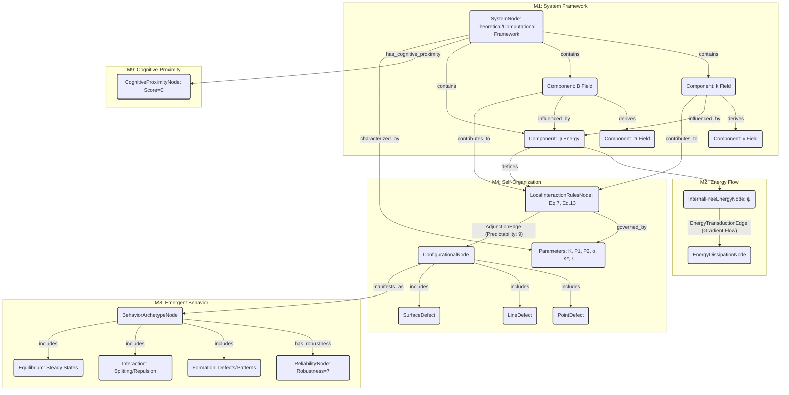

# Computing with non-orientable defects: nematics, smectics and natural patterns

__Paper Type:__ Hybrid

## M1: System Overview & Implementation
*   **Vector ID:** M1
*   **Vector Type:** Overview

### **1.1 System Description**

*   **Vector ID:** M1.1
*   **Vector Type:** Description
    *   Content: The paper presents a theoretical and computational framework for modeling the energetics, dynamics, and interactions of topological defects (dislocations, disclinations) in ordered media, specifically nematics, smectics, and natural patterns (like convection rolls). The core idea is to enrich macroscopic coarse-grained theories (based on order parameters like director fields `k`) with additional fields derived from continuum mechanics concepts of defects in solids. Primarily, it introduces a field `B` representing the 'singular' part of the gradient of the director field (`Dk`), allowing the 'regular' part `A = Dk - B` to remain well-behaved. This enrichment, along with associated defect densities (disclination density `π = curlA = -curlB`, dislocation density `γ = -curlk`), allows for thermodynamically consistent models with integrable energy densities, resolving singularities present in naive macroscopic theories. The system components include the phase field `θ`, the director field `k`, the defect field `B`, derived defect densities `π` and `γ`, and a free energy functional `ψ`. The purpose is to provide a unified, mathematically well-posed, and computationally tractable approach to study defect behavior across different material systems where classical models fail due to non-integrable energy densities associated with defect cores. It uses gradient flow dynamics based on the free energy and conservation of topological charge to model defect evolution and interaction.
    *   CT-GIN Mapping: `SystemNode` attributes: `systemType`: "Theoretical/Computational Framework", `domain`: "Condensed Matter Physics (Liquid Crystals, Pattern Formation)", `mechanism`: "Continuum Mechanics, Defect Theory, Thermodynamics, Gradient Flow", `components`: ["Phase Field θ", "Director Field k", "Defect Field B", "Disclination Density π", "Dislocation Density γ", "Free Energy ψ"], `purpose`: "Modeling defect dynamics and interactions in ordered media with regularized energy".
    *   Implicit/Explicit: Explicit
        *  Justification: The paper explicitly describes the theoretical framework, its components (fields, energy), the underlying concepts, and its purpose throughout Section 2 and the Introduction.

### **1.2 Implementation Clarity**

*   **Vector ID:** M1.2
*   **Vector Type:** Score
    *   Score: 8
    *   Justification: The theoretical framework is laid out in detail in Section 2, with clear definitions of the fields and their relationships, motivated by analogies with solid mechanics. The free energy functional (Eq. 7) is specified. The governing equations (gradient flow dynamics, Eq. 10-11, and the form used for computation Eq. 13) are derived. Section 3 provides concrete computational examples with specified parameters, boundary conditions, and numerical methods (FEM detailed in Appendix B), illustrating the framework's application. Some physical interpretation of parameters (e.g., precise mapping to real material constants) might require external knowledge, but the model's internal structure and computational implementation are clearly presented.
    *   Implicit/Explicit: Explicit
        * Justification: The paper explicitly details the theory, equations, and computational setup (including parameters used in examples and the numerical method in the appendix).

### **1.3 Key Parameters**

*   **Vector ID:** M1.3
*   **Vector Type:** ParameterTable
    *   Table:
        | Parameter Name | Value                  | Units            | Source (Fig/Table/Section) | Implicit/Explicit | Data Reliability (High/Medium/Low) | Derivation Method (if Implicit) |
        | :------------- | :---------------------: | :---------------: | :-----------------------: | :-----------------: | :-----------------------------: | :-------------------------------: |
        | `K`            | N/A (Used for non-dim) | Energy / Length  | Eq. 7                     | Explicit          | N/A                             | N/A                             |
        | `ξ`            | 0.1 (Computational)    | Length (non-dim)  | Sec 3.2                   | Explicit          | High (Specified for simulation) | N/A                             |
        | `P1`           | 100 (Nematic default)  | Dimensionless    | Sec 3.2                   | Explicit          | High (Specified for simulation) | Non-dimensionalized             |
        | `α`            | 10 (Nematic default)   | Dimensionless    | Sec 3.2                   | Explicit          | High (Specified for simulation) | N/A                             |
        | `ε`            | 1 (Nematic default)    | Dimensionless    | Sec 3.2                   | Explicit          | High (Specified for simulation) | Non-dimensionalized             |

    *   **Note:** Parameters listed are key components of the free energy (Eq. 7) and computational examples. `K` and `ξ` set the energy and length scales. `P1`, `P2`, `α`, `K*`, `ε` are non-dimensionalized parameters used in the simulations, controlling different energy contributions. Values provided are defaults for nematic simulations from Sec 3.2. `P2` is 0 for nematics, 1 for smectics. `K*` is 5 for nematics. Units for K are inferred based on its role in Frank energy; others are dimensionless as presented in the non-dimensionalization section (3.1) or simulation section (3.2).

## M2: Energy Flow
*   **Vector ID:** M2
*   **Vector Type:** Energy

### **2.1 Energy Input**

*   **Vector ID:** M2.1
*   **Vector Type:** Input
    *   Content: The system, as modeled by the gradient flow dynamics (Eq. 13) used for computations, does not have an external energy input. It models the relaxation of an initial (potentially high-energy) configuration towards a local minimum of the free energy `ψ` (Eq. 7). The energy driving the dynamics is the internal free energy stored in the field gradients and defect structures.
    *   Value: N/A
    *   Units: N/A
    *   CT-GIN Mapping: `EnergyInputNode`: attributes - `source`: "Internal Free Energy", `type`: "Potential Energy". (Note: This clarifies it's not external input driving the dynamics shown.)
    *   Implicit/Explicit: Implicit
        *  Justification: The paper describes a system relaxing towards equilibrium by minimizing internal free energy via gradient flow. Lack of external input terme in the dynamics equations (10, 11, 13) implies no external energy input for the modeled relaxation process.

### **2.2 Energy Transduction**

*   **Vector ID:** M2.2
*   **Vector Type:** Transduction
    *   Content: The primary energy transformation is the dissipation of the system's internal free energy `ψ` (Eq. 7) during the relaxation process described by the gradient flow dynamics (e.g., Eq. 10, 11, 13). The free energy, stored in various forms (elastic energy of director gradients `K|Dk-B|^2`, core energy `ε|π|^2`, director magnitude penalty `P1(|k|-1)^2`, etc.), drives changes in the fields `k` and `B`. This "potential" energy is converted into "dissipated" energy through the flow rules, analogous to conversion into heat in a physical system undergoing relaxation. The mobility parameters (`M_k`, `M_B` in Eq. 10-11, implicitly 1 in Eq. 13) mediate the rate of this dissipation.
    *   CT-GIN Mapping: `EnergyTransductionEdge`: attributes - `mechanism`: "Gradient Flow Dissipation", `from_node`: "InternalFreeEnergyNode", `to_node`: "DissipatedEnergyNode". Specific terms in `ψ` could be represented as sub-nodes of InternalFreeEnergyNode.
    *   Implicit/Explicit: Mixed
        *  Justification: The paper explicitly defines the free energy `ψ` (Eq. 7) and the gradient flow equations derived from it (Eq. 10, 11, 13). The concept of energy dissipation (`d/dt ∫ ψ dv ≤ 0`) is explicitly mentioned in the derivation context (Sec 2.3). The specific interpretation as "transduction from potential to dissipated" is an interpretation based on the gradient flow nature.

### **2.3 Energy Efficiency**

*   **Vector ID:** M2.3
*   **Vector Type:** Score
    *   Score: N/A
    *   Justification/Metrics: The concept of energy efficiency (useful work output / energy input) is not applicable to the described system, which models spontaneous relaxation towards a minimum free energy state via gradient flow. The process is inherently dissipative, converting internal potential energy into a dissipated form (analogous to heat).
    *   CT-GIN Mapping: N/A
    *   Implicit/Explicit: Implicit
      *  Justification: The paper focuses on modeling the physics of defect relaxation, not on a process involving energy input and useful work output, so efficiency is not discussed or relevant in that context.

### **2.4 Energy Dissipation**

*   **Vector ID:** M2.4
*   **Vector Type:** Dissipation
    *   Content: Energy dissipation is inherent in the gradient flow dynamics used to model the system's evolution towards equilibrium (Eq. 10, 11, 13). The rate of change of total free energy is non-positive (`d/dt ∫ ψ dv ≤ 0`), as shown in the derivation (Sec 2.3, Eq. 9 leading to 10-11). Dissipation occurs through the "frictional" resistance to changes in the fields `k` and `B`, modulated by mobility coefficients (`M_k`, `M_B`, assumed constant and positive, or implicitly 1 in the non-dimensionalized Eq. 13). The paper does not quantify the absolute rate of dissipation or provide numerical values for mobilities in physical units, but the mechanism is explicitly part of the model's thermodynamic foundation. Qualitative Assessment: High (during relaxation from a non-equilibrium state).
    *   CT-GIN Mapping: Creates `EnergyDissipationNode`. `EnergyDissipationEdge` connects `InternalFreeEnergyNode` to `EnergyDissipationNode`, attributes: `mechanism`: "Gradient Flow", `rate_dependency`: ["Mobility M_k", "Mobility M_B", "Variational Derivatives of ψ"].
    *    Implicit/Explicit: Mixed
        *  Justification: The thermodynamic principle ensuring non-increasing free energy (`d/dt ∫ ψ dv ≤ 0`) and the structure of the gradient flow equations (proportional to mobilities and energy derivatives) explicitly define the dissipative mechanism. Quantitative values are not provided, making the magnitude assessment qualitative/implicit.

## M3: Memory
*   **Vector ID:** M3
*   **Vector Type:** Memory

### **3.1 Memory Presence:**

*   **Vector ID:** M3.1
*   **Vector Type:** Binary
    *   Content: No
    *   Justification: The system models the equilibrium configurations and relaxation dynamics of defects. While the final defect state (`B`, `π`, `γ`, `k` fields) depends on the initial conditions and boundary conditions (history in a broad sense), the framework does not describe a mechanism for encoding arbitrary information into the material state that persists beyond the stimulus causing it and influences *future distinct* behavior in a way analogous to cognitive memory (storage, retention, recall). The defect structures are equilibrium or metastable physical states, not encoded memory states designed for information processing. The non-convex potential `f(|B|)` allows for multiple *stable physical states*, but the paper doesn't frame this as memory for computation or decision-making.
    *    Implicit/Explicit: Implicit
        * Justification: The paper describes the physics of defect configurations and their evolution. It does not mention or frame any aspect of the system in terms of information storage, memory capacity, or recall processes analogous to cognitive memory. The assessment is based on the absence of such descriptions.

**(Conditional: M3.1 is "No", skipping M3.2-M3.8)**

## M4: Self-Organization and Emergent Order
*   **Vector ID:** M4
*   **Vector Type:** Self-Organization

### **4.1 Self-Organization Presence:**

*   **Vector ID:** M4.1
*   **Vector Type:** Binary
    *   Content: Yes
    *   Justification: The framework models the formation of ordered structures (smectic layers, stripe patterns) and defect configurations (dislocations, disclinations, grain boundaries) which arise spontaneously from the system minimizing its free energy (`ψ`) according to local rules (governing equations). These patterns, like the computationally shown defect equilibria (Figs 4, 9, 11, etc.) or smectic boundaries (Fig 20), are emergent global states resulting from local interactions defined by the energy density and dynamics, not imposed by global templates (aside from boundary conditions).
    *   Implicit/Explicit: Mixed
        *  Justification: The paper explicitly computes equilibrium defect configurations and patterns (Figs 4, 9, 11, 12, 15, 19, 20, 22). The concept that these arise from minimizing a free energy based on local interactions (the definition of self-organization in this context) is explicit in the framework's description (Sec 1, Sec 2).

**(Conditional: M4.1 is "Yes", including M4.2-M4.7)**

### **4.2 Local Interaction Rules:**

*   **Vector ID:** M4.2
*   **Vector Type:** Rules
    *   Content: The local interaction rules are encoded in the free energy density functional `ψ` (Eq. 7) and the gradient flow evolution equations (Eq. 10, 11 for general thermodynamics; Eq. 13 for computation).
        *   **Energy Density `ψ` (Eq. 7):** `ψ = P1(|k|-1)^2 + P2|curlk|^2 + αK*f(|B|) + K|Dk-B|^2 + ε|π|^2`. This defines the local energy cost based on the magnitude of `k`, its curl, the magnitude of the defect field `B` (via the non-convex function `f`), the mismatch between `Dk` and `B`, and the magnitude of the disclination density `π = -curlB`.
        *   **Evolution Equations (e.g., Eq. 13):**
            *   `∂k/∂s = ...` describes how the director field `k` changes locally based on terms involving `k`, `B`, `Dk`, `curl k`, and parameters (`P1`, `P2`).
            *   `∂B/∂s = ...` describes how the defect field `B` changes locally based on `Dk - B`, the derivative of `f`, and `curl B` (or `π`), along with parameters (`α`, `K*`, `ε`).
        These equations define how each field evolves based on its local neighbourhood values and gradients, minimizing the total energy `∫ ψ dv`.
    *   CT-GIN Mapping: Defines `InteractionEdge`s between field nodes (`k`, `B`) governed by terms in `ψ` and derivatives in evolution equations. Attributes include parameter dependencies (`K`, `P1`, etc.). Could map `ψ` itself as a `FunctorNode` defining local costs.
    * **Implicit/Explicit**: Explicit
        *  Justification: The free energy density (Eq. 7) and the evolution equations (Eq. 10, 11, 13) defining the local interactions and dynamics are explicitly stated and derived in the paper.

### **4.2.1 Local Interaction Parameters:**

* **Vector ID:** M4.2.1
* **Vector Type:** Table
*   Table:
    | Rule ID | Description                     | Parameter Name | Parameter Value Range    | Units         | Data Source | Implicit/Explicit | Justification                          |
    | :------ | :------------------------------ | :------------- | :----------------------- | :------------: | :----------: | :----------------: | :-------------------------------------: |
    | Eq. 7   | Director magnitude penalty      | `P1`           | 100 (Nem); 1 (Smec)    | Dimensionless | Sec 3.2, 3.2.5 | Explicit          | Specified for simulations              |
    | Eq. 7   | Director curl penalty           | `P2`           | 0 (Nem); 1 (Smec)      | Dimensionless | Sec 3.2, 3.2.5 | Explicit          | Specified for simulations              |
    | Eq. 7   | Defect field `B` potential      | `α`            | 10, 50 (Nem); 50 (Smec) | Dimensionless | Sec 3.2, 3.2.5 | Explicit          | Specified for simulations              |
    | Eq. 7   | Defect field `B` potential scale | `K*`           | 5 (Nem, Smec)          | Dimensionless | Sec 3.2, 3.2.5 | Explicit          | Specified for simulations              |
    | Eq. 7   | Director gradient elasticity    | `K`            | N/A (sets scale)         | Energy/Length | Eq. 7          | Explicit          | Defined in energy function           |
    | Eq. 7   | Disclination core energy scale| `ε`            | 1 (Nem); 0.1 (Smec)    | Dimensionless | Sec 3.2, 3.2.5 | Explicit          | Specified for simulations              |
    | Eq. 7   | Non-convex potential shape    | `f(|B|)`       | Wells at 0, 2/(aξ)     | Dimensionless | Sec 2.3, 3.2   | Explicit          | Described qualitatively and used   |
    | Eq. 10,11| Mobility coefficients         | `M_k`, `M_B`     | N/A (Assumed positive)   | N/A           | Sec 2.3        | Explicit          | Introduced in theoretical derivation |

### **4.3 Global Order:**

*    **Vector ID:** M4.3
*   **Vector Type:** Order
    *   Content: The framework describes the emergence of various global (or extended) ordered states and defect structures. Examples computationally realized include:
        *   Isolated point defects (disclinations) of strength ±1/2 and +1 in 2D nematics (Figs 4, 9, 11, 7).
        *   Composite defects like strength -3/2 disclinations (Fig 12).
        *   Disclination loops in 3D nematics (Fig 15).
        *   Smectic grain boundaries, potentially containing defect arrays (disclination dipoles/dislocations) (Figs 19, 20).
        *   Stripe patterns (discussed in context of Swift-Hohenberg and Cross-Newell, Fig 22).
        *   Domain structures with different director orientations separated by defect layers/walls (implicit in the `B` field construct).
    *   CT-GIN Mapping: Defines specific `ConfigurationalNode` types: `PointDefect`, `LineDefect`, `SurfaceDefect`, `SmecticBoundary`, `StripePattern`. Attributes capture defect strength, geometry, etc.
    * **Implicit/Explicit**: Explicit
        *  Justification: These emergent structures are the primary subject of the computational examples presented in Section 3 and discussed in Section 4. Figures explicitly depict these global orders.

### **4.4 Predictability of Global Order:**

*   **Vector ID:** M4.4
*   **Vector Type:** Score
    *   Score: 9
    *   Justification: The framework uses deterministic partial differential equations (PDEs) for the gradient flow. Given specific initial conditions, boundary conditions, and material parameters, the resulting equilibrium state (global order) is, in principle, uniquely determined and computable via numerical simulation (as demonstrated). The predictability is high, limited only by numerical accuracy, potential existence of multiple local minima (requiring careful exploration of initial states), and sensitivity to parameters. The paper demonstrates repeatable computation of specific defect structures.
    * **Implicit/Explicit**: Mixed
    *  Justification: The deterministic nature of the PDEs (Eq. 13) is explicit. The high predictability is explicitly demonstrated through the successful computation of specific equilibrium states in Section 3. The score itself is an assessment based on this evidence.
    *   CT-GIN Mapping: High predictability score suggests strong AdjunctionEdges linking local rules (M4.2) to global order (M4.3). Could be an attribute of the `AdjunctionEdge`.

### **4.5. Local Interaction Rules (for Self-Organization)**
* **Vector ID:** M4.5
* **Vector Type:** Table
*   Table:
| Rule ID | Description                   | Parameter Name | Value Range           | Units          | Implicit/Explicit | Justification                        | Source         |
| :------ | :---------------------------- | :------------- | :-------------------- | :-------------: | :----------------: | :--------------------------------- | :-------------: |
| ψ-P1    | Director magnitude penalty    | `P1`           | 1 to 100              | Dimensionless  | Explicit          | Controls cost of deviation from |k|=1 | Sec 3.2, 3.2.5 |
| ψ-P2    | Director curl penalty         | `P2`           | 0 to 1                | Dimensionless  | Explicit          | Enforces zero curl (smectics)      | Sec 3.2, 3.2.5 |
| ψ-αK*   | Defect field `B` potential    | `α`, `K*`, `f` | α: 10-50, K*: 5       | Dimensionless  | Explicit          | Governs energy of B, wells at 0, 2 | Sec 2.3, 3.2   |
| ψ-K     | Director gradient elasticity  | `K`            | N/A (scale)         | Energy/Length  | Explicit          | Frank-like elastic energy term     | Eq. 7          |
| ψ-ε     | Disclination core energy    | `ε`            | 0.1 to 1              | Dimensionless  | Explicit          | Energy cost of disclination density| Sec 3.2, 3.2.5 |
| Dyn-k   | k-field evolution         | `M_k` (implied 1) | N/A                 | N/A            | Mixed             | Gradient descent on ψ w.r.t k    | Eq. 13, Sec 2.3|
| Dyn-B   | B-field evolution         | `M_B` (implied 1) | N/A                 | N/A            | Mixed             | Descent on ψ & charge conservation | Eq. 13, Sec 2.3|

### **4.6. Globally Emergent Order and Order Parameters**
* **Vector ID:** M4.6
* **Vector Type:** Table
*   Table:
| Property ID        | Description                  | Parameter          | Value Range            | Units          | Implicit/Explicit | Justification                           | Protocol                                 | Source      |
| :----------------- | :--------------------------- | :----------------- | :--------------------- | :-------------: | :----------------: | :-------------------------------------- | :--------------------------------------- | :---------- |
| DirectorField      | Local average orientation    | `k(x)`             | Vector, \|k\|≈1        | Dimensionless  | Explicit          | Primary order parameter field           | Solved from Eq. 13                       | Sec 2.1, 3  |
| DisclinationDensity| Density of orientation mismatch| `π(x) = -curlB`    | Tensor field           | 1/Length^2     | Explicit          | Measures disclination charge            | Calculated from B field                | Sec 2.3, Eq.6|
| DislocationDensity | Density of layer mismatch    | `γ(x) = -curlk`    | Vector field           | 1/Length       | Explicit          | Measures dislocation charge (smectics)| Calculated from k field                | Sec 2.3, Eq.6|
| DefectStrength     | Topological charge (point)   | ∫ π•dA or angle(k) | ±1/2, ±1, etc.         | Dimensionless  | Explicit          | Characterizes point defect topology     | Calculated from field configuration    | Sec 3.2     |
| GrainBoundary      | Interface between domains    | `B` localisation   | \|B\|≈2 on layer       | 1/Length       | Explicit          | Region where director flips rapidly     | Identified from B field simulation     | Sec 3.2.5   |
| PhaseField         | Layer position (smectics)    | `θ(x)`             | Scalar field           | Radians        | Explicit          | Reconstructed from k (if curlk=0)     | Solved via Helmholtz decomposition (Eq. 20)| Sec 3.2.5   |

### **4.7 Yoneda Embedding and Local-to-Global Mapping Fidelity**

*   **Vector ID:** M4.7
*   **Vector Type:** Table
*   Table:
    | Link Type | Description                 | Predictability | Yoneda Score | Metrics        | Implicit/Explicit | Justification                                      | Source |
    | :-------- | :-------------------------- | :------------- | :----------- | :------------- | :----------------: | :------------------------------------------------- | :-----: |
    | N/A       | Local Rules (`ψ`, Eq.13) to Global Order (Defect Configs) | High (Score 9) | N/A          | Visual config., Total Energy | Mixed (Implicit)  | Category Theory concepts like Yoneda embedding are not used or discussed in the paper. Predictability assessed in M4.4. | N/A     |
    *   **Yoneda Embedding Fulfillment Score [0-10]:** N/A
    *   **Metrics:** N/A
    *   **Justification:** The paper does not employ Category Theory concepts, therefore assessing the fidelity of a local-to-global mapping via Yoneda embedding is not applicable based on the text provided. The link between local rules and global order is established through solving the governing PDEs.

## M5: Computation
*   **Vector ID:** M5
*   **Vector Type:** Computation

### **5.1 Embodied Computation Presence:**

*   **Vector ID:** M5.1
*   **Vector Type:** Binary
    *   Content: No
    *   Justification: The paper's title "Computing with non-orientable defects" refers to the act of *using computational methods* (numerical simulations based on the developed framework) to study the behavior *of* defects. It does not describe the material system itself (nematic, smectic) as performing computation in the sense of processing input information to produce a distinct computational output (e.g., logic operations, solving a mathematical problem). The framework is a tool for simulation and understanding, not a description of a material computer.
    *    Implicit/Explicit: Implicit
        *  Justification: The paper focuses on modeling the physics of defects. There is no description of inputs, processing steps, or outputs that would constitute computation performed *by the material*. The assessment is based on this absence.

**(Conditional: M5.1 is "No", skipping M5.2-5.4)**

## M6: Temporal Dynamics
*   **Vector ID:** M6
*   **Vector Type:** Temporal

### **6.1 Timescales:**

*   **Vector ID:** M6.1
*   **Vector Type:** ParameterTable
    *   Table:
        | Timescale Description | Value | Units            | Source       | Implicit/Explicit | Justification                                       |
        | :-------------------- | :----: | :---------------: | :-----------: | :----------------: | :-------------------------------------------------- |
        | Simulation Time Step  | `∆s`  | Dimensionless    | Sec 3.2 (FEM) | Explicit          | Used in numerical gradient flow evolution.        |
        | Non-dimensional Time  | `s̃`   | Dimensionless    | Sec 3.1       | Explicit          | Scaled time used in gradient flow equations (Eq 13). |
        | Relaxation Time       | N/A   | `KM/ξ^2` (Physical)| Sec 3.1       | Implicit          | Physical time scale for relaxation, depends on material parameters K, M, ξ not specified physically. |
        *   **Note:** The paper primarily uses non-dimensionalized time `s̃` related to physical time `t` via `s˜ = (KM/ξ^2) t`. The characteristic physical relaxation timescale depends on material parameters (`K`, `M`, `ξ`) which are not assigned physical values in the excerpt, only non-dimensional combinations for simulations. `∆s` is the numerical time step size, value not specified.

### **6.2 Active Inference:**

*   **Vector ID:** M6.2
*   **Vector Type:** Assessment
    *   Content: No
    *   Justification: The theoretical framework and simulations describe the relaxation of a physical system towards a minimum energy state based on local deterministic rules (gradient flow). There is no mention or implementation of the system making predictions about future states, comparing predictions to outcomes (prediction error/surprise), or updating an internal model to minimize future errors, which are the hallmarks of active inference. The framework predicts the system's behavior, but the system itself is not modeled as performing prediction or inference.
    *   Implicit/Explicit: Implicit
        *  Justification: The paper focuses on physics-based modeling of defect dynamics using established continuum mechanics and thermodynamic principles. Concepts central to active inference (prediction error minimization, internal models, etc.) are absent from the description.
    *   **If Yes/Partial, provide examples of testable CT-GIN metrics that *could* be used to quantify active inference:** N/A

## M7: Adaptation
*   **Vector ID:** M7
*   **Vector Type:** Adaptation

### **7.1 Adaptive Plasticity Presence:**

*   **Vector ID:** M7.1
*   **Vector Type:** Binary
    *   Content: No
    *   Justification: The paper models the evolution of the fields `k` and `B` towards equilibrium or metastable states. This involves changes in the system's configuration (plasticity in the sense of defect rearrangement), but it represents relaxation driven by energy minimization, not adaptation or learning. There is no description of the system changing its internal structure or response rules over time based on experience or interaction with the environment in a way that leads to improved performance on a specific task or function. The material parameters (`K`, `P1`, etc.) are treated as fixed constants.
    *    Implicit/Explicit: Implicit
        * Justification: The paper describes relaxation dynamics. Concepts related to learning, experience-based improvement, or modification of response rules over time (adaptation) are not present in the model description or simulation results.

**(Conditional: M7.1 is "No", skipping M7.2)**

## M8: Emergent Behaviors
*   **Vector ID:** M8
*   **Vector Type:** Behavior

### **8.1 Behavior Description:**

*   **Vector ID:** M8.1
*   **Vector Type:** Description
    *   Content: The primary behaviors described and simulated are the formation, interaction, and equilibrium configurations of topological defects in ordered media. This includes:
        *   Formation of stable/metastable point disclinations (±1/2, +1, -3/2 strength) with characteristic director fields and localized core energies (Figs 4, 5, 7, 9, 11, 12, 13).
        *   Formation of disclination loops in 3D (Fig 14, 15).
        *   Energetics of defect interactions, such as the splitting of an unstable +1 defect into two +1/2 defects and their subsequent repulsion (Sec 3.2.2, Fig 10).
        *   Formation of smectic grain boundaries, potentially incorporating arrays of defect dipoles (dislocations) to lower energy (Sec 3.2.5, Figs 18, 19, 20, 21).
        *   Relaxation towards minimum energy states via gradient flow dynamics.
    *   CT-GIN Mapping: Defines `BehaviorArchetypeNode` types: `DefectFormation`, `DefectInteraction`, `DefectEquilibrium`, `PatternFormation` (Smectic/Stripe). Attributes can specify defect type, strength, dimensionality.
    *    Implicit/Explicit: Explicit
       *  Justification: These behaviors are the main subject of the paper, explicitly described in the text and illustrated with computational results in Section 3 and discussed in Section 4.

### **8.2 Behavior Robustness:**

*   **Vector ID:** M8.2
*   **Vector Type:** Score
    *   Score: 7
    *   Justification: The framework is designed to be robust by explicitly handling the singularities associated with defect cores using the `B` field, leading to well-posed models with integrable energies. The topological nature of the defects themselves implies a certain robustness to small perturbations. The numerical method (FEM) is claimed to be robust (Appendix B) and successfully computes various defect configurations. However, the excerpt doesn't provide quantitative analysis of robustness against specific perturbations (e.g., noise, parameter variations, boundary condition changes). The score reflects the intended robustness of the theoretical/computational framework rather than experimentally verified robustness of a physical material exhibiting these behaviors based solely on this paper.
    *   Implicit/Explicit: Mixed
        *  Justification: The goal of developing a robust framework and numerical method is explicit (Abstract, Intro, Sec 2.3). The topological nature of defects implying robustness is explicit (Intro). The numerical method robustness is claimed (Appendix B). Quantitative measures of robustness against specific perturbations are absent, making the score an assessment based on the framework's design principles and demonstrated capabilities.
    *   CT-GIN Mapping: Score attribute of `BehaviorArchetypeNode`. Could relate to `ReliabilityNode`.

### **8.3 CT-GIN Emergent Behavior Validation**

*    **Vector ID:** M8.3
*    **Vector Type:** Validation
     *  Content: Validation of the emergent behaviors (defect configurations and interactions) is primarily achieved through:
        1.  **Computational Simulation:** Solving the derived PDEs (Eq. 13) using the Finite Element Method (Appendix B) for specific scenarios (initial conditions, boundary conditions, parameters) to obtain equilibrium states (Sec 3.2).
        2.  **Physical Plausibility:** Comparing the computed field configurations (`k`, `B`, `ψ`) and structures (defects, layers) with known theoretical expectations and qualitative features of defects in nematics and smectics (e.g., director patterns around ±1/2 defects, Fig 4; Frank energy decay `1/r^2` outside core, Fig 6; structure of smectic boundaries, Fig 20).
        3.  **Energetic Analysis:** Comparing the total free energies of different configurations to assess relative stability (e.g., split +1 defect pair vs. single +1 defect, Sec 3.2.2; defected vs. defect-free smectic boundaries, Sec 3.2.5).
        Limitations include reliance on specific parameter values chosen for simulations and lack of direct comparison with quantitative experimental data within the excerpt.
     *   Implicit/Explicit: Explicit
    *   Justification: Section 3 explicitly describes the computational examples, showing resulting configurations (Figs) and discussing energy comparisons, serving as validation of the framework's ability to reproduce expected emergent defect behaviors. Appendix B details the numerical validation method.

## M9: Cognitive Proximity
*   **Vector ID:** M9
*   **Vector Type:** Cognition

### **9.1 Cognitive Mapping:**

*   **Vector ID:** M9.1
*   **Vector Type:** Description
    *   Content: None. The paper focuses on modeling the physics of defects in condensed matter systems using continuum mechanics and thermodynamics. There is no attempt to map the system's components or behaviors to cognitive processes or concepts like memory, learning, decision-making, or computation in a cognitive sense.
    *   CT-GIN Mapping: N/A
    *   Implicit/Explicit: Explicit
    * Justification: The paper's language, concepts, and framework are entirely within the domain of physics and materials science modeling. Cognitive terms or analogies are absent.

### **9.2 Cognitive Proximity Score:**

*   **Vector ID:** M9.2
*   **Vector Type:** Score
    *   Score: 0
    *   Justification: The system described is a theoretical/computational model of physical phenomena (defect dynamics in ordered media). It exhibits no characteristics associated with cognition as defined in the scale. It is purely reactive to the internal energy landscape and boundary conditions described by physical laws (Level 0). It doesn't store or process information, learn, adapt based on experience, make decisions, or exhibit any goal-directed behavior beyond minimizing free energy.
    *   Implicit/Explicit: Mixed
    *  Justification: The system description is explicit about modeling physics. The score of 0 is an assessment based on the explicit lack of any features corresponding to levels 1-10 on the Cognizance Scale.

**CT-GIN Cognizance Scale:** (Provided for reference, not part of the answer)

### **9.3 Cognitive Function Checklist**

* **Vector ID:** M9.3
* **Vector Type:** Checklist
    *   | Cognitive Function               | Score (0-10) | Justification/Notes                                                                       | CT-GIN Mapping (if applicable) | Implicit/Explicit | Justification for Implicit/Explicit/Mixed |
    | :-------------------------------- | :----------: | :------------------------------------------------------------------------------------ | :--------------------------------: | :-----------------:|:-----------------:|
    | Sensing/Perception               |      1       | System state depends on local field values (`k`, `B`, gradients), acting like internal 'sensing' of energy landscape. No external sensing. | N/A                               | Implicit          | Interpretation of field interactions. |
    | Memory (Short-Term/Working)        |      0       | No mechanism described for short-term information storage influencing ongoing processes. | N/A                               | Implicit          | Absence of description.        |
    | Memory (Long-Term)                 |      0       | No mechanism for encoding/retrieval of information over long term. Defect state is physical, not informational. | N/A                               | Implicit          | Absence of description.        |
    | Learning/Adaptation              |      0       | System relaxes to equilibrium, parameters are fixed. No learning or experience-based adaptation described. | N/A                               | Implicit          | Absence of description.        |
    | Decision-Making/Planning          |      0       | Evolution is deterministic gradient flow. No decision points or planning described.      | N/A                               | Implicit          | Absence of description.        |
    | Communication/Social Interaction |      0       | Models single continuous system. No interaction between distinct agents described.       | N/A                               | Implicit          | Absence of description.        |
    | Goal-Directed Behavior            |      0       | Behavior is energy minimization, not directed toward an external or cognitive goal.       | N/A                               | Implicit          | Absence of description.        |
    | Model-Based Reasoning              |      0       | System follows physical laws, does not use an internal predictive model for reasoning.   | N/A                               | Implicit          | Absence of description.        |
    | **Overall score**                 |      0.125     | Based on the very limited interpretation of 'sensing'. Essentially non-cognitive.        | N/A                               | N/A               | N/A                            |

    *   **Note:** Scores assigned based on the absence of mechanisms described in the paper that align with standard definitions of these cognitive functions. The low score for Sensing/Perception reflects the system's reliance on internal field states, a minimal interpretation.

## M10: Criticality Assessment
*   **Vector ID:** M10
*   **Vector Type:** Criticality

### **10.1 Criticality:**

*   **Vector ID:** M10.1
*   **Vector Type:** Assessment
    *   Content: Unclear
    *   Justification: The paper mentions the context of pattern formation often arising from instabilities (like Swift-Hohenberg, Sec 4), which occur near critical points. However, the framework presented primarily models the behavior *after* defects and patterns exist, focusing on their energetics and dynamics far from the initial onset bifurcation. While defect interactions can be long-range (e.g., elastic interactions decaying as `1/r`), the paper does not explicitly analyze whether the system dynamics or equilibrium states operate *near* a critical point in the statistical mechanics sense (characterized by scale-free fluctuations, power laws in correlations, etc.). The energy function has non-convexity (`f(|B|)`) which leads to multiple states, potentially related to phase transitions, but criticality analysis is not performed.
        *   Critical Parameters (If Yes/Partial): N/A
        *   Evidence: N/A (Lack of explicit analysis in the excerpt).
    *   Implicit/Explicit: Implicit
    *    Justification: The assessment is based on the absence of explicit discussion or analysis of criticality (in the statistical physics sense) applied to the framework's dynamics or equilibrium states within the provided text. Mentions of instabilities in related models (SH, CN) provide context but don't confirm criticality within this specific framework's application.

## M11: Review Paper Specifics (Conditional)

N/A (Paper type is Hybrid, not Review)

## M12: Theoretical Paper Specifics (Conditional)

*   **Vector ID:** M12
*   **Vector Type:** Theory

### **12.1 Theoretical Rigor:**

*   **Vector ID:** M12.1
*   **Vector Type:** Score
    *   Score: 9
    *   Justification: The theoretical framework is built upon established principles of continuum mechanics, defect theory (Volterra process, Nye tensor), and thermodynamics (free energy minimization, second law). Assumptions are generally stated (e.g., form of energy functional). The derivation of the governing equations (gradient flow) follows standard variational procedures combined with conservation laws (for topological charge). The framework aims to resolve inconsistencies (singularities) in simpler theories, demonstrating a concern for mathematical and physical soundness. The inclusion of computational examples serves as a form of validation for the theory's applicability.
       * Implicit/Explicit: Mixed
       *  Justification: The theoretical structure, equations, and derivations are explicit. The assessment of rigor (score) is based on evaluating the consistency and foundation of this explicit content.

### **12.2 Realization Potential:**

*   **Vector ID:** M12.2
*   **Vector Type:** Score
    *   Score: 8
    *   Justification: The theory is explicitly designed to model real physical systems: nematic liquid crystals, smectic liquid crystals, and natural patterns (like convection). The fields (`k`, `θ`) and concepts (defects) directly correspond to observable features in these materials. The parameters in the model (`K`, `ξ`, etc.) represent physical material constants, even if not assigned specific values in the excerpt. The framework addresses known physical phenomena (defect interactions, pattern formation). Thus, the potential for the *theory* to describe physical reality is high, assuming appropriate parameterization. Physical realization refers to the existence of materials described by this theory, which is the case.
    *   Implicit/Explicit: Mixed
    *  Justification: The paper explicitly states the physical systems being modeled (nematics, smectics, patterns). The connection between the theoretical constructs (fields, energy terms) and physical reality is explicit. The score assesses the feasibility of this theoretical description applying to real materials.

### **12.3 Potential for Future CT-GIN Implementation Score**

* **Vector ID:** M12.3
*   **Vector Type:** Score
    *   Score: 5
    *   Justification: The paper provides a structured, physics-based model for complex emergent phenomena (defects, patterns) arising from local rules (energy density, dynamics). This structured approach has potential for mapping onto a CT-GIN framework. Nodes could represent fields or defect types, edges could represent interactions derived from energy terms or dynamic coupling. The focus on local interactions leading to global structure aligns with CT principles. However, the paper itself does not use CT/GIN, and mapping concepts like memory, computation, or adaptation (currently absent in this model) would require significant extension or reinterpretation. The potential lies in the model's structured description of emergence, but substantial work would be needed for a full CT-GIN implementation related to material intelligence.
    *    Implicit/Explicit: Inferred
    *   Justification: The paper does not discuss CT or GINs. The score is an inferred assessment based on the structure of the physical model and its potential (or lack thereof) to be represented using CT-GIN concepts, particularly concerning emergent behavior and local-to-global mappings relevant to distributed intelligence, even if not cognitive intelligence as modelled here.

## M13: Overall Assessment & Scoring

*   **Vector ID:** M13
*   **Vector Type:** Overall

### **13.1 CT-GIN Readiness Score:**

*   **Vector ID:** M13.1
*   **Vector Type:** Score
*   **Calculated Score:** 4.0
    *(Calculation: Average(M1.2=8, M2.3=0 (N/A->0), M3.2=0 (M3.1=No), M4.4=9, M8.2=7, M9.2=0) = (8+0+0+9+7+0)/6 = 24/6 = 4.0)*

**CT-GIN Readiness Summary Table:**

| CT-GIN Aspect                   | Strength (Yes/Partial/No) | Key Supporting Metrics (with units) | Limitations (Missing Metrics/Data Gaps)                                           | Improvement Areas (Future Research)                                          |
| :------------------------------ | :-----------------------: | :-----------------------------------| :------------------------------------------------------------------------------- | :---------------------------------------------------------------------------- |
| Energy Flow Efficiency          | No                        | N/A - System is dissipative relaxation | Efficiency metric not applicable to gradient flow model.                          | N/A (unless model extended to driven systems).                               |
| Memory Fidelity                 | No                        | N/A                                  | No cognitive memory mechanism modeled; defect state is physical, not informational. | Incorporate mechanisms for information encoding, storage, and retrieval.    |
| Organizational Complexity       | Yes                       | Defect types (±1/2, loop), Patterns (Smectic) | Quantified order parameters beyond defect description limited.                     | Develop quantitative metrics for pattern complexity and long-range order.      |
| Embodied Computation            | No                        | N/A                                  | Framework simulates physics, doesn't model material performing computation.         | Introduce components/dynamics enabling information processing within material. |
| Temporal Integration            | Partial                   | Simulation time `s̃`, relaxation dynamics | Physical timescales not quantified; No active inference or complex temporal processing. | Parameterize physical timescales; explore richer dynamics (e.g., driven systems). |
| Adaptive Plasticity             | No                        | N/A                                  | Models relaxation, not experience-based adaptation or learning.                   | Include mechanisms for parameter/rule modification based on history/feedback.  |
| Functional Universality         | No                        | N/A                                  | Framework specific to defect physics in ordered media. Not computationally universal. | Explore if defect interactions could emulate universal computation (speculative). |
| Cognitive Proximity            | No                        | Score: 0                             | Models physics, lacks cognitive functions (memory, learning, decision-making).  | Requires fundamental additions to bridge gap to cognitive models.             |
| Design Scalability & Robustness | Partial                   | Robust numerics claimed; Topological defects | Quantitative robustness analysis absent; Scalability refers to model scope, not material production. | Quantify robustness; Explore relation to scalable material design principles. |
| **Overall CT-GIN Readiness Score** | **4.0**                   | Low                              |                                      |                                                                                  |                                                                               |

### **13.2 Qualitative CT-GIN Assessment Conclusion:**

*   **Vector ID:** M13.2
*   **Vector Type:** Textual Summary
    *   Content: This paper presents a rigorous and computationally validated framework for modeling the physics of topological defects in ordered media like liquid crystals and natural patterns. Its key strength lies in providing a thermodynamically consistent and numerically robust way to handle defect core singularities, enabling the study of defect formation, interaction, and equilibrium structures (Organizational Complexity). The model successfully describes emergent behaviors like defect stabilization and grain boundary formation based on local energetic rules (gradient flow). However, from a CT-GIN perspective focused on material intelligence, the framework has significant limitations. It does not incorporate mechanisms for cognitive memory, embodied computation, learning/adaptation, or goal-directed behavior. Energy flow analysis is limited to internal energy dissipation during relaxation. While it models complex emergent physical structures, its cognitive proximity is essentially zero. The framework's value lies in its accurate physical modeling of defect-mediated phenomena, providing a foundation upon which concepts relevant to material intelligence *might* be built (e.g., if defect states could be controllably used for information storage or processing), but it does not inherently possess cognizant characteristics as presented.
    *   Implicit/Explicit: Mixed (Summary based on explicit findings from previous sections).

### **13.3 CT-GIN Refinement Directions:**

*   **Vector ID:** M13.3
*   **Vector Type:** Recommendations
    *   Content:
        *   **Incorporate Memory:** Explore modifications to the energy functional or dynamics to allow defect configurations (`B`, `π`) or related fields to represent stored information states, potentially requiring bistability beyond the simple non-convexity of `f(|B|)` or mechanisms for state-switching based on external signals.
        *   **Enable Computation:** Investigate if interactions between defects or controlled defect motion could be exploited to perform logic operations or other computational primitives, potentially mapping inputs (e.g., boundary conditions, applied fields) to outputs (e.g., final defect configuration, energy state).
        *   **Introduce Adaptation:** Modify the framework to allow material parameters (e.g., `K`, `P1`, `α`) or interaction rules to change based on system history or feedback, enabling learning or adaptation of defect behavior/patterns.
        *   **Model Driven Systems:** Extend the framework beyond gradient flow relaxation to include external energy inputs (e.g., applied fields, flow) to study non-equilibrium steady states, oscillations, or active inference-like behaviors (if coupled with appropriate predictive mechanisms).
        *   **Quantify Robustness:** Perform systematic studies simulating the system's response to noise, parameter uncertainty, and boundary perturbations to quantitatively assess the robustness of emergent defect structures and dynamics.
        *   **Bridge to Experiment:** Parameterize the model using specific experimental data for nematics or smectics to allow quantitative comparison between simulation and physical reality.
    *   Implicit/Explicit: Inferred.

## M14: CT-GIN Knowledge Graph

*   **Vector ID:** M14
*   **Vector Type:** Visualization

### **14.1. CT-GIN Knowledge Graph:**
* **Content:**

*(Note: This Mermaid graph is a schematic representation. Edge labels indicate relationship types or key attributes. Node attributes mentioned in text are implicitly associated.)*

## M15: Relationship Vectors
*   **Vector ID:** M15
*   **Vector Type:** Relationships
*   Relationships:
        | Source Vector ID | Target Vector ID | Relationship Type          |
        | :--------------- | :--------------- | :------------------------- |
        | M1.1             | M1.3             | System described by Params |
        | M1.1             | M2.1             | System has Energy Source   |
        | M1.1             | M4.1             | System exhibits Self-Org   |
        | M1.1             | M8.1             | System exhibits Behavior   |
        | M1.1             | M9.1             | System compared to Cognition |
        | M1.1             | M12.1, M12.2     | System has Theory Aspects  |
        | M1.3             | M4.2.1           | Implementation Params define Rules |
        | M2.1             | M2.2             | Input Energy transduced   |
        | M2.2             | M2.4             | Transduction involves Dissipation |
        | M4.1             | M4.2             | Self-Org follows Rules     |
        | M4.2             | M4.3             | Rules lead to Global Order |
        | M4.3             | M8.1             | Global Order manifests Behavior |
        | M8.1             | M8.2             | Behavior has Robustness    |
        | M1.1             | M13.2            | Overall Assessment of System |
        | M13.2            | M13.3            | Assessment suggests Refinements |

## M16: CT-GIN Template Self-Improvement Insights

*   **Vector ID:** M16
*   **Vector Type:** Feedback

### **Template Feedback:**

*    **Vector ID:** M16.1
*   **Vector Type:** Text
    *   **Missing Probes:**
        *   A dedicated section/probe for quantifying the *degree* or *complexity* of self-organization might be useful (e.g., using information-theoretic measures, correlation lengths, fractal dimensions), beyond just Yes/No and description. Current M4.6 asks for parameters but not an overall complexity metric.
        *   For theoretical/computational papers, a probe assessing the *novelty* of the theoretical contribution or computational approach could be valuable.
    *   **Unclear Definitions:**
        *   The distinction between "Memory" (M3) and "Adaptation" (M7) could be slightly sharpened, maybe by emphasizing Memory as state persistence for *information* and Adaptation as *performance improvement* through change.
        *   "Cognitive Proximity Score" (M9.2) using the 10-level scale is useful, but applying it to purely physics papers results predictably in low scores. Perhaps guidance on how to score systems that excel in physical complexity (like self-organization) but lack cognitive parallels could be added, or the scale could be primarily used for systems *claiming* cognitive function. Currently, it feels like penalizing a physics paper for not being a cognitive science paper. Maybe a separate score for "Physical Complexity/Emergence"?
    *   **Unclear Node/Edge Representations:**
        *   The suggested CT-GIN mappings are helpful as examples, but more concrete guidance on mapping specific mathematical structures (like terms in an energy functional or PDE) to nodes/edges would be beneficial. For instance, how to represent the *influence* of a parameter on an interaction edge.
        *   Mapping concepts like "Robustness" (M8.2) is linked to a `ReliabilityNode`, which seems reasonable, but more examples of mapping qualitative scores or assessments to graph attributes would be good.
    *   **Scoring Difficulties:**
        *   Assigning scores for Robustness (M8.2) or Theoretical Rigor (M12.1) is inherently subjective. Providing clearer, more graduated rubrics with examples for different score levels could improve consistency.
        *   Scoring Energy Efficiency (M2.3) for non-driven, dissipative systems led to N/A. The template should perhaps clarify if this only applies to systems with clear input/output work, or provide alternative metrics for dissipative systems (e.g., relaxation rate).
    *   **Data Extraction/Output Mapping:**
        *   Mapping this physics paper required careful interpretation, especially for modules focused on cognition (M3, M5, M7, M9), often resulting in "No" or "N/A". This isn't a flaw *per se*, but highlights the template's strong cognitive bias.
        *   Distinguishing between Implicit/Explicit/Mixed/Inferred was generally clear, but justifying "Implicit" (based on absence) requires careful wording.
    *   **Overall Usability:** The template is very detailed and structured, which is good for consistency. However, its length and cognitive focus make it somewhat cumbersome for analyzing purely physical modeling papers. Sections M11 (Review) and M12 (Theoretical) being conditional helps, but maybe M12 should apply to *any* paper with theoretical contributions, not just purely theoretical ones? The current paper is Hybrid but M12 was relevant.
    * **Specific Suggestions:**
        *   Consider adding an explicit "Physical Complexity Score" or "Emergence Complexity Score" distinct from Cognitive Proximity.
        *   Refine the scoring rubrics for qualitative assessments (Robustness, Rigor, etc.).
        *   Clarify applicability of certain modules (like M2.3 Efficiency) to different system types (e.g., dissipative vs. driven).
        *   Potentially merge M12 into the main flow for any paper with theoretical aspects, rather than making it conditional on paper type "Theoretical".
        *   Add more detailed examples/guidelines for CT-GIN mapping, especially for mathematical operators and parameters.