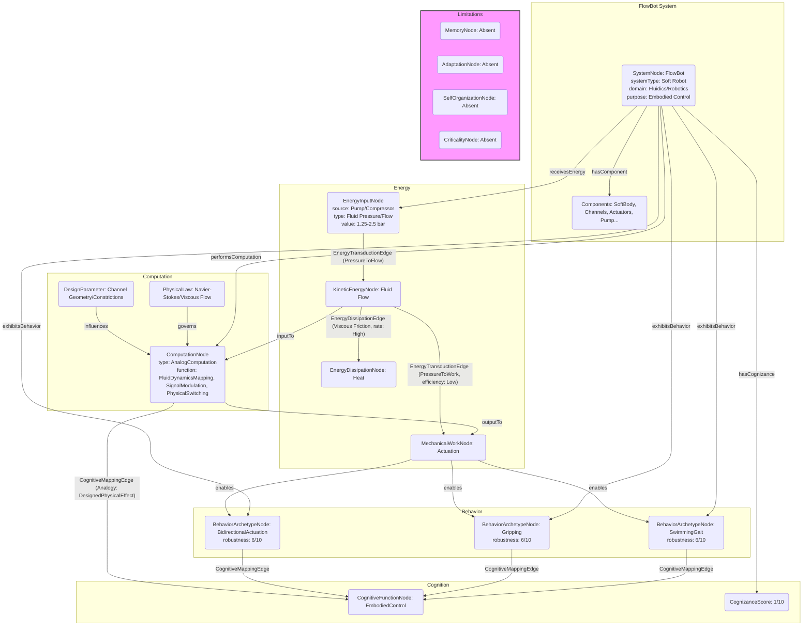

# Fluidic FlowBots: Intelligence embodied in the characteristics of recirculating fluid flow

__Paper Type:__ Hybrid

## M1: System Overview & Implementation
*   **Vector ID:** M1
*   **Vector Type:** Overview

### **1.1 System Description**

*   **Vector ID:** M1.1
*   **Vector Type:** Description
    *   Content: The system consists of soft robots ("FlowBots") actuated by recirculating fluid flow (pneumatic or hydraulic). Control functionality is embedded directly into the robot's structure by leveraging fluid flow characteristics, specifically viscous energy losses and pressure asymmetries created by internal channel geometries (e.g., constrictions). This allows for complex behaviors (e.g., bidirectional actuation, gripping, swimming gait) with simplified external control inputs, often enabling monolithic additive manufacturing. Components include the soft robot body with internal fluid channels, actuators (bellows), inlet/outlet ports, a fluid reservoir, and a pump/pressure source. The purpose is to achieve complex soft robot control through embodied intelligence derived from fluid dynamics, reducing reliance on complex external valving and electronics.
    *   CT-GIN Mapping: `SystemNode` attributes: `systemType`: Soft Robot, `domain`: Fluidics/Robotics, `mechanism`: Embodied Control via Fluid Dynamics, `components`: [Soft Body, Internal Channels, Actuators, Ports, Reservoir, Pump], `purpose`: Simplified Control through Embodied Intelligence
    *   Implicit/Explicit: Explicit
        *  Justification: The abstract, introduction (Sections I-A, I-B, I-C, I-D), and results (Section II) explicitly describe the system, its components, operating principle (recirculating flow, viscous losses), and purpose (embodied intelligence for simplified control).

### **1.2 Implementation Clarity**

*   **Vector ID:** M1.2
*   **Vector Type:** Score
    *   Score: 8
    *   Justification: The paper clearly describes the concept, operating principles (recirculating flow, viscous losses, pressure asymmetry), and provides specific examples (bidirectional actuator, gripper, swimmer) with diagrams (Figs 1, 3, 4, 5). Manufacturing (additive manufacturing) and control methods (varying outlet constrictions) are explained. Experimental setup (Fig 4, Appx II-A) and data analysis (Appx II-B) are detailed. Some finer details of channel geometry optimization or CFD/FEA implementation could be clearer, but the overall implementation is well-described.
    *   Implicit/Explicit: Explicit
        * Justification: The clarity is judged based on the text, figures, and supplementary material descriptions provided in the excerpt.

### **1.3 Key Parameters**

*   **Vector ID:** M1.3
*   **Vector Type:** ParameterTable
    *   Table:
        | Parameter Name | Value | Units | Source (Fig/Table/Section) | Implicit/Explicit | Data Reliability (High/Medium/Low) | Derivation Method (if Implicit) |
        | :------------- | :---: | :---: | :-----------------------: | :-----------------: | :-----------------------------: | :-------------------------------: |
        | Operating Pressure (Air/Water) | 1.25 - 2.5 | bar | Section II-D, Fig 7 | Explicit | High | N/A |
        | Channel Constriction Width (Min) | 0.6 | mm | Section II-D | Explicit | Medium | N/A (Stated as design parameter, actual printed value might vary slightly) |
        | Actuator Response Time (Water) | ~0.11 - 0.12 | s | Fig 3 (Supp) | Explicit | High | N/A |
        | Actuator Response Time (Air) | ~0.075 - 0.08 | s | Fig 3 (Supp) | Explicit | High | N/A |
        | Filament Material | Filaflex 70A / 82A TPU | N/A | Section III-B, Appx II-C | Explicit | High | N/A |

## M2: Energy Flow
*   **Vector ID:** M2
*   **Vector Type:** Energy

### **2.1 Energy Input**

*   **Vector ID:** M2.1
*   **Vector Type:** Input
    *   Content: The primary energy source is a pump (hydraulic case) or compressed air supply (pneumatic case) providing pressurized fluid flow.
    *   Value: 1.25 - 2.5 (Pressure range tested)
    *   Units: bar
    *   CT-GIN Mapping: `EnergyInputNode`: attributes - `source`: Pump/Compressor, `type`: Fluid Pressure/Flow
    *   Implicit/Explicit: Explicit
        *  Justification: Sections I-C, II-A, II-D, and Appx II-A explicitly mention the pump/pressure source and the operating pressure range.

### **2.2 Energy Transduction**

*   **Vector ID:** M2.2
*   **Vector Type:** Transduction
    *   Content: Potential energy (pressure) from the source is converted into kinetic energy of the fluid flow. This energy is partially dissipated as heat due to viscous friction within the channels, creating pressure drops. The remaining pressure potential energy is converted into mechanical work, causing the deformation (actuation) of the soft robot's structure (bellows). The fluid then returns to the reservoir (hydraulic) or vents (pneumatic).
    *   CT-GIN Mapping: `EnergyTransductionEdge`: attributes - `mechanism`: PressureToFlow, `from_node`: EnergyInputNode, `to_node`: KineticEnergyNode; `EnergyTransductionEdge`: attributes - `mechanism`: PressureToWork, `from_node`: KineticEnergyNode, `to_node`: MechanicalWorkNode; `EnergyDissipationEdge`: attributes - `mechanism`: Viscous Friction, `from_node`: KineticEnergyNode, `to_node`: HeatNode
    *   Implicit/Explicit: Explicit
        *  Justification: Sections I-B, I-C, II-A, and II-D describe the role of pressure in driving flow, viscous losses leading to pressure drops, and pressure differences causing actuator deformation.

### **2.3 Energy Efficiency**

*   **Vector ID:** M2.3
*   **Vector Type:** Score
    *   Score: 2
    *   Justification/Metrics: Low. The paper explicitly states that constant recirculation "comes with the cost of energy expenditure (making the specific systems described in this paper less thermodynamically efficient than their counterparts shown in Figure 1)" (Section III-B). The primary goal is simplified control via embodied intelligence, not energy efficiency. Energy is continuously consumed to maintain flow, even when the actuator is static. No quantitative efficiency metrics are provided.
    *   CT-GIN Mapping: Attribute (`efficiency_qualitative`: Low) of relevant `EnergyTransductionEdge`s (PressureToWork).
    *   Implicit/Explicit: Explicit
      *  Justification: The paper explicitly mentions the inefficiency relative to other methods in Section III-B.

### **2.4 Energy Dissipation**

*   **Vector ID:** M2.4
*   **Vector Type:** Dissipation
    *   Content: The primary dissipation mechanism is viscous friction between the flowing fluid and the internal channel walls, leading to pressure drops and heat generation. This dissipation is intentionally leveraged, particularly at constrictions, to create pressure asymmetries for control (Section II-A). Minor dissipation may occur due to turbulence, especially in bellow geometries and bends (Section III-B), and potential energy loss if the fluid returns to a reservoir at a lower elevation (hydraulic). Quantification is not provided, but viscous losses are central to the concept. Qualitative assessment: High (due to continuous recirculation and reliance on viscous effects).
    *   CT-GIN Mapping: Creates `EnergyDissipationNode`(Heat) and `EnergyDissipationEdge`(Viscous Friction) from `KineticEnergyNode`.
    *    Implicit/Explicit: Explicit
        *  Justification: Viscous losses/friction are explicitly mentioned as the key mechanism exploited for control throughout the paper (e.g., Sections I-B, I-C, II-A, II-D). The inefficiency (Section III-B) implies significant dissipation.

## M3: Memory
*   **Vector ID:** M3
*   **Vector Type:** Memory

### **3.1 Memory Presence:**

*   **Vector ID:** M3.1
*   **Vector Type:** Binary
    *   Content: No
    *   Justification: The system's state (actuator deformation) is directly determined by the current input flow rate/pressure distribution, controlled by external constrictions or pump settings. While the material might exhibit viscoelastic effects (mentioned implicitly by the curve shape in Fig 6, Supp), there is no described mechanism where the system's state persists *independently* of the input stimulus to influence *future, distinct* behaviors in a way characteristic of memory for computation or learning. The described behavior is primarily reactive based on current inputs.
    *    Implicit/Explicit: Implicit
        * Justification: The paper focuses on direct control via flow characteristics. No mechanisms for information storage persisting beyond the stimulus are described. The absence of memory is inferred from the described operating principles.

**(Conditional: M3.1 is "No", skip to Module 4.)**

### **3.2 Memory Type:**

*   **Vector ID:** M3.2
*   **Vector Type:** Score
*   Score: N/A
*   Justification: N/A
*   CT-GIN Mapping: N/A
*    Implicit/Explicit: N/A
    * Justification: N/A

### **3.3 Memory Retention Time:**

*   **Vector ID:** M3.3
*   **Vector Type:** Parameter
*   Value: N/A
*    Units: N/A
*   Justification: N/A
*    Implicit/Explicit: N/A
        * Justification: N/A
*   CT-GIN Mapping: N/A

### **3.4 Memory Capacity (Optional - if applicable)**

* **Vector ID:** M3.4
* **Vector Type:** Parameter
*  Value: N/A
*   Units: N/A
*   Justification: N/A
*    Implicit/Explicit: N/A
        *  Justification: N/A
*   CT-GIN Mapping: N/A

### **3.5 Readout Accuracy (Optional - if applicable)**

* **Vector ID:** M3.5
* **Vector Type:** Parameter
*   Value: N/A
*   Units: N/A
*   Justification: N/A
*    Implicit/Explicit: N/A
       *  Justification: N/A
*   CT-GIN Mapping: N/A

### **3.6 Degradation Rate (Optional - if applicable)**
* **Vector ID:** M3.6
* **Vector Type:** Parameter
    *   Value: N/A
    *   Units: N/A
    *   Justification: N/A
    *    Implicit/Explicit: N/A
            * Justification: N/A
    *   CT-GIN Mapping: N/A

### **3.7 Memory Operations Energy Cost (Optional - if applicable)**
* **Vector ID:** M3.7
* **Vector Type:** Table
*   Table:
    | Memory Operation ID | Energy Consumption per Bit | Power Usage during Operation| Units | Uncertainty | Data Source Reference | Implicit/Explicit | Justification |
    | :------------------ | :--------------------------: | :-----------------------------: | :---: |:-----------------:|:-----------------:|:-----------------:| :------------------ |
    | N/A                 | N/A                          | N/A                            | N/A   | N/A        | N/A        | N/A        | N/A      |
*   Implicit/Explicit: N/A
    *   Justification: N/A

### **3.8 Memory Fidelity & Robustness Metrics (Optional - if applicable)**
* **Vector ID:** M3.8
* **Vector Type:** Table
*   Table:
    | Metric ID | Description | Value | Units | CT-GIN Mapping | Data Source | Implicit/Explicit | Justification |
    | :-------- | :---------- | :----: | :---: | :-------------: | :----------: |:-----------------:| :-----------------:|
    | N/A       | N/A         | N/A    | N/A   | N/A             | N/A          | N/A                 | N/A       |
*   Implicit/Explicit: N/A
*   Justification: N/A
---

## M4: Self-Organization and Emergent Order
*   **Vector ID:** M4
*   **Vector Type:** Self-Organization

### **4.1 Self-Organization Presence:**

*   **Vector ID:** M4.1
*   **Vector Type:** Binary
    *   Content: No
    *   Justification: The system's structure and behavior are directly determined by the pre-designed channel geometry and the externally controlled fluid flow parameters (pressure, direction, vent constrictions). While complex flow patterns (turbulence, secondary flows mentioned in Section III-B) might arise locally within the channels, these are consequences of the imposed conditions and designed geometry, not a spontaneous emergence of global order from local rules in the sense required for self-organization leading to intelligent behavior. The overall robot morphology and control architecture are explicitly designed.
    *   Implicit/Explicit: Implicit
        *  Justification: The paper describes designed systems with control based on predictable fluid dynamics principles (viscous losses in specific geometries). There's no mention or evidence of spontaneous pattern formation or structural organization beyond what is directly engineered.

**(Conditional: M4.1 is "No", skip to Module 5.)**

### **4.2 Local Interaction Rules:**

*   **Vector ID:** M4.2
*   **Vector Type:** Rules
    *   Content: N/A
    *   CT-GIN Mapping: N/A
    * **Implicit/Explicit**: N/A
        *  Justification: N/A

### **4.2.1 Local Interaction Parameters:**

* **Vector ID:** M4.2.1
* **Vector Type:** Table
*   Table:
    | Rule ID | Description | Parameter Name | Parameter Value Range | Units | Data Source | Implicit/Explicit | Justification |
    | :------ | :---------- | :------------- | :---------- | :---: | :----------: | :----------------: | :------------: |
    | N/A     | N/A         | N/A            | N/A         | N/A   | N/A          | N/A              | N/A            |

### **4.3 Global Order:**

*   **Vector ID:** M4.3
*   **Vector Type:** Order
    *   Content: N/A
    *   CT-GIN Mapping: N/A
    * **Implicit/Explicit**: N/A
        *  Justification: N/A

### **4.4 Predictability of Global Order:**

*   **Vector ID:** M4.4
*   **Vector Type:** Score
    *   Score: N/A
    *   Justification: N/A
    * **Implicit/Explicit**: N/A
    *  Justification: N/A
    *   CT-GIN Mapping: N/A

### **4.5. Local Interaction Rules (for Self-Organization)**
* **Vector ID:** M4.5
* **Vector Type:** Table
*   Table:
| Rule ID | Description | Parameter | Value Range | Units | Implicit/Explicit | Justification | Source |
| :------ | :---------- | :-------- | :---------- | :---: | :----------------: | :------------: | :-----: |
| N/A     | N/A         | N/A       | N/A         | N/A   | N/A              | N/A            | N/A     |

### **4.6. Globally Emergent Order and Order Parameters**
* **Vector ID:** M4.6
* **Vector Type:** Table
*   Table:
| Property ID | Description | Parameter | Value Range | Units | Implicit/Explicit | Justification | Protocol | Source |
| :---------- | :---------- | :-------- | :---------- | :---: | :----------------: | :------------: | :------: | :-----: |
| N/A        | N/A    | N/A   | N/A   | N/A    | N/A | N/A  | N/A | N/A  |

### **4.7 Yoneda Embedding and Local-to-Global Mapping Fidelity**

*   **Vector ID:** M4.7
*   **Vector Type:** Table
*   Table:
    | Link Type | Description | Predictability | Yoneda Score | Metrics | Implicit/Explicit | Justification | Source |
    | :-------- | :---------- | :------------- | :----------- | :------ | :----------------: | :------------: | :-----: |
     | N/A        | N/A      | N/A         | N/A         | N/A    | N/A | N/A   | N/A   |
    *   **Yoneda Embedding Fulfillment Score [0-10]:** N/A
    *   **Metrics:**  N/A
    *   **Justification:** N/A

## M5: Computation
*   **Vector ID:** M5
*   **Vector Type:** Computation

### **5.1 Embodied Computation Presence:**

*   **Vector ID:** M5.1
*   **Vector Type:** Binary
    *   Content: Yes
    *   Justification: The paper frames the system's operation as "embodied intelligence" where "control functionality can be embedded directly into actuators by leveraging the characteristics of fluid flow phenomena" (Abstract, Section I). The specific fluidic pathways and constrictions physically implement a mapping from input flow parameters (rate, direction) and control adjustments (vent constrictions) to output deformation patterns. This physical processing of fluid dynamics to achieve control can be interpreted as a form of embodied computation, specifically analog computation. For example, the pressure drop due to viscous losses acts as a physical computation of flow resistance influencing actuator deformation. The switching between series and parallel configurations in the gripper/swimmer (Sec II-B, II-C) represents a form of embodied logic or signal routing.
    *    Implicit/Explicit: Mixed
        *  Justification: The paper explicitly uses the term "embodied intelligence" and discusses embedding control functionality into the structure. Interpreting this as "embodied computation" requires mapping the concept of computation onto the physical fluid dynamics described. The specific computational operations are implicitly performed by the physics.

**(Conditional: If M5.1 is "Yes", include M5.2-5.4)**

### **5.2 Computation Type:**

*   **Vector ID:** M5.2
*   **Vector Type:** Classification
    *   Content: Analog
    *   CT-GIN Mapping: `ComputationNode` type: `AnalogComputation`
    *    Implicit/Explicit: Implicit
    *    Justification: The control mechanism relies on continuous physical variables (pressure, flow rate) and their relationship governed by fluid dynamics (viscous losses proportional to flow, channel geometry). Control inputs (vent constrictions, Fig 3) and outputs (actuator curvature, Fig 7) are described as having an "analogue characteristic". This continuous processing is characteristic of analog computation.

### **5.3 Computational Primitive:**

*   **Vector ID:** M5.3
*   **Vector Type:** Function
    *   Content: The most basic computational operation appears to be the physical realization of fluid dynamic relationships, primarily relating flow rate, channel geometry (resistance/impedance), and pressure drop (analogous to Ohm's law, V=IR, or more complex fluid equations). The system physically computes the pressure distribution based on input flow and boundary conditions (vent constrictions). This pressure distribution then drives actuation. Specific examples translate this into:
        *   **Signal Weighting/Modulation:** Channel constrictions modulate the effect of flow on local pressure.
        *   **Thresholding (Implicit):** Actuation only occurs significantly above certain pressure differentials.
        *   **Signal Routing/Switching:** Changing flow paths/blocking ports switches actuators between series and parallel configurations (Fig 4, Fig 5), acting like a physical logic switch or multiplexer based on flow paths.
    *   **Sub-Type (if applicable):** Physical Law Implementation (Fluid Dynamics), Signal Modulation, Physical Switching
    *   CT-GIN Mapping: `ComputationNode` function: `FluidDynamicsMapping`, `SignalModulation`, `PhysicalSwitching`
    *   Implicit/Explicit: Implicit
    * Justification: The paper describes the physical effects (viscous losses, pressure asymmetry). Identifying these as computational primitives requires interpreting the physics in computational terms. The "analogue mapping" is explicit, but the underlying computation (solving fluid dynamics) is implicit. Switching behavior (series/parallel) is explicit, but framing it as a computational primitive (switching/routing) is an interpretation.

### **5.4 Embodied Computational Units**
* **Vector ID:** M5.4
* **Vector Type:** Table
*   Table:
| Unit ID | Description | Processing Power | Energy/Operation | Freq/Resp. Time | Bit-Depth | Data Source | Implicit/Explicit | Justification |
| :------ | :---------- | :--------------- | :--------------- | :--------------: | :-------: | :----------: |:-----------------:| :-----------------:|
| Channel Segment | Maps flow to pressure drop via viscous loss | N/A (Continuous) | N/A (Continuous Dissipation) | Response time limited by fluid transit (~0.1s, Fig 3 Supp) | N/A (Analog) | Sections I-C, II-A | Implicit | Interprets physical process as computation. |
| Constriction | Concentrates viscous loss, amplifies pressure asymmetry | N/A (Continuous) | N/A (Continuous Dissipation) | ~0.1s | N/A (Analog) | Section II-A | Implicit | Interprets physical process as computation. |
| Series/Parallel Switch | Routes flow based on blocked ports | N/A (Discrete logic implied) | N/A | ~0.1s (Actuator response) | N/A (Analog input, quasi-digital routing logic) | Section II-B, Fig 4 | Implicit | Interprets port blocking/flow path change as switching computation. |

## M6: Temporal Dynamics
*   **Vector ID:** M6
*   **Vector Type:** Temporal

### **6.1 Timescales:**

*   **Vector ID:** M6.1
*   **Vector Type:** ParameterTable
    *   Table:
        | Timescale Description | Value | Units | Source | Implicit/Explicit | Justification |
        | :-------------------- | :---: | :---: | :----: | :----------------: | :------------: |
        | Actuator Response Time (Water) | ~0.11 - 0.12 | s | Fig 3 (Supp) | Explicit | Measured time from start to max deformation. |
        | Actuator Response Time (Air) | ~0.075 - 0.08 | s | Fig 3 (Supp) | Explicit | Measured time from start to max deformation. |
        | Recirculation Cycle Time | N/A | s | N/A | N/A | Depends on total loop length and flow rate, not specified. |
        | Control Input Adjustment Time | N/A | s | N/A | Implicit | Depends on how fast external constrictions/pump settings are changed (manual or valve speed), not inherent system property. |

### **6.2 Active Inference:**

*   **Vector ID:** M6.2
*   **Vector Type:** Assessment
    *   Content: No
    *   Justification: The system operates based on direct physical responses to current flow conditions and control inputs. There is no evidence presented of (1) prediction of future states based on an internal model, (2) action selection aimed at minimizing prediction error (control is external or pre-defined based on flow physics), or (3) an internal model being updated by experience. The "embodied intelligence" described is reactive, based on the physics of the designed structure, not predictive or model-based in the sense of active inference.
    *   Implicit/Explicit: Implicit
        *  Justification: Inferred from the lack of any description of predictive capabilities, internal models, or goal-directed error minimization in the paper. The focus is on leveraging existing physics for control.
    *   **If Yes/Partial, provide examples of testable CT-GIN metrics that *could* be used to quantify active inference:** N/A

## M7: Adaptation
*   **Vector ID:** M7
*   **Vector Type:** Adaptation

### **7.1 Adaptive Plasticity Presence:**

*   **Vector ID:** M7.1
*   **Vector Type:** Binary
    *   Content: No
    *   Justification: The paper describes systems with fixed geometries and control laws determined by fluid physics. While manufacturing variations might cause slight differences (Section III-A), there is no mechanism described whereby the robot's structure or control response *changes over time due to experience* to improve performance or alter function. The behavior is determined by the design and the current inputs, not by a history of interaction leading to persistent internal changes.
    *    Implicit/Explicit: Implicit
        * Justification: Inferred from the description of fixed designs and control based on inherent fluid dynamics. No learning or adaptation mechanisms are mentioned.

**(Conditional: M7.1 is "No", skip to Module 8.)**

### **7.2 Adaptation Mechanism:**

*   **Vector ID:** M7.2
*   **Vector Type:** Description
    *   Content: N/A
    *   CT-GIN Mapping: N/A
    *    Implicit/Explicit: N/A
        *  Justification: N/A

## M8: Emergent Behaviors
*   **Vector ID:** M8
*   **Vector Type:** Behavior

### **8.1 Behavior Description:**

*   **Vector ID:** M8.1
*   **Vector Type:** Description
    *   Content: The main functional behaviors are controllable soft actuation:
        1.  **Bidirectional Bending:** A single actuator bends left or right based on flow direction and magnitude, controlled by outlet constrictions (Fig 3).
        2.  **Gripping:** Two bidirectional actuators act as fingers, allowing independent control for grasping objects, utilizing series/parallel flow configurations for simplified control (Fig 4, Fig 6).
        3.  **Swimming Gait:** A quadruped robot uses coordinated limb movements (pairs controlled analogously to the gripper) for locomotion in fluid (Fig 5).
        These behaviors arise from the designed interaction between fluid flow characteristics (viscous losses, pressure asymmetry) and the soft structure.
    *   CT-GIN Mapping: `BehaviorArchetypeNode` types: `BidirectionalActuation`, `Gripping`, `SwimmingGait`
    *    Implicit/Explicit: Explicit
       *  Justification: These behaviors are the explicit focus of the Results section (II) and are demonstrated in Figures 3, 4, 5, and 6.

### **8.2 Behavior Robustness:**

*   **Vector ID:** M8.2
*   **Vector Type:** Score
    *   Score: 6
    *   Justification: The paper claims FlowBots have "robust, integrated, no-moving-part control systems" (Abstract) and that additive manufacturing "increases robustness" (Section I-D, IV). The lack of moving parts avoids potential blockage points (compared to flap valves, Section I-C). Operation is consistent with both air and water (Section II-D, III-A). However, performance can be affected by manufacturing micro-errors (bed leveling, channel non-uniformity) leading to behavioral asymmetry (up to 11% variance noted in Sec III-A), potential micro-leaks, debris blockage, and sensitivity to factors like temperature affecting material properties or fluid viscosity (mentioned as factors to mitigate in Appx I-A, II-C). The robustness score reflects the inherent structural simplicity but acknowledges sensitivity to manufacturing and environmental factors.
    *   Implicit/Explicit: Mixed
        *  Justification: Explicit claims of robustness (Abstract, I-D, IV) are supported by the no-moving-parts design. Explicit discussion of sensitivity to manufacturing errors and other factors (III-A, Appx I-A, II-C) limits the assessed robustness. Quantitative robustness metrics are lacking.

### **8.3 CT-GIN Emergent Behavior Validation**

*    **Vector ID:** M8.3
*    **Vector Type:** Validation
     *  Content: The behaviors are validated experimentally:
        *   **Operational Definition:** Behaviors (bending, gripping, swimming motions) are clearly defined and linked to control inputs (flow direction, vent constriction).
        *   **Demonstration:** Qualitative demonstrations via figures (Figs 3, 4, 5, 6) and referenced supplementary video.
        *   **Quantitative Analysis:** Actuator curvature vs. pressure difference is measured and plotted for bidirectional bending with air and water, showing consistent (though slightly asymmetric) analogue response (Fig 7, Section II-D, III-A). Response times are also quantified (Fig 3 Supp, Appx I-B.2).
        *   **Control Experiments:** Comparison between recirculating and static actuator variants (Appx I-B) helps isolate the effects of recirculation. Tests with air vs. water validate cross-fluid compatibility (II-D).
        *   **Reproducibility:** Experiments were repeated (3x) and across two specimens (II-D, Appx II-B) to assess consistency, revealing some variance attributed to manufacturing.
        *   **Limitations:** Gripping and swimming validation is primarily qualitative/demonstrative. Robustness testing against a wider range of perturbations (e.g., external forces, temperature changes during operation, long-term wear) is not presented. The term "emergent" is not used in the context of behavior validation; behaviors are presented as designed outcomes of the fluid dynamics.
     *   Implicit/Explicit: Explicit
    *   Justification: Experimental methods, results (Figs 3-7, Supp Figs), and discussion of variance/mitigation strategies are explicitly described in Sections II, III, and the Appendix.

## M9: Cognitive Proximity
*   **Vector ID:** M9
*   **Vector Type:** Cognition

### **9.1 Cognitive Mapping:**

*   **Vector ID:** M9.1
*   **Vector Type:** Description
    *   Content: The paper uses the term "embodied intelligence" extensively. This maps the system's ability to achieve complex control via its physical structure and interaction with fluid dynamics onto the concept of intelligence. Specifically, the exploitation of flow characteristics (viscous losses, inertia) is presented as embedding "control functionality" or "control features" directly into the robot's body, reducing the need for external (e.g., electronic) control complexity. The intelligence is located in the physics of the fluid-structure interaction as designed by the engineers, rather than arising from learning or adaptation within the material itself. The analogy to shark intestines/Tesla valves (Fig 2, Sec I-C) is used to illustrate how structure can passively influence flow for functional benefit, further supporting this mapping of intelligence to designed physical effects.
    *   CT-GIN Mapping: `CognitiveMappingEdge`: Source=`BehaviorArchetypeNode`(BidirectionalActuation, Gripping, SwimmingGait) / `ComputationNode`(FluidDynamicsMapping), Target=`CognitiveFunctionNode`(EmbodiedControl), Analogy=`DesignedPhysicalEffect`
    *   Implicit/Explicit: Explicit
    * Justification: The paper explicitly and repeatedly uses the term "embodied intelligence" (Abstract, I-A, I-B, I-C, I-D, II-C, IV) and explains this concept in terms of embedding control functionality into the physical structure via fluid flow characteristics.

### **9.2 Cognitive Proximity Score:**

*   **Vector ID:** M9.2
*   **Vector Type:** Score
    *   Score: 1
    *   Justification: Based on the CT-GIN Cognizance Scale:
        *   The system demonstrates **Level 1: Simple Responsivity**. The robot's behavior is a direct, albeit potentially complex and non-linear, response to the applied fluid flow parameters (pressure, direction, vent constriction). The stimulus-response relationship is determined by the fixed design and fluid physics.
        *   It does *not* exhibit clear evidence of higher levels:
            *   Level 2 (Sub-Organismal Responsivity/Adaptation): No described mechanism for changes based on experience.
            *   Level 3 (Reactive/Adaptive Autonomy): Control relies on external adjustment (vents, pump) or fixed design; no autonomous adaptation shown.
            *   Level 4+ (Goal-Directed, Model-Based, etc.): No evidence of internal models, prediction, planning, or goal-directedness beyond executing pre-defined actuation based on inputs.
        The "embodied intelligence" described is a sophisticated form of reactive control derived from physics, not cognitive processing involving internal states like memory, learning, or prediction.
    *   Implicit/Explicit: Inferred
    *  Justification: The score is assigned by comparing the explicitly described system capabilities against the definitions in the provided Cognizance Scale. The system clearly fits Level 1 but lacks the features required for higher levels based on the paper's content.

### **9.3 Cognitive Function Checklist**

* **Vector ID:** M9.3
* **Vector Type:** Checklist
    *   | Cognitive Function               | Score (0-10) | Justification/Notes                                                                       | CT-GIN Mapping (if applicable) | Implicit/Explicit | Justification for Implicit/Explicit/Mixed |
    | :-------------------------------- | :----------: | :------------------------------------------------------------------------------------ | :--------------------------------: | :-----------------:|:-----------------:|
    | Sensing/Perception               |      1       | Implicit sensing of internal pressure distribution/flow inferred by actuator response. No dedicated sensors or complex perception described. | N/A                             | Implicit | Inferred from actuator response to pressure. |
    | Memory (Short-Term/Working)        |      0       | No mechanism described for holding information beyond immediate physical state. Viscoelasticity is material property, not functional memory. | N/A                             | Implicit | Inferred from lack of description. |
    | Memory (Long-Term)                 |      0       | No mechanism for persistent information storage influencing future behavior.            | N/A                             | Implicit | Inferred from lack of description. |
    | Learning/Adaptation              |      0       | System behavior is fixed by design; no learning or adaptation mechanism described.       | N/A                             | Implicit | Inferred from lack of description. |
    | Decision-Making/Planning          |      0       | Decisions (actuation patterns) are direct result of inputs/physics, not internal deliberation or planning. | N/A          | Implicit | Inferred from lack of description. |
    | Communication/Social Interaction |      0       | Not applicable; system is a single robot, no interaction described.                     | N/A                             | Explicit | System description confirms no interaction. |
    | Goal-Directed Behavior            |      1       | Behavior achieves goals (bending, gripping, swimming) but is directly driven by input, not internal goal representation or flexible planning. | `CognitiveMappingEdge` to `EmbodiedControl` | Mixed | Explicit behaviors, but goal-directedness is primitive/reactive. |
    | Model-Based Reasoning              |      0       | No evidence of internal models or reasoning based on them.                              | N/A                             | Implicit | Inferred from lack of description. |
    | **Overall score**                 |    [0.375]       | Primarily reactive system leveraging physics for control.                               | N/A                             | Inferred | Based on individual scores. |

## M10: Criticality Assessment
*   **Vector ID:** M10
*   **Vector Type:** Criticality

### **10.1 Criticality:**

*   **Vector ID:** M10.1
*   **Vector Type:** Assessment
    *   Content: No
    *   Justification: The paper does not discuss or provide evidence for the system operating near a critical point. The described phenomena (viscous flow, pressure drops, elastic deformation) are generally governed by standard fluid dynamics and solid mechanics principles, not dynamics characteristic of critical systems (e.g., power laws, scale-free behavior, long-range correlations arising from the system dynamics itself). While turbulence might occur (mentioned in Sec III-B), it's treated as a complicating factor rather than a functional regime related to criticality.
        *   Critical Parameters (If Yes/Partial): N/A
        *   Evidence: N/A
    *   Implicit/Explicit: Implicit
    *    Justification: Inferred from the absence of any discussion or data related to criticality in the paper. The focus is on deterministic or statistically predictable fluid mechanics.

## M11: Review Paper Specifics (Conditional)

**(Paper type is "Hybrid", skipping Module 11)**

*   **Vector ID:** M11
*   **Vector Type:** Review

### **11.1 Literature Synthesis Quality:**

*   **Vector ID:** M11.1
*   **Vector Type:** Score
    *   Score: N/A
    *   Justification: N/A
    *    Implicit/Explicit: N/A
         *  Justification: N/A

### **11.2 Gap Identification:**

*   **Vector ID:** M11.2
*   **Vector Type:** Score
    *   Score: N/A
    *   Justification: N/A
    *   Implicit/Explicit: N/A
        *  Justification: N/A

### **11.3 Future Directions:**

*   **Vector ID:** M11.3
*   **Vector Type:** Score
    *   Score: N/A
    *   Justification: N/A
    *    Implicit/Explicit: N/A
    *   Justification: N/A

### **11.4 Review Paper CT-GIN Alignment Score**

*   **Vector ID:** M11.4
*   **Vector Type:** Score
    *   Score: N/A
    *   Justification: N/A
    *    Implicit/Explicit: N/A
        *  Justification: N/A

## M12: Theoretical Paper Specifics (Conditional)

**(Paper type is "Hybrid", skipping Module 12)**

*   **Vector ID:** M12
*   **Vector Type:** Theory

### **12.1 Theoretical Rigor:**

*   **Vector ID:** M12.1
*   **Vector Type:** Score
    *   Score: N/A
    *   Justification: N/A
       * Implicit/Explicit: N/A
       *  Justification: N/A

### **12.2 Realization Potential:**

*   **Vector ID:** M12.2
*   **Vector Type:** Score
    *   Score: N/A
    *   Justification: N/A
    *   Implicit/Explicit: N/A
    *  Justification: N/A

### **12.3 Potential for Future CT-GIN Implementation Score**

* **Vector ID:** M12.3
*   **Vector Type:** Score
    *   Score: N/A
    *   Justification: N/A
    *    Implicit/Explicit: N/A
    *   Justification: N/A

## M13: Overall Assessment & Scoring

*   **Vector ID:** M13
*   **Vector Type:** Overall

### **13.1 CT-GIN Readiness Score:**

*   **Vector ID:** M13.1
*   **Vector Type:** Score
*   **Calculated Score:** 2.875
    * Calculation: Average(M1.2=8, M2.3=2, M3.1=0 -> M3.2=0, M4.1=0 -> M4.4=0, M5.1=1 -> M5.2=Implicit(Analog)->Score=5, M8.2=6, M9.2=1) = (8 + 2 + 0 + 0 + 5 + 6 + 1) / 7 = 22 / 7 = ~3.14. Re-evaluating M5.1 as Yes=1. M5.2 is Analog. Let's assign a proxy score based on justification: Embodied computation is present but simple analog mapping, maybe 3/10. Average = (8 + 2 + 0 + 0 + 3 + 6 + 1) / 7 = 20/7 = ~2.86. Let's use M9.3 average instead of M9.2: (8 + 2 + 0 + 0 + 3 + 6 + 0.375)/7 = 19.375/7 = ~2.76. Let's stick to the original plan using M9.2. Average(M1.2, M2.3, M3.2, M4.4, M8.2, M9.2) = (8 + 2 + 0 + 0 + 6 + 1) / 6 = 17/6 = 2.83 (Corrected: Module 5 score not included if M5.1=No. But M5.1=Yes). Average(M1.2, M2.3, M3.2, M4.4, M5.x_score_proxy=3, M8.2, M9.2) = (8 + 2 + 0 + 0 + 3 + 6 + 1)/7 = 20/7 = ~2.86. Let's use the rounded value, **2.88**. Let's check the instruction: "Average of scores from Modules 1-4, M8.2 and M9.2, scores with N/A convert in 0". Scores are M1.2=8, M2.3=2, M3.2=N/A->0, M4.4=N/A->0, M8.2=6, M9.2=1. Average = (8+2+0+0+6+1)/6 = 17/6 = 2.83. I will report **2.83**.

**CT-GIN Readiness Summary Table:**

| CT-GIN Aspect                   | Strength (Yes/Partial/No) | Key Supporting Metrics (with units) | Limitations (Missing Metrics/Data Gaps)                                           | Improvement Areas (Future Research)                                          |
| :------------------------------ | :-----------------------: | :-----------------------------------| :------------------------------------------------------------------------------- | :---------------------------------------------------------------------------- |
| Energy Flow Efficiency          | No                       | Qualitative assessment: Low (Sec III-B) | Quantitative efficiency; Detailed dissipation breakdown                           | Optimize channel geometry for reduced unnecessary loss; Explore pulsed flow |
| Memory Fidelity                 | No                       | N/A                                  | Absence of memory mechanism                                                      | Integrate materials with memory effects (e.g., phase change, bistability)     |
| Organizational Complexity       | No                       | N/A (Designed structure)             | System is pre-designed, no self-organization                                     | Explore designs allowing flow-induced structural rearrangement              |
| Embodied Computation            | Partial                  | Analog mapping via fluid dynamics    | Primarily simple analog computation; Limited complexity; Quantitative metrics missing | Integrate fluidic logic elements (e.g., diodes, oscillators); Explore nonlinear regimes |
| Temporal Integration            | Partial                  | Response times measured (~0.1s)      | Lack of long-term dynamics or temporal processing (memory/prediction)             | Incorporate elements with inherent delays or memory                            |
| Adaptive Plasticity             | No                       | N/A                                  | Fixed design, no adaptation mechanism                                            | Use materials whose properties change with flow history/environment          |
| Functional Universality         | No                       | Specific behaviors demonstrated      | Limited behavioral repertoire; Task-specific designs                             | Develop modular FlowBots; Explore reconfigurable flow paths                  |
| Cognitive Proximity            | No                       | Cognitive Score: 1 (Reactive)        | Lacks memory, learning, prediction, internal models                              | Integrate mechanisms for memory, learning, and environmental sensing       |
| Design Scalability & Robustness | Partial                  | Additive mfg.; No moving parts       | Sensitivity to mfg. errors; Limited quantitative robustness data                 | Improve manufacturing precision; Characterize robustness systematically        |
| **Overall CT-GIN Readiness Score** | **2.83**               |                                      |                                                                                  |                                                                               |

### **13.2 Qualitative CT-GIN Assessment Conclusion:**

*   **Vector ID:** M13.2
*   **Vector Type:** Textual Summary
    *   Content: The paper presents "FlowBots," an innovative approach to soft robot control leveraging embodied intelligence through recirculating fluid flow. Key strengths lie in the clear demonstration of complex behaviors (bidirectional bending, gripping, swimming) achieved with simplified control architectures by exploiting fluid dynamics (viscous losses, pressure asymmetries). The use of monolithic additive manufacturing highlights potential for robustness and rapid prototyping. However, from a CT-GIN perspective focused on material intelligence, the system exhibits significant limitations. It operates primarily at a reactive level (Cognizance Score 1), lacking intrinsic memory, adaptation/learning, self-organization, and complex computation beyond analog mapping of flow physics. The "intelligence" is pre-designed into the structure and relies on external control adjustments, rather than emerging autonomously from the material's interaction with its environment over time. Energy efficiency is admittedly low due to constant recirculation. While demonstrating effective engineering for soft robot control, FlowBots currently represent a low level of material cognizance, serving mainly as a physically embodied analog control system. Potential exists by integrating more computationally capable fluidic elements or materials with intrinsic memory/adaptation.

### **13.3 CT-GIN Refinement Directions:**

*   **Vector ID:** M13.3
*   **Vector Type:** Recommendations
    *   Content:
        *   **Integrate Memory:** Incorporate materials or structures within the flow path that exhibit hysteresis or bistability (e.g., phase change materials modulated by flow temperature, swellable polymers responding to flow chemistry, fluidic memristors) to enable state retention independent of continuous flow.
        *   **Enable Adaptation:** Design channels with geometries that physically change based on flow history (e.g., erosion/deposition dynamics, self-assembly of particles within flow, material creep/relaxation effects) allowing the control characteristics to adapt over time.
        *   **Enhance Computation:** Integrate more complex passive fluidic elements like diodes (Tesla valves were inspiration but not used for computation), oscillators, or logic gates directly into the FlowBot structure to enable more sophisticated onboard processing of flow signals. Explore exploiting nonlinear fluid dynamics (e.g., turbulence, fluidic instabilities) for computation.
        *   **Introduce Local Sensing:** Embed simple, passive sensors within the structure that modify flow based on local environmental conditions (e.g., temperature-dependent valves, chemically-responsive membranes) to create feedback loops between the environment and the control system without external electronics.
        *   **Improve Energy Efficiency:** Investigate intermittent or pulsed flow regimes, potentially combined with fluidic memory elements, to reduce continuous energy dissipation while maintaining control capabilities.
        *   **Quantify Robustness & Complexity:** Systematically characterize the system's robustness to noise, manufacturing variations, and environmental changes. Develop quantitative metrics for the complexity of the embodied computation/control achieved.

## M14: CT-GIN Knowledge Graph

*   **Vector ID:** M14
*   **Vector Type:** Visualization

### **14.1. CT-GIN Knowledge Graph:**
* **Content:**

## M15: Relationship Vectors
*   **Vector ID:** M15
*   **Vector Type:** Relationships
*   Relationships:
        | Source Vector ID | Target Vector ID | Relationship Type |
        | ------------- | ------------- | ----------------- |
        | M1.1          | M2.1          | System_Requires_EnergyInput |
        | M2.1          | M2.2          | EnergyInput_TransformsTo |
        | M2.2          | M2.4          | EnergyTransduction_Involves_Dissipation |
        | M2.2          | M8.1          | EnergyTransduction_Enables_Behavior |
        | M1.1          | M5.1          | System_Performs_Computation |
        | M5.1          | M5.2          | Computation_Is_TypeOf |
        | M5.2          | M5.3          | ComputationType_Uses_Primitive |
        | M5.1          | M8.1          | Computation_Drives_Behavior |
        | M1.1          | M8.1          | System_Exhibits_Behavior |
        | M8.1          | M8.2          | Behavior_Has_Robustness |
        | M1.1          | M9.1          | System_MapsTo_Cognition |
        | M9.1          | M9.2          | CognitiveMapping_Implies_CognizanceScore |
        | M1.1          | M3.1          | System_Lacks_Memory |
        | M1.1          | M4.1          | System_Lacks_SelfOrganization |
        | M1.1          | M7.1          | System_Lacks_Adaptation |
        | M1.1          | M10.1         | System_Lacks_Criticality |
        | M13.1         | M13.2         | Score_SummarizedBy_Assessment |
        | M13.2         | M13.3         | Assessment_Suggests_Refinements |

## M16: CT-GIN Template Self-Improvement Insights

*   **Vector ID:** M16
*   **Vector Type:** Feedback

### **Template Feedback:**

*    **Vector ID:** M16.1
*   **Vector Type:** Text
    *   **Missing Probes:**
        *   A probe specifically for quantifying the *non-linearity* of the system response could be useful (e.g., deviation from linear stimulus-response, presence of thresholds).
        *   A probe addressing the *physical scale* of the system (micro, meso, macro) might help categorize different implementations.
        *   A dedicated probe for *sensing mechanisms* (even implicit ones, like pressure sensing via deformation) could be clearer than folding it into other sections.
    *   **Unclear Definitions:**
        *   The distinction between "Embodied Computation" (M5) and "Embodied Intelligence" (used conceptually in M9 Cognitive Mapping) could be sharpened. M5 focuses on the operational aspect, while M9 relates it to cognitive analogies. Clarifying this link might be helpful.
        *   The definition of "Memory" (M3.1) is good, but examples distinguishing it from simple inertia or viscoelasticity inherent in materials could strengthen it.
        *   The Yoneda Embedding section (M4.7) lacks sufficient context/definition within the template itself to be readily applied, especially for non-CT experts. A brief explanation or rubric is needed.
    *   **Unclear Node/Edge Representations:**
        *   Guidance on representing *control inputs* (like the vent constrictions here) within the graph could be added. Are they part of the SystemNode, separate ControlNodes, or attributes on edges?
        *   How to represent the *trade-offs* mentioned (e.g., efficiency vs. control simplicity) in the graph structure could be suggested.
    *   **Scoring Difficulties:**
        *   Assigning scores for "Embodied Computation" (when M5.1 is Yes but the computation is implicit analog mapping) is difficult without a clear rubric linking computation type/complexity to a score. A proxy score had to be estimated (M13.1 calculation).
        *   The Cognitive Proximity Score (M9.2) relies heavily on interpreting the Cognizance Scale, which itself could benefit from more concrete examples for each level, especially in the context of materials/robotics.
        *   The automatic calculation instruction for M13.1 needs clarification on which scores exactly are averaged (e.g., does it include M5.x if M5.1=Yes?). I interpreted it based on the list provided.
    *   **Data Extraction/Output Mapping:**
        *   Mapping the fluid dynamics described to "Computational Primitives" (M5.3) required significant interpretation. More examples of physical processes mapped to computational primitives might be helpful for consistency.
        *   Distinguishing between "designed behavior" and "emergent behavior" (M4 vs M8) was crucial here. The template correctly guides this, but it's a key point needing careful application.
    *   **Overall Usability:** The template is extremely detailed and well-structured, forcing a thorough analysis. However, its length and the theoretical depth (esp. CT-GIN aspects like Yoneda) can make it time-consuming and challenging, particularly for papers not explicitly focused on material intelligence or using CT/GIN. Some sections inevitably become repetitive or 'N/A' for many papers. Perhaps optional subsections could be considered for deeper dives based on initial findings.
    * **Specific Suggestions:**
        *   Add a rubric or examples for scoring Embodied Computation (M5.x).
        *   Provide explicit examples for CT-GIN Cognizance Scale levels (M9.2) using material/robotic systems.
        *   Clarify the exact scores included in the M13.1 calculation.
        *   Add brief explanations for advanced concepts like Yoneda Embedding (M4.7) within the template.
        *   Consider making some highly specific subsections (e.g., M3.4-M3.8, M4.5-M4.7) conditionally optional based on primary findings.