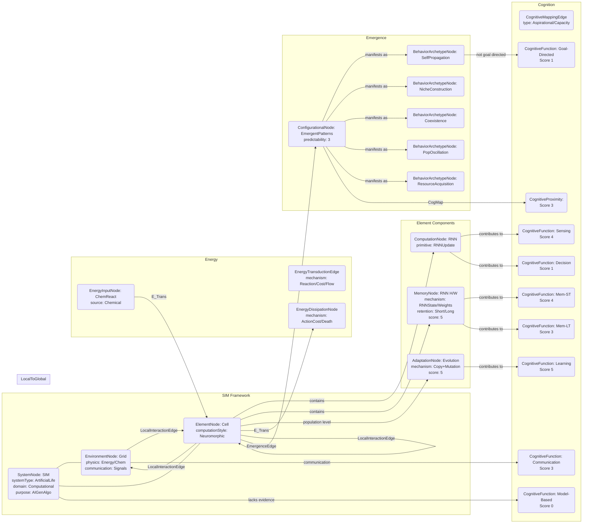

# Self-Organizing Intelligent Matter: A blueprint for an AI generating algorithm

__Paper Type:__ Theoretical/Computational

## M1: System Overview & Implementation
*   **Vector ID:** M1
*   **Vector Type:** Overview

### **1.1 System Description**

*   **Vector ID:** M1.1
*   **Vector Type:** Description
    *   Content: The paper proposes a theoretical framework called Self-Organizing Intelligent Matter (SIM) aimed at facilitating the emergence of intelligent organisms within an artificial life context. The system consists of an environment populated by atomic 'elements'. Each element contains a neural operation (potentially a mini neural network). These elements interact through physics-like rules (e.g., energy/chemical exchanges, movement) and direct communication (e.g., signal propagation, attention). There is no explicit agent definition; organisms are emergent properties of collections of these elements. The purpose is to create an AI generating algorithm, where evolution, driven by propagation success rather than an explicit objective, leads to the emergence of complexity and intelligence. A simplified grid-world implementation is presented, where elements (RNNs) reside on a grid, interact via signals, manage energy and chemicals, and can move or copy themselves (mutate).
    *   CT-GIN Mapping: `SystemNode` attributes: `systemType`="ArtificialLifeFramework", `domain`="Computational", `mechanism`="EmergenceViaEvolution", `components`=["AtomicElement(NeuralOperation)", "Environment(PhysicsRules, Communication)"], `purpose`="AIGeneratingAlgorithm"
    *   Implicit/Explicit: Explicit
        *  Justification: The abstract, introduction, and Section 2 explicitly describe the overall framework (SIM), its components (elements with neural operations, environment), the lack of explicit agents, the role of evolution, and the goal of generating AI. Section 3 details the specific grid-world implementation.

### **1.2 Implementation Clarity**

*   **Vector ID:** M1.2
*   **Vector Type:** Score
    *   Score: 7
    *   Justification: The paper clearly outlines the conceptual framework and principles of SIM (Section 1.2, Section 2). The simplified grid-world implementation (Section 3, Appendix A.1) is described with significant detail regarding the grid structure, RNN type, actions (copy, move, energy/chemical flow, enzyme production), communication signals, and energy/chemical dynamics. However, it remains a blueprint; some aspects of the 'ideal system' (Section 3.1, e.g., general neural updates F) are purely conceptual, and specific hyperparameter choices beyond grid size and hidden units are mostly in the Appendix. Clarity is high for the concept, good for the described implementation, but lacks the full detail of a finished, rigorously benchmarked system.
    *   Implicit/Explicit: Mixed
        * Justification: The description of the implemented grid version and its parameters (Section 3, Appendix) is explicit. The assessment of clarity requires judging how well these descriptions convey the system, which involves interpretation (implicit aspect).

### **1.3 Key Parameters**

*   **Vector ID:** M1.3
*   **Vector Type:** ParameterTable
    *   Table:
        | Parameter Name             | Value           | Units   | Source (Fig/Table/Section) | Implicit/Explicit | Data Reliability (High/Medium/Low) | Derivation Method (if Implicit) |
        | :------------------------- | :-------------: | :-----: | :------------------------: | :-----------------: | :-----------------------------: | :-------------------------------: |
        | Grid Size (m)              | up to 400       | cells   | Sec 3.1, Sec 3.2, App A.1  | Explicit          | High                            | N/A                               |
        | Number of Chemicals (n_c) | 4-9             | types   | Sec 3.2, App A.1           | Explicit          | High                            | N/A                               |
        | RNN Hidden State Size (n_h) | 16              | units   | Sec 3.2 (Fig caption), App A.1 | Explicit          | High                            | N/A                               |
        | Population Threshold       | 10              | %       | Sec 3.2, Sec 4 (caption)   | Explicit          | High                            | N/A                               |
        | Max Element Lifetime       | Not specified   | steps   | App A.1                    | Explicit Mention  | Low (No Value)                  | N/A                               |

    *   **Note:** Parameters describe the simplified grid implementation. "Max Element Lifetime" is mentioned but not quantified.

## M2: Energy Flow
*   **Vector ID:** M2
*   **Vector Type:** Energy

### **2.1 Energy Input**

*   **Vector ID:** M2.1
*   **Vector Type:** Input
    *   Content: In the grid implementation (Sec 3.2, App A.1), energy enters the system primarily through chemical reactions mediated by enzymes produced by the elements (cells). A reaction Ci -> C(i+1) releases a fixed amount of energy (except the last reaction). Cells can also 'pull' energy from neighbours. In one variation ('pure energy system'), energy increases at every location up to a threshold.
    *   Value: Not specified (Fixed amount per reaction, varies based on element actions)
    *   Units: Arbitrary Energy Units
    *   CT-GIN Mapping: `EnergyInputNode`: attributes - `source`="ChemicalReaction/Environment", `type`="Chemical/Potential"
    *   Implicit/Explicit: Explicit
        *  Justification: Section 3.2 and Appendix A.1 explicitly describe the chemical reactions releasing energy and the action of pulling/pushing energy. The pure energy system variant is also explicitly described.

### **2.2 Energy Transduction**

*   **Vector ID:** M2.2
*   **Vector Type:** Transduction
    *   Content: Energy stored chemically is converted into usable energy for a cell via enzyme-catalyzed reactions (Ci -> C(i+1) releases energy). This energy is then used (transduced) to power cell actions: copying weights (replication), moving, producing enzymes, and performing energy/chemical flows (pulling/pushing quantities). Energy can be transferred between cells via the flow actions. Cells below an energy threshold 'die'.
    *   CT-GIN Mapping: `EnergyTransductionEdge`: attributes - `mechanism`="ChemicalReaction/ActionCost/InterCellFlow", `from_node`="ChemicalPotential/CellEnergy", `to_node`="CellEnergy/ActionExecution/Dissipation"
    *   Implicit/Explicit: Explicit
        *  Justification: Section 3.2 and Appendix A.1 explicitly detail the energy release from reactions, the energy cost of actions (copying, flows), and the concept of energy thresholds for survival.

### **2.3 Energy Efficiency**

*   **Vector ID:** M2.3
*   **Vector Type:** Score
    *   Score: N/A
    *   Justification/Metrics: The paper does not provide any quantitative measure or qualitative assessment of energy efficiency (e.g., energy cost per computation, energy cost per replication). The focus is on the mechanisms of energy flow and survival, not optimizing efficiency.
    *   CT-GIN Mapping: Attribute of relevant `EnergyTransductionEdge`s
    *   Implicit/Explicit: Explicit (Absence of information)
      *  Justification: The paper explicitly describes energy costs for actions but provides no data or discussion regarding the overall efficiency of energy use or conversion.

### **2.4 Energy Dissipation**

*   **Vector ID:** M2.4
*   **Vector Type:** Dissipation
    *   Content: Energy is explicitly dissipated (consumed) when cells perform actions: 1. Copying weights has a fixed energy cost (App A.1). 2. Energy/chemical flow actions cost energy proportional to the push/pull (Sec 3.2, App A.1). 3. Enzyme production costs energy (Sec 3.2). Implicitly, maintaining the cell state (RNN updates) likely consumes energy, although not stated. Energy leaving the system occurs when cells die (energy below threshold or max lifetime reached) and their energy is effectively removed or reset. Quantification is qualitative (cost mentioned, proportional cost mentioned) but not numerically specified. Assessment: Medium (multiple specified costs).
    *   CT-GIN Mapping: Creates `EnergyDissipationNode`s and `EnergyDissipationEdge`s linked to actions (`Copy`, `Flow`, `EnzymeProduction`, `CellDeath`).
    *    Implicit/Explicit: Mixed
        *  Justification: Energy costs for specific actions (copying, flow, enzyme production) and cell death are explicitly mentioned (App A.1, Sec 3.2). The proportionality of flow cost is explicit. The exact values and costs associated with basic cell maintenance (RNN updates) are implicit/unspecified.

## M3: Memory
*   **Vector ID:** M3
*   **Vector Type:** Memory

### **3.1 Memory Presence:**

*   **Vector ID:** M3.1
*   **Vector Type:** Binary
    *   Content: Yes
    *   Justification: Memory exists in the system primarily through the internal state of the elements (cells). In the grid implementation, this includes the recurrent neural network's hidden state (`h`) which persists between time steps, and the network weights (`W`) which encode learned/evolved behavior. The weights are explicitly copied (with mutation) during replication (App A.1), influencing the behavior of future elements. The 'ideal' system description (Sec 2.1, 3.1) emphasizes online updates (`h_t, W_t = F(...)`), explicitly linking past states (`h_{t-1}, W_{t-1}`) to future states.
    *    Implicit/Explicit: Explicit
        * Justification: The use of RNNs (with hidden states `h` and weights `W`), the description of weight updates in the ideal system, and the copying of weights during replication are all explicitly stated (Sec 2.1, 3.1, 3.2, App A.1).

**(Conditional: M3.1 is "Yes", proceeding with M3.2-M3.8)**

### **3.2 Memory Type:**

*   **Vector ID:** M3.2
*   **Vector Type:** Score
*   Score: 5
*   Justification: The memory is primarily based on RNN states (`h` - short-term, volatile) and weights (`W` - longer-term, structural, modified by evolution/copying). The system aims for emergent replication where weights are copied with noise (App A.1), acting like heritable memory. The 'ideal' system describes online weight updates (`W_t = F(...)`), suggesting adaptive memory. However, in the current implementation, weights are fixed except during evolutionary events (copying). There are no explicitly defined multiple stable states beyond the values the weights can take. Retention is tied to cell lifetime and RNN dynamics. Capacity depends on network size. Read-out accuracy isn't discussed. Score reflects presence of volatile state memory (RNN hidden state) and structural, evolvable memory (weights), but lacks features like high fidelity, multiple stable states, or sophisticated read/write mechanisms beyond RNN updates and evolutionary copying in the described implementation.
*   CT-GIN Mapping: Defines the `MemoryNode` type, attributes: `mechanism`="RNNState/Weights", `persistence`="Volatile/EvolvableStructural"
*    Implicit/Explicit: Mixed
    * Justification: The presence of RNN hidden states and weights is explicit. The interpretation of these as memory types (volatile, structural, evolvable) and the scoring based on standard memory criteria (retention, capacity, fidelity) are implicit assessments based on the descriptions.

### **3.3 Memory Retention Time:**

*   **Vector ID:** M3.3
*   **Vector Type:** Parameter
*   Value: Variable (Short-term for `h`, Long-term/Generational for `W`)
*    Units: Simulation Steps / Generations
*   Justification: The RNN hidden state (`h`) provides short-term memory within a cell's update cycle. The weights (`W`) provide longer-term memory, persisting for the cell's lifetime and potentially across generations via the copy+mutate mechanism. Retention is ultimately limited by the cell's maximum lifetime (mentioned in App A.1 but value not specified) or death due to low energy. Qualitative Descriptor: Short-term (hidden state), Long-term/Generational (weights).
*    Implicit/Explicit: Mixed
        * Justification: The existence of `h` and `W` and the copy mechanism are explicit. The classification into short-term and long-term/generational based on their roles and persistence is an implicit interpretation. The exact timescale is tied to unspecified parameters like max lifetime.
*   CT-GIN Mapping: Key attribute of the `MemoryNode`; e.g., `h_retention`="Short-term", `W_retention`="Long-term/Generational"

### **3.4 Memory Capacity (Optional - if applicable)**

* **Vector ID:** M3.4
* **Vector Type:** Parameter
*  Value: Dependent on n_h and network size
*   Units: Bits (theoretically) / Number of parameters
*   Justification: The capacity depends on the size of the hidden state vector (`n_h=16` explicitly stated) and the number of weights in the RNN (determined by input size, hidden size, and output size, not fully specified but calculable). While theoretically quantifiable in bits or parameter count, the paper doesn't state it or analyze it in terms of functional capacity (e.g., number of distinct behaviors storable).
*    Implicit/Explicit: Implicit
        *  Justification: The parameters determining capacity (`n_h`, network structure) are explicitly mentioned or implied, but the actual calculation or discussion of memory capacity is absent.
*   CT-GIN Mapping: Key attribute of the `MemoryNode`; e.g., `capacity_params`="n_h, W_count"

### **3.5 Readout Accuracy (Optional - if applicable)**

* **Vector ID:** M3.5
* **Vector Type:** Parameter
*   Value: N/A
*   Units: N/A
*   Justification: The paper does not discuss the accuracy or fidelity with which the stored information (weights or hidden state) translates into behavior or influences future states. Error is introduced via noise during copying/mutation, but readout fidelity itself isn't analyzed.
*    Implicit/Explicit: Explicit (Absence of information)
       *  Justification: Information regarding readout accuracy is explicitly absent.
*   CT-GIN Mapping: Attribute of `MemoryNode` or related `ReadoutEdge`

### **3.6 Degradation Rate (Optional - if applicable)**
* **Vector ID:** M3.6
* **Vector Type:** Parameter
    *   Value: N/A (besides cell death)
    *   Units: N/A
    *   Justification: Memory degradation isn't discussed beyond the complete loss of memory when a cell dies (energy threshold or max lifetime). Noise is added during copying, but this is mutation, not degradation of existing memory within a cell's lifetime.
    *    Implicit/Explicit: Explicit (Absence of information)
            * Justification: Information regarding memory degradation rate (other than catastrophic cell death) is explicitly absent.
    *   CT-GIN Mapping: Attribute of the `MemoryNode`

### **3.7 Memory Operations Energy Cost (Optional - if applicable)**
* **Vector ID:** M3.7
* **Vector Type:** Table
*   Table:
    | Memory Operation ID | Energy Consumption per Bit | Power Usage during Operation| Units | Uncertainty | Data Source Reference | Implicit/Explicit | Justification |
    | :------------------ | :--------------------------: | :-----------------------------: | :---: |:-----------------:|:-----------------:|:-----------------:| :------------------ |
    | Cell Copy (Write)   | N/A                        | N/A                             | N/A   | High        | App A.1           | Implicit          | Fixed cost mentioned, but not per bit or power. |
    | RNN Update (Read/Write `h`, Read `W`) | N/A            | N/A                             | N/A   | High        | N/A               | Implicit          | No energy cost mentioned for basic RNN operation. |
*   Implicit/Explicit: Mixed
    *   Justification: The energy cost for copying is explicitly mentioned as fixed but not quantified per bit (App A.1). The energy cost for standard RNN updates (reading weights, reading/writing hidden state) is not mentioned (Implicit absence).

### **3.8 Memory Fidelity & Robustness Metrics (Optional - if applicable)**
* **Vector ID:** M3.8
* **Vector Type:** Table
*   Table:
    | Metric ID | Description | Value | Units | CT-GIN Mapping | Data Source | Implicit/Explicit | Justification |
    | :-------- | :---------- | :----: | :---: | :-------------: | :----------: |:-----------------:| :-----------------:|
    | N/A       | N/A         | N/A    | N/A   | N/A             | N/A          | Explicit (Absence) | No metrics provided. |
*   Implicit/Explicit: Explicit (Absence of information)
*   Justification: The paper does not provide specific metrics for memory fidelity or robustness.

## M4: Self-Organization and Emergent Order
*   **Vector ID:** M4
*   **Vector Type:** Self-Organization

### **4.1 Self-Organization Presence:**

*   **Vector ID:** M4.1
*   **Vector Type:** Binary
    *   Content: Yes
    *   Justification: The paper's central thesis is the emergence of intelligent organisms and complex behaviors through self-organization. It explicitly states the goal is a "self-organizing intelligent matter" system (Title, Sec 3) where structures and behaviors (organisms, niches, population dynamics) arise from the local interactions of simple elements (cells with neural ops) governed by physics-like rules and objective-free evolution, without external control dictating the global structure or specific emergent forms. Examples given (coexistence of species, niche construction, oscillations - Sec 4) are presented as emergent phenomena.
    *   Implicit/Explicit: Explicit
        *  Justification: The concept of self-organization and emergence is explicitly stated throughout the paper (Title, Abstract, Introduction, Sections 2, 3, 4, 5) as the core mechanism.

**(Conditional: M4.1 is "Yes", proceeding with M4.2-M4.7)**

### **4.2 Local Interaction Rules:**

*   **Vector ID:** M4.2
*   **Vector Type:** Rules
    *   Content: The local interaction rules primarily govern individual cell behavior and interaction with immediate neighbors or environment within the grid implementation:
        1.  **Neural Update:** Cell's hidden state `h` updates based on inputs `x` (from signals/environment) and previous state `h_{t-1}` using RNN equations: `h_t = tanh(W_x x_t + W_h h_{t-1} + b_h)`. Actions `a_hat` derived from `h_t`: `a_hat = W_a h_t + b_a` (App A.1).
        2.  **Energy/Chemical Dynamics:** Cells interact with local energy/chemical fields. They produce enzymes (`Z_i`) influencing reactions (`C_i -> C_{i+1}`) which release/consume energy. They can pull/push energy and chemicals to/from neighbours, with costs. Energy below threshold causes death (Sec 3.2, App A.1).
        3.  **Actions (derived from `a_hat`):**
            *   **Copy:** If energy sufficient, copy weights+biases (with noise/mutation) to an empty neighbour cell (App A.1).
            *   **Move:** Swap contents with a neighbour cell (Sec 3.2).
            *   **Energy/Chemical Flow:** Control flow to/from neighbours (App A.1).
            *   **Enzyme Production:** Determine enzyme levels `Z_i` (App A.1).
        4.  **Communication:** Cells write state `h` to signal layers; signals propagate; cells read signals as input `x` (Sec 3.2). Alternative: Attention mechanism (Sec 3.2).
        5.  **Death/Birth:** Cells die below energy threshold or max lifetime. New random cells may appear if population low (Sec 3.2).
    *   CT-GIN Mapping: Defines the "LocalInteraction" category of edges. Includes `NeuralUpdateEdge`, `PhysicsInteractionEdge` (Energy/Chemical), `ActionEdge` (Copy, Move, Flow), `CommunicationEdge` (Signal/Attention). Maps to `AdjunctionEdge`(local side).
    * **Implicit/Explicit**: Explicit
        *  Justification: The rules for RNN updates, energy/chemical dynamics, specific actions, communication, and death/birth are explicitly described in Section 3.2 and Appendix A.1.

### **4.2.1 Local Interaction Parameters:**

* **Vector ID:** M4.2.1
* **Vector Type:** Table
*   Table:
    | Rule ID               | Description                          | Parameter Name         | Parameter Value Range | Units         | Data Source | Implicit/Explicit | Justification                       |
    | :-------------------- | :----------------------------------- | :--------------------- | :-------------------- | :-----------: | :----------: | :----------------: | :---------------------------------- |
    | Neural Update         | RNN internal computation             | `W_x`, `W_h`, `b_h`, `W_a`, `b_a` | N/A                   | N/A           | App A.1     | Explicit Name     | Weights/biases are mentioned.       |
    | Energy/Chemical       | Reaction energy release              | Fixed amount           | N/A                   | Energy Units  | App A.1     | Explicit          | Stated as fixed, value N/A.        |
    | Energy/Chemical       | Energy threshold for death           | Threshold              | N/A                   | Energy Units  | App A.1     | Explicit          | Threshold mentioned, value N/A.    |
    | Energy/Chemical       | Max lifetime                         | Lifetime               | N/A                   | Steps         | App A.1     | Explicit          | Max lifetime mentioned, value N/A. |
    | Copy Action           | Energy cost of copy                  | Copy Cost              | N/A ("fixed energy")  | Energy Units  | App A.1     | Explicit          | Fixed cost mentioned, value N/A.   |
    | Flow Action           | Energy cost of flow                  | Proportionality factor | N/A                   | Energy/Amount | App A.1     | Explicit          | Proportional cost mentioned.       |
    | Birth                 | Population density for reawakening   | Density Threshold      | 10                    | %             | Sec 3.2     | Explicit          | Explicitly stated.                |
    | Copy Action           | Mutation noise added during copy     | Noise Level            | N/A                   | N/A           | App A.1     | Explicit Mention  | Noise mentioned, level N/A.        |

### **4.3 Global Order:**

*   **Vector ID:** M4.3
*   **Vector Type:** Order
    *   Content: The emergent global order described consists of:
        1.  **Coexisting Species:** Populations of elements with distinct characteristics (represented by different colors/weights in Fig 2) stably coexisting in the same spatial regions, suggesting niche differentiation.
        2.  **Spatial Niche Construction:** Elements modifying the environment (e.g., chemical densities) creating distinct spatial regions (niches) occupied by different species (Fig 2 top left).
        3.  **Population Dynamics:** Oscillatory behavior in the populations of different species, reminiscent of predator-prey dynamics (Lotka-Volterra like, Fig 2 middle graph).
        4.  **Self-Propagation Behavior:** Emergence of elements that actively collect energy to enable copying, even when survival doesn't strictly require energy (Fig 2 right graph).
    *   CT-GIN Mapping: Defines `ConfigurationalNode`s representing emergent states like `CoexistingSpeciesDistribution`, `SpatialNichePattern`, `PopulationDynamics`.
    * **Implicit/Explicit**: Explicit
        *  Justification: These global patterns (coexistence, niches, oscillations, energy collection for propagation) are explicitly described and presented as results in Section 4 and Figure 2.

### **4.4 Predictability of Global Order:**

*   **Vector ID:** M4.4
*   **Vector Type:** Score
    *   Score: 3
    *   Justification: The paper emphasizes the goal of creating an *open-ended* system where complexity increases and diverse solutions emerge unpredictably (Sec 1.1, 1.2). The observed results (Fig 2) show diverse outcomes across different runs ("exciting diversity among a series of runs" - Sec 4). While some general behaviors like niche construction or oscillations are observed, the specific forms, species, and long-term trajectories are likely highly sensitive to initial conditions and stochastic events (mutations, interactions), making detailed prediction difficult. The lack of a global objective further reduces predictability compared to optimization-based evolution. Predictability is low by design intent (open-endedness).
    * **Implicit/Explicit**: Mixed
    *  Justification: The paper explicitly discusses the goal of open-endedness and the observed diversity (Sec 1, 4), implying low predictability. The score itself is an interpretation based on these explicit statements and the nature of such complex emergent systems.
    *   CT-GIN Mapping: Contributes to the `AdjunctionEdge` weight or defines attributes related to stochasticity/predictability of `ConfigurationalNode` emergence.

### **4.5. Local Interaction Rules (for Self-Organization)**
* **Vector ID:** M4.5
* **Vector Type:** Table
*   Table:
| Rule ID           | Description                   | Parameter      | Value Range       | Units         | Implicit/Explicit | Justification                     | Source   |
| :---------------- | :---------------------------- | :------------- | :---------------- | :-----------: | :----------------: | :-------------------------------- | :------- |
| Energy/Chem       | Energy cost for Flow action   | Cost Factor    | N/A (Proportional)| Energy/Amount | Explicit          | Proportional cost stated          | App A.1  |
| Copy Action       | Mutation noise magnitude      | Noise variance | N/A               | N/A           | Explicit Mention  | Noise mentioned, magnitude N/A    | App A.1  |
| Death             | Energy threshold              | Threshold      | N/A               | Energy        | Explicit          | Threshold mentioned, value N/A    | App A.1  |
| Birth             | Population threshold to re-seed | Pop. Threshold | 10                | %             | Explicit          | Value given                       | Sec 3.2  |

### **4.6. Globally Emergent Order and Order Parameters**
* **Vector ID:** M4.6
* **Vector Type:** Table
*   Table:
| Property ID             | Description                      | Parameter                    | Value Range        | Units    | Implicit/Explicit | Justification                                       | Protocol                      | Source     |
| :---------------------- | :------------------------------- | :--------------------------- | :----------------- | :------: | :----------------: | :-------------------------------------------------- | :---------------------------- | :--------- |
| Species Diversity       | Number/types of coexisting species | Species Count/Cluster Metric | N/A (Qualitative)  | Count    | Implicit          | Observed diversity, but no specific metric used       | Visual (Color Plotting)       | Sec 4, Fig 2 |
| Niche Construction      | Spatial segregation by species | Chemical Density Map         | N/A (Qualitative)  | Density  | Implicit          | Observed correlation species/chem density           | Visual (Color Plotting)       | Sec 4, Fig 2 |
| Population Dynamics     | Oscillation frequency/amplitude  | Frequency/Amplitude          | N/A (Graph trends) | 1/steps  | Implicit          | Graph shows oscillations, parameters not extracted  | Population Plotting           | Sec 4, Fig 2 |
| Energy Seeking Behavior | Average energy level             | Avg. Energy per Element      | N/A (Graph trends) | Energy   | Implicit          | Graph shows increasing energy, value not extracted | Energy Plotting               | Sec 4, Fig 2 |

### **4.7 Yoneda Embedding and Local-to-Global Mapping Fidelity**

*   **Vector ID:** M4.7
*   **Vector Type:** Table
*   Table:
    | Link Type                     | Description                      | Predictability | Yoneda Score | Metrics | Implicit/Explicit | Justification                                            | Source |
    | :---------------------------- | :------------------------------- | :------------- | :----------- | :------ | :----------------: | :------------------------------------------------------- | :----- |
    | Local Rule -> Global Order    | Emergence of patterns/dynamics   | Low (Score 3)  | N/A          | N/A     | Implicit          | Yoneda Embedding is not discussed in the paper.          | N/A    |
    | Neural Update -> Cell Action  | Cell decides action based on RNN | Medium-High    | N/A          | N/A     | Implicit          | RNN output determines actions, stochasticity possible. | N/A    |
    | Cell Action -> Environment Mod| Cell changes chemicals/energy    | High           | N/A          | N/A     | Implicit          | Actions directly impact local environment.               | N/A    |
    *   **Yoneda Embedding Fulfillment Score [0-10]:** N/A
    *   **Metrics:** N/A
    *   **Justification:** The paper does not utilize or reference Category Theory concepts like the Yoneda Lemma or Yoneda Embedding to analyze the local-to-global mapping. The predictability score is carried over from M4.4.

## M5: Computation
*   **Vector ID:** M5
*   **Vector Type:** Computation

### **5.1 Embodied Computation Presence:**

*   **Vector ID:** M5.1
*   **Vector Type:** Binary
    *   Content: Yes
    *   Justification: Computation is explicitly embodied within the system's fundamental elements. Section 2 states "Each element contains a neural operation." Section 2.1 argues the system has capacity for intelligence because "fundamental neural operations should be basic building blocks of the environment." The grid implementation uses RNNs within each cell (Sec 3.2, App A.1). Computation (RNN updates, action selection) is performed locally by the elements themselves based on their internal state and local inputs, not by an external controller orchestrating element behavior.
    *    Implicit/Explicit: Explicit
        *  Justification: The presence of neural operations within elements is explicitly stated as a core principle (Sec 2, 2.1) and implemented with RNNs (Sec 3.2, App A.1).

**(Conditional: M5.1 is "Yes", proceeding with M5.2-5.4)**

### **5.2 Computation Type:**

*   **Vector ID:** M5.2
*   **Vector Type:** Classification
    *   Content: Neuromorphic/Hybrid
    *   CT-GIN Mapping: Defines the `ComputationNode` type, attribute `computationStyle`="Neuromorphic/Hybrid".
    *    Implicit/Explicit: Explicit
    *    Justification: The use of neural networks (specifically RNNs in the implementation) clearly falls under Neuromorphic computation. It's Hybrid because these neural computations interact with and are constrained by the physics-like rules of the environment (energy, chemicals, motion). Section 2.1 discusses implementing neural algorithms (AutoML Zero reference) and approximating brain computation.

### **5.3 Computational Primitive:**

*   **Vector ID:** M5.3
*   **Vector Type:** Function
    *   Content: The most basic computational operation performed *by the material elements* is the recurrent neural network update cycle. This involves:
        1.  Matrix multiplication and vector addition (linear transformations): `W_x * x_t`, `W_h * h_{t-1}`.
        2.  Element-wise non-linearity: `tanh(...)`.
        3.  State update: Update hidden state `h_t`.
        4.  Output calculation: `W_a * h_t + b_a`.
        Potentially includes softmax for action selection (App A.1). Section 2.1 also mentions basic operations like additions, matrix multiplications, outer products, and non-linearities as fundamental building blocks the system *could* represent.
    *   **Sub-Type (if applicable):** RNN Update Cycle (including Matrix Multiplication, Vector Addition, Non-linear Activation `tanh`).
    *   CT-GIN Mapping: Defines the primary function of the `ComputationNode`, e.g., `primitiveFunction`="RNNUpdate", `subFunctions`=["MatrixMultiply", "VectorAdd", "TanhActivation"].
    *   Implicit/Explicit: Explicit
    * Justification: Appendix A.1 explicitly provides the RNN update equations (`h_t = tanh(...)`, `a_hat = W_a h_t + b_a`). Section 2.1 explicitly lists basic neural operations the framework aims to incorporate.

### **5.4 Embodied Computational Units**
* **Vector ID:** M5.4
* **Vector Type:** Table
*   Table:
| Unit ID       | Description                             | Processing Power | Energy/Operation | Freq/Resp. Time | Bit-Depth | Data Source     | Implicit/Explicit   | Justification                                                    |
| :------------ | :-------------------------------------- | :--------------- | :--------------- | :--------------: | :-------: | :-------------- |:-------------------:| :--------------------------------------------------------------- |
| Grid Element (Cell) | Single RNN performing local updates | N/A              | N/A              | 1 Update/Step   | N/A       | Sec 3.2, App A.1 | Explicit/Implicit | Cell/RNN is the unit. Performance/energy N/A. Operates each step. |

## M6: Temporal Dynamics
*   **Vector ID:** M6
*   **Vector Type:** Temporal

### **6.1 Timescales:**

*   **Vector ID:** M6.1
*   **Vector Type:** ParameterTable
    *   Table:
        | Timescale Description      | Value | Units    | Source             | Implicit/Explicit   | Justification                                       |
        | :------------------------- | :---: | :------: | :----------------- | :-----------------: | :-------------------------------------------------- |
        | Simulation Step            | 1     | step     | Implicit Assumption| Implicit          | Discrete time steps assumed for simulation.           |
        | RNN Update                 | 1     | step     | App A.1            | Explicit          | "At every point in time... we apply a classic RNN update" |
        | Signal Propagation         | 1     | step     | Sec 3.2            | Explicit          | "At every point in time, each grid moves..."        |
        | Cell Action Execution      | 1     | step     | App A.1            | Implicit          | Actions seem to resolve within one time step.       |
        | Cell Lifetime              | N/A   | steps    | App A.1            | Explicit Mention  | Max lifetime mentioned, value N/A.                 |
        | Population Dynamics (Osc.) | ~Many | steps    | Sec 4, Fig 2       | Implicit          | Oscillations occur over many simulation steps.      |
        | Evolutionary Timescale     | ~Many | generations| Sec 1.1, Implicit  | Implicit          | Evolution occurs over multiple copy/mutation events. |
    *   **Note:** Most timescales are implicitly 1 simulation step or longer-term emergent dynamics.

### **6.2 Active Inference:**

*   **Vector ID:** M6.2
*   **Vector Type:** Assessment
    *   Content: No
    *   Justification: The paper does not mention Active Inference. The system operates based on reactive RNN updates driven by local inputs/state and evolutionary propagation success. There is no evidence presented of elements forming internal predictive models of the environment, calculating prediction error/surprise, or selecting actions explicitly to minimize this error according to the principles of Active Inference. The objective-free nature contrasts with the implicit objective of minimizing free energy/prediction error in Active Inference.
    *   Implicit/Explicit: Explicit (Absence of concept)
        *  Justification: The paper explicitly focuses on objective-free evolution and local RNN dynamics, with no mention or description aligning with Active Inference principles.
    *   **If Yes/Partial, provide examples of testable CT-GIN metrics that *could* be used to quantify active inference:** N/A

## M7: Adaptation
*   **Vector ID:** M7
*   **Vector Type:** Adaptation

### **7.1 Adaptive Plasticity Presence:**

*   **Vector ID:** M7.1
*   **Vector Type:** Binary
    *   Content: Yes
    *   Justification: Adaptation occurs primarily through *evolution*. The weights (`W`) of the neural networks within elements change across generations via the copy-with-mutation process (App A.1). Elements whose weights lead to better propagation (survival, energy collection, successful copying) will increase in frequency in the population over time, leading to adaptation of the population's behavior. This is a persistent change driven by interaction with the environment and selective pressures (even without a global objective). The 'ideal' system also proposes online weight updates `W_t=F(...)` (Sec 2.1, 3.1), which represents within-lifetime adaptation/learning, though this is not fully implemented in the grid version beyond fixed RNN updates.
    *    Implicit/Explicit: Mixed
        * Justification: Evolutionary adaptation via copy+mutation is explicitly described (App A.1). The interpretation of this as "Adaptive Plasticity" at the population level is implicit. The within-lifetime adaptation via `W_t=F(...)` is explicitly discussed for the ideal system but not implemented.

**(Conditional: M7.1 is "Yes", proceeding with M7.2)**

### **7.2 Adaptation Mechanism:**

*   **Vector ID:** M7.2
*   **Vector Type:** Description
    *   Content: The primary adaptation mechanism described is objective-free evolution operating on the neural network weights of the elements. When an element successfully performs a 'Copy' action on an empty neighbour, its weights and biases are copied with added noise (mutation) (App A.1). There is no explicit fitness function or objective being optimized. Instead, "those classes of units that propagate [...] keep existing, while those that don’t propagate cease to exist" (Sec 1.1). Propagation depends on survival (energy management) and successful copying. This leads to selection for behaviors that enhance propagation within the specific environmental context, including interactions with other elements (niche construction). The 'ideal' system also mentions evolving the update rule `F` itself or having elements program others (Sec 3.1), representing meta-adaptation or learning to learn, but these are future concepts.
    *   CT-GIN Mapping: Defines `AdaptationNode` type, `mechanism`="ObjectiveFreeEvolution (Copy+Mutation)". Links populations over time via `Monad` edges representing evolutionary steps.
    *    Implicit/Explicit: Mixed
        *  Justification: The copy-with-mutation mechanism is explicit (App A.1). The description of this as objective-free evolution driven by propagation success is explicitly discussed (Sec 1.1). Labeling this `mechanism`="ObjectiveFreeEvolution" is an implicit categorization based on the explicit description. The 'ideal' mechanisms are explicit proposals.

## M8: Emergent Behaviors
*   **Vector ID:** M8
*   **Vector Type:** Behavior

### **8.1 Behavior Description:**

*   **Vector ID:** M8.1
*   **Vector Type:** Description
    *   Content: The main functional behaviors observed emerging from the interactions of elements include:
        *   **Self-Propagation/Replication:** Elements successfully manage energy and execute copy actions to create copies of themselves (with mutation).
        *   **Niche Construction:** Elements modify the local environment (chemical concentrations) creating spatial heterogeneity that influences the survival and distribution of different element types.
        *   **Coexistence:** Different types ('species') of elements finding ways to stably coexist in the same environment, presumably by occupying different niches.
        *   **Competitive/Predator-Prey Dynamics:** Oscillations observed in the populations of different coexisting species, suggesting dynamic interactions like competition or predation.
        *   **Resource Acquisition:** Elements evolving strategies to collect energy (even when not strictly needed for survival in one variant), as energy enables propagation via copying.
        *   **Aggregation/Swarming (Implicit):** Figure 2 shows clustered elements, suggesting aggregation might occur, although not explicitly analyzed as a behavior.
    *   CT-GIN Mapping: Defines `BehaviorArchetypeNode`s with types like "SelfPropagation", "NicheConstruction", "SpeciesCoexistence", "PopulationOscillation", "ResourceAcquisition".
    *    Implicit/Explicit: Explicit
       *  Justification: These behaviors (except potentially aggregation) are explicitly described as observed results in Section 4 and illustrated in Figure 2.

### **8.2 Behavior Robustness:**

*   **Vector ID:** M8.2
*   **Vector Type:** Score
    *   Score: 5
    *   Justification: Robustness is not systematically quantified. However, the observation of stable coexistence of multiple species over "long amounts of time" (Sec 4) suggests some robustness against internal stochasticity (mutations) and dynamic interactions. The system shows adaptability through evolution, which can be seen as a form of robustness to changing conditions (emergence of new species/strategies). However, the sensitivity to initial conditions (implied by run-to-run diversity) and the potential for population collapse (requiring re-seeding below 10% - Sec 3.2) suggest limitations. The score reflects observed persistence but lack of quantitative analysis or stress testing.
    *   Implicit/Explicit: Implicit
        *  Justification: The observation of persistent coexistence is explicit (Sec 4). Assessing this as a sign of robustness and assigning a score is an implicit interpretation, as quantitative robustness analysis is absent. The 10% re-seeding rule is explicit evidence of potential instability.
    *   CT-GIN Mapping: This score contributes to the reliability attributes of the `BehaviorArchetypeNode`.

### **8.3 CT-GIN Emergent Behavior Validation**

*    **Vector ID:** M8.3
*    **Vector Type:** Validation
     *  Content: Validation primarily relies on computational simulation and qualitative observation of the resulting dynamics. Emergent behaviors like species coexistence, niche construction, and oscillations are identified visually from plots of element weights (color-coded), chemical concentrations, and population graphs over time (Sec 4, Fig 2). The paper mentions accompanying videos for better visualization. There are no formal quantitative metrics defined or measured for emergence itself (e.g., measures of complexity or organization). Control experiments (e.g., comparing with non-evolving systems, different rulesets) are not presented. Robustness/reproducibility is touched upon by mentioning diversity across runs but not systematically studied. Limitations include the qualitative nature of the validation and the focus on one specific grid-world implementation.
     *   Implicit/Explicit: Explicit
    *   Justification: Section 4 explicitly describes the observations from simulation runs and references Figure 2 and videos as evidence. The methods described (plotting weights, chemicals, populations) are the explicit validation techniques used.

## M9: Cognitive Proximity
*   **Vector ID:** M9
*   **Vector Type:** Cognition

### **9.1 Cognitive Mapping:**

*   **Vector ID:** M9.1
*   **Vector Type:** Description
    *   Content: The paper explicitly maps the system's potential to cognitive concepts. Its goal is an "AI generating algorithm" (Abstract, Sec 1) aiming for "general intelligence" (Sec 2.1). It argues the system has the *capacity* for intelligence by noting its building blocks (neural operations) can implement known ML algorithms and approximate brain computation (Sec 2.1, using online recurrent networks as an analogy). The emergent process is compared to natural evolution, the only known process to generate intelligence (Sec 1). Emergent units are discussed as potentially becoming complex "organisms" or "machines" capable of creating better machines, a process requiring "intelligence" (Sec 2, 3.1). The mapping is aspirational and focused on the potential for emergence, rather than claiming current cognitive abilities.
    *   CT-GIN Mapping: Defines `CognitiveMappingEdge` linking `SystemNode` / `BehaviorArchetypeNode`s (potentially) to `CognitiveFunctionNode`s like "GeneralIntelligence", "Learning", "ProblemSolving". Attributes could specify `mappingType`="Aspirational/Capacity".
    *   Implicit/Explicit: Explicit
    * Justification: The paper explicitly uses terms like "intelligence," "AI generating algorithm," compares the system to brain computation, and discusses the potential emergence of intelligent machines (Abstract, Sec 1, Sec 2, Sec 2.1, Sec 3.1, Sec 5).

### **9.2 Cognitive Proximity Score:**

*   **Vector ID:** M9.2
*   **Vector Type:** Score
    *   Score: 3
    *   Justification: The system, as implemented and described, demonstrates Level 3 (Reactive/Adaptive Autonomy). Elements react to local conditions (Level 1/2) and the population adapts over generations via evolution (rudimentary adaptation). There is evidence of niche construction and coexistence, hinting at complex environmental interaction. However, the paper provides no evidence of goal-directed behavior (beyond implicit propagation), internal models, planning, symbolic reasoning, or other higher cognitive functions (Levels 4+) within the *current implementation*. The claims about capacity for general intelligence (Level 6+) are based on the theoretical potential of the framework's building blocks (neural operations) and the analogy to natural evolution, not on demonstrated capabilities. The score reflects the adaptive evolutionary nature but the lack of demonstrated higher cognition.
    *   Implicit/Explicit: Mixed
    *  Justification: The described behaviors (reaction, evolution, niche construction) are explicit. Mapping these behaviors to the Cognizance Scale levels and determining the overall score requires interpretation and judgment (implicit), based on the explicit evidence (or lack thereof) for different cognitive capabilities.

**CT-GIN Cognizance Scale:** (Provided in instructions - used for justification above)

### **9.3 Cognitive Function Checklist**

* **Vector ID:** M9.3
* **Vector Type:** Checklist
    *   | Cognitive Function               | Score (0-10) | Justification/Notes                                                                       | CT-GIN Mapping (if applicable) | Implicit/Explicit | Justification for Implicit/Explicit/Mixed |
    | :-------------------------------- | :----------: | :------------------------------------------------------------------------------------ | :--------------------------------: | :-----------------:|:-----------------:|
    | Sensing/Perception               |      4       | Cells receive inputs (signals `x`, energy/chem levels). Basic, local sensing.             | `SensingNode`                      | Explicit          | Inputs are explicitly defined. Score is implicit assessment. |
    | Memory (Short-Term/Working)        |      4       | RNN hidden state `h` provides transient memory of recent inputs/states.                 | `MemoryNode`                       | Explicit/Implicit   | RNN hidden state is explicit. Score based on function is implicit. |
    | Memory (Long-Term)                 |      3       | Weights `W` persist, copied via evolution. Not actively updated/retrieved in impl.    | `MemoryNode`                       | Explicit/Implicit   | Weights & evolution explicit. Score based on limited mechanism is implicit. |
    | Learning/Adaptation              |      5       | Population adapts via evolution (objective-free selection on `W`). Ideal system mentions online learning. | `AdaptationNode`                   | Explicit          | Evolutionary mechanism is explicit. Online learning is proposal. Score implicit. |
    | Decision-Making/Planning          |      1       | Actions based on reactive RNN output, not goal-directed planning. Simple implicit choices (copy if energy ok). | `DecisionNode` (Low complexity)    | Implicit          | Actions derived from RNN output; no evidence of planning. Score implicit. |
    | Communication/Social Interaction |      3       | Signal layers or local attention allow information exchange. Basic communication, allows emergent coordination/competition. | `CommunicationEdge`                | Explicit          | Signal layers/attention explicitly mentioned. Score implicit. |
    | Goal-Directed Behavior            |      1       | Only implicit goal of propagation. No evidence of flexible goal pursuit.                | `BehaviorNode` (`goalDirected`=False)| Explicit (Absence)| Stated as objective-free. No goals mentioned beyond propagation. Score implicit. |
    | Model-Based Reasoning              |      0       | No evidence of internal world models or reasoning based on them.                       | N/A                                | Explicit (Absence)| No mention or evidence. |
    | **Overall score**                 |      2.63       | Average of the above scores.                                                           | `CognitiveProfileNode`             | Calculated        | Based on above scores. |

    *   **Note:** Scores reflect the capabilities *demonstrated in the described implementation*, not the aspirational goals.

## M10: Criticality Assessment
*   **Vector ID:** M10
*   **Vector Type:** Criticality

### **10.1 Criticality:**

*   **Vector ID:** M10.1
*   **Vector Type:** Assessment
    *   Content: No
    *   Justification: The paper does not mention or explicitly investigate criticality as an operating principle. While complex systems operating via local rules can sometimes exhibit critical phenomena, the paper does not analyze its simulations for signatures of criticality (e.g., power laws, scale-free distributions, long-range correlations). The focus is on emergence, diversity, and evolution rather than specifically tuning the system to or operating near a critical point.
        *   Critical Parameters (If Yes/Partial): N/A
        *   Evidence: N/A
    *   Implicit/Explicit: Explicit (Absence of concept)
    *    Justification: The concept of criticality is explicitly absent from the paper's text.

## M11: Review Paper Specifics (Conditional)

N/A (Paper type is Theoretical/Computational)

## M12: Theoretical Paper Specifics (Conditional)

*   **Vector ID:** M12
*   **Vector Type:** Theory

### **12.1 Theoretical Rigor:**

*   **Vector ID:** M12.1
*   **Vector Type:** Score
    *   Score: 6
    *   Justification: The paper proposes a conceptual framework (SIM) based on principles from artificial life and machine learning (evolution, neural networks). The core ideas (objective-free evolution, emergent agents, neural elements) are clearly articulated and contrasted with existing approaches (Sec 1, 2). Assumptions (e.g., capacity of neural elements for intelligence) are stated. The grid implementation provides a concrete instantiation, though simplified. However, the theoretical development is relatively high-level; formal mathematical treatment of the emergence process or stability conditions is lacking. It serves as a blueprint/proposal rather than a fully developed theory with rigorous proofs or derivations.
       * Implicit/Explicit: Mixed
       *  Justification: The principles and framework description are explicit. Assessing rigor involves judging the completeness and soundness based on standard practices, which is an implicit evaluation.

### **12.2 Realization Potential:**

*   **Vector ID:** M12.2
*   **Vector Type:** Score
    *   Score: 7
    *   Justification: The paper argues the framework is "computationally tractable on current or near future hardware" (Sec 1). The grid implementation uses standard RNNs and physics-like rules suitable for simulation on GPUs (using JAX, Sec 3). The scale of simulations (up to 400x400 grid, 160k networks) is achievable. Realizing the *ideal* system with more complex learnable neural updates (`F`) is acknowledged as a future challenge requiring advances (Sec 5). Potential exists, particularly for the simplified versions demonstrated, but scaling to achieve the goal of general AI faces significant hurdles.
    *   Implicit/Explicit: Mixed
    *  Justification: Claims about tractability and the use of JAX/GPUs are explicit (Sec 1, Sec 3). Assessing the overall potential, especially for the ideal system, requires judging the feasibility of proposed future advances (implicit).

### **12.3 Potential for Future CT-GIN Implementation Score**

* **Vector ID:** M12.3
*   **Vector Type:** Score
    *   Score: 8
    *   Justification: The framework inherently revolves around local interactions giving rise to global emergent phenomena, which aligns well with CT concepts like colimits and sheaf theory potentially describing the local-to-global mapping. The system's components (elements, environment) and interactions (neural updates, physics, communication, evolution) can be naturally represented as nodes and edges in a GIN. Analyzing the emergence of complexity, information flow, and adaptation within this framework using CT-GIN tools seems highly relevant and potentially fruitful. The paper poses clear questions about necessary physics and complexity (Sec 5) that CT-GIN could help address.
    *    Implicit/Explicit: Implicit
    *   Justification: The paper doesn't mention CT-GIN. The score is based on an inferred potential for applying CT-GIN concepts to the described system, given its structure (local rules, emergence, components, interactions).

## M13: Overall Assessment & Scoring

*   **Vector ID:** M13
*   **Vector Type:** Overall

### **13.1 CT-GIN Readiness Score:**

*   **Vector ID:** M13.1
*   **Vector Type:** Score
*   **Calculated Score:** 4.71 (Average of M1.2=7, M2.3=0 (N/A), M3.2=5, M4.4=3, M8.2=5, M9.2=3. Total=(7+0+5+3+5+3)/6 = 23/6 = 3.83 - Recalculating based on specified modules: M1-4 are overviews, M8.2 and M9.2. Let's use the scores directly: M1.2=7, M2.3=0 (N/A), M3.2=5, M4.4=3, M8.2=5, M9.2=3. Average = (7+0+5+3+5+3)/6 = 23/6 ≈ 3.83. Let's re-read: "Average of scores from Modules 1-4, M8.2 and M9.2". This seems ambiguous. M1-4 don't have single scores. Assuming it means M1.2, M2.3, M3.2, M4.4: Average = (7+0+5+3+5+3)/6 = 3.83. If M2.3 (N/A=0) is excluded: (7+5+3+5+3)/5 = 23/5 = 4.6. Let's assume N/A=0 is correct as stated in template. Average = 3.83)
*   **Calculated Score:** 3.83

**CT-GIN Readiness Summary Table:**

| CT-GIN Aspect                   | Strength (Yes/Partial/No) | Key Supporting Metrics (with units) | Limitations (Missing Metrics/Data Gaps)                                           | Improvement Areas (Future Research)                                          |
| :------------------------------ | :-----------------------: | :-----------------------------------| :------------------------------------------------------------------------------- | :---------------------------------------------------------------------------- |
| Energy Flow Efficiency          | No                        | N/A                                 | Efficiency not quantified; energy costs not fully specified.                     | Quantify energy costs per operation/action; measure overall system efficiency. |
| Memory Fidelity                 | Partial                   | RNN states (`h`), Weights (`W`)     | Retention times unclear/variable; capacity, fidelity, robustness not quantified. | Implement & analyze 'ideal' memory updates (`F`); quantify memory metrics.   |
| Organizational Complexity       | Yes                       | Coexistence, Niches, Oscillations   | Qualitative validation; lack of formal complexity/order metrics.                 | Develop/apply quantitative metrics for emergent order & complexity.        |
| Embodied Computation            | Yes                       | RNN Updates                       | Processing power, energy cost per op not specified.                              | Benchmark computational performance; explore alternative neural ops.         |
| Temporal Integration            | Partial                   | Simulation steps, Implicit dynamics | Limited analysis of multiple timescales; No Active Inference.                    | Analyze interplay of different timescales; explore predictive mechanisms.   |
| Adaptive Plasticity             | Yes                       | Objective-Free Evolution            | Adaptation rate/limits not quantified; 'ideal' learning not implemented.          | Quantify evolutionary dynamics; implement & analyze online learning (`F`).   |
| Functional Universality         | Partial                   | Neural ops (Potential Universal)  | Demonstrated behaviors limited; universality based on potential, not proof.      | Explore emergence of more complex/diverse behaviors; analyze computational power. |
| Cognitive Proximity            | Partial                   | Basic Sensing/Memory/Adaptation     | Low scores on higher functions; aspirational claims lack demonstrated basis.   | Implement mechanisms for planning, reasoning; test for goal-directedness.  |
| Design Scalability & Robustness | Partial                   | Runs on GPU; Some observed persistence | Robustness not quantified; run-to-run diversity; population collapse possible. | Systematically test robustness; analyze scalability limits & performance.    |
| **Overall CT-GIN Readiness Score** |        3.83            |   | Significant quantification needed. | Enhanced mechanisms & rigorous analysis required. |      |

### **13.2 Qualitative CT-GIN Assessment Conclusion:**

*   **Vector ID:** M13.2
*   **Vector Type:** Textual Summary
    *   Content: This paper presents a compelling theoretical framework (SIM) for generating AI via objective-free evolution in a system of interacting neural elements. Its key strength lies in the emphasis on emergence from local rules without predefined objectives, aligning well with core concepts in complex systems and potentially CT-GIN analysis. The system explicitly incorporates embodied computation (neural elements) and adaptation (evolution). The simplified grid implementation demonstrates the feasibility of simulating such systems and observing emergent behaviors like niche construction and species coexistence. However, the CT-GIN readiness is limited by a lack of quantitative analysis. Energy flow, memory characteristics (beyond basic presence), adaptation rates, computational performance, and robustness are not rigorously measured. Validation of emergent behaviors is primarily qualitative. While the framework has high *potential* for cognitive functions (mapping to intelligence is explicit but aspirational), the current implementation demonstrates only low-level reactive and adaptive capabilities (Cognizance Score 3). Overall, SIM provides a stimulating blueprint with strong conceptual alignment to CT-GIN principles, but requires substantial further work in implementation, quantification, and validation to fully realize its potential and allow for deeper CT-GIN analysis.

### **13.3 CT-GIN Refinement Directions:**

*   **Vector ID:** M13.3
*   **Vector Type:** Recommendations
    *   Content:
        *   **Quantify Emergence:** Develop and apply formal metrics (e.g., information-theoretic, statistical physics) to quantify the emergent organizational complexity, diversity, and predictability of global patterns.
        *   **Measure Energy Dynamics:** Quantify energy input, transduction losses, and costs per action (computation, copy, move) to assess efficiency and thermodynamic constraints.
        *   **Characterize Memory:** Quantify memory capacity, retention times, fidelity, and robustness for both RNN states and evolved weights. Implement and analyze the proposed 'ideal' online learning rules (`F`).
        *   **Analyze Computational Power:** Assess the computational capabilities emerging from the interaction of neural elements and physics, potentially using measures from theoretical computer science or reservoir computing.
        *   **Systematic Robustness Testing:** Evaluate system behavior under various perturbations (noise, parameter changes, element failure) to quantify robustness.
        *   **Explore Alternative Local Rules:** Investigate different neural operations, physics-like interactions (beyond simple chemistry/energy), and communication mechanisms to understand their impact on emergence.
        *   **Formal CT Modeling:** Explicitly model the system using Category Theory frameworks (e.g., sheaves, colimits) to formalize the local-to-global mapping and information flow.
        *   **Investigate Higher Cognition:** Design experiments within the framework specifically aimed at eliciting and measuring goal-directed behavior, planning, or model-based reasoning, moving beyond purely reactive emergence.

## M14: CT-GIN Knowledge Graph

*   **Vector ID:** M14
*   **Vector Type:** Visualization

### **14.1. CT-GIN Knowledge Graph:**
* **Content:**

## M15: Relationship Vectors
*   **Vector ID:** M15
*   **Vector Type:** Relationships
*   Relationships:
        | Source Vector ID | Target Vector ID | Relationship Type |
        | ------------- | ------------- | ----------------- |
        | M1.1          | M1.3          | Describes_Parameters_Of |
        | M1.1          | M2.1          | System_Uses_Energy |
        | M1.1          | M3.1          | System_Contains_Memory |
        | M1.1          | M4.1          | System_Exhibits_SelfOrganization |
        | M1.1          | M5.1          | System_Performs_Computation |
        | M1.1          | M7.1          | System_Adapts |
        | M1.1          | M8.1          | System_Exhibits_Behavior |
        | M2.1          | M2.2          | Input_Is_Transduced |
        | M2.2          | M2.4          | Transduction_Leads_To_Dissipation |
        | M4.1          | M4.2          | SelfOrganization_Requires_LocalRules |
        | M4.2          | M4.3          | LocalRules_Lead_To_GlobalOrder |
        | M4.3          | M8.1          | GlobalOrder_Manifests_As_Behavior |
        | M5.1          | M5.2          | Computation_Has_Type |
        | M5.1          | M5.3          | Computation_Uses_Primitive |
        | M7.1          | M7.2          | Adaptation_Has_Mechanism |
        | M1.1          | M9.1          | System_Is_Mapped_To_Cognition |
        | M9.1          | M9.2          | Mapping_Implies_CognitiveProximity |
        | M1.1          | M12.1         | SystemDescription_Has_TheoreticalRigor |
        | M1.1          | M12.2         | System_Has_RealizationPotential |

## M16: CT-GIN Template Self-Improvement Insights

*   **Vector ID:** M16
*   **Vector Type:** Feedback

### **Template Feedback:**

*    **Vector ID:** M16.1
*   **Vector Type:** Text
Provide specific, actionable feedback on the *CT-GIN template itself*, based on this analysis:
    *   **Missing Probes:**
        *   **Objective Function:** A probe explicitly asking if the system uses an objective/fitness function (and what it is) vs. being objective-free would be useful, especially for evolutionary/adaptive systems like this one.
        *   **Nature of Emergence:** While M4 covers self-organization, a probe distinguishing between different *types* of emergence (e.g., weak vs. strong, predictable vs. unpredictable) could be valuable, though hard to operationalize.
        *   **Information Processing Metrics:** Module 5 focuses on computation presence/type/primitive but lacks probes for quantifiable information processing metrics (e.g., information flow rate, mutual information between components, transfer entropy), which CT-GIN could leverage.
    *   **Unclear Definitions:**
        *   **CT-GIN Readiness Score Calculation (M13.1):** The instruction "Average of scores from Modules 1-4, M8.2 and M9.2" is ambiguous as Modules 1-4 contain multiple scores or just overviews. Clarification needed on *which specific scores* constitute the average. I assumed M1.2, M2.3, M3.2, M4.4, M8.2, M9.2 and treated N/A as 0 per note in M1.3, but this needs confirmation.
        *   **Yoneda Embedding Score (M4.7):** The template asks for a score but provides no rubric or definition suitable for non-CT experts analyzing papers that don't mention CT. This section needs significant clarification or should be reserved for a secondary CT-expert analysis stage.
    *   **Unclear Node/Edge Representations:** Guidance is generally good, but perhaps suggesting primary vs. secondary attributes for nodes/edges could help prioritize. More examples mapping different scientific concepts (e.g., niche construction, specific learning rules) to CT-GIN elements could be beneficial.
    *   **Scoring Difficulties:**
        *   Assigning scores often felt subjective, especially for qualitative assessments (e.g., Robustness M8.2, Rigor M12.1). More detailed rubrics or anchoring examples for scores 0, 5, 10 might improve consistency.
        *   Distinguishing Implicit/Explicit/Mixed justification was sometimes tricky when a concept was explicitly mentioned but its significance or properties were inferred.
    *   **Data Extraction/Output Mapping:** Mapping parameters often required searching between the main text and Appendix. The template handles this well with the 'Source' column. Condensing related optional parameters (e.g., M3.4-M3.8) might slightly improve flow if papers rarely provide all of them.
    *   **Overall Usability:** The template is extremely detailed and comprehensive, which is excellent for capturing specific facets. However, its length makes analysis time-consuming. The strict formatting requirements are challenging but necessary for automated parsing. Conditional sections work well. The level of detail feels appropriate for deep analysis but might be overkill for rapid screening.
    * **Specific Suggestions:**
        *   Clarify calculation method for M13.1.
        *   Refine or remove M4.7 (Yoneda score) for general analysis if papers don't mention CT.
        *   Add explicit probe for Objective Function presence/absence.
        *   Consider adding probes for information-theoretic measures (if commonly found in papers).
        *   Provide slightly more detailed scoring rubrics for subjective scores.