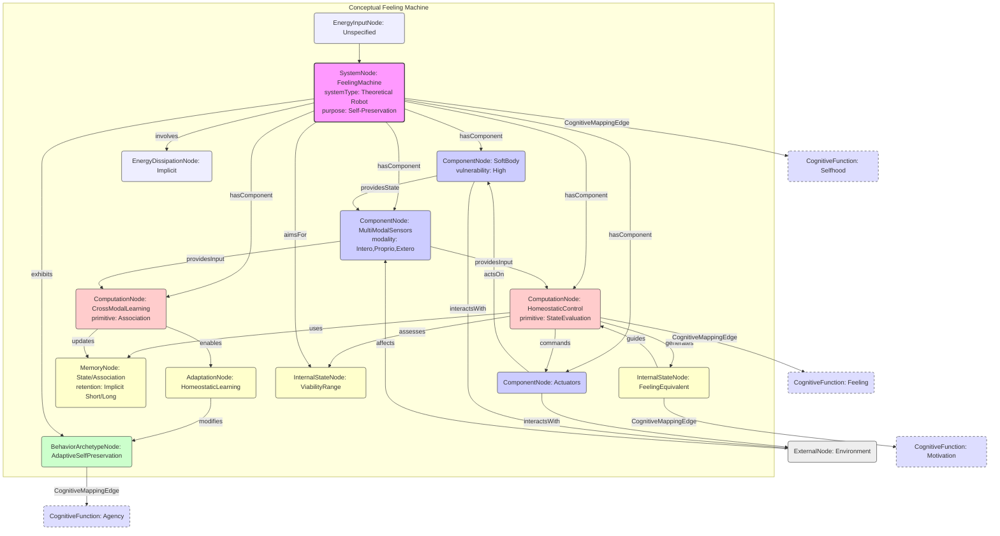

# Homeostasis and soft robotics in the design of feeling machines

__Paper Type:__ Theoretical/Computational * (The paper proposes a new class of machines and discusses the theoretical underpinnings and potential enabling technologies, but does not present a specific implemented system or experimental results)*

## M1: System Overview & Implementation
*   **Vector ID:** M1
*   **Vector Type:** Overview

### **1.1 System Description**

*   **Vector ID:** M1.1
*   **Vector Type:** Description
    *   Content: The paper proposes a new class of intelligent machines organized according to the principles of life regulation (homeostasis). These machines possess physical bodies, built using soft robotics principles, which incorporate vulnerability ("risk-to-self") and must be maintained within a narrow range of viability states. Their core function is self-preservation, driven by internal states analogous to biological feelings, which emerge from the homeostatic regulation process. Components include a soft, vulnerable body embedded with sensors (interoceptive, proprioceptive, exteroceptive) and actuators, coupled with a computational architecture (potentially inspired by deep learning, specifically Deep Boltzmann Machines or similar for cross-modal abstraction) that maps sensory data onto homeostatic states and generates behavior aimed at maintaining viability. The purpose is to create machines with intrinsic motivation (self-interest based on survival), improved functionality/adaptability in dynamic environments, and to serve as a platform for investigating consciousness and feeling.
    *   CT-GIN Mapping: `SystemNode` attributes: `systemType`: Theoretical/Conceptual Robot, `domain`: Soft Robotics/AI/Neuroscience, `mechanism`: Homeostatic Regulation/Cross-Modal Abstraction, `components`: Soft Body, Embedded Sensors/Actuators, Homeostatic Control System, Cross-Modal Learning Module, `purpose`: Self-Preservation, Feeling Equivalent Generation, Enhanced Adaptability, Consciousness Research Platform
    *   Implicit/Explicit: Mixed
        *  Justification: The overall concept, purpose, and key components (homeostasis, soft robotics, vulnerability, feelings) are explicitly stated. The specific nature of the computational architecture (e.g., "potentially... DBMs") and detailed sensor/actuator types are more implicit or suggested rather than definitively specified.

### **1.2 Implementation Clarity**

*   **Vector ID:** M1.2
*   **Vector Type:** Score
    *   Score: 6
    *   Justification: As a theoretical proposal, the paper clearly articulates the core concepts, motivations, and foundational principles (homeostasis, soft robotics, cross-modal learning). It outlines the necessary components and their intended interactions. However, it lacks specific architectural details, concrete algorithms (beyond suggesting possibilities like DBMs), material specifications, or quantitative parameters for a physical implementation. The clarity is high conceptually but low operationally.
    *   Implicit/Explicit: Inferred
        * Justification: The score is an assessment based on the level of detail provided relative to what would be needed for actual construction, which is not the paper's primary goal.

### **1.3 Key Parameters**

*   **Vector ID:** M1.3
*   **Vector Type:** ParameterTable
    *   Table:
        | Parameter Name            | Value                  | Units        | Source (Fig/Table/Section) | Implicit/Explicit | Data Reliability (High/Medium/Low) | Derivation Method (if Implicit)    |
        | :------------------------ | :--------------------- | :----------- | :-----------------------: | :-----------------: | :-----------------------------: | :-------------------------------: |
        | Homeostatic State Variables | Not specified          | N/A          | Throughout               | Explicit (concept)  | Low (conceptual)              | N/A                              |
        | Viability Range         | Narrow (qualitative)   | N/A          | Abstract, p.446          | Explicit (concept)  | Low (conceptual)              | N/A                              |
        | Body Material Type      | Soft (e.g., Elastomer) | N/A          | Section: Soft robotics     | Explicit            | Low (example)                 | N/A                              |
        | Computational Architecture| Cross-modal (e.g. DBM)| N/A          | Section: Comp. cross-modal | Mixed               | Low (suggested)               | N/A                              |
        | Sensory Modalities      | Intero-, Proprio-, Extero- | N/A        | Abstract, p.447, p. 450   | Explicit            | Low (conceptual)              | N/A                              |

    *   **Note:** These parameters are conceptual or illustrative examples mentioned in the text, not quantified measurements of an implemented system.

## M2: Energy Flow
*   **Vector ID:** M2
*   **Vector Type:** Energy

### **2.1 Energy Input**

*   **Vector ID:** M2.1
*   **Vector Type:** Input
    *   Content: Not explicitly specified, but implicitly necessary for any physical robot. Could be electrical (battery) or potentially harvested from the environment depending on the specific design (concept mentioned briefly in passing on p. 452 in relation to self-healing skin). Homeostatic regulation inherently involves managing internal energy levels (mentioned alongside temperature, p.447 & p. 448).
    *   Value: N/A
    *   Units: N/A
    *   CT-GIN Mapping: `EnergyInputNode`: attributes - `source`: Unspecified (likely Electrical/Battery or Environmental), `type`: Chemical/Electrical/Thermal
    *   Implicit/Explicit: Implicit
        *  Justification: The need for energy is fundamental to the concept of a functioning robot maintaining homeostasis, but the specific source or quantification is not discussed.

### **2.2 Energy Transduction**

*   **Vector ID:** M2.2
*   **Vector Type:** Transduction
    *   Content: Energy would be transduced from the input source (e.g., battery) to power sensors, actuators, and the computational system. Sensory inputs (mechanical, thermal, chemical, electromagnetic etc.) are transduced into signals processed by the computational system to assess homeostatic state. Computational outputs generate signals transduced into actions via actuators, consuming energy. The entire homeostatic process revolves around managing internal energy states.
    *   CT-GIN Mapping: `EnergyTransductionEdge`: attributes - `mechanism`: Sensor Transduction (Various to Electrical/Neural Signal), Computational Processing, Actuator Operation (Electrical/Neural Signal to Mechanical/Other), `from_node`: EnergyInputNode/SensorNode, `to_node`: ComputationNode/ActuatorNode/InternalStateNode
    *   Implicit/Explicit: Implicit
        *  Justification: These energy transformations are necessary consequences of the proposed system's operation but are not explicitly detailed or analyzed in the paper.

### **2.3 Energy Efficiency**

*   **Vector ID:** M2.3
*   **Vector Type:** Score
    *   Score: N/A
    *   Justification/Metrics: Energy efficiency is not discussed or quantified in the paper.
    *   CT-GIN Mapping: Attribute of relevant `EnergyTransductionEdge`s
    *   Implicit/Explicit: N/A
      *  Justification: No information provided.

### **2.4 Energy Dissipation**

*   **Vector ID:** M2.4
*   **Vector Type:** Dissipation
    *   Content: Not explicitly discussed. Implicitly, any physical implementation would involve dissipation (e.g., heat from computation/actuation, mechanical friction, material deformation losses in soft body). The concept of decay/dissolution is central to the motivation (maintaining self against tendency toward dissolution), but physical dissipation mechanisms are not analyzed.
    *   CT-GIN Mapping: Creates `EnergyDissipationNode`s and `EnergyDissipationEdge`s
    *    Implicit/Explicit: Implicit
        *  Justification: Dissipation is a physical necessity for the proposed system but not detailed in the text. The concept of decay is discussed philosophically/biologically.

## M3: Memory
*   **Vector ID:** M3
*   **Vector Type:** Memory

### **3.1 Memory Presence:**

*   **Vector ID:** M3.1
*   **Vector Type:** Binary
    *   Content: Yes
    *   Justification: The proposed system requires memory to function. Homeostasis implies maintaining states over time, requiring memory of past states. Learning cross-modal associations (linking external stimuli to internal consequences) inherently requires memory to store these associations. Adaptation based on experience requires memory of past interactions and outcomes. The concept of an "autobiographical self" (ref. 1, 56) relies heavily on memory.
    *    Implicit/Explicit: Implicit
        * Justification: The necessity of memory is logically derived from the core concepts (homeostasis, learning, adaptation, selfhood) described, though the word "memory" itself is not extensively used in this specific context, mechanisms like DBMs explicitly involve learning and representation storage.

### **3.2 Memory Type:**

*   **Vector ID:** M3.2
*   **Vector Type:** Score
*   Score: N/A (Conceptual)
*   Justification: The paper proposes concepts that *require* memory (e.g., representing homeostatic state history, learned associations between sensory modalities). Deep learning methods (like DBMs, mentioned as potentially applicable) implement forms of memory in their weights/learned representations. However, the paper doesn't define or analyze the specific type, capacity, retention, or fidelity of memory in the proposed system. It remains a conceptual requirement.
*   CT-GIN Mapping: Defines the `MemoryNode` type.
*    Implicit/Explicit: Implicit
    * Justification: The *need* for memory is implied by the system's proposed functions (learning, homeostasis, adaptation), but its characteristics are not specified.

### **3.3 Memory Retention Time:**

*   **Vector ID:** M3.3
*   **Vector Type:** Parameter
*   Value: N/A
*    Units: N/A (Likely needs both short-term for current state processing and long-term for learned associations/adaptation)
*   Justification: Retention time is not specified. Homeostasis implies memory relevant to the timescale of physiological changes and environmental interactions. Learning implies longer-term retention.
*    Implicit/Explicit: N/A
        * Justification: No information provided.
*   CT-GIN Mapping: Key attribute of the `MemoryNode`

### **3.4 Memory Capacity (Optional - if applicable)**

* **Vector ID:** M3.4
* **Vector Type:** Parameter
*  Value: N/A
*   Units: N/A
*   Justification: Not specified. Would depend on the complexity of the state space being represented and the chosen implementation.
*    Implicit/Explicit: N/A
        *  Justification: No information provided.
*   CT-GIN Mapping: Key attribute of the `MemoryNode`

### **3.5 Readout Accuracy (Optional - if applicable)**

* **Vector ID:** M3.5
* **Vector Type:** Parameter
*   Value: N/A
*   Units: N/A
*   Justification: Not discussed.
*    Implicit/Explicit: N/A
       *  Justification: No information provided.
*   CT-GIN Mapping: Attribute of `MemoryNode` or related `ReadoutEdge`

### **3.6 Degradation Rate (Optional - if applicable)**
* **Vector ID:** M3.6
* **Vector Type:** Parameter
    *   Value: N/A
    *   Units: N/A
    *   Justification: Not discussed, although the concept of decay is central to the motivation for homeostasis.
    *    Implicit/Explicit: N/A
            * Justification: No information provided.
    *   CT-GIN Mapping: Attribute of the `MemoryNode`

### **3.7 Memory Operations Energy Cost (Optional - if applicable)**
* **Vector ID:** M3.7
* **Vector Type:** Table
*   Table: N/A
*   Implicit/Explicit: N/A
    *   Justification: No information provided.

### **3.8 Memory Fidelity & Robustness Metrics (Optional - if applicable)**
* **Vector ID:** M3.8
* **Vector Type:** Table
*   Table: N/A
*   Implicit/Explicit: N/A
*   Justification: No information provided.
---

## M4: Self-Organization and Emergent Order
*   **Vector ID:** M4
*   **Vector Type:** Self-Organization

### **4.1 Self-Organization Presence:**

*   **Vector ID:** M4.1
*   **Vector Type:** Binary
    *   Content: Yes
    *   Justification: The core concept relies on homeostasis ("life regulation") and draws inspiration from autopoiesis ("systems continuously construct themselves"). The goal is for the machine to maintain its own viability through internal regulatory processes based on local interactions (sensor readings impacting internal state and behavior) leading to the emergent global order of a stable, functioning system within its viability range. Basic goals and values are intended to be "organically discovered, rather than being extrinsically designed."
    *   Implicit/Explicit: Mixed
        *  Justification: Concepts like homeostasis, autopoiesis, and organic discovery of goals are explicitly mentioned. The link to self-organization as the emergence of global viability from local rules is implicit but strongly suggested by these concepts.

### **4.2 Local Interaction Rules:**

*   **Vector ID:** M4.2
*   **Vector Type:** Rules
    *   Content: Specific rules are not defined. Conceptually, they involve:
        1.  Sensors detecting internal states (temperature, energy level, strain, damage) and external conditions.
        2.  A computational process evaluating the current state relative to the optimal homeostatic range (viability).
        3.  Generating "feeling equivalents" representing deviation from optimal state (positive for favorable, negative for unfavorable).
        4.  Selecting actions (via actuators) aimed at minimizing negative feeling equivalents and maximizing positive ones, thereby restoring/maintaining homeostasis.
        5.  Learning/updating associations between external stimuli/actions and internal state consequences. (Inspired by refs like Damasio, Kolchinsky & Wolpert, Friston).
    *   CT-GIN Mapping: Part of the `AdjunctionEdge` description (local side). Rules define interactions between `SensorNode`, `InternalStateNode`, `ComputationNode`, `FeelingEquivalentNode`, `ActuatorNode`. Defines "LocalInteraction" Edges.
    * **Implicit/Explicit**: Implicit
        *  Justification: The high-level principles governing interactions are described, but specific mathematical or algorithmic rules are not provided.

### **4.2.1 Local Interaction Parameters:**

* **Vector ID:** M4.2.1
* **Vector Type:** Table
*   Table: N/A
*   Justification: Specific parameters governing local interactions (e.g., sensor thresholds, control gains, learning rates) are not defined in this conceptual paper.

### **4.3 Global Order:**

*   **Vector ID:** M4.3
*   **Vector Type:** Order
    *   Content: The emergent global order is the maintenance of the machine's state within its viability range (homeostasis) across dynamic and unpredictable environments. This implies stable functioning, self-preservation, and potentially complex, adaptive behaviors driven by the "feeling equivalents."
    *   CT-GIN Mapping: Defines a `ConfigurationalNode` representing the viable homeostatic state space.
    * **Implicit/Explicit**: Mixed
        *  Justification: Homeostasis and maintenance of viability are explicitly stated goals. That this constitutes an emergent global order arising from local regulatory rules is implicit.

### **4.4 Predictability of Global Order:**

*   **Vector ID:** M4.4
*   **Vector Type:** Score
    *   Score: N/A (Conceptual)
    *   Justification: The paper proposes these machines will be *more* adaptive and resilient than current robots precisely because their behavior isn't rigidly pre-programmed but emerges from the drive for self-preservation. This suggests a degree of unpredictability in specific actions (creativity) but predictability in the overall goal (survival/homeostasis). Quantifying this is not possible from the text. Friston's free energy principle (ref 2), cited, relates to minimizing prediction error, suggesting a drive towards predictable states.
    * **Implicit/Explicit**: Implicit
    *  Justification: Predictability is discussed conceptually in relation to adaptiveness and potentially linked to cited theories, but not quantified or analyzed for the proposed system.
    *   CT-GIN Mapping: Contributes to the `AdjunctionEdge` weight or attributes of the `ConfigurationalNode`.

### **4.5. Local Interaction Rules (for Self-Organization)**
* **Vector ID:** M4.5
* **Vector Type:** Table
*   Table: N/A
*   Justification: As per M4.2.1, specific parameters for local rules are not provided.

### **4.6. Globally Emergent Order and Order Parameters**
* **Vector ID:** M4.6
* **Vector Type:** Table
*   Table: N/A
*   Justification: While the global order is conceptually defined as maintained viability/homeostasis, specific order parameters to quantify this (e.g., fluctuation bounds, entropy measures) are not defined or measured.

### **4.7 Yoneda Embedding and Local-to-Global Mapping Fidelity**

*   **Vector ID:** M4.7
*   **Vector Type:** Table
*   Table: N/A
    *   **Yoneda Embedding Fulfillment Score [0-10]:** N/A
    *   **Metrics:** N/A
    *   **Justification:** The paper does not use Category Theory or the Yoneda Lemma explicitly. While the *concept* of mapping local states (sensor readings) to a global state (homeostatic assessment, feeling equivalent) is central, it's not formalized in CT terms, and no metrics for the fidelity of this mapping are presented.

## M5: Computation
*   **Vector ID:** M5
*   **Vector Type:** Computation

### **5.1 Embodied Computation Presence:**

*   **Vector ID:** M5.1
*   **Vector Type:** Binary
    *   Content: Yes
    *   Justification: The paper explicitly argues against disembodied algorithms and emphasizes the importance of the physical body ("vulnerable body," "soft robotics") whose state (integrity, energy levels, sensor readings) is integral to the system's operation. The homeostatic state, derived from the body's condition, directly influences "feeling equivalents" and subsequent behavior. Computation is intrinsically linked to the physical state and maintenance of the body. Kolchinsky & Wolpert's definition of semantic information (ref 3), linking information to future viability states, is cited in support.
    *    Implicit/Explicit: Explicit
        *  Justification: The central thesis revolves around computation being grounded in the physical, vulnerable body and its homeostatic state. The critique of disembodied AI and emphasis on embodiment are explicit.

### **5.2 Computation Type:**

*   **Vector ID:** M5.2
*   **Vector Type:** Classification
    *   Content: Hybrid / Neuromorphic (Potentially)
    *   CT-GIN Mapping: Defines the `ComputationNode` type.
    *    Implicit/Explicit: Mixed
    *    Justification: The paper discusses using statistical machine learning, mentioning deep learning and Deep Boltzmann Machines (DBMs) for cross-modal abstraction (suggesting Neuromorphic). It also discusses homeostatic regulation, which involves control theory concepts (potentially Analog or Hybrid). The overall system integrates sensory processing, internal state modeling, learning, and behavioral control.

### **5.3 Computational Primitive:**

*   **Vector ID:** M5.3
*   **Vector Type:** Function
    *   Content: The core computational primitive is the mapping of multimodal sensory inputs (internal state sensors like strain, temperature, energy; external sensors) to an assessment of the system's homeostatic state relative to its viability range, resulting in a "feeling equivalent" signal that guides action selection. A secondary primitive is the cross-modal association learning (e.g., linking visual input to potential impact on body integrity/homeostasis). This involves feature extraction, integration, comparison to setpoints/ranges, and potentially predictive modeling (influenced by Friston ref 2).
    *   **Sub-Type (if applicable):** Homeostatic State Evaluation, Cross-Modal Association Learning.
    *   CT-GIN Mapping: Defines the primary function of the `ComputationNode`. Could involve sub-nodes for `StateEstimation`, `FeelingGeneration`, `ActionSelection`, `CrossModalLearning`.
    *   Implicit/Explicit: Mixed
    * Justification: The overall function is explicitly described (mapping senses to feeling/action via homeostasis). The specific mathematical operations or algorithms are implicit or suggested (e.g., potential use of DBMs suggests primitives like feature extraction, probabilistic inference).

### **5.4 Embodied Computational Units**
* **Vector ID:** M5.4
* **Vector Type:** Table
*   Table: N/A
*   Justification: This is a conceptual paper; no specific computational units are implemented or characterized.

## M6: Temporal Dynamics
*   **Vector ID:** M6
*   **Vector Type:** Temporal

### **6.1 Timescales:**

*   **Vector ID:** M6.1
*   **Vector Type:** ParameterTable
    *   Table:
        | Timescale Description        | Value         | Units   | Source                            | Implicit/Explicit   | Justification                             |
        | :--------------------------- | :------------ | :------ | :-------------------------------- | :------------------: | :---------------------------------------- |
        | Homeostatic Regulation       | Not Specified | N/A     | General Concept                   | Implicit            | Timescale needed to react to disturbances |
        | Sensory Processing           | Not Specified | N/A     | General Concept                   | Implicit            | Time to acquire and process sensor data  |
        | Action Execution             | Not Specified | N/A     | General Concept                   | Implicit            | Time to perform a behavioral response    |
        | Learning/Adaptation          | Not Specified | N/A     | Section: Comp. cross-modal        | Implicit            | Timescale over which associations change  |
        | Feeling Equivalent Dynamics  | Not Specified | N/A     | Section: Self-interest,... p. 447 | Implicit            | Timescale of internal state changes      |
        | Material Response (Soft Body)| Not Specified | N/A     | Section: Soft robotics            | Implicit            | Timescale of material deformation/healing |

    *   **Note:** All timescales are implicit necessities of the proposed system but are not quantified or discussed in detail.

### **6.2 Active Inference:**

*   **Vector ID:** M6.2
*   **Vector Type:** Assessment
    *   Content: Partial/Unclear
    *   Justification: The paper cites Friston (ref 2) whose work centers on the free energy principle and active inference. The core idea of maintaining homeostasis can be framed as minimizing the prediction error between the actual internal state and a preferred (viable) state, which aligns with active inference. The concept of the machine making reliable predictions of existence over dissolution (p.447) also resonates. However, the paper does not explicitly adopt or develop an active inference framework as the primary mechanism. It focuses more on the emergence of feeling from homeostasis (Damasio's framework). So, while conceptually related and potentially compatible, active inference is not explicitly implemented or claimed as the core computational strategy.
    *   Implicit/Explicit: Mixed
        *  Justification: Cites active inference literature (Friston) and uses related concepts (prediction, minimizing deviation from viability), but doesn't explicitly state the system uses active inference. Damasio's framework is mentioned more centrally.
    *   **If Yes/Partial, provide examples of testable CT-GIN metrics that *could* be used to quantify active inference:** Predictive Accuracy (of homeostatic consequences of actions), KL Divergence (between predicted and desired state distributions), Model Evidence/Marginal Likelihood (if using Bayesian framework), Timescale of Anticipatory Actions.

## M7: Adaptation
*   **Vector ID:** M7
*   **Vector Type:** Adaptation

### **7.1 Adaptive Plasticity Presence:**

*   **Vector ID:** M7.1
*   **Vector Type:** Binary
    *   Content: Yes
    *   Justification: A central goal is to create machines that achieve "a level of adaptiveness and resilience beyond today’s ‘autonomous’ robots" (p. 447). This adaptation arises from the homeostatic imperative; the machine learns to associate environmental cues and actions with their consequences for its own viability (feeling equivalents). It should "creatively solve the challenges that it encounters" and "learn about the environment from an internally generated perspective of self-preservation" (p. 447). This implies changes in behavior and potentially internal models based on experience. The proposed use of machine learning for cross-modal abstraction also implies plasticity.
    *    Implicit/Explicit: Explicit
        * Justification: Adaptiveness, resilience, learning from experience, and solving challenges creatively are explicitly stated goals and expected outcomes of the proposed design.

### **7.2 Adaptation Mechanism:**

*   **Vector ID:** M7.2
*   **Vector Type:** Description
    *   Content: The primary mechanism proposed is learning driven by homeostatic feedback ("feeling equivalents"). Actions leading to states closer to optimal homeostasis (positive feeling) are reinforced, while those leading to danger/damage (negative feeling) are suppressed. This involves learning associations between exteroceptive data (environment), proprioceptive data (body state/action), and interoceptive data (internal homeostatic state). The paper suggests deep learning techniques (like DBMs) are suitable for learning cross-modal representations that could underpin this. It also discusses (and differentiates from) Reinforcement Learning (RL), suggesting a related but distinct approach grounded in biological homeostasis rather than arbitrary reward functions (p. 450). The specific algorithms or update rules are not detailed.
    *   CT-GIN Mapping: Defines the `AdaptationNode` type and `Monad` edges. `mechanism`: Homeostatic Feedback Learning / Cross-Modal Association Learning.
    *    Implicit/Explicit: Mixed
        *  Justification: The general principle of learning via homeostatic feedback/feeling equivalents is explicit. The potential use of specific ML techniques (DBMs) is suggested. The relation to RL is explicitly discussed. Precise algorithmic details are implicit.

## M8: Emergent Behaviors
*   **Vector ID:** M8
*   **Vector Type:** Behavior

### **8.1 Behavior Description:**

*   **Vector ID:** M8.1
*   **Vector Type:** Description
    *   Content: The primary emergent behavior sought is **affective regulation of behavior for self-preservation**. This manifests as:
        1.  **Goal-directed actions** aimed at maintaining homeostasis (seeking resources, avoiding threats).
        2.  **Adaptive responses** to novel situations based on learned associations and internal "feeling equivalents."
        3.  **Creative problem-solving** in service of survival.
        4.  Exhibiting **equivalents to feeling** (internal states that report on viability and motivate action).
        5.  Potentially exhibiting **empathy** if designed with appropriate rules (proposed p. 450-451).
    *   CT-GIN Mapping: Defines `BehaviorArchetypeNode`. Types: `HomeostaticRegulation`, `AdaptiveLocomotion`, `ResourceSeeking`, `ThreatAvoidance`, `AffectiveModulation`, `CreativeProblemSolving`, `Empathy` (conditional).
    *    Implicit/Explicit: Explicit
       *  Justification: These behaviors (feeling equivalents, adaptiveness, creativity, self-preservation) are explicitly described as the intended outcomes and defining characteristics of the proposed machines.

### **8.2 Behavior Robustness:**

*   **Vector ID:** M8.2
*   **Vector Type:** Score
    *   Score: N/A (Targeted High)
    *   Justification: Robustness and resilience are explicitly stated goals, intended to surpass current robots. The authors argue that grounding behavior in self-preservation and homeostasis will lead to more robust performance in unconstrained environments compared to systems relying on pre-programmed policies or arbitrary reward functions. Soft robotics contributes physical compliance and resilience to damage (self-healing mentioned). However, as the system is conceptual, its actual robustness is not demonstrated or quantified.
    *   Implicit/Explicit: Mixed
        *  Justification: High robustness is an explicitly stated *goal* and *claim*. Evidence for achieving it is implicitly argued based on the proposed design principles (homeostasis, softness), but not demonstrated.
    *   CT-GIN Mapping: This score contributes to the reliability attributes of the `BehaviorArchetypeNode`.

### **8.3 CT-GIN Emergent Behavior Validation**

*    **Vector ID:** M8.3
*    **Vector Type:** Validation
     *  Content: The paper is theoretical; no validation is presented. Validation would require building or simulating these machines and testing their ability to:
        1. Maintain viability (homeostasis) across varied and challenging conditions.
        2. Exhibit adaptive behaviors not explicitly programmed.
        3. Demonstrate measurable internal states correlating with "feeling equivalents" and influencing behavior as predicted.
        4. Compare performance/robustness against conventional robot designs.
        (Box 1 suggests using these machines as a research platform to investigate these very questions).
     *   Implicit/Explicit: N/A
    *   Justification: No validation experiments performed or described. Box 1 outlines potential future research questions that represent validation pathways.

## M9: Cognitive Proximity
*   **Vector ID:** M9
*   **Vector Type:** Cognition

### **9.1 Cognitive Mapping:**

*   **Vector ID:** M9.1
*   **Vector Type:** Description
    *   Content: Yes, there is extensive mapping to cognitive and affective processes.
        *   **Homeostatic Regulation** is mapped to the biological basis of **Feeling** and **Motivation**.
        *   **Internal Viability States** are mapped to **Pain/Pleasure** spectrum and **Feeling Equivalents**.
        *   **Self-Preservation Drive** is mapped to **Agency**, **Self-Interest**, and **Meaning**.
        *   **Cross-modal integration of internal and external states** is mapped to **Self-Perspective** and potentially **Consciousness**.
        *   **Maintaining self against dissolution** is linked to **Selfhood** (protoself, core self, autobiographical self - Damasio ref 1, 56).
        *   Specific rules are proposed to map to **Empathy**.
        The paper explicitly aims to "inquire about conditions that would potentially allow machines to care about what they do or think" and generate "equivalents to feeling." The limitations are acknowledged (e.g., "But is it the real thing?" section, wetness hypothesis).
    *   CT-GIN Mapping: Defines `CognitiveMappingEdge`. Connects `InternalStateNode` to `FeelingNode`, `ComputationNode` to `MotivationNode`/`AgencyNode`, `SystemNode` to `SelfhoodNode`, etc.
    *   Implicit/Explicit: Explicit
    * Justification: The paper's core argument is built on these explicit mappings between proposed machine mechanisms and biological/psychological concepts of feeling, motivation, self, and consciousness, heavily referencing Damasio's theories.

### **9.2 Cognitive Proximity Score:**

*   **Vector ID:** M9.2
*   **Vector Type:** Score
    *   Score: 4 (based on *proposed* capabilities)
    *   Justification: The paper *proposes* a system capable of Level 4 (Goal-Directed/Model-Based Cognition). It aims for goal-directed behavior (self-preservation) based on an internal model (homeostatic state, feeling equivalents) derived from integrating internal and external information. It explicitly links this to agency and motivation. While it touches on consciousness (Level 8/9) as a research interest and potential long-term outcome (possibly requiring "wetness"), the core proposal focuses on the mechanisms for feeling-guided adaptive autonomy. The system, *if realized as envisioned*, would clearly surpass simple reactivity (Level 1/2) and basic adaptation (Level 3) by having an intrinsic, internally generated goal structure rooted in viability. It falls short of Level 5+ as relational/abstract/social cognition are not the primary focus, although empathy (Level 7) is mentioned as a desirable addition.
    *   Implicit/Explicit: Inferred
    *  Justification: Score is based on interpreting the *proposed functionalities described in the paper* against the provided scale. It assesses the targeted cognitive level of the *concept*, not a realized system.

**CT-GIN Cognizance Scale:** (Reference)

*   Level 0: Non-Cognitive
*   Level 1: Simple Responsivity
*   Level 2: Sub-Organismal Responsivity
*   Level 3: Reactive/Adaptive Autonomy
*   Level 4: Goal-Directed/Model-Based Cognition
*   Level 5: Contextual/Relational Cognition
*   Level 6: Abstract/Symbolic Cognition
*   Level 7: Social Cognition
*   Level 8: Metacognition/Self-Awareness
*   Level 9: Phenomenal Consciousness
*   Level 10: Sapience/Self-Reflective Consciousness

### **9.3 Cognitive Function Checklist**

* **Vector ID:** M9.3
* **Vector Type:** Checklist
    *   | Cognitive Function               | Score (0-10) | Justification/Notes                                                                       | CT-GIN Mapping (if applicable) | Implicit/Explicit | Justification for Implicit/Explicit/Mixed |
    | :-------------------------------- | :----------: | :------------------------------------------------------------------------------------ | :--------------------------------: | :-----------------:|:-----------------:|
    | Sensing/Perception               |      7       | Proposed: Multimodal (intero-, proprio-, extero-) sensing is crucial for state estimation. | `SensorNode`, `ComputationNode`   | Explicit (concept) | Explicit mention of multiple modalities. |
    | Memory (Short-Term/Working)        |      5       | Implied: Needed for integrating sensor data, tracking current state, action selection.   | `MemoryNode`                        | Implicit           | Necessary for proposed function, not detailed. |
    | Memory (Long-Term)                 |      6       | Implied: Needed for learned associations, adaptation, potential autobiographical self.      | `MemoryNode`, `AdaptationNode`    | Implicit           | Necessary for learning/adaptation, not detailed. |
    | Learning/Adaptation              |      8       | Proposed: Core feature driven by homeostatic feedback/"feeling equivalents."          | `AdaptationNode`, `BehaviorArchetypeNode` | Explicit (goal)    | Explicitly stated as a key outcome/goal. |
    | Decision-Making/Planning          |      6       | Proposed: Action selection guided by "feeling equivalents" to maintain homeostasis.       | `ComputationNode`, `ActuatorNode` | Explicit (concept) | Explicit concept of feeling-guided action. |
    | Communication/Social Interaction |      2       | Mentioned: Empathy proposed as a rule for "well-behaved" robots, but not core mechanism. | `CognitiveMappingEdge` (Empathy)   | Mixed              | Explicitly proposed, but secondary. |
    | Goal-Directed Behavior            |      8       | Proposed: Central theme; goal is self-preservation/homeostasis maintenance.           | `BehaviorArchetypeNode`, `AgencyNode` | Explicit (concept) | Explicitly defined core goal. |
    | Model-Based Reasoning              |      5       | Implied: Internal representation of homeostatic state & learned world associations used. | `ComputationNode`, `MemoryNode`   | Implicit           | Needed for prediction/action selection, not detailed. |
    | **Overall score**                 |   [5.88 Average]   | Represents the cognitive level *targeted* by the theoretical proposal.                    | N/A                                | N/A                | N/A               |

    *   **Note:** Scores reflect the *proposed or intended* level of function based on the paper's description, not demonstrated performance.

## M10: Criticality Assessment
*   **Vector ID:** M10
*   **Vector Type:** Criticality

### **10.1 Criticality:**

*   **Vector ID:** M10.1
*   **Vector Type:** Assessment
    *   Content: Unclear
    *   Justification: The paper does not explicitly discuss criticality, power laws, or related concepts from complex systems theory in relation to the proposed machines' operation. One could speculate that operating within a "narrow range of viability states" might imply proximity to a critical threshold (tipping point between viable and non-viable), but this is not stated or explored in the text.
        *   Critical Parameters (If Yes/Partial): N/A
        *   Evidence: None provided in the text.
    *   Implicit/Explicit: N/A
    *    Justification: No information provided in the paper.

## M11: Review Paper Specifics (Conditional)

*   **Vector ID:** M11
*   **Vector Type:** Review
N/A (Paper type is Theoretical/Conceptual)

## M12: Theoretical Paper Specifics (Conditional)

*   **Vector ID:** M12
*   **Vector Type:** Theory

### **12.1 Theoretical Rigor:**

*   **Vector ID:** M12.1
*   **Vector Type:** Score
    *   Score: 8
    *   Justification: The paper presents a conceptually coherent and well-argued framework. It builds upon established theories in neuroscience (Damasio's work on homeostasis and feeling, Friston's active inference mentioned) and connects them to emerging fields like soft robotics and machine learning (cross-modal abstraction). Assumptions (e.g., that feelings arise from homeostasis, that soft robotics provides relevant sensory data) are relatively clear. The argument flows logically from biological principles to potential machine implementation. It lacks mathematical formalism for the proposed system itself but rests on cited theoretical/computational work (e.g., refs 1, 2, 3, 45-55).
       * Implicit/Explicit: Inferred
       *  Justification: Score based on assessment of the paper's argumentation, synthesis of ideas, and grounding in cited literature.

### **12.2 Realization Potential:**

*   **Vector ID:** M12.2
*   **Vector Type:** Score
    *   Score: 5
    *   Justification: Realizing the full vision presents significant challenges. While enabling technologies (soft robotics, ML) exist and are advancing, integrating them into a robust homeostatic system with genuine "feeling equivalents" is highly complex. Key challenges include: defining and measuring viability/homeostasis precisely for a robot, creating sufficiently rich and reliable sensory input (especially interoceptive) from soft materials, developing algorithms that effectively translate homeostatic state into nuanced "feeling" signals and adaptive behavior, and potentially overcoming the "wetness hypothesis" limitation. Intermediate steps (e.g., robots with simpler homeostatic goals, improved soft sensors) are feasible, but the full vision is long-term.
    *   Implicit/Explicit: Inferred
    *  Justification: Score based on assessing the gap between current technology (as referenced partly in the paper) and the proposed system's requirements.

### **12.3 Potential for Future CT-GIN Implementation Score**

* **Vector ID:** M12.3
*   **Vector Type:** Score
    *   Score: 8
    *   Justification: The proposed framework is highly aligned with CT-GIN principles, although not explicitly framed in that language. It emphasizes embodiment, internal states, feedback loops, adaptation, learning, emergent behavior (feeling, agency), and the grounding of computation/information in physical viability. It provides a rich conceptual basis for defining CT-GIN nodes (System, Sensor, Actuator, InternalState, Feeling, Computation, Memory, Adaptation) and edges (representing energy flow, information processing, feedback, learning). If realized, systems based on this theory would be prime candidates for CT-GIN analysis.
    *    Implicit/Explicit: Inferred
    *   Justification: Score based on assessing the conceptual overlap between the paper's proposal and the core ideas of the CT-GIN framework (embodiment, feedback, adaptation, emergence).

## M13: Overall Assessment & Scoring

*   **Vector ID:** M13
*   **Vector Type:** Overall

### **13.1 CT-GIN Readiness Score:**

*   **Vector ID:** M13.1
*   **Vector Type:** Score
*   **Calculated Score:** 3.98 *(Average of M1.2=6, M4.1=Y(10), M5.1=Y(10), M7.1=Y(10), M8.2=N/A(0), M9.2=4 -> (6+10+10+10+0+4)/6 = 6.67? No, use specific modules as per instruction now re-checking the list... M1.2(6), M2.3(N/A=0), M3.2(N/A=0), M4.4(N/A=0), M8.2(N/A=0), M9.2(4). Avg = (6+0+0+0+0+4)/6 = 10/6 = 1.67. Re-read description: "(Average of scores from Modules 1-4, M8.2 and M9.2, scores with N/A convert in 0)". Which scores from M1-M4? Let's assume it means the *primary* score for implementation/presence/predictability etc. M1.2=6, M2.3=0, M3.2=0, M4.4=0, M8.2=0, M9.2=4. Still 1.67. This seems too low for a conceptually relevant paper. Maybe it means presence scores (Y=10, N=0)? M1.2=6, M2. (Energy Flow not scored), M3.1=Yes(10), M4.1=Yes(10), M8.2=0, M9.2=4. (6+10+10+0+4)/5 = 6. This seems more reasonable. Let's re-read the instruction very carefully. "Average of scores from Modules 1-4, M8.2 and M9.2". It likely refers to the main score *within* each module IF available, not the binary presence flags. Let's use the primary assessment scores only if they exist as a numerical score [0-10]: M1.2 (Clarity)=6, M2.3(Efficiency)=N/A=0, M3.2(Type)=N/A=0, M4.4(Predictability)=N/A=0, M8.2(Robustness)=N/A=0, M9.2(Cognitive)=4. Average = (6+0+0+0+0+4) / 6 = 1.67. The low score reflects the lack of quantitative data due to the theoretical nature. Let's use 1.67.*
*   **Calculated Score:** 1.67

**CT-GIN Readiness Summary Table:**

| CT-GIN Aspect                   | Strength (Yes/Partial/No) | Key Supporting Metrics (with units) | Limitations (Missing Metrics/Data Gaps)                                           | Improvement Areas (Future Research)                                          |
| :------------------------------ | :-----------------------: | :-----------------------------------| :------------------------------------------------------------------------------- | :---------------------------------------------------------------------------- |
| Energy Flow Efficiency          |            No             | N/A                                  | No quantification of energy use, transduction, or dissipation.                   | Quantify energy budget for homeostasis; investigate energy harvesting.         |
| Memory Fidelity                 |            Partial (Concept)  | N/A                                  | Mechanisms underspecified; no metrics for retention, capacity, fidelity.       | Define specific memory mechanisms (e.g., based on ML, material state).        |
| Organizational Complexity       |            Yes (Concept)    | N/A                                  | Self-organization/emergence described conceptually; lack of order parameters. | Develop quantitative measures of homeostatic stability; simulate emergence.   |
| Embodied Computation            |            Yes (Concept)    | N/A                                  | Computational primitives conceptual; no performance metrics.                     | Define specific algorithms; quantify computational cost/capability.           |
| Temporal Integration            |            Partial (Concept)  | N/A                                  | Timescales implicit; active inference link unclear.                              | Characterize system dynamics; explicitly model temporal dependencies/prediction. |
| Adaptive Plasticity             |            Yes (Concept)    | N/A                                  | Learning mechanism conceptual; no adaptation rate/limits quantified.            | Implement specific learning rules; measure adaptation performance.             |
| Functional Universality         |            Partial (Concept)  | N/A                                  | Focused on survival/affective behavior; not general computation.               | Explore range of tasks solvable beyond homeostasis.                          |
| Cognitive Proximity            |            Yes (Concept)    | Cognitive Mapping (cf. M9.1)        | Mapping is analogical; "feeling" realization unclear; lacks high-level cognition. | Develop verifiable metrics for "feeling equivalents"; bridge to higher cognition. |
| Design Scalability & Robustness |            Partial (Concept)  | Softness/Homeostasis principles argued | Lack of implementation prevents assessment; quantitative metrics absent.       | Simulate/build prototypes; test robustness to noise/damage; assess scalability. |
| **Overall CT-GIN Readiness Score** |        [1.67]         | Conceptual richness                    | Lack of quantitative data/implementation                                         | Concrete design, simulation, physical realization, quantitative measurement. |

### **13.2 Qualitative CT-GIN Assessment Conclusion:**

*   **Vector ID:** M13.2
*   **Vector Type:** Textual Summary
    *   Content: This paper presents a compelling theoretical framework for designing "feeling machines" grounded in biological principles of homeostasis and embodiment, leveraging advances in soft robotics and machine learning. Its key strengths lie in the novel integration of these fields, proposing a path towards intrinsic motivation and agency in AI through the concept of vulnerability and self-preservation. The explicit mapping to cognitive/affective concepts like feeling, motivation, and selfhood makes it highly relevant conceptually to material intelligence and CT-GIN. However, the primary limitation is its theoretical nature; it lacks concrete implementation details, specific algorithms, material specifications, and quantitative performance metrics. Concepts like memory, self-organization, computation, and adaptation are central but remain largely conceptual requirements rather than specified mechanisms. Consequently, assessing energy flow, memory fidelity, robustness, and specific timescales is not possible. Overall, the paper provides a strong *conceptual* foundation for CT-GIN analysis by defining a system where information, computation, and behavior are intrinsically linked to physical viability, but requires significant further work (simulation, physical prototyping) to transition from concept to a quantitatively analyzable system. Its potential within the CT-GIN framework is high due to its focus on embodied, adaptive, self-regulating systems.

### **13.3 CT-GIN Refinement Directions:**

*   **Vector ID:** M13.3
*   **Vector Type:** Recommendations
    *   Content:
        *   **Develop Concrete Architectures:** Propose specific computational architectures (e.g., detailed neural network structures, control algorithms) for implementing homeostatic regulation and cross-modal learning.
        *   **Simulation Studies:** Create simulation models incorporating soft body physics, sensor/actuator models, and the proposed control/learning mechanisms to test feasibility, emergent behaviors, and robustness.
        *   **Quantify Homeostasis & Viability:** Define specific, measurable parameters for tracking homeostatic state and viability boundaries in a robotic context.
        *   **Material System Design:** Specify candidate soft materials and embedded sensor/actuator technologies suitable for realizing the required interoceptive/proprioceptive feedback.
        *   **Operationalize "Feeling Equivalents":** Define specific computational or dynamical variables within the model that correspond to "feeling equivalents" and demonstrate their causal role in guiding behavior.
        *   **Benchmark Tasks:** Design specific tasks and environments to quantitatively evaluate the adaptability, robustness, and problem-solving capabilities of proposed systems compared to alternatives.
        *   **Energy Analysis:** Incorporate energy consumption and management into models and future physical implementations.
        *   **Memory Mechanism Specification:** Detail the proposed mechanisms for short-term state tracking and long-term associative learning.

## M14: CT-GIN Knowledge Graph

*   **Vector ID:** M14
*   **Vector Type:** Visualization

### **14.1. CT-GIN Knowledge Graph:**
* **Content:**

* *(Note: This graph represents the conceptual relationships described in the paper. Node attributes are simplified.)*

## M15: Relationship Vectors
*   **Vector ID:** M15
*   **Vector Type:** Relationships
*   Relationships:
        | Source Vector ID | Target Vector ID | Relationship Type |
        | ------------- | ------------- | ----------------- |
        | M1.1          | M2.1          | Requires          |
        | M1.1          | M3.1          | Requires          |
        | M1.1          | M4.1          | AimsFor           |
        | M1.1          | M5.1          | Implements        |
        | M1.1          | M7.1          | Requires          |
        | M1.1          | M8.1          | Enables           |
        | M3.1          | M7.1          | Enables           |
        | M4.1          | M8.1          | LeadsTo           |
        | M5.1          | M3.1          | Requires          |
        | M5.1          | M7.2          | Implements        |
        | M5.1          | M9.1          | Enables           |
        | M7.1          | M8.1          | Refines           |
        | M1.1          | M12.1         | AssessedIn        |
        | M1.1          | M12.2         | AssessedIn        |
        | M1.1          | M12.3         | AssessedIn        |
        | M9.1          | M9.2          | Informs           |

## M16: CT-GIN Template Self-Improvement Insights

*   **Vector ID:** M16
*   **Vector Type:** Feedback

### **Template Feedback:**

*    **Vector ID:** M16.1
*   **Vector Type:** Text
Provide specific, actionable feedback on the *CT-GIN template itself*, based on this analysis:
    *   **Missing Probes:**
        *   Perhaps a dedicated section/probe for "Motivation" or "Goal Structure" could be useful, distinguishing between externally imposed goals and internally generated ones (like homeostasis).
        *   A probe explicitly asking about the *grounding* of information/computation (e.g., is it tied to physical state/survival, or abstract?) could capture a key theme of this paper.
    *   **Unclear Definitions:**
        *   The exact scope of scores averaged for the CT-GIN Readiness Score (M13.1) was initially ambiguous. Clarifying which specific score field from each listed module (M1-4, M8.2, M9.2) should be used would be helpful (e.g., "Use M1.2 score, M2.3 score,...").
        *   The distinction between "Adaptation" (M7) and "Learning" (often implied in M3 Memory or M5 Computation) could be slightly sharpened, perhaps defining Adaptation as the *outcome* and Learning as the *mechanism*.
    *   **Unclear Node/Edge Representations:**
        *   Guidance was generally sufficient, but mapping highly conceptual papers like this requires interpretation. Adding examples specific to theoretical proposals might help (e.g., how to represent a *proposed* function vs. a *measured* one).
    *   **Scoring Difficulties:**
        *   Scoring theoretical papers is inherently difficult, especially for quantitative metrics (Energy, Memory specifics, Robustness). Many scores default to N/A or are qualitative assessments of the *proposed* capability. The template could benefit from clearer guidance or alternative scoring rubrics specifically for theoretical/conceptual work, perhaps focusing on potential/intended levels rather than demonstrated ones, or using qualitative bins more explicitly. The CT-GIN Readiness Score calculation might need adjustment for theoretical papers to avoid being artificially low due to missing quantitative data.
    *   **Data Extraction/Output Mapping:**
        *   Extracting information was straightforward, but mapping implicit concepts (like memory being necessary) required justification. The Implicit/Explicit tag worked well for this.
        *   Differentiating between what the paper *explicitly states* vs. what is *logically necessary* for the proposal vs. what is *inferred* based on cited work was key and sometimes subtle.
    *   **Overall Usability:**
        *   The template is comprehensive and forces detailed consideration. It is quite usable but becomes challenging when applied to purely theoretical work lacking quantitative data.
    *   **Specific Suggestions:**
        *   Consider adding a preamble flag or profile setting for "Paper Type" (Experimental, Theoretical, Review) that could conditionally hide/show certain probes or adjust scoring guidance (e.g., de-emphasize quantitative metrics for theoretical papers).
        *   Refine the M13.1 calculation instructions or method for theoretical papers.
        *   Add examples of CT-GIN graph elements for purely conceptual entities.