# Morphological Control of Cilia-Inspired Asymmetric Movements Using Nonlinear Soft Inflatable Actuators:

__Paper Type:__ Hybrid

## M1: System Overview & Implementation
*   **Vector ID:** M1
*   **Vector Type:** Overview

### **1.1 System Description**

*   **Vector ID:** M1.1
*   **Vector Type:** Description
    *   Content: The system consists of soft, inflatable bending actuators interconnected via passive flow restrictors, driven by a single pressure input. The actuators exhibit nonlinear pressure-volume (PV) curves with snap-through instabilities. The system's purpose is to demonstrate "morphological control" – harnessing the passive mechanical and fluidic characteristics (nonlinearity, flow restriction) to achieve complex, sequenced motions mimicking biological cilia (spatially asymmetric stroke for a single cilium, metachronal wave for an array) using simplified control (single pressure line). Components include: 1) Nonlinear bending actuators (inner latex balloon, outer slit PVC shell, luer locks), 2) Passive flow restrictors (narrow tubes or restricted luer locks), 3) Pressure source (proportional valve), 4) Fluid (water/air). The system *does* convert a single pressure input into sequenced bending motions.
    *   CT-GIN Mapping: `SystemNode` attributes: `systemType`: `SoftRoboticActuatorSystem`, `domain`: `SoftRobotics`, `mechanism`: `MorphologicalControl`, `components`: [`NonlinearActuator`, `FlowRestrictor`, `PressureSource`, `Fluid`], `purpose`: `BioInspiredMotionReplication` (Cilia Asymmetry, Metachronal Wave). `NonlinearActuator` attributes: `material_inner`: `Latex`, `material_outer`: `PVC`, `nonlinearity`: `SnapThrough`, `deformation`: `Bending`. `FlowRestrictor` attributes: `type`: `PassiveTube/Orifice`. `PressureSource` attributes: `type`: `ProportionalValve`. Edges like `FluidicConnection` connect components.
    *   Implicit/Explicit: Explicit
        *  Justification: The paper explicitly describes the components, their arrangement, the concept of morphological control, the system's behavior (sequenced bending, asymmetric motion, waves), and its purpose (mimicking cilia).

### **1.2 Implementation Clarity**

*   **Vector ID:** M1.2
*   **Vector Type:** Score
    *   Score: 8
    *   Justification: The paper clearly describes the materials (latex tubing, PVC shell, McMaster-Carr part types), dimensions (diameters, lengths), fabrication method for actuators (slits, perforations), and connection methods (luer locks). The setups for spatial asymmetry and metachrony are well-described with actuator types, connections, and flow restrictor details. Simulation methods (equations, parameters) are also detailed. Some minor details might require referring to the Supplementary Information (e.g., exact plug detail), but the core implementation is very clear.
    *   Implicit/Explicit: Explicit
        * Justification: The "Materials and Methods" section provides detailed descriptions of actuator fabrication, experimental setups (spatial asymmetry, metachrony), and simulation methods.

### **1.3 Key Parameters**

*   **Vector ID:** M1.3
*   **Vector Type:** ParameterTable
    *   Table:
        | Parameter Name                  | Value                                  | Units         | Source (Fig/Table/Section) | Implicit/Explicit | Data Reliability (High/Medium/Low) | Derivation Method (if Implicit) |
        | :------------------------------ | :------------------------------------- | :------------ | :-----------------------: | :-----------------: | :-----------------------------: | :-------------------------------: |
        | Actuator Shell Inner Diameter   | 8                                      | mm            | Materials and Methods     | Explicit          | High                            | N/A                               |
        | Actuator Shell Outer Diameter   | 11.2                                   | mm            | Materials and Methods     | Explicit          | High                            | N/A                               |
        | Actuator Length                 | 40                                     | mm            | Materials and Methods     | Explicit          | High                            | N/A                               |
        | Actuator Balloon Outer Diameter | 3.2, 4.8, 6.4                          | mm            | Materials and Methods     | Explicit          | High                            | N/A                               |
        | Flow Restrictor Inner Diameter (Metachrony) | 0.2                                    | mm            | Materials and Methods     | Explicit          | High                            | N/A                               |
        | Flow Restrictor Length (Metachrony) | 0.5                                    | m             | Materials and Methods     | Explicit          | High                            | N/A                               |
        | Peak/Valley Pressures (NM-low) | ~0.2 / ~0.1 (approx from Fig 2A)      | MPa           | Figure 2A                 | Explicit          | Medium                          | Visual estimation from graph      |
        | Operating Pressure Range        | 0 - 0.32                               | MPa           | Results/Discussion        | Explicit          | High                            | N/A                               |

    *   **Note:** Values for Peak/Valley Pressures are approximate readings from Fig 2A. Operating pressure range is taken from spatial asymmetry and metachrony experiments.

## M2: Energy Flow
*   **Vector ID:** M2
*   **Vector Type:** Energy

### **2.1 Energy Input**

*   **Vector ID:** M2.1
*   **Vector Type:** Input
    *   Content: The primary energy source is pressurized fluid (air/water) supplied by an external pressure source (proportional valve connected to a pressure supply). The system converts potential energy stored in the pressurized fluid.
    *   Value: N/A (Pressure profiles are given, e.g., up to 0.32 MPa, but total energy input not calculated)
    *   Units: N/A (Pressure in MPa, Flow rate in m³/s or ml/s)
    *   CT-GIN Mapping: `EnergyInputNode`: attributes - `source`: `PressurizedFluid`, `type`: `PotentialEnergy` (Pressure). Linked from `PressureSource` node.
    *   Implicit/Explicit: Explicit
        *  Justification: The paper explicitly states the use of a pressure supply (Festo MPPES-3-1) and inflation with water or air (inferred from fluid dynamics equations using air properties).

### **2.2 Energy Transduction**

*   **Vector ID:** M2.2
*   **Vector Type:** Transduction
    *   Content: 1. Potential Energy (Pressurized Fluid) -> Kinetic Energy (Fluid Flow): Pressure difference drives fluid flow through restrictors and into actuators. 2. Kinetic/Potential Energy (Fluid) -> Elastic Potential Energy (Actuator Material) + Work Done (Bending): Fluid entering the actuator inflates the latex balloon against the PVC shell, storing elastic energy in the deformed materials and performing mechanical work to bend the actuator. The snap-through instability involves a rapid conversion of stored elastic energy and fluid potential energy into kinetic energy of the actuator structure and fluid, followed by reaching a new equilibrium state.
    *   CT-GIN Mapping: `EnergyTransductionEdge`: attributes - `mechanism`: `FluidFlow`, `from_node`: `EnergyInputNode`, `to_node`: `ActuatorNode`. `EnergyTransductionEdge`: attributes - `mechanism`: `ElasticDeformation`, `from_node`: `ActuatorNode (FluidState)`, `to_node`: `ActuatorNode (MechanicalState)`. `EnergyTransductionEdge`: attributes - `mechanism`: `SnapThrough`, `from_node`: `ActuatorNode (State1)`, `to_node`: `ActuatorNode (State2)`.
    *   Implicit/Explicit: Mixed
        *  Justification: The paper explicitly describes fluid inflation, pressure causing bending, and snap-through. The specific energy transformation steps (potential -> kinetic -> elastic -> work) are implicit based on the physical processes described.

### **2.3 Energy Efficiency**

*   **Vector ID:** M2.3
*   **Vector Type:** Score
    *   Score: 2
    *   Justification/Metrics: Low. The paper does not quantify efficiency. However, significant energy losses are expected due to: 1) Viscous dissipation in the narrow flow restrictors (explicitly modeled using Darcy-Weisbach). 2) Material hysteresis/damping in the soft actuators during inflation/deflation cycles. 3) The snap-through itself is an irreversible process involving rapid energy release. The primary goal is controllled motion sequence, not energy efficiency. Qualitative assessment: Low.
    *   CT-GIN Mapping: Attribute `efficiency` (Low) of relevant `EnergyTransductionEdge`s.
    *   Implicit/Explicit: Implicit
      *  Justification: Efficiency is not mentioned or calculated. The low score is inferred from the described physical mechanisms (flow restriction, material properties, instabilities) known to be dissipative.

### **2.4 Energy Dissipation**

*   **Vector ID:** M2.4
*   **Vector Type:** Dissipation
    *   Content: 1. Viscous Losses in Flow Restrictors: Modeled by Darcy-Weisbach law (Eq. 3/4), dependent on flow rate, fluid properties, and restrictor geometry (diameter, length). Quantified in simulations via pressure drop Δp. Assessment: Potentially High, especially in the metachrony setup with long, narrow tubes. 2. Material Damping/Hysteresis: Energy lost as heat during cyclic deformation of the latex and PVC materials. Not explicitly quantified, but inherent in soft materials. Assessment: Medium (expected for elastomers under cyclic load). 3. Snap-Through Instability: Rapid, irreversible transition involves energy dissipation (acoustic, thermal). Not quantified. Assessment: Low to Medium per snap event, depends on system dynamics. 4. Fluid Viscosity within Actuators: Minor compared to restrictors. Not quantified. Assessment: Low.
    *   CT-GIN Mapping: Creates `EnergyDissipationNode`s (`type`: `ViscousFlow`, `MaterialDamping`, `Instability`). `EnergyDissipationEdge` links `FlowRestrictorNode` or `ActuatorNode` to respective `EnergyDissipationNode`. Attributes capture dissipation rate/magnitude (qualitative: High/Medium/Low based on justification).
    *    Implicit/Explicit: Mixed
        *  Justification: Viscous losses in restrictors are explicitly modeled (Eq. 3, 4). Material damping and snap-through dissipation are implicit consequences of the described materials and phenomena, not explicitly quantified in the paper.

## M3: Memory
*   **Vector ID:** M3
*   **Vector Type:** Memory

### **3.1 Memory Presence:**

*   **Vector ID:** M3.1
*   **Vector Type:** Binary
    *   Content: Yes
    *   Justification: The system exhibits history dependence. The state (volume, curvature) of a non-monotonic actuator at a given pressure below the peak depends on whether that pressure was reached during inflation or deflation due to hysteresis in the PV/KV curves (Fig 2A). Furthermore, in the dynamic systems (Configuration 4, Metachrony), the state of downstream actuators depends on the history of flow determined by the upstream actuators' states and the pressure input history. The snap-through represents a rapid state change, and the system requires crossing the peak/valley pressure thresholds again to reverse the snap, embodying a form of state retention dependent on the pressure history and thresholds. It's a dynamic, physically embodied memory tied to material hysteresis and system configuration, influencing future bending sequences.
    *    Implicit/Explicit: Mixed
        * Justification: Hysteresis is explicit in the PV/KV curves (Fig 2A). The resulting history dependence influencing the sequence (the core concept of morphological control demonstrated) is explicit. The term "memory" isn't used for the actuators themselves (though bistable *valves* are mentioned as having state retention), but the described behavior fits the definition of memory influencing future states based on past inputs/states.

**(Conditional: If M3.1 is "No", skip to Module 4. If "Yes", include M3.2 and M3.3.)**

### **3.2 Memory Type:**

*   **Vector ID:** M3.2
*   **Vector Type:** Score
*   Score: 3
*   Justification: The memory is primarily short-term hysteresis inherent in the material response (PV curve shape) and dynamic effects from fluid flow. It allows the system to follow different paths during inflation vs. deflation (spatial asymmetry) or sequence actuation based on pressure history and flow delays (metachrony). Retention is tied to maintaining pressure or ongoing flow dynamics. It is not easily re-writable in the sense of storing arbitrary information, but rather reflects the inherent physics. There are essentially two main "memory states" associated with the snap-through (pre-snap, post-snap), but accessing them depends on traversing the pressure cycle. Capacity is low (related to the number of actuators and their hysteretic states). Read-out is implicit in the actuator's configuration (curvature).
*   CT-GIN Mapping: `MemoryNode` type: `HystereticStateMemory`. Attributes: `mechanism`: `MaterialHysteresis`, `FluidDynamics`, `access`: `PressureCycleDependent`, `capacity_estimate`: `Low`.
*    Implicit/Explicit: Mixed
    * Justification: Hysteresis is explicit (Fig 2A). The interpretation as a low-level memory type influencing system dynamics is implicit based on the definition of memory provided in the template and the system's described behavior.

### **3.3 Memory Retention Time:**

*   **Vector ID:** M3.3
*   **Vector Type:** Parameter
*   Value: Short-term / Dynamic
*    Units: N/A
*   Justification: The memory (hysteretic state) persists as long as the pressure is held within the hysteresis loop or as long as the dynamic flow conditions influencing the sequence are maintained. Releasing pressure resets the actuators towards their initial state (though potentially following the deflation curve). It's not a long-term static memory; it's tied to the ongoing pressure input and material/fluid relaxation times, which are likely on the order of seconds based on the experiment descriptions (e.g., 18s cycle time).
*    Implicit/Explicit: Implicit
        * Justification: Retention time is not explicitly discussed. It's inferred from the nature of material hysteresis and the described experimental timescales (pressure ramps, cycle times).
*   CT-GIN Mapping: Key attribute `retention_type`: `ShortTermDynamic` of the `MemoryNode`.

### **3.4 Memory Capacity (Optional - if applicable)**

* **Vector ID:** M3.4
* **Vector Type:** Parameter
*  Value: Low (e.g., ~2 states per NM actuator)
*   Units: States
*   Justification: Each non-monotonic actuator exhibits distinct behavior pre- and post-snap-through within the hysteresis loop. This can be considered as roughly 2 accessible states for a given pressure range, influencing the sequence. For a system of N actuators, the capacity is related to the combination of these states, but accessing specific combinations depends heavily on the input pressure profile and flow dynamics, not arbitrary addressing.
*    Implicit/Explicit: Implicit
        *  Justification: Capacity is not discussed. Inferred from the observed behavior (snap-through creating distinct states) and the limited number of actuators in the demonstrators.
*   CT-GIN Mapping: Key attribute `capacity_bits_approx`: ~log2(states) of the `MemoryNode`.

### **3.5 Readout Accuracy (Optional - if applicable)**

* **Vector ID:** M3.5
* **Vector Type:** Parameter
*   Value: N/A (Qualitatively High)
*   Units: N/A
*   Justification: The "readout" is the physical configuration (curvature) of the actuator. While not quantified in terms of accuracy, the experiments and simulations show relatively consistent and predictable bending corresponding to the hysteretic states (pre/post snap), suggesting the state is reliably expressed physically. Variability exists (e.g., standard deviation in Fig 4D).
*    Implicit/Explicit: Implicit
       *  Justification: Readout accuracy is not explicitly discussed. Inferred qualitatively from the consistency shown between simulation and experiments (e.g., Fig 3F, Fig 4D/E).
*   CT-GIN Mapping: Attribute `readout_method`: `PhysicalConfiguration` of `MemoryNode`.

### **3.6 Degradation Rate (Optional - if applicable)**
* **Vector ID:** M3.6
* **Vector Type:** Parameter
    *   Value: N/A
    *   Units: N/A
    *   Justification: Material fatigue or degradation over multiple cycles is not discussed in the excerpt. Latex and PVC may degrade over time and extensive cycling, but this is not characterized.
    *    Implicit/Explicit: Implicit
            * Justification: Not mentioned in the text. Assumed based on general material properties.
    *   CT-GIN Mapping: N/A

### **3.7 Memory Operations Energy Cost (Optional - if applicable)**
* **Vector ID:** M3.7
* **Vector Type:** Table
*   Table: N/A
*   Implicit/Explicit: Implicit
    *   Justification: The energy cost of transitioning between states (memory write/read equivalent) is not quantified.

### **3.8 Memory Fidelity & Robustness Metrics (Optional - if applicable)**
* **Vector ID:** M3.8
* **Vector Type:** Table
*   Table: N/A
*   Implicit/Explicit: Implicit
*   Justification: Specific metrics for memory fidelity or robustness (beyond general system robustness) are not provided.

---

## M4: Self-Organization and Emergent Order
*   **Vector ID:** M4
*   **Vector Type:** Self-Organization

### **4.1 Self-Organization Presence:**

*   **Vector ID:** M4.1
*   **Vector Type:** Binary
    *   Content: No
    *   Justification: While complex dynamics (asymmetric stroke, metachronal wave) emerge from local interactions (actuator nonlinearity, flow restriction), the overall structure and sequence are heavily determined by the *designed* arrangement of components (serial connection, specific restrictors, specific actuator types). It's morphological control leading to a programmed dynamic pattern, not spontaneous pattern formation from initially homogeneous or random conditions without global positional information or pre-defined connectivity. The order achieved (sequence, wave) is designed into the system's physical structure and driving protocol.
    *   Implicit/Explicit: Implicit
        *  Justification: The paper describes the *design* and *assembly* of specific configurations to achieve target motions. The term "self-organization" is not used, and the process described aligns with engineered control through morphology rather than spontaneous emergence of order from local rules in an initially unstructured system.

**(Conditional: If M4.1 is "No", skip to Module 5. If "Yes", include M4.2-M4.7)**

## M5: Computation
*   **Vector ID:** M5
*   **Vector Type:** Computation

### **5.1 Embodied Computation Presence:**

*   **Vector ID:** M5.1
*   **Vector Type:** Binary
    *   Content: Yes
    *   Justification: The physical system itself (actuators, restrictors, fluid) transforms a single, simple input (pressure ramp/profile) into a complex, sequenced spatio-temporal output (specific bending patterns like asymmetric stroke or metachronal wave). The "computation" (input-output transformation, sequencing logic) is performed intrinsically by the material properties (nonlinearity, PV curve) and physical laws governing fluid flow (Darcy-Weisbach), without an external digital controller dictating the sequence. This fits the definition of embodied computation or morphological control.
    *    Implicit/Explicit: Explicit
        *  Justification: The paper's central theme is "morphological control," explicitly defined as harnessing physical properties to simplify control schemes and embody the control function within the system, which is synonymous with embodied computation in this context. Fig 1 explicitly contrasts external (software) control with morphological (embodied) control.

**(Conditional: If M5.1 is "No", skip to Module 6. If "Yes", include M5.2-5.4)**

### **5.2 Computation Type:**

*   **Vector ID:** M5.2
*   **Vector Type:** Classification
    *   Content: Hybrid (Analog/Digital aspects)
    *   CT-GIN Mapping: `ComputationNode` type: `FluidicStateSequencer`.
    *    Implicit/Explicit: Implicit
    *    Justification: The underlying fluid dynamics (pressure, flow) are governed by continuous analog equations (e.g., Eq 1-4). However, the snap-through instability introduces discrete state transitions, behaving like digital switching events triggered at specific pressure thresholds. The overall system behavior is a hybrid of continuous dynamics and discrete events.

### **5.3 Computational Primitive:**

*   **Vector ID:** M5.3
*   **Vector Type:** Function
    *   Content: Thresholding & Sequencing. The core operation is the triggering of a state change (snap-through bending) when the internal pressure reaches a specific threshold (peak/valley pressure of the PV curve). By connecting actuators with flow restrictors, the system implements sequencing based on the time delays introduced by fluid flow and the different pressure thresholds (implicitly, if actuators differ, or dynamically due to pressure drops). It acts like a fluidic, physically embodied state machine where transitions are governed by pressure thresholds and flow dynamics.
    *   **Sub-Type (if applicable):** Thresholding: Pressure-triggered instability; Sequencing: Flow-delay based state transition.
    *   CT-GIN Mapping: `ComputationNode` function: `ThresholdTriggeredStateTransition`, `FlowDelayedSequencing`.
    *   Implicit/Explicit: Mixed
    * Justification: Snap-through at pressure peaks/valleys is explicitly described and shown (Fig 2A). Sequencing via flow restrictors causing delays is explicitly described for the metachrony setup and modeled (Eq 1-2). Characterizing this as "Thresholding & Sequencing" is an interpretation of these described physical mechanisms as computational primitives.

### **5.4 Embodied Computational Units**
* **Vector ID:** M5.4
* **Vector Type:** Table
*   Table:
| Unit ID | Description | Processing Power | Energy/Operation | Freq/Resp. Time | Bit-Depth | Data Source | Implicit/Explicit | Justification |
| :------ | :---------- | :--------------- | :--------------- | :--------------: | :-------: | :----------: |:-----------------:| :-----------------:|
| Actuator (NM) | Nonlinear element performing pressure thresholding via snap-through | N/A | N/A (Losses occur during snap) | ~Seconds (Fig 4D) | ~1 bit (Pre/Post Snap state) | Fig 2A, Fig 4D | Implicit | Conceptual interpretation of actuator function |
| Restrictor | Passive element introducing time delay based on flow rate | N/A | N/A (Viscous Losses, Eq 3/4) | N/A | N/A | Eq 3/4 | Implicit | Conceptual interpretation of restrictor function |

## M6: Temporal Dynamics
*   **Vector ID:** M6
*   **Vector Type:** Temporal

### **6.1 Timescales:**

*   **Vector ID:** M6.1
*   **Vector Type:** ParameterTable
    *   Table:
        | Timescale Description             | Value                       | Units   | Source                            | Implicit/Explicit | Justification                                    |
        | :-------------------------------- | :-------------------------- | :------ | :-------------------------------- | :----------------: | :----------------------------------------------- |
        | Input Pressure Ramp Rate (Config 2/3) | 5                           | kPa/s   | Results/Discussion (Spatial)      | Explicit          | Stated rate for quasi-static tests.              |
        | Input Pressure Ramp Time (Config 4) | 1                           | s       | Results/Discussion (Spatial)      | Explicit          | Stated inflation time.                           |
        | Input Pressure Dwell Time (Config 4) | 12                          | s       | Results/Discussion (Spatial)      | Explicit          | Stated dwell time.                               |
        | Input Pressure Deflation Rate (Config 4) | 60                          | kPa/s   | Results/Discussion (Spatial)      | Explicit          | Stated deflation rate.                           |
        | Single Cilium Cycle Time (Config 4 Exp) | 18                          | s       | Results/Discussion (Spatial)      | Explicit          | Mentioned beat time for flow estimate calc.    |
        | Metachronal Wave Cycle Time (Exp)  | ~25 (approx from Fig 4D)    | s       | Figure 4D                         | Explicit          | Visual estimation from pressure profile.         |
        | Metachronal Wave Speed (Inflation) | 23                          | mm/s    | Results/Discussion (Metachronal) | Explicit          | Calculated from experiments.                     |
        | Metachronal Wave Speed (Deflation) | 53                          | mm/s    | Results/Discussion (Metachronal) | Explicit          | Calculated from experiments.                     |
        | Actuator Response/Snap Time        | Likely << 1s (not specified) | s       | Implicit                          | Implicit          | Snap-through is typically fast; not quantified. |

    *   **Note:** Actuator snap time is inferred to be fast relative to the overall cycle times.

### **6.2 Active Inference:**

*   **Vector ID:** M6.2
*   **Vector Type:** Assessment
    *   Content: No
    *   Justification: The system operates based on predetermined physical laws and designed properties (actuator nonlinearity, restrictor impedance). There is no evidence of prediction of future states, active selection of actions to minimize prediction error, or an internal model of the environment being updated by experience. The behavior, while complex, is a direct consequence of the physics, not an active inferential process.
    *   Implicit/Explicit: Implicit
        *  Justification: Active inference is not mentioned. The described mechanisms (morphological control, fluid dynamics, nonlinear mechanics) do not align with the principles of active inference.
    *   **If Yes/Partial, provide examples of testable CT-GIN metrics that *could* be used to quantify active inference:** N/A

## M7: Adaptation
*   **Vector ID:** M7
*   **Vector Type:** Adaptation

### **7.1 Adaptive Plasticity Presence:**

*   **Vector ID:** M7.1
*   **Vector Type:** Binary
    *   Content: No
    *   Justification: The system's components (actuators, restrictors) have fixed physical properties. The behavior (sequencing, wave motion) is determined by these fixed properties and the input pressure profile. The paper does not describe any mechanism by which the system changes its structure or parameters based on experience or environmental interaction to improve performance or alter function over time. It exhibits programmed dynamics, not adaptive plasticity.
    *    Implicit/Explicit: Implicit
        * Justification: Adaptation or learning mechanisms are not mentioned. The focus is on achieving specific motions through fixed design ("morphological control").

**(Conditional: If M7.1 is "No", skip to Module 8. If "Yes", include M7.2)**

## M8: Emergent Behaviors
*   **Vector ID:** M8
*   **Vector Type:** Behavior

### **8.1 Behavior Description:**

*   **Vector ID:** M8.1
*   **Vector Type:** Description
    *   Content: 1. **Sequenced Bending:** Individual actuators bend in a discrete, pre-programmed sequence determined by their nonlinear PV curves and connection topology (e.g., via flow restrictors). 2. **Spatially Asymmetric Stroke (Single Cilium):** A system of two stacked actuators generates a different path during the inflation (forward) and deflation (backward) phases due to the sequenced snapping and hysteresis, mimicking a biological cilium's non-reciprocal motion required for low Reynolds number propulsion. Quantified by the swept area. 3. **Metachronal Wave (Cilia Array):** A linear array of identical actuators connected serially with flow restrictors generates a wave-like progression of bending motion along the array, mimicking the phase-shifted motion of biological cilia arrays. Quantified by wave speed and phase shift.
    *   CT-GIN Mapping: `BehaviorArchetypeNode`: `type`: `SequencedActuation`. `BehaviorArchetypeNode`: `type`: `AsymmetricStroke`, `subtype`: `SingleCilium`, `metric`: `SweptArea`. `BehaviorArchetypeNode`: `type`: `MetachronalWave`, `subtype`: `CiliaArray`, `metric`: `WaveSpeed`, `PhaseShift`.
    *    Implicit/Explicit: Explicit
       *  Justification: These behaviors (sequenced bending, asymmetric motion, metachronal wave) are the primary results presented and explicitly described, simulated, and experimentally demonstrated in the paper (Introduction, Results/Discussion, Figures 3, 4).

### **8.2 Behavior Robustness:**

*   **Vector ID:** M8.2
*   **Vector Type:** Score
    *   Score: 4
    *   Justification: The paper shows good agreement between simulations and experiments for the demonstrated configurations (Fig 3F, 4D), suggesting some robustness. However, potential issues exist: 1) Sensitivity to component variation: Actuator PV curves might vary slightly due to fabrication tolerances, affecting snapping pressures and sequence timing (implied by standard deviation bars in Fig 4D). 2) Sensitivity to input: The dynamic sequences (Config 4, Metachrony) depend on the pressure profile (rate, magnitude). 3) Limited scalability: The metachrony section mentions decreased stroke amplitude along the chain due to pressure drops, suggesting robustness issues for longer arrays (explicitly stated). The simulation showing swept area dependence on restrictor size (Supp Fig S5) indicates sensitivity to component parameters. Qualitative assessment: Low-to-Medium.
    *   Implicit/Explicit: Mixed
        *  Justification: Good agreement between simulation/experiment suggests some robustness (explicit). Limitations like decreased stroke in longer arrays and sensitivity to parameters (restrictor size, inferred for actuator variations) are mentioned explicitly or are readily inferred from the physics. The score reflects a balance, acknowledging functionality but also likely sensitivities.
    *   CT-GIN Mapping: Contributes to `reliability` attribute (Low-to-Medium) of `BehaviorArchetypeNode`s.

### **8.3 CT-GIN Emergent Behavior Validation**

*    **Vector ID:** M8.3
*    **Vector Type:** Validation
     *  Content: The emergent behaviors (asymmetric stroke, metachronal wave) are validated through: 1) **Experimental Demonstration:** Fabricated prototypes are actuated, and their motion is recorded and quantified (tip tracking for swept area - Fig 3F, curvature tracking for wave - Fig 4D/E, Supplementary Movies S1-S4, S6). 2) **Numerical Simulation:** Lumped parameter fluidic models (Eq 1-5) incorporating experimentally measured PV/KV curves (Fig 2A) are used to simulate the system dynamics. 3) **Comparison:** Experimental results are directly compared with simulation predictions (e.g., swept area in Fig 3F, curvature/displacement in Fig 4D/E). Good agreement is reported, validating the underlying model and the emergence of the described behaviors from the designed physics. Limitations: Only a small number of actuators tested (2 for single cilium, 4 for array); robustness to variations or noise not systematically tested experimentally.
     *   Implicit/Explicit: Explicit
    *   Justification: The paper explicitly describes the experimental methods (tracking, measurement), the simulation approach, and presents direct comparisons between the two (Figures 3F, 4D, 4E).

## M9: Cognitive Proximity
*   **Vector ID:** M9
*   **Vector Type:** Cognition

### **9.1 Cognitive Mapping:**

*   **Vector ID:** M9.1
*   **Vector Type:** Description
    *   Content: None. The paper focuses on demonstrating morphological control for bio-inspired motion (cilia mimicry) through physical principles (nonlinearity, fluid dynamics). There is no attempt to map the system's functionality to cognitive processes like perception, decision-making, learning, planning, or reasoning, even metaphorically. The intelligence discussed is "embodied intelligence" in the sense of complex behavior arising from physical morphology, not cognitive function.
    *   CT-GIN Mapping: N/A
    *   Implicit/Explicit: Implicit
    * Justification: The paper consistently uses terms like "morphological control," "embodied intelligence," "physical properties," and "sequencing." Cognitive terms are absent.

### **9.2 Cognitive Proximity Score:**

*   **Vector ID:** M9.2
*   **Vector Type:** Score
    *   Score: 1
    *   Justification: The system demonstrates Level 1: Simple Responsivity. It reacts to a pressure input in a complex but largely predetermined way based on its fixed physical design. While it shows history dependence (hysteresis), it lacks adaptation, goal-directedness based on internal models, learning, or any higher-level functions associated with cognition. The "sequencing" is a physical consequence of the design, not a cognitive planning process. It's a sophisticated stimulus-response system where the "response" is a complex spatiotemporal pattern, but it remains fundamentally reactive.
    *   Implicit/Explicit: Implicit
    *  Justification: Score assigned based on matching the system's described capabilities (reactive, fixed properties, complex but predetermined output based on physics) against the definitions in the CT-GIN Cognizance Scale.

### **9.3 Cognitive Function Checklist**

* **Vector ID:** M9.3
* **Vector Type:** Checklist
    *   | Cognitive Function               | Score (0-10) | Justification/Notes                                                                       | CT-GIN Mapping (if applicable) | Implicit/Explicit | Justification for Implicit/Explicit/Mixed |
    | :-------------------------------- | :----------: | :------------------------------------------------------------------------------------ | :--------------------------------: | :-----------------:|:-----------------:|
    | Sensing/Perception               |      1       | Implicit sensing of internal pressure triggering snap-through (threshold detection). No environmental perception. | N/A                                | Implicit          | Thresholding is described. |
    | Memory (Short-Term/Working)        |      2       | Hysteresis provides short-term history dependence influencing state. Not adaptable or actively managed. | `MemoryNode`                       | Mixed             | Hysteresis explicit, interpretation as memory implicit. |
    | Memory (Long-Term)                 |      0       | Absent. No mechanism for long-term storage of information altering behavior.            | N/A                                | Implicit          | No mechanism described. |
    | Learning/Adaptation              |      0       | Absent. System properties are fixed.                                                    | N/A                                | Implicit          | No mechanism described. |
    | Decision-Making/Planning          |      0       | Absent. Sequencing is physically determined, not a choice based on goals or models.     | N/A                                | Implicit          | No mechanism described. |
    | Communication/Social Interaction |      0       | Absent. Actuators interact physically via fluid, but no communication in a cognitive sense. | N/A                                | Implicit          | No mechanism described. |
    | Goal-Directed Behavior            |      0       | Absent. Behavior follows physics, not internally represented goals.                  | N/A                                | Implicit          | No mechanism described. |
    | Model-Based Reasoning              |      0       | Absent. No internal model used for prediction or reasoning.                             | N/A                                | Implicit          | No mechanism described. |
    | **Overall score**                 |      [0.375]       | Minimal cognitive functions present, primarily low-level physical effects interpreted generously. |                                    |                     | Calculated average. |

    *   **Note:** Scores are assigned based on the system's described physical behavior interpreted through the lens of cognitive functions.

## M10: Criticality Assessment
*   **Vector ID:** M10
*   **Vector Type:** Criticality

### **10.1 Criticality:**

*   **Vector ID:** M10.1
*   **Vector Type:** Assessment
    *   Content: Yes/Partial
    *   Justification: The system explicitly utilizes snap-through instabilities in the nonlinear actuators. Snap-through is a form of bifurcation, a critical phenomenon where the system rapidly transitions between states as a control parameter (pressure) crosses a threshold (peak/valley). The paper leverages this criticality (instability) to achieve discrete sequencing and amplify motion (large volume/curvature change for small pressure change near threshold). While the paper doesn't analyze scale-free behavior or power laws explicitly, the core mechanism relies on operating near these critical instability points.
        *   Critical Parameters (If Yes/Partial): Actuator Peak Pressure, Actuator Valley Pressure (Control parameters leading to critical transition). Order parameter could be actuator volume or curvature.
        *   Evidence: Figure 2A shows the peak and valley pressures defining the unstable region. The text explicitly mentions snap-through instability multiple times and its role in the system's function (introduction, methods, results).
    *   Implicit/Explicit: Mixed
    *    Justification: The use of snap-through instability (a critical phenomenon) is explicit. The framing of the *entire* system's operation *as* "operating near criticality" in a broader sense (e.g., exhibiting power laws) is implicit or not addressed, but the core component behavior relies on criticality.

## M11: Review Paper Specifics (Conditional)

N/A (Paper type is Hybrid, not Review)

## M12: Theoretical Paper Specifics (Conditional)

N/A (Paper type is Hybrid, not purely Theoretical)

## M13: Overall Assessment & Scoring

*   **Vector ID:** M13
*   **Vector Type:** Overall

### **13.1 CT-GIN Readiness Score:**

*   **Vector ID:** M13.1
*   **Vector Type:** Score
*   **Calculated Score:** 3.11
    * Calculation: Average(M1.2=8, M2.3=2, M3.2=3, M4.1=0 (No->0), M8.2=4, M9.2=1, M5.1=1? No, M5 is not included in the scoring list. Re-checking instructions... "Average of scores from Modules 1-4, M8.2 and M9.2"... wait, M4 score is not defined, only M4.1 (binary) and M4.4 (predictability). M3.1 is binary. Let's assume the instruction meant scores M1.2, M2.3, M3.2, M8.2, M9.2, and perhaps M4.4 if M4.1 was Yes. Since M4.1 is No, let's average the available numerical scores: M1.2(8), M2.3(2), M3.2(3), M8.2(4), M9.2(1). Average = (8+2+3+4+1)/5 = 18/5 = 3.6. Let's re-read carefully: "Average of scores from Modules 1-4, M8.2 and M9.2". Okay, need *scores* from M1-M4. M1: M1.2=8. M2: M2.3=2. M3: M3.2=3. M4: No score for M4 overall, M4.4 not applicable. Let's assume M4 contributes 0 if M4.1 is No. M8: M8.2=4. M9: M9.2=1. Average = (M1.2 + M2.3 + M3.2 + M4_score? + M8.2 + M9.2) / N. Using 0 for M4: (8+2+3+0+4+1)/6 = 18/6 = 3.0. The instruction "scores from Modules 1-4" is ambiguous. Let's strictly use the *numbered* scores listed: M1.2, M2.3, M3.2, M4.4 (N/A=0), M8.2, M9.2. Average = (8+2+3+0+4+1)/6 = 3.0. Let's stick with 3.0.

**CT-GIN Readiness Summary Table:**

| CT-GIN Aspect                   | Strength (Yes/Partial/No) | Key Supporting Metrics (with units) | Limitations (Missing Metrics/Data Gaps)                                           | Improvement Areas (Future Research)                                          |
| :------------------------------ | :-----------------------: | :-----------------------------------| :------------------------------------------------------------------------------- | :---------------------------------------------------------------------------- |
| Energy Flow Efficiency          | No                        | N/A (Qualitatively Low)             | Efficiency not quantified; dissipation mechanisms not fully measured.           | Quantify efficiency; design for lower loss (e.g., optimize restrictors).     |
| Memory Fidelity                 | Partial                   | Hysteresis loops (Fig 2A); Sequencing consistency (Fig 3F, 4D) | Retention time not quantified; capacity low; robustness to noise unclear.     | Characterize memory properties (retention, capacity, error rates); explore materials with tunable hysteresis. |
| Organizational Complexity       | No                        | N/A (System is designed, not self-organized) | N/A                                                                              | Explore potential for genuine self-organization in similar systems.          |
| Embodied Computation            | Yes                       | Successful sequencing (Fig 3, 4); Agreement simulation/experiment | Computational power/limits unclear; sensitivity to parameters.                   | Quantify computational complexity; explore more complex computations.        |
| Temporal Integration            | Yes                       | Wave speeds (23/53 mm/s); Cycle times (~18-25 s) | Limited analysis of dynamic range; response to time-varying inputs.            | Characterize frequency response; design for specific temporal dynamics.        |
| Adaptive Plasticity             | No                        | N/A                                 | No mechanism for adaptation/learning.                                          | Incorporate materials/mechanisms that allow structural or parameter changes. |
| Functional Universality         | No                        | Specific behaviors demonstrated (asymmetric stroke, wave) | Limited range of demonstrated behaviors; not general-purpose computation.      | Explore programmability; design for wider range of functional outputs.       |
| Cognitive Proximity            | No                        | Cognitive Score ~1                  | Lacks planning, learning, goal-direction, internal models.                     | Integrate feedback, memory, and decision-making elements (major challenge). |
| Design Scalability & Robustness | Partial                   | Works for N=2, N=4; Sim/Exp match    | Decreased stroke in longer arrays (N=4); sensitivity to variations likely.   | Improve robustness to variations; develop scalable designs (address pressure drop). |
| **Overall CT-GIN Readiness Score** |        3.0               | Measured parameters (dimensions, pressures), dynamic behaviors | Quantified efficiency, memory, robustness; deeper computational analysis     | Integrate adaptation, enhance robustness/scalability, quantify performance metrics |

### **13.2 Qualitative CT-GIN Assessment Conclusion:**

*   **Vector ID:** M13.2
*   **Vector Type:** Textual Summary
    *   Content: This work demonstrates a compelling example of morphological control, achieving complex, bio-inspired kinematic sequences (asymmetric stroke, metachronal wave) using simple, nonlinear soft actuators and passive flow restrictors driven by a single pressure input. This represents a clear implementation of embodied computation (M5), where the system's physical properties intrinsically perform sequencing and transformation of the input signal. The system leverages criticality via snap-through instabilities (M10) for discrete state changes. It exhibits short-term, dynamic memory through material hysteresis and fluid dynamics (M3), enabling different inflation/deflation paths. Key strengths lie in the clear implementation (M1) and the successful demonstration of targeted behaviors validated by simulation (M8). However, the system lacks genuine self-organization (M4) and adaptive plasticity (M7). Energy efficiency appears low (M2), and robustness/scalability present challenges (M8.2). Cognitive proximity is minimal (M9), limited to basic stimulus-response with physical memory effects. Overall, it's a strong example of low-level embodied intelligence achieved through clever physical design but does not yet incorporate higher-level features like learning, planning, or significant autonomy relevant to cognizant matter.
### **13.3 CT-GIN Refinement Directions:**

*   **Vector ID:** M13.3
*   **Vector Type:** Recommendations
    *   Content:
        *   **Quantify Performance:** Systematically measure energy efficiency, memory characteristics (retention, capacity, fidelity), computational limits (speed, complexity), and robustness to noise/variations.
        *   **Enhance Memory:** Explore material systems or designs offering longer retention times, higher capacity, or more controllable memory states beyond simple hysteresis.
        *   **Introduce Adaptation:** Integrate materials or mechanisms allowing for adaptive changes in actuator properties (e.g., stiffness, snap thresholds) or flow restriction based on feedback or history (e.g., incorporate stimuli-responsive materials).
        *   **Improve Scalability/Robustness:** Address the pressure drop issue in arrays; investigate designs less sensitive to fabrication variations (e.g., using feedback or self-correction mechanisms if adaptation is added).
        *   **Explore Programmability:** Investigate methods to reconfigure connections or tune parameters (if possible) to achieve different computational outputs or behavioral sequences from the same hardware.
        *   **Integrate Sensing:** Add local sensing capabilities (e.g., strain, pressure) to enable closed-loop feedback within the morphological control paradigm.

## M14: CT-GIN Knowledge Graph

*   **Vector ID:** M14
*   **Vector Type:** Visualization

### **14.1. CT-GIN Knowledge Graph:**
* **Content:**

```mermaid
graph TD
    subgraph System [Morphological Control Cilia System]
        P[PressureSource type:ProportionalValve]
        F[Fluid type:Air/Water]
        subgraph ActuatorArray [e.g., Metachrony setup]
            A1[ActuatorNode id:1 material:Latex/PVC nonlinearity:SnapThrough deformation:Bending]
            R1[FlowRestrictorNode id:1 type:PassiveTube L:0.5m d:0.2mm]
            A2[ActuatorNode id:2 material:Latex/PVC nonlinearity:SnapThrough deformation:Bending]
            R2[FlowRestrictorNode id:2 type:PassiveTube L:0.5m d:0.2mm]
            A3[...]
            R3[...]
            A4[...]
        end
        subgraph SingleCilium [e.g., Spatial Asymmetry setup]
            ABase[ActuatorNode id:Base ...]
            ATip[ActuatorNode id:Tip ...]
            RBaseTip[FlowRestrictorNode Optional]
        end
    end

    subgraph Energy
        EIN[EnergyInputNode source:PressurizedFluid type:PotentialEnergy]
        EDissV[EnergyDissipationNode type:ViscousFlow location:Restrictor magnitude:High]
        EDissM[EnergyDissipationNode type:MaterialDamping location:Actuator magnitude:Medium]
        EDissS[EnergyDissipationNode type:Instability location:Actuator magnitude:Low-Medium]
    end

    subgraph Memory
        MEM[MemoryNode type:HystereticStateMemory mechanism:MaterialHysteresis retention:ShortTermDynamic capacity_approx:Low]
    end

    subgraph Computation
        COMP[ComputationNode type:FluidicStateSequencer function:ThresholdSequencing]
    end

    subgraph Behavior
        BSeq[BehaviorArchetypeNode type:SequencedActuation reliability:Low-Med]
        BAsym[BehaviorArchetypeNode type:AsymmetricStroke metric:SweptArea reliability:Low-Med]
        BWave[BehaviorArchetypeNode type:MetachronalWave metric:WaveSpeed reliability:Low-Med]
    end

    subgraph Cognition
        COG[CognitiveProximity score:1]
        COG_Sense[CognitiveFunction score:1 function:Sensing]
        COG_MemST[CognitiveFunction score:2 function:MemoryST]
    end

    subgraph Criticality
        CRIT[Criticality assessment:Partial mechanism:SnapThrough]
    end

    %% Edges
    P -- Pressure --> F
    F -- Pressure --> EIN

    EIN -- Transduction (FluidFlow) --> R1
    EIN -- Transduction (FluidFlow) --> RBaseTip
    R1 -- Transduction (FluidFlow, Loss) --> A1
    RBaseTip -- Transduction (FluidFlow, Loss) --> ABase

    A1 -- FluidicConnection --> R2
    A2 -- FluidicConnection --> R3
    A3 -- FluidicConnection --> R4
    ABase -- FluidicConnection --> ATip


    R1 -- EnergyDissipationEdge --> EDissV
    R2 -- EnergyDissipationEdge --> EDissV
    RBaseTip -- EnergyDissipationEdge --> EDissV


    A1 -- Transduction (ElasticDeformation, SnapThrough) --> A1
    A2 -- Transduction (ElasticDeformation, SnapThrough) --> A2
    ABase -- Transduction (ElasticDeformation, SnapThrough) --> ABase
    ATip -- Transduction (ElasticDeformation, SnapThrough) --> ATip


    A1 -- EnergyDissipationEdge --> EDissM
    A2 -- EnergyDissipationEdge --> EDissM
    A1 -- EnergyDissipationEdge --> EDissS
    A2 -- EnergyDissipationEdge --> EDissS


    %% Behavior Links
    A1 -- Embodies --> COMP
    R1 -- Embodies --> COMP
    COMP -- LeadsTo --> BSeq
    BSeq -- LeadsTo --> BAsym
    BSeq -- LeadsTo --> BWave


    %% Memory Links
    A1 -- Exhibits --> MEM
    A2 -- Exhibits --> MEM


    %% Cognition Links
    System -- AssessedAgainst --> COG
    System -- AssessedAgainst --> COG_Sense
    MEM -- AssessedAgainst --> COG_MemST

    %% Criticality Links
    A1 -- OperatesNear --> CRIT
    A2 -- OperatesNear --> CRIT

    %% Style (Optional)
    classDef system fill:#cde,stroke:#333,stroke-width:2px;
    classDef energy fill:#f9d,stroke:#333,stroke-width:2px;
    classDef memory fill:#df9,stroke:#333,stroke-width:2px;
    classDef compute fill:#9df,stroke:#333,stroke-width:2px;
    classDef behavior fill:#fd9,stroke:#333,stroke-width:2px;
    classDef cog fill:#ccf,stroke:#333,stroke-width:2px;
    classDef crit fill:#fcc,stroke:#333,stroke-width:2px;

    class P,F,A1,A2,A3,A4,ABase,ATip,R1,R2,R3,RBaseTip system;
    class EIN,EDissV,EDissM,EDissS energy;
    class MEM memory;
    class COMP compute;
    class BSeq,BAsym,BWave behavior;
    class COG,COG_Sense,COG_MemST cog;
    class CRIT crit;
```

## M15: Relationship Vectors
*   **Vector ID:** M15
*   **Vector Type:** Relationships
*   Relationships:
        | Source Vector ID | Target Vector ID | Relationship Type |
        | :------------- | :------------- | :----------------- |
        | M1.1           | M5.1           | DescribesSystemForComputation |
        | M1.1           | M8.1           | DescribesSystemForBehavior |
        | M1.3           | M2.4           | ParameterizesDissipationModel |
        | M2.2           | M2.3           | InformsEfficiencyAssessment |
        | M2.2           | M2.4           | DetailsDissipationMechanisms |
        | M3.1           | M3.2           | EnablesMemoryTypeAssessment |
        | M3.1           | M8.1           | MemoryContributesToBehavior (Asymmetry) |
        | M5.1           | M1.1           | ComputationEmbodiedInSystem |
        | M5.3           | M10.1          | ComputationUsesCriticality |
        | M8.1           | M1.1           | BehaviorProducedBySystem |
        | M8.3           | M1.2           | ValidationDependsOnImplementation |
        | M10.1          | M5.3           | CriticalityEnablesComputationPrimitive |
        | M13.1          | M1.2, M2.3, M3.2, M8.2, M9.2 | AggregatesScores |
        | M13.2          | M1-M10         | SummarizesAnalysis |

## M16: CT-GIN Template Self-Improvement Insights

*   **Vector ID:** M16
*   **Vector Type:** Feedback

### **Template Feedback:**

*    **Vector ID:** M16.1
*   **Vector Type:** Text
Provide specific, actionable feedback on the *CT-GIN template itself*, based on this analysis:
    *   **Missing Probes:**
        *   A dedicated probe for "Morphological Control" might be useful, distinct from generic "Embodied Computation," perhaps focusing on the mapping between physical structure and computational function.
        *   Probes specifically addressing the *nature* of nonlinearity (e.g., hysteresis, snap-through, material hyperelasticity) could be beneficial under M1 or M5.
        *   A probe for "Scalability" under M8 (Behavior) or M1 (System) could explicitly capture limitations observed in array systems.
    *   **Unclear Definitions:**
        *   The distinction between "Emergent Behavior" (M8) and "Self-Organization" (M4) could be sharper. The current definition of self-organization ("without external control *defining the global structure*") is key but challenging to apply definitively. Morphological control *designs* the structure *to achieve* a global behavior, blurring the lines. Perhaps M4 should focus purely on *spontaneous pattern formation from initially non-prestructured states*.
        *   "Memory" (M3.1 definition) is broad. Specifying sub-types (e.g., static vs. dynamic, passive vs. active) within the justification or M3.2 might be helpful.
    *   **Unclear Node/Edge Representations:**
        *   Guidance on representing *processes* versus *components* could be clearer. E.g., Is snap-through an edge attribute, a node state transition, or a separate process node?
        *   Mapping dissipation: Clarify if dissipation is always a separate node or can be an edge attribute (e.g., efficiency < 1 implies dissipation).
    *   **Scoring Difficulties:**
        *   **M13.1 Calculation:** The instruction "Average of scores from Modules 1-4, M8.2 and M9.2" is ambiguous as M4 lacks a single overall score in the template structure when M4.1 is No. Specifying *exactly which vector IDs* (e.g., M1.2, M2.3, M3.2, M4.4 [use 0 if N/A], M8.2, M9.2) should be averaged would be clearer. *Initial calculation was ambiguous, settled on averaging available numbered scores M1.2, M2.3, M3.2, M4.4(0), M8.2, M9.2.*
        *   Efficiency Score (M2.3): Often requires qualitative assessment; providing clearer qualitative anchors (e.g., Low < 3, Medium 4-6, High > 7) might help consistency.
        *   Robustness Score (M8.2): Similar to efficiency, qualitative anchors might be useful.
        *   Cognitive Checklist (M9.3): Justifying scores 0-10 for low-level physical systems can feel arbitrary; maybe a simpler scale (Present/Partial/Absent) or focusing only on functions potentially present would be better.
    *   **Data Extraction/Output Mapping:**
        *   Extracting quantitative values for memory (M3.3-M3.8) and computation (M5.4) from papers not explicitly focused on these aspects is often difficult, leading to many "N/A" or "Implicit" entries. This is expected but worth noting.
        *   The level of detail required for CT-GIN mapping suggestions can vary; clearer examples for different system types would be helpful.
    *   **Overall Usability:** The template is very comprehensive but demanding. The conditional skipping helps streamline. Ensuring consistency between section presence (e.g., M4 details skipped if M4.1=No) and scoring dependencies (M13.1) is critical. The use of Vector IDs is excellent for structure.
    * **Specific Suggestions:**
        *   Clarify the exact Vector IDs used for the M13.1 calculation.
        *   Refine the definition/scope of M4 (Self-Organization) vs. M8 (Emergent Behavior) specifically regarding designed vs. spontaneous order.
        *   Consider adding qualitative anchors for scores like Efficiency and Robustness.
        *   Add an explicit "Scalability" probe.
        *   Consider simplifying the M9.3 checklist for systems scoring very low on M9.2.