# The Multiple Realizability of Sentience in Living Systems and Beyond

__Paper Type:__ Review

## M1: System Overview & Implementation
*   **Vector ID:** M1
*   **Vector Type:** Overview

### **1.1 System Description**

*   **Vector ID:** M1.1
*   **Vector Type:** Description
    *   Content: The "system" discussed is the abstract concept of cognitive functions (including intelligence, decision-making, learning, and sentience) being multiply realizable and substrate-independent. The paper argues that these functions are not exclusive to brains but can be implemented by diverse physical systems, including non-neural cells/tissues, plants, fungi, tissue-engineered cultures, bio-robotic hybrids (hybrots), synthetic intelligences (AI), and potentially unconventional materials. The purpose is to advocate for a unified framework ("diverse intelligence") that recognizes these commonalities, overcomes neuro-centric biases, and facilitates cross-disciplinary research and ethical considerations. Components are the various agents exhibiting (or potentially exhibiting) cognition, ranging from molecular networks to organisms to engineered systems.
    *   CT-GIN Mapping: `SystemNode` attributes: `systemType`: Conceptual Framework, `domain`: Cognition/Sentience Theory, `mechanism`: Multiple Realizability/Substrate Independence, `components`: {Neural, Non-neural Bio, Synthetic, Material}, `purpose`: Unification/Framework Development. Edges like `ImplementsCognitiveFunction` connecting `SubstrateNode` to `CognitiveFunctionNode`.
    *   Implicit/Explicit: Explicit
        *  Justification: The paper explicitly defines and argues for the concepts of multiple realizability and substrate independence concerning cognitive functions across diverse systems mentioned.

### **1.2 Implementation Clarity**

*   **Vector ID:** M1.2
*   **Vector Type:** Score
    *   Score: 7
    *   Justification: The paper clearly articulates its central arguments for multiple realizability and substrate independence, citing examples across different fields. The proposed conceptual framework ("diverse intelligence") is outlined. However, the *mechanisms* by which specific cognitive functions (especially sentience) are proposed to be realized in non-neural or non-biological substrates remain largely abstract and lack detailed, testable implementation descriptions. The clarity is high for the *concept* but lower for the *mechanistic implementation* details across all proposed substrates.
    *   Implicit/Explicit: Mixed
        * Justification: The core argument is explicit, but the assessment of its clarity involves judgment based on the level of mechanistic detail provided (or lack thereof) for the phenomena discussed.

### **1.3 Key Parameters**

*   **Vector ID:** M1.3
*   **Vector Type:** ParameterTable
    *   Table:
        | Parameter Name | Value | Units | Source (Fig/Table/Section) | Implicit/Explicit | Data Reliability (High/Medium/Low) | Derivation Method (if Implicit) |
        | :------------- | :---: | :---: | :-----------------------: | :-----------------: | :-----------------------------: | :-------------------------------: |
        | Substrate Type | {Brain, Ganglia, Neural Explant/Culture, Non-neural Cell/Tissue, Plant, Fungi, Material, AI, Hybrot, Cyborg} | N/A | Intro, Cognition Is Multiply Realizable..., How Bioengineered Systems... | Explicit | High | N/A |
        | Cognitive Function | {Intelligence, Decision-making, Learning (Assoc/Non-Assoc), Sentience, Anticipation, Mimicry, Problem-solving} | N/A | Intro, Cognition Is Multiply Realizable..., Distinctions without Differences... | Explicit | High | N/A |
        | System Scale | {Subcellular, Cellular, Tissue, Organism, Collective, Artificial} | N/A | Identifying the Minimal Scale... | Explicit | High | N/A |
        | Realizability Level | Multiple | N/A | Title, Cognition Is Multiply Realizable... | Explicit | High | N/A |
        | Degree of Agency / Mindedness | Continuum (proposed) | N/A | The Fundamental Privacy..., Identifying the Minimal Scale... | Explicit | Medium | Conceptual proposal |
    *   **Note:** Parameters represent the core concepts discussed in this theoretical/review paper, rather than physical implementation metrics. Values are sets of examples or qualitative descriptions provided in the text.

## M2: Energy Flow
*   **Vector ID:** M2
*   **Vector Type:** Energy

### **2.1 Energy Input**

*   **Vector ID:** M2.1
*   **Vector Type:** Input
    *   Content: N/A
    *   Value: N/A
    *   Units: N/A
    *   CT-GIN Mapping: N/A
    *   Implicit/Explicit: Explicit
        *  Justification: The paper discusses cognitive functions at an abstract level and does not detail the specific energy sources required for their implementation in various substrates.

### **2.2 Energy Transduction**

*   **Vector ID:** M2.2
*   **Vector Type:** Transduction
    *   Content: N/A
    *   CT-GIN Mapping: N/A
    *   Implicit/Explicit: Explicit
        *  Justification: Energy transduction mechanisms underlying cognitive functions in diverse substrates are not described.

### **2.3 Energy Efficiency**

*   **Vector ID:** M2.3
*   **Vector Type:** Score
    *   Score: N/A
    *   Justification/Metrics: N/A
    *   CT-GIN Mapping: N/A
    *   Implicit/Explicit: Explicit
      *  Justification: Energy efficiency is not discussed.

### **2.4 Energy Dissipation**

*   **Vector ID:** M2.4
*   **Vector Type:** Dissipation
    *   Content: N/A
    *   CT-GIN Mapping: N/A
    *    Implicit/Explicit: Explicit
        *  Justification: Energy dissipation mechanisms are not discussed.

## M3: Memory
*   **Vector ID:** M3
*   **Vector Type:** Memory

### **3.1 Memory Presence:**

*   **Vector ID:** M3.1
*   **Vector Type:** Binary
    *   Content: Yes
    *   Justification: The paper explicitly discusses memory (associative learning, non-associative learning/habituation, immunologic memory, memory in materials via conditioned hysteresis, memory in GRNs) as a cognitive function that is potentially multiply realizable across diverse systems (animals, slime moulds, materials, immune cells, molecular networks). This memory influences future behavior/outputs based on past inputs/history.
    *    Implicit/Explicit: Explicit
        * Justification: Memory is explicitly named and cited as an example of a realizable cognitive function in various contexts (e.g., "associative learning", "immunologic memory", "conditioned hysteresis").

### **3.2 Memory Type:**

*   **Vector ID:** M3.2
*   **Vector Type:** Score
*   Score: 6
*   Justification: The paper discusses a breadth of memory phenomena (associative, non-associative, immunological, material hysteresis, GRN memory) across different substrates, indicating diverse mechanisms and potential capabilities. However, it doesn't deeply analyze the properties (retention, capacity, fidelity) for each, nor does it propose a unified model of memory. The score reflects the breadth of mention but lack of deep characterization or integration.
*   CT-GIN Mapping: Defines `MemoryNode` types associated with different substrates (e.g., `NeuralMemory`, `MaterialMemory`, `GeneticMemory`) and functions (e.g., `Associative`, `NonAssociative`).
*    Implicit/Explicit: Mixed
    * Justification: Explicitly names different memory types but the assessment of the *breadth* and *depth* of discussion requires interpretation.

### **3.3 Memory Retention Time:**

*   **Vector ID:** M3.3
*   **Vector Type:** Parameter
*   Value: N/A
*    Units: Qualitative Descriptor: "different time constants" mentioned generally.
*   Justification: The paper acknowledges that different systems (e.g., brains vs other tissues) may operate on different timescales ("time constants may differ") including memory processes, but does not provide specific quantitative retention times for the various examples discussed.
*    Implicit/Explicit: Mixed
        * Justification: Explicitly mentions differing timescales, but provides no specific values, making the parameter value itself qualitative and implicit for specific systems.
*   CT-GIN Mapping: Key attribute (`retentionTime`) of the `MemoryNode`, currently qualitative.

### **3.4 Memory Capacity (Optional - if applicable)**

* **Vector ID:** M3.4
* **Vector Type:** Parameter
*  Value: N/A
*   Units: N/A
*   Justification: Memory capacity is not quantitatively discussed.
*    Implicit/Explicit: Explicit
        *  Justification: No mention of memory capacity metrics.
*   CT-GIN Mapping: N/A

### **3.5 Readout Accuracy (Optional - if applicable)**

* **Vector ID:** M3.5
* **Vector Type:** Parameter
*   Value: N/A
*   Units: N/A
*   Justification: Readout accuracy is not discussed.
*    Implicit/Explicit: Explicit
       *  Justification: No mention of readout accuracy metrics.
*   CT-GIN Mapping: N/A

### **3.6 Degradation Rate (Optional - if applicable)**
* **Vector ID:** M3.6
* **Vector Type:** Parameter
    *   Value: N/A
    *   Units: N/A
    *   Justification: Memory degradation is not discussed.
    *    Implicit/Explicit: Explicit
            * Justification: No mention of degradation rates.
    *   CT-GIN Mapping: N/A

### **3.7 Memory Operations Energy Cost (Optional - if applicable)**
* **Vector ID:** M3.7
* **Vector Type:** Table
*   Table:
    | Memory Operation ID | Energy Consumption per Bit | Power Usage during Operation| Units | Uncertainty | Data Source Reference | Implicit/Explicit | Justification |
    | :------------------ | :--------------------------: | :-----------------------------: | :---: |:-----------------:|:-----------------:|:-----------------:| :------------------ |
    | N/A                 | N/A                          | N/A                             | N/A   | N/A               | N/A               | Explicit          | Not discussed       |
*   Implicit/Explicit: Explicit
    *   Justification: Energy costs of memory operations are not discussed.

### **3.8 Memory Fidelity & Robustness Metrics (Optional - if applicable)**
* **Vector ID:** M3.8
* **Vector Type:** Table
*   Table:
    | Metric ID | Description | Value | Units | CT-GIN Mapping | Data Source | Implicit/Explicit | Justification |
    | :-------- | :---------- | :----: | :---: | :-------------: | :----------: |:-----------------:| :-----------------:|
    | N/A       | N/A         | N/A    | N/A   | N/A             | N/A          | Explicit          | Not discussed     |
*   Implicit/Explicit: Explicit
*   Justification: Memory fidelity and robustness are not discussed.
---

## M4: Self-Organization and Emergent Order
*   **Vector ID:** M4
*   **Vector Type:** Self-Organization

### **4.1 Self-Organization Presence:**

*   **Vector ID:** M4.1
*   **Vector Type:** Binary
    *   Content: Yes
    *   Justification: The paper explicitly mentions "self-organizing cognitive response patterns" observed in artificially intelligent and bio-robotic hybrid systems (hybrots). It also implicitly refers to self-organization in the context of morphogenesis ("navigating anatomic morphospace") as a process involving collective intelligence. The emergence of mind from matter itself is framed as a form of emergence, likely involving self-organization.
    *   Implicit/Explicit: Mixed
        *  Justification: Explicitly mentions "self-organizing" patterns in specific examples (hybrots), while the connection to broader concepts like morphogenesis and mind-emergence is more implicit regarding the mechanism being strictly self-organization from local rules.

### **4.2 Local Interaction Rules:**

*   **Vector ID:** M4.2
*   **Vector Type:** Rules
    *   Content: N/A. The paper speaks generally about "information processing and control at multiple scales that seamlessly link higher-level cognitive states with the molecular events that implement them" and mentions mechanisms like gene regulatory networks, action potentials, chemical/mechanical/optical signaling, but does not specify the precise local interaction rules that lead to self-organized cognitive patterns or morphogenesis in the examples cited.
    *   CT-GIN Mapping: N/A
    * **Implicit/Explicit**: Explicit
        *  Justification: The paper lacks specific descriptions of local interaction rules.

### **4.2.1 Local Interaction Parameters:**

* **Vector ID:** M4.2.1
* **Vector Type:** Table
*   Table:
    | Rule ID | Description | Parameter Name | Parameter Value Range | Units | Data Source | Implicit/Explicit | Justification |
    | :------ | :---------- | :------------- | :---------- | :---: | :----------: | :----------------: | :------------: |
    | N/A     | N/A         | N/A            | N/A         | N/A   | N/A          | Explicit           | Not discussed  |

### **4.3 Global Order:**

*   **Vector ID:** M4.3
*   **Vector Type:** Order
    *   Content: The emergent global orders mentioned include "cognitive response patterns" (in hybrots), potentially specific learned behaviors or decision strategies, and the outcomes of morphogenetic processes (e.g., anatomical structures resulting from navigation in morphospace). Cognitive functions like learning, decision-making, and potentially sentience itself are presented as emergent properties.
    *   CT-GIN Mapping: Defines `ConfigurationalNode` types like `CognitivePattern`, `MorphologicalStructure`, `LearnedBehavior`.
    * **Implicit/Explicit**: Mixed
        *  Justification: "Cognitive response patterns" is explicit. Morphogenesis outcomes are explicitly mentioned ("anatomic morphospace"). Framing higher cognitive functions as emergent global order is implicit based on the paper's overall argument.

### **4.4 Predictability of Global Order:**

*   **Vector ID:** M4.4
*   **Vector Type:** Score
    *   Score: N/A
    *   Justification: The predictability of the emergent cognitive patterns or morphogenetic outcomes is not discussed or quantified.
    * **Implicit/Explicit**: Explicit
    *  Justification: Lack of discussion on predictability.
    *   CT-GIN Mapping: N/A

### **4.5. Local Interaction Rules (for Self-Organization)**
* **Vector ID:** M4.5
* **Vector Type:** Table
*   Table:
| Rule ID | Description | Parameter | Value Range | Units | Implicit/Explicit | Justification | Source |
| :------ | :---------- | :-------- | :---------- | :---: | :----------------: | :------------: | :-----: |
| N/A     | N/A         | N/A       | N/A         | N/A   | Explicit           | Not discussed | N/A     |

### **4.6. Globally Emergent Order and Order Parameters**
* **Vector ID:** M4.6
* **Vector Type:** Table
*   Table:
| Property ID | Description | Parameter | Value Range | Units | Implicit/Explicit | Justification | Protocol | Source |
| :---------- | :---------- | :-------- | :---------- | :---: | :----------------: | :------------: | :------: | :-----: |
| N/A         | N/A         | N/A       | N/A         | N/A   | Explicit           | Not discussed | N/A      | N/A     |

### **4.7 Yoneda Embedding and Local-to-Global Mapping Fidelity**

*   **Vector ID:** M4.7
*   **Vector Type:** Table
*   Table:
    | Link Type | Description | Predictability | Yoneda Score | Metrics | Implicit/Explicit | Justification | Source |
    | :-------- | :---------- | :------------- | :----------- | :------ | :----------------: | :------------: | :-----: |
     | N/A       | N/A         | N/A            | N/A          | N/A     | Explicit           | Not discussed | N/A     |
    *   **Yoneda Embedding Fulfillment Score [0-10]:** N/A
    *   **Metrics:** N/A
    *   **Justification:** The paper discusses linking higher-level cognitive states to molecular events but does not employ or discuss Category Theory concepts like the Yoneda Lemma for analyzing this mapping.

## M5: Computation
*   **Vector ID:** M5
*   **Vector Type:** Computation

### **5.1 Embodied Computation Presence:**

*   **Vector ID:** M5.1
*   **Vector Type:** Binary
    *   Content: Yes
    *   Justification: Computation is explicitly used as a prime example of a function that is multiply realizable and substrate-independent. The paper states that "machines and biological organisms alike perform computations by radically different mechanisms and physical substrates" and mentions examples like neuromorphic computers, molecular networks (logic gates), colloid-based computing, and processes within nervous tissues. This implies computation intrinsic to the physical system.
    *    Implicit/Explicit: Explicit
        *  Justification: Explicitly gives computation as an example of a multiply realizable function across different physical substrates.

### **5.2 Computation Type:**

*   **Vector ID:** M5.2
*   **Vector Type:** Classification
    *   Content: Analog/Digital/Hybrid/Neuromorphic/Biological/Chemical/Other (Colloid-based, Material-based e.g., hysteresis)
    *   CT-GIN Mapping: Defines `ComputationNode` types (e.g., `BiologicalComputation`, `NeuromorphicComputation`, `MaterialComputation`).
    *    Implicit/Explicit: Mixed
    *    Justification: Explicitly mentions machines (digital/analog), biological organisms (biological), neuromorphic computers, and colloid-based computing. The mention of logic gates implies digital, while memristors and hysteresis suggest analog/neuromorphic aspects. The range implies Hybrid is also relevant.

### **5.3 Computational Primitive:**

*   **Vector ID:** M5.3
*   **Vector Type:** Function
    *   Content: Logic gates, Memristors (natural and artificial), Information processing within nervous tissue, GRNs, or material systems (e.g., related to hysteresis).
    *   **Sub-Type (if applicable):** Logic gate: (Generic); Memristor: (Generic); Information processing: (Generic)
    *   CT-GIN Mapping: Defines primary function attribute of `ComputationNode` (e.g., `function`: "Logic Gate", `function`: "Memristive Switching", `function`: "Information Processing").
    *   Implicit/Explicit: Explicit
    * Justification: Logic gates and memristors are explicitly mentioned as shareable components across substrates. Information processing is the general term used for cognition.

### **5.4 Embodied Computational Units**
* **Vector ID:** M5.4
* **Vector Type:** Table
*   Table:
| Unit ID | Description | Processing Power | Energy/Operation | Freq/Resp. Time | Bit-Depth | Data Source | Implicit/Explicit | Justification |
| :------ | :---------- | :--------------- | :--------------- | :--------------: | :-------: | :----------: |:-----------------:| :-----------------:|
| N/A     | N/A         | N/A              | N/A              | N/A              | N/A       | N/A          | Explicit          | Not discussed     |

## M6: Temporal Dynamics
*   **Vector ID:** M6
*   **Vector Type:** Temporal

### **6.1 Timescales:**

*   **Vector ID:** M6.1
*   **Vector Type:** ParameterTable
    *   Table:
        | Timescale Description | Value | Units | Source | Implicit/Explicit | Justification |
        | :-------------------- | :---: | :---: | :----: | :----------------: | :------------: |
        | Cross-substrate operational timescale | Different / Variable | N/A | Cognition Is Multiply Realizable... | Explicit | Paper states time constants may differ between systems (e.g., brain vs other tissues) |
        | Scale-invariant process timescale | Variable | N/A | Distinctions without Differences... | Explicit | Implies similar processes occur at different timescales |
        | Evolutionary timescale | Long | N/A | New Categories... | Implicit | Implied by discussion of evolution |
        | Ontogenetic timescale | Variable | N/A | New Categories... | Implicit | Implied by discussion of development |
    *   **Note:** The paper discusses timescales qualitatively, emphasizing differences across systems and scales, rather than providing specific quantitative values.

### **6.2 Active Inference:**

*   **Vector ID:** M6.2
*   **Vector Type:** Assessment
    *   Content: Partial
    *   Justification: The paper doesn't explicitly use the term "active inference" or refer to the free energy principle. However, it discusses concepts highly aligned with it: systems anticipating reinforcements, evaluating risk, controlling attention, making decisions, possessing an "inner perspective" (beliefs, perceptions, memories), navigating problem spaces (implying an internal model and prediction), and goal-directed behavior in hybrots. The idea of agency being a hypothesis made by an observer also resonates. The core idea of minimizing surprise/prediction error via action isn't explicitly stated, hence "Partial".
    *   Implicit/Explicit: Implicit
        *  Justification: The concepts discussed align strongly with Active Inference, but the framework itself is not named or explicitly invoked. The link is inferred.
    *   **If Yes/Partial, provide examples of testable CT-GIN metrics that *could* be used to quantify active inference:** Anticipation accuracy (correlation between predicted and actual stimuli/outcomes), Behavioral changes minimizing deviation from inferred goals (e.g., path efficiency in problem space navigation), Complexity/dimensionality of inferred internal models (e.g., via state-space reconstruction from behavior), Rate of adaptation/learning in response to environmental changes (model updating speed). CT-GIN could model the internal state (`BeliefNode`), sensory input (`ObservationNode`), action output (`ActionNode`), and the predictive relationships (`PredictionEdge`) and update rules (`UpdateFunctor`).

## M7: Adaptation
*   **Vector ID:** M7
*   **Vector Type:** Adaptation

### **7.1 Adaptive Plasticity Presence:**

*   **Vector ID:** M7.1
*   **Vector Type:** Binary
    *   Content: Yes
    *   Justification: Adaptation and learning are central themes. The paper explicitly states that cognitive processes like associative learning, context-dependent decision-making, habituation, and immune system learning/memory occur in diverse systems (brains, ganglia, neural explants, non-neural organisms like slime moulds, immune cells, plants, materials exhibiting hysteresis, AI, hybrots). It defines adaptation/learning as the ability to change outputs contingent on a history of inputs.
    *    Implicit/Explicit: Explicit
        * Justification: Adaptation and learning are explicitly discussed and cited with examples across multiple substrates.

### **7.2 Adaptation Mechanism:**

*   **Vector ID:** M7.2
*   **Vector Type:** Description
    *   Content: The paper mentions several types/examples of adaptation mechanisms: associative learning, non-associative learning (habituation), immune conditioning/memory, conditioned hysteresis (in materials), learning in GRNs, learning in AI/software, learning processes underlying navigation in various problem spaces (transcriptional, physiological, morphospace). However, it does not delve into the specific underlying molecular or algorithmic details for most examples, focusing more on the functional equivalence across substrates.
    *   CT-GIN Mapping: Defines `AdaptationNode` types (e.g., `AssociativeLearning`, `Habituation`, `ImmuneAdaptation`, `MaterialConditioning`) linked to `SystemNode`s via `ExhibitsAdaptation` edges. Could use `Monad` edges to represent the state update process during adaptation. Mechanism attributes could include "Associative," "Non-Associative," "Conditioned Hysteresis," "GRN Plasticity."
    *    Implicit/Explicit: Mixed
        *  Justification: Explicitly names types of learning/adaptation but provides limited mechanistic detail for how these are implemented physiologically or physically across the diverse examples.

## M8: Emergent Behaviors
*   **Vector ID:** M8
*   **Vector Type:** Behavior

### **8.1 Behavior Description:**

*   **Vector ID:** M8.1
*   **Vector Type:** Description
    *   Content: The primary emergent behaviors discussed are cognitive functions: intelligence, decision-making, learning (associative, non-associative), sentience (subjective experience), anticipation, risk assessment, stimulus discrimination, cooperative/competitive strategies, mimicry, problem-solving, attention control, goal-directed responses. These are presented as potentially emerging from diverse physical substrates.
    *   CT-GIN Mapping: Defines `BehaviorArchetypeNode` types corresponding to cognitive functions (e.g., `LearningBehavior`, `DecisionMakingBehavior`, `SentienceBehavior`, `AnticipationBehavior`).
    *    Implicit/Explicit: Explicit
       *  Justification: These cognitive functions/behaviors are explicitly named and discussed as the phenomena of interest.

### **8.2 Behavior Robustness:**

*   **Vector ID:** M8.2
*   **Vector Type:** Score
    *   Score: N/A
    *   Justification: The robustness of these cognitive behaviors across different substrates or under perturbation is not discussed or quantified.
    *   Implicit/Explicit: Explicit
        *  Justification: Lack of discussion on robustness.
    *   CT-GIN Mapping: N/A

### **8.3 CT-GIN Emergent Behavior Validation**

*    **Vector ID:** M8.3
*    **Vector Type:** Validation
     *  Content: The paper extensively discusses the challenges of validating cognitive behaviors, especially sentience ("Black Box" problem). It notes that validation currently relies on *inference* from observable correlates: behavioral responses (verbal/written, body language, task performance like in hybrots) and neuroimaging data (for brains). It critiques the inconsistency in applying validation standards (double standards, anthropocentric bias) and advocates for strict operationalization based on observable, quantifiable response patterns, treating system origin/composition as irrelevant a priori. It acknowledges the limitations of current methods, particularly reliance on behavioral analogies and inductive reasoning by similarity.
     *   Implicit/Explicit: Explicit
    *   Justification: The challenges and methods of validation (inference, behavior, neuroimaging, operationalization) and critiques are explicitly discussed in sections like "The Fundamental Privacy of Mental States...".

## M9: Cognitive Proximity
*   **Vector ID:** M9
*   **Vector Type:** Cognition

### **9.1 Cognitive Mapping:**

*   **Vector ID:** M9.1
*   **Vector Type:** Description
    *   Content: Yes, the entire paper is an argument *for* mapping cognitive terminology and concepts (intelligence, learning, memory, decision-making, sentience, etc.) to a wide array of non-traditional systems (non-neural cells/tissues, plants, fungi, materials, AI, hybrots). It explicitly argues against restricting these terms to brains/animals ("gatekeeping", "neuro-centric", "anthropo-centric"). Examples include using "learning" for slime moulds, immune cells, materials, and AI; considering cellular "decision-making"; discussing potential non-neural "sentience". Limitations acknowledged include the difficulty of proving subjective experience (sentience) and the need for rigorous operationalization rather than naive anthropomorphism.
    *   CT-GIN Mapping: Defines `CognitiveMappingEdge` between `BehaviorArchetypeNode` (observable function) and `CognitiveFunctionNode` (abstract concept), potentially moderated by `SubstrateNode` type. Highlights the paper's argument for extending the domain of applicability for `CognitiveFunctionNode`s.
    *   Implicit/Explicit: Explicit
    * Justification: The mapping of cognitive terms to diverse substrates is the central, explicit thesis of the paper.

### **9.2 Cognitive Proximity Score:**

*   **Vector ID:** M9.2
*   **Vector Type:** Score
    *   Score: 5
    *   Justification: The paper *argues* for the *potential* realization of complex cognitive functions across diverse substrates, pushing the boundaries towards higher levels on the scale *in principle*. It discusses functions aligning with Level 3 (Reactive/Adaptive Autonomy - e.g., learning in slime moulds, hybrots), potentially Level 4 (Goal-Directed/Model-Based - e.g., anticipation, decision-making, navigation in problem spaces), and even considers Level 9 (Phenomenal Consciousness - sentience) as multiply realizable, though epistemically challenging. However, the paper is conceptual/argumentative; it doesn't *demonstrate* these higher levels rigorously across all proposed substrates. The score reflects the *ambition* and *breadth* of the paper's cognitive mapping argument (reaching towards Level 4/5 concepts as plausible in diverse systems) rather than experimentally proven proximity for a specific system. It acknowledges the significant challenges, especially for sentience.
    *   Implicit/Explicit: Mixed
    *  Justification: The paper explicitly argues for broad cognitive mapping. The score interprets the *level* implied by these arguments relative to the provided scale, involving judgment on the strength and scope of the claims versus demonstrated realization.

### **9.3 Cognitive Function Checklist**

* **Vector ID:** M9.3
* **Vector Type:** Checklist
    *   | Cognitive Function               | Score (0-10) | Justification/Notes                                                                       | CT-GIN Mapping (if applicable) | Implicit/Explicit | Justification for Implicit/Explicit/Mixed |
    | :-------------------------------- | :----------: | :------------------------------------------------------------------------------------ | :--------------------------------: | :-----------------:|:-----------------:|
    | Sensing/Perception               |      7       | Argues diverse systems sense/respond to stimuli; discusses "inner perspective".         | `SensingBehavior`, `CognitiveMappingEdge` | Mixed              | Explicit mention, score inferred. |
    | Memory (Short-Term/Working)        |      5       | Discussed via learning/hysteresis; specific types (short/long) not detailed across systems.| `MemoryNode`, `CognitiveMappingEdge` | Mixed              | Explicit mention, score inferred. |
    | Memory (Long-Term)                 |      6       | Discussed via learning/hysteresis/immune memory; implies persistence.                  | `MemoryNode`, `CognitiveMappingEdge` | Mixed              | Explicit mention, score inferred. |
    | Learning/Adaptation              |      8       | Central theme; explicit examples across many substrates (neural, non-neural, material, AI). | `AdaptationNode`, `CognitiveMappingEdge` | Explicit           | Explicit examples given. Score inferred based on emphasis. |
    | Decision-Making/Planning          |      6       | Discussed (e.g., cellular, risk assessment, strategy switching); planning less detailed. | `DecisionMakingBehavior`, `CognitiveMappingEdge` | Mixed              | Explicit mention, score inferred. |
    | Communication/Social Interaction |      3       | Mentioned indirectly (cooperative/competitive strategies, ecological context); not focus. | `SocialBehaviorNode`?            | Implicit           | Not a major focus. Score inferred. |
    | Goal-Directed Behavior            |      6       | Implied in hybrots, agency discussion, navigation in problem spaces.                      | `GoalDirectedBehavior`, `CognitiveMappingEdge` | Mixed              | Explicit/implicit mentions. Score inferred. |
    | Model-Based Reasoning              |      5       | Implied via anticipation, "inner perspective", navigating problem spaces.                 | `ModelBasedReasoning`, `CognitiveMappingEdge` | Implicit           | Concepts align, term not used. Score inferred. |
    | **Overall score**                 |     5.8      |                                                                                       |                                   |                     |                |    

## M10: Criticality Assessment
*   **Vector ID:** M10
*   **Vector Type:** Criticality

### **10.1 Criticality:**

*   **Vector ID:** M10.1
*   **Vector Type:** Assessment
    *   Content: No
    *   Justification: The paper does not discuss or invoke concepts related to criticality, scale-free behavior, power laws, or long-range correlations in the context of implementing cognitive functions.
        *   Critical Parameters (If Yes/Partial): N/A
        *   Evidence: N/A
    *   Implicit/Explicit: Explicit
    *    Justification: Absence of discussion on criticality.

## M11: Review Paper Specifics (Conditional)

*   **Vector ID:** M11
*   **Vector Type:** Review

### **11.1 Literature Synthesis Quality:**

*   **Vector ID:** M11.1
*   **Vector Type:** Score
    *   Score: 8
    *   Justification: The paper effectively synthesizes literature from diverse fields (neuroscience, developmental biology, AI, materials science, philosophy, bioengineering) to build its argument for multiple realizability. From a CT-GIN perspective, it implicitly identifies common functions (learning, memory, computation) as potential invariants (morphisms/natural transformations) across different categories of substrates (objects). It highlights the need for abstraction, a core CT concept.
    *    Implicit/Explicit: Mixed
         *  Justification: Quality of synthesis is explicit. Alignment with CT-GIN principles (invariants, abstraction) is implicitly present in the argument structure.

### **11.2 Gap Identification:**

*   **Vector ID:** M11.2
*   **Vector Type:** Score
    *   Score: 9
    *   Justification: The review clearly identifies significant gaps: lack of unified frameworks (addressed by CT-GIN), terminological fragmentation ("gatekeeping"), difficulty in measuring/comparing cognition across substrates (need for common metrics/functors), lack of understanding of minimal requirements for cognition, and underdeveloped ethical frameworks for diverse intelligences. These gaps align well with the goals of a CT-GIN approach seeking universal principles and mappings.
    *   Implicit/Explicit: Explicit
        *  Justification: Gaps like lack of unified frameworks, measurement issues, and ethical needs are explicitly stated.

### **11.3 Future Directions:**

*   **Vector ID:** M11.3
*   **Vector Type:** Score
    *   Score: 9
    *   Justification: Proposes concrete directions: developing principled, substrate-agnostic frameworks (like "diverse intelligence", akin to a CT category of cognitive agents), identifying abstract elements/invariants required for cognition, porting tools/concepts across disciplines (functorial mappings), abandoning anthropocentric biases, and developing inclusive ethics. These directly support a CT-GIN approach by emphasizing unification, abstraction, and mapping across domains.
    *    Implicit/Explicit: Explicit
    *   Justification: Future directions like developing frameworks and identifying invariants are explicitly proposed.

### **11.4 Review Paper CT-GIN Alignment Score**

*   **Vector ID:** M11.4
*   **Vector Type:** Score
    *   Score: 8
    *   Justification: The paper shows strong alignment with the *spirit* of CT-GIN, although it doesn't use the formalisms. It champions the search for deep invariants (universal properties/morphisms) across diverse implementations (objects in different categories), advocates for abstraction (forgetful functors), promotes mapping concepts across fields (functors), and seeks a unified framework (a potential category definition). The focus on function over specific substrate is central to both. Lack of formal CT language prevents a higher score.
    *    Implicit/Explicit: Implicit
        *  Justification: Alignment is inferred from the paper's conceptual goals and methods (seeking invariants, unification, abstraction), not from explicit use of CT/GIN terminology.

## M12: Theoretical Paper Specifics (Conditional)

*   **Vector ID:** M12
*   **Vector Type:** Theory
(Skipped as Paper Type is Review)

## M13: Overall Assessment & Scoring

*   **Vector ID:** M13
*   **Vector Type:** Overall

### **13.1 CT-GIN Readiness Score:**

*   **Vector ID:** M13.1
*   **Vector Type:** Score
*   **Calculated Score:** 4.57   (Scores: M1.2=7, M3.1=10 (Yes maps to 10), M3.2=6, M4.1=10 (Yes maps to 10), M5.1=10 (Yes maps to 10), M7.1=10 (Yes maps to 10), M8.2=N/A(0), M9.2=5. Average = (7+10+6+10+10+10+0+5)/8 = 58/8 = 7.25. *Re-calculating based on instruction: Average of scores from Modules 1-4, M8.2 and M9.2. M1.2=7, M2=N/A(0), M3=AVG(6, 0)=3 [Using M3.2=6, M3.1=Y but others N/A], M4=AVG(0)=0 [using M4.4=N/A], M8.2=N/A(0), M9.2=5. Average = (7 + 0 + 3 + 0 + 0 + 5) / 6 = 15/6 = 2.5. Let's recalculate carefully based on the prompt "Average of scores from Modules 1-4, M8.2 and M9.2, scores with N/A convert in 0". Module 1 has M1.2=7. Module 2 has M2.3=N/A(0). Module 3 has M3.2=6. Module 4 has M4.4=N/A(0). M8.2=N/A(0). M9.2=5. Average = (7 + 0 + 6 + 0 + 0 + 5)/6 = 18/6 = 3.0*)
*   **Calculated Score:** 3.0

**CT-GIN Readiness Summary Table:**

| CT-GIN Aspect                   | Strength (Yes/Partial/No) | Key Supporting Metrics (with units) | Limitations (Missing Metrics/Data Gaps)                                           | Improvement Areas (Future Research)                                          |
| :------------------------------ | :-----------------------: | :-----------------------------------| :------------------------------------------------------------------------------- | :---------------------------------------------------------------------------- |
| Energy Flow Efficiency          | No                        | N/A                                 | No discussion of energy sources, transduction, efficiency, or dissipation.        | Analyze energetic costs/requirements for cognition in diverse substrates.     |
| Memory Fidelity                 | Partial                   | Qualitative mention of types (assoc, non-assoc, hysteresis). | Lack of quantitative metrics (retention, capacity, fidelity, cost).             | Quantify memory properties across substrates; develop unified models.           |
| Organizational Complexity       | Partial                   | Mention of self-organization (hybrots), navigation in morphospace. | Lack of specific local rules, predictability measures, order parameters.        | Formalize local rules, quantify emergent order, apply CT (Yoneda).          |
| Embodied Computation            | Yes                       | Examples (logic gates, memristors, biological, neuromorphic). | Lack of quantitative metrics (power, speed, cost per operation).              | Characterize computational primitives quantitatively across substrates.      |
| Temporal Integration            | Partial                   | Qualitative discussion of varying timescales, concepts align with Active Inference. | Lack of specific timescale values, no formal Active Inference analysis.        | Quantify timescales, formally test for Active Inference signatures.         |
| Adaptive Plasticity             | Yes                       | Examples (learning in diverse systems, immune memory, hysteresis). | Lack of detailed mechanisms, quantitative learning rates/metrics.               | Elucidate adaptation mechanisms, quantify learning dynamics across substrates. |
| Functional Universality         | Yes (Argument)            | Argues for universality of cognitive functions (learning, memory, computation, sentience). | Primarily conceptual argument, lacks formal proof or extensive empirical comparison. | Use CT to formally model claimed invariants/universality across substrates. |
| Cognitive Proximity            | Partial (Argument)        | Argues for mapping cognitive terms broadly; aligns with Levels 3-5+ in principle. | Relies on inference/analogy; measurement challenges (esp. sentience) highlighted. | Develop rigorous, operationalized metrics for cross-substrate comparison.   |
| Design Scalability & Robustness | No                        | N/A                                 | Not discussed in the context of realizing these concepts.                       | Investigate scalability/robustness of cognitive functions in diverse systems. |
| **Overall CT-GIN Readiness Score** |        3.0                 |   |   |      |

### **13.2 Qualitative CT-GIN Assessment Conclusion:**

*   **Vector ID:** M13.2
*   **Vector Type:** Textual Summary
    *   Content: This paper provides a strong conceptual foundation highly relevant to the CT-GIN framework, arguing persuasively for the multiple realizability and substrate independence of cognitive functions. Its key strength lies in synthesizing evidence from disparate fields to advocate for a unified view, emphasizing the search for functional invariants across diverse physical systems – a core goal mirrored in CT-GIN's pursuit of universal structures and mappings. The paper explicitly identifies limitations in current fragmented approaches and calls for substrate-agnostic frameworks, aligning well with CT-GIN principles. However, the paper remains largely conceptual. Key limitations for direct CT-GIN modeling include the lack of detailed mechanistic descriptions for how cognitive functions are implemented in many non-standard substrates, the absence of quantitative data (e.g., on energy, memory fidelity, computation speed across systems), and the reliance on analogy and inference, particularly for complex functions like sentience. Overall, the paper offers high *potential* value for CT-GIN by outlining the landscape and philosophical basis for seeking universal cognitive principles, but substantial empirical and theoretical work is needed to formalize these ideas using CT-GIN constructs and metrics.

### **13.3 CT-GIN Refinement Directions:**

*   **Vector ID:** M13.3
*   **Vector Type:** Recommendations
    *   Content:
        *   **Formalize Invariants:** Apply Category Theory to formally model the proposed cognitive functions (learning, memory, computation) as functors or natural transformations between categories of different substrates (neural, material, computational).
        *   **Develop Cross-Substrate Metrics:** Define quantifiable, operationalized metrics (inspired by CT-GIN modules like Energy, Memory, Computation) that can be applied across diverse systems to objectively compare cognitive capacities.
        *   **Model Minimal Cognition:** Use CT to define the minimal categorical structures (objects, morphisms) necessary and sufficient for specific cognitive functions, testing the paper's hypotheses about minimal requirements.
        *   **Map Problem Spaces:** Formalize the concept of navigating different problem spaces (transcriptional, physiological, morphospace) using categorical constructs, potentially modeling agency as functors mapping internal states to actions within these spaces.
        *   **GIN Representation:** Build GINs where nodes represent substrates and cognitive functions, and edges represent implementation relationships, weighted by quantitative metrics where possible, to visualize and analyze the landscape of diverse intelligence.
        *   **Validate Non-Neural Cognition:** Design experiments explicitly testing the cognitive claims (learning, decision-making) in non-neural systems (cells, materials, AI) using rigorous behavioral protocols and quantifiable metrics suitable for CT-GIN analysis.

## M14: CT-GIN Knowledge Graph

*   **Vector ID:** M14
*   **Vector Type:** Visualization

### **14.1. CT-GIN Knowledge Graph:**
* **Content:**

```mermaid
graph TD
    subgraph Abstract Concepts
        MR[Multiple Realizability<br>Type: ConceptNode]
        SI[Substrate Independence<br>Type: ConceptNode]
        DI[Diverse Intelligence<br>Type: ConceptNode]
        Agency[Agency/Mindedness<br>Type: ConceptNode<br>Attribute: Continuum]
        BB[Black Box Problem<br>Type: ConceptNode]
    end

    subgraph Cognitive Functions
        CF_Sentience[Sentience<br>Type: CognitiveFunctionNode<br>Level: 9?]
        CF_Learning[Learning<br>Type: CognitiveFunctionNode<br>Level: 3-4<br>Subtypes: Assoc, Non-Assoc]
        CF_Memory[Memory<br>Type: CognitiveFunctionNode<br>Level: 3-4]
        CF_Decision[Decision-Making<br>Type: CognitiveFunctionNode<br>Level: 4?]
        CF_Compute[Computation<br>Type: CognitiveFunctionNode<br>Level: 3-4<br>Primitives: Logic Gate, Memristor]
        CF_Anticipation[Anticipation<br>Type: CognitiveFunctionNode<br>Level: 4?]
    end

    subgraph Substrates
        S_Brain[Brain/Neural Tissue<br>Type: SubstrateNode<br>Scale: Organ/Tissue]
        S_Cell[Non-Neural Cell/Tissue<br>Type: SubstrateNode<br>Scale: Cell/Tissue]
        S_Plant[Plant<br>Type: SubstrateNode<br>Scale: Organism]
        S_Fungi[Fungi<br>Type: SubstrateNode<br>Scale: Organism/Network]
        S_Material[Material System<br>Type: SubstrateNode<br>Scale: Material]
        S_AI[AI/Software<br>Type: SubstrateNode<br>Scale: Artificial]
        S_Hybrot[Hybrot<br>Type: SubstrateNode<br>Scale: Hybrid]
        S_GRN[Gene Regulatory Network<br>Type: SubstrateNode<br>Scale: Subcellular]
    end

    subgraph Validation
        V_Behavior[Behavioral Inference<br>Type: ValidationNode]
        V_Neuro[Neuroimaging Correlates<br>Type: ValidationNode]
        V_Operational[Operationalization<br>Type: ValidationNode]
    end

    %% Relationships
    MR -- Implies --> SI
    DI -- FramedBy --> MR
    DI -- AdvocatesFor --> V_Operational

    CF_Sentience -- RealizedIn? --> S_Brain
    CF_Sentience -- RealizedIn? --> S_Cell
    CF_Sentience -- RealizedIn? --> S_Plant
    CF_Sentience -- RealizedIn? --> S_AI
    CF_Sentience -- RealizedIn? --> S_Hybrot
    CF_Sentience -- ValidatedBy --> V_Behavior
    CF_Sentience -- LimitedBy --> BB

    CF_Learning -- RealizedIn --> S_Brain
    CF_Learning -- RealizedIn --> S_Cell
    CF_Learning -- RealizedIn --> S_Material
    CF_Learning -- RealizedIn --> S_AI
    CF_Learning -- RealizedIn --> S_Hybrot
    CF_Learning -- RealizedIn --> S_GRN
    CF_Learning -- ValidatedBy --> V_Behavior

    CF_Memory -- RealizedIn --> S_Brain
    CF_Memory -- RealizedIn --> S_Cell
    CF_Memory -- RealizedIn --> S_Material
    CF_Memory -- RealizedIn --> S_AI
    CF_Memory -- RealizedIn --> S_GRN
    CF_Memory -- ValidatedBy --> V_Behavior

    CF_Decision -- RealizedIn --> S_Brain
    CF_Decision -- RealizedIn --> S_Cell
    CF_Decision -- RealizedIn --> S_Plant
    CF_Decision -- ValidatedBy --> V_Behavior

    CF_Compute -- RealizedIn --> S_Brain
    CF_Compute -- RealizedIn --> S_Material
    CF_Compute -- RealizedIn --> S_AI
    CF_Compute -- RealizedIn --> S_GRN
    CF_Compute -- ValidatedBy --> V_Behavior

    CF_Anticipation -- RealizedIn --> S_Brain
    CF_Anticipation -- RealizedIn --> S_Plant
    CF_Anticipation -- ValidatedBy --> V_Behavior

    S_Hybrot -- Exhibits --> Agency
    S_Hybrot -- Exhibits --> CF_Learning

    V_Behavior -- LimitedBy --> BB

```

## M15: Relationship Vectors
*   **Vector ID:** M15
*   **Vector Type:** Relationships
*   Relationships:
        | Source Vector ID | Target Vector ID | Relationship Type |
        | ------------- | ------------- | ----------------- |
        | M1.1          | M9.1          | Describes Basis For |
        | M3.1          | M7.1          | Enables           |
        | M5.1          | M8.1          | Underlies         |
        | M4.1          | M8.1          | LeadsTo           |
        | M6.2          | M7.1          | RelatedConceptTo  |
        | M8.3          | M9.2          | ConstrainsScore   |
        | M11.1         | M11.4         | ContributesTo     |
        | M11.2         | M11.3         | Motivates         |

## M16: CT-GIN Template Self-Improvement Insights

*   **Vector ID:** M16
*   **Vector Type:** Feedback

### **Template Feedback:**

*    **Vector ID:** M16.1
*   **Vector Type:** Text
Provide specific, actionable feedback on the *CT-GIN template itself*, based on this analysis:
    *   **Missing Probes:**
        *   For Review/Conceptual papers, dedicated probes assessing the *strength of argument*, *novelty of synthesis*, and *potential impact of the proposed framework* would be useful.
        *   A probe specifically for *Ethical Considerations* raised by the paper, especially relevant given the topic of sentience and diverse intelligence.
        *   A probe assessing the paper's discussion of *Scale Dependency* of the phenomena (how do cognitive functions change or manifest differently across subcellular, cellular, organismal, collective scales?).
    *   **Unclear Definitions:**
        *   The distinction between "Adaptability/Learning" (M7) and "Memory" (M3) could be slightly sharpened in the definitions. While related, M7 focuses on the *process* of change/improvement, while M3 focuses on the *storage* and *persistence* of state.
        *   The "Cognizance Scale" (M9.2) levels are helpful but applying them consistently, especially to conceptual arguments vs. specific implementations, requires careful interpretation. Providing brief examples for each level within the scale definition might help calibration.
    *   **Unclear Node/Edge Representations:** Guidance is generally clear, but for conceptual papers, mapping abstract concepts (like "Multiple Realizability") to nodes requires interpretation (e.g., using a `ConceptNode` type). Explicitly suggesting node types for abstract concepts could be helpful. Clarifying how to represent *arguments* or *claims* (vs. proven facts) in the graph might be needed.
    *   **Scoring Difficulties:**
        *   Applying scores designed for specific implementations (e.g., Energy Efficiency M2.3) to a conceptual paper leads to many N/As. The template could benefit from alternative scoring modes or different metrics for review/conceptual papers.
        *   The CT-GIN Readiness Score calculation (M13.1) rule ("Average of scores from Modules 1-4, M8.2 and M9.2") seems somewhat arbitrary in its selection of modules and how N/A impacts the average (treating N/A=0 heavily penalizes papers not focused on those specific aspects). A more nuanced calculation reflecting the paper type might be better (e.g., weighting conceptual synthesis higher for reviews). Need to clarify how to average when a module has multiple scores (e.g. M3).
    *   **Data Extraction/Output Mapping:** For conceptual papers, mapping to highly quantitative parameter tables (M1.3, M6.1, etc.) is awkward; values become qualitative lists. A format more suited for listing key concepts, claims, and supporting examples might work better for these sections in review/theory mode.
    *   **Overall Usability:** The template is comprehensive but very long. For review/conceptual papers, many sections become N/A. A conditional structure that significantly hides/de-emphasizes implementation-heavy sections (like M2 Energy Flow, detailed parameter tables) based on "Paper Type" could improve usability.
    * **Specific Suggestions:**
        *   Introduce a "Paper Focus" sub-type (e.g., Specific System, General Principle, Framework Proposal) to further tailor visibility/scoring.
        *   Refine M13.1 calculation logic, perhaps by normalizing scores within relevant modules before averaging, or using different module subsets based on paper type.
        *   Add explicit `ConceptNode` and `ArgumentEdge` types to the CT-GIN mapping suggestions.
        *   Consider adding confidence scores to individual Implicit/Mixed assessments.