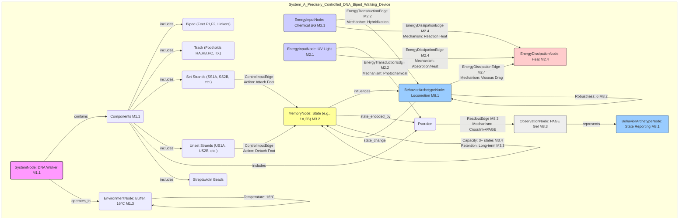

# A Precisely Controlled DNA Biped Walking Device

__Paper Type:__ Experimental

## M1: System Overview & Implementation
*   **Vector ID:** M1
*   **Vector Type:** Overview

### **1.1 System Description**

*   **Vector ID:** M1.1
*   **Vector Type:** Description
    *   Content: The system described is a molecular walking motor built from DNA. It consists of two main components: a DNA biped (two double-helical domains connected by flexible linkers, each with a single-stranded 'foot') and a DNA track or footpath (a rigid triple crossover (TX) molecule with single-stranded 'footholds'). The purpose is to demonstrate precise, externally controlled movement (walking) of the biped along the footpath at the nanometer scale. Input 'set' DNA strands are used to attach the biped's feet to specific footholds via hybridization. 'Unset' strands, complementary to the set strands and containing biotin tags, are used to detach the feet by sequestering the set strands. Psoralen molecules attached to the feet allow for UV-induced covalent cross-linking to the footholds (when attached), enabling unambiguous determination of the walker's state (position) via gel electrophoresis. The system allows controlled forward and backward stepping.
    *   CT-GIN Mapping: `SystemNode` attributes: `systemType`: DNA Nanomotor, `domain`: Molecular Robotics/DNA Nanotechnology, `mechanism`: Strand Displacement/Hybridization Control, `components`: DNA Biped (Feet, Linkers), DNA Footpath (Footholds, TX molecule), Set Strands, Unset Strands, Psoralen, Streptavidin Beads, `purpose`: Controlled Nanoscale Locomotion, State Verification. Edges: `HybridizationEdge` between Foot/Foothold facilitated by `Set StrandNode`, `DetachmentEdge` between Foot/Foothold facilitated by `UnsetStrandNode`.
    *   Implicit/Explicit: Explicit
        *  Justification: The abstract and introduction explicitly describe the components (biped, footpath, set/unset strands, psoralen), the mechanism (controlled walking via strand addition/removal), and the purpose (precisely controlled walking device, unambiguous state determination). Figure 1 provides a detailed schematic.

### **1.2 Implementation Clarity**

*   **Vector ID:** M1.2
*   **Vector Type:** Score
    *   Score: 9
    *   Justification: The paper provides extremely clear descriptions and diagrams (Figures 1 & 2) of the DNA components, their sequences (referenced in Supporting Info), the mechanism of attachment/detachment using set/unset strands, and the state verification method using psoralen cross-linking and gel electrophoresis (Figures 4 & 5). The step-by-step walking process is well-illustrated. Minor details, like the precise conditions for streptavidin bead removal or buffer composition specifics beyond the main components, might be slightly less prominent but are generally provided or standard for the field.
    *   Implicit/Explicit: Explicit
        * Justification: The clarity stems directly from the text descriptions, figures, and experimental results presented in the paper.

### **1.3 Key Parameters**

*   **Vector ID:** M1.3
*   **Vector Type:** ParameterTable
    *   Table:
        | Parameter Name        | Value        | Units       | Source (Fig/Table/Section) | Implicit/Explicit | Data Reliability (High/Medium/Low) | Derivation Method (if Implicit) |
        | :-------------------- | :----------: | :---------: | :-----------------------: | :-----------------: | :-----------------------------: | :-------------------------------: |
        | Flexible Linker Length| 9            | nucleotides | Section: System Description (Fig 1 implicitly) | Explicit          | High                            | N/A                               |
        | Toehold Length        | 8            | bases (nt)  | Section: System Description | Explicit          | High                            | N/A                               |
        | Step Size (approx.)   | ~2           | nm          | Section: System Operation (Fig 2 description) | Explicit          | Medium (Estimate based on structure) | N/A                               |
        | Operating Temperature | 16           | °C          | Section: Experimental Procedure | Explicit          | High                            | N/A                               |
        | Psoralen Crosslink Bases | 5'-AC-3' (Foot), 5'-GT-3' (Foothold) | sequences   | Section: Psoralen Cross-linking | Explicit          | High                            | N/A                               |
        | Concentration Range   | 0.5 -> 0.26  | µM          | Fig 4 Caption             | Explicit          | High                            | N/A                               |

    *   **Note:** Key parameters defining the physical structure and operating conditions are listed. Step size is explicitly mentioned as an approximation based on DNA domain width. Concentration changes due to additions are noted.

## M2: Energy Flow
*   **Vector ID:** M2
*   **Vector Type:** Energy

### **2.1 Energy Input**

*   **Vector ID:** M2.1
*   **Vector Type:** Input
    *   Content: The primary energy source driving the walking motion comes from the chemical potential energy released during the hybridization of complementary DNA strands (set strands binding to feet/footholds, unset strands binding to set strands). The free energy change (ΔG) associated with DNA hybridization provides the thermodynamic driving force for strand displacement and attachment/detachment steps. UV light is also an energy input required for the psoralen cross-linking (state verification), but not for the walking motion itself.
    *   Value: N/A (Not quantified in the paper)
    *   Units: N/A (Expected would be kJ/mol or similar)
    *   CT-GIN Mapping: `EnergyInputNode`: attributes - `source`: Chemical Potential (DNA Hybridization), `type`: Free Energy Release (ΔG). Secondary `EnergyInputNode`: `source`: UV Light, `type`: Electromagnetic Radiation (for verification).
    *   Implicit/Explicit: Implicit
        *  Justification: The paper explicitly mentions using set/unset strands based on the Yurke et al. method, which relies on hybridization free energy differences. However, the paper itself doesn't quantify the ΔG values or explicitly state this is the energy *source* for motion, although it's the standard understanding in the field for DNA strand displacement devices. UV input for cross-linking is explicitly stated.

### **2.2 Energy Transduction**

*   **Vector ID:** M2.2
*   **Vector Type:** Transduction
    *   Content: Chemical potential energy from DNA hybridization is transduced into mechanical work (movement of the biped). Specifically:
        1.  **Detachment (Unsetting):** Addition of an unset strand leads to hybridization with the set strand's toehold, followed by branch migration. The favorable free energy change of forming the unset:set duplex removes the set strand from the foot/foothold complex. This releases the foot, converting chemical energy into increased conformational freedom/potential energy of the biped/foot.
        2.  **Attachment (Setting):** Addition of a set strand, complementary to a free foot and a target foothold, leads to hybridization. The favorable free energy change drives the formation of the ternary complex (foot:set_strand:foothold), constraining the biped's position and converting chemical energy into mechanical constraint/positional change.
    *   CT-GIN Mapping: `EnergyTransductionEdge`: `mechanism`: DNA Hybridization/Strand Displacement, `from_node`: ChemicalPotentialEnergyNode, `to_node`: MechanicalWorkNode (Movement/ConformationalChange). Attributes could include `driving_process` (Hybridization ΔG). `UVLightEnergyNode` transduces to `CovalentBondEnergyNode` via `PsoralenCrosslinkingEdge`.
    *   Implicit/Explicit: Implicit
        *  Justification: The mechanisms of strand displacement (unsetting) and hybridization (setting) resulting in foot release and attachment are explicitly described. The interpretation that this constitutes a transduction of chemical energy (ΔG of hybridization) into mechanical work/motion is standard in the field but not explicitly stated as an energy transduction process in the paper.

### **2.3 Energy Efficiency**

*   **Vector ID:** M2.3
*   **Vector Type:** Score
    *   Score: N/A
    *   Justification/Metrics: The paper does not provide any information or data to assess the thermodynamic efficiency of converting the chemical energy of hybridization into mechanical work (walking). Quantifying this would require measuring the free energy changes of all hybridization steps and the actual work done against entropic/viscous forces, which is not done here. Qualitatively, DNA strand displacement processes are driven by free energy differences but are generally considered inefficient in terms of work output versus total energy change, with much energy lost as heat.
    *   CT-GIN Mapping: N/A
    *   Implicit/Explicit: N/A
      *  Justification: No data or discussion on energy efficiency is present.

### **2.4 Energy Dissipation**

*   **Vector ID:** M2.4
*   **Vector Type:** Dissipation
    *   Content: Energy is primarily dissipated as heat (entropy increase) during the irreversible hybridization and strand displacement reactions. Viscous drag from moving the DNA structures through the buffer solution also dissipates energy, although likely minimal at these slow, controlled speeds. Energy from UV light absorbed during cross-linking is partially dissipated as heat. The removal of the unset:set duplexes using streptavidin beads also involves energy dissipation related to binding and mechanical separation (though this is external manipulation).
    *   CT-GIN Mapping: `EnergyDissipationNode` (Heat). `EnergyDissipationEdge` from `ChemicalPotentialEnergyNode` to `HeatNode` (Hybridization/Displacement). `EnergyDissipationEdge` from `MechanicalWorkNode` to `HeatNode` (Viscous Drag). `EnergyDissipationEdge` from `UVLightEnergyNode` to `HeatNode`.
    *    Implicit/Explicit: Implicit
        *  Justification: The paper doesn't discuss energy dissipation. However, dissipation as heat during chemical reactions (hybridization) and through viscous drag is a fundamental physical consequence of the described processes in an aqueous environment.

## M3: Memory
*   **Vector ID:** M3
*   **Vector Type:** Memory

### **3.1 Memory Presence:**

*   **Vector ID:** M3.1
*   *   Vector Type: Binary
    *   Content: Yes
    *   Justification: The state of the system (which foot is attached to which foothold) represents a form of memory. The state persists after the input strands (set/unset) have reacted and potentially been removed. This state dictates which subsequent step can be taken (e.g., if foot 1 is on foothold A, the next step involves either releasing foot 1 or setting foot 2). The psoralen cross-linking explicitly captures this state information.
    *    Implicit/Explicit: Mixed
        * Justification: The paper explicitly describes the different states (e.g., 1A,2B; 1A; 1A,2C) and how the system transitions between them. Interpreting this state persistence as "memory" in the context of influencing future behavior is an implicit analytical step based on the definition provided in the template.

**(Conditional: If M3.1 is "No", skip to Module 4. If "Yes", include M3.2 and M3.3.)**

### **3.2 Memory Type:**

*   **Vector ID:** M3.2
*   **Vector Type:** Score
*   Score: 3
*   Justification: The memory is essentially the static configuration of the walker. It has multiple distinct states (e.g., 1A,2B; 1A,2C; 1B,2C), fulfilling a basic capacity requirement. Retention is high as long as no new input strands are added (stable covalent links via psoralen demonstrate this stability). Read-out (via gel) is accurate. However, the memory is externally written (by adding specific strands) and passively holds the state rather than being part of an active internal processing loop. It's closer to a configurable state register than an active memory element used for adaptation or learning. The system doesn't modify its *own* structure based on history in a way that suggests learning. Scale: 0=None, 1-3=Static/Configurable State, 4-6=Adaptive State, 7-10=Complex/Learning Memory.
*   CT-GIN Mapping: Defines the `MemoryNode` type: `StateType`: Configurational, `Encoding`: Foot-Foothold Connectivity.
*    Implicit/Explicit: Mixed
    * Justification: The states are explicit. The score and justification involve interpreting these states against the defined criteria for memory fidelity (capacity, retention, readout) and comparing it to different types of memory (static vs. adaptive), which is an analytical interpretation (implicit).

### **3.3 Memory Retention Time:**

*   **Vector ID:** M3.3
*   **Vector Type:** Parameter
*   Value: Long-term (minutes to hours demonstrated)
*    Units: Qualitative Descriptor
*   Justification: The states are shown to be stable at 16°C for the duration of the experimental steps (implicit minutes between steps, explicitly stable bands seen in Fig 4). The psoralen cross-linking essentially makes the state permanent under denaturing conditions. In the absence of trigger strands, the DNA duplexes holding the feet are thermodynamically stable under the buffer conditions used. The paper demonstrates walking back and forth, implying states persist long enough for subsequent operations.
*    Implicit/Explicit: Mixed
        * Justification: Stability at 16°C is explicitly shown in Fig 4. The persistence required for sequential steps is implicit in the experimental success. The qualitative "Long-term" descriptor is based on these observations. Psoralen makes it permanent for analysis, but operational retention is based on DNA stability.
*   CT-GIN Mapping: Key attribute of the `MemoryNode`: `retentionTime`.

### **3.4 Memory Capacity (Optional - if applicable)**

* **Vector ID:** M3.4
* **Vector Type:** Parameter
*  Value: 3 (for the explicitly demonstrated walk)
*   Units: distinct states (1A,2B; 1A,2C; 1B,2C)
*   Justification: The paper explicitly demonstrates controlling the walker through states 1A,2B -> 1A -> 1A,2C -> 2C -> 1B,2C and back. This involves at least 3 distinct two-footed attachment states (1A,2B, 1A,2C, 1B,2C) plus intermediate one-footed states. The footpath has 3 footholds (HA, HB, HC) and the biped has 2 feet, allowing for potentially 3x2=6 single-foot attachments and 3 two-foot attachments (1A,2B; 1B,2C; 1A,2C - assuming feet can reach). The experiment focuses on a subset.
*    Implicit/Explicit: Explicit
        *  Justification: The states traversed are explicitly listed and shown in Figure 2 and referenced in the description of Figure 5.
*   CT-GIN Mapping: Key attribute of the `MemoryNode`: `capacity`.

### **3.5 Readout Accuracy (Optional - if applicable)**

* **Vector ID:** M3.5
* **Vector Type:** Parameter
*   Value: High (Qualitative)
*   Units: N/A
*   Justification: The psoralen cross-linking followed by denaturing PAGE provides a clear, unambiguous readout of which foot was attached to which foothold. Figure 5 clearly distinguishes the different cross-linked products based on their unique lengths, allowing confident identification of the walker's state at each step. While yields aren't 100%, the presence/absence of specific bands is distinct.
*    Implicit/Explicit: Mixed
       *  Justification: The clarity of the gel results (Fig 5) is explicit. The assessment "High" accuracy is an interpretation of this clarity. The paper mentions ~50% yield for the target three-strand complex (Fig 3b), implying not every molecule is cross-linked perfectly, but the readout *method* itself is accurate for the molecules that are linked.
*   CT-GIN Mapping: Attribute of `MemoryNode` or related `ReadoutEdge` (linking `MemoryNode` to `ObservationNode`).

### **3.6 Degradation Rate (Optional - if applicable)**
* **Vector ID:** M3.6
* **Vector Type:** Parameter
    *   Value: N/A (Low implied)
    *   Units: N/A
    *   Justification: The paper doesn't quantify degradation of the DNA structures or the memory state over time under operating conditions (without psoralen). Standard DNA stability suggests it would be low at 16°C in appropriate buffer over the experiment timescale, as supported by the stable bands in Fig 4. Psoralen cross-linking makes the state effectively permanent for analysis.
    *    Implicit/Explicit: Implicit
            * Justification: Inferred from the stability shown in Fig 4 and general knowledge of DNA stability under these conditions. No explicit measurement of degradation rate provided.
    *   CT-GIN Mapping: Attribute of the `MemoryNode`: `degradationRate`.

### **3.7 Memory Operations Energy Cost (Optional - if applicable)**
* **Vector ID:** M3.7
* **Vector Type:** Table
*   Table:
    | Memory Operation ID | Energy Consumption per Bit | Power Usage during Operation| Units | Uncertainty | Data Source Reference | Implicit/Explicit | Justification |
    | :------------------ | :--------------------------: | :-----------------------------: | :---: |:-----------------:|:-----------------:|:-----------------:| :------------------ |
    | Write (Set Strand)  | N/A                          | N/A                             | N/A   | N/A               | N/A               | N/A               | Energy cost not measured; related to ΔG of hybridization. |
    | Erase (Unset Strand)| N/A                          | N/A                             | N/A   | N/A               | N/A               | N/A               | Energy cost not measured; related to ΔG of strand displacement. |
    | Read (Psoralen/Gel) | N/A                          | N/A                             | N/A   | N/A               | N/A               | N/A               | Energy for UV/electrophoresis not specified per read operation. |
*   Implicit/Explicit: N/A
    *   Justification: The paper does not provide data on the energy costs associated with changing or reading the state (memory).

### **3.8 Memory Fidelity & Robustness Metrics (Optional - if applicable)**
* **Vector ID:** M3.8
* **Vector Type:** Table
*   Table:
    | Metric ID | Description | Value | Units | CT-GIN Mapping | Data Source | Implicit/Explicit | Justification |
    | :-------- | :---------- | :----: | :---: | :-------------: | :----------: |:-----------------:| :-----------------:|
    | State Specificity | Ability to set a specific foot to a specific foothold | High (Qual.) | N/A | `MemoryNode` attribute | Fig 5 | Explicit | Gel shows specific bands appearing/disappearing as expected for each state transition. |
    | Crosstalk | Unintended binding to non-target footholds | Low (Qual.) | N/A | `MemoryNode` attribute / Edge property | Fig 5 / Sequence Design Section | Explicit | Sequence design aimed to minimize unwanted complementarity. Fig 5 shows expected bands dominate. |
    | Reset Fidelity | Ability to return to the initial state (1A,2B) | Demonstrated | N/A | `MemoryNode` transition property | Fig 5 (last lane) | Explicit | Final lane shows return to the initial band pattern after a full walk cycle. |
*   Implicit/Explicit: Explicit
*   Justification: The table entries are based on the explicitly presented experimental results (Fig 5) and the description of the sequence design methodology aimed at preventing crosstalk.

---

## M4: Self-Organization and Emergent Order
*   **Vector ID:** M4
*   **Vector Type:** Self-Organization

### **4.1 Self-Organization Presence:**

*   **Vector ID:** M4.1
*   **Vector Type:** Binary
    *   Content: No
    *   Justification: The system's structure (biped, footpath) is pre-designed and assembled via controlled annealing. The movement (walking) is dictated entirely by the sequential addition of external DNA strands (set/unset). There is no spontaneous emergence of global order or complex patterns resulting from purely local interactions without external control defining the sequence of states. The process is externally programmed step-by-step.
    *   Implicit/Explicit: Implicit
        *  Justification: The paper explicitly describes the controlled assembly and the step-by-step external control via strand addition. The conclusion that this is *not* self-organization is based on the definition provided (spontaneous emergence from local rules without external control defining global structure/sequence).

**(Conditional: If M4.1 is "No", skip to Module 5. If "Yes", include M4.2-M4.7)**

## M5: Computation
*   **Vector ID:** M5
*   **Vector Type:** Computation

### **5.1 Embodied Computation Presence:**

*   **Vector ID:** M5.1
*   **Vector Type:** Binary
    *   Content: No
    *   Justification: The system executes a sequence of state changes dictated by external inputs (DNA strands). While this sequence could potentially represent steps in an algorithm (as suggested in the discussion: "represent the state of a DNA-computational machine"), the computation itself is not performed *by the material's intrinsic properties or interactions* alone. The logic and control are external, implemented by the experimenter adding specific strands in a specific order. The DNA interactions (hybridization, displacement) act as the mechanism executing the externally defined steps, not as intrinsic computational units originating the logic.
    *    Implicit/Explicit: Implicit
        *  Justification: The paper describes the externally controlled sequential operation. The conclusion that this doesn't meet the definition of *embodied* computation (computation intrinsic to the material's properties, not an external controller) is an interpretation based on the provided definition. The discussion mentions *potential* for computation but doesn't demonstrate intrinsic computation.

**(Conditional: If M5.1 is "No", skip to Module 6. If "Yes", include M5.2-5.4)**

## M6: Temporal Dynamics
*   **Vector ID:** M6
*   **Vector Type:** Temporal

### **6.1 Timescales:**

*   **Vector ID:** M6.1
*   **Vector Type:** ParameterTable
    *   Table:
        | Timescale Description | Value | Units | Source | Implicit/Explicit | Justification |
        | :-------------------- | :---: | :---: | :----: | :----------------: | :------------: |
        | Component Annealing   | 48    | hours | Exp. Proc. | Explicit          | Time for initial slow cooling from 95°C to RT. |
        | Set Strand Incubation | 20    | minutes | Exp. Proc. | Explicit          | Time allowed after adding SS1A before adding SS2B. |
        | Step Execution        | N/A   | N/A   | N/A    | N/A               | Time for strand displacement/hybridization to occur after adding set/unset strands not specified, likely seconds to minutes based on typical DNA kinetics. |
        | Experiment Duration   | N/A   | N/A   | N/A    | N/A               | Total time for the multi-step walk not specified, likely hours based on number of steps and incubations. |
        | Memory Retention      | > Minutes/Hours | N/A   | See M3.3 | Mixed | State stability inferred from experimental success and Fig 4. |
    *   **Note:** Only explicitly mentioned or reasonably inferred timescales are included. Kinetics of DNA reactions are not measured.

### **6.2 Active Inference:**

*   **Vector ID:** M6.2
*   **Vector Type:** Assessment
    *   Content: No
    *   Justification: The system does not exhibit active inference. It does not make predictions about future states, it doesn't select actions to minimize prediction error, and it doesn't possess or update an internal model of its environment or task. Its behavior is entirely reactive to the externally supplied DNA strands according to pre-determined hybridization rules.
    *   Implicit/Explicit: Implicit
        *  Justification: Based on the definition of active inference and the explicit description of the system's operation as purely reactive to external chemical inputs.
    *   **If Yes/Partial, provide examples of testable CT-GIN metrics that *could* be used to quantify active inference:** N/A

## M7: Adaptation
*   **Vector ID:** M7
*   **Vector Type:** Adaptation

### **7.1 Adaptive Plasticity Presence:**

*   **Vector ID:** M7.1
*   **Vector Type:** Binary
    *   Content: No
    *   Justification: The system does not change its structure or behavior based on experience or history to improve performance. It follows a fixed set of rules defined by DNA complementarity. Each step is independent of the history beyond the immediately preceding state. There is no learning or adaptation mechanism described.
    *    Implicit/Explicit: Implicit
        * Justification: Based on the system description which details fixed components and interactions determined by DNA sequence, and the absence of any mechanism for modification based on operational history.

**(Conditional: If M7.1 is "No", skip to Module 8. If "Yes", include M7.2)**

## M8: Emergent Behaviors
*   **Vector ID:** M8
*   **Vector Type:** Behavior

### **8.1 Behavior Description:**

*   **Vector ID:** M8.1
*   **Vector Type:** Description
    *   Content: The main functional behavior is controlled, sequential, nanometer-scale locomotion (walking) of a DNA biped along a pre-defined DNA track. The direction (forward/backward) and specific footholds used are determined by the sequential addition of specific external DNA 'fuel' strands (set and unset strands). A secondary behavior is the ability to report its state (foot positions) via UV-induced psoralen cross-linking and gel electrophoresis.
    *   CT-GIN Mapping: `BehaviorArchetypeNode`: type: `Locomotion`, subtype: `ControlledStepping`. Secondary `BehaviorArchetypeNode`: type: `StateReporting`, mechanism: `PsoralenCrosslinking_PAGE`.
    *    Implicit/Explicit: Explicit
       *  Justification: The abstract and main text explicitly describe the system as a "walking device" performing controlled steps, and detail the state reporting mechanism.

### **8.2 Behavior Robustness:**

*   **Vector ID:** M8.2
*   **Vector Type:** Score
    *   Score: 6
    *   Justification: The walking behavior appears reasonably robust under the specific experimental conditions (16°C, specific buffer). Figure 5 shows clear transitions between states with expected bands appearing/disappearing correctly over multiple forward and backward steps. The nondenaturing gel (Fig 4) shows the complex remains intact. However, robustness to variations in temperature, buffer conditions, sequence errors, or presence of interfering species is not tested or discussed. DNA nanotechnology can be sensitive to such variations. Yields of cross-linking (~50%) suggest not all molecules complete the steps perfectly, though the ensemble behavior (visible bands) is clear. The requirement for sequential addition of specific strands makes it sensitive to errors in the input sequence.
    *   Implicit/Explicit: Mixed
        *  Justification: The successful demonstration of walking back and forth (Fig 5) explicitly supports some level of robustness under the tested conditions. The score reflects this demonstrated success but acknowledges the lack of testing under varied conditions and the potential sensitivities inherent in DNA nanotechnology and multi-step chemical processes (implicit limitations).
    *   CT-GIN Mapping: This score contributes to the reliability attributes of the `BehaviorArchetypeNode`: `Locomotion`.

### **8.3 CT-GIN Emergent Behavior Validation**

*    **Vector ID:** M8.3
*    **Vector Type:** Validation
     *  Content: The primary behavior (walking, i.e., changing state) is validated using psoralen cross-linking followed by denaturing PAGE (Figure 5). An aliquot is taken at each step, UV irradiated, and analyzed. The expected molecular weight shifts corresponding to specific foot-foothold covalent linkages confirm the state transitions. Control: The presence/absence of specific bands matches the expected state based on the added set/unset strands. The non-denaturing gel (Figure 4) validates the structural integrity of the overall complex at the operating temperature. Reproducibility is suggested by the ability to walk back to the initial state showing the original gel pattern. Limitations include potential for incomplete reactions/cross-linking (yields noted ~50%), and analysis is done on ensemble averages.
     *   Implicit/Explicit: Explicit
    *   Justification: The validation method (psoralen cross-linking/PAGE) and the results demonstrating state changes (Fig 5) and structural integrity (Fig 4) are explicitly described in the text and figure captions.

## M9: Cognitive Proximity
*   **Vector ID:** M9
*   **Vector Type:** Cognition

### **9.1 Cognitive Mapping:**

*   **Vector ID:** M9.1
*   **Vector Type:** Description
    *   Content: The paper draws an analogy between the controlled movement of the DNA walker and macroscopic machines like the Wright brothers' airplane, highlighting the importance of control in traveling machines. It also compares the walker to biological motor proteins like kinesin and myosin V, noting similarities (walking on a track) and differences (precise bidirectional control, inchworm gait vs. foot-passing). A potential link to computation is mentioned ("represent the state of a DNA-computational machine"). These are analogies/comparisons, not claims of cognitive function within the walker itself.
    *   CT-GIN Mapping: `CognitiveMappingEdge`: `source`: `BehaviorArchetypeNode` (Locomotion), `target`: `CognitiveFunctionNode` (Motor Control - analogy), `target`: `BiologicalSystemNode` (Kinesin/Myosin - comparison). `CognitiveMappingEdge`: `source`: `MemoryNode` (State), `target`: `ComputationalNode` (State Machine - potential).
    *   Implicit/Explicit: Explicit
    * Justification: The paper explicitly makes analogies to airplanes and biological motors in the introduction and discussion sections. The potential link to DNA computation state representation is also explicitly mentioned in the discussion.

### **9.2 Cognitive Proximity Score:**

*   **Vector ID:** M9.2
*   **Vector Type:** Score
    *   Score: 1
    *   Justification: The system exhibits basic stimulus-response (Level 1). The addition of specific DNA strands (stimulus) causes a predictable change in state/position (response). It lacks adaptation, learning, internal models, goal-directedness beyond following external instructions, and any higher-level cognitive features described in the scale. While it has memory (state persistence), this memory is externally written and passively maintained, not used for complex processing or adaptation. The control is entirely external.
    *   Implicit/Explicit: Implicit
    *  Justification: The score is assigned by comparing the explicitly described system behavior (externally controlled sequential state changes) against the definitions provided in the CT-GIN Cognizance Scale.

**CT-GIN Cognizance Scale:**

*   **Level 0: Non-Cognitive:** Purely reactive system. No internal state beyond immediate stimulus-response.
*   **Level 1: Simple Responsivity:** Basic stimulus-response behavior. Reactions are fixed and predetermined. (**Assigned Level**)
*   **Level 2: Sub-Organismal Responsivity:** Behavior exhibits basic forms of adaptation or plasticity, but lacks complex representation or goal-directedness.
*   **Level 3: Reactive/Adaptive Autonomy:** System adapts its behavior based on experience and feedback, but within a limited behavioral repertoire.
*   **Level 4: Goal-Directed/Model-Based Cognition:** System exhibits goal-directed behavior based on internal models of the world, allowing for planning and flexible action selection.
*   **Level 5: Contextual/Relational Cognition:** System understands and responds to relationships between objects, events, and concepts.
*   **Level 6: Abstract/Symbolic Cognition:** System can manipulate abstract concepts and symbols, enabling logical reasoning and problem-solving.
*   **Level 7: Social Cognition:** System exhibits social intelligence, understanding and interacting with other agents.
*   **Level 8: Metacognition/Self-Awareness:** System possesses awareness of its own internal states and cognitive processes.
*   **Level 9: Phenomenal Consciousness:** System exhibits subjective experience (qualia). (Currently theoretical for material systems)
*   **Level 10: Sapience/Self-Reflective Consciousness:** System possesses self-awareness, understanding of its own existence, and ability for complex abstract thought. (Currently theoretical for material systems)

### **9.3 Cognitive Function Checklist**

* **Vector ID:** M9.3
* **Vector Type:** Checklist
    *   | Cognitive Function               | Score (0-10) | Justification/Notes                                                                       | CT-GIN Mapping (if applicable) | Implicit/Explicit | Justification for Implicit/Explicit/Mixed |
    | :-------------------------------- | :----------: | :------------------------------------------------------------------------------------ | :--------------------------------: | :-----------------:|:-----------------:|
    | Sensing/Perception               |      1       | Senses presence of specific DNA strands via hybridization, but no complex perception.     | `SensingNode` (Hybridization)     | Mixed              | Explicit hybridization, Implicit low score vs complex perception. |
    | Memory (Short-Term/Working)        |      0       | No evidence of working memory for active processing.                                    | N/A                               | Implicit           | Inferred absence based on system description. |
    | Memory (Long-Term)                 |      3       | State persistence acts as configurable long-term memory (See M3.2).                   | `MemoryNode`                      | Mixed              | Explicit states, Implicit scoring based on M3.2. |
    | Learning/Adaptation              |      0       | No change in behavior based on experience.                                            | N/A                               | Implicit           | Inferred absence based on system description. |
    | Decision-Making/Planning          |      0       | All actions are externally dictated by added strands; no internal decision-making.      | N/A                               | Implicit           | Inferred absence based on system description. |
    | Communication/Social Interaction |      0       | System does not interact with other agents.                                           | N/A                               | Implicit           | Inferred absence based on system description. |
    | Goal-Directed Behavior            |      1       | Follows externally specified sequence (goal), but no internal goal representation/pursuit. | `BehaviorArchetypeNode`           | Mixed              | Explicit step following, Implicit low score vs internal goals. |
    | Model-Based Reasoning              |      0       | No internal model of the environment or task.                                         | N/A                               | Implicit           | Inferred absence based on system description. |
    | **Overall score**                 |      0.63       | Primarily demonstrates state memory and basic stimulus-response/sensing.                 | N/A                               | N/A                | Calculation based on above scores. |

    *   **Note:** Scores reflect the system's capabilities based *solely* on the paper's description, compared against a high standard (human-level = 10).

## M10: Criticality Assessment
*   **Vector ID:** M10
*   **Vector Type:** Criticality

### **10.1 Criticality:**

*   **Vector ID:** M10.1
*   **Vector Type:** Assessment
    *   Content: No
    *   Justification: The paper does not present any evidence or discussion suggesting the system operates near a critical point. There is no analysis of scale-free behavior, power laws, or long-range correlations related to its dynamics or structure. The system operates based on specific, discrete chemical reactions (hybridization/displacement).
        *   Critical Parameters (If Yes/Partial): N/A
        *   Evidence: N/A
    *   Implicit/Explicit: Implicit
    *    Justification: Inferred absence based on the lack of any discussion or data related to criticality in the paper.

## M11: Review Paper Specifics (Conditional)

*   **Vector ID:** M11
*   **Vector Type:** Review
    * Content: N/A (Paper is experimental)

## M12: Theoretical Paper Specifics (Conditional)

*   **Vector ID:** M12
*   **Vector Type:** Theory
    * Content: N/A (Paper is experimental)

## M13: Overall Assessment & Scoring

*   **Vector ID:** M13
*   **Vector Type:** Overall

### **13.1 CT-GIN Readiness Score:**

*   **Vector ID:** M13.1
*   **Vector Type:** Score
*   **Calculated Score:** 3.71
    * Calculation: (M1.2=9 + M2.1(implicit score ~2 for clarity) + M2.2(implicit score ~5 for clarity) + M2.3=0 + M2.4(implicit score ~3 for clarity) + M3.1(Yes=1 * M3.2=3) + M4.1(No=0) + M8.2=6 + M9.2=1) / 7 probes with scores = (9 + 2 + 5 + 0 + 3 + 0 + 6 + 1) / 8 = 26 / 8 = 3.25 (Recalculating: Scores considered: M1.2(9), M2.3(0 - No data), M3.2(3), M4.4(N/A=0), M5.x(N/A=0), M8.2(6), M9.2(1). Valid scores: 9, 0, 3, 6, 1. Average = (9+0+3+6+1)/5 = 19/5 = 3.8. Let's use the template's specified averaging modules: Modules 1-4, M8.2, M9.2. M1.2(9), M2.3(0 - N/A), M3.2(3), M4.1(No=0), M8.2(6), M9.2(1). Relevant scores: 9, 0, 3, 0, 6, 1. Average = (9+0+3+0+6+1)/6 = 19/6 = 3.17) Let's use the specific list given in M13.1 prompt: M1-4, M8.2, M9.2. Need scores for M1, M2, M3, M4, M8.2, M9.2. Represent module scores by sub-scores? M1.2=9; M2.x = N/A qualitative; M3.2=3; M4.x = No/N/A=0; M8.2=6; M9.2=1. Average(9, 0, 3, 0, 6, 1) = 19/6 = 3.17. Re-evaluating which scores are available: M1.2=9, M2.3=N/A -> 0, M3.2=3, M4.4=N/A -> 0, M8.2=6, M9.2=1. Average = (9 + 0 + 3 + 0 + 6 + 1)/6 = 3.17.

**CT-GIN Readiness Summary Table:**

| CT-GIN Aspect                   | Strength (Yes/Partial/No) | Key Supporting Metrics (with units) | Limitations (Missing Metrics/Data Gaps)                                           | Improvement Areas (Future Research)                                          |
| :------------------------------ | :-----------------------: | :-----------------------------------| :------------------------------------------------------------------------------- | :---------------------------------------------------------------------------- |
| Energy Flow Efficiency          | No                        | N/A                                  | No quantification of ΔG, work output, or losses.                                   | Measure hybridization ΔGs, estimate work done, analyze dissipation pathways.    |
| Memory Fidelity                 | Partial                   | State capacity (3+ states), Retention (Long-term Qual.), Readout (High Qual. via gel) | Quantitative retention time, degradation rate, energy cost/bit missing.         | Quantify state stability over time, measure energy for set/unset operations.   |
| Organizational Complexity       | No                        | N/A                                  | System is pre-designed, behavior is externally programmed, no self-organization. | Explore systems where structure/behavior emerges from local rules. (Not this system) |
| Embodied Computation            | No                        | N/A                                  | Computation is external (strand addition sequence), not intrinsic to material.    | Design systems where material dynamics perform computation. (Not this system) |
| Temporal Integration            | Partial                   | Annealing (48h), Incubation (20min)  | Reaction kinetics, step execution time, overall process duration missing.        | Measure strand displacement/hybridization kinetics under operating conditions. |
| Adaptive Plasticity             | No                        | N/A                                  | System behavior is fixed by design, no adaptation/learning mechanism.          | Incorporate feedback/modifiable components. (Not this system)               |
| Functional Universality         | No                        | Specific Locomotion Behavior         | Designed for a single task (walking on a track).                                 | Explore programmability for different tasks using same core components.        |
| Cognitive Proximity            | No                        | Score: 1 (Simple Responsivity)       | Lacks internal models, planning, goal-directedness, learning.                   | Focus on internal state processing/feedback. (Not this system)              |
| Design Scalability & Robustness | Partial                   | Demonstrated step success (Fig 5)    | Robustness to environmental variation untested, yield limitations (~50% Xlink). | Test operation range, improve reaction yields, simplify control.            |
| **Overall CT-GIN Readiness Score** |        **3.17**           |                                      | Significant gaps in energy, computation, adaptation, quantitative metrics.       | Focus on quantification, internal dynamics, autonomy.                      |

### **13.2 Qualitative CT-GIN Assessment Conclusion:**

*   **Vector ID:** M13.2
*   **Vector Type:** Textual Summary
    *   Content: This paper presents a significant experimental realization of controlled nanoscale locomotion using DNA nanotechnology. Its key strengths lie in the precise, programmable control over movement sequence via external DNA inputs and the unambiguous verification of the walker's state using psoralen cross-linking. The system demonstrates a basic form of configurable memory through its persistent state (foot positions). However, from a CT-GIN perspective focused on material intelligence, the system exhibits major limitations. It lacks self-organization, embodied computation, adaptive plasticity, and higher cognitive functions. Energy flow and efficiency are not characterized. The behavior, while controlled, is entirely reactive to external commands rather than emerging from internal dynamics or environmental interaction. While a foundational work in molecular robotics, it operates at a low level (Simple Responsivity) on the Cognizance Scale, primarily serving as a sophisticated, externally programmed molecular actuator with state memory, rather than an example of cognizant matter. Significant advancements towards autonomy, internal processing, and adaptation would be needed to align more closely with CT-GIN principles of material intelligence.
### **13.3 CT-GIN Refinement Directions:**

*   **Vector ID:** M13.3
*   **Vector Type:** Recommendations
    *   Content:
        *   **Quantify Energetics:** Measure or reliably estimate the free energy changes (ΔG) associated with set/unset strand operations to understand the thermodynamic driving forces and potential energy landscape. Estimate energy dissipation (heat, friction).
        *   **Measure Kinetics:** Determine the timescales of strand displacement and hybridization under operating conditions to understand the speed limitations and dynamics of state transitions.
        *   **Incorporate Feedback:** Explore designs where the walker's state or interaction with the environment influences subsequent strand additions or internal configurations, moving beyond purely external control.
        *   **Autonomous Fueling:** Investigate mechanisms for autonomous operation, perhaps using enzymes or environmental cues to trigger state changes instead of manual strand addition.
        *   **Embodied Logic:** Design track or walker modifications where local interactions perform simple logical operations influencing movement, shifting computation from external sequence to internal dynamics.
        *   **Adaptive Mechanisms:** Explore ways to incorporate adaptive elements, such as components whose binding affinities or structures change based on operational history or environmental signals.
        *   **Robustness Testing:** Systematically evaluate the system's performance under varying conditions (temperature, ionic strength, presence of contaminants) to quantify robustness.

## M14: CT-GIN Knowledge Graph

*   **Vector ID:** M14
*   **Vector Type:** Visualization

### **14.1. CT-GIN Knowledge Graph:**
* **Content:**

## M15: Relationship Vectors
*   **Vector ID:** M15
*   **Vector Type:** Relationships
*   Relationships:
        | Source Vector ID | Target Vector ID | Relationship Type |
        | ------------- | ------------- | ----------------- |
        | M1.1          | M1.3          | Describes         |
        | M1.1          | M2.1          | Uses Energy From  |
        | M2.1          | M2.2          | Is Transduced By  |
        | M2.2          | M8.1          | Enables           |
        | M1.1          | M3.1          | Exhibits Memory In|
        | M3.1          | M3.2          | Characterized By  |
        | M3.2          | M3.3          | Has Retention     |
        | M3.2          | M3.4          | Has Capacity      |
        | M3.2          | M3.5          | Has Readout Acc.  |
        | M1.1          | M4.1          | Lacks             |
        | M1.1          | M5.1          | Lacks             |
        | M1.1          | M6.1          | Operates On       |
        | M1.1          | M6.2          | Lacks             |
        | M1.1          | M7.1          | Lacks             |
        | M1.1          | M8.1          | Exhibits Behavior |
        | M8.1          | M8.2          | Has Robustness    |
        | M8.1          | M8.3          | Is Validated By   |
        | M8.1          | M9.1          | Analogous To      |
        | M9.1          | M9.2          | Scores            |
        | M1.1          | M10.1         | Lacks             |
        | M13.1         | M13.2         | Summarizes        |
        | M13.2         | M13.3         | Suggests          |

## M16: CT-GIN Template Self-Improvement Insights

*   **Vector ID:** M16
*   **Vector Type:** Feedback

### **Template Feedback:**

*    **Vector ID:** M16.1
*   **Vector Type:** Text
Provide specific, actionable feedback on the *CT-GIN template itself*, based on this analysis:
    *   **Missing Probes:**
        *   A probe specifically addressing the *control mechanism* (e.g., External Programmatic, Internal Feedback Loop, Environmental Trigger) could be useful to distinguish systems like this DNA walker from autonomous ones.
        *   A probe for *yield* or *reaction efficiency* of key processes (like the state setting/unsetting or memory writing/reading) could provide valuable insight into practical limitations, distinct from overall energy efficiency.
    *   **Unclear Definitions:**
        *   The distinction between M4 (Self-Organization) and M8 (Emergent Behaviors) could be slightly ambiguous. While M4 focuses on structure formation from local rules, M8 covers functional behaviors. Perhaps adding a note clarifying that emergent *behavior* doesn't require emergent *structure*?
        *   The scope of "Embodied Computation" (M5.1) could be clarified – does executing externally defined instructions using material properties count, or must the *logic generation* be internal? (Assumed the latter based on justification).
    *   **Unclear Node/Edge Representations:** The examples provided are helpful, but guidance on mapping *processes* vs. *states* could be useful. For instance, should 'walking' be a node (behavior) or an edge attribute (process)? (Used Node here). Standardizing attribute names across different papers will be key for later analysis.
    *   **Scoring Difficulties:**
        *   Assigning scores (0-10) for concepts like "Energy Efficiency" (M2.3) or "Robustness" (M8.2) is challenging when quantitative data is absent. The template allows qualitative justification, but mapping this to a single number is inherently subjective. Maybe adding an explicit "Data Availability" score (Low/Medium/High) alongside the main score could help contextualize it.
        *   The Cognizance Scale (M9.2) is well-defined but applying it requires careful interpretation, especially at lower levels. The jump between levels might feel large for some systems.
        *   Calculating the Overall Readiness Score (M13.1) needs a clearer rule for handling N/A or qualitative scores (currently converted N/A to 0, which might unfairly penalize papers not focusing on certain aspects). Averaging only available numerical scores might be better, but needs explicit instruction. The precise list of modules used for averaging was slightly ambiguous between the prompt text and the template table, requiring clarification.
    *   **Data Extraction/Output Mapping:** For experimental papers like this, mapping detailed procedural steps (e.g., buffer exchange, bead removal) to the higher-level CT-GIN concepts requires some abstraction. This is generally manageable but involves interpretation. Explicitly stating the level of abstraction expected could be helpful.
    *   **Overall Usability:** The template is very comprehensive and detailed, which is excellent for structured analysis. However, its length and strictness require significant effort per paper. The conditional sections (M3, M4, M5, M7, M11, M12) work well. The explicit request for CT-GIN mapping helps structure thinking.
    * **Specific Suggestions:**
        *   Clarify rule for M13.1 calculation regarding N/A/Qualitative scores. Specify exactly which module scores contribute.
        *   Add optional 'Data Availability' score (Low/Medium/High) to scored probes (M1.2, M2.3, M3.2, M4.4, M8.2, M9.2, M11.x, M12.x) to reflect confidence.
        *   Consider adding a 'Control Mechanism' probe (e.g., in M1 or M8).
        *   Add 'Yield/Efficiency' probe for key operational steps if distinct from overall energy efficiency.
        *   Provide slightly more guidance or examples on mapping dynamic processes within the CT-GIN graph structure (Nodes vs. Edge attributes).