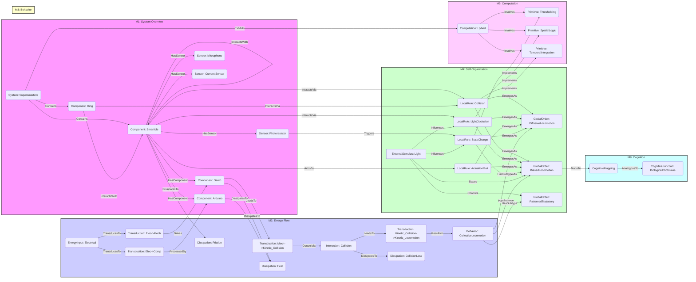

# Locomoting Robots Composed of Immobile Robots

__Paper Type:__ Experimental

## M1: System Overview & Implementation
*   **Vector ID:** M1
*   **Vector Type:** Overview

### **1.1 System Description**

*   **Vector ID:** M1.1
*   **Vector Type:** Description
    *   Content: The system consists of a collection of small, 3-link, planar robots called "smarticles," which are individually incapable of rotation or displacement. Each smarticle has sensors (photoresistors, microphone, current sensor), actuators (two servos controlling link angles), and a microcontroller (Arduino Pro Mini). Multiple smarticles are confined within an unanchored rigid ring, forming a "supersmarticle." The system's purpose is to demonstrate emergent locomotion (diffusion and directed motion/phototaxis) arising purely from the collective interactions (collisions, environmental modulation like light occlusion) of these individually immobile components. It explores morphological computation and control, where the ensemble's physical structure and dynamics perform computation-like tasks leading to locomotion.
    *   CT-GIN Mapping: `SystemNode` attributes: `systemType: RoboticMaterial/MultiRobotSystem`, `domain: SwarmRobotics/Robophysics`, `mechanism: EmergentLocomotion/Stigmergy/MorphologicalComputation`, `components: Smarticles(Sensors[Photoresistor, Microphone, CurrentSensor], Actuators[Servos], Controller[Arduino]), BoundingRing`, `purpose: CollectiveLocomotion/Phototaxis`. Edges: `ComponentOf` (Smarticle -> Supersmarticle), `Contains` (Supersmarticle -> Smarticle).
    *   Implicit/Explicit: Explicit
        *  Justification: The abstract, introduction (paragraphs 1, 4, 5), and Section I explicitly describe the smarticles, supersmarticle, their components, interactions, and the goal of achieving emergent locomotion.

### **1.2 Implementation Clarity**

*   **Vector ID:** M1.2
*   **Vector Type:** Score
    *   Score: 8
    *   Justification: The paper provides clear descriptions of the smarticle hardware (dimensions, links, servos, sensors, microcontroller) and the supersmarticle concept (collection within a ring). Figures 1 and 2 illustrate the hardware and configuration space. Section I details the implementation aspects like sensing modes, actuation, communication (stigmergy), and computation. Section II describes the experimental setup (test plate, light sources, tracking). Minor details like specific power sources or precise control algorithms beyond the gait are less detailed but sufficient for understanding the core concept.
    *   Implicit/Explicit: Explicit
        * Justification: The clarity score is based on the explicit descriptions, figures, and methodology detailed in Sections I and II.

### **1.3 Key Parameters**

*   **Vector ID:** M1.3
*   **Vector Type:** ParameterTable
    *   Table:
        | Parameter Name | Value | Units | Source (Fig/Table/Section) | Implicit/Explicit | Data Reliability (High/Medium/Low) | Derivation Method (if Implicit) |
        | :------------- | :---: | :---: | :-----------------------: | :-----------------: | :-----------------------------: | :-------------------------------: |
        | Smarticle Dimensions | 14 x 2.5 x 3 | cm³ | Section I | Explicit | High | N/A |
        | Number of Smarticles | 5 (example), Variable implied | N/A | Fig 1a, Section III | Explicit (example), Implicit (general) | Medium | N/A |
        | Servo Type | Power HD-1440A | N/A | Section I | Explicit | High | N/A |
        | Microcontroller | Arduino Pro Mini 328-3.3V/8MHz | N/A | Section I | Explicit | High | N/A |
        | Test Plate Size | 0.2 x 0.2 | m² | Section II | Explicit | High | N/A |

    *   **Note:** The number of smarticles used in the experiments shown in Fig 3 is not explicitly stated but implied to be consistent populations for comparison.

## M2: Energy Flow
*   **Vector ID:** M2
*   **Vector Type:** Energy

### **2.1 Energy Input**

*   **Vector ID:** M2.1
*   **Vector Type:** Input
    *   Content: The primary energy source is electrical power supplied to each smarticle's microcontroller and servos.
    *   Value: N/A
    *   Units: N/A
    *   CT-GIN Mapping: `EnergyInputNode` attributes: `source: Electrical`, `type: DC_Power (inferred)`
    *   Implicit/Explicit: Implicit
        *  Justification: The paper mentions microcontrollers and servos (Section I), which require electrical power, but does not explicitly state this as the energy input or provide voltage/current details.

### **2.2 Energy Transduction**

*   **Vector ID:** M2.2
*   **Vector Type:** Transduction
    *   Content: 1. Electrical energy is converted to computational processing by the Arduino microcontroller. 2. Electrical energy is converted to mechanical energy by the servos, actuating the smarticle links. 3. Mechanical energy of link movement leads to kinetic energy transfer through collisions between smarticles and the ring. 4. These collisions collectively transduce the internal mechanical energy into macroscopic kinetic energy of the supersmarticle (locomotion).
    *   CT-GIN Mapping: `EnergyTransductionEdge` attributes: `mechanism`, `from_node`, `to_node`. Examples: (Electrical -> Computation), (Electrical -> Mechanical[Servo]), (Mechanical[Servo] -> Kinetic[Collision]), (Kinetic[Collision] -> Kinetic[SupersmarticleLocomotion]).
    *   Implicit/Explicit: Mixed
        *  Justification: The actuation by servos and resulting collisions leading to displacement are explicitly described (Section I, IV). The initial electrical input and conversion steps are implicit based on the components used.

### **2.3 Energy Efficiency**

*   **Vector ID:** M2.3
*   **Vector Type:** Score
    *   Score: 1
    *   Justification/Metrics: The paper does not quantify efficiency. Qualitatively, the process is expected to be highly inefficient (Low). Energy is consumed by onboard electronics and servos. Locomotion relies on chaotic collisions, where much energy is likely lost to heat, sound, friction, and internal deformations, rather than contributing to net displacement. Score is low due to reliance on undirected collisions for propulsion.
    *   CT-GIN Mapping: Attribute (`efficiency: Low (qualitative)`) of relevant `EnergyTransductionEdge`s (e.g., Kinetic[Collision] -> Kinetic[SupersmarticleLocomotion]).
    *   Implicit/Explicit: Implicit
      *  Justification: Efficiency is not mentioned or measured; the assessment is based on the physical nature of the collision-driven locomotion described.

### **2.4 Energy Dissipation**

*   **Vector ID:** M2.4
*   **Vector Type:** Dissipation
    *   Content: Major dissipation mechanisms include: 1. Friction between the smarticles' center links and the test surface. 2. Internal friction and electrical resistance (heat) within the servos. 3. Heat generated by the microcontrollers. 4. Inelastic losses during collisions between smarticles and between smarticles and the ring (sound, heat, material deformation). Quantification is not provided. Qualitative assessment: High, due to the reliance on friction and collisions for movement generation and control.
    *   CT-GIN Mapping: Creates `EnergyDissipationNode`s (`Friction`, `Heat_Servo`, `Heat_MCU`, `CollisionLoss`) and `EnergyDissipationEdge`s connecting relevant components/processes (Smarticle, Servo, MCU, Collision interaction) to these nodes.
    *    Implicit/Explicit: Implicit
        *  Justification: Dissipation mechanisms are inherent to the described physical system (friction, collisions, electronics) but are not explicitly discussed or quantified in the paper.

## M3: Memory
*   **Vector ID:** M3
*   **Vector Type:** Memory

### **3.1 Memory Presence:**

*   **Vector ID:** M3.1
*   **Vector Type:** Binary
    *   Content: No
    *   Justification: The system's state (smarticle activity/inactivity) changes based on the *current* light stimulus via the photoresistors. This state influences immediate behavior (phototaxis). However, the paper provides no evidence that this state change persists *beyond* the removal of the stimulus or that past experiences modify the system's internal parameters or future responses in a persistent way. The system appears purely reactive to the current environmental state, not demonstrating memory as defined (a change persisting beyond stimulus influencing *future* behavior learned from past interactions).
    *    Implicit/Explicit: Implicit
        * Justification: The assessment is based on interpreting the described system behavior (reactive phototaxis, Section I, III) against the provided definition of memory. The paper does not claim memory capabilities.

**(Skipping M3.2-M3.8 as M3.1 is "No")**

## M4: Self-Organization and Emergent Order
*   **Vector ID:** M4
*   **Vector Type:** Self-Organization

### **4.1 Self-Organization Presence:**

*   **Vector ID:** M4.1
*   **Vector Type:** Binary
    *   Content: Yes
    *   Justification: The paper explicitly states that the supersmarticle harnesses "internal collisions" and "interaction dynamics of the ensemble" to achieve "emergent diffusion" and "biased locomotion" (Abstract, Section I, IV). This global locomotion behavior arises spontaneously from the local interactions (collisions, light occlusion/stigmergy) of the individual, non-locomoting smarticles within the ring, without explicit external control dictating the global path. This fits the definition of self-organization.
    *   Implicit/Explicit: Explicit
        *  Justification: The paper uses terms like "emergent dynamics" and describes the global behavior arising from local interactions.

**(Continuing with M4.2-M4.7 as M4.1 is "Yes")**

### **4.2 Local Interaction Rules:**

*   **Vector ID:** M4.2
*   **Vector Type:** Rules
    *   Content: 1. **Physical Collisions:** Smarticles collide with each other and the bounding ring due to their servo-driven shape changes ("square gait", Fig 2b). These collisions transfer momentum, generating net forces on the ring (Section I). 2. **Stigmergic Communication (Light Occlusion):** A smarticle detecting the controlling light source becomes inactive. Due to the planar setup and sensor placement, this smarticle often occludes the light from others, keeping them active. This creates an internal light gradient and asymmetry based on local geometry and proximity to the light source (Section I). 3. **Actuation Cycle:** Each active smarticle follows a programmed periodic trajectory (gait) in its joint space (Fig 2b), changing its shape. 4. **State Change:** An active smarticle transitions to inactive upon sensing sufficient light intensity via its photoresistors (Section II).
    *   CT-GIN Mapping: Defines `InteractionEdge` types: `Collision` (Smarticle-Smarticle, Smarticle-Ring), `LightOcclusion` (Smarticle-Smarticle), `StateTransition` (Active->Inactive based on LightSensor reading). Rules are embedded attributes of these edges or nodes. `AdjunctionEdge` could represent the physical constraints and potential for collision.
    * **Implicit/Explicit**: Mixed
        *  Justification: Collisions, actuation cycles, state changes based on light, and occlusion are explicitly described. The precise mathematical rules governing collision forces or the exact light threshold are implicit.

### **4.2.1 Local Interaction Parameters:**

* **Vector ID:** M4.2.1
* **Vector Type:** Table
*   Table:
    | Rule ID | Description | Parameter Name | Parameter Value Range | Units | Data Source | Implicit/Explicit | Justification |
    | :------ | :---------- | :------------- | :---------- | :---: | :----------: | :----------------: | :------------: |
    | 1 | Collision | Smarticle Geometry, Ring Geometry | N/A (Defined by CAD) | m | Section I, Fig 1 | Explicit | Shape determines collision outcomes. |
    | 1 | Collision | Coefficient of Restitution/Friction | N/A | N/A | N/A | Implicit | Material dependent, influences momentum transfer, not specified. |
    | 2 | Light Occlusion | Smarticle Geometry, Sensor Position | N/A (Defined by CAD) | m | Section I, Fig 1c, 2c | Explicit | Geometry dictates light blocking. |
    | 2 | Light Occlusion | Photoresistor Sensitivity/Shroud Angle | Saturation (Exposed), Reduced Acceptance Angle (Shrouded) | N/A / degrees | Fig 2c, Section II | Explicit | Determines which smarticle detects light. |
    | 4 | State Change | Light Intensity Threshold | N/A | N/A | Section II | Implicit | An implicit threshold must exist for photoresistors to trigger inactivity. |

### **4.3 Global Order:**

*   **Vector ID:** M4.3
*   **Vector Type:** Order
    *   Content: The primary emergent global order is macroscopic locomotion of the supersmarticle system. This locomotion manifests as: 1. **Diffusive Motion:** Random-walk-like displacement when no external bias (light) is present (Fig 3a). 2. **Biased Diffusion (Phototaxis):** Directed drift (net displacement) superimposed on the diffusion, oriented relative to the controlling light source (positive phototaxis for exposed sensors, negative for shrouded; Fig 3c, 3e, Section III). 3. **Pattern Formation (Shape Tracing):** Ability to follow specific paths (e.g., drawing a 'T') by dynamically changing the light source position (Fig 4).
    *   CT-GIN Mapping: Defines `ConfigurationalNode` types: `DiffusiveLocomotion`, `BiasedLocomotion (Phototaxis)`, `PatternedTrajectory`. These nodes represent the macro-state of the system.
    * **Implicit/Explicit**: Explicit
        *  Justification: The paper explicitly describes and shows trajectories for diffusive motion, biased diffusion (phototaxis), and shape tracing in Section III and Figures 3 & 4.

### **4.4 Predictability of Global Order:**

*   **Vector ID:** M4.4
*   **Vector Type:** Score
    *   Score: 4
    *   Justification: Unbiased motion is inherently stochastic and described as "random" (Fig 3a), indicating low predictability. Biased motion (phototaxis) shows a "consistent drift" (Section III), indicating some predictability in the *average* direction (Fig 3d, 3f show clear biases in polar histograms). However, individual trajectories remain diffusive and variable (Fig 3c, 3e). The ability to draw shapes (Fig 4) suggests a moderate level of *controlled* predictability by manipulating the bias. Overall predictability is low-to-moderate, dominated by stochastic interactions but controllable on average. Metrics like MSD are mentioned (Section II) but not shown to quantify predictability.
    * **Implicit/Explicit**: Mixed
    *  Justification: The paper explicitly describes randomness and consistency. The figures visually support variability. The score is an interpretation of these mixed observations. Quantitative predictability metrics are not provided.
    *   CT-GIN Mapping: Attribute (`predictability_score: 4`) of `ConfigurationalNode`s or weights on `AdjunctionEdge`s linking local rules to global order.

### **4.5. Local Interaction Rules (for Self-Organization)**
* **Vector ID:** M4.5
* **Vector Type:** Table
*   Table:
| Rule ID | Description | Parameter | Value Range | Units | Implicit/Explicit | Justification | Source |
| :------ | :---------- | :-------- | :---------- | :---: | :----------------: | :------------: | :-----: |
| Collision | Momentum transfer based on geometry/material | N/A | N/A | N/A | Implicit | Essential for locomotion but mechanics not detailed. | Section I, IV |
| Stigmergy | Light occlusion affecting activity state | Sensor Angle of Acceptance | Exposed vs Shrouded | degrees | Explicit | Determines which smarticles become inactive. | Section II, Fig 2c |
| Actuation | Periodic gait cycle | Servo Angles (α1, α2) | Defined by gait (Fig 2b) | degrees | Explicit | Drives the motion leading to collisions. | Fig 2b |
| State Change | Inactivation by light | Light Threshold | N/A | N/A | Implicit | Must exist for photo-response. | Section II |

### **4.6. Globally Emergent Order and Order Parameters**
* **Vector ID:** M4.6
* **Vector Type:** Table
*   Table:
| Property ID | Description | Parameter | Value Range | Units | Implicit/Explicit | Justification | Protocol | Source |
| :---------- | :---------- | :-------- | :---------- | :---: | :----------------: | :------------: | :------: | :-----: |
| GO1 | Diffusive Locomotion | Mean Squared Displacement (MSD) | N/A (Analysis mentioned) | m²/s | Implicit | MSD analysis mentioned but data not shown. | OptiTrack + MSD package | Section II |
| GO2 | Biased Locomotion (Phototaxis) | Net Displacement Vector | Variable (Fig 3) | m | Explicit | Trajectories show net displacement. | OptiTrack Analysis | Section III, Fig 3 |
| GO3 | Directionality Bias | Angle relative to Light | Primarily Towards (Exposed), Away (Shrouded) | degrees/radians | Explicit | Polar histograms quantify bias. | OptiTrack Analysis | Section III, Fig 3b,d,f |

### **4.7 Yoneda Embedding and Local-to-Global Mapping Fidelity**

*   **Vector ID:** M4.7
*   **Vector Type:** Table
*   Table: N/A
    | Link Type | Description | Predictability | Yoneda Score | Metrics | Implicit/Explicit | Justification | Source |
    | :-------- | :---------- | :------------- | :----------- | :------ | :----------------: | :------------: | :-----: |
     | N/A       | N/A         | N/A            | N/A          | N/A     | N/A                | N/A           | N/A     |
    *   **Yoneda Embedding Fulfillment Score [0-10]:** N/A
    *   **Metrics:** N/A
    *   **Justification:** The paper does not perform or discuss analysis related to Category Theory, Yoneda embedding, or explicitly quantifying the fidelity of the local-to-global mapping in these terms.

## M5: Computation
*   **Vector ID:** M5
*   **Vector Type:** Computation

### **5.1 Embodied Computation Presence:**

*   **Vector ID:** M5.1
*   **Vector Type:** Binary
    *   Content: Yes
    *   Justification: The paper explicitly uses the terms "morphological computation" and "morphological control" (abstract, intro para 3, ref [6]). It states the goal is to "discover the principles of morphological computation with regard to motion" (intro para 5) and treats the supersmarticle as a model producing locomotion via dynamics absent in individuals (intro para 5). The computation (leading to locomotion) arises from the physical interactions (collisions, occlusion) and geometry of the system (the "body"), not solely from the digital controllers within each smarticle.
    *    Implicit/Explicit: Explicit
        *  Justification: The paper explicitly invokes the concept of morphological computation to describe how the system functions.

**(Continuing with M5.2-5.4 as M5.1 is "Yes")**

### **5.2 Computation Type:**

*   **Vector ID:** M5.2
*   **Vector Type:** Classification
    *   Content: Hybrid
    *   CT-GIN Mapping: Defines the `ComputationNode` type: `Hybrid`. Sub-types: `Digital` (Internal Arduino logic), `Analog/Physical` (Collision Dynamics, Stigmergy).
    *    Implicit/Explicit: Mixed
    *    Justification: Individual smarticles use digital computation (Arduino) for sensing and servo control. The emergent collective behavior (locomotion resulting from interactions) relies on analog physical processes (collisions, light physics). The overall system computation is a hybrid of these. The paper implies this through its description, though doesn't explicitly label it "hybrid".

### **5.3 Computational Primitive:**

*   **Vector ID:** M5.3
*   **Vector Type:** Function
    *   Content: The most basic computations embodied by the material interactions appear to be: 1. **Thresholding:** Smarticles become inactive based on a light intensity threshold detected by photoresistors. 2. **Spatial Logic/Filtering (via Stigmergy):** The nearest smarticle(s) to the light source effectively performs a spatial filtering operation, becoming inactive and potentially blocking light (acting like a NOT gate for light stimulus to others nearby). 3. **Collective Summation/Integration (via Collisions):** The net displacement arises from the integration of forces generated by many individual, chaotic collisions over time.
    *   **Sub-Type (if applicable):** Thresholding; Spatial Logic; Temporal Integration
    *   CT-GIN Mapping: Defines the primary function(s) of the `ComputationNode` related to embodied aspects. Could be represented as attributes or linked function nodes: `Thresholding(Light)`, `SpatialLogic(Occlusion)`, `TemporalIntegration(CollisionForce)`.
    *   Implicit/Explicit: Implicit
    * Justification: These primitives are inferred from the described mechanisms (light sensing causing inactivation, occlusion effect, locomotion from collisions). The paper doesn't explicitly define them as computational primitives.

### **5.4 Embodied Computational Units**
* **Vector ID:** M5.4
* **Vector Type:** Table
*   Table:
| Unit ID | Description | Processing Power | Energy/Operation | Freq/Resp. Time | Bit-Depth | Data Source | Implicit/Explicit | Justification |
| :------ | :---------- | :--------------- | :--------------- | :--------------: | :-------: | :----------: |:-----------------:| :-----------------:|
| Smarticle | Individual robot component performing sensing, local computation (Arduino) and actuation | 8MHz/Low (Arduino Pro Mini) | N/A | N/A (Gait Freq?) | 8-bit (Arduino) | Section I | Mixed | Arduino specs are explicit, performance metrics N/A. |
| Collision | Interaction transferring momentum | N/A | N/A | N/A (Stochastic) | N/A (Analog) | Section I, III | Implicit | Core interaction but treated physically, not computationally quantified. |
| Occlusion | Stigmergic interaction via light blocking | N/A | N/A | N/A (Geometry/Position dependent) | N/A (Analog/Binary) | Section I | Implicit | Key interaction but treated physically, not computationally quantified. |

## M6: Temporal Dynamics
*   **Vector ID:** M6
*   **Vector Type:** Temporal

### **6.1 Timescales:**

*   **Vector ID:** M6.1
*   **Vector Type:** ParameterTable
    *   Table:
        | Timescale Description | Value | Units | Source | Implicit/Explicit | Justification |
        | :-------------------- | :---: | :---: | :----: | :----------------: | :------------: |
        | Servo Actuation Cycle (Gait Period) | N/A | s | Fig 2b | Implicit | A periodic gait is implied, but its frequency/period is not stated. |
        | Collision Frequency | N/A | Hz | N/A | Implicit | Stochastic, depends on density, gait; not measured. |
        | Locomotion/Diffusion Timescale | Variable (MSD) | s (for τ in MSD ~ t^α) | Section II | Implicit | MSD analysis is mentioned, implies characteristic timescales, but values not given. |
        | Experiment Duration | <= 600 (10 min) or until edge | s | Section II | Explicit | Trials terminated at 10 minutes or when boundary reached. |
        | Sensor Response Time | N/A | s | N/A | Implicit | Photoresistor/microcontroller response time is fast but unspecified. |

### **6.2 Active Inference:**

*   **Vector ID:** M6.2
*   **Vector Type:** Assessment
    *   Content: No
    *   Justification: The system reacts to the current light environment to produce biased motion (phototaxis). There is no evidence presented that the system builds or uses an internal model of its environment to predict future states or actively selects actions to minimize prediction error. The behavior appears purely reactive to the immediate stimulus gradient, not generative or predictive based on an internal representation.
    *   Implicit/Explicit: Implicit
        *  Justification: The assessment is based on the absence of any description or evidence supporting prediction, internal models, or minimization of prediction error in the paper.
    *   **If Yes/Partial, provide examples of testable CT-GIN metrics that *could* be used to quantify active inference:** N/A

## M7: Adaptation
*   **Vector ID:** M7
*   **Vector Type:** Adaptation

### **7.1 Adaptive Plasticity Presence:**

*   **Vector ID:** M7.1
*   **Vector Type:** Binary
    *   Content: No
    *   Justification: The system changes its behavior (direction of motion) in response to an external stimulus (light). However, this is a pre-programmed reaction based on sensor input and fixed rules (activity state change). The paper does not provide evidence that the system changes its internal structure, parameters, or interaction rules *over time* based on *experience* to improve performance or alter functionality in a persistent way. The difference between shrouded and exposed smarticles is a fixed design difference, not an adaptation occurring within a single system during operation.
    *    Implicit/Explicit: Implicit
        * Justification: Assessed based on the lack of description or evidence for learning, parameter modification, or structural change driven by experience in the paper.

**(Skipping M7.2 as M7.1 is "No")**

## M8: Emergent Behaviors
*   **Vector ID:** M8
*   **Vector Type:** Behavior

### **8.1 Behavior Description:**

*   **Vector ID:** M8.1
*   **Vector Type:** Description
    *   Content: The main functional behavior is emergent collective locomotion of the supersmarticle assembly, composed of individually immobile smarticle units. Specific behaviors include: 1. Undirected diffusive motion in the absence of external bias. 2. Directed, biased diffusive motion (phototaxis) in response to a directional light source (either towards or away from the light depending on smarticle design). 3. Trajectory following or pattern generation (e.g., drawing a "T") by dynamically controlling the position of the biasing light source.
    *   CT-GIN Mapping: Defines `BehaviorArchetypeNode`. Type: `CollectiveLocomotion`. Subtypes: `Diffusion`, `Phototaxis (Biased Diffusion)`, `ControlledTrajectoryFollowing`.
    *    Implicit/Explicit: Explicit
       *  Justification: These behaviors are explicitly described in the Abstract, Introduction, Results (Section III), and Conclusion (Section IV), and illustrated in Figures 3 and 4.

### **8.2 Behavior Robustness:**

*   **Vector ID:** M8.2
*   **Vector Type:** Score
    *   Score: 6
    *   Justification: The phototaxing behavior was observed relatively consistently across multiple trials (e.g., 49/62 positive phototaxis for exposed, Section III), suggesting some robustness to initial conditions and stochastic variations. The ability to draw shapes (Fig 4) also implies reliable response to control inputs. However, the underlying motion is still diffusive, meaning individual trajectories vary significantly (Fig 3c, 3e). Robustness to parameter variations (e.g., number of smarticles, surface friction changes, minor smarticle malfunction) is not systematically quantified. The score reflects observed consistency in average behavior despite underlying stochasticity.
    *   Implicit/Explicit: Mixed
        *  Justification: Consistency is explicitly stated and supported by trial statistics (Section III). Variability is explicitly shown in trajectory plots (Fig 3). Robustness to specific perturbations is implicitly assessed as moderate based on these observations.
    *   CT-GIN Mapping: Attribute (`robustness_score: 6`) of the `BehaviorArchetypeNode`.

### **8.3 CT-GIN Emergent Behavior Validation**

*    **Vector ID:** M8.3
*    **Vector Type:** Validation
     *  Content: Claims of emergent behavior (locomotion from immobile units) are validated through: 1. **Experimental Observation:** Direct observation and recording of supersmarticle movement. 2. **Quantitative Trajectory Tracking:** Using OptiTrack infrared video technology to record the center of geometry trajectories (Section II, Fig 3). 3. **Control Experiments:** Comparing behavior with and without the controlling light source (Fig 3a vs 3c/e). 4. **Statistical Analysis:** Using polar histograms to quantify the directionality bias in phototaxis experiments across multiple trials (Section III, Fig 3b/d/f). 5. **MSD Analysis:** Mentioned as an analysis tool (Section II), implying quantification of diffusive properties, although results are not shown. Reproducibility is demonstrated by repeating trials with light at different locations (Section II) and achieving consistent bias trends (Section III). Limitations: Detailed analysis of interaction modes hypothesized to cause bias is deferred ([11]).
     *   Implicit/Explicit: Explicit
    *   Justification: Section II (Methods) and Section III (Results) explicitly describe the experimental setup, data recording techniques, control conditions, and analysis methods (trajectory plots, polar histograms) used to validate the observed emergent behaviors.

## M9: Cognitive Proximity
*   **Vector ID:** M9
*   **Vector Type:** Cognition

### **9.1 Cognitive Mapping:**

*   **Vector ID:** M9.1
*   **Vector Type:** Description
    *   Content: Yes, the paper explicitly maps the observed biased diffusion in response to light to the biological phenomenon of "phototaxing" (Abstract, intro para 5, Section III). It draws an analogy between the supersmarticle's directed motion relative to the light source and similar behaviors in biological organisms.
    *   CT-GIN Mapping: Defines a `CognitiveMappingEdge`. Source: `BehaviorArchetypeNode` (subtypes: `Phototaxis`). Target: `CognitiveFunctionNode` (`BiologicalPhototaxis`).
    *   Implicit/Explicit: Explicit
    * Justification: The paper explicitly uses the term "phototaxing" and describes the behavior as "analogous to biological phototaxis" (Abstract).

### **9.2 Cognitive Proximity Score:**

*   **Vector ID:** M9.2
*   **Vector Type:** Score
    *   Score: 1.5
    *   Justification: The system demonstrates Level 1 (Simple Responsivity) by reacting to the light stimulus in a fixed way (change activity state). The *collective* emergent behavior (biased diffusion) pushes slightly towards Level 2 (Sub-Organismal Responsivity) as it's a group behavior coordinating based on local environmental cues (light gradient via stigmergy). However, it lacks genuine adaptation, learning, internal models, planning, or goal-directedness beyond the immediate stimulus-driven reaction. It does not change its rules or improve over time. The phototaxis is a reactive bias, not a sophisticated cognitive process.
    *   Implicit/Explicit: Mixed
    *  Justification: The score is assigned by comparing the explicitly described behaviors (Sections I, III, IV) against the levels defined in the CT-GIN Cognizance Scale. The justification involves interpreting the system's capabilities relative to cognitive benchmarks.

**CT-GIN Cognizance Scale:** (Provided in the template)

### **9.3 Cognitive Function Checklist**

* **Vector ID:** M9.3
* **Vector Type:** Checklist
    *   | Cognitive Function               | Score (0-10) | Justification/Notes                                                                       | CT-GIN Mapping (if applicable) | Implicit/Explicit | Justification for Implicit/Explicit/Mixed |
    | :-------------------------------- | :----------: | :------------------------------------------------------------------------------------ | :--------------------------------: | :-----------------:|:-----------------:|
    | Sensing/Perception               |      4       | Simple light intensity (binary active/inactive trigger), sound (not used), torque (current sensing, not used for locomotion control). Limited integration. | `SensorNode` attributes | Explicit (Sensors), Implicit (Performance) | Sensors listed, function limited/inferred. |
    | Memory (Short-Term/Working)        |      1       | System state (active/inactive smarticles) reflects *current* light conditions, no persistence beyond stimulus. | N/A | Implicit | Absence of memory feature inferred. |
    | Memory (Long-Term)                 |      0       | No mechanism described for storing information or modifying behavior based on past experiences over longer timescales. | N/A | Implicit | Absence of memory feature inferred. |
    | Learning/Adaptation              |      0       | Behavior is fixed; no learning or adaptation mechanism described. Parameters don't change with experience. | N/A | Implicit | Absence of adaptation feature inferred. |
    | Decision-Making/Planning          |      1       | Decentralized, local 'decision' (active/inactive) based solely on immediate light sensor input. No planning or complex choice. | `ComputationNode` (Thresholding) | Mixed | State change explicit, 'decision' interpretation implicit. |
    | Communication/Social Interaction |      2       | Indirect, stigmergic communication via light occlusion. Simple physical collisions. No complex information exchange. | `InteractionEdge` (LightOcclusion, Collision) | Explicit | Mechanisms explicitly described. |
    | Goal-Directed Behavior            |      1       | Behavior is stimulus-driven (move towards/away from light). Appears goal-directed only in the sense of reacting to a gradient. | `BehaviorArchetypeNode` (Phototaxis) | Mixed | Behavior explicit, goal-directedness interpretation minimal. |
    | Model-Based Reasoning              |      0       | No evidence of internal models of the environment or prediction. Purely reactive. | N/A | Implicit | Absence of model-based reasoning inferred. |
    | **Overall score**                 |      [1.125]       | Low score reflects primarily reactive, non-adaptive system with limited sensing and communication. | N/A | N/A | Average of above scores. |

## M10: Criticality Assessment
*   **Vector ID:** M10
*   **Vector Type:** Criticality

### **10.1 Criticality:**

*   **Vector ID:** M10.1
*   **Vector Type:** Assessment
    *   Content: Unclear
    *   Justification: The paper does not discuss or present any analysis related to criticality, such as investigating power laws, scale-free behavior, or long-range correlations in the system's dynamics. While the system involves many interacting components and stochasticity, there is no evidence provided to assess whether it operates near a critical point.
        *   Critical Parameters (If Yes/Partial): N/A
        *   Evidence: N/A
    *   Implicit/Explicit: Implicit
    *    Justification: Assessment based on the absence of any discussion or data related to criticality in the paper.

## M11: Review Paper Specifics (Conditional)

N/A (Paper is Experimental)

## M12: Theoretical Paper Specifics (Conditional)

N/A (Paper is Experimental)

## M13: Overall Assessment & Scoring

*   **Vector ID:** M13
*   **Vector Type:** Overall

### **13.1 CT-GIN Readiness Score:**

*   **Vector ID:** M13.1
*   **Vector Type:** Score
*   **Calculated Score:** 3.9
    * Calculation: (M1.2[8] + M2.3[1] + M3.1[0*10] + M4.1[1*10] + M4.4[4] + M8.2[6] + M9.2[1.5]) / 7 = (8 + 1 + 0 + 10 + 4 + 6 + 1.5) / 7 = 30.5 / 7 ≈ 3.93

**CT-GIN Readiness Summary Table:**

| CT-GIN Aspect                   | Strength (Yes/Partial/No) | Key Supporting Metrics (with units) | Limitations (Missing Metrics/Data Gaps)                                           | Improvement Areas (Future Research)                                          |
| :------------------------------ | :-----------------------: | :-----------------------------------| :------------------------------------------------------------------------------- | :---------------------------------------------------------------------------- |
| Energy Flow Efficiency          | No                       | N/A                                  | Efficiency not quantified; Qualitative assessment: Low. Dissipation mechanisms not quantified. | Quantify energy input, output (work done), and losses. Optimize actuation/interaction for efficiency. |
| Memory Fidelity                 | No                       | N/A                                  | No memory mechanism present beyond immediate state change.                       | Implement persistent memory elements within smarticles or interactions.       |
| Organizational Complexity       | Partial                  | Emergent locomotion (diffusion, bias), Pattern tracing demonstrated. | Predictability moderate, rules qualitative, order parameters limited (MSD only mentioned). | Quantify interaction rules, develop order parameters, analyze network properties, explore phase transitions. |
| Embodied Computation            | Partial                  | Thresholding, Spatial Logic (Occlusion), Integration (Collisions) inferred. Morphological computation claimed. | Primitives inferred, not rigorously defined/quantified. Computational power/limits unclear. | Define computational primitives formally, quantify computational capacity, explore more complex computations. |
| Temporal Integration            | Partial                  | Different processes occur (actuation, collision, diffusion), experiment duration defined. | Characteristic timescales (gait, collision freq, diffusion) not quantified. No active inference. | Measure process timescales, investigate temporal correlations, explore time-dependent interactions. |
| Adaptive Plasticity             | No                       | N/A                                  | System is reactive, no learning or adaptation mechanisms described.              | Introduce learning rules, adaptive gaits, or evolving interaction mechanisms. |
| Functional Universality         | No                       | Locomotion demonstrated.             | Limited function set (locomotion based on light).                              | Explore potential for other functions (sensing gradients, manipulation, pattern formation). |
| Cognitive Proximity            | Partial                  | Analogy to phototaxis (Level 1-2).   | Lacks higher cognitive functions (memory, learning, planning).                   | Integrate memory and learning to achieve higher cognitive levels.           |
| Design Scalability & Robustness | Partial                  | Basic principle demonstrated, consistency observed. | Robustness to perturbations, noise, scale not quantified. Manufacturing/control complexity at scale? | Systematically test robustness, analyze scalability (N smarticles), develop fault tolerance. |
| **Overall CT-GIN Readiness Score** | 3.9      |   |   |      |

### **13.2 Qualitative CT-GIN Assessment Conclusion:**

*   **Vector ID:** M13.2
*   **Vector Type:** Textual Summary
    *   Content: This paper presents a compelling experimental demonstration of emergent collective locomotion ("supersmarticle") arising from the interactions of individually immobile robotic units ("smarticles"), explicitly framed within morphological computation. Key strengths lie in the clear implementation, the successful demonstration of both undirected diffusion and directed phototaxis via stigmergic light occlusion, and the validation through controlled experiments and trajectory analysis. The system successfully utilizes local physical interactions to generate global behavior, aligning with core concepts of self-organization and embodied computation. However, from a CT-GIN perspective focused on material intelligence, the system exhibits significant limitations. It lacks genuine memory (beyond immediate reactive state), adaptive plasticity, or learning capabilities. The embodied computation is rudimentary (thresholding, basic spatial logic), and energy efficiency is likely very low and unquantified. While an analogy to biological phototaxis is drawn, the cognitive proximity is low (Level 1-2), reflecting a primarily reactive system. Overall, the supersmarticle serves as a valuable physical model for studying emergence and morphological control but currently represents a foundational stage of material intelligence, lacking the adaptive, learning, and complex computational features associated with higher levels of cognizance.

### **13.3 CT-GIN Refinement Directions:**

*   **Vector ID:** M13.3
*   **Vector Type:** Recommendations
    *   Content:
        *   **Incorporate Memory:** Modify smarticle controllers or interactions to allow for state persistence beyond immediate stimulus (e.g., internal counters, state changes based on *sequences* of inputs, hysteresis).
        *   **Implement Adaptation:** Introduce learning algorithms (e.g., reinforcement learning for gait optimization, Hebbian-like rules for interaction modification) to allow the system to adapt its behavior based on experience or environmental feedback.
        *   **Quantify Energetics:** Measure power consumption of smarticles and mechanical work done by the supersmarticle to quantify energy efficiency and identify major dissipation sources.
        *   **Formalize Computation:** Develop mathematical models of the collision and stigmergic interactions to rigorously define the computational primitives and explore the system's computational capacity.
        *   **Quantify Robustness & Scalability:** Systematically test the system's performance under noise, component failure, varying numbers of smarticles, and different environmental conditions.
        *   **Explore Richer Interactions:** Implement more complex sensing (e.g., gradient sensing, inter-smarticle communication beyond occlusion) and actuation to enable more sophisticated emergent behaviors and computations.
        *   **Develop CT Models:** Construct explicit Category Theory models to map local smarticle states/interactions to the global emergent behaviors, potentially using functorial semantics or sheaf theory to analyze information flow and compositionality.

## M14: CT-GIN Knowledge Graph

*   **Vector ID:** M14
*   **Vector Type:** Visualization

### **14.1. CT-GIN Knowledge Graph:**
* **Content:**

*(Note: This is a simplified text-based representation. A visual graph would use distinct shapes/colors per node type and label edges with types like `Transduction`, `Interaction`, `Emergence`, `CognitiveMapping` and attributes like efficiency, predictability etc.)*

## M15: Relationship Vectors
*   **Vector ID:** M15
*   **Vector Type:** Relationships
*   Relationships:
        | Source Vector ID | Target Vector ID | Relationship Type |
        | ------------- | ------------- | ----------------- |
        | M1.1          | M4.1          | System Enables Self-Organization |
        | M1.1          | M5.1          | System Enables Embodied Computation |
        | M1.1          | M8.1          | System Exhibits Behavior |
        | M2.*          | M1.1          | Energy Powers System |
        | M2.2          | M8.1          | Energy Transduction Produces Behavior |
        | M4.2          | M4.3          | Local Rules Lead to Global Order |
        | M4.3          | M8.1          | Global Order Constitutes Behavior |
        | M5.1          | M8.1          | Embodied Computation Underlies Behavior |
        | M5.3          | M4.2          | Primitives Implemented by Local Rules |
        | M8.1          | M9.1          | Behavior Mapped to Cognitive Function |

## M16: CT-GIN Template Self-Improvement Insights

*   **Vector ID:** M16
*   **Vector Type:** Feedback

### **Template Feedback:**

*    **Vector ID:** M16.1
*   **Vector Type:** Text
    *   **Missing Probes:**
        *   A probe specifically for "Stigmergy" or "Indirect Communication" mechanisms could be useful within M4 (Self-Organization) or potentially a separate module on Information Flow.
        *   A probe about the *control mechanism* (if any) used to modulate the emergent behavior (like moving the light source in Fig 4) could be added, perhaps in M8.
    *   **Unclear Definitions:**
        *   The distinction between M4 (Self-Organization) and M8 (Emergent Behaviors) could be slightly clearer. M4 focuses on the process *from* local rules, while M8 focuses on the resulting behavior *itself*. This seems okay but worth noting.
        *   The definition of "Memory" (M3.1) is strict ("persists beyond stimulus, influencing future behavior"). This correctly excluded the reactive state changes here, but might need refinement for systems with hysteresis or short-term adaptation that isn't quite 'learning'. Perhaps sub-categories or clarifications?
    *   **Unclear Node/Edge Representations:**
        *   More explicit examples for CT-GIN mapping in complex cases (like hybrid computation M5.2, or emergent order M4.3) would be helpful.
        *   Guidance on representing negative findings (e.g., absence of memory M3.1) in the graph could be added (perhaps omitted nodes or specific attributes).
    *   **Scoring Difficulties:**
        *   Assigning scores for efficiency (M2.3) or robustness (M8.2) without quantitative data relies heavily on qualitative judgment, making consistency harder. Adding clearer qualitative anchors (e.g., Low=Relies on highly dissipative processes like friction/collisions, High=Direct energy conversion) might help.
        *   The Cognitive Proximity Score (M9.2) and Checklist (M9.3) require careful judgment against the scale/definitions. The scale is helpful, but applying it consistently across diverse systems will be challenging. More examples for each level based on material systems would be beneficial.
        *   Calculating the Readiness Score (M13.1) automatically is good, but the conversion of Yes/No (M3.1, M4.1, M5.1, M7.1) to a 0-10 scale needs a clear rule (e.g., Yes=10, No=0, Partial=5). Currently used (Yes=10, No=0).
    *   **Data Extraction/Output Mapping:**
        *   Tables in M4 (4.2.1, 4.5, 4.6, 4.7) required significant interpretation or were marked N/A as the paper didn't structure information this way. Maybe combine or simplify these for experimental papers lacking deep theoretical analysis. M4.7 (Yoneda) seems unlikely to be answerable for most experimental papers currently.
        *   Optional tables (M3.4-M3.8, M5.4) were mostly N/A. Their utility depends heavily on the paper's focus.
    *   **Overall Usability:** The template is comprehensive but very long. For rapid analysis, a condensed version might be useful. The strict formatting is good for automation but requires constant vigilance. The flow is logical.
    * **Specific Suggestions:**
        *   Consider making M4.7 (Yoneda Embedding) optional or conditional on theoretical analysis being present.
        *   Provide explicit conversion rules for Binary (Yes/No) inputs when calculating the overall score in M13.1.
        *   Add brief qualitative anchors to scoring rubrics where quantitative data is often missing (e.g., Efficiency, Robustness).