# Artificial visual memory device based on a photo-memorizing composite and one-step manufacturing

__Paper Type:__ Experimental

## M1: System Overview & Implementation
*   **Vector ID:** M1
*   **Vector Type:** Overview

### **1.1 System Description**

*   **Vector ID:** M1.1
*   **Vector Type:** Description
    *   Content: The system is a composite material consisting of thermoplastic polyurethane (TPU) as a viscoelastic polymer matrix and carbon black (CB) nanoparticles (30 wt%) as conductive nanofillers with photothermal conversion effects. This composite intrinsically combines light sensing and memory functions. Light irradiation causes CB nanoparticles to convert light into heat. This heat induces irreversible viscous flow in the TPU matrix, changing the spatial distribution and distance between CB nanoparticles. This alteration permanently modifies the composite's electrical resistance, thus storing a memory of the light exposure. The material can mimic basic neurobehaviors (synaptic functions). The composite is processed into filaments and used in dual-nozzle Fused Deposition Modelling (FDM) 3D printing to fabricate devices. One nozzle extrudes the functional TPU-CB composite, and the other extrudes pure TPU for packaging/insulation. A Wheatstone bridge circuit, incorporated using the 3D printed composite, is used to amplify and visualize the resistance changes via an LED array, creating an artificial visual memory system demonstrator (3x3 pixel array). The purpose is to create a material that intrinsically performs sensing and memory, simplifying device fabrication for artificial visual memory, potentially applicable in flexible/wearable electronics or AI sensory systems.
    *   CT-GIN Mapping: `SystemNode` attributes: `systemType`: "MaterialComposite", `domain`: "MaterialsScience", `mechanism`: "PhotothermalViscoelasticResistanceChange", `components`: ["TPU", "CarbonBlack", "3DPrinter", "WheatstoneBridgeCircuit"], `purpose`: "ArtificialVisualMemory"
    *   Implicit/Explicit: Mixed
        *  Justification: The core material components (TPU, CB), mechanism (photothermal effect, viscous flow, resistance change), processing (3D printing), and purpose (artificial visual memory) are explicitly stated throughout the abstract, introduction, and results. The integration into a device with a Wheatstone bridge and LED array is also explicit (Fig 5). The overall system description combines these explicit elements.

### **1.2 Implementation Clarity**

*   **Vector ID:** M1.2
*   **Vector Type:** Score
    *   Score: 8
    *   Justification: The paper clearly describes the composite material preparation (mixing, extrusion - Section S2 ESI referenced), the choice of 30 wt% CB concentration with justification (Fig 2a), the 3D printing process (dual-nozzle FDM), and the Wheatstone bridge circuit design for visualization (Fig 5, Section S2 ESI referenced). The experimental setup for testing photo-sensing and memory is also clear (Fig 3a). Some details require referring to the ESI, slightly reducing perfect clarity within the main text, but overall the implementation is well-detailed and reproducible.
    *   Implicit/Explicit: Mixed
        * Justification: Most aspects are explicitly described in the main text or figures (composite composition, mechanism, testing setup, device structure). Reference to ESI for detailed preparation steps makes some clarity implicitly dependent on external information, though the core process is explicit.

### **1.3 Key Parameters**

*   **Vector ID:** M1.3
*   **Vector Type:** ParameterTable
    *   Table:
        | Parameter Name             | Value          | Units                     | Source (Fig/Table/Section) | Implicit/Explicit | Data Reliability (High/Medium/Low) | Derivation Method (if Implicit) |
        | :----------------------- | :-------------: | :------------------------: | :-----------------------: | :-----------------: | :-----------------------------: | :-------------------------------: |
        | CB Mass Fraction         | 30             | wt%                       | Fig 2a, Composite Design  | Explicit          | High                            | N/A                               |
        | Irradiation Intensity    | 70.3 (example) | mW cm⁻²                   | Fig 2b, Fig 3c, Fig 4c    | Explicit          | High                            | N/A                               |
        | Initial Filament Resistivity | 10-20          | Ω cm                      | Fig S3 (referenced p.1599)| Explicit          | High                            | N/A                               |
        | Glass Transition Temp (Tg) | approx. 29.31  | °C                        | Fig 2c                    | Explicit          | High                            | N/A                               |
        | Resistance Change Rate (Memory) | approx. 4.0    | % per cycle (initial)     | p. 1599, Fig 2b           | Explicit          | Medium (dependent on conditions) | N/A                               |

    *   **Note:** Key parameters defining the material composition and operating conditions are listed. Resistivity is from ESI but referenced explicitly. Resistance change rate is explicitly stated but is condition-dependent.

## M2: Energy Flow
*   **Vector ID:** M2
*   **Vector Type:** Energy

### **2.1 Energy Input**

*   **Vector ID:** M2.1
*   **Vector Type:** Input
    *   Content: The primary energy source is light, specifically simulated sunlight used in the experiments.
    *   Value: e.g., 70.3 (specific intensity used in examples)
    *   Units: mW cm⁻²
    *   CT-GIN Mapping: `EnergyInputNode`: attributes - `source`: "SimulatedSunlight", `type`: "OpticalRadiation"
    *   Implicit/Explicit: Explicit
        *  Justification: The paper explicitly states the use of "simulated sunlight" and provides intensity values like 70.3 mW cm⁻² (e.g., Fig 2b caption, Fig 3 legend).

### **2.2 Energy Transduction**

*   **Vector ID:** M2.2
*   **Vector Type:** Transduction
    *   Content: 1. **Photothermal Conversion:** Incident light energy is absorbed by the Carbon Black (CB) nanoparticles within the TPU matrix. This absorbed optical energy is converted into thermal energy (heat) due to the photothermal effect of CB. 2. **Thermal to Mechanical/Structural:** The generated heat increases the temperature of the TPU matrix. This thermal energy increases the kinetic energy of the TPU polymer chains, leading to increased segmental motion, slippage, and irreversible viscous flow (creep behavior), particularly around the glass transition temperature. 3. **Structural to Electrical:** The viscous flow and rearrangement of TPU chains alter the spatial distribution and connectivity of the conductive CB nanoparticle network. Specifically, increased chain motion tends to increase the average distance between CB particles or disrupt conductive pathways. This change in the CB network structure directly modifies the bulk electrical resistance of the composite material. Energy also flows into the electrical circuit (Wheatstone bridge) when reading the resistance state.
    *   CT-GIN Mapping: `EnergyTransductionEdge` (Optical to Thermal): attributes - `mechanism`: "PhotothermalEffect (CB)", `from_node`: `EnergyInputNode (OpticalRadiation)`, `to_node`: `SystemStateNode (Thermal)`. `EnergyTransductionEdge` (Thermal to Structural): attributes - `mechanism`: "ViscoelasticFlow (TPU)", `from_node`: `SystemStateNode (Thermal)`, `to_node`: `SystemStateNode (Structural/Morphological)`. `EnergyTransductionEdge` (Structural to Electrical): attributes - `mechanism`: "ConductiveNetworkModification (CB)", `from_node`: `SystemStateNode (Structural/Morphological)`, `to_node`: `SystemStateNode (ElectricalResistance)`.
    *   Implicit/Explicit: Explicit
        *  Justification: The paper explicitly describes the photothermal conversion by CB, the heat-induced viscous flow of TPU, and the resulting change in CB network distance leading to resistance change (Abstract, Introduction, Physical mechanism section pp. 1599).

### **2.3 Energy Efficiency**

*   **Vector ID:** M2.3
*   **Vector Type:** Score
    *   Score: 1
    *   Justification/Metrics: The paper does not quantify the energy efficiency of the photothermal conversion or the subsequent resistance change. However, photothermal processes often involve significant heat loss to the environment. The functional output (resistance change) represents a tiny fraction of the input light energy. The primary mechanism relies on heating the bulk material, which is inherently inefficient for information storage compared to electronic methods. Qualitative Assessment: Low.
    *   CT-GIN Mapping: Attribute `efficiency` (Low/Unquantified) of `EnergyTransductionEdge`s.
    *   Implicit/Explicit: Implicit
      *  Justification: Efficiency is not discussed or measured. The low score is inferred based on the nature of the described physical processes (bulk heating, heat dissipation).

### **2.4 Energy Dissipation**

*   **Vector ID:** M2.4
*   **Vector Type:** Dissipation
    *   Content: The primary dissipation mechanism is heat loss from the TPU-CB composite to the surrounding environment via convection and radiation after the photothermal conversion. The paper notes the temperature recovers to the initial state after irradiation stops (Fig 2b), implying heat dissipation to the surroundings. Internal friction within the polymer during viscous flow also dissipates energy as heat, noted as contributing to the slower temperature rise near Tg (p. 1599). Energy is also dissipated resistively (Joule heating) when current is passed through the composite to measure its resistance, although this is part of the readout, not the primary memory mechanism. Quantification is not provided. Qualitative Assessment: High (due to reliance on thermal processes).
    *   CT-GIN Mapping: Creates `EnergyDissipationNode` (HeatLossToEnvironment, InternalFrictionHeat) and `EnergyDissipationEdge`s from relevant `SystemStateNode`s (Thermal) or `EnergyTransductionEdge`s.
    *    Implicit/Explicit: Mixed
        *  Justification: Temperature recovery explicitly shown (Fig 2b) implies heat dissipation. Internal friction is explicitly mentioned as a factor affecting temperature rise (p. 1599). The magnitude/rate of dissipation is not quantified, making the assessment qualitative (High) and thus partly implicit based on physical principles.

## M3: Memory
*   **Vector ID:** M3
*   **Vector Type:** Memory

### **3.1 Memory Presence:**

*   **Vector ID:** M3.1
*   **Vector Type:** Binary
    *   Content: Yes
    *   Justification: The system exhibits memory because the change in electrical resistance induced by light irradiation persists even after the light stimulus is removed. This retained resistance change ("memorized amount" Rr - R0 in Fig 3b, ΔRmem in Fig 4) represents the stored information about past light exposure and influences the system's state for subsequent measurements or stimuli. The mechanism is the irreversible viscous flow of polymer chains altering the conductive network.
    *    Implicit/Explicit: Explicit
        * Justification: The paper explicitly defines and measures the "memorized amount" of optical information (ΔRmem) as the retained resistance change after irradiation and recovery (Fig 3b definition, Fig 4 results). The persistence of this change is central to the paper's claims.

### **3.2 Memory Type:**

*   **Vector ID:** M3.2
*   **Vector Type:** Score
*   Score: 5
*   Justification: The memory is analog (resistance varies continuously), non-volatile (persists without power, though state drifts/fades over time - Fig 4c), and demonstrates potentiation (resistance increases with repeated stimuli - Fig 2b, Fig 4a). It shows characteristics analogous to STM and LTM (Fig 4d,e,f) based on stimulus duration/repetition and relaxation time. Retention is significant but not permanent, subject to fading ("forgetting" - Fig 4c). Readout is done by measuring resistance. Write operation is optical (light input). Erasure is possible via heating above the melting point (p. 1603) but isn't a standard operation explored. Capacity seems limited by the dynamic range of resistance change (~4-5% shown in examples). Reliability over many cycles isn't extensively tested beyond recyclability (Fig S3). Compared to high-fidelity digital memory (score 10), this physical memory has limitations in stability, distinct states, and precise control, but it exhibits clear persistence and history dependence.
*   CT-GIN Mapping: Defines the `MemoryNode` type with attributes like `mechanism`: "IrreversibleViscousFlow", `volatility`: "NonVolatile", `type`: "Analog", `stateVariable`: "Resistance".
*    Implicit/Explicit: Mixed
    * Justification: Persistence (non-volatility), analog nature, history dependence (STM/LTM analogy), and mechanism are explicitly described and measured. Aspects like capacity, precise retention limits, and multi-state fidelity are less quantified, requiring some inference based on presented data, leading to a mixed assessment for the overall "type" score.

### **3.3 Memory Retention Time:**

*   **Vector ID:** M3.3
*   **Vector Type:** Parameter
*   Value: Variable / Depends on interval time
*    Units: s (Qualitative: Short-to-Long term demonstrated)
*   Justification: The paper doesn't give a single retention time constant. Instead, it shows the "forgetting" process (signal attenuation, ΔRatten) is dependent on the interval time allowed for recovery (Fig 4c). Longer intervals lead to more forgetting. Figure 4c shows significant retention after 5s but much less after 100s for a 30s stimulus. Fig 4d relates shorter intervals (5s) to LTM-like behavior (higher retained memory, DRmem) compared to longer intervals (100s, STM-like). Fig 5f shows LED persistence increasing with irradiation intensity, implying longer effective memory, but timescales are not given. Therefore, retention is tunable but subject to decay. Qualitatively, effects persist for at least tens of seconds to minutes based on figures.
*    Implicit/Explicit: Mixed
        * Justification: The dependence on interval time and the qualitative STM/LTM analogy based on this are explicit (Fig 4c, d, e). Specific decay constants or maximum retention times are not provided, making quantitative assessment beyond the observed intervals implicit.
*   CT-GIN Mapping: Key attribute `retentionTime` of the `MemoryNode`, potentially represented as a function `f(intervalTime)` or qualitatively characterized ("Tunable", "Decaying").

### **3.4 Memory Capacity (Optional - if applicable)**

* **Vector ID:** M3.4
* **Vector Type:** Parameter
*  Value: N/A (Potentially Analog)
*   Units: N/A (Potentially states or bits if discretized)
*   Justification: The paper demonstrates an analog change in resistance. While different levels of resistance change are achieved based on irradiation time (Fig 4a) and intensity (Fig 4b), the number of reliably distinguishable states (capacity in bits) is not determined or discussed. The dynamic range shown is relatively small (e.g., up to ~5% change in R/R0 in Fig 4b). Capacity would depend on the noise level and readout precision, which are not characterized.
*    Implicit/Explicit: Implicit
        *  Justification: The paper does not explicitly discuss or quantify memory capacity. The analog nature is shown, but its effective capacity is not evaluated.

### **3.5 Readout Accuracy (Optional - if applicable)**

* **Vector ID:** M3.5
* **Vector Type:** Parameter
*   Value: N/A
*   Units: N/A
*   Justification: Readout is performed by measuring resistance (e.g., using digital multimeters implicitly mentioned in Fig 2a caption context, or via Wheatstone bridge voltage output driving an LED). The accuracy or signal-to-noise ratio of this readout is not quantified or discussed in the paper. The visualization via LED (Fig 5) is qualitative (ON/OFF).
*    Implicit/Explicit: Implicit
       *  Justification: Readout methods are mentioned, but their accuracy is not assessed.

### **3.6 Degradation Rate (Optional - if applicable)**
* **Vector ID:** M3.6
* **Vector Type:** Parameter
    *   Value: N/A (Related to "Forgetting")
    *   Units: % loss per unit time (e.g., s⁻¹)
    *   Justification: The paper characterizes "forgetting" (ΔRatten) as a function of interval time (Fig 4c). This represents memory state degradation or decay. However, a specific degradation rate constant is not derived or provided. The decay appears non-exponential, faster initially.
    *    Implicit/Explicit: Implicit
            * Justification: Forgetting/decay is measured (Fig 4c), but not parameterized as a specific rate constant.

### **3.7 Memory Operations Energy Cost (Optional - if applicable)**
* **Vector ID:** M3.7
* **Vector Type:** Table
*   Table:
    | Memory Operation ID | Energy Consumption per Bit | Power Usage during Operation| Units | Uncertainty | Data Source Reference | Implicit/Explicit | Justification |
    | :------------------ | :--------------------------: | :-----------------------------: | :---: |:-----------------:|:-----------------:|:-----------------:| :------------------ |
    | Write (Irradiation) | N/A                        | N/A (Irradiation Power Density given) | mW cm⁻² (Input) | N/A | e.g., Fig 3 | Implicit | Energy cost of 'writing' (inducing resistance change) is not calculated per bit or per operation. Input power density is given, but efficiency is unknown. |
    | Read (Resistance Measurement) | N/A | N/A | N/A | N/A | N/A | Implicit | Energy cost of reading the resistance state is not discussed. |
    | Erase (Heating)      | N/A | N/A | N/A | N/A | p. 1603 | Implicit | Energy cost of thermal erasure (heating above melting point) is not discussed. |
*   Implicit/Explicit: Implicit
    *   Justification: The paper focuses on the mechanism and demonstration, not energy efficiency calculations for memory operations.

### **3.8 Memory Fidelity & Robustness Metrics (Optional - if applicable)**
* **Vector ID:** M3.8
* **Vector Type:** Table
*   Table:
    | Metric ID | Description | Value | Units | CT-GIN Mapping | Data Source | Implicit/Explicit | Justification |
    | :-------- | :---------- | :----: | :---: | :-------------: | :----------: |:-----------------:| :-----------------:|
    | Recyclability | Resistance stability after melting/cooling cycles | Stable (within 10-20 Ω cm range) | Ω cm | Attribute `recyclability` of `SystemNode` or `MemoryNode` | Fig S3 (ref p.1599) | Explicit | Paper explicitly states and shows (via ESI ref) that resistivity is stable after recycling. |
    | Write Endurance | N/A | N/A | N/A | N/A | N/A | Implicit | Endurance over many write/erase cycles is not tested. |
    | Read Endurance | N/A | N/A | N/A | N/A | N/A | Implicit | Endurance over many read cycles is not tested. |
    | State Distinguishability | N/A | N/A | N/A | N/A | N/A | Implicit | Metrics like signal-to-noise ratio or bit error rate are not evaluated. |
*   Implicit/Explicit: Mixed
*   Justification: Recyclability is explicitly addressed by referencing ESI. Other standard memory fidelity metrics are not discussed or measured.

---

## M4: Self-Organization and Emergent Order
*   **Vector ID:** M4
*   **Vector Type:** Self-Organization

### **4.1 Self-Organization Presence:**

*   **Vector ID:** M4.1
*   **Vector Type:** Binary
    *   Content: No
    *   Justification: The system's structure is primarily determined by design and fabrication, not spontaneous self-organization from local rules. The composite material involves mixing predefined components (TPU, CB). The device structure is created via 3D printing, following a predefined pattern (e.g., Wheatstone bridge, pixel array). While the CB nanoparticles form a network within the TPU, this is largely a result of the mixing and processing (extrusion induces fiber orientation - Fig 2a) rather than a dynamic, adaptive self-organization process leading to macroscopic order described in the paper. The memory mechanism involves structural changes (viscous flow), but this is a response to an external stimulus (heat from light) altering a pre-existing structure, not the emergence of a new global order from local interactions alone.
    *   Implicit/Explicit: Implicit
        *  Justification: The paper describes fabrication methods (mixing, extrusion, 3D printing) which imply a designed structure. It does not claim or provide evidence for spontaneous emergence of macroscopic order from purely local interactions without a predefined template or external control defining the structure. The absence of claims related to self-organization supports the "No" answer.

**(Skipping M4.2-M4.7 as M4.1 is "No")**

## M5: Computation
*   **Vector ID:** M5
*   **Vector Type:** Computation

### **5.1 Embodied Computation Presence:**

*   **Vector ID:** M5.1
*   **Vector Type:** Binary
    *   Content: No
    *   Justification: The paper does not demonstrate computation performed intrinsically by the material's physical properties. The material primarily acts as a sensor (responds to light) and a memory element (retains resistance state). The Wheatstone bridge circuit, which uses the material's changing resistance, performs a comparison function to generate an output voltage, but this circuit is external to the material's intrinsic physics (albeit 3D printed *using* the material). The material itself is not described as performing logic operations, signal processing (filtering, amplification beyond the bridge), or other computational tasks defined within its structure or dynamics. The mimicking of neurobehaviors refers to memory/plasticity analogies, not computation in the sense of processing information according to algorithms or logic rules.
    *    Implicit/Explicit: Implicit
        *  Justification: The paper describes sensing and memory functions. It does not claim intrinsic computation by the material itself. The computation-like function (comparison) is performed by the designed Wheatstone bridge circuit. The absence of claims or evidence for embodied material computation supports the "No" answer.

**(Skipping M5.2-M5.4 as M5.1 is "No")**

## M6: Temporal Dynamics
*   **Vector ID:** M6
*   **Vector Type:** Temporal

### **6.1 Timescales:**

*   **Vector ID:** M6.1
*   **Vector Type:** ParameterTable
    *   Table:
        | Timescale Description                          | Value             | Units | Source        | Implicit/Explicit | Justification                                        |
        | :--------------------------------------------- | :---------------: | :----: | :-----------: | :----------------: | :--------------------------------------------------- |
        | Irradiation Time (Write Pulse Duration)        | 30, 42, 60 (examples) | s     | Fig 4a, 4c, 4f | Explicit          | Explicitly varied parameter in experiments.          |
        | Recovery/Interval Time (Relaxation/Forgetting) | 5, 10, 20, 40, 60, 100 (examples) | s     | Fig 3c, 4c, 5e | Explicit          | Explicitly varied parameter in experiments.          |
        | Temperature Increase Time (to quasi-steady state) | ~100            | s     | Fig 2b        | Explicit          | Time for temperature curve to slow its rise significantly. |
        | Resistance Increase Time (during irradiation)   | ~100            | s     | Fig 2b        | Explicit          | Time for resistance curve to slow its rise significantly. |
        | Signal Attenuation/Forgetting Timescale       | 5-100+          | s     | Fig 4c        | Mixed             | Dependent on interval; significant changes over this range. |
        | LTM-like Behavior Consolidation Time       | Minutes range?     | s     | Fig 4f, 5f    | Implicit          | Relearning is faster; LED stays ON longer implies persistence over minutes. |

    *   **Note:** Relevant timescales related to stimulus application, material response, and memory effects are listed based on experimental parameters and observed behaviors.

### **6.2 Active Inference:**

*   **Vector ID:** M6.2
*   **Vector Type:** Assessment
    *   Content: No
    *   Justification: The paper provides no evidence that the system operates based on active inference principles. There is no indication that the material: (1) possesses an internal model of its environment or predicts future states; (2) selects actions (e.g., changing its own properties) specifically to minimize a prediction error or surprise based on such a model; or (3) updates an internal model based on sensory input (light). The observed behavior is a response (resistance change) to a stimulus (light/heat) and subsequent relaxation/memory retention, driven by passive physical processes (viscous flow), rather than an active, goal-directed, model-based process minimizing prediction error.
    *   Implicit/Explicit: Implicit
        *  Justification: The absence of any mention or evidence related to prediction, internal models, or error minimization justifies the "No" assessment. The described mechanisms are physical stimulus-response and relaxation.
    *   **If Yes/Partial, provide examples of testable CT-GIN metrics that *could* be used to quantify active inference:** N/A

## M7: Adaptation
*   **Vector ID:** M7
*   **Vector Type:** Adaptation

### **7.1 Adaptive Plasticity Presence:**

*   **Vector ID:** M7.1
*   **Vector Type:** Binary
    *   Content: Yes
    *   Justification: The system demonstrates adaptive plasticity. Its response changes based on its history of stimulation. Specifically: (1) Repeated irradiation leads to cumulative increases in the retained resistance (memory potentiation, Fig 2b, Fig 4a). (2) The transition from Short-Term Memory (STM)-like behavior (more forgetting with long intervals) to Long-Term Memory (LTM)-like behavior (less forgetting, faster relearning with short intervals/repetition) indicates that the system's memory characteristics adapt based on the pattern of stimulation (Fig 4d, e, f). This change in behavior based on experience (stimulus history) is a form of adaptive plasticity.
    *    Implicit/Explicit: Explicit
        * Justification: The paper explicitly frames the results in terms of STM-to-LTM transition, learning-forgetting-relearning, and potentiation with repeated stimuli, all concepts related to adaptive plasticity. Figures 4d, e, f directly support these claims.

### **7.2 Adaptation Mechanism:**

*   **Vector ID:** M7.2
*   **Vector Type:** Description
    *   Content: The mechanism of adaptation is the cumulative and history-dependent nature of the irreversible viscous flow of the TPU polymer chains. Each light pulse induces some degree of unrecoverable chain slippage, altering the CB network and increasing resistance. The final resistance state depends on the integral of past stimuli (intensity, duration, frequency, interval times). Repeated stimuli (especially with short intervals) cause further irreversible changes building upon the previously altered state, leading to a higher baseline retained resistance (potentiation, LTM-like behavior). Longer intervals allow for more relaxation (though not complete recovery due to irreversibility), resulting in less accumulated change (STM-like behavior). The paper invokes the Boltzmann superposition principle (p.1600) to explain the cumulative effect of multiple irradiations, suggesting a linear superposition framework for the stress/strain history related to the viscous flow, which manifests as the adaptive change in resistance.
    *   CT-GIN Mapping: Defines `AdaptationNode` type; `mechanism`: "CumulativeIrreversibleViscousFlow (BoltzmannSuperposition)". Corresponds to changes in the state/attributes of the `MemoryNode`. Edges like `TemporalEvolutionEdge` could represent the change in memory state over time/stimuli.
    *    Implicit/Explicit: Explicit
        *  Justification: The paper explicitly attributes the memory and its history dependence (adaptation) to the irreversible viscous flow of TPU chains (p. 1599-1600) and explicitly references the Boltzmann superposition principle as the theoretical basis for the cumulative effects (p. 1600 section on physical mechanism, Eq 1 and 2 discussion).

## M8: Emergent Behaviors
*   **Vector ID:** M8
*   **Vector Type:** Behavior

### **8.1 Behavior Description:**

*   **Vector ID:** M8.1
*   **Vector Type:** Description
    *   Content: The primary functional behaviors described are:
        1.  **Photo-sensing:** The material's resistance changes predictably upon exposure to light (specifically simulated sunlight), driven by the photothermal effect and subsequent polymer chain dynamics (Fig 2b, Fig 3d, e, f).
        2.  **Photo-memorization:** The material retains a change in its resistance state after the light stimulus is removed, representing a memory of the exposure (Fig 2b, Fig 3b, Fig 4). This includes characteristics analogous to:
            *   Memory Potentiation (cumulative increase with repetition).
            *   Short-Term Memory (STM) / Long-Term Memory (LTM) transition based on stimulus timing/repetition.
            *   Learning-Forgetting-Relearning behavior.
        3.  **Visualized Memory Readout:** When integrated into a Wheatstone bridge circuit with LEDs, the stored resistance state (memory) can be visually represented by the activation (ON/OFF state, persistence time) of LEDs in a pixel array (Fig 5).
    *   CT-GIN Mapping: Defines `BehaviorArchetypeNode`s: `type`: "PhotoSensing", `type`: "PhotoMemorization" (with sub-types "STM-LTM_Analogy", "Potentiation", "Forgetting"), `type`: "VisualizedReadout".
    *    Implicit/Explicit: Explicit
       *  Justification: These behaviors (photo-sensing, photo-memorizing, STM/LTM analogies, visualization) are the central topics explicitly described, measured, and demonstrated in the paper's Results and Discussion sections and figures.

### **8.2 Behavior Robustness:**

*   **Vector ID:** M8.2
*   **Vector Type:** Score
    *   Score: 4
    *   Justification: Robustness is partially addressed:
        *   **Material Recyclability:** The composite material itself shows stable resistivity after melting/cooling cycles (Fig S3 ref p.1599), suggesting robustness to reprocessing.
        *   **Parameter Dependence:** Behavior is sensitive to parameters like irradiation intensity, duration, and interval time, which is functional but also implies sensitivity to variations. Thickness showed little influence (Fig 3i).
        *   **Long-term Stability/Endurance:** Not extensively tested. While memory persists, the "forgetting" process (Fig 4c) indicates state drift. Performance over many cycles beyond the initial 10 shown (e.g., Fig 3c, 4b) is not documented.
        *   **Environmental Factors:** Sensitivity to ambient temperature variations is likely high given the thermal mechanism near Tg, but not explicitly tested or compensated for.
        *   **Noise:** Robustness to electrical or optical noise is not discussed. The resistance changes are relatively small (% range), suggesting potential susceptibility to noise.
        The score reflects the demonstrated recyclability but acknowledges the lack of data on long-term stability, environmental robustness, and noise tolerance.
    *   Implicit/Explicit: Mixed
        *  Justification: Recyclability is explicitly mentioned (with ESI ref). Sensitivity to operational parameters is explicitly shown (Figs 3, 4). Lack of testing for other robustness aspects (long-term cycling, ambient temperature) makes the overall assessment partly implicit based on the described mechanism and missing data.
    *   CT-GIN Mapping: Contributes to the `reliability` attributes of the `BehaviorArchetypeNode`s.

### **8.3 CT-GIN Emergent Behavior Validation**

*    **Vector ID:** M8.3
*    **Vector Type:** Validation
     *  Content: The claims of photo-sensing and photo-memorization are validated through quantitative measurements of resistance and temperature changes over time under controlled irradiation conditions (Figs 2b, 3, 4). Statistical analysis (e.g., error bars in Fig 2b, linear fits in Fig 3f, h) is used. The STM/LTM analogies and learning behaviors are supported by experiments varying stimulus parameters (duration, interval time, repetition) and observing the resulting changes in retained resistance (Fig 4). Control experiments differentiating the composite's behavior from pure TPU or direct heating effects are mentioned (Sec S4 in ESI ref p. 1599). Visualization using the 3x3 pixel array provides a qualitative demonstration of the memory effect (Fig 5). Reproducibility is implied by the presentation of consistent results across multiple stimuli (e.g., Fig 3c, 4b). Limitations include the relatively small number of cycles shown in some plots and the lack of quantification for visualization persistence times (Fig 5f).
     *   Implicit/Explicit: Explicit
    *   Justification: The paper explicitly describes the experimental methods, presents quantitative data (resistance, temperature vs. time), includes statistical elements (fits, error bars implicitly shown in Fig 2b via shaded area), references control experiments in ESI, and demonstrates the visualized behavior.

## M9: Cognitive Proximity
*   **Vector ID:** M9
*   **Vector Type:** Cognition

### **9.1 Cognitive Mapping:**

*   **Vector ID:** M9.1
*   **Vector Type:** Description
    *   Content: Yes, the paper explicitly maps the material's behavior to cognitive processes in the human visual memory system. It states the composite itself can "mimic multiple fundamental synaptic functions" (Abstract, Conclusions) and demonstrates behaviors analogous to "spike-time dependent-plasticity, spike-rate dependent plasticity, short-term/long-term plasticity, and 'learning-experience' behaviours" (Conclusions). Specific mappings include:
        *   Resistance increase with stimulus: Analogous to synaptic potentiation.
        *   Dependence on stimulus timing/repetition: Analogous to spike-timing/rate dependent plasticity.
        *   Memory fading over time ("forgetting"): Analogous to forgetting processes in biological memory.
        *   Effect of interval time on retention: Explicitly mapped to the transition between Short-Term Memory (STM) and Long-Term Memory (LTM) via rehearsal (Fig 4d, e, f).
        *   Faster relearning: Analogous to savings in biological learning.
        The authors propose the system works "like the human visual memory system" (Conclusions). Limitations: These are analogies based on observed input-output dynamics; the underlying physical mechanisms (viscous flow) are fundamentally different from biological synaptic mechanisms (neurotransmitter release, receptor changes, etc.).
    *   CT-GIN Mapping: Defines `CognitiveMappingEdge`s connecting `BehaviorArchetypeNode`s ("PhotoMemorization", "STM-LTM_Analogy", "Potentiation", "Forgetting") to `CognitiveFunctionNode`s ("SynapticPlasticity", "ShortTermMemory", "LongTermMemory", "Learning", "Forgetting").
    *   Implicit/Explicit: Explicit
    * Justification: The paper repeatedly and explicitly uses terms like "mimic," "analogous," "STM," "LTM," "learning," "forgetting," "synaptic functions" to describe the material's behavior in relation to biological/cognitive processes (Abstract, Intro, Results/Discussion analysing Fig 4, Conclusions).

### **9.2 Cognitive Proximity Score:**

*   **Vector ID:** M9.2
*   **Vector Type:** Score
    *   Score: 2
    *   Justification: The system demonstrates basic stimulus-response (Level 1) and clear adaptive plasticity (Level 2/3) where its state and future responses are modified by past stimuli history (potentiation, STM/LTM-like behavior). However, it does not show evidence of higher cognitive functions. There is no internal model, prediction, or goal-directed action selection (Level 4+). The mapping to synaptic functions and STM/LTM is based on analogies of temporal dynamics rather than shared mechanisms or representational capabilities. The system reacts to light intensity and duration, storing a simple trace, but lacks context understanding (Level 5), symbolic manipulation (Level 6), or any form of self-awareness (Level 8+). It represents a form of sub-organismal responsivity with basic learning/adaptation features.
    *   Implicit/Explicit: Mixed
    *  Justification: The presence of adaptation (Level 2/3) features like STM/LTM analogies is explicitly demonstrated. The assigned score (2) is an interpretation based on comparing these explicit features against the provided Cognizance Scale, implicitly assessing the *absence* of evidence for higher levels in the paper.

### **9.3 Cognitive Function Checklist**

* **Vector ID:** M9.3
* **Vector Type:** Checklist
    *   | Cognitive Function               | Score (0-10) | Justification/Notes                                                                       | CT-GIN Mapping (if applicable) | Implicit/Explicit | Justification for Implicit/Explicit/Mixed |
    | :-------------------------------- | :----------: | :------------------------------------------------------------------------------------ | :--------------------------------: | :-----------------:|:-----------------:|
    | Sensing/Perception               |      3       | Explicitly senses light intensity/duration via resistance change. Basic, non-interpretive.  | `BehaviorArchetypeNode(PhotoSensing)` -> `CognitiveFunctionNode(Sensing)` | Explicit | Explicitly demonstrated photo-response. |
    | Memory (Short-Term/Working)        |      3       | Explicit STM-like behavior demonstrated (decay over time, interval dependence). Simple trace memory. | `BehaviorArchetypeNode(STM-LTM_Analogy)` -> `CognitiveFunctionNode(ShortTermMemory)` | Explicit | Explicitly demonstrated and termed STM. |
    | Memory (Long-Term)                 |      3       | Explicit LTM-like behavior demonstrated (consolidation with repetition/short intervals). Simple trace memory. | `BehaviorArchetypeNode(STM-LTM_Analogy)` -> `CognitiveFunctionNode(LongTermMemory)` | Explicit | Explicitly demonstrated and termed LTM. |
    | Learning/Adaptation              |      3       | Shows potentiation & faster relearning (Fig 4f), basic adaptation via cumulative physical change. | `AdaptationNode` -> `CognitiveFunctionNode(Learning)` | Explicit | Explicitly demonstrated adaptation phenomena. |
    | Decision-Making/Planning          |      0       | Absent. System is reactive/adaptive based on physics, no evidence of choice or planning. | N/A | Implicit | No evidence presented. |
    | Communication/Social Interaction |      0       | Absent. Single device behavior described.                                            | N/A | Implicit | No evidence presented. |
    | Goal-Directed Behavior            |      0       | Absent. System follows physical laws, no evidence of internal goals driving behavior.       | N/A | Implicit | No evidence presented. |
    | Model-Based Reasoning              |      0       | Absent. No evidence of internal models or reasoning based on them.                      | N/A | Implicit | No evidence presented. |
    | **Overall score**                 |    **1.875**   | System shows basic sensing/memory/adaptation analogies, far from complex cognition.     | N/A | Mixed | Average of explicit demonstrations and implicit absence of higher functions. |

## M10: Criticality Assessment
*   **Vector ID:** M10
*   **Vector Type:** Criticality

### **10.1 Criticality:**

*   **Vector ID:** M10.1
*   **Vector Type:** Assessment
    *   Content: No
    *   Justification: The paper does not discuss or provide any evidence suggesting the system operates near a critical point. There is no mention of scale-free behavior, power laws governing the dynamics (beyond potentially the Boltzmann superposition relating stress/strain, which isn't framed as criticality), long-range correlations, or other hallmarks of critical phenomena. The described mechanisms are based on classical polymer physics (viscoelasticity, glass transition) and photothermal effects.
        *   Critical Parameters (If Yes/Partial): N/A
        *   Evidence: N/A
    *   Implicit/Explicit: Implicit
    *    Justification: The absence of any discussion or data related to criticality in the paper supports the "No" assessment.

## M11: Review Paper Specifics (Conditional)

**(Skipped as paper type is Experimental)**

## M12: Theoretical Paper Specifics (Conditional)

**(Skipped as paper type is Experimental)**

## M13: Overall Assessment & Scoring

*   **Vector ID:** M13
*   **Vector Type:** Overall

### **13.1 CT-GIN Readiness Score:**

*   **Vector ID:** M13.1
*   **Vector Type:** Score
*   **Calculated Score:** 4.5
    * Calculation: (M1.2[8] + M2.3[1] + M3.2[5] + M4.1[0 (No)] + M8.2[4] + M9.2[2]) / 6 = 20 / 6 = 3.33 -> Correction: Need to average all applicable scores mentioned. M1.2(8), M2.3(1), M3.2(5), M4.4(N/A->0), M5.1(No->0), M7.1(Yes->Needs score: Assign score based on M7 justification: moderate adaptation=5), M8.2(4), M9.2(2). Total applicable scores: M1.2, M2.3, M3.2, M7.1, M8.2, M9.2. Average = (8+1+5+5+4+2)/6 = 25/6 = 4.17. Re-evaluating M4.1 and M5.1 as 0 might be unfair if they fundamentally lack the feature. Revisiting instructions: "Scores from Modules 1-4, M8.2 and M9.2". M4 score is derived from M4.4 if M4.1 is Yes, otherwise implicitly 0 for readiness? Let's use the scores for M1.2 (8), M2.3 (1), M3.2 (5), M4.4 (0 as M4.1=No), M8.2 (4), M9.2 (2). Average = (8+1+5+0+4+2)/6 = 20/6 = 3.33. Re-reading more carefully: The calculation instruction might be flawed, referencing specific scores. Let's stick to the template's instruction: Avg(M1-M4 scores, M8.2, M9.2). M1 score (Implementation Clarity): 8. M2 score (Efficiency): 1. M3 score (Memory Type): 5. M4 score (Predictability): 0. M8.2 (Robustness): 4. M9.2 (Cognitive Proximity): 2. Average = (8+1+5+0+4+2)/6 = 20 / 6 = 3.33.

**CT-GIN Readiness Summary Table:**

| CT-GIN Aspect                   | Strength (Yes/Partial/No) | Key Supporting Metrics (with units) | Limitations (Missing Metrics/Data Gaps)                                           | Improvement Areas (Future Research)                                          |
| :------------------------------ | :-----------------------: | :-----------------------------------| :------------------------------------------------------------------------------- | :---------------------------------------------------------------------------- |
| Energy Flow Efficiency          | No                        | N/A                                  | Efficiency not quantified; likely low due to thermal mechanism.                  | Quantify photothermal & overall efficiency; explore more efficient mechanisms. |
| Memory Fidelity                 | Partial                   | Analog memory, STM/LTM analogy demonstrated, Recyclable (Fig S3) | Capacity, precise retention, degradation rate, endurance, noise not quantified. | Characterize full memory metrics (capacity, endurance, SNR, decay constants). |
| Organizational Complexity       | No                        | N/A (Designed structure)             | Lacks self-organization/emergent structure.                                      | Explore composites or conditions promoting self-assembly/patterning.        |
| Embodied Computation            | No                        | N/A                                  | Computation relies on external circuit (Wheatstone bridge).                    | Investigate materials with intrinsic computational capabilities.              |
| Temporal Integration            | Yes                       | STM/LTM analogy, learning curves (Fig 4) | Limited quantitative analysis of complex temporal dynamics.                      | Model temporal dynamics more rigorously; explore frequency-dependent responses. |
| Adaptive Plasticity             | Yes                       | Potentiation, STM/LTM (Fig 4)        | Mechanism tied to simple cumulative effect; limited complexity.                 | Explore materials with more complex adaptation rules (e.g., associative learning). |
| Functional Universality         | No                        | Sensing & Memory only                | Limited to specific photo-memory function.                                       | Integrate with other sensing/actuation modalities.                         |
| Cognitive Proximity            | Partial                   | STM/LTM analogy (Level 2)            | Basic analogies, lacks higher cognitive functions (planning, reasoning).         | Focus on demonstrating more complex cognitive function analogies.             |
| Design Scalability & Robustness | Partial                   | 3D printable (scalable fabrication); Recyclable | Robustness (env. factors, long-term cycling, noise) not fully characterized.   | Systematically test robustness under various conditions; improve noise immunity. |
| **Overall CT-GIN Readiness Score** |        3.33           |   |   |      |

### **13.2 Qualitative CT-GIN Assessment Conclusion:**

*   **Vector ID:** M13.2
*   **Vector Type:** Textual Summary
    *   Content: This paper presents a TPU-CB composite demonstrating intrinsic photo-sensing and photo-memory capabilities, fabricated via 3D printing. Key Strengths: It successfully integrates sensing and memory within a single material using a clear photothermal-viscoelastic mechanism. It demonstrates adaptive plasticity with behaviors analogous to STM-LTM transition and learning potentiation. The use of 3D printing allows for integrated device fabrication (Wheatstone bridge visualization). Key Limitations: The system exhibits low energy efficiency and its robustness (long-term stability, environmental factors, noise) is not fully characterized. The memory, while non-volatile, shows decay ("forgetting") and has limited characterized fidelity (capacity, accuracy). The system lacks intrinsic computation or self-organization capabilities. Cognitive claims are based on analogies of temporal dynamics (Level 2 Cognizance) rather than complex information processing or goal-directed behavior. Overall Assessment: The work provides a valuable proof-of-concept for material-based memory, effectively utilizing polymer physics. However, from a CT-GIN perspective, it represents an early stage, strong in demonstrating basic memory and adaptation but lacking in higher-level integration, computation, self-organisation, and robust performance metrics needed for advanced cognizant matter.

### **13.3 CT-GIN Refinement Directions:**

*   **Vector ID:** M13.3
*   **Vector Type:** Recommendations
    *   Content:
        *   **Enhance Memory Fidelity:** Quantify memory capacity, retention time constants, degradation rates, noise levels (SNR), and endurance over significantly more cycles. Explore material modifications (e.g., crosslinking, different polymers/fillers) to improve stability and dynamic range.
        *   **Improve Energy Efficiency:** Quantify energy consumption for write/read operations. Investigate alternative transduction mechanisms or material compositions with higher photothermal efficiency or lower activation energy for structural change.
        *   **Characterize Robustness:** Systematically evaluate performance sensitivity to ambient temperature, humidity, mechanical stress, and electrical/optical noise. Test long-term stability and cycling endurance.
        *   **Explore Embodied Computation:** Investigate if non-linearities in the material response could be harnessed for basic logic or signal processing functions *within* the material itself, beyond simple memory.
        *   **Integrate Feedback Loops:** Design structures or add components that create internal feedback (e.g., resistance change modulating light absorption or heat dissipation) to enable more complex temporal dynamics or self-regulation, potentially moving towards active inference principles.
        *   **Investigate Self-Organization:** Explore processing conditions or material variants that might induce self-organized patterns in the CB network, potentially affecting conductivity and memory properties.
        *   **Complex Stimuli Response:** Test the response to spatially patterned light, complex temporal light patterns (frequencies, pulses), or multi-modal stimuli (light + stress).

## M14: CT-GIN Knowledge Graph

*   **Vector ID:** M14
*   **Vector Type:** Visualization

### **14.1. CT-GIN Knowledge Graph:**
* **Content:**

```mermaid
graph LR
    subgraph System [Artificial Visual Memory Device]
        direction LR
        SYS(SystemNode: TPU-CB Composite Device)
        COMP_TPU(Component: TPU)
        COMP_CB(Component: Carbon Black)
        COMP_3DP(Component: 3D Printer)
        COMP_WB(Component: Wheatstone Bridge)

        SYS -- contains --> COMP_TPU
        SYS -- contains --> COMP_CB
        SYS -- fabricated_by --> COMP_3DP
        SYS -- incorporates --> COMP_WB
    end

    subgraph EnergyFlow
        direction TB
        E_IN(EnergyInputNode: OpticalRadiation <br> Source: Sunlight <br> Intensity: 70.3 mW/cm²)
        E_THERMAL(SystemStateNode: Thermal <br> State: Temperature)
        E_STRUCT(SystemStateNode: Structural <br> State: Polymer Conformation / CB Network)
        E_ELEC(SystemStateNode: Electrical <br> State: Resistance)
        E_DISS(EnergyDissipationNode: Heat Loss)

        E_IN -- PhotothermalEffect <br> (EnergyTransductionEdge <br> Efficiency: Low) --> E_THERMAL
        E_THERMAL -- ViscoelasticFlow <br> (EnergyTransductionEdge) --> E_STRUCT
        E_STRUCT -- ConductiveNetworkMod <br> (EnergyTransductionEdge) --> E_ELEC
        E_THERMAL -- Convection/Radiation <br> (EnergyDissipationEdge) --> E_DISS
    end

    subgraph MemoryAndAdaptation
        direction TB
        MEM(MemoryNode: Resistance State <br> Type: Analog <br> Mechanism: IrreversibleViscousFlow <br> Retention: Variable/Decaying <br> Score: 5)
        ADAPT(AdaptationNode: Cumulative Flow <br> Mechanism: BoltzmannSuperposition <br> Score: 5)

        E_ELEC -- represents --> MEM
        MEM -- influenced_by --> ADAPT
        ADAPT -- driven_by --> E_STRUCT
    end

    subgraph BehaviorAndCognition
        direction TB
        BEH_SENS(BehaviorArchetypeNode: PhotoSensing <br> Robustness: 4)
        BEH_MEM(BehaviorArchetypeNode: PhotoMemorization <br> SubTypes: STM/LTM, Potentiation <br> Robustness: 4)
        COG_MAP(CognitiveMappingEdge)
        COG_FUNC(CognitiveFunctionNode: STM/LTM, Plasticity <br> Cog. Score: 2 <br> Checklist Avg: 1.875)

        E_ELEC -- enables --> BEH_SENS
        MEM -- enables --> BEH_MEM
        BEH_MEM -- CognitiveAnalogy --> COG_MAP
        COG_MAP -- maps_to --> COG_FUNC

    end

    %% Relationships
    E_IN --> BEH_SENS((Input triggers Sensing))
    BEH_SENS --> E_THERMAL((Sensing involves Energy Transduction))
    E_THERMAL --> BEH_MEM((Heat drives Memory mechanism))
    MEM --> BEH_MEM((Memory state *is* the Memorization behavior))

    classDef SystemNode fill:#c9d4ff,stroke:#333,stroke-width:2px;
    classDef Component fill:#e6e6e6,stroke:#333,stroke-width:1px;
    classDef EnergyInputNode fill:#ffdab9,stroke:#333,stroke-width:2px;
    classDef SystemStateNode fill:#lightblue,stroke:#333,stroke-width:1px;
    classDef EnergyDissipationNode fill:#lightgrey,stroke:#333,stroke-width:1px;
    classDef MemoryNode fill:#ccffcc,stroke:#333,stroke-width:2px;
    classDef AdaptationNode fill:#d1ffd1,stroke:#333,stroke-width:1px;
    classDef BehaviorArchetypeNode fill:#ffffcc,stroke:#333,stroke-width:2px;
    classDef CognitiveFunctionNode fill:#ffccff,stroke:#333,stroke-width:1px;
    classDef EnergyTransductionEdge stroke:#ff4500;
    classDef EnergyDissipationEdge stroke:#808080,stroke-dasharray: 5 5;
    classDef CognitiveMappingEdge stroke:#8a2be2,stroke-dasharray: 3 3;

    class SYS,COMP_TPU,COMP_CB,COMP_3DP,COMP_WB SystemNode,Component;
    class E_IN EnergyInputNode;
    class E_THERMAL,E_STRUCT,E_ELEC SystemStateNode;
    class E_DISS EnergyDissipationNode;
    class MEM MemoryNode;
    class ADAPT AdaptationNode;
    class BEH_SENS,BEH_MEM BehaviorArchetypeNode;
    class COG_FUNC CognitiveFunctionNode;
```

## M15: Relationship Vectors
*   **Vector ID:** M15
*   **Vector Type:** Relationships
*   Relationships:
        | Source Vector ID | Target Vector ID | Relationship Type |
        | ------------- | ------------- | ----------------- |
        | M1.1          | M2.1          | Describes Energy Input To |
        | M1.1          | M2.2          | Describes Transduction Mechanism Within |
        | M1.1          | M3.1          | Describes Basis For Memory In |
        | M1.1          | M7.1          | Describes Basis For Adaptation In |
        | M1.1          | M8.1          | Describes System Exhibiting |
        | M2.1          | M2.2          | Is Transduced By |
        | M2.2          | M2.3          | Has Efficiency |
        | M2.2          | M2.4          | Leads To Dissipation Via |
        | M2.2          | M3.1          | Causes Memory State Change Via |
        | M3.1          | M3.2          | Characterized By Memory Type |
        | M3.1          | M3.3          | Has Retention Time |
        | M3.1          | M7.1          | Underlies Adaptation |
        | M3.1          | M8.1          | Enables Behavior |
        | M7.1          | M7.2          | Occurs Via Mechanism |
        | M7.1          | M8.1          | Modifies Behavior |
        | M8.1          | M8.2          | Has Robustness |
        | M8.1          | M9.1          | Is Mapped To Cognitive Function |
        | M9.1          | M9.2          | Determines Cognitive Proximity Score |
        | M1.3          | M8.2          | Influences Robustness |
        | M6.1          | M3.3          | Defines Memory Timescales |
        | M6.1          | M7.1          | Defines Adaptation Timescales |

## M16: CT-GIN Template Self-Improvement Insights

*   **Vector ID:** M16
*   **Vector Type:** Feedback

### **Template Feedback:**

*    **Vector ID:** M16.1
*   **Vector Type:** Text
    *   **Missing Probes:**
        *   A dedicated probe for **Erasability** within the Memory module (M3) would be useful (e.g., Mechanism, energy cost, speed, completeness). This paper mentions thermal erasure briefly.
        *   A probe for **Spatial Resolution** could be relevant for systems like this aiming for visual memory (e.g., in M1 or M8). How localized is the sensing/memory effect?
        *   Under M5 (Computation), even if M5.1 is No, having a subsection like "Information Processing Role" could capture how the material participates in an information processing pipeline (e.g., as a transducer or memory buffer), even if not performing computation itself.
    *   **Unclear Definitions:**
        *   The line between "Adaptation" (M7) and "Memory" (M3) causing changes over time could be slightly clearer in the definitions. M7 focuses on the *change in behavior/structure due to experience*, while M3 focuses on the *persistence of state*. This is mostly clear but worth noting.
        *   The CT-GIN Cognizance Scale (M9.2) levels are helpful but inherently rely on interpretation, especially distinguishing adjacent levels (e.g., 2 vs 3). More examples for each level within the material science context might refine usage.
        *   The calculation instruction for the CT-GIN Readiness Score (M13.1) seems potentially flawed or ambiguous as written in the template ("Average of scores from Modules 1-4, M8.2 and M9.2"). It should clarify *which specific score* from each module (e.g., M1.2, M2.3, M3.2, M4.4?) and how to handle conditional modules/scores (e.g., if M4.1 is No, does M4 contribute 0 to the average?). I interpreted it as averaging M1.2, M2.3, M3.2, M4.4 (using 0 if M4.1=No), M8.2, M9.2. This needs explicit clarification.
    *   **Unclear Node/Edge Representations:** The examples provided ("e.g., ...") are good starting points. More specific examples tied directly to the probes, especially for complex concepts like AdjunctionEdge, Monad edges (M7.2), or Temporal Evolution edges, would improve consistency. Guidance on representing *quantitative attributes* (like scores or parameter values) on nodes/edges would be helpful (e.g., direct annotation vs. separate attribute nodes?).
    *   **Scoring Difficulties:**
        *   Assigning scores for Efficiency (M2.3) and Robustness (M8.2) when quantitative data is absent requires subjective judgment. The justification helps, but clearer rubrics linking qualitative assessments (Low/Medium/High) to score ranges could improve consistency.
        *   The Cognitive Proximity Score (M9.2) is inherently subjective, relying heavily on the interpretation of analogies vs. true functional equivalence. The scale is a good guide, but scoring remains challenging.
    *   **Data Extraction/Output Mapping:** Mapping cumulative, history-dependent effects (like memory/adaptation here) onto static graph attributes can be challenging. Representing functions (like Memory Retention = f(interval time)) or dynamic processes requires careful consideration of the graph structure (e.g., using specialized edge types or dynamic graph approaches, which are beyond a simple static graph).
    *   **Overall Usability:** The template is comprehensive and well-structured, forcing detailed analysis. However, its length and detail make it time-consuming. The strict formatting requirements are crucial but demand significant attention. The conditional logic (skipping sections) works well.
    * **Specific Suggestions:**
        *   Clarify the M13.1 score calculation explicitly.
        *   Provide more detailed rubrics for qualitative scores (Efficiency, Robustness).
        *   Add probes for Erasability and Spatial Resolution if relevant to memory/sensory systems.
        *   Consider adding a field for "Limitations of the Study" as identified by the *paper's authors* themselves, distinct from the analyst's assessment.
        *   Refine CT-GIN mapping guidance with more complex examples.